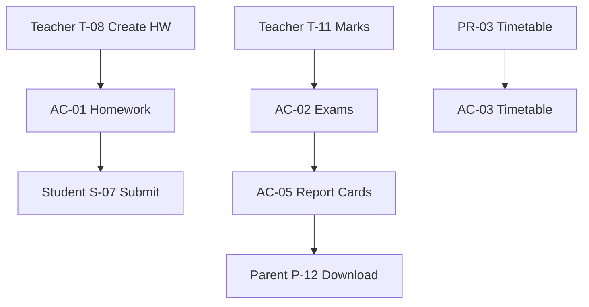

# Akshara ERP — Academic Module Specification (Consolidated)

**Document ID:** `AKS-AC-SPEC-v1.0`  
**Module:** Academic Operations (Core)  
**Screens:** AC-01 → AC-08  
**Platform:** Web (`1440×1024`) · Tablet · Mobile feeds via Student/Teacher/Parent apps  
**Source:** SRS Part 2 §4–7, §9 · Part 12 · Principal.md · Teacher.md · Student.md · Parent.md

---

## Table of Contents

1. [Module Overview](#1-module-overview)
2. [User Roles & Permissions](#2-user-roles--permissions)
3. [Navigation & Information Architecture](#3-navigation--information-architecture)
4. [Shared Shell Layout](#4-shared-shell-layout)
5. [AC-01 — Homework Management](#5-ac-01--homework-management)
6. [AC-02 — Examination Management](#6-ac-02--examination-management)
7. [AC-03 — Timetable Administration](#7-ac-03--timetable-administration)
8. [AC-04 — Online Classes](#8-ac-04--online-classes)
9. [AC-05 — Report Cards](#9-ac-05--report-cards)
10. [AC-06 — Student Attendance Admin](#10-ac-06--student-attendance-admin)
11. [AC-07 — Academic Calendar](#11-ac-07--academic-calendar)
12. [AC-08 — Academic Reports](#12-ac-08--academic-reports)
13. [Dialogs & Wizards](#13-dialogs--wizards)
14. [Cross-Module Links](#14-cross-module-links)
15. [Prototype Flow Map](#15-prototype-flow-map)
16. [Figma Organization](#16-figma-organization)
17. [Build Checklist](#17-build-checklist)

---

## 1. Module Overview

### Purpose

**System of record** for academic operations: homework, exams, timetables, online classes, report cards, and attendance data. Teacher/Student/Parent apps are **consumers**; Principal portal provides **oversight** (SRS Part 2 §4–7, AR-052).

### Ownership Split

| Function | Owner module | Consumer |
|----------|--------------|----------|
| Homework CRUD + submissions | **AC-01** | Teacher T-08/09, Student S-06/07, Parent P-07/08 |
| Exam schedule + marks | **AC-02** | Teacher T-11, Student S-12, Principal PR-08 |
| Master timetable | **AC-03** + PR-03 | Student S-09, Teacher T-12 |
| Online classes | **AC-04** | Student S-10 |
| Report card generation | **AC-05** | Student S-13, Parent P-12 |
| Attendance records | **AC-06** | Teacher T-06, Parent P-06, Principal PR-02 |
| Executive academic summary | MG-04 / PR-08 | Management 👁 |

### Screen Inventory

| ID | Screen | Primary Users | Priority |
|----|--------|---------------|----------|
| AC-01 | Homework Management | Teacher, Academic admin | P0 |
| AC-02 | Examination Management | Teacher, Principal | P0 |
| AC-03 | Timetable Administration | Admin, Principal | P0 |
| AC-04 | Online Classes | Teacher | P1 |
| AC-05 | Report Cards | Principal, Academic admin | P0 |
| AC-06 | Student Attendance Admin | Principal, Admin | P0 |
| AC-07 | Academic Calendar | Principal | P1 |
| AC-08 | Academic Reports | Principal, Management 👁 | P1 |

**Total frames (desktop):** 8 primary + 6 dialogs = **14**

---

## 2. User Roles & Permissions

| Action | Teacher | Class Teacher | Principal | Management |
|--------|---------|---------------|-----------|------------|
| Create homework | ✅ assigned | ✅ | ❌ | ❌ |
| Enter marks | ✅ assigned | ✅ | 👁 | ❌ |
| Publish timetable | ❌ | ❌ | ✅ | ❌ |
| Schedule exams | ❌ | ❌ | ✅ | ❌ |
| Generate report cards | ❌ | ❌ | ✅ | ❌ |
| Override attendance | ❌ | ❌ | ❌ | ❌ |
| View all classes | ❌ | ✅ own class | ✅ | 👁 |
| Export academic reports | ❌ | ❌ | ✅ | 👁 |

---

## 3. Navigation & Information Architecture

### Access Points

Academic module accessed via:
- **Principal shell** nav (primary admin UI)
- **Teacher app** creates homework/marks (mobile-first)
- Deep links from PR-03, PR-08, PR-09

### Side Navigation (Web Academic Shell)

| # | Label | Screen |
|---|-------|--------|
| 1 | Homework | AC-01 |
| 2 | Examinations | AC-02 |
| 3 | Timetable | AC-03 |
| 4 | Online Classes | AC-04 |
| 5 | Report Cards | AC-05 |
| 6 | Attendance | AC-06 |
| 7 | Calendar | AC-07 |
| 8 | Reports | AC-08 |

### Hierarchy

```
AC-01 Homework
├── Submissions review
└── AI worksheet generator
AC-02 Examinations
├── Schedule · Marks entry · Grade rules
└── Weak subject AI panel
AC-03 Timetable (syncs PR-03)
AC-04 Online Classes → Google Meet
AC-05 Report Cards → PDF publish
AC-06 Attendance Admin
AC-07 Academic Calendar
AC-08 Reports
```

---

## 4. Shared Shell Layout

**Component:** `Shell/AcademicLayout` — shares Principal nav rail with academic section highlighted, or embedded in Principal portal PR-09.

---

## 5. AC-01 — Homework Management

| **Frame** | `AC-01-Homework-D` |

### Layout

| # | Section |
|---|---------|
| 1 | Filter bar | Class · Subject · Status · Date |
| 2 | KPI row | Assigned · Submitted · Overdue · Reviewed |
| 3 | Homework table |
| 4 | Detail drawer | Submissions list · per-student status |

### Table Columns

`Title 200 · Class 80 · Subject 100 · Teacher 120 · Due 100 · Submitted 80 · Status 100 · Actions 96`

### Actions

Create (→ Teacher app or web) · Review submission · Send reminder · AI generate worksheet

### Data Flow

Teacher T-08 creates → `homework` table → Student S-07 submits → Parent P-08 views · NT `homework.assigned`

---

## 6. AC-02 — Examination Management

| **Frame** | `AC-02-Examinations-D` |

### Tabs

Schedule · Marks Entry · Grading Rules · Results Publish

### Schedule Table

`Exam 180 · Class 80 · Subject 100 · Date 100 · Max Marks 80 · Status 100 · Actions 96`

### Marks Entry

Grid: students × marks · import CSV · Teacher T-11 mobile entry sync

### AI Panel

Weak subject detection · at-risk students · links to PR-08

---

## 7. AC-03 — Timetable Administration

| **Frame** | `AC-03-Timetable-D` |

**Canonical edit UI shared with PR-03** — AC-03 is admin data layer; PR-03 is principal operational view.

Features: period config · room allocation · teacher assignment · conflict detection · publish workflow

---

## 8. AC-04 — Online Classes

| **Frame** | `AC-04-OnlineClasses-D` |

Google Meet integration (SRS Part 2 §9):

| Field | Description |
|-------|-------------|
| Title | Class session name |
| Meet link | Auto-generated or manual |
| Schedule | Date/time · recurring optional |
| Attendance | Join timestamp tracking |
| Recording URL | Post-class optional |

Student S-10 consumes published sessions.

---

## 9. AC-05 — Report Cards

| **Frame** | `AC-05-ReportCards-D` |

### Wizard Flow

| Step | Content |
|------|---------|
| 1 | Select exam/term · classes |
| 2 | Verify marks completeness |
| 3 | Apply grade template |
| 4 | Principal review |
| 5 | Publish → Student S-13 · Parent P-12 download |

### Template Fields

School header · student info · subject marks · grades · attendance % · remarks · principal signature

---

## 10. AC-06 — Student Attendance Admin

| **Frame** | `AC-06-AttendanceAdmin-D` |

School-wide attendance records · filter by class/date · **read + export** · no manual override (teachers mark via T-06)

Feeds PR-02 analytics and Parent P-06.

---

## 11. AC-07 — Academic Calendar

| **Frame** | `AC-07-Calendar-D` |

Terms · holidays · exam dates · events · syncs PR-09 Academic Planning

---

## 12. AC-08 — Academic Reports

Report cards: Class performance · Subject analysis · Attendance correlation · Homework completion · Export PDF/Excel

---

## 13. Dialogs & Wizards

| ID | Name | Used on |
|----|------|---------|
| AC-D-01 | CreateExam | AC-02 |
| AC-D-02 | PublishResults | AC-02 |
| AC-D-03 | ReportCardWizard | AC-05 |
| AC-D-04 | TimetablePublish | AC-03 |
| AC-D-05 | MeetSchedule | AC-04 |
| AC-D-06 | HomeworkReminder | AC-01 |

---

## 14. Cross-Module Links

| From | To |
|------|-----|
| AC-01 | Teacher T-08/09 · Student S-06/07 · Parent P-07/08 |
| AC-02 | Teacher T-11 · Principal PR-08 |
| AC-03 | Principal PR-03 · PR-10 substitutes |
| AC-05 | Parent P-12 · Student S-13 |
| AC-06 | Teacher T-06/07 · PR-02 |
| AD-06 | StudentSIS SIS-02 | student must exist |
| All publishes | Notifications.md |

---

## 15. Prototype Flow Map



---

## 16. Figma Organization

```
📁 06 — Academic Module
├── AC-01 → AC-08 [D/T]
└── Dialogs AC-D-01 → AC-D-06
```

---

## 17. Build Checklist

| Step | Task |
|------|------|
| 1 | AC-01 homework admin + submission review |
| 2 | AC-02 exam schedule + marks |
| 3 | AC-03 timetable (align PR-03) |
| 4 | AC-05 report card wizard |
| 5 | AC-06 attendance admin |
| 6 | AC-04 online classes |
| 7 | AC-07/08 calendar + reports |
| 8 | Mobile consumer screen alignment |

---

**End of Academic Module Specification v1.0**
