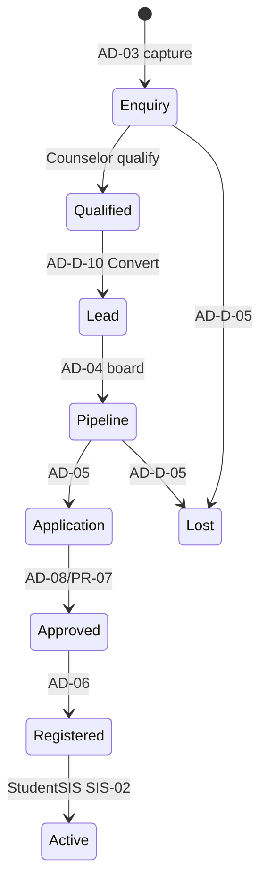
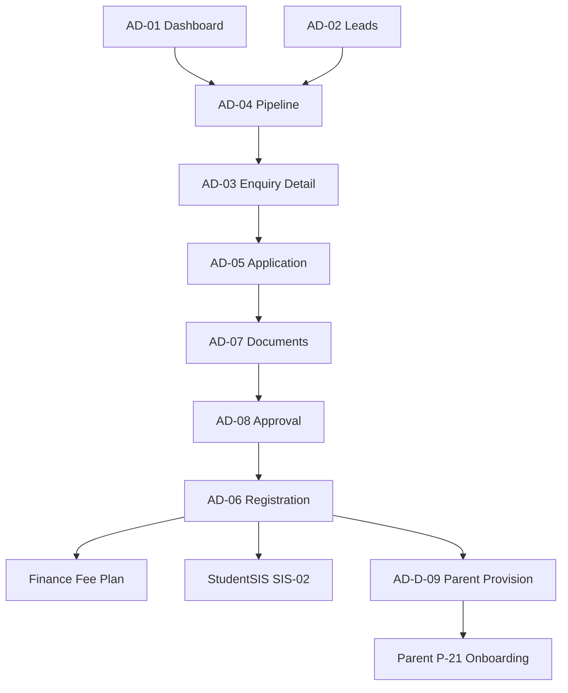

# Akshara ERP — Admissions Module Specification (Consolidated)

**Document ID:** `AKS-AD-SPEC-v1.0`  
**Module:** Admissions CRM  
**Screens:** AD-01 → AD-10  
**Platform:** Web primary (`1440×1024`) · Tablet · Mobile companion  
**Source:** SRS Part 4 §1, Part 6, Part 12 · DesignSystem.md · Finance.md

---

## Table of Contents

1. [Module Overview](#1-module-overview)
2. [User Roles & Permissions](#2-user-roles--permissions)
3. [Navigation & Information Architecture](#3-navigation--information-architecture)
4. [Shared Design Foundation](#4-shared-design-foundation)
5. [Shared Shell Layout](#5-shared-shell-layout)
6. [Shared Components](#6-shared-components)
7. [AD-01 — CRM Dashboard](#7-ad-01--crm-dashboard)
8. [AD-02 — Lead Management](#8-ad-02--lead-management)
9. [AD-03 — Enquiries](#9-ad-03--enquiries)
10. [AD-04 — Pipeline Board](#10-ad-04--pipeline-board)
11. [AD-05 — Applications](#11-ad-05--applications)
12. [AD-06 — Student Registration](#12-ad-06--student-registration)
13. [AD-07 — Document Verification](#13-ad-07--document-verification)
14. [AD-08 — Admission Approvals](#14-ad-08--admission-approvals)
15. [AD-09 — Admission Analytics](#15-ad-09--admission-analytics)
16. [AD-10 — CRM Settings](#16-ad-10--crm-settings)
17. [Dialogs & Wizards](#17-dialogs--wizards)
18. [Cross-Module Links](#18-cross-module-links)
19. [Prototype Flow Map](#19-prototype-flow-map)
20. [Responsive Rules](#20-responsive-rules)
21. [Figma File Organization](#21-figma-file-organization)
22. [Build Checklist](#22-build-checklist)

---

## 1. Module Overview

### Purpose

Digitize end-to-end admissions: lead capture, enquiry tracking, follow-ups, applications, document collection, principal approval, student registration, and conversion analytics (SRS Part 4 §1).

### Lead Ownership (AR-004)

| System | Module | Owns |
|--------|--------|------|
| Acquisition | **Marketing MK-02** | `source`, `campaign_id`, `cpl`, `utm`, acquisition `score` |
| Conversion CRM | **Admissions AD-02/04** | `stage`, `counselor_id`, pipeline, documents, approval |
| Shared key | `lead_id` UUID | Immutable once created |

Marketing **never** writes pipeline `stage` directly. Records enter AD-02 via **MK-D-10 handoff** or **AD-D-10 enquiry conversion**.

### Lead Lifecycle (AR-016)



### Pipeline Stages

```
New Enquiry → Contacted → School Visit → Demo Class → Follow-up → Admission Confirmed → Joined
```

### Screen Inventory

| ID | Screen | Primary Users | Priority |
|----|--------|---------------|----------|
| AD-01 | CRM Dashboard | Marketing Executive, Counselor | P0 |
| AD-02 | Lead Management | Counselor | P0 |
| AD-03 | Enquiries | Counselor | P0 |
| AD-04 | Pipeline Board | Counselor, Marketing | P0 |
| AD-05 | Applications | Counselor | P0 |
| AD-06 | Student Registration | Counselor, Admin | P0 |
| AD-07 | Document Verification | Counselor, Principal | P0 |
| AD-08 | Admission Approvals | Principal, Management 👁 | P0 |
| AD-09 | Admission Analytics | Marketing, Management | P1 |
| AD-10 | CRM Settings | Marketing Executive | P2 |

**Total frames:** 10 primary + 8 dialogs/wizards = **18**

### Lead Sources

Website · Walk-in · Referral · WhatsApp · Facebook · Instagram · Google Ads

---

## 2. User Roles & Permissions

| Action | Counselor | Marketing Exec | Principal | Management |
|--------|-----------|----------------|-----------|------------|
| Create/edit leads | ⚡ assigned | ✅ | ❌ | 👁 |
| Move pipeline | ⚡ assigned | ✅ | ❌ | 👁 |
| Log follow-ups | ✅ | ✅ | ❌ | ❌ |
| Verify documents | ✅ | ✅ | 👁 | ❌ |
| Final admission approve | ❌ | ❌ | 🔒 | 👁 |
| Convert to student | ✅ | ✅ | 🔒 after approve | 👁 |
| View analytics | 👁 | ✅ | 👁 | ✅ |
| WhatsApp send | ✅ | ✅ | ❌ | ❌ |

---

## 3. Navigation & Information Architecture

### Side Navigation

| # | Label | Icon | Screen |
|---|-------|------|--------|
| 1 | Dashboard | `dashboard` | AD-01 |
| 2 | Leads | `contacts` | AD-02 |
| 3 | Enquiries | `contact_phone` | AD-03 |
| 4 | Pipeline | `view_kanban` | AD-04 |
| 5 | Applications | `description` | AD-05 |
| 6 | Registration | `person_add` | AD-06 |
| 7 | Documents | `folder_open` | AD-07 |
| 8 | Approvals | `verified` | AD-08 |
| 9 | Analytics | `analytics` | AD-09 |
| 10 | Settings | `settings` | AD-10 |

### Screen Hierarchy

```
AD-01 Dashboard
├── AD-02 Leads → AD-03 Enquiry Detail
├── AD-04 Pipeline Board
├── AD-05 Applications
├── AD-06 Student Registration (wizard)
├── AD-07 Document Verification
├── AD-08 Approvals → Principal queue
└── AD-09 Analytics
```

---

## 4. Shared Design Foundation

Reference **DesignSystem.md**. Content width desktop `1136`.

**Pipeline stage colors:** New `primary-container` · Visit `warning-container` · Confirmed `success-container` · Lost `error-container`

---

## 5. Shared Shell Layout

**Component:** `Shell/AdmissionsLayout` — same structure as Finance shell with `Nav/Rail-Admissions`.

---

## 6. Shared Components

| Component | Spec |
|-----------|------|
| `CRM/LeadCard` | `256×120` kanban card |
| `CRM/PipelineColumn` | `280px` wide |
| `CRM/ActivityTimeline` | 48px min row |
| `CRM/LeadScoreChip` | Hot error · Warm warning · Cold primary |
| `CRM/StageBadge` | 7 pipeline variants |
| `CRM/WAPreview` | WhatsApp bubble mock |

---

## 7. AD-01 — CRM Dashboard

| **Frame** | `AD-01-CRMDashboard-D` |

### Layout Structure

| # | Section | Size |
|---|---------|------|
| 1 | Filter bar | Period · Counselor · Source |
| 2 | KPI row | 6 × `176×120` |
| 3 | Pipeline preview | Horizontal kanban scroll |
| 4 | Charts | Funnel `560×320` · Source donut `560×320` |
| 5 | Follow-ups due today | Table |
| 6 | Counselor leaderboard | `1136×120` |
| 7 | AI insight card | Conversion recommendations |

### KPI Definitions

| # | Label | Example |
|---|-------|---------|
| 1 | Total Leads (MTD) | 248 |
| 2 | Hot Leads | 34 |
| 3 | Visits Scheduled | 18 |
| 4 | Confirmed | 42 |
| 5 | Joined | 36 |
| 6 | Conversion Rate | 14.5% |

### Follow-ups Table Columns

`Due 100 · Lead 180 · Task 120 · Counselor 120 · Priority 80 · Status 80 · Actions 80`

---

## 8. AD-02 — Lead Management (CRM System of Record)

| **Frame** | `AD-02-LeadManagement-D` |
| **Role** | **Canonical conversion CRM** — pipeline owner after MK handoff |

### Banner

`1136×40`: **"CRM system of record · Acquisition data from Marketing is read-only"**

### Layout Structure

| # | Section |
|---|---------|
| 1 | Filter bar | Source · Stage · Score · **+ New Lead** |
| 2 | Bulk bar | When selected |
| 3 | Leads table | Full CRUD list |
| 4 | Import panel | CSV import collapsed |

### Table Columns

`☐ 48 · ID 90 · Parent/Student 200 · Class 80 · Phone 120 · Source 100 · Campaign 120 · Stage 130 · Counselor 120 · Score 70 · Next F/U 120 · Actions 100`

> `Campaign` column read-only — populated from MK-02 handoff.

### Row Actions

View · Assign · WhatsApp · Log follow-up · Mark lost

---

## 9. AD-03 — Enquiries

| **Frame** | `AD-03-Enquiries-D` |

### Layout Structure

| # | Section |
|---|---------|
| 1 | Filter bar | Date · Source · Status |
| 2 | KPI row | New today · Open · Converted · Lost |
| 3 | Enquiry list table |
| 4 | Detail drawer `400px` | Timeline · notes · quick actions |

### Enquiry Detail Drawer

Parent info · student seeking class · source · counselor · activity timeline · `Schedule Visit` · `Send WhatsApp` · **`Convert to Lead`** (AD-D-10)

---

## 10. AD-04 — Pipeline Board

| **Frame** | `AD-04-PipelineBoard-D` |

### Layout Structure

| # | Section |
|---|---------|
| 1 | Filter bar | Counselor · Class · Source |
| 2 | Kanban | 7 columns × `280px` · horizontal scroll |
| 3 | Column header | Stage name · count badge · + add |
| 4 | Lead cards | Draggable stack |

### Kanban Column Stages

New Enquiry · Contacted · School Visit · Demo Class · Follow-up · Admission Confirmed · Joined

### Lead Card Anatomy

Name · class · source icon · score chip · last activity · days in stage

---

## 11. AD-05 — Applications

| **Frame** | `AD-05-Applications-D` |

### Layout Structure

| # | Section |
|---|---------|
| 1 | Filter bar | Status · Class · **+ New Application** |
| 2 | KPI row | Draft · Submitted · Under review · Approved |
| 3 | Applications table |
| 4 | Application form | Side panel or full page |

### Table Columns

`App ID 100 · Student 180 · Class 80 · Parent 160 · Submitted 110 · Status 120 · Docs 80 · Counselor 120 · Actions 100`

### Application Status

Draft · Submitted · Documents Pending · Under Review · Approved · Rejected

---

## 12. AD-06 — Student Registration

| **Frame** | `AD-06-StudentRegistration-D` |

### Wizard Steps (Full page or Dialog 720)

| Step | Content |
|------|---------|
| 1 | Student personal info |
| 2 | Parent/guardian mapping |
| 3 | Academic assignment (class, section) |
| 4 | Transport/hostel flags |
| 5 | Fee plan selection → Finance link |
| 6 | Generate admission number · confirm |

### Required Fields

Student name · DOB · gender · Aadhaar · parent phone · class · academic year

---

## 13. AD-07 — Document Verification

| **Frame** | `AD-07-DocumentVerification-D` |

### Layout Structure

| # | Section |
|---|---------|
| 1 | Filter bar | Doc type · Status · Class |
| 2 | KPI row | Pending · Verified · Rejected · Missing |
| 3 | Split view | Table `760` · Preview `360` |
| 4 | Verification checklist | Per document type |

### Table Columns

`Lead/Student 180 · Document 140 · Required 80 · Status 100 · Uploaded 120 · Verified By 120 · Actions 96`

### Document Types

Birth Certificate · Aadhaar · Previous marks memo · Transfer cert · Photos · Medical

### Status Chips

Missing · Uploaded · Verified · Rejected

---

## 14. AD-08 — Admission Approvals

| **Frame** | `AD-08-AdmissionApprovals-D` |

### Layout Structure

| # | Section |
|---|---------|
| 1 | Filter bar | Pending · Class |
| 2 | Approval queue table |
| 3 | Detail split | Application summary · doc checklist · fee plan |

### Table Columns

`Student 180 · Class 80 · Counselor 120 · Docs 80 · Fee plan 100 · Submitted 110 · AI Score 80 · Actions 120`

### Principal Actions

Approve · Reject (reason) · Request more documents

> **Approver UI:** Canonical screen is **Principal PR-07** (same queue as AD-08 counselor view).

### Post-approve Flow

→ AD-06 complete registration → Finance fee structure → Student SIS record → Parent account invite

---

## 15. AD-09 — Admission Analytics

| **Frame** | `AD-09-AdmissionAnalytics-D` |

### Layout Structure

| # | Section |
|---|---------|
| 1 | Filter bar | Year · Source · Counselor |
| 2 | KPI row | Conversion · Avg days to join · CPL · Yield |
| 3 | Charts | Funnel · Source bar · Counselor performance · Trend line |
| 4 | Export toolbar |

### Charts

7-stage funnel · Lead source horizontal bar · Monthly conversion line · Time-to-admission box stats

---

## 16. AD-10 — CRM Settings

| **Frame** | `AD-10-CRMSettings-D` |

### Sections

Pipeline stage config · Lead assignment rules · Required documents by class · WhatsApp templates · Notification rules · Integration keys (website form)

---

## 17. Dialogs & Wizards

| ID | Name | Size | Used on |
|----|------|------|---------|
| AD-D-01 | NewLead | 560 | AD-02 |
| AD-D-02 | LogFollowUp | 560 | AD-02, AD-03 |
| AD-D-03 | ScheduleVisit | 560 | AD-03 |
| AD-D-04 | SendWhatsApp | 560 | Multiple |
| AD-D-05 | MarkLost | 400 | AD-02 |
| AD-D-06 | AssignCounselor | 400 | AD-02 |
| AD-D-07 | RegistrationWizard | 720 | AD-06 |
| AD-D-08 | ApproveAdmission | 560 | AD-08 |
| AD-D-09 | ProvisionParentAccount | 560 | AD-06, SIS-06 |
| AD-D-10 | ConvertEnquiryToLead | 400 | AD-03 |

---

## 18. Cross-Module Links

| From | To | Trigger |
|------|-----|---------|
| AD-06 fee step | Finance FN-02 | Fee structure |
| AD-08 approve | StudentSIS SIS-02 | Create active student record |
| AD-06 step 2 | StudentSIS SIS-06 | Parent mapping |
| AD-D-09 | Parent P-21 | Supabase Auth invite + onboarding |
| MK-02 handoff | AD-02 | MK-D-10 → `lead_id` linked (AR-004) |
| AD-03 convert | AD-02 | AD-D-10 enquiry → lead |
| AD-09 analytics | Reports.md | RPT-AD-001 canonical — MG-06/MK-08/DR-07 embed |
| AD-08 approve | Audit.md | `admission.approval.approve/reject` |
| AD-D-04 | Marketing WhatsApp | Template library |
| AD-01 | Management MG-06 | Executive view |
| AD-08 approver UI | Principal PR-07 | Canonical approval queue |
| Any | AI Copilot | Admissions assistant |

---

## 19. Prototype Flow Map



---

## 20. Responsive Rules

| Element | Desktop | Tablet | Mobile |
|---------|---------|--------|--------|
| Kanban | 7 columns scroll | 3 visible | 1 column swipe |
| Detail drawer | 400 right | Bottom sheet | Fullscreen |
| Doc preview | Split 760/360 | Stacked | Fullscreen |
| Wizard | 720 centered | 90% width | Fullscreen steps |

---

## 21. Figma File Organization

```
📁 07 — Admissions CRM
├── Shell · CRM Components
├── AD-01 → AD-10 [D/T/M]
├── Dialogs AD-D-01 → AD-D-08
└── Prototype — Admission Flow
```

---

## 22. Build Checklist

| Step | Task |
|------|------|
| 1 | CRM components (LeadCard, Pipeline, Timeline) |
| 2 | AD-01 + AD-04 pipeline (P0) |
| 3 | AD-02 leads + AD-03 enquiries |
| 4 | AD-05 → AD-08 approval flow |
| 5 | AD-06 registration wizard |
| 6 | AD-07 documents + preview |
| 7 | AD-09 analytics |
| 8 | WhatsApp dialog + templates |
| 9 | Mobile kanban swipe |
| 10 | Full prototype + AI variants |

---

**End of Admissions Module Specification v1.0**
