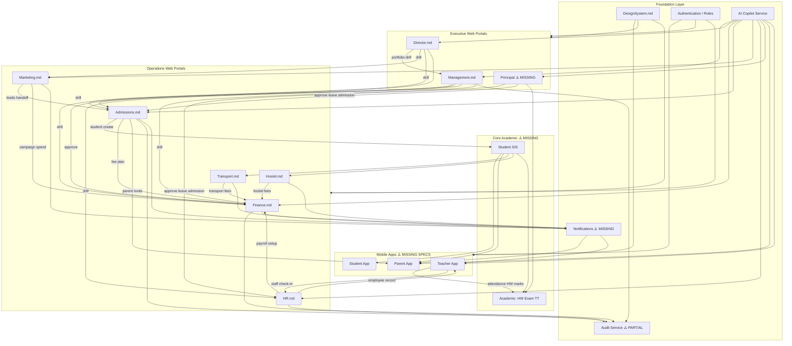
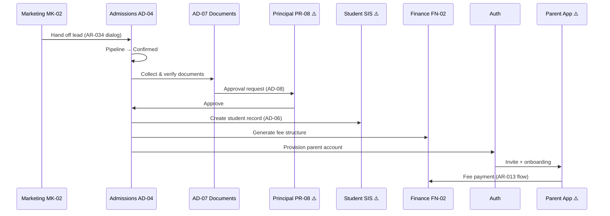
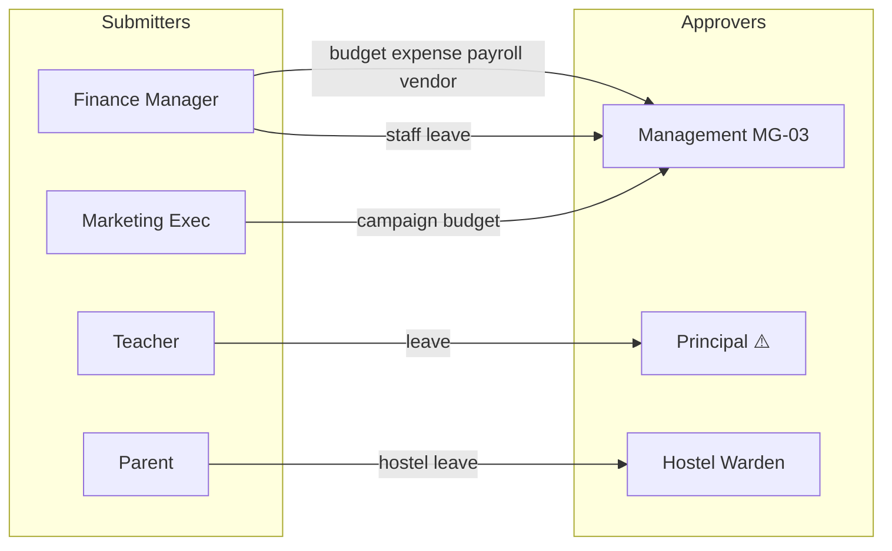
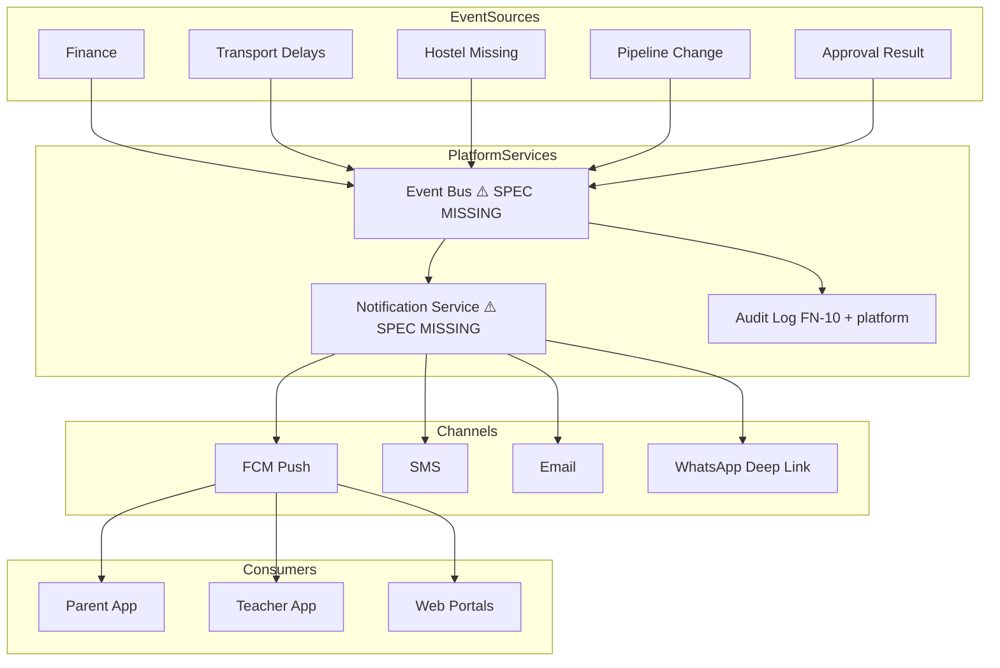

# Akshara ERP — Architecture Review

**Document ID:** `AKS-ARCH-REVIEW-v1.0`  
**Review Date:** June 2026  
**Reviewer Role:** Senior Product Architect / UX Systems  
**Scope:** All files in `/docs` — module specs, design system, SRS parts, index guide

---

## Table of Contents

1. [Executive Summary](#1-executive-summary)
2. [Documents Reviewed](#2-documents-reviewed)
3. [Issue Register](#3-issue-register)
4. [Findings by Category](#4-findings-by-category)
5. [Module Coverage Matrix](#5-module-coverage-matrix)
6. [Canonical Ownership Map](#6-canonical-ownership-map)
7. [ERP Module Dependency Diagram](#7-erp-module-dependency-diagram)
8. [Remediation Roadmap](#8-remediation-roadmap)
9. [Sign-Off Checklist](#9-sign-off-checklist)

---

## 1. Executive Summary

### Overall Assessment

The `/docs` folder establishes a **strong template** via `Finance.md` / `DesignSystem.md` for web admin modules. Nine module specifications exist with consistent structure (TOC, permissions, navigation, screens, dialogs, prototype flows, responsive rules, Figma organization).

### Critical Gaps

| Area | Status |
|------|--------|
| Web admin modules (Finance, Management, Admissions, etc.) | ✅ Documented |
| Mobile apps (Parent, Student, Teacher) | ✅ **Parent.md, Student.md, Teacher.md** |
| Principal Portal | ✅ **Principal.md** |
| Student SIS / Core Academic | ✅ **StudentSIS.md, Academic.md** |
| Unified Notifications | ❌ **Missing** |
| Central Audit Service | ✅ **Audit.md** (FN-10 viewer) |
| Report Catalog | ✅ **Reports.md** |

### Issue Counts

| Severity | Count |
|----------|-------|
| Critical | 12 |
| Major | 28 |
| Minor | 19 |
| **Total** | **59** |

### Top 5 Actions

1. Create `Principal.md` and mobile app specs (`Parent.md`, `Student.md`, `Teacher.md`).
2. Fix Finance navigation typo (Expenses → FN-06 instead of FN-05).
3. Resolve **Marketing vs Admissions lead duplication** with canonical data ownership.
4. Publish `Notifications.md` and extend audit requirements to all approval workflows.
5. Consolidate duplicate finance/admissions/report dashboards into **Executive vs Operational** tiers.

---

## 2. Documents Reviewed

### Module Specifications (Markdown)

| File | Document ID | Screens | Status |
|------|-------------|---------|--------|
| `DesignSystem.md` | AKS-DS-SPEC-v1.0 | — | Complete |
| `finance.md` / `Finance_Module_Specification.md` | AKS-FN-SPEC-v1.0 | FN-01–11 | Complete (reference standard) |
| `Management.md` | AKS-MG-SPEC-v1.0 | MG-01–08 | Complete |
| `Admissions.md` | AKS-AD-SPEC-v1.0 | AD-01–10 | Complete |
| `Transport.md` | AKS-TR-SPEC-v1.0 | TR-01–09 | Complete |
| `Hostel.md` | AKS-HO-SPEC-v1.0 | HO-01–09 | Complete |
| `HR.md` | AKS-HR-SPEC-v1.0 | HR-01–09 | Complete |
| `Marketing.md` | AKS-MK-SPEC-v1.0 | MK-01–10 | Complete |
| `Director.md` | AKS-DR-SPEC-v1.0 | DR-01–09 | Complete |
| `Principal.md` | AKS-PR-SPEC-v1.0 | PR-01–16 | Complete |
| `Notifications.md` | AKS-NT-SPEC-v1.0 | NT-01–06 | Complete |
| `Parent.md` | AKS-P-SPEC-v1.0 | P-01–25 | Complete |
| `Student.md` | AKS-S-SPEC-v1.0 | S-01–20 | Complete |
| `Teacher.md` | AKS-T-SPEC-v1.0 | T-01–22 | Complete |
| `Academic.md` | AKS-AC-SPEC-v1.0 | AC-01–08 | Complete |
| `StudentSIS.md` | AKS-SIS-SPEC-v1.0 | SIS-01–08 | Complete |
| `TechnicalArchitecture.md` | AKS-TECH-ARCH-v1.0 | — | Complete |
| `Audit.md` | AKS-AUDIT-SPEC-v1.0 | — | Complete |
| `Reports.md` | AKS-RPT-CATALOG-v1.0 | — | Complete |
| `Library.md` | AKS-LB-SPEC-v1.0 | LB-01–08 | Complete |
| `Inventory.md` | AKS-INV-SPEC-v1.0 | INV-01–08 | Complete |
| `Alumni.md` | AKS-AL-SPEC-v1.0 | AL-01–10 | Complete |
| `AksharaControlCenter.md` | AKS-ACC-SPEC-v1.0 | ACC-01–12 | Complete |
| `MobileScreenInventory.md` | AKS-MOBILE-INV-v1.0 | — | Complete |

### SRS & Reference (TXT)

`Akshara_ERP_Master_SRS_Part_1` through `Part_20`, `Akshara_School_ERP_SRS_v1.txt`, `Akshara_ERP_Master_Index_Guide.txt`

### Not Present in /docs (SRS expects them)

| Expected Module | SRS Reference |
|-----------------|---------------|
| Principal Portal | Part 8 §6, Part 12 §7 |
| Parent App | Part 8 §4 |
| Student App | Part 8 §3 |
| Teacher App | Part 8 §5 |
| Student SIS | Part 2 §1 |
| Library | Part 3 §13 |
| Inventory | Part 3 §14 |
| Alumni | Part 4 §8 |
| Akshara Control Center | Part 4 §11 |
| Global Notifications | Part 2 §8, Part 12 §18 |

---

## 3. Issue Register

> Format: **ID** · Severity · Category · Summary

| ID | Sev | Category | Summary |
|----|-----|----------|---------|
| AR-001 | Critical | Navigation | Finance nav maps Expenses to FN-06 (Payroll) not FN-05 |
| AR-002 | Critical | Missing Module | Principal Portal referenced but no `Principal.md` |
| AR-003 | Critical | Missing Module | Parent/Student/Teacher apps absent from /docs |
| AR-004 | Critical | Duplicate Screens | MK-02 Lead Management duplicates AD-02 Lead Management |
| AR-005 | Critical | Integration | No Student SIS spec for AD-06 post-approval conversion |
| AR-006 | Critical | Permissions | Teacher leave approval references Principal portal not documented |
| AR-007 | Critical | Notifications | No unified notification architecture across modules |
| AR-008 | Critical | Audit | Audit logs only specified in Finance (FN-10) |
| AR-009 | Major | Duplicate Screens | MG-05 / FN-01 / DR-04 financial dashboards overlap |
| AR-010 | Major | Duplicate Screens | MG-06 / AD-09 / DR-07 / MK-08 admissions analytics overlap |
| AR-011 | Major | Duplicate Screens | MG-08 / DR-09 / FN-11 / MK-09 / HR-08 report centers overlap |
| AR-012 | Major | Integration | Parent account provisioning after admission — flow only, no spec |
| AR-013 | Major | Integration | Razorpay / Parent fee payment flow not documented |
| AR-014 | Major | Approval | MG-03 missing Vendor Payment and Marketing Budget tabs |
| AR-015 | Major | Approval | HO-06 hostel leave approve/reject dialogs not specified |
| AR-016 | Major | Flow | Enquiry (AD-03) vs Lead (AD-02) conversion flow ambiguous |
| AR-017 | Major | Permissions | Marketing Exec ✅ all leads vs Counselor ⚡ assigned — handoff unclear |
| AR-018 | Major | Permissions | Director.md = School Director; Akshara Director platform role undifferentiated |
| AR-019 | Major | Naming | Three finance files: `finance.md`, `Finance_Module_Specification.md` |
| AR-020 | Major | Naming | "Enquiry" vs "Lead" used interchangeably across AD/MK |
| AR-021 | Major | Mobile | Director module has no mobile `[M]` frames |
| AR-022 | Major | Mobile | Per-screen mobile specs missing in most modules (only generic responsive tables) |
| AR-023 | Major | AI | Academic AI (exams, homework, attendance risk) has no module owner |
| AR-024 | Major | Reports | Academic report cards, exam analytics — no module spec |
| AR-025 | Major | Reports | Library, Inventory reports in SRS but no modules |
| AR-026 | Major | Integration | Website sync (Marketing) — no technical or UI integration spec |
| AR-027 | Major | Integration | HR-03 Selected → HR-02 employee → FN-06 payroll onboarding chain incomplete |
| AR-028 | Major | Duplicate Screens | HR-04 Staff Attendance vs Principal staff monitor (undocumented) vs Teacher check-in |
| AR-029 | Minor | Navigation | Marketing has no side-nav link to Admissions CRM |
| AR-030 | Minor | Navigation | Figma folder numbering conflicts (Marketing = 04, overlaps Management unnumbered) |
| AR-031 | Minor | Naming | Shell component names differ per module; not centralized in DesignSystem |
| AR-032 | Minor | Dialogs | AD-D-07 Registration wizard — no Transfer Student / TC dialog |
| AR-033 | Minor | Dialogs | No global `NotificationPreferences` dialog |
| AR-034 | Minor | Dialogs | MK → AD lead handoff confirmation dialog missing |
| AR-035 | Minor | Mobile | MK-06 Poster Studio — no `MK-06-M` frame naming in build checklist |
| AR-036 | Minor | Audit | Marketing WhatsApp broadcast logging not specified |
| AR-037 | Minor | Audit | AD-08 admission approval audit trail not specified |
| AR-038 | Minor | Notifications | Admission stage-change counselor alerts not specified |
| AR-039 | Minor | Notifications | MG-03 approval outcome notification to requester not specified |
| AR-040 | Minor | AI | Transport route optimization — mentioned TR-01, no AI section |
| AR-041 | Minor | AI | Hostel mess menu AI — missing |
| AR-042 | Minor | AI | Director compliance DR-08 — no AI risk scoring |
| AR-043 | Minor | Approval | Substitute teacher workflow (SRS Part 2) — missing entirely |
| AR-044 | Minor | Approval | PTM system (SRS) — missing |
| AR-045 | Minor | Integration | Transport driver as HR employee vs TR-04 driver entity unclear |
| AR-046 | Minor | Integration | Hostel HO-08 billing → Finance fee type link thin |
| AR-047 | Minor | Integration | Director → Management context switch / SSO not specified |
| AR-048 | Minor | Reports | MG-04 School Performance vs Principal exam analytics — no owner |
| AR-049 | Minor | Responsive | HR/Transport/Hostel "companion mobile" — no screen-level `[M]` inventory |
| AR-050 | Minor | Permissions | MG-03 tabs list Budget/Expense/Payroll/Vendor but screen spec shows generic queue |
| AR-051 | Critical | Index | Master Index Guide does not reference new module .md files |
| AR-052 | Major | Flow | Online classes, homework, exams — SRS modules with no specs |
| AR-053 | Major | Flow | Certificate generator workflow — missing |
| AR-054 | Major | Flow | Discipline management parent view — missing |
| AR-055 | Major | Flow | Multi-school Management vs single-school Management portal unclear |
| AR-056 | Minor | DesignSystem | Principal, Parent apps listed in scope but no linked module docs |
| AR-057 | Minor | Dialogs | FN expense approval from Management — no shared `ApprovalDetail` dialog |
| AR-058 | Minor | Notifications | TR-08 delay — channels listed but no template IDs / severity matrix |
| AR-059 | Minor | AI | Finance defaulter prediction AI — FN-03 card only; no Finance AI section |

---

## 4. Findings by Category

### 4.1 Duplicate Screens Across Modules

| Issue ID | Severity | Affected Modules | Description | Recommendation | Proposed Fix |
|----------|----------|------------------|-------------|----------------|--------------|
| AR-004 | **Critical** | Marketing, Admissions | `MK-02 Lead Management` and `AD-02 Lead Management` are parallel lead lists with overlapping columns and actions | Single canonical **Lead entity** with role-based views | Marketing owns **acquisition** (source, campaign, CPL). Admissions owns **conversion** (pipeline, counselor, documents). MK-02 becomes read-only campaign-attributed list with "Hand off to CRM" → AD-02. Add `lead_id` shared key in cross-module doc. |
| AR-009 | **Major** | Management, Finance, Director | MG-05 Financial Overview, FN-01 Dashboard, DR-04 Revenue Overview repeat revenue KPIs/charts | Tier dashboards: **Operational** (FN), **Executive** (MG), **Portfolio** (DR) | Add banner on MG-05/DR-04: "Read-only aggregate." Remove editable actions. MG shows 6 drill cards only. DR shows cross-school compare only. Document diff table in each spec §1. |
| AR-010 | **Major** | Management, Admissions, Marketing, Director | Four admission analytics surfaces | One **source of truth** funnel in AD-09 | MG-06, MK-08, DR-07 become filtered embeds of AD-09 APIs. Delete duplicate chart specs; keep only KPI strip + iframe/deep-link. |
| AR-011 | **Major** | Management, Director, Finance, Marketing, HR | Five "Reports Center" patterns | Enterprise Report Catalog service | Create `Reports.md` with master catalog. MG-08, DR-09, FN-11, MK-09, HR-08 reference catalog IDs. Avoid duplicate preview panes. |
| AR-028 | **Major** | HR, Teacher App, Principal | Staff attendance in HR-04; teacher geo+face in Teacher app (undocumented); Principal monitor referenced in SRS | Split **capture** vs **oversight** | Teacher app: check-in capture. HR-04: admin view + overrides. Principal.md: PR-04 staff monitor (read-only). Document in each spec. |

---

### 4.2 Missing User Flows

| Issue ID | Severity | Affected Modules | Description | Recommendation | Proposed Fix |
|----------|----------|------------------|-------------|----------------|--------------|
| AR-002 | **Critical** | Principal, HR, Admissions, Academic | Principal portal referenced (AD-08, HR-05, MG-04) but not specified | Create `Principal.md` (PR-01–20) per SRS Part 8/12 | Priority screens: Dashboard, Attendance Analytics, Leave Approvals, Admission Approvals, Timetable, Exam Analytics, Announcements, AI Insights. |
| AR-003 | **Critical** | Parent, Student, Teacher | SRS Part 8 defines 3 mobile apps; DesignSystem references them; no specs | Create `Parent.md`, `Student.md`, `Teacher.md` | Follow Finance.md structure. P0: dashboards, attendance, homework, fees, messages. |
| AR-005 | **Critical** | Admissions, SIS, Finance, Parent | AD-08 post-approve: registration → fee plan → SIS → parent invite — no SIS module | Create `StudentSIS.md` or expand AD-06 | Define SIS-01 Student Registry, SIS-02 Promotion, SIS-03 Transfer, shared student_id lifecycle diagram. |
| AR-012 | **Major** | Admissions, Parent, Auth | Parent account invite after Joined stage | Document identity provisioning flow | Add AD-D-09 `ProvisionParentAccount` wizard + Auth integration section in Admissions §18. |
| AR-013 | **Major** | Finance, Parent | Fee payment via Razorpay mentioned in SRS; only Finance record-cash dialogs | End-to-end payment flow | Add `Parent.md` § Fee Payment + Finance webhook status screen FN-12 or section in FN-03. |
| AR-016 | **Major** | Admissions | AD-03 Enquiries vs AD-02 Leads — when does enquiry become lead? | State machine for lead lifecycle | Add diagram: Enquiry → Qualify → Lead (AD-02) → Pipeline (AD-04). AD-D-10 `ConvertEnquiryToLead`. |
| AR-052 | **Major** | Academic, Teacher, Student, Principal | Homework, exams, timetable, online classes in SRS — no module specs | Create `Academic.md` | AC-01 Homework, AC-02 Exams, AC-03 Timetable, AC-04 Online Classes, AC-05 Report Cards. |
| AR-053 | **Major** | Principal, Parent | Certificate generator in SRS Part 2 §11 | Add to Principal.md + Parent view | PR-13 Certificates + P-16 download flow. |
| AR-054 | **Major** | Principal, Parent | Discipline management | Add PR discipline + Parent read-only | PR-14 Behaviour Log; link from Parent.md. |
| AR-055 | **Major** | Management, Director | School Management (single school) vs Director (multi-school) portal boundaries | Clarify roles in both specs | Management.md: "Single school only." Director.md: "Chain/franchise aggregate." Add role switcher rule when user has both roles. |

---

### 4.3 Navigation Inconsistencies

| Issue ID | Severity | Affected Modules | Description | Recommendation | Proposed Fix |
|----------|----------|------------------|-------------|----------------|--------------|
| AR-001 | **Critical** | Finance | Side nav row 5: `Expenses → FN-06` but FN-06 is Payroll; FN-05 is Expenses | Fix nav table | Update Finance.md §3: `5 Expenses → FN-05`, `6 Payroll → FN-06`. |
| AR-029 | **Minor** | Marketing, Admissions | No cross-link in Marketing side nav to Admissions | Add overflow or quick link | Marketing nav item 11: "Admissions CRM" → AD-01 (role-gated). |
| AR-030 | **Minor** | All modules | Figma folder numbers: Marketing=04, Hostel=05, Transport=06, Admissions=07; Management unnumbered | Standardize Figma index | Update `Akshara_ERP_Master_Index_Guide.txt` with folder 01–12 map matching module priority. |
| AR-031 | **Minor** | DesignSystem, All | `Shell/FinanceLayout`, `Shell/ManagementLayout`, etc. not in DesignSystem §9 | Centralize shell variants | Add DesignSystem §9.1 Module Shell Registry table. |

---

### 4.4 Permission Conflicts

| Issue ID | Severity | Affected Modules | Description | Recommendation | Proposed Fix |
|----------|----------|------------------|-------------|----------------|--------------|
| AR-006 | **Critical** | HR, Principal | HR-05: Principal 🔒 approves teacher leave; Principal portal missing | Principal must own approval UI | Principal.md PR-08 Leave Approvals; HR-05 shows read-only for Principal path to PR-08. |
| AR-017 | **Major** | Marketing, Admissions | Marketing ✅ manage all leads; Counselor ⚡ assigned only — conflict at handoff | Define ownership transfer rules | On handoff: `owner_role=counselor`, Marketing gets read-only. Document in both permission matrices. |
| AR-018 | **Major** | Director | School Director (DR) vs Akshara Director (platform) — same doc | Split personas or add variant frames | DR spec §2: two columns "School Director" vs "Akshara Director" with PII rules. Optional DR-XX-Akshara variant frames. |
| AR-050 | **Minor** | Management | MG-03 permissions imply tabbed approvals; layout shows generic queue | Align UI with permissions | MG-03 spec: explicit tabs Budget \| Expense \| Payroll \| Vendor \| Marketing with row types. |

---

### 4.5 Cross-Module Integration Gaps

| Issue ID | Severity | Affected Modules | Description | Recommendation | Proposed Fix |
|----------|----------|------------------|-------------|----------------|--------------|
| AR-007 | **Critical** | All | Notifications referenced piecemeal; no central spec | Create `Notifications.md` | Define event bus, channels (Push/SMS/Email/WhatsApp), templates, deep links per module. |
| AR-008 | **Critical** | Finance, HR, Management, Admissions | Only FN-10 Audit Logs | Central audit service | Create `Audit.md` or DesignSystem §24. All modules log to `audit_events` with FN-10 as viewer. |
| AR-027 | **Major** | HR, Finance | Recruitment → Employee → Payroll chain incomplete | Onboarding integration diagram | HR-D-01 wizard final step: "Initiate Payroll Setup" → FN-06 pre-fill. New employee_id sync rule. |
| AR-026 | **Major** | Marketing | Website sync mentioned, no integration | Add integration section | Marketing.md §18: ERP → Website publish API, news/events/gallery sync UI on MK-05. |
| AR-047 | **Minor** | Director, Management | "Open Management Portal" from DR-02 — no context switch spec | SSO + school context | Document `school_context_id` param when drilling DR → MG. |
| AR-046 | **Minor** | Hostel, Finance | HO-08 billing thin | Deep link spec | HO-08 row action → FN-02 filtered `fee_type=hostel`. |
| AR-045 | **Minor** | Transport, HR | Driver in TR-04 vs Employee in HR-02 | Entity relationship | Document: driver_id FK to employee_id. TR-04 row links to HR-02 drawer. |

---

### 4.6 Naming Inconsistencies

| Issue ID | Severity | Affected Modules | Description | Recommendation | Proposed Fix |
|----------|----------|------------------|-------------|----------------|--------------|
| AR-019 | **Major** | Finance | `finance.md`, `Finance_Module_Specification.md` duplicate | Single canonical file | Keep `Finance.md` as canonical. Delete or redirect duplicates. Update index. |
| AR-020 | **Major** | Admissions, Marketing | Lead vs Enquiry terminology | Glossary in DesignSystem | Add § Glossary: Enquiry (pre-qualification), Lead (CRM record), Application (formal). |
| AR-051 | **Critical** | Index | Master Index Guide lacks new .md specs | Update index | Add Part 21: Module Specifications pointing to all .md files. |

---

### 4.7 Missing Dialogs

| Issue ID | Severity | Affected Modules | Description | Recommendation | Proposed Fix |
|----------|----------|------------------|-------------|----------------|--------------|
| AR-015 | **Major** | Hostel | HO-06 leave requests — no approve/reject dialogs | Add dialogs | HO-D-07 ApproveLeave `400`, HO-D-08 RejectLeave `400` with reason. |
| AR-034 | **Minor** | Marketing, Admissions | Lead handoff has no confirmation | Handoff dialog | MK-D-09 `HandoffToAdmissions` 560: counselor assign + notify. |
| AR-032 | **Minor** | Admissions | Transfer student / TC not in dialog list | Add dialog | AD-D-11 `TransferCertificateRequest` for mid-year transfers. |
| AR-033 | **Minor** | DesignSystem, All | No global notification preferences | Shared dialog | DS-D-01 `NotificationPreferences` in DesignSystem.md. |
| AR-057 | **Minor** | Management, Finance | Shared approval detail across modules | Shared component | `Approval/DetailDialog` 720 in DesignSystem — used by MG-03, AD-08, FN-09. |

---

### 4.8 Missing Mobile / Tablet Behavior

| Issue ID | Severity | Affected Modules | Description | Recommendation | Proposed Fix |
|----------|----------|------------------|-------------|----------------|--------------|
| AR-022 | **Major** | All admin modules | Responsive rules are generic tables; Finance has most detail; others lack per-screen `[M]` inventory | Per-module mobile screen list | Each module add § Mobile Screen Inventory with reduced columns, bottom sheets, FABs. |
| AR-021 | **Major** | Director | DR build checklist: `[D/T]` only — no mobile | Director mobile read-only | DR-01-M: KPI strip + school list cards; no map. |
| AR-049 | **Minor** | HR, Transport, Hostel | "Companion mobile" stated but no frame IDs | Name mobile frames | e.g. `HR-04-StaffAttendance-M`, `TR-06-GPSMonitoring-M` fullscreen map. |

---

### 4.9 Missing Audit Requirements

| Issue ID | Severity | Affected Modules | Description | Recommendation | Proposed Fix |
|----------|----------|------------------|-------------|----------------|--------------|
| AR-008 | **Critical** | All | Audit only in FN-10 | Platform audit standard | Mandate: every write action logs `user_id`, `action`, `before`, `after`, `module`. FN-10 = viewer; MG gets audit KPI. |
| AR-037 | **Minor** | Admissions | AD-08 approval not audited | Log approvals | AD-08: on Approve/Reject → audit event `admission.approval` + principal_id. |
| AR-036 | **Minor** | Marketing | WhatsApp broadcast not audited | Log broadcasts | MK-D-02: log recipient_count, template_id, sender_id. |

**Required audit events (minimum):**

| Module | Events |
|--------|--------|
| Finance | Fee modify, payment record, payroll run, vendor pay |
| Management | Budget/expense/payroll approve/reject |
| Admissions | Stage change, approval, document verify |
| HR | Manual attendance override, employee CRUD |
| Hostel | Missing alert resolution, visitor checkout |
| Transport | Delay notification broadcast |
| Marketing | Bulk WhatsApp, campaign publish |

---

### 4.10 Missing Notification Flows

| Issue ID | Severity | Affected Modules | Description | Recommendation | Proposed Fix |
|----------|----------|------------------|-------------|----------------|--------------|
| AR-007 | **Critical** | All | No unified notification architecture | Create `Notifications.md` | Event catalog + channel matrix + template IDs. |
| AR-038 | **Minor** | Admissions | Stage change counselor alert missing | Pipeline notifications | On AD-04 drag → notify assigned counselor + parent (if Contacted+). |
| AR-039 | **Minor** | Management | Approval outcome not notifying requester | Approval notifications | MG-D-01 on confirm → push/email to Finance submitter. |
| AR-058 | **Minor** | Transport | TR-08 channels without template spec | Template registry | TR-NOTIF-01 delay template bilingual; severity=warning; channels=Push+SMS. |

**Minimum notification matrix to document:**

| Event | Parent | Teacher | Finance | Counselor | Principal |
|-------|--------|---------|---------|-----------|-----------|
| Fee overdue | ✅ | — | ✅ | — | — |
| Bus delay | ✅ | — | — | — | — |
| Hostel missing | ✅ | — | — | — | ✅ |
| Leave approved | — | ✅ | — | — | — |
| Admission approved | ✅ | — | — | ✅ | — |
| Approval rejected | — | — | ✅ | — | — |

---

### 4.11 Missing Reports

| Issue ID | Severity | Affected Modules | Description | Recommendation | Proposed Fix |
|----------|----------|------------------|-------------|----------------|--------------|
| AR-011 | **Major** | Multiple | Duplicate report centers | Central catalog | See AR-011 fix — `Reports.md`. |
| AR-024 | **Major** | Academic, Principal | Exam/report card analytics in SRS | Academic.md + Principal.md | AC-05 Report Cards, PR-11 Exam Analytics. |
| AR-025 | **Major** | Library, Inventory | SRS Part 3 §13–14 — no specs | Future modules | Add to roadmap: `Library.md`, `Inventory.md`. |
| AR-048 | **Minor** | Management, Principal | MG-04 School Performance overlaps Principal academics | Ownership split | MG-04: executive summary. Principal: operational class analytics. |

---

### 4.12 Missing Approval Workflows

| Issue ID | Severity | Affected Modules | Description | Recommendation | Proposed Fix |
|----------|----------|------------------|-------------|----------------|--------------|
| AR-014 | **Major** | Management, Finance, Marketing | Vendor + Marketing budget approvals in permissions but not MG-03 tabs | Complete MG-03 | Add Vendor and Marketing Budget tabs; link FN-07, MK-D-08. |
| AR-015 | **Major** | Hostel | HO-06 leave approval workflow incomplete | Warden approval flow | Parent submit → HO-06 queue → warden approve → gate pass HO-D-07. |
| AR-043 | **Minor** | Principal, HR | Substitute teacher assignment — SRS Part 2 | Principal.md | PR-10 Substitute Manager workflow. |
| AR-044 | **Minor** | Principal, Parent | PTM system — SRS | Principal + Parent | PR-PTM Booking; Parent P-23. |

**Approval workflow registry (target state):**

| Workflow | Submitter | Approver | Documented? |
|----------|-----------|----------|-------------|
| Budget | Finance | Management | ✅ FN-09, MG-03 |
| Expense | Finance | Management | ⚠️ Partial |
| Payroll | Finance | Management | ✅ FN-06, MG-03 |
| Vendor payment (large) | Finance | Management | ❌ Missing in MG-03 |
| Teacher leave | Teacher | Principal | ⚠️ HR-05, no Principal.md |
| Staff leave | Staff | Management | ⚠️ HR-05 only |
| Admission | Counselor | Principal | ✅ AD-08 |
| Hostel leave | Parent | Warden | ⚠️ HO-06 incomplete |
| Marketing budget | Marketing | Management | ❌ MK-D-08 only |

---

### 4.13 Missing AI Assistant Opportunities

| Issue ID | Severity | Affected Modules | Description | Recommendation | Proposed Fix |
|----------|----------|------------------|-------------|----------------|--------------|
| AR-023 | **Major** | Academic, Principal, Teacher | AI in SRS Part 14 for attendance risk, weak subjects — no module home | Distribute AI per role | Principal.md PR-16 AI Hub; Teacher AI in Teacher.md; Academic weak-subject in AC module. |
| AR-059 | **Minor** | Finance | FN-03 AI card only | Finance AI section | Finance.md add § AI Copilot: defaulter prediction, collection forecast, expense anomaly. |
| AR-040 | **Minor** | Transport | Route optimization mentioned once | Transport AI section | TR.md § AI: delay prediction, route optimize, fuel anomaly. |
| AR-041 | **Minor** | Hostel | No AI | Hostel AI | HO.md: occupancy forecast, missing pattern detection, mess cost optimize. |
| AR-042 | **Minor** | Director | Compliance manual only | Compliance AI | DR-08: AI compliance risk score per school. |

**AI opportunity map (recommended):**

| Module | AI Features to Add |
|--------|-------------------|
| Finance | Collection forecast, defaulter scoring, expense anomaly |
| Admissions | Lead scoring, follow-up timing, FAQ bot for parents |
| Marketing | CPL forecast, caption/poster (✅ MK-06), campaign planner |
| HR | Attrition risk (✅ card), recruitment screening assist |
| Transport | Delay prediction, route optimization |
| Hostel | Occupancy, missing alerts, mess planning |
| Management | Executive summary (✅), budget variance explanation |
| Director | Board narrative (✅), churn risk, compliance scoring |
| Principal | *Missing module* — attendance risk, substitute suggest |
| Parent/Teacher/Student | *Missing modules* — copilot per SRS Part 14 |

---

## 5. Module Coverage Matrix

| SRS Module | Spec File | Coverage | Priority Gap |
|------------|-----------|----------|--------------|
| Finance | Finance.md | ✅ Full | — |
| Management | Management.md | ✅ Full | Approval tabs |
| Admissions CRM | Admissions.md | ✅ Full | SIS handoff |
| Marketing CRM | Marketing.md | ✅ Full | Lead dedup |
| Transport | Transport.md | ✅ Full | — |
| Hostel | Hostel.md | ✅ Full | Leave dialogs |
| HR | HR.md | ✅ Full | Principal link |
| Director (chain) | Director.md | ✅ Full | Akshara Director variant |
| Design System | DesignSystem.md | ✅ Full | Shell registry |
| Principal | — | ❌ None | **P0** |
| Parent App | — | ❌ None | **P0** |
| Student App | — | ❌ None | **P0** |
| Teacher App | — | ❌ None | **P0** |
| Student SIS | — | ❌ None | **P0** |
| Academic (HW/Exam/TT) | — | ❌ None | **P1** |
| Notifications | — | ❌ None | **P0** |
| Audit (platform) | Partial FN-10 | ⚠️ Partial | **P0** |
| Library | Library.md | ✅ Full | P2 |
| Inventory | Inventory.md | ✅ Full | P2 |
| Alumni | Alumni.md | ✅ Full | P2 |
| Akshara Control Center | AksharaControlCenter.md | ✅ Full | P1 platform |
| Mobile inventory | MobileScreenInventory.md | ✅ Master | — |

---

## 6. Canonical Ownership Map

Use this to resolve duplicate screens:

| Domain Entity | System of Record | Executive View | Portfolio View |
|---------------|------------------|----------------|----------------|
| Lead (CRM) | **Admissions** AD-02/04 | MG-06 embed | DR-07 embed |
| Lead (Marketing attribution) | **Marketing** MK-02 | — | DR-06 embed |
| Fee / Revenue | **Finance** FN-* | MG-05 drill | DR-04 embed |
| Employee | **HR** HR-02 | MG-07 drill | — |
| Staff attendance | **HR** HR-04 (+ Teacher capture) | MG-07 | — |
| Payroll | **Finance** FN-06 | MG-03 approve | DR-04 cost |
| Approvals | **Management** MG-03 | — | — |
| Admission approval | **Admissions** AD-08 (+ Principal PR) | MG-06 👁 | — |
| Reports | **Reports catalog** (to create) | MG-08 | DR-09 |
| Audit events | **Platform audit** (FN-10 viewer) | MG KPI | DR compliance |
| Notifications | **Notifications** (to create) | — | — |
| Student record | **SIS** (to create) | — | — |
| Bus / Route | **Transport** TR-* | — | — |
| Hostel room/bed | **Hostel** HO-* | — | — |

---

## 7. ERP Module Dependency Diagram

### 7.1 High-Level Module Dependencies

### 7.2 Critical Path: Admission to Active Student

### 7.3 Approval Workflow Dependencies

### 7.4 Data Flow: Notifications & Audit

---

## 8. Remediation Roadmap

### Phase 1 — Critical Fixes (Week 1–2)

| # | Action | Files to Update/Create |
|---|--------|------------------------|
| 1 | Fix Finance nav FN-05/FN-06 typo | `Finance.md` |
| 2 | Update Master Index Guide | `Akshara_ERP_Master_Index_Guide.txt` |
| 3 | Consolidate finance duplicates → `Finance.md` | Delete/alias duplicates |
| 4 | Add Glossary + Shell Registry | `DesignSystem.md` |
| 5 | Document lead ownership Marketing vs Admissions | `Marketing.md`, `Admissions.md` |
| 6 | Create `Principal.md` | New file |
| 7 | Create `Notifications.md` | New file |

### Phase 2 — Core Product Gaps (Week 3–6)

| # | Action | Files |
|---|--------|-------|
| 8 | Create `Parent.md`, `Student.md`, `Teacher.md` | New files |
| 9 | Create `StudentSIS.md` | New file |
| 10 | Create `Academic.md` | New file |
| 11 | Extend MG-03 approval tabs | `Management.md` |
| 12 | Add HO leave dialogs | `Hostel.md` |
| 13 | Platform audit standard | `DesignSystem.md` or `Audit.md` |

### Phase 3 — De-duplication & Polish (Week 7–8)

| # | Action | Files |
|---|--------|-------|
| 14 | Create `Reports.md` catalog | New file |
| 15 | Refactor MG/DR/MK executive screens as embeds | Management, Director, Marketing |
| 16 | Per-module mobile `[M]` screen inventories | All module specs |
| 17 | AI sections for remaining modules | Transport, Hostel, Finance, Director |

### Phase 4 — Roadmap Modules (Backlog)

`Library.md` · `Inventory.md` · `Alumni.md` · `AksharaControlCenter.md`

---

## 9. Sign-Off Checklist

Architecture documentation ready for Figma + development when:

- [x] AR-001 Finance nav corrected
- [x] AR-002 Principal.md created
- [x] AR-003 Mobile app specs created
- [x] AR-004 Lead duplication resolved in docs
- [x] AR-005 Student SIS spec created
- [x] AR-007 Notifications.md created
- [x] AR-008 Platform audit standard published
- [x] AR-009–011 Executive vs operational tiers documented
- [x] AR-051 Master Index updated
- [x] Phase 4 modules (Library, Inventory, Alumni, ACC) created
- [x] Mobile screen inventory published
- [x] AI sections for Finance, Transport, Hostel, Director
- [ ] All approval workflows in registry marked ✅
- [ ] Dependency diagram validated by engineering lead

---

**End of Architecture Review v1.0**

*Generated from review of 36 files in `/docs`. Re-run review after Phase 1 remediation.*
