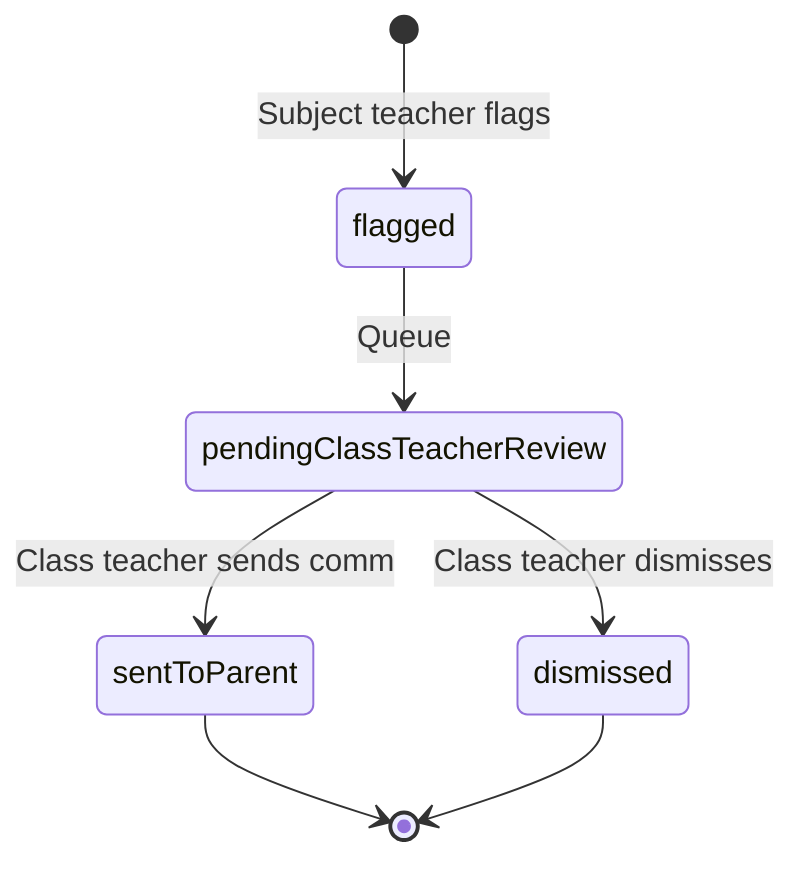
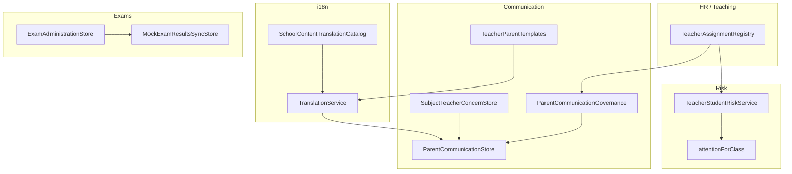

# Architecture Review — Post-Red Team Operational Hardening

**Version:** 1.0  
**Date:** June 2026  
**Branch:** `release/v1.0-preprod`  
**Scope:** Exam administration, parent communication governance, student risk, translation, unified onboarding, backup/restore, school configuration  
**Related:** `docs/RED_TEAM_REMEDIATION_REPORT.md` · `docs/DOCUMENTATION_SYNC_REPORT.md`

---

## Executive summary

Post–Red Team remediation added a **mock-first operational layer** for teacher–parent communication, exam publish propagation, student risk prioritization, bilingual messaging, unified tenant onboarding, and backup/restore architecture. All capabilities share a pattern: **in-memory or hybrid stores** with unit tests; production persistence and Patrol E2E validation remain in progress.

| Capability | Layer | Persistence | Tests |
|------------|-------|-------------|-------|
| Exam Administration Store | Core singleton | In-memory | `exam_administration_chain_test.dart` |
| Parent Communication Governance | Core + feature | In-memory store | `parent_communication_governance_test.dart` |
| Subject Teacher Escalation | Core store | In-memory | Provider + governance tests |
| Student Risk Service | Core service | Mock registry heuristics | Dashboard + risk screen |
| Translation Service | Core i18n | Static catalog | Implicit via comm tests |
| Unified Onboarding | Feature + API | Hybrid (flag off default) | `unified_onboarding_test.dart` |
| Backup & Restore | Admin UI + docs | Stub dialogs | Manual only |
| School Config Sync | Riverpod + prefs | Local only | Existing config tests |

---

## 1. Exam Administration Store

**Path:** `lib/core/exams/exam_administration_store.dart`

### Responsibility

Single source of truth for exam lifecycle state per class/exam:

```
draft → scheduled → marksEntry → processed → published
```

### Integration points

| Consumer | Behavior |
|----------|----------|
| `TeacherExamsProvider` | Marks entry, publish mutation |
| `MockExamResultsSyncStore` | Propagates published marks to student/parent repos |
| `TeacherMutationsProvider` | RBAC-guarded publish action |

### Gaps

- No Supabase/Postgres table; state resets on app restart
- No ERP admin exam scheduling UI
- API teacher repository exists but default mode is mock

---

## 2. Parent Communication Governance

**Paths:**

- `lib/core/communication/parent_communication_governance.dart`
- `lib/core/communication/parent_communication_models.dart`
- `lib/core/communication/parent_communication_store.dart`
- `lib/core/communication/teacher_parent_templates.dart`

### Responsibility

Enforces **class-teacher-only** direct parent messaging. Subject teachers may **flag concerns** for class teacher review (see §3).

### Governance rules

| Actor | Send to parent | Flag concern | View inbox |
|-------|----------------|--------------|------------|
| Class teacher | ✅ | — | ✅ (own class) |
| Subject teacher | ❌ | ✅ | ❌ |
| Principal / VP | Future override | — | ERP only |

### Message model

- Template-first (`TeacherParentTemplate` catalog)
- `TranslatedMessagePair` for bilingual delivery
- Channels: in-app (implemented); SMS/WhatsApp (modeled, not wired)
- Timeline events: sent, delivered, read, acknowledged

### Gaps

- `ParentCommunicationStore` is in-memory
- API parent inbox returns empty in API mode
- No server-side audit trail persistence

---

## 3. Subject Teacher Escalation

**Path:** `lib/core/communication/subject_teacher_concern_store.dart`

### State machine



### UI surfaces

- Subject teacher: **Flag for class teacher** on `TeacherParentCommunicationScreen`
- Class teacher: dashboard banner + resolution via parent comm with `sourceConcernId`

### Gaps

- No push notification to class teacher
- No Patrol E2E for escalation flow

---

## 4. Student Risk Service

**Path:** `lib/core/communication/teacher_student_risk_service.dart`  
**Screen:** `lib/features/teacher/student_risk/teacher_student_risk_screen.dart`

### Risk inputs (mock heuristics)

- Attendance trend
- Homework completion
- Behavior incidents
- Fee status
- Subject performance deltas
- Pending subject-teacher flags
- Recent communication history

### Outputs

- `StudentRiskProfile` with level (low/medium/high) and factor list
- `StudentAttentionItem` list via `attentionForClass()` — **Students requiring attention today**
- Suggested templates with deep-link to parent comm composer

### Gaps

- Not wired to `supabase/functions/_shared/sis/student_360_service.ts`
- API teacher dashboard hardcodes empty attention list
- No principal/ERP equivalent screen

---

## 5. Translation Service

**Paths:**

- `lib/core/i18n/translation_service.dart`
- `lib/core/i18n/school_content_translation_catalog.dart`
- `lib/core/i18n/supported_languages.dart`
- `lib/core/i18n/content_localization.dart`

### Design

- Dictionary-backed (no LLM) for deterministic, token-free translation
- Languages: en, te, hi, ta, kn, ml, ur (~53 catalog phrases)
- `TranslatedMessagePair` wraps bilingual parent messages

### Rollout status

| Surface | Translated |
|---------|------------|
| Parent comm send/preview | ✅ |
| Mock parent notices/exams | ✅ |
| ERP admin screens | ❌ |
| Teacher template catalog UI | ❌ |
| User language preference UI | Partial (per-student map) |

---

## 6. Unified Onboarding

**Paths:**

- `lib/features/onboarding/unified_onboarding_flow_screen.dart`
- `lib/core/onboarding/tenant_onboarding_store.dart`
- `lib/core/repositories/api/startup_onboarding/`
- `supabase/migrations/20260627120000_startup_onboarding.sql`

### Wizard steps

Profile → Curriculum → Fees → Branding → Modules → Review → Go Live

### Persistence

| Mode | Store |
|------|-------|
| Default (`ONBOARDING_API_ENABLED=false`) | `TenantOnboardingStore` (in-memory) |
| API enabled | Hybrid → Supabase `startup_onboarding` table |

### Gaps

- Go-live does not provision live modules server-side
- No Patrol journey
- Onboarding output not auto-applied to `SchoolConfiguration`

---

## 7. Backup & Restore

**Docs:** `docs/BACKUP_RESTORE_ARCHITECTURE.md` · `docs/BACKUP_RESTORE_RUNBOOK.md`  
**UI:** `lib/features/admin/backup/backup_restore_screen.dart`  
**Route:** `/admin/backup-restore`

### Architecture layers (target)

| Layer | Status |
|-------|--------|
| Backup Scheduler | Documented |
| Snapshot Store | Documented |
| Export Service | UI stub |
| Restore Orchestrator | UI stub |
| Audit | Documented |

### Relationship to infra doc

`docs/BACKUP_RECOVERY_ARCHITECTURE.md` covers **Supabase PITR / DevOps** recovery.  
`docs/BACKUP_RESTORE_ARCHITECTURE.md` covers **in-app school/tenant export** vision. Both are valid; see `DOCUMENTATION_SYNC_REPORT.md` § Duplicate Documents.

---

## 8. School Configuration Sync

**Paths:**

- `lib/core/school_config/school_configuration_provider.dart`
- `lib/core/school_config/tenant_school_configuration_store.dart`

### Current behavior

- Riverpod notifier with `SharedPreferences` local cache
- Capability registry drives enabled modules and copilot topics
- Per-tenant in-memory overlay via `TenantSchoolConfigurationStore`

### Gaps

- No remote Supabase sync
- No cross-device tenant config API
- Unified onboarding wizard output not merged into school config

---

## 9. Class Teacher Governance (HR/SIS mapping)

**Path:** `lib/core/teaching/teacher_assignment_registry.dart`

Static seed mapping `HR-EMP-101/102/103` → class/subject assignments drives:

- `TeacherTeachingContextProvider`
- `TeacherParentCommsRole` resolution
- Class teacher dashboard routing

**Gap:** Not synced from HR API or SIS class-teacher assignment tables.

---

## Dependency diagram



---

## Sign-off

| Criterion | Status |
|-----------|--------|
| Architecture documented | ✅ |
| Code paths identified | ✅ |
| Gaps explicit | ✅ |
| Operational workflows | `docs/Operations/workflows/` |
| Roadmap synced | `docs/Roadmap.md` Post-RT section |
