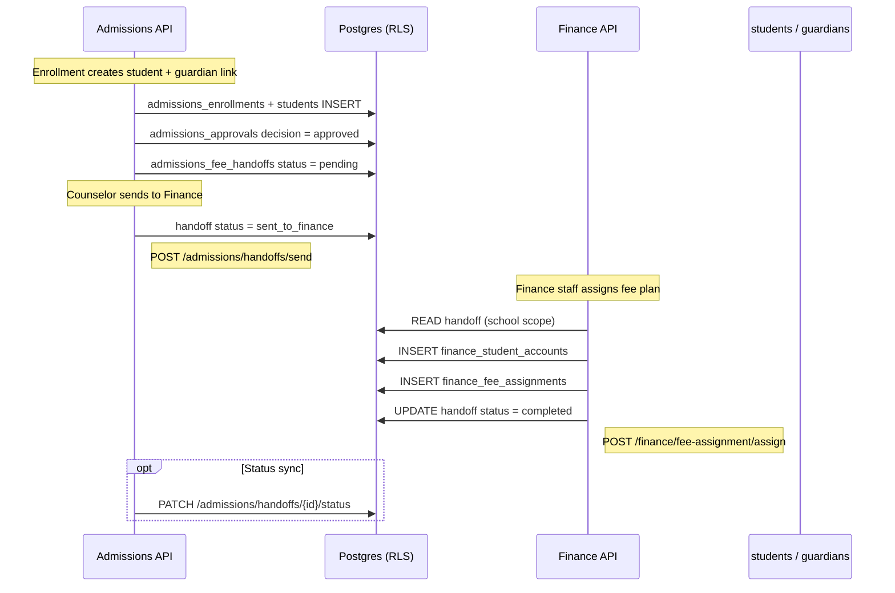

# v6.1 Phase 4A — Finance Implementation Mapping

**Document ID:** `AKS-PHASE4A-FINANCE-MAPPING-v1.0`  
**Status:** Planning only — no migrations, handlers, or deployment  
**Baseline:** Phase 3B Admissions (staging verified, `e90807b`)  
**Authoritative contracts:** `FinanceRepository` (23 methods), `finance_api_paths.dart`, `finance_remote_datasource.dart`

---

## 1. Purpose

Map every Finance API surface from the Flutter client to database schema, RBAC, RLS, cross-module handoffs, and verification gates **before** Phase 4B implementation begins. Finance must follow the same non-negotiables established in Phase 3A/3B:

| Rule | Finance implementation |
|------|------------------------|
| Tenant data via `withTenantContext()` | Required on every handler |
| No `service_role` reads/writes for tenant data | Auth plumbing only |
| `organization_id` / `school_id` from JWT only | Never from body or query |
| Permission middleware on every route | `viewFinance` / `manageFinance` / `approveRefunds` |
| `FORCE ROW LEVEL SECURITY` | All finance operational tables |
| Extend isolation probes | Finance cross-school + org-deny + parent-child |

---

## 2. Finance API inventory (Flutter contracts)

**Repository:** `lib/core/repositories/interfaces/finance_repository.dart`  
**Paths:** `lib/core/repositories/api/finance/remote/finance_api_paths.dart`  
**Envelope:** `{ data, error }` via shared `ApiEnvelopeDto` (lists: `data.items` + `data.pagination`)

**Total methods:** 23 (13 read + 10 write)

### 2.1 Master endpoint table

| # | Repository method | HTTP | Route | Permission | Scope (middleware) | Primary tables | RLS pattern |
|---|-------------------|------|-------|------------|-------------------|----------------|-------------|
| 1 | `getDashboard` | GET | `/finance/dashboard` | `viewFinance` | School operational | `finance_student_accounts`, `finance_collections`, aggregates | `P-SCHOOL-READ` + computed |
| 2 | `getCollections` | GET | `/finance/collections` | `viewFinance` | School operational | `finance_collections` | `P-SCHOOL-READ` |
| 3 | `getDailySummary` | GET | `/finance/collections/daily-summary` | `viewFinance` | School operational | `finance_collections` | `P-SCHOOL-READ` |
| 4 | `getFeeStructures` | GET | `/finance/fee-structures` | `viewFinance` | School operational | `finance_fee_structures`, `finance_fee_structure_lines` | `P-SCHOOL-READ` |
| 5 | `getAcademicYears` | GET | `/finance/academic-years` | `viewFinance` | School operational | `finance_academic_years` | `P-SCHOOL-READ` |
| 6 | `getStudentAccounts` | GET | `/finance/student-accounts` | `viewFinance` | School **or** Parent | `finance_student_accounts` | `P-SCHOOL-READ` / `P-PARENT-CHILD-READ` |
| 7 | `getInstallmentPlans` | GET | `/finance/fee-assignment` | `viewFinance` | School operational | `finance_installment_plans`, `finance_fee_assignments` | `P-SCHOOL-READ` |
| 8 | `getCollectionDetail` | GET | `/finance/collections/{id}` | `viewFinance` | School operational | `finance_collections`, `finance_student_accounts` | `P-SCHOOL-READ` |
| 9 | `getDefaultersDashboard` | GET | `/finance/defaulters` | `viewFinance` | School operational | `finance_student_accounts`, `finance_collections` | `P-SCHOOL-READ` + computed |
| 10 | `getRefundRequests` | GET | `/finance/refunds` | `viewFinance` | School operational | `finance_refunds` | `P-SCHOOL-READ` |
| 11 | `getDiscountsDashboard` | GET | `/finance/discounts` | `viewFinance` | School operational | `finance_scholarships`, `finance_scholarship_assignments` | `P-SCHOOL-READ` |
| 12 | `getReportsData` | GET | `/finance/reports` | `viewFinance` | School operational | computed + `finance_reports_catalog` (optional seed) | `P-SCHOOL-READ` |
| 13 | `getSettings` | GET | `/finance/settings` | `viewFinance` | School operational | `finance_settings` | `P-SCHOOL-READ` |
| 14 | `createFeeStructure` | POST | `/finance/fee-structures` | `manageFinance` | School operational | `finance_fee_structures`, `finance_fee_structure_lines` | `P-SCHOOL-WRITE` |
| 15 | `updateFeeStructure` | PUT | `/finance/fee-structures/{id}` | `manageFinance` | School operational | `finance_fee_structures`, `finance_fee_structure_lines` | `P-SCHOOL-WRITE` |
| 16 | `createStudentAccount` | POST | `/finance/student-accounts` | `manageFinance` | School operational | `finance_student_accounts` | `P-SCHOOL-WRITE` |
| 17 | `updateStudentAccount` | PUT | `/finance/student-accounts/{id}` | `manageFinance` | School operational | `finance_student_accounts` | `P-SCHOOL-WRITE` |
| 18 | `assignFeePlan` | POST | `/finance/fee-assignment/assign` | `manageFinance` | School operational | `finance_fee_assignments`, `finance_student_accounts`, `admissions_fee_handoffs` | `P-SCHOOL-WRITE` + handoff update |
| 19 | `createRefund` | POST | `/finance/refunds` | `manageFinance` | School operational | `finance_refunds` | `P-SCHOOL-WRITE` |
| 20 | `approveRefund` | PATCH | `/finance/refunds/{id}/approve` | `approveRefunds` | School operational | `finance_refunds`, `finance_collections` (optional) | `P-SCHOOL-WRITE` |
| 21 | `createScholarship` | POST | `/finance/scholarships` | `manageFinance` | School operational | `finance_scholarships` | `P-SCHOOL-WRITE` |
| 22 | `updateScholarship` | PUT | `/finance/scholarships/{id}` | `manageFinance` | School operational | `finance_scholarships` | `P-SCHOOL-WRITE` |
| 23 | `updateSettings` | PUT | `/finance/settings` | `manageFinance` | School operational | `finance_settings` | `P-SCHOOL-WRITE` |

**Query parameters (all routes):** `tenantId`, `schoolId`, `organizationId`, `page`, `pageSize` from `RepositoryQuery`.  
**Additional:** `getFeeStructures` sends `academicYear`.

**HTTP note:** Client uses `PUT` for structure/account/scholarship/settings updates and `PATCH` for refund approve — match exactly.

**Deprecated path:** `FinanceApiPaths.installmentPlans` aliases `feeAssignment` — implement **`GET /finance/fee-assignment`** only (not `/installment-plans`).

### 2.2 Scope access rules (middleware layer)

| JWT `scope` | Finance operational endpoints | Org aggregate endpoints |
|-------------|--------------------------------|-------------------------|
| `school` + `school_id` | Allowed when permission slug present | N/A |
| `organization` | **403** on all routes in §2.1 | Future: `GET /finance/org-summary` (not in client contract) |
| `parent` | **Read-only** subset: `getStudentAccounts` (+ future parent fee detail); **403** on all writes and staff dashboards | N/A |
| `student` | **403** on all finance routes | N/A |

Middleware helpers (reuse Admissions pattern):

- `authenticateRequest()` → JWT verify  
- `requirePermission(claims, slug)`  
- `requireSchoolOperationalScope(claims)` — default for staff finance  
- `requireParentFeeScope(claims)` — parent read endpoints only  

**Critical:** Query/body `tenantId`, `schoolId` are diagnostic only; **writes always use `claims.tenant_id` and `claims.school_id`**.

---

## 3. Required database tables

Column convention matches Phase 3B: **`organization_id`** (tenant boundary) + **`school_id`** on all operational rows. Enable RLS + `FORCE ROW LEVEL SECURITY` on each.

### 3.1 Core finance tables

| Table | Purpose | Key columns | FK / notes |
|-------|---------|-------------|------------|
| `finance_academic_years` | School academic year catalog | `id`, `organization_id`, `school_id`, `label`, `is_current`, `status` | Unique `(school_id, label)` |
| `finance_fee_structures` | Fee plan header | `id`, `organization_id`, `school_id`, `name`, `academic_year`, `total_annual`, `class_range`, `status`, `installment_options` (int[]) | |
| `finance_fee_structure_lines` | Category breakdown | `id`, `fee_structure_id`, `category`, `label`, `amount` | FK → `finance_fee_structures` |
| `finance_installment_plans` | Installment templates | `id`, `organization_id`, `school_id`, `label`, `installment_count`, `plan_type` | Used by fee assignment UI |
| `finance_student_accounts` | Per-student ledger | `id`, `organization_id`, `school_id`, `student_id`, `admission_number`, `fee_structure_id`, `installment_plan_id`, `total_due`, `total_paid`, `balance`, `status`, `last_payment_at` | FK → `students`, `finance_fee_structures` |
| `finance_fee_assignments` | Handoff → account link | `id`, `organization_id`, `school_id`, `handoff_id`, `student_account_id`, `fee_structure_id`, `installment_plan_id`, `include_transport`, `include_hostel`, `assigned_by`, `assigned_at` | FK → `admissions_fee_handoffs` |
| `finance_collections` | Payment receipts | `id`, `organization_id`, `school_id`, `student_account_id`, `receipt_number`, `amount`, `mode`, `status`, `collected_by`, `collected_at`, `class_label` | FK → `finance_student_accounts` |
| `finance_refunds` | Refund workflow | `id`, `organization_id`, `school_id`, `fee_account_id`, `amount`, `reason`, `status`, `original_receipt`, `approver`, `approved_at`, `reviewer_note` | Status: `pending`, `approved`, `rejected`, `processed` |
| `finance_scholarships` | Discount catalog | `id`, `organization_id`, `school_id`, `name`, `scholarship_type`, `max_discount`, `eligibility`, `status` | |
| `finance_scholarship_assignments` | Applied scholarships | `id`, `organization_id`, `school_id`, `scholarship_id`, `student_account_id`, `status`, `approved_by` | Powers discounts dashboard |
| `finance_settings` | School finance config | `id`, `organization_id`, `school_id`, `academic_year`, `sections` (jsonb) | One row per school (upsert) |

### 3.2 Cross-module (Admissions-owned, Finance reads/writes status)

| Table | Owner | Purpose |
|-------|-------|---------|
| `admissions_fee_handoffs` | Admissions | Approved student queue for finance; status lifecycle |
| `students` | SIS (existing) | FK target for `finance_student_accounts.student_id` |
| `student_guardians` | SIS (existing) | Parent RLS join for fee visibility |

### 3.3 Aggregate / org-scope (no raw PII)

| View / table | Scope | Purpose |
|--------------|-------|---------|
| `org_finance_summary` | `organization` | School-level totals: collected, outstanding, defaulter count — no student names |
| `org_kpi_snapshots` | `organization` | Future portfolio dashboards (v6.1 architecture) |

### 3.4 `admissions_fee_handoffs` — ✅ deployed (Phase 4B0)

**Migration:** `20260612100000_admissions_fee_handoffs.sql`  
**Report:** `docs/ArchitectureReview/v6.1-Phase4B0-Handoff-Report.md`

```
admissions_fee_handoffs (
  id UUID PK,
  organization_id UUID NOT NULL,
  school_id UUID NOT NULL,
  application_id UUID,
  enrollment_id UUID,
  student_id UUID,
  academic_year TEXT,
  recommended_fee_plan_id TEXT NULL,  -- fee_structure_id from sendToFinance
  handoff_status TEXT CHECK (pending | sent_to_finance | completed | failed),
  student_name TEXT,
  class_label TEXT,
  admission_number TEXT,
  needs_transport BOOLEAN,
  needs_hostel BOOLEAN,
  sis_handoff_label TEXT,
  created_at, updated_at
)
```

**RLS:** School scope only — no org or parent policies. FORCE RLS enabled.

**APIs (live on staging):**

| Client method | Route | Status |
|---------------|-------|--------|
| `getApprovedHandoffs` | `GET /admissions/handoffs/approved` | ✅ |
| `sendToFinance` | `POST /admissions/handoffs/send` | ✅ |
| `updateHandoffStatus` | `PATCH /admissions/handoffs/{id}/status` | ✅ |

Auto-created on `POST /admissions/enrollments` via `createHandoffFromEnrollment`.

---

## 4. Permission mapping

### 4.1 Permission slugs (existing seed)

| Slug | Type | Finance use |
|------|------|-------------|
| `viewFinance` | View | All GET endpoints |
| `manageFinance` | Manage | Create/update structures, accounts, assignments, refunds (create), scholarships, settings |
| `approveRefunds` | Approve | `PATCH /finance/refunds/{id}/approve` only |

No `approveFinance` slug — refund approval is the sole approve-tier finance permission today.

### 4.2 Role → permission matrix (implementation target)

| Role | `viewFinance` | `manageFinance` | `approveRefunds` | Notes |
|------|---------------|-----------------|------------------|-------|
| `schoolAdmin` | ✅ | ✅ | ✅ | Full school finance |
| `financeAdmin` / `financeManager` | ✅ | ✅ | ✅ | Primary operators |
| `principal` | ✅ | ❌ | ❌ | View only (client matrix) |
| `management` | ✅ | ✅ | ❌ | View + manage; refunds need finance approver |
| `organizationAdmin` / `organizationOwner` | ✅ (JWT) | ❌ | ❌ | Aggregate views only — middleware blocks operational routes |
| `parent` | ✅ (target) | ❌ | ❌ | **Seed gap:** add `role_permissions` for `parent` → `viewFinance` |
| `student` | ❌ | ❌ | ❌ | No finance access |
| `teacher` | ❌ | ❌ | ❌ | No finance in current seed |

### 4.3 Client mutation registry alignment

| Mutation ID | Permission | Endpoint |
|-------------|------------|----------|
| `createFeeStructure` | `manageFinance` | POST `/finance/fee-structures` |
| `approveRefund` | `approveRefunds` | PATCH `/finance/refunds/{id}/approve` |
| `createScholarship` | `manageFinance` | POST `/finance/scholarships` |

Other writes use `manageFinance` by RBAC architecture convention (POST/PUT = manage).

---

## 5. RLS design

### 5.1 Policy patterns (reference names)

```
P-SCHOOL-READ / P-SCHOOL-WRITE
  organization_id = app_current_tenant_id()
  AND app_current_scope() = 'school'
  AND school_id = app_current_school_id()

P-PARENT-CHILD-READ (SELECT only)
  organization_id = app_current_tenant_id()
  AND app_current_scope() = 'parent'
  AND school_id = app_current_school_id()
  AND student_id IN (
    SELECT student_id FROM student_guardians
    WHERE guardian_user_id = app_current_parent_user_id()
      AND status = 'active'
  )

P-ORG-AGGREGATE-READ (views only)
  organization_id = app_current_tenant_id()
  AND app_current_scope() = 'organization'
```

**No `organization` policy on operational finance tables** — org admins receive 0 rows under `erp_tenant` (same as `admissions_leads`).

### 5.2 Table → policy matrix

| Table | SELECT school | INSERT/UPDATE school | SELECT parent | SELECT org |
|-------|---------------|----------------------|---------------|------------|
| `finance_fee_structures` | ✅ | ✅ manage via API | ❌ | ❌ |
| `finance_fee_structure_lines` | ✅ (via structure school) | ✅ | ❌ | ❌ |
| `finance_installment_plans` | ✅ | ✅ | ❌ | ❌ |
| `finance_academic_years` | ✅ | ✅ | ❌ | ❌ |
| `finance_student_accounts` | ✅ | ✅ | ✅ linked children | ❌ |
| `finance_fee_assignments` | ✅ | ✅ | ❌ | ❌ |
| `finance_collections` | ✅ | ✅ | ✅ linked children | ❌ |
| `finance_refunds` | ✅ | ✅ | ❌ | ❌ |
| `finance_scholarships` | ✅ | ✅ | ❌ | ❌ |
| `finance_scholarship_assignments` | ✅ | ✅ | ❌ | ❌ |
| `finance_settings` | ✅ | ✅ | ❌ | ❌ |
| `admissions_fee_handoffs` | ✅ | ✅ (status updates) | ❌ | ❌ |
| `org_finance_summary` | ❌ | ❌ | ❌ | ✅ |

### 5.3 Grants for `erp_tenant`

Mirror Admissions Phase 3B:

```sql
GRANT SELECT, INSERT, UPDATE ON finance_* TO erp_tenant;
GRANT SELECT ON org_finance_summary TO erp_tenant;
```

Child tables (`finance_fee_structure_lines`) inherit access through structure FK + matching school scope in policies.

### 5.4 Handler enforcement stack

```
Request
  → JWT verify (service_role auth plumbing only)
  → requirePermission(slug)
  → requireSchoolOperationalScope() | requireParentFeeScope()
  → withTenantContext(claims, db => ...)
  → RLS enforced on erp_tenant connection
```

---

## 6. Admissions → Finance handoff flow

### 6.1 End-to-end sequence



### 6.2 Contract touchpoints

| Step | Module | Method | Route | Permission |
|------|--------|--------|-------|------------|
| List queue | Admissions | `getApprovedHandoffs` | `GET /admissions/handoffs/approved` | `viewAdmissions` |
| Fee structure picker (AD-08) | Admissions | `getFeeStructureOptions` | `GET /admissions/fee-structures` | `viewAdmissions` |
| Send to finance | Admissions | `sendToFinance` | `POST /admissions/handoffs/send` | `manageAdmissions` |
| Assign plan | Finance | `assignFeePlan` | `POST /finance/fee-assignment/assign` | `manageFinance` |
| Complete handoff | Admissions | `updateHandoffStatus` | `PATCH /admissions/handoffs/{id}/status` | `manageAdmissions` or `manageFinance` (decide: **finance may update on assign**) |

### 6.3 `assignFeePlan` request (client contract)

```json
{
  "handoff_id": "uuid",
  "fee_structure_id": "uuid",
  "installment_plan_id": "uuid",
  "include_transport": false,
  "include_hostel": false,
  "student_name": "...",
  "admission_number": "...",
  "class_label": "..."
}
```

**Server rules:**

- Resolve `handoff_id` under school scope; reject if status ∉ `{sent_to_finance, pending}`.
- Create `finance_student_accounts` with `student_id` from handoff; amounts derived from structure + add-ons.
- Set handoff `completed`; return `StudentFeeAccount` DTO (camelCase response).
- Do **not** accept `organization_id` / `school_id` in body.

### 6.4 Implementation dependency

| Dependency | Status | Action |
|------------|--------|--------|
| `students` table | ✅ Phase 2 | FK ready |
| `admissions_enrollments` | ✅ Phase 3B | Provides `student_id`, `admission_number` |
| `admissions_fee_handoffs` table + APIs | ✅ Phase 4B0 deployed | Staging verified 2026-06-12 |
| `GET /admissions/fee-structures` | ❌ | Can proxy to `finance_fee_structures` read-only |

---

## 7. Parent fee visibility flow

### 7.1 Intended behavior (v6.1 architecture)

| Actor | Scope | Can see | Cannot see |
|-------|-------|---------|------------|
| Parent | `parent` + `school_id` | Fee accounts, collections, receipts for **linked children** only | Other students, school dashboards, refunds, settings |
| Student | `student` | **Nothing** in finance module | All finance endpoints → 403 |
| School staff | `school` | Full module per permissions | Other schools |

### 7.2 API surfaces for parents

Phase 4B MVP uses **existing read endpoints** with parent RLS (no separate `/parent/fees` contract):

| Endpoint | Parent access |
|----------|---------------|
| `GET /finance/student-accounts` | ✅ Filtered to linked `student_id`s |
| `GET /finance/collections` | ✅ Filtered via `student_account_id` join |
| `GET /finance/collections/{id}` | ✅ If collection belongs to linked child |
| All other finance GETs | ❌ 403 at middleware (dashboard, defaulters, reports, settings, refunds) |
| All finance writes | ❌ 403 |

### 7.3 RLS implementation

Parent policies on `finance_student_accounts` and `finance_collections` use `student_guardians` join (same pattern as `students_scope_access` in Phase 2).

**Middleware:** Parent calling staff-only routes must fail before DB (`requireSchoolOperationalScope`).

### 7.4 RBAC seed action

Add to Phase 4B migration:

```sql
INSERT INTO role_permissions (role_slug, permission_slug)
VALUES ('parent', 'viewFinance')
ON CONFLICT DO NOTHING;
```

Without this, parent JWT lacks `viewFinance` and receives 403 even with correct RLS.

### 7.5 Phone / guardian linkage

Enrollment already links guardian via `app.lookup_guardian_user_for_enrollment` (Phase 3B). Parent login uses `scope=parent` + `schoolId`; fee rows must reference the same `student_id` created at enrollment.

---

## 8. Organization scope restrictions

| Access type | Mechanism | Example |
|-------------|-----------|---------|
| Raw student fee PII | **Denied** — no RLS policy for `organization` scope on operational tables | `SELECT * FROM finance_student_accounts` → 0 rows |
| School metadata | Allowed (existing `schools` policy) | Org sees school list |
| Finance aggregates | `org_finance_summary` view | Collected MTD, outstanding total per school — no names |
| Operational finance APIs | **403** at middleware (`requireSchoolOperationalScope`) | `GET /finance/dashboard` with org JWT |

**JWT nuance:** `organizationAdmin` carries `viewFinance` in token for future aggregate endpoints; current 23 client methods are **school-scoped** and must reject org scope.

**Cross-school:** School A staff cannot read School B finance rows — RLS `school_id = app_current_school_id()` + isolation probes.

---

## 9. Tenant isolation requirements

### 9.1 Mandatory implementation rules

1. Every finance handler uses `withTenantContext()` — **no exceptions**.
2. Extend `tenant_isolation_probes.ts` after each slice (target **+5** finance probes, 17+ total).
3. `FORCE ROW LEVEL SECURITY` on all tables in §3.1 and `admissions_fee_handoffs`.
4. Staging smoke script: `scripts/finance_staging_smoke.py` (mirror admissions).

### 9.2 Proposed isolation probes

| Probe name | Context | Expect |
|------------|---------|--------|
| `org_scope_denied_raw_finance_student_accounts` | org | count = 0 |
| `school_a_sees_own_finance_accounts` | school A | count ≥ 0 |
| `school_a_cannot_see_school_b_finance_accounts` | school A | cross-school id count = 0 |
| `parent_sees_linked_child_fee_account` | parent @ school A | child account visible |
| `parent_cannot_see_unlinked_student_account` | parent @ school A | school B student = 0 |
| `student_denied_finance_accounts` | student | count = 0 |

### 9.3 Verification gate (Phase 4B exit)

- `/health/tenant-access` all probes pass  
- Finance smoke **E2E**: structure → account → collection → refund approve  
- Handoff E2E: admissions send → finance assign → handoff completed  
- Auth regression: school admin, parent (fee read), student (403)  
- TD-P0-01: Finance module handlers marked closed (alongside Admissions)

---

## 10. Migration plan (vertical slices)

**No migrations in Phase 4A.** Recommended Phase 4B order:

| Slice | Migration prefix | Scope | Deploy + verify |
|-------|------------------|-------|-----------------|
| **0 — Prerequisite** | `20260612100000_admissions_fee_handoffs.sql` | `admissions_fee_handoffs` + admissions handoff APIs (3 routes) | ✅ **Complete** — 23/23 smoke, 17/17 probes |
| **1 — Foundation** | `20260612200000_finance_slice1_structures.sql` | Fee structures + items; GET/POST/PUT/archive | ✅ **Complete** — 21/21 probes, CRUD verified |
| **2 — Accounts** | `20260612300000_finance_slice2_accounts.sql` | Student accounts, fee assignments; assign endpoint; handoff integration | Handoff → account E2E |
| **3 — Collections** | `20260612400000_finance_slice3_collections.sql` | Collections table; list, detail, daily summary, dashboard aggregates | Collection smoke |
| **4 — Refunds** | `20260612500000_finance_slice4_refunds.sql` | Refunds; create + approve | Approve permission probe |
| **5 — Scholarships** | `20260612600000_finance_slice5_scholarships.sql` | Scholarships + assignments; discounts dashboard | |
| **6 — Analytics** | `20260612700000_finance_slice6_analytics.sql` | Defaulters, reports, dashboard completion; `org_finance_summary` view | Org aggregate probe |
| **7 — Parent read** | `20260612800000_finance_slice7_parent_rls.sql` | Parent RLS policies + `parent` role seed | Parent fee visibility smoke |

Each slice: migration → handlers → router wire in `api/index.ts` → extend probes → staging deploy → technical + security reports (Admissions Phase 3B template).

### 10.1 `erp_tenant` grants

Add table grants per slice in same migration file (Admissions pattern).

### 10.2 CI / secrets

Ensure `ERP_TENANT_DATABASE_URL` in GitHub `staging` secrets (lesson from Phase 3B).

---

## 11. Contract-test inventory

### 11.1 Repository contract tests

**File:** `test/contracts/finance/finance_repository_contract_test.dart`  
**Count:** 16 tests

| Test | Method covered |
|------|----------------|
| mock/api implement `FinanceRepository` | interface |
| `getDashboard` DTO mapping | #1 |
| `getCollections` DTO mapping | #2 |
| `getDailySummary` DTO mapping | #3 |
| `getFeeStructures` DTO mapping | #4 |
| `getAcademicYears` DTO mapping | #5 |
| `getStudentAccounts` DTO mapping | #6 |
| `getInstallmentPlans` DTO mapping | #7 |
| `getCollectionDetail` DTO mapping | #8 |
| `getDefaultersDashboard` DTO mapping | #9 |
| `getRefundRequests` DTO mapping | #10 |
| `getDiscountsDashboard` DTO mapping | #11 |
| `getReportsData` DTO mapping | #12 |
| `getSettings` DTO mapping | #13 |
| mock exposes all read methods | #1–13 |
| ApiFinanceRepository via fake Dio | integration sample |

### 11.2 Write contract tests

**File:** `test/contracts/finance/finance_write_contract_test.dart`  
**Count:** 11 tests

| Group | Tests | Methods |
|-------|-------|---------|
| DTO serialization | 5 | create structure, assign plan, create refund, create scholarship, update settings |
| Mock write persistence | 6 | all 10 write methods exercised |

### 11.3 Additional finance tests (staging gate)

| File | Purpose |
|------|---------|
| `test/integration/finance/finance_api_integration_test.dart` | Provider → repository → fake Dio (read + write samples) |
| `test/features/finance/finance_write_tests.dart` | RBAC deny/allow on mutations |
| `test/features/finance/finance_providers_test.dart` | Provider wiring |
| `test/features/finance/finance_phase2_providers_test.dart` | Phase 2 screen providers |

### 11.4 Sprint 3 gate alignment

| Metric | Target |
|--------|--------|
| Finance repository methods | 23/23 implemented on staging |
| Contract tests (finance) | 27 passing locally (16 + 11) |
| Combined module contract gate | 63 total (Admissions 30 + Finance 23 + SIS 10) — finance portion must pass against live API |

**Staging validation:** Extend `scripts/admissions_staging_smoke.py` pattern → `scripts/finance_staging_smoke.py` after slice 6.

---

## 12. Response / request conventions

| Direction | Convention |
|-----------|------------|
| Request body | snake_case (`fee_structure_id`, `academic_year`) |
| Response `data` | camelCase (`feeStructureId`, `academicYear`) per `FinanceMapper` |
| List envelope | `{ data: { items: [...], pagination: { page, pageSize, total, hasMore } }, error: null }` |
| Single object | `{ data: { ...fields }, error: null }` |
| Dashboard / defaulters / discounts | `{ data: { ...composite }, error: null }` |
| Errors | `{ data: null, error: { code, message } }` — HTTP 4xx/5xx |

---

## 13. Out of scope (Phase 4B)

- SIS module APIs  
- Payment gateway / Razorpay live charges (`viewPayments` — future)  
- FN-04–FN-10 screens in full Finance spec (expenses, payroll, ledgers) — not in `FinanceRepository`  
- Multipart receipt upload  
- OpenAPI publish (optional follow-up)

---

## 14. References

| Document | Relevance |
|----------|-----------|
| `docs/DatabaseArchitecture.md` §5 Finance tables | Entity names |
| `docs/RBACArchitecture.md` §3, §6 | Permission tiers |
| `docs/Releases/v6.1-Sprint3-RBAC-Tenant-Architecture.md` §18 | Scope matrix |
| `docs/ArchitectureReview/v6.1-Phase3A-Tenant-Access-Design.md` | `withTenantContext` pattern |
| `docs/ArchitectureReview/v6.1-Phase3B-Staging-Verification.md` | Verification template |
| `docs/Releases/v2.1-Finance-API.md` | Read API paths |
| `docs/ArchitectureReview/v2.6-Finance-Write-API-Audit.md` | Write API paths |
| `docs/TechnicalDebt/TD-P0-01-RLS-Enforcement.md` | Closure criteria |

---

## 15. Phase 4A sign-off checklist

| Item | Status |
|------|--------|
| 23 Finance APIs inventoried with route, permission, scope, tables, RLS | ✅ |
| Database tables defined | ✅ |
| Permission mapping documented | ✅ |
| RLS design documented | ✅ |
| Admissions → Finance handoff flow | ✅ |
| Parent fee visibility flow | ✅ |
| Organization scope restrictions | ✅ |
| Tenant isolation requirements | ✅ |
| Migration slice plan | ✅ |
| Contract-test inventory | ✅ |
| Production code written | ❌ Intentionally deferred to Phase 4B |

## 16. Implementation status (updated 2026-06-12)

| Phase | Deliverable | Status |
|-------|-------------|--------|
| 4A | Finance architecture mapping | ✅ Complete |
| **4B0** | Admissions → Finance handoff foundation | ✅ **Complete** — see `v6.1-Phase4B0-Handoff-Report.md` |
| 4B1 | Finance structures (slice 1) | ✅ **Complete** — `v6.1-Phase4B1-Deployment-Verification.md` |
| 4B2–4B7 | Accounts, collections, refunds, scholarships, analytics, parent read | ❌ Gated on prior slices |

**Next step:** Approve Phase 4B Slice 1 — `20260612200000_finance_slice1_structures.sql` (fee structures, academic years, settings).
