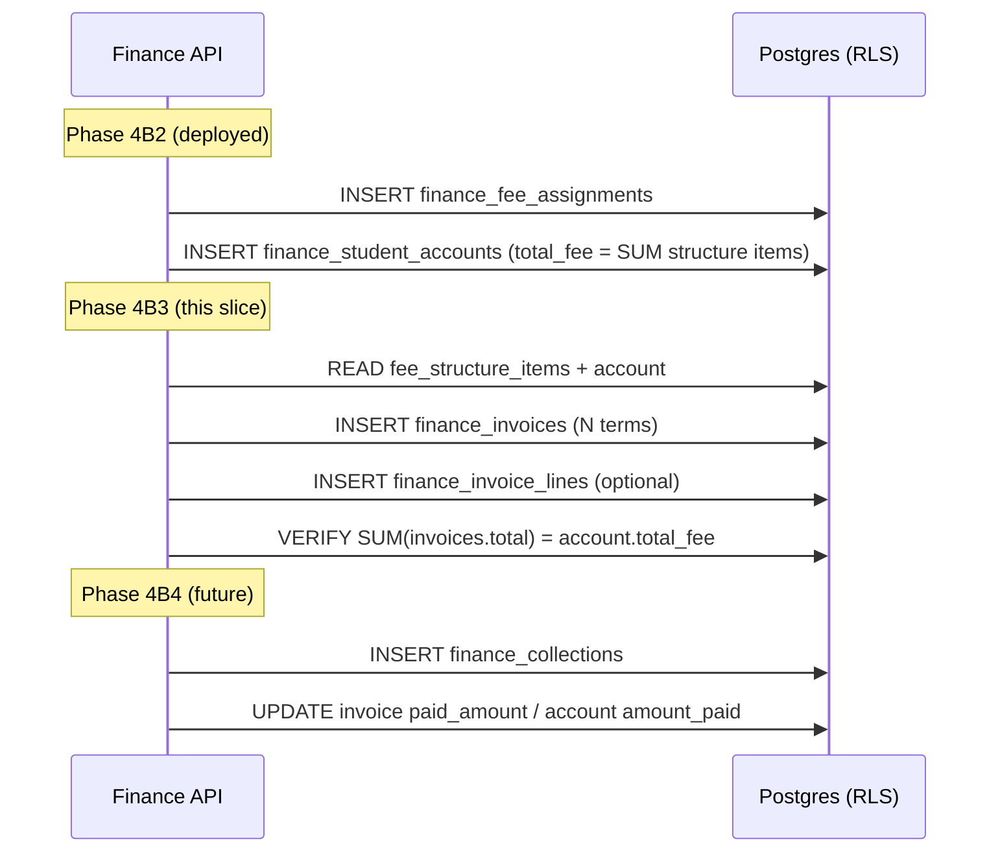

# v6.1 Phase 4B3 — Finance Invoices Architecture Mapping

**Document ID:** `AKS-PHASE4B3-FINANCE-INVOICES-v1.0`  
**Status:** Implemented — backend 4B3A + client 4B3B complete (June 2026)  
**Baseline:** Phase 4B2 deployed and verified (`f037229`, staging `oeicxjpewrumkfgyqnnj`, **27/27** probes)  
**Authoritative upstream:** `v6.1-Finance-Implementation-Mapping.md`, TD-P0-01, deployed 4B0–4B2 schema

---

## 1. Purpose

Define the **student fee invoice** domain between **fee assignment / student account** (4B2) and **collections / receipts** (planned 4B4). Invoices represent **what is due** (demand notices / installment terms); collections represent **what was paid**.

This document is architecture-only. It extends — does not replace — the master Finance mapping.

### Non-negotiables (unchanged)

| Rule | Invoices implementation |
|------|-------------------------|
| `withTenantContext()` on all tenant data | Required |
| No `service_role` for tenant reads/writes | Auth only |
| `organization_id` / `school_id` from JWT only | Never from body/query |
| `FORCE ROW LEVEL SECURITY` | All invoice tables |
| `admissions_fee_handoffs.recommended_fee_plan_id` | **TEXT NULL — do not alter** |

### Terminology

| Term | Meaning in Akshara |
|------|-------------------|
| **Invoice** | School-scoped fee demand for a student (whole year or one installment term) |
| **Collection** | Payment receipt applied to account/invoice(s) — **out of 4B3 scope** |
| **Student account** | Annual ledger summary (`finance_student_accounts`) — deployed 4B2 |
| **Platform invoice** | SaaS billing (`platform_invoices`) — Control Center; **not this module** |

---

## 2. Invoice domain model

### 2.1 Aggregate roots

```
FinanceStudentAccount (4B2)
  └── FinanceFeeAssignment (4B2)
        └── FinanceInvoice[] (4B3)
              └── FinanceInvoiceLine[] (optional breakdown)
```

### 2.2 Entity: `FinanceInvoice`

Represents a billable demand tied to one student account. Maps to client `InstallmentHistoryEntry` and Parent P-09 installment timeline rows.

| Field | Type | Notes |
|-------|------|-------|
| `id` | UUID | PK |
| `organization_id` | UUID | Tenant boundary |
| `school_id` | UUID | School scope |
| `student_id` | UUID | FK → `students` |
| `student_account_id` | UUID | FK → `finance_student_accounts` |
| `fee_assignment_id` | UUID | FK → `finance_fee_assignments` |
| `invoice_number` | TEXT | School-unique per year, e.g. `INV-2026-00042` |
| `academic_year` | TEXT | Copied from account |
| `term_label` | TEXT | e.g. `Term 1`, `Q1`, `Annual` |
| `term_sequence` | INT | 1..N for ordering |
| `due_date` | DATE | Due date for defaulter logic |
| `subtotal_amount` | NUMERIC(12,2) | Before discounts |
| `discount_amount` | NUMERIC(12,2) | Default 0 (scholarships slice later) |
| `total_amount` | NUMERIC(12,2) | Amount due for this invoice |
| `paid_amount` | NUMERIC(12,2) | Sum of allocated collections — updated by 4B4 |
| `outstanding_amount` | NUMERIC(12,2) | `total - paid` |
| `status` | TEXT | See lifecycle §2.4 |
| `issued_at` | TIMESTAMPTZ | When invoice became billable |
| `created_by` | UUID | FK → `users` |
| `created_at` / `updated_at` | TIMESTAMPTZ | |

**Invariant:** `SUM(invoices.total_amount)` for active invoices on an account should equal `student_account.total_fee` (± rounding), unless partial-year assignment or manual adjustment (future).

### 2.3 Entity: `FinanceInvoiceLine` (optional slice 4B3b)

Fee-head breakdown on a single invoice (Parent “select installment / fee head”, FN collection detail).

| Field | Type | Notes |
|-------|------|-------|
| `id` | UUID | PK |
| `invoice_id` | UUID | FK → `finance_invoices` ON DELETE CASCADE |
| `organization_id` | UUID | Denormalized for RLS |
| `school_id` | UUID | Denormalized for RLS |
| `fee_head` | TEXT | Same encoding as `finance_fee_structure_items.fee_head` (`category:label`) |
| `amount` | NUMERIC(12,2) | Line amount |
| `sort_order` | INT | Display order |

### 2.4 Invoice lifecycle

```
draft → issued → partially_paid → paid
                 ↘ overdue (derived or explicit)
                 ↘ void / cancelled
```

| Status | Meaning |
|--------|---------|
| `draft` | Generated but not yet visible to parent / not billable |
| `issued` | Active demand; counts toward outstanding |
| `partially_paid` | `0 < paid_amount < total_amount` |
| `paid` | `paid_amount >= total_amount` |
| `overdue` | `issued` + `due_date < today` + outstanding > 0 (may be computed in queries initially) |
| `void` | Cancelled demand; excluded from outstanding |

**Collections (4B4)** will update `paid_amount` / `outstanding_amount` and cascade account totals.

### 2.5 Client alignment (today)

| Client type | Invoice mapping |
|-------------|-----------------|
| `InstallmentHistoryEntry` | One row per `FinanceInvoice` (`termLabel`, `dueDate`, `amount`, `paidAmount`, `status`) |
| `CollectionDetail.installmentHistory` | List of invoices for account |
| `StudentFeeAccount.balance` | Account-level; invoices sum to explain balance |
| `FinanceRepository` | **No invoice methods today** — contract extension required (§11) |

---

## 3. Required database tables

### 3.1 New tables (Phase 4B3)

| Table | Slice | Purpose |
|-------|-------|---------|
| `finance_invoices` | **4B3 core** | Installment / demand documents |
| `finance_invoice_lines` | **4B3b optional** | Fee-head breakdown per invoice |

### 3.2 Existing tables (read/write in 4B3)

| Table | Phase | 4B3 use |
|-------|-------|---------|
| `finance_student_accounts` | 4B2 ✅ | FK target; outstanding sync |
| `finance_fee_assignments` | 4B2 ✅ | FK target; generation trigger |
| `finance_fee_structures` | 4B1 ✅ | Source totals for split |
| `finance_fee_structure_items` | 4B1 ✅ | Line allocation across terms |
| `students` | 2 ✅ | FK + parent RLS join |
| `student_guardians` | 2 ✅ | Parent RLS join |
| `admissions_fee_handoffs` | 4B0 ✅ | **Read-only** — no schema change |

### 3.3 Proposed DDL sketch (`finance_invoices`)

```sql
finance_invoices (
  id UUID PRIMARY KEY,
  organization_id UUID NOT NULL REFERENCES organizations(id),
  school_id UUID NOT NULL REFERENCES schools(id),
  student_id UUID NOT NULL REFERENCES students(id),
  student_account_id UUID NOT NULL REFERENCES finance_student_accounts(id),
  fee_assignment_id UUID NOT NULL REFERENCES finance_fee_assignments(id),
  invoice_number TEXT NOT NULL,
  academic_year TEXT NOT NULL,
  term_label TEXT NOT NULL,
  term_sequence INT NOT NULL DEFAULT 1,
  due_date DATE NOT NULL,
  subtotal_amount NUMERIC(12,2) NOT NULL,
  discount_amount NUMERIC(12,2) NOT NULL DEFAULT 0,
  total_amount NUMERIC(12,2) NOT NULL,
  paid_amount NUMERIC(12,2) NOT NULL DEFAULT 0,
  outstanding_amount NUMERIC(12,2) NOT NULL,
  status TEXT NOT NULL DEFAULT 'issued'
    CHECK (status IN ('draft','issued','partially_paid','paid','overdue','void')),
  issued_at TIMESTAMPTZ NOT NULL DEFAULT now(),
  created_by UUID NOT NULL REFERENCES users(id),
  created_at TIMESTAMPTZ NOT NULL DEFAULT now(),
  updated_at TIMESTAMPTZ NOT NULL DEFAULT now(),
  UNIQUE (school_id, invoice_number),
  UNIQUE (student_account_id, term_sequence)  -- one invoice per term per account
)
```

Indexes: `(organization_id, school_id)`, `(student_account_id)`, `(student_id, academic_year)`, `(school_id, status, due_date)`.

### 3.4 Deferred tables (not 4B3)

| Table | Phase | Reason |
|-------|-------|--------|
| `finance_installment_plans` | 4B3-prereq or 4B3a | Client sends `installment_plan_id` on assign; not deployed |
| `finance_collections` | 4B4 | Payments apply to invoices |
| `finance_scholarships` | 4B5+ | Discount on invoice lines |

### 3.5 Schema drift vs master mapping doc

| Master doc (4A) | Deployed reality (4B2) | 4B3 action |
|-----------------|------------------------|------------|
| `finance_fee_assignments.handoff_id` | **Not in DB** | Optional follow-up migration; not required for invoices |
| `finance_student_accounts.total_due` | Column is `total_fee` | Map in API layer only |
| `finance_fee_structure_lines` | Table is `finance_fee_structure_items` | Use deployed name |

---

## 4. RLS design

### 4.1 Policy patterns

**School operational (default for staff APIs):**

```sql
organization_id = app_current_tenant_id()
AND app_current_scope() = 'school'
AND school_id = app_current_school_id()
```

**Parent read (SELECT only — 4B3 slice or paired with 4B7):**

```sql
organization_id = app_current_tenant_id()
AND app_current_scope() = 'parent'
AND school_id = app_current_school_id()
AND student_id IN (
  SELECT student_id FROM student_guardians
  WHERE guardian_user_id = app_current_parent_user_id()
    AND status = 'active'
)
```

**Organization / student:** No policies on operational invoice tables (0 rows under `erp_tenant`).

### 4.2 Table → policy matrix

| Table | School SELECT | School INSERT/UPDATE | Parent SELECT | Org SELECT |
|-------|---------------|----------------------|---------------|------------|
| `finance_invoices` | ✅ | ✅ (`manageFinance`) | ✅ linked children | ❌ |
| `finance_invoice_lines` | ✅ | ✅ | ✅ via invoice join | ❌ |

### 4.3 FORCE RLS + grants

```sql
ALTER TABLE finance_invoices FORCE ROW LEVEL SECURITY;
ALTER TABLE finance_invoice_lines FORCE ROW LEVEL SECURITY;
GRANT SELECT, INSERT, UPDATE ON finance_invoices TO erp_tenant;
GRANT SELECT, INSERT, UPDATE, DELETE ON finance_invoice_lines TO erp_tenant;
```

Child lines inherit school scope via matching `organization_id` / `school_id` on insert.

---

## 5. Permission mapping

### 5.1 Existing slugs (no new permissions)

| Operation | Permission | Scope middleware |
|-----------|------------|------------------|
| List / get invoices | `viewFinance` | `requireSchoolOperationalScope()` |
| Generate / void / reissue | `manageFinance` | `requireSchoolOperationalScope()` |
| Parent list child invoices | `viewFinance` | `requireParentFeeScope()` (new helper or existing parent path) |

**No `approveRefunds` / new slugs for 4B3.**

### 5.2 Role matrix

| Role | Staff invoice APIs | Parent invoice read |
|------|-------------------|---------------------|
| `schoolAdmin`, `financeAdmin`, `financeManager` | ✅ view + manage | N/A |
| `principal`, `management` | ✅ view (manage per seed) | N/A |
| `organizationAdmin` | ❌ 403 middleware | ❌ |
| `parent` | ❌ 403 on staff routes | ✅ with RLS + `viewFinance` seed |
| `student` | ❌ 403 | ❌ |

### 5.3 RBAC seed gap (carry-forward from 4A)

Parent invoice visibility requires:

```sql
INSERT INTO role_permissions (role_slug, permission_slug)
VALUES ('parent', 'viewFinance')
ON CONFLICT DO NOTHING;
```

Without this, parent receives **403** even with correct RLS.

---

## 6. Fee Assignment → Invoice flow

### 6.1 End-to-end sequence (target)



### 6.2 Trigger options

| Option | Pros | Cons | Recommendation |
|--------|------|------|----------------|
| **A — Repository hook after assignment** | Same transaction as 4B2 assign; atomic | Extends 4B2 code path | **Preferred for MVP** |
| **B — Explicit POST generate-invoices** | Clear audit boundary | Extra API call; orphan account risk | Secondary / manual reissue |
| **C — DB trigger on account INSERT** | Always consistent | Harder to test; hidden logic | Not recommended |

**Recommended:** Extend `createAssignmentAndAccount()` (or post-commit hook in same `withTenantContext` transaction) to call `generateInvoicesFromAssignment()`.

### 6.3 Installment split algorithm (MVP)

Inputs:

- `finance_student_accounts.total_fee`
- `finance_fee_structure_items[]` (for line split)
- Term count `N` — from request body `installment_plan_id` **or** default `N=1` (single annual invoice) until installment plans table exists

Algorithm:

1. Validate assignment `active` and account `open`.
2. Reject if invoices already exist for `student_account_id` (idempotent guard).
3. For each term `i` in `1..N`:
   - `term_amount = round(total_fee / N, 2)` with remainder on last term
   - `due_date = term_schedule[i]` (configurable offsets from assignment date or settings)
   - INSERT invoice `status = issued`
4. Optionally split each term’s amount across fee heads proportionally into `finance_invoice_lines`.

### 6.4 Handoff path

No change to `admissions_fee_handoffs`. Flow:

1. `assignFromHandoff()` → assignment + account (4B2 ✅)
2. **4B3:** same invoice generation as direct assign
3. Handoff remains `completed` (4B2 ✅)

### 6.5 Void / cancel interaction

| Event | Invoice behavior |
|-------|------------------|
| `cancelAssignment` (4B2) | Void all `issued` invoices for account; set account `closed` |
| Manual void single invoice | `manageFinance`; recalculate account outstanding |

---

## 7. Parent visibility rules

### 7.1 Intended behavior

| Data | Parent can see | Mechanism |
|------|----------------|-----------|
| Invoices for linked child | ✅ | Parent RLS on `finance_invoices` |
| Invoice lines | ✅ | Join / same policy on lines |
| Other students’ invoices | ❌ | RLS |
| Staff invoice list (all students) | ❌ | `requireSchoolOperationalScope` on staff routes |
| Generate / void invoices | ❌ | 403 |

### 7.2 API surfaces (proposed — not in client yet)

| Route | Scope | Permission |
|-------|-------|------------|
| `GET /finance/invoices?studentId=` | Parent | `viewFinance` + parent scope |
| `GET /finance/student-accounts/{id}/invoices` | School | `viewFinance` + school |
| `GET /finance/invoices/{id}` | School or parent (if linked) | Dual middleware path |

**Staff dashboards** (defaulters, reports) remain school-only — invoices feed 4B6 analytics, not parent.

### 7.3 UI mapping

| Screen | Data source |
|--------|-------------|
| Parent P-09 Fee Overview | Invoices + account summary |
| Parent P-10 Fee Payment | Select issued invoice / term |
| FN Collection Detail installment table | Invoices for account |

---

## 8. Organization restrictions

| Access | Mechanism | Result |
|--------|-----------|--------|
| Raw invoice rows with student PII | No org RLS policy | 0 rows |
| `GET /finance/invoices` with org JWT | `requireSchoolOperationalScope()` | **403** |
| Portfolio aggregates | Future `org_finance_summary` (4B6) | Counts/amounts only — no names, no invoice numbers |

**Cross-school:** School A cannot read School B invoices — school_id RLS + probes.

---

## 9. Tenant isolation probes

**Baseline:** 27 probes (post 4B2). **Target after 4B3:** **33 probes** (+6).

| Probe name | Context | Expect |
|------------|---------|--------|
| `school_a_cannot_see_school_b_finance_invoices` | school A | cross-school invoice id count = 0 |
| `organization_denied_finance_invoices` | org | count = 0 |
| `parent_denied_unlinked_student_invoices` | parent @ school A | school B student invoice = 0 |
| `parent_sees_linked_child_invoice` | parent @ school A | probe child invoice ≥ 1 |
| `student_denied_finance_invoices` | student | count = 0 |
| `school_a_sees_own_finance_invoices` | school A | count ≥ 1 (probe fixture) |

Probe fixtures: mirror 4B2 pattern — School A / School B invoice rows tied to probe accounts `b8100000-...`.

---

## 10. Contract test inventory

### 10.1 Current client gap

`FinanceRepository` has **23 methods** — **zero invoice methods**. Phase 4B3 requires a **contract extension** (Flutter follow-up slice; not blocking backend architecture).

### 10.2 Proposed repository methods (for alignment doc)

| Method | HTTP (proposed) | Maps to |
|--------|-----------------|---------|
| `getInvoices` | `GET /finance/invoices` | Paginated list (school) |
| `getInvoice` | `GET /finance/invoices/{id}` | Detail + lines |
| `getInvoicesForAccount` | `GET /finance/student-accounts/{id}/invoices` | Installment history |
| `generateInvoices` | `POST /finance/student-accounts/{id}/invoices/generate` | Manual / reissue |
| `voidInvoice` | `PATCH /finance/invoices/{id}/void` | Void demand |

Parent app may use `getInvoicesForAccount` with parent JWT + `studentId` filter.

### 10.3 DTO mapping target

Response camelCase per `FinanceMapper` conventions:

```json
{
  "id": "uuid",
  "invoiceNumber": "INV-2026-00001",
  "termLabel": "Term 1",
  "dueDate": "2026-04-15",
  "amount": "12500",
  "paidAmount": "0",
  "outstandingAmount": "12500",
  "status": "issued",
  "studentAccountId": "uuid",
  "lines": [{ "feeHead": "tuition:Annual Tuition", "amount": "10000" }]
}
```

Aligns with `InstallmentHistoryEntry` fields.

### 10.4 Existing tests to extend (implementation phase)

| File | Action |
|------|--------|
| `test/contracts/finance/finance_repository_contract_test.dart` | Add invoice DTO tests when client extended |
| `test/contracts/finance/finance_write_contract_test.dart` | generate / void serialization |
| `supabase/functions/_shared/finance/finance_invoices_repository_test.ts` | New — generation, void, duplicate guard |
| `scripts/finance_staging_smoke.py` | New — assignment → invoices → parent deny → org deny |

### 10.5 Deno unit tests (backend, 4B3 implementation)

- `generateInvoicesFromAssignment` — N terms, sum = total_fee
- Duplicate generation blocked
- Void cascades outstanding
- `invoiceToApi` mapper round-trip
- Permission / scope helpers (reuse 4B2 pattern)

---

## 11. Vertical slice plan

| Slice | Migration prefix | Scope | Verify |
|-------|------------------|-------|--------|
| **4B3a — Core** | `20260612400000_finance_slice3_invoices.sql` | `finance_invoices` table, RLS, probes, auto-generate on assign (N=1 default) | Assign → 1 invoice; 33 probes |
| **4B3b — Lines + multi-term** | `20260612410000_finance_invoice_lines.sql` | `finance_invoice_lines`; split across N terms; optional `installment_plan_id` on assignment | Sum lines = invoice; 3-term split |
| **4B3c — APIs** | (handlers only) | GET list/detail, GET by account, PATCH void | Smoke + contract tests |
| **4B3d — Parent read** | `20260612420000_finance_invoice_parent_rls.sql` | Parent RLS policy + `parent`/`viewFinance` seed | Parent sees child; staff-only write 403 |
| **4B4 — Collections** | separate mapping | Payments → invoice `paid_amount` | Not 4B3 |

Each slice: migration → repository → handlers → router → probes → staging deploy → reports (4B0–4B2 template).

**Recommended migration filename for 4B3 core:** `20260612400000_finance_slice3_invoices.sql`  
*(Renumbered from master doc “slice 3 collections” — invoices precede collections in Sprint 3 Phase 4B3 naming.)*

---

## 12. Prerequisites and architecture gaps

### 12.1 Hard prerequisites (must resolve before or during 4B3a)

| # | Gap | Severity | Resolution |
|---|-----|----------|------------|
| P1 | **No invoice tables** | Blocker | 4B3 migration |
| P2 | **Invoice generation not wired to assignment** | Blocker | Hook in `createAssignmentAndAccount` |
| P3 | **Installment plan not persisted** — client sends `installment_plan_id`; 4B2 ignores | High | MVP: default N=1; 4B3b add plan table or store on assignment |
| P4 | **No client `FinanceRepository` invoice methods** | Medium | Document + Flutter follow-up; backend can ship first |
| P5 | **Parent `viewFinance` seed** | Medium | Migration in 4B3d |
| P6 | **`requireParentFeeScope()` helper** | Medium | Add to `permission_middleware.ts` for parent invoice GETs |

### 12.2 Soft gaps (document, defer)

| # | Gap | Notes |
|---|-----|-------|
| G1 | `finance_fee_assignments` lacks `handoff_id` | Audit trail only; not blocking invoices |
| G2 | Account status `open/closed` vs client `active/overdue/pending` | API mapper maps `open` → `active` (4B2 pattern) |
| G3 | Scholarships / discounts on invoices | 4B5+ |
| G4 | Late fee calculation | Settings slice / rules engine |
| G5 | PDF invoice / receipt generation | Out of scope |
| G6 | Payment gateway (Razorpay) | v7.0 / Parent P-10 |
| G7 | TD-P0-01 doc stale (still says Finance not started) | Update after 4B3 deploy |

### 12.3 Conflicts with master mapping slice order

Master `v6.1-Finance-Implementation-Mapping.md` §10 listed **Slice 3 = Collections**. Sprint governance now inserts **4B3 = Invoices** before collections. **Approved resequencing:**

```
4B0 Handoff → 4B1 Structures → 4B2 Assignments → 4B3 Invoices → 4B4 Collections → …
```

Update master doc §10 at implementation approval (architecture-only task does not edit master doc unless requested).

### 12.4 DRIFT watchlist (do NOT implement in 4B3)

| Proposed change | Why blocked |
|-----------------|-------------|
| Alter `recommended_fee_plan_id` to UUID/FK | Explicit constraint through 4B2 |
| Org-scope invoice read API | Violates org PII rules |
| Student-scope invoice access | Spec: student 403 on all finance |
| New permission slug `viewInvoices` | Use existing `viewFinance` |

---

## 13. API route summary (proposed — 4B3c)

| Method | Route | Permission | Scope |
|--------|-------|------------|-------|
| GET | `/finance/invoices` | `viewFinance` | School |
| GET | `/finance/invoices/{id}` | `viewFinance` | School or parent (linked) |
| GET | `/finance/student-accounts/{id}/invoices` | `viewFinance` | School or parent |
| POST | `/finance/student-accounts/{id}/invoices/generate` | `manageFinance` | School |
| PATCH | `/finance/invoices/{id}/void` | `manageFinance` | School |

Auto-generate on assign: internal repository call — no separate route required for happy path.

---

## 14. Verification gate (4B3 exit)

| Gate | Target |
|------|--------|
| `/health/tenant-access` | 33/33 probes |
| Assign → account → invoice(s) E2E | Sum = `total_fee` |
| Void assignment → invoices voided | Account closed |
| Org / parent / student staff routes | 403 |
| Parent child invoice read | 200 (after 4B3d) |
| Deno tests | All shared finance tests pass |
| `recommended_fee_plan_id` | Unchanged TEXT NULL |
| TD-P0-01 | Finance invoice handlers use `withTenantContext` |

---

## 15. References

| Document | Relevance |
|----------|-----------|
| `docs/ArchitectureReview/v6.1-Finance-Implementation-Mapping.md` | Master finance map |
| `docs/ArchitectureReview/v6.1-Phase4B0-Handoff-Report.md` | Handoff lifecycle |
| `docs/ArchitectureReview/v6.1-Phase4B1-Deployment-Verification.md` | Structures |
| `docs/ArchitectureReview/v6.1-Phase4B2-*` (deploy report pending file) | Assignments baseline `f037229` |
| `docs/TechnicalDebt/TD-P0-01-RLS-Enforcement.md` | Tenant enforcement |
| `docs/Parent.md` §10 | Parent fee / installment UX |
| `lib/features/finance/finance_models.dart` | `InstallmentHistoryEntry` |
| `lib/core/repositories/interfaces/finance_repository.dart` | Contract gap |
| `supabase/migrations/20260612300000_finance_slice2_fee_assignments.sql` | Deployed schema |

---

## 16. Sign-off checklist (4B3 architecture)

| Item | Status |
|------|--------|
| Invoice domain model defined | ✅ |
| Required tables specified | ✅ |
| RLS design documented | ✅ |
| Permission mapping (no new slugs) | ✅ |
| Fee assignment → invoice flow | ✅ |
| Parent visibility rules | ✅ |
| Organization restrictions | ✅ |
| Isolation probes planned (+6) | ✅ |
| Contract test inventory | ✅ |
| Vertical slice plan | ✅ |
| Prerequisites / gaps identified | ✅ |
| Migrations / handlers / deploy | ❌ Intentionally excluded |

**Next step:** Review and approve this mapping → implement Phase 4B3a (core invoices + auto-generate on assign).
