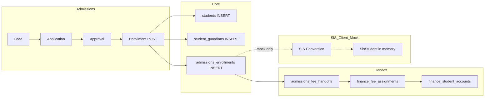

# v6.1 Phase 5A — SIS Foundation Architecture Mapping

**Document ID:** `AKS-PHASE5A-SIS-FOUNDATION-v1.0`  
**Status:** Planning only — no migrations, handlers, or deployment  
**Baseline:** Phase 4B7 Finance Dashboard (`53/53` tenant probes), Admissions Slices 1–4 + handoffs deployed  
**Authoritative contracts:** `SisRepository` (11 methods), `sis_api_paths.dart`, `sis_remote_datasource.dart`

---

## 1. Purpose

Audit the current student lifecycle across Admissions, Finance, and the Flutter SIS module; identify gaps; and define Phase 5A scope (Student Master, Directory, Enrollment Management) **before** any implementation.

Non-negotiables (same as Finance phases):

| Rule | SIS Phase 5A requirement |
|------|--------------------------|
| Tenant data via `withTenantContext()` | Required on every handler |
| No `service_role` reads/writes for tenant data | Auth plumbing only |
| `organization_id` / `school_id` from JWT only | Never from body or query |
| Permission middleware on every route | `viewSis` / `manageSis` (see §8 DRIFT) |
| `requireSchoolOperationalScope` | Org / Parent / Student → **403** before DB |
| `FORCE ROW LEVEL SECURITY` | All new SIS operational tables |
| Extend isolation probes | Per new table + cross-school |

---

## 2. Architecture Audit

### 2.1 Current student lifecycle



| Stage | System | Student record state |
|-------|--------|----------------------|
| Lead / Application | Admissions | No `students` row |
| Approval | Admissions | No `students` row |
| **Enrollment submit (API)** | Admissions backend | **`students` created immediately** (`status=active`, `student_code`, `display_name`) |
| Guardian link | Admissions backend | `student_guardians` if phone matches existing `users` row |
| Enrollment record | Admissions | `admissions_enrollments` with demographics, class/section/year text, `admission_number`, `conversion_status=pending` |
| Finance handoff | Admissions → Finance | `admissions_fee_handoffs` denormalizes class/admission# |
| Fee assignment | Finance | `finance_fee_assignments` + `finance_student_accounts` FK → `students.id` |
| SIS conversion (mock) | Flutter mock | Creates rich `SisStudent` when staff converts pending enrollment |
| SIS conversion (API) | **Not implemented** | Backend already created `students` at enrollment — conversion is a **status sync + profile enrichment** gap |

### 2.2 Admissions → Enrollment → Student path

**Handler:** `handleSubmitEnrollment` → `POST /admissions/enrollments`  
**Repository:** `submitEnrollment()` in `admissions_repository.ts`

| Step | Action | Table |
|------|--------|-------|
| 1 | Normalize phone → lookup guardian | `app.lookup_guardian_user_for_enrollment(phone)` → `users.id` |
| 2 | Generate `student_code` (`STU-…`), `admission_number` (`ADM-YYYY-…`) | — |
| 3 | Insert minimal student | `students` (`organization_id`, `school_id`, `student_code`, `display_name`, `status`) |
| 4 | Link guardian (if found) | `student_guardians` |
| 5 | Insert enrollment form snapshot | `admissions_enrollments` |
| 6 | Approve linked application (optional) | `admissions_applications.status = approved` |
| 7 | Create finance handoff | `admissions_fee_handoffs` |

**Important:** No parent **creation** — lookup-only. No `user_id` on student at enrollment. No roll number. Class/section stored as **text** on `admissions_enrollments`, not on `students`.

### 2.3 Existing student tables

#### `students` (`20260609100000_phase2_rls_scope.sql`)

| Column | Notes |
|--------|-------|
| `id` | UUID PK |
| `organization_id`, `school_id` | Tenant scope |
| `user_id` | Nullable — student login (not set at enrollment) |
| `student_code` | Internal code; UNIQUE `(school_id, student_code)` |
| `display_name` | Display name only |
| `status` | `active`, `inactive`, `transferred`, `alumni` |
| `created_at`, `updated_at` | |

**Missing for SIS master:** `admission_number`, `roll_number`, `gender`, `date_of_birth`, `email`, `phone`, `created_by`.

**RLS today:**

| Policy | Operation | Scope |
|--------|-----------|-------|
| `students_scope_access` | SELECT | School staff (own school), parent (linked children), student (self) |
| `students_school_insert` | INSERT | School only (added for admissions enrollment) |

**Gap:** No UPDATE/DELETE policy — school staff cannot update student master via `erp_tenant` today.

#### `student_guardians`

| Column | Notes |
|--------|-------|
| `student_id` | FK → `students` ON DELETE CASCADE |
| `guardian_user_id` | FK → `users` |
| `relationship`, `is_primary`, `status` | |
| `organization_id`, `school_id` | |

**RLS:** SELECT for school + parent (own links); INSERT for school only.

**Gap:** No UPDATE policy for changing primary guardian or deactivating links.

#### `users` (parent identity)

Parents are `users` rows located by `phone`. Profile JSONB may hold display metadata. No dedicated `parents` or `guardians` table.

### 2.4 Existing enrollment tables

#### `admissions_enrollments` (`20260611400000_admissions_slice4_approval_enrollment.sql`)

| Column | SIS relevance |
|--------|---------------|
| `student_id` | Links to canonical student |
| `guardian_user_id` | Optional parent user |
| `student_name`, `guardian_name`, `phone`, `gender`, `date_of_birth` | Demographics snapshot |
| `seeking_class`, `section`, `academic_year` | Initial class placement (text) |
| `admission_number` | Generated at enrollment |
| `conversion_status` | `pending` / `converted` / `failed` — **never updated by backend today** |
| `application_id` | Optional admissions link |

**Purpose:** Admissions workflow record + finance handoff source. **Not** a substitute for ongoing SIS enrollment management.

#### No `classes`, `sections`, or `academic_years` tables

Class/section/year appear as free-text across:

- `admissions_leads.class_label`
- `admissions_applications.class_label`
- `admissions_enrollments.seeking_class`, `section`, `academic_year`
- `admissions_fee_handoffs.class_label`, `academic_year`
- `finance_fee_structures.academic_year`, `class_label`

### 2.5 Finance linkage to students

| Table | FK | Display metadata source |
|-------|-----|-------------------------|
| `finance_fee_assignments` | `student_id` → `students` | — |
| `finance_student_accounts` | `student_id` → `students` | Joins `students.display_name` + latest `admissions_fee_handoffs` for admission#, class |
| `finance_invoices` | via assignment | — |
| `finance_collections` | `student_id` | Joins `students` + handoff lateral for name |
| `finance_refunds` | via collection | Same join pattern |

Finance **depends on `students.id`** but reads admission/class from **handoff denormalization**, not SIS master.

### 2.6 Flutter SIS module (client-only backend)

| Layer | Status |
|-------|--------|
| Screens | Dashboard, Registry, Profile, Academic Assignment, Admissions Conversion |
| `SisRepository` | 11 methods (5 read + 6 write) |
| `ApiSisRepository` | Wired; throws when API unreachable |
| `sisApiEnabledProvider` | `false` (same pattern as pre-4B6 Finance) |
| Backend `supabase/functions/_shared/sis/` | **Does not exist** |
| `api/index.ts` routes | auth, admissions, finance only |

**Client-defined paths** (`sis_api_paths.dart`):

| Path | Client usage |
|------|--------------|
| `GET /sis/dashboard` | Dashboard KPIs |
| `GET /sis/students` | Registry list |
| `GET /sis/students/:id` | Profile |
| `POST /sis/students` | Register student |
| `PUT /sis/students/:id` | Update profile |
| `PATCH /sis/students/:id/status` | Status lifecycle |
| `GET /sis/academic-assignment` | Class/section/year options |
| `POST /sis/academic-assignment` | Assign academic placement |
| `GET /sis/admissions-conversion` | Pending conversion queue |
| `POST /sis/admissions-conversion` | Convert enrollment |

---

## 3. Gap Analysis

### 3.1 Capability matrix

| Capability | Exists | Partial | Must create (5A) |
|------------|--------|---------|------------------|
| **Student master profile** | `students` (minimal) | Demographics on `admissions_enrollments` only | Extend master + profile store |
| **Admission number** | `admissions_enrollments.admission_number` | Not on `students` | Promote to SIS master |
| **Roll number** | — | — | New field on enrollment |
| **Current class / section** | Text on `admissions_enrollments` | Not authoritative post-enrollment | `sis_student_enrollments` |
| **Status lifecycle** | `students.status` (4 values) | Client has `prospect` enum — mismatch | Align enum + UPDATE API |
| **Academic year mapping** | Text fields | No catalog table | Enrollment row per year (5A); catalog optional |
| **Guardian linkage** | `student_guardians` + lookup | No guardian create; contact on enrollment text | Read/write linkage via SIS; optional profile denorm |
| **Student directory (list)** | — | Finance lists via fee-assignments bridge | `GET /sis/students` |
| **Student detail** | — | Profile screen mock | `GET /sis/students/:id` |
| **Student search / filter** | — | — | Query params on list |
| **Assign class / section** | Admissions text at enroll | Academic assignment screen mock | `POST/PUT /sis/enrollments` |
| **Update enrollment** | — | — | `PUT /sis/enrollments/:id` |
| **Student promotion** | — | — | **Out of scope** |
| **Student transfer** | `students.status=transferred` exists | No workflow | **Out of scope** |
| **Admissions conversion** | `conversion_status` column | Never updated server-side | 5A: mark converted + seed SIS enrollment |
| **SIS dashboard** | Client mock | — | **Out of scope 5A** |
| **Attendance / Exams / Timetable** | — | — | **Out of scope** |

### 3.2 Dual student-creation paths (critical gap)

| Mode | When student created | Risk |
|------|---------------------|------|
| **API admissions enrollment** | At `POST /admissions/enrollments` | SIS `createStudent` may duplicate if not guarded |
| **Mock admissions + mock SIS** | At SIS conversion | Diverges from production |

**Resolution for 5A:** SIS `POST /sis/students` is for **manual registration** (non-admissions path). Admissions path must **enrich** existing `students` row, not re-insert. Conversion API sets `conversion_status=converted` and creates `sis_student_enrollments` from `admissions_enrollments` data.

### 3.3 Permission naming gap

Phase 5A brief references `viewStudents` / `manageStudents`. Deployed RBAC uses **`viewSis` / `manageSis`** (`20260608100000_rbac_foundation.sql`, `permissions.dart`). See §12 DRIFT FLAGS.

---

## 4. Phase 5A Scope (locked)

### 4.1 In scope

#### Student Master
- Student profile (display name, demographics)
- Admission number (canonical on master)
- Roll number (per academic enrollment)
- Current class, section, academic year (via current enrollment row)
- Status (`active`, `inactive`, `transferred`, `alumni` — align DB + client)
- Guardian linkage (read + assign primary via `student_guardians`)

#### Student Directory
- `GET /sis/students` — paginated list
- `GET /sis/students/:id` — detail
- Search: `q` (name, admission number)
- Filters: `classLabel`, `section`, `status`, `academicYear`

#### Enrollment Management
- `GET /sis/enrollments` — list enrollments (filter by student, year, class)
- `POST /sis/enrollments` — assign class + section + year (+ roll number)
- `PUT /sis/enrollments/:id` — update placement / roll / status

#### Admissions bridge (minimal)
- On conversion: update `admissions_enrollments.conversion_status`
- Seed first `sis_student_enrollments` from enrollment snapshot
- **Do not** create duplicate `students` row

### 4.2 Explicitly out of scope

| Area | Defer to |
|------|----------|
| Attendance | Phase 5B+ |
| Exams, marks, report cards | Phase 5B+ |
| Timetable | Phase 5B+ |
| Promotion workflows | Phase 5C+ |
| Transfer workflows (beyond status field) | Phase 5C+ |
| Parent portal APIs | Phase 6+ |
| Teacher portal | Phase 6+ |
| SIS dashboard aggregates | Phase 5B |
| Analytics / exports | Phase 5B+ |
| Normalized `classes` / `sections` catalog tables | Phase 5B (optional); 5A uses text labels matching admissions |
| Parent user provisioning | Identity phase |
| Student login provisioning (`user_id`) | Identity phase |

---

## 5. Proposed Schema

### 5.1 Reuse (extend, do not replace)

| Table | Phase 5A change |
|-------|-----------------|
| `students` | Add columns OR companion profile (see 5.2) |
| `student_guardians` | Add UPDATE policy for school scope |
| `admissions_enrollments` | Read-only for conversion source; UPDATE `conversion_status` only |

### 5.2 New / extended tables

#### Option A (recommended): `student_profiles` — 1:1 with `students`

Keeps `students` as stable identity anchor (Finance FKs unchanged).

```sql
CREATE TABLE student_profiles (
  id UUID PRIMARY KEY DEFAULT gen_random_uuid(),
  organization_id UUID NOT NULL REFERENCES organizations (id),
  school_id UUID NOT NULL REFERENCES schools (id),
  student_id UUID NOT NULL REFERENCES students (id) ON DELETE CASCADE,
  admission_number TEXT NOT NULL,
  gender TEXT NOT NULL DEFAULT '',
  date_of_birth TEXT NOT NULL DEFAULT '',
  email TEXT NOT NULL DEFAULT '',
  phone TEXT NOT NULL DEFAULT '',
  address TEXT NOT NULL DEFAULT '',
  created_by UUID NOT NULL REFERENCES users (id),
  created_at TIMESTAMPTZ NOT NULL DEFAULT timezone('utc', now()),
  updated_at TIMESTAMPTZ NOT NULL DEFAULT timezone('utc', now()),
  UNIQUE (school_id, admission_number),
  UNIQUE (student_id)
);
```

#### `sis_student_enrollments` — academic placement per year

```sql
CREATE TABLE sis_student_enrollments (
  id UUID PRIMARY KEY DEFAULT gen_random_uuid(),
  organization_id UUID NOT NULL REFERENCES organizations (id),
  school_id UUID NOT NULL REFERENCES schools (id),
  student_id UUID NOT NULL REFERENCES students (id) ON DELETE CASCADE,
  academic_year TEXT NOT NULL,
  class_label TEXT NOT NULL,
  section TEXT NOT NULL DEFAULT '',
  roll_number TEXT NOT NULL DEFAULT '',
  enrollment_status TEXT NOT NULL DEFAULT 'active'
    CHECK (enrollment_status IN ('active', 'completed', 'transferred', 'exited')),
  is_current BOOLEAN NOT NULL DEFAULT true,
  source_enrollment_id UUID REFERENCES admissions_enrollments (id),
  created_by UUID NOT NULL REFERENCES users (id),
  created_at TIMESTAMPTZ NOT NULL DEFAULT timezone('utc', now()),
  updated_at TIMESTAMPTZ NOT NULL DEFAULT timezone('utc', now()),
  UNIQUE (student_id, academic_year)
);
```

**Indexes:**
- `(organization_id, school_id)`
- `(school_id, academic_year, class_label, section)` — directory filters
- `(student_id)` WHERE `is_current = true` — partial unique optional

**`students` extensions (minimal ALTER):**
- `created_by UUID REFERENCES users (id)` — audit
- Optional: `admission_number` on `students` instead of profile if team prefers single table (document decision at implementation kickoff)

### 5.3 Tables explicitly NOT created in 5A

- `classes`, `sections`, `academic_years` (normalized catalogs)
- `attendance_*`, `exam_*`, `timetable_*`
- `student_promotions`, `student_transfers`

### 5.4 Standard columns checklist

| Requirement | `student_profiles` | `sis_student_enrollments` |
|-------------|-------------------|---------------------------|
| `organization_id` | ✅ | ✅ |
| `school_id` | ✅ | ✅ |
| `created_at` / `updated_at` | ✅ | ✅ |
| `created_by` | ✅ | ✅ |
| Appropriate indexes | ✅ | ✅ |
| FORCE RLS | ✅ | ✅ |
| School-scope policies only | ✅ | ✅ |

---

## 6. Proposed APIs

### 6.1 Route inventory (Phase 5A backend)

Align brief routes with client contracts. **Canonical routes for implementation:**

| # | Method | Route | Permission | Scope | Repository mapping |
|---|--------|-------|------------|-------|-------------------|
| 1 | GET | `/sis/students` | `viewSis` | School | `getStudents` |
| 2 | GET | `/sis/students/:id` | `viewSis` | School | `getStudentProfile` |
| 3 | POST | `/sis/students` | `manageSis` | School | `createStudent` |
| 4 | PUT | `/sis/students/:id` | `manageSis` | School | `updateStudent` |
| 5 | PATCH | `/sis/students/:id/status` | `manageSis` | School | `updateStudentStatus` |
| 6 | GET | `/sis/enrollments` | `viewSis` | School | New list method |
| 7 | POST | `/sis/enrollments` | `manageSis` | School | `assignAcademicAssignment` (remap) |
| 8 | PUT | `/sis/enrollments/:id` | `manageSis` | School | New update method |
| 9 | POST | `/sis/admissions-conversion` | `manageSis` | School | `convertAdmissionsEnrollment` |

**Deferred (5B):** `GET /sis/dashboard`, `GET /sis/academic-assignment` (options catalog)

### 6.2 Query parameters — `GET /sis/students`

| Param | Type | Description |
|-------|------|-------------|
| `page`, `pageSize` | int | Pagination |
| `q` | string | Search name, admission number, roll number |
| `classLabel` | string | Filter current enrollment |
| `section` | string | Filter |
| `status` | string | `students.status` |
| `academicYear` | string | Filter current enrollment year |

### 6.3 Request/response shapes (summary)

**List student (directory item):**
```json
{
  "id": "uuid",
  "studentName": "...",
  "admissionNumber": "ADM-2026-...",
  "classLabel": "5",
  "section": "A",
  "academicYear": "2026-27",
  "rollNumber": "12",
  "status": "active",
  "gender": "male",
  "enrolledAt": "2026-06-09"
}
```

**Profile detail:** directory fields + guardian summary + current enrollment id + optional finance summary (read-only join, no new finance APIs).

**Create student (`POST /sis/students`):** maps `CreateStudentRequest` — creates `students` + `student_profiles` + initial `sis_student_enrollments`.

**Assign enrollment (`POST /sis/enrollments`):** maps `AcademicAssignmentRequest` — upserts enrollment row, sets `is_current=true`, clears prior current flag for same student.

### 6.4 Client path reconciliation

| Client path today | Phase 5A backend | Action |
|-------------------|------------------|--------|
| `POST /sis/academic-assignment` | `POST /sis/enrollments` | Add backend route; alias or update client in alignment phase |
| `GET /sis/academic-assignment` | Deferred | Client keeps mock options until catalog API |
| `PATCH .../status` | Keep | Matches client |
| `GET /sis/dashboard` | Deferred 5B | Hybrid mock fallback |

---

## 7. Permission Matrix

### 7.1 Middleware permissions (use deployed slugs)

| Route group | Read | Write |
|-------------|------|-------|
| `/sis/students` | `viewSis` | `manageSis` |
| `/sis/enrollments` | `viewSis` | `manageSis` |
| `/sis/admissions-conversion` | `viewSis` | `manageSis` |

### 7.2 Role grants (existing seed — no new permissions in 5A)

| Role | viewSis | manageSis | 5A access |
|------|---------|-----------|-----------|
| superAdmin, schoolAdmin | ✅ | ✅ | Full |
| principal, vicePrincipal | ✅ | ✅ | Full |
| classTeacher, coordinator, admissionsCounselor | ✅ | — | Read + directory |
| management, orgAdmin, orgOwner, schoolGroupDirector | ✅ | — | **403 at middleware** (org scope) |
| parent | ✅ (DB) | — | **403 at middleware** for operational SIS APIs |
| student | ✅ (DB) | — | **403 at middleware** |
| financeAdmin | — | — | No SIS access |

**Note:** Parent/student have `viewSis` in RBAC seed but Phase 5A operational APIs are **school staff only** via `requireSchoolOperationalScope`. Future parent-scoped read APIs are a separate phase with dedicated RLS paths.

### 7.3 Flutter mutation registry (existing)

| Mutation | Permission |
|----------|------------|
| `registerStudent` | `manageSis` |
| `assignAcademic` | `manageSis` |

---

## 8. Security Design

### 8.1 Middleware chain (every SIS handler)

```
authenticateRequest(req, config)
  → requirePermission(claims, "viewSis" | "manageSis")
  → requireSchoolOperationalScope(claims)
  → organizationIdFromClaims / schoolIdFromClaims
  → withTenantContext(config, claims, operation)
  → jsonResponse(envelope(mapperToApi(result)))
```

| Scope | Result |
|-------|--------|
| `school` + permission | Allowed |
| `organization` | **403** before DB |
| `parent` | **403** before DB |
| `student` | **403** before DB |

### 8.2 RLS policies (new tables)

#### `student_profiles`

| Policy | Operation | Rule |
|--------|-----------|------|
| `student_profiles_school_scope` | ALL | `organization_id = app_current_tenant_id()` AND `app_current_scope() = 'school'` AND `school_id = app_current_school_id()` |

No parent/student/org SELECT on operational profile — staff APIs only in 5A.

#### `sis_student_enrollments`

| Policy | Operation | Rule |
|--------|-----------|------|
| `sis_student_enrollments_school_scope` | ALL | Same school-scope pattern |

#### `students` (extend)

| Policy | Operation | Rule |
|--------|-----------|------|
| `students_school_update` | UPDATE | School scope + matching `school_id` |

Retain existing `students_scope_access` SELECT for parent/student direct DB access paths (unchanged).

### 8.3 Cross-school isolation

All SIS queries must include `organization_id` + `school_id` from JWT-derived context. RLS enforces at row level; handlers must not accept tenant IDs from request body.

### 8.4 Grants

```sql
GRANT SELECT, INSERT, UPDATE ON student_profiles, sis_student_enrollments TO erp_tenant;
GRANT UPDATE ON students TO erp_tenant;  -- new
```

---

## 9. Probe Plan

**Baseline:** 53 probes (post Finance 4B7)  
**Target after 5A:** 53 + **10** = **63** (2 new tables × 5 probes each)

### 9.1 Per-table probes (template)

For each of `student_profiles`, `sis_student_enrollments`:

| Probe name | Scope | Assertion |
|------------|-------|-----------|
| `organization_denied_student_profiles` | organization | 0 rows |
| `parent_denied_student_profiles` | parent | 0 rows |
| `student_denied_student_profiles` | student | 0 rows |
| `school_a_cannot_see_school_b_student_profiles` | school A | 0 rows for School B fixture |
| `school_a_sees_own_student_profiles` | school A | ≥1 row |

(Repeat with `sis_student_enrollments` prefix.)

### 9.2 Additional probes

| Probe | Purpose |
|-------|---------|
| `school_a_cannot_see_school_b_students` | Cross-school student row (gap in current 53) |
| `school_staff_can_update_own_student` | Positive UPDATE path after policy added |

### 9.3 Fixture requirements

Seed migration must include:
- `STUDENT_PROFILE_SCHOOL_A` linked to `STUDENT_A`
- `SIS_ENROLLMENT_SCHOOL_A` current row for School A student
- `STUDENT_PROFILE_SCHOOL_B` for cross-school denial

---

## 10. Migration Plan

### Slice 5A0 — Schema foundation
- Migration: `student_profiles`, `sis_student_enrollments`
- ALTER `students`: `created_by` (optional `admission_number` if not on profile)
- RLS + FORCE RLS + indexes + grants
- `students_school_update` policy
- `student_guardians` UPDATE policy
- Seed fixtures for probes
- **No handlers**

### Slice 5A1 — Student directory read APIs
- `sis_students_repository.ts`, `sis_students_handlers.ts`, `sis_router.ts`
- `GET /sis/students`, `GET /sis/students/:id`
- Mapper + unit tests
- 6 probes (profiles read isolation subset)
- Deploy staging + probe verification

### Slice 5A2 — Student write APIs
- `POST /sis/students`, `PUT /sis/students/:id`, `PATCH /sis/students/:id/status`
- Duplicate admission number guard
- Tests + probe expansion

### Slice 5A3 — Enrollment APIs
- `sis_enrollments_repository.ts`
- `GET/POST/PUT /sis/enrollments`
- `is_current` enrollment logic
- Enrollment probes (5)
- Client path alignment (`/sis/enrollments` vs `/sis/academic-assignment`)

### Slice 5A4 — Admissions conversion bridge
- `POST /sis/admissions-conversion`
- Update `admissions_enrollments.conversion_status`
- Seed `sis_student_enrollments` from enrollment snapshot (no duplicate student)
- Backfill script optional for existing staging enrollments

### Slice 5A5 — Client enablement
- `sisApiEnabledProvider` environment-driven (mirror Finance 4B6)
- Hybrid repository: API for directory/enrollment; mock for dashboard
- Contract + integration tests
- Staging app verification

### Deployment discipline (mirror Finance)
1. Migration apply staging
2. Edge function deploy
3. `GET /health/tenant-access` → all probes PASS
4. Handler unit tests in CI
5. Client dart-defines for API mode
6. Implementation report per slice

---

## 11. Required Backend Module Structure

```
supabase/functions/_shared/sis/
  sis_router.ts
  sis_students_repository.ts
  sis_students_handlers.ts
  sis_enrollments_repository.ts
  sis_enrollments_handlers.ts
  sis_conversion_repository.ts
  sis_conversion_handlers.ts
  sis_mapper.ts
  sis_status_codec.ts
  sis_students_repository_test.ts
  sis_enrollments_repository_test.ts
```

Wire in `supabase/functions/api/index.ts` after finance router.

---

## 12. DRIFT FLAG Report

| ID | Area | Expected (brief) | Actual (codebase) | Resolution |
|----|------|----------------|-------------------|------------|
| **DRIFT-5A-01** | Permission slugs | `viewStudents`, `manageStudents` | `viewSis`, `manageSis` deployed in RBAC + Flutter | **Use `viewSis`/`manageSis`** — no new permission slugs in 5A |
| **DRIFT-5A-02** | Enrollment route | `POST /sis/enrollments` | Client uses `POST /sis/academic-assignment` | Implement `/sis/enrollments`; client alignment in 5A5 |
| **DRIFT-5A-03** | Student creation timing | Mock: SIS conversion creates student | API: admissions enrollment already creates `students` | Conversion = enrich + enroll row, not INSERT student |
| **DRIFT-5A-04** | Status enum | Client `SisStudentStatus.prospect` | DB `students.status` has no `prospect` | Map `prospect` → `active` on write or add enum in migration (decision at 5A0) |
| **DRIFT-5A-05** | Admission number home | SIS master field | Only on `admissions_enrollments` today | Promote to `student_profiles.admission_number` |
| **DRIFT-5A-06** | Class/section source of truth | SIS enrollment | Text on admissions + handoffs | `sis_student_enrollments` becomes canonical; sync handoff on assign (optional 5A4) |
| **DRIFT-5A-07** | Parent `viewSis` grant | Implies API access | RLS allows parent SELECT on `students` only | Operational SIS APIs remain school-only; parent APIs deferred |
| **DRIFT-5A-08** | Dashboard API | In client contract | Out of 5A scope | Keep mock until 5B |
| **DRIFT-5A-09** | `students` UPDATE | SIS needs profile edits | No UPDATE RLS policy | Add `students_school_update` in 5A0 |
| **DRIFT-5A-10** | Cross-school student probe | Required | Missing in 53 probes | Add `school_a_cannot_see_school_b_students` in 5A0/5A1 |

---

## 13. Verification Gates (pre-implementation checklist)

- [ ] Schema review sign-off (profile vs alter-students decision)
- [ ] API route list matches Flutter alignment plan
- [ ] No `service_role` in SIS repositories
- [ ] Probe fixture UUIDs allocated
- [ ] Admissions team confirms conversion does not re-create students
- [ ] Finance team confirms `students.id` remains stable anchor
- [ ] RBAC team confirms no new permission slugs required

---

## 14. References

| Document / path | Relevance |
|-----------------|-----------|
| `supabase/migrations/20260609100000_phase2_rls_scope.sql` | `students`, `student_guardians` |
| `supabase/migrations/20260611400000_admissions_slice4_approval_enrollment.sql` | Enrollment + student INSERT policy |
| `supabase/functions/_shared/admissions/admissions_repository.ts` | `submitEnrollment` |
| `lib/core/repositories/interfaces/sis_repository.dart` | Client contract |
| `docs/ArchitectureReview/v6.1-Finance-Implementation-Mapping.md` | Pattern template |
| `docs/ArchitectureReview/v2.3-SIS-API-Audit.md` | Prior client-only audit |

---

**End of planning document. No code, migrations, or deployment included.**
