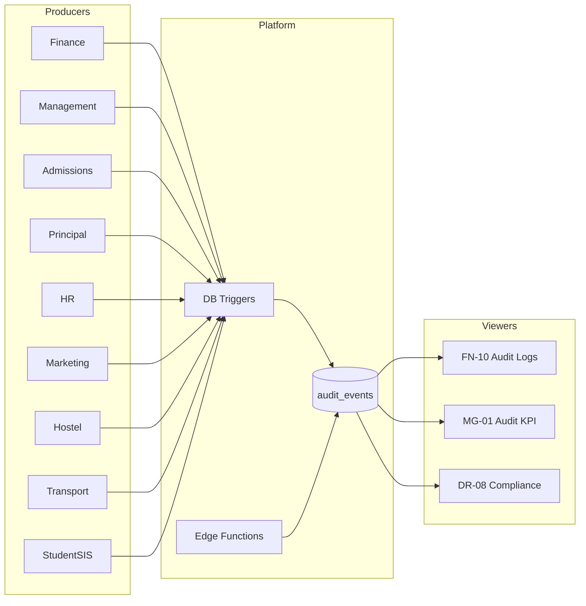

# Akshara ERP — Platform Audit Standard

**Document ID:** `AKS-AUDIT-SPEC-v1.0`  
**Scope:** All modules — cross-cutting compliance & traceability  
**Primary viewer:** Finance FN-10 · Management MG-01 KPI · Director DR-08  
**Source:** SRS Part 5 §10 · Part 11A · TechnicalArchitecture.md §12 · ArchitectureReview AR-008

---

## Table of Contents

1. [Overview](#1-overview)
2. [Principles](#2-principles)
3. [Event Schema](#3-event-schema)
4. [Emission Rules](#4-emission-rules)
5. [Module Event Catalog](#5-module-event-catalog)
6. [Viewer & Access Matrix](#6-viewer--access-matrix)
7. [UI Components](#7-ui-components)
8. [Retention & Export](#8-retention--export)
9. [Implementation Checklist](#9-implementation-checklist)

---

## 1. Overview

### Problem

Audit logging was initially specified only in **Finance FN-10**. All modules perform sensitive mutations — approvals, fee changes, admission decisions, WhatsApp broadcasts, manual attendance overrides — that require immutable traceability.

### Solution

**Single platform audit service** (`audit_events` table + server triggers + Edge Function read API). **FN-10** remains the primary **viewer** for Finance and platform admins; other modules **emit** events only.

---

## 2. Principles

| # | Principle |
|---|-----------|
| 1 | **Immutable** — insert-only; no update/delete on `audit_events` |
| 2 | **Server authoritative** — DB triggers + Edge Functions; client emit is supplementary |
| 3 | **Tenant scoped** — every row has `school_id` (+ `branch_id` where applicable) |
| 4 | **Actor captured** — `user_id`, `user_role` at time of action |
| 5 | **Before/after** — JSONB snapshots for mutations (PII masked in exports) |
| 6 | **Module tagged** — `module` field for filtering in FN-10 |
| 7 | **Severity classified** — `info` · `warning` · `critical` |

---

## 3. Event Schema

| Field | Type | Required | Description |
|-------|------|----------|-------------|
| `id` | UUID | ✅ | Event ID |
| `school_id` | UUID | ✅ | Tenant |
| `branch_id` | UUID | — | Branch if applicable |
| `user_id` | UUID | ✅ | Actor |
| `user_role` | string | ✅ | Role at action time |
| `module` | string | ✅ | See §5 modules |
| `action` | string | ✅ | `create` · `update` · `delete` · `approve` · `reject` · `export` · `send` · `override` |
| `entity_type` | string | ✅ | e.g. `fee_payment`, `leave_request` |
| `entity_id` | UUID | ✅ | Target record |
| `event_code` | string | ✅ | Canonical code e.g. `fee.payment.recorded` |
| `before_state` | JSONB | — | Pre-mutation snapshot |
| `after_state` | JSONB | — | Post-mutation snapshot |
| `severity` | enum | ✅ | `info` · `warning` · `critical` |
| `ip_address` | string | — | Request IP |
| `user_agent` | string | — | Client info |
| `metadata` | JSONB | — | Extra context (recipient_count, amount, etc.) |
| `created_at` | timestamptz | ✅ | UTC |

### Event Code Naming

`{module}.{entity}.{verb}` — examples: `admission.approval.approve`, `hostel.leave.approve`, `marketing.whatsapp.send`

---

## 4. Emission Rules

| Layer | When | Mechanism |
|-------|------|-----------|
| PostgreSQL trigger | INSERT/UPDATE/DELETE on sensitive tables | Auto-insert `audit_events` |
| Edge Function | Complex workflows (Razorpay webhook, bulk send) | Explicit insert after success |
| Flutter client | UI-only actions (export click, bulk select) | `AuditEmitter` → Edge Function `log-client-audit` |

**Never** allow client direct insert to `audit_events`.

### Severity Guidelines

| Severity | Examples |
|----------|----------|
| `info` | Read export, notification send, status view |
| `warning` | Manual attendance override, fee structure edit, role change |
| `critical` | Payroll process, admission approve/reject, bulk WhatsApp, data delete, TC issue |

---

## 5. Module Event Catalog

### Finance (`module: finance`)

| Event code | Trigger | Severity |
|------------|---------|----------|
| `fee.payment.recorded` | FN-02 cash/online | info |
| `fee.reminder.bulk_send` | FN-03 bulk | warning |
| `fee.structure.modify` | FN-02 config | warning |
| `expense.create` | FN-05 | info |
| `payroll.process` | FN-06 run | critical |
| `vendor.payment.large` | FN-07 > threshold | critical |
| `budget.modify` | FN-09 | warning |
| `report.export` | FN-11 | info |

### Management (`module: management`)

| Event code | Trigger | Severity |
|------------|---------|----------|
| `approval.budget.approve` | MG-03 | critical |
| `approval.budget.reject` | MG-03 | critical |
| `approval.expense.approve` | MG-03 | critical |
| `approval.payroll.approve` | MG-03 | critical |
| `approval.vendor.approve` | MG-03 | critical |
| `approval.marketing_budget.approve` | MG-03 | critical |

### Admissions (`module: admissions`)

| Event code | Trigger | Severity |
|------------|---------|----------|
| `lead.create` | AD-02 / AD-D-01 | info |
| `lead.stage_change` | AD-04 | info |
| `lead.handoff` | MK → AD | info |
| `admission.approval.approve` | AD-08 / PR-07 | critical |
| `admission.approval.reject` | AD-08 / PR-07 | critical |
| `student.register` | AD-06 | warning |

### Principal (`module: principal`)

| Event code | Trigger | Severity |
|------------|---------|----------|
| `leave.approval.approve` | PR-06 | warning |
| `leave.approval.reject` | PR-06 | warning |
| `timetable.publish` | PR-03 | warning |
| `certificate.issue` | PR-13 | info |
| `discipline.log` | PR-14 | warning |

### HR (`module: hr`)

| Event code | Trigger | Severity |
|------------|---------|----------|
| `employee.create` | HR-02 | info |
| `attendance.manual_override` | HR-04 / HR-D-06 | critical |
| `leave.submit` | HR-05 | info |

### Marketing (`module: marketing`)

| Event code | Trigger | Severity |
|------------|---------|----------|
| `campaign.publish` | MK-03 | info |
| `whatsapp.broadcast.send` | MK-D-02 | critical |
| `lead.import` | MK-D-05 | warning |

### Hostel (`module: hostel`)

| Event code | Trigger | Severity |
|------------|---------|----------|
| `hostel.attendance.missing_resolve` | HO-04 | warning |
| `hostel.leave.approve` | HO-D-08 | warning |
| `hostel.leave.reject` | HO-D-08 | warning |
| `hostel.visitor.register` | HO-D-03 | info |

### Transport (`module: transport`)

| Event code | Trigger | Severity |
|------------|---------|----------|
| `transport.delay.broadcast` | TR-08 | warning |
| `transport.route.modify` | TR-03 | warning |

### Student SIS (`module: sis`)

| Event code | Trigger | Severity |
|------------|---------|----------|
| `student.promotion` | SIS-03 | warning |
| `student.transfer` | SIS-04 | critical |
| `student.exit` | SIS-05 | critical |
| `parent.provision` | SIS-D-05 | warning |

### Platform (`module: platform`)

| Event code | Trigger | Severity |
|------------|---------|----------|
| `auth.login` | Auth | info |
| `auth.logout` | Auth | info |
| `notification.send` | NT-03 | info |
| `report.catalog_export` | Reports.md | info |
| `platform.school.create` | ACC-D-01 | critical |
| `platform.impersonate` | ACC-D-04 | critical |
| `platform.support.data_access` | ACC-D-05 | critical |

### Library (`module: library`)

| Event code | Trigger | Severity |
|------------|---------|----------|
| `library.issue` | LB-03 | info |
| `library.return` | LB-03 | info |
| `library.fine.waive` | LB-D-04 | warning |

### Inventory (`module: inventory`)

| Event code | Trigger | Severity |
|------------|---------|----------|
| `inventory.asset.create` | INV-02 | info |
| `inventory.writeoff` | INV-D-05 | critical |
| `inventory.allocate` | INV-03 | info |

---

## 6. Viewer & Access Matrix

| Viewer | Access | Filter default |
|--------|--------|----------------|
| FN-10 Audit Logs | Full school audit stream | All modules |
| MG-01 Dashboard KPI | Critical count last 7d | `severity=critical` |
| DR-08 Compliance | Aggregate compliance score | No PII in export |
| Principal | 👁 academic + leave only | `module IN (principal, admissions, academic)` |
| Akshara Director | 🏢 platform metrics only | No school PII |

### PII Masking in FN-10

| Role viewing | Masked fields in snapshots |
|--------------|---------------------------|
| Finance Manager | Full access within finance |
| Management | Phone/email masked in non-finance events |
| Director | Aggregates only via DR-08 |

---

## 7. UI Components

Defined in **DesignSystem.md §24** (shared):

| Component | Size | Use |
|-----------|------|-----|
| `Audit/LogRow` | `72px` | FN-10 table row |
| `Audit/DetailDrawer` | `480px` | Before/after diff viewer |
| `Audit/SeverityChip` | chip | info/warning/critical |
| `Audit/FilterBar` | `56px` | Module · severity · date · user |

FN-10 filters must include **all modules** from §5, not finance-only.

---

## 8. Retention & Export

| Data class | Retention | Export role |
|------------|-----------|-------------|
| Financial audit | 7 years | Finance Manager, Management |
| Operational audit | 2 years | Management |
| Marketing sends | 1 year | Management |
| Auth logs | 90 days | Super Admin |

Export formats: CSV · PDF summary · API paginated JSON

---

## 9. Implementation Checklist

| Step | Task |
|------|------|
| 1 | Create `audit_events` table per schema §3 |
| 2 | RLS: school isolation + role-based read |
| 3 | Triggers on finance, admissions, HR, payroll tables |
| 4 | Edge Function explicit audit for webhooks + bulk send |
| 5 | Extend FN-10 filters to all modules |
| 6 | MG-01 critical audit KPI widget |
| 7 | DR-08 compliance score from audit aggregates |
| 8 | Wire all approval dialogs to emit events |
| 9 | QA: verify immutable constraint |
| 10 | Document per-module events in module specs §Cross-Module |

---

**End of Platform Audit Standard v1.0**
