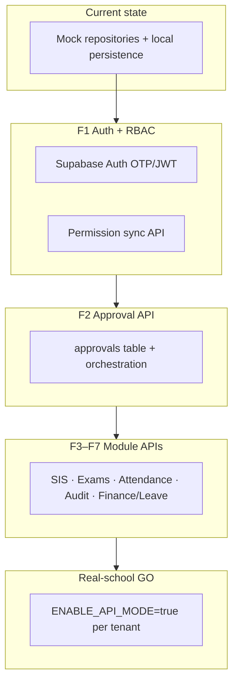

# Backend Architecture Decision

**Date:** 2026-06-18  
**Status:** Pre-backend architecture decision (planning only)  
**Authority:** `docs/PRODUCTION_BACKEND_ROADMAP.md`, `docs/PRE_PRODUCTION_GAP_REPORT.md`, `docs/ORCHESTRATOR_AGENT.md`, `docs/BackendArchitecture.md`  
**Constraint:** No implementation · no code changes · no commits

---

## 1. Decision summary

| Item | Choice |
|------|--------|
| **Official Akshara backend** | **Supabase (managed PostgreSQL) + Edge Functions (TypeScript/Deno) API layer** |
| **Database** | PostgreSQL 15+ with Row-Level Security (RLS) |
| **Future extraction path** | NestJS microservices for AI inference, payment orchestration, and heavy reporting — **not** a day-one rewrite |
| **Rejected for primary platform** | Firebase (primary datastore/API) |
| **Deferred** | Greenfield Django or NestJS monolith replacing Supabase before first real school |

**One-line rationale:** Akshara is a **multi-tenant ERP with server-authoritative workflows, RBAC, audit, and REST contracts already designed for PostgreSQL + JWT** — Supabase delivers that fastest with the lowest client rework, while preserving a clean escape hatch to NestJS for scale-heavy domains.

---

## 2. Akshara requirements (decision drivers)

Derived from production roadmap, gap report, and orchestrator architecture principles.

| Requirement | Architectural implication |
|-------------|---------------------------|
| **Multi-school SaaS** | `tenant_id` + `school_id` on every row; org/group/director aggregate views; strict isolation |
| **Parent / Teacher / Student mobile** | Persona-scoped JWT claims; read-optimized mobile APIs; push notifications |
| **Principal dashboard** | Approval inbox, school KPIs, workspace-scoped tasks |
| **Director multi-school analytics** | Cross-school aggregates without breaking school-level RLS |
| **Approval workflows** | Unified approval entity; server orchestration on approve/reject; 8+ approval types |
| **Attendance** | Idempotent submit; correction → approval → record update |
| **Exams** | Multi-phase lifecycle; publish gated by approval; cross-teacher sync |
| **Finance** | Ledger truth; refund/concession approval; parent read subset |
| **Student 360** | Server-side aggregation across 9+ domains |
| **Audit trails** | Append-only batch ingest; correlation IDs; retention |
| **RBAC + dynamic roles** | Server permission sync; runtime role assignment without app release |
| **Offline / mobile support** | Client queues + idempotent APIs; **not** full offline-first document sync |
| **Future AI (Copilot)** | Workspace/task context; server-side inference proxy; audit AI actions |

### Client constraints (non-negotiable)

The Flutter client is already built for:

- **REST** over Dio with `ApiEnvelopeDto` (`{ success, data, error, meta }`)
- Headers: `Authorization`, `X-Tenant-Id`, `X-School-Id`
- **37+ contract tests** as API parity gate
- Module feature flags (`ENABLE_API_MODE`, per-module `*_API_ENABLED`)
- Local offline patterns: audit upload queue, exam cache — **server remains authoritative after sync**

Any backend choice must implement these contracts, not require a client paradigm shift.

---

## 3. Evaluation criteria

Each option scored **1–5** (5 = best fit for Akshara). Scores reflect fit for **this product**, not generic platform quality.

| Criterion | Weight | Why it matters |
|-----------|--------|----------------|
| Scalability | High | Multi-school SaaS, audit volume, exam/attendance peaks |
| Cost | Medium | Pilot → 50+ schools; predictable unit economics |
| Development speed | **Critical** | Class A gaps block first real school (~45% API ready) |
| Permission model | **Critical** | Dynamic roles, principal/director/parent scopes |
| Audit workflow support | **Critical** | Compliance, approval trails, batch ingest |
| Reporting support | High | Director analytics, finance, Student 360 aggregates |
| Multi-school support | **Critical** | Tenant + school + group hierarchy |
| Offline sync suitability | Medium | Teacher attendance on weak networks; not full offline ERP |
| AI integration suitability | Medium | Copilot, principal command, future intelligence routes |

---

## 4. Option comparison

### 4.1 Firebase (Firestore + Auth + Functions + FCM)

| Criterion | Score | Assessment |
|-----------|-------|------------|
| Scalability | 4 | Horizontally scalable; hot documents and deep collection trees need careful modeling |
| Cost | 3 | Read/write billing unpredictable at ERP scale; audit + 360 aggregation can spike costs |
| Development speed | 3 | Fast for simple CRUD mobile apps; **slow for complex ERP** (transactions, approvals, reporting) |
| Permission model | 2 | Security rules are expressive but **hard to maintain** for dynamic RBAC across 10+ modules; no SQL joins |
| Audit workflow support | 2 | No native append-only audit ledger; Cloud Functions orchestration is possible but immature vs SQL triggers |
| Reporting support | 2 | Cross-module aggregates (Student 360, director KPIs) require BigQuery export or denormalized mirrors |
| Multi-school support | 3 | Achievable via tenant path prefixes; **no first-class RLS**; group analytics need duplicate data |
| Offline sync suitability | **5** | Best-in-class client offline with Firestore listeners |
| AI integration suitability | 4 | Vertex AI / Gemini integration strong; Functions as proxy |

**Strengths:** Mobile offline, push (FCM), rapid auth, real-time updates for simple feeds.

**Weaknesses for Akshara:**

- Client is **REST/Dio + envelope**, not Firestore SDK — full API rewrite or awkward dual stack
- Approval + finance + exam state machines map poorly to document trees
- Director multi-school SQL-style reporting is a second system (BigQuery)
- Existing backend architecture docs, RLS design, and contract tests **do not apply**

**Verdict:** Strong mobile BaaS; **wrong primary platform** for a governed multi-module ERP.

---

### 4.2 Supabase (PostgreSQL + Auth + Storage + Edge Functions)

| Criterion | Score | Assessment |
|-----------|-------|------------|
| Scalability | 4 | Postgres scales to hundreds of schools; Edge CPU/time limits → extract heavy jobs later |
| Cost | 4 | Predictable Postgres pricing; staging + prod tiers manageable for pilot |
| Development speed | **5** | Stack already specified in `BackendArchitecture.md`; Sprint 1–6 program; finance/SIS patterns exist |
| Permission model | **5** | RLS + JWT claims + `erp_tenant` role (NOBYPASSRLS); matches dynamic RBAC target |
| Audit workflow support | **5** | Append-only tables, triggers, batch ingest `POST /audit/events/batch` — natural fit |
| Reporting support | 4 | SQL aggregates, materialized views, future OpenSearch; director views via scoped aggregate tables |
| Multi-school support | **5** | `organization_id` / `school_id` + RLS; tenant isolation probe suite (213+ probes referenced in releases) |
| Offline sync suitability | 3 | No magic offline sync — **matches Akshara design** (client queue + idempotent REST) |
| AI integration suitability | 4 | Edge Functions as OpenAI/Vertex proxy; intelligence routes planned; extract to NestJS if needed |

**Strengths:**

- **Zero client contract change** — implements existing REST paths and envelope
- RLS is **authoritative** for multi-tenant school data (Phase 3A tenant access design)
- Auth (OTP/JWT), storage (documents), realtime (optional inbox refresh) in one platform
- Postgres portability — not trapped in document model

**Weaknesses:**

- Edge Function cold starts, duration, and bundle limits
- `service_role` bypass risk — mitigated by `withTenantContext` + `erp_tenant` connection pattern
- Vendor coupling on hosted auth/realtime — core data remains standard Postgres

**Verdict:** **Best fit** for Akshara's current client, roadmap, and compliance model.

---

### 4.3 Django + PostgreSQL

| Criterion | Score | Assessment |
|-----------|-------|------------|
| Scalability | 4 | Proven at ERP scale with proper indexing, read replicas, Celery |
| Cost | 4 | Self-hosted or RDS — infra cost similar to Supabase at scale; higher ops labor |
| Development speed | 3 | Greenfield API matching 144+ repository methods — **12–20 weeks** before Class A parity |
| Permission model | 5 | Django Guardian / custom RBAC + Postgres RLS — excellent control |
| Audit workflow support | 5 | django-auditlog, signals, Celery for async — mature patterns |
| Reporting support | 5 | ORM + raw SQL + report engines (WeasyPrint, etc.) — strongest reporting ergonomics |
| Multi-school support | 5 | django-tenants or schema-per-tenant — well understood |
| Offline sync suitability | 3 | Same as any REST backend — client-side queue |
| AI integration suitability | 4 | Python ML ecosystem excellent for future AI features |

**Strengths:** Best long-term **application framework** for complex admin, reporting, and Python AI pipelines.

**Weaknesses for Akshara today:**

- **No existing Django codebase** — duplicates Supabase program already documented and partially built
- Slower time-to-first-real-school vs completing F1–F7 on existing Edge API plan
- Team must operate full stack (deploy, migrations, auth, storage) vs managed Supabase
- Flutter contracts unchanged, but **all handlers rewritten** in Python

**Verdict:** Excellent ERP framework **if starting from zero**; **poor switch cost** given current Supabase-aligned program.

---

### 4.4 NestJS + PostgreSQL

| Criterion | Score | Assessment |
|-----------|-------|------------|
| Scalability | **5** | Microservices, queues, horizontal API scaling — best ceiling for large SaaS |
| Cost | 3 | Higher initial infra + DevOps (K8s/ECS, Redis, multiple services) |
| Development speed | 3 | Greenfield NestJS monolith ~14–18 weeks for Class A; faster if extracting from Supabase later |
| Permission model | 5 | Guards, CASL, custom middleware — mirrors current JWT + permission slug design |
| Audit workflow support | 5 | Event bus, outbox pattern, dedicated audit service |
| Reporting support | 5 | Dedicated report microservice; heavy PDF/CSV generation off main API |
| Multi-school support | 5 | TypeORM/Prisma + RLS or application-level scoping |
| Offline sync suitability | 3 | REST + idempotency — same as Supabase/Django |
| AI integration suitability | **5** | Best structure for AI gateway, streaming, tool-calling orchestration |

**Strengths:** Official **extraction target** in `BackendArchitecture.md` for payments, AI, report engine; TypeScript shares language with Edge Functions.

**Weaknesses for day-one:**

- Highest **initial** team and ops burden
- Duplicates work already planned on Supabase Edge Functions for F1–F7
- Overkill before first school validates product-market fit

**Verdict:** **Correct long-term shape for heavy domains**; **incorrect as immediate full replacement** for Supabase.

---

## 5. Comparison matrix (summary)

| Criterion | Firebase | Supabase | Django + PG | NestJS + PG |
|-----------|:--------:|:--------:|:-----------:|:-----------:|
| Scalability | 4 | 4 | 4 | **5** |
| Cost | 3 | **4** | 4 | 3 |
| Development speed | 3 | **5** | 3 | 3 |
| Permission model | 2 | **5** | 5 | 5 |
| Audit workflow | 2 | **5** | 5 | 5 |
| Reporting | 2 | 4 | **5** | **5** |
| Multi-school | 3 | **5** | 5 | 5 |
| Offline sync | **5** | 3 | 3 | 3 |
| AI integration | 4 | 4 | 4 | **5** |
| **Client alignment** | 1 | **5** | 3 | 3 |
| **Weighted total** | **26** | **44** | 38 | 39 |

*Client alignment added as decisive factor — Firebase fails contract parity; Supabase wins on existing investment.*

---

## 6. Official recommendation

### Adopt: **Supabase + PostgreSQL + Edge Functions**

With explicit sub-decisions:

| Layer | Technology |
|-------|------------|
| **System of record** | PostgreSQL (Supabase-hosted) |
| **Tenant isolation** | RLS + `erp_tenant` role + `withTenantContext()` |
| **API** | Edge Functions exposing REST routes matching Flutter `*_api_paths.dart` |
| **Auth** | Supabase Auth + custom OTP/JWT claims (`tenant_id`, `school_id`, `scope`, permissions) |
| **Files** | Supabase Storage or Cloudflare R2 (per `BackendArchitecture.md`) |
| **Queues** | PostgreSQL `pgmq` / Supabase Queues for audit drain, notifications |
| **Realtime** | Supabase Realtime **optional** for approval inbox refresh — not primary data path |
| **Future extraction** | NestJS services for AI gateway, payment engine, report factory when Edge limits hit |

### Why Supabase wins for Akshara

1. **Client ready** — Flutter already implements Dio REST, envelope DTOs, tenant headers, and contract tests. Supabase Edge API is the intended target (`docs/BackendArchitecture.md`, `docs/PRODUCTION_BACKEND_ROADMAP.md` F1–F7).

2. **Governance model fits SQL** — Unified approval center (A2), finance ledger (A7), exam lifecycle (A3), and audit ingest (A9) are **transactional workflows**. PostgreSQL + RLS matches the orchestrator's dynamic-role and workspace-aware permission model better than Firestore rules.

3. **Multi-school SaaS is designed** — Organization → school → school_group hierarchy, director scope, parent-child RLS, and 213+ tenant isolation probes are **Postgres-native** (`v6.1` tenant access design).

4. **Fastest path to first real school** — Gap report shows ~45% API readiness with stubs identified per module. Completing F1–F7 on existing stack is **10–14 weeks** vs **4–6 months** greenfield on Django/NestJS.

5. **Offline expectations are aligned** — Akshara does **not** require Firestore-style offline document sync. Teacher attendance needs idempotent submit + local draft cache; audit uses client queue + batch upload — both are REST patterns Supabase already plans.

6. **AI future is accommodated** — Copilot needs server-side context assembly and audited inference proxy. Edge Functions handle pilot intelligence; NestJS extraction is documented when streaming, tool chains, or GPU workloads exceed Edge limits.

7. **Escape hatch exists** — Core data is standard PostgreSQL. NestJS microservices can attach to the same DB for payments/AI without rewriting the client.

### Why not the others (primary platform)

| Option | Reason to reject as primary |
|--------|----------------------------|
| **Firebase** | Forces client paradigm change; weak cross-module reporting; RBAC/audit at ERP depth are operational risks |
| **Django** | Rebuilds backend program already architected for Supabase; delays real-school GO without unique near-term benefit |
| **NestJS (day one)** | Highest ops cost before product validation; better as **Phase 2 extraction** than greenfield replacement |

---

## 7. Risks and mitigations

| Risk | Severity | Mitigation |
|------|----------|------------|
| Edge Function CPU/time limits | Medium | Keep handlers thin; move PDF generation, AI, payment webhooks to NestJS workers later |
| RLS policy bugs → data leakage | **Critical** | `erp_tenant` NOBYPASSRLS; `withTenantContext` mandatory; expand isolation probes per module (finance, approval, exams) |
| `service_role` misuse | **Critical** | Auth plumbing only on service role; tenant data **only** via `erp_tenant` (Phase 3A design) |
| Supabase vendor limits at 100+ schools | Medium | Read replicas; connection pooler; extract read-heavy report service to NestJS |
| OpenAPI / client drift | High | Contract tests as deploy gate (existing 37+ files) |
| Offline attendance on poor networks | Medium | Client draft storage + idempotency keys; server dedupe |
| Dynamic role assignment complexity | Medium | Permission sync API (F1); versioned permission payload; audit role changes |
| Audit volume growth | Medium | Partitioned `audit_events`; batch ingest; retention policy per tenant tier |
| AI cost and compliance | Medium | Server proxy with rate limits; log prompts/responses in audit store; no PII in model logs |

---

## 8. Migration path

Aligned with `docs/PRODUCTION_BACKEND_ROADMAP.md` phases F1–F7.



### Phase alignment

| Step | Backend work | Client work | Gate |
|------|--------------|-------------|------|
| **0 — Baseline** | Staging Supabase project; deploy Edge `api`; run tenant probes | `ENABLE_API_MODE=false` (mock pilot) | Staging health green |
| **F1** | Auth endpoints + permission payload | Wire `ApiAuthRepository`; disable demo auth in prod flavor | Auth integration tests |
| **F2** | Approval CRUD + server-side approve handlers | Replace `ApiApprovalRepository` stub | Approval integration + adapter chain tests |
| **F3** | SIS + Student 360 aggregation SQL | Enforce `SIS_API_ENABLED`; remove mock fallback | Student 360 contract tests |
| **F4** | Exam lifecycle API + approval-gated publish | API repo replaces SharedPreferences authority | Exam contract + restart cache tests |
| **F5** | Attendance submit + correction API | New `api_attendance_correction_repository` | Idempotency + Patrol attendance |
| **F6** | `POST /audit/events/batch` production | Enable `AUDIT_API_ENABLED` | Audit integration test |
| **F7** | Leave/finance orchestration + CI API mode | Governance stores demo-only when API on | Patrol 9/9 on staging API |
| **Post-GO** | NestJS extraction for AI/payments (as needed) | No client change if REST contract stable | Load test per school tier |

### Data migration

| Domain | Strategy |
|--------|----------|
| Students / SIS | CSV bulk import → `/sis/students` |
| Exams | One-time device snapshot import; then server-authoritative |
| Attendance | Fresh start per academic session (no historical mock import) |
| Approvals | Open items only; no mock governance store migration |
| Audit | Client queue flush on cutover; server dedupes by event id |

### Rollback

Per-tenant module flags (`AUTH_API_ENABLED`, `APPROVAL_API_ENABLED`, etc.) revert to mock without app store release. Server data retained; rollback is **client read path**, not data deletion.

---

## 9. Team effort estimate

### First real school (Class A complete)

| Role | FTE | Duration | Focus |
|------|-----|----------|-------|
| Backend engineer (Supabase/Postgres) | 2 | 10–14 weeks | F1–F7 Edge APIs, RLS, orchestration |
| Flutter / Agent A | 0.5 | 10–14 weeks | API repo wiring, flags, contract test fixes |
| QA / Agent E | 0.25 | Weeks 8–14 | Integration, Patrol on staging API |
| DevOps | 0.25 | Ongoing | Staging deploy, secrets, monitoring |
| Security / Agent D | 0.25 | F1 + F2 | RBAC, isolation probes, audit review |

**Total:** ~**2.5–3 FTE** for **10–14 calendar weeks** to real-school GO (matches production backend roadmap).

### If Firebase or greenfield Django/NestJS were chosen instead

| Path | Additional effort vs Supabase |
|------|------------------------------|
| Firebase primary | +**16–24 weeks** (client rewrite, data model redesign, reporting layer) |
| Django greenfield | +**8–12 weeks** (rebuild handlers despite same Postgres) |
| NestJS greenfield monolith | +**6–10 weeks** (infra + full API surface before F1) |

### Post-GO evolution (optional)

| Initiative | Effort | Trigger |
|------------|--------|---------|
| NestJS AI gateway | 4–6 weeks | Copilot production + Edge limits |
| NestJS payment engine | 6–8 weeks | Live UPI/Razorpay reconciliation |
| Report microservice | 3–4 weeks | Director analytics latency |
| Read replica + caching | 2 weeks | >30 schools or slow 360 queries |

---

## 10. Architecture target (official)

```
┌──────────────────────────────────────────────────────────────────┐
│ Flutter ERP + Mobile (Parent · Teacher · Student)                │
│ Dio REST · ApiEnvelopeDto · JWT · X-Tenant-Id · X-School-Id    │
└────────────────────────────┬─────────────────────────────────────┘
                             │ HTTPS
┌────────────────────────────▼─────────────────────────────────────┐
│ Supabase Edge Functions — ERP Core API                           │
│ Auth · Approvals · SIS · Finance · Exams · Attendance · Audit    │
│ withTenantContext() → erp_tenant (RLS enforced)                  │
└────────────────────────────┬─────────────────────────────────────┘
                             │
        ┌────────────────────┼────────────────────┐
        ▼                    ▼                    ▼
┌───────────────┐   ┌───────────────┐   ┌───────────────────┐
│ PostgreSQL    │   │ Supabase Auth │   │ Storage / R2      │
│ RLS · JSONB   │   │ OTP · JWT     │   │ Documents · PDFs  │
│ Audit · Queue │   │               │   │                   │
└───────────────┘   └───────────────┘   └───────────────────┘
                             │
                    (future extraction)
                             ▼
              ┌──────────────────────────────┐
              │ NestJS services (Phase 2+)    │
              │ AI · Payments · Report engine │
              └──────────────────────────────┘
```

---

## 11. Real-school GO criteria (backend)

Backend architecture is **production-ready** when:

| # | Criterion |
|---|-----------|
| 1 | Supabase staging + production projects with RLS on all operational tables |
| 2 | Tenant isolation probe suite passes on every deploy |
| 3 | F1–F7 Class A endpoints live — no `ApiNotConnectedException` in production paths |
| 4 | Approval approve triggers server-side domain updates (not client governance stores) |
| 5 | Audit batch ingest accepting events with dedupe |
| 6 | Permission sync from server on login + refresh |
| 7 | OpenAPI spec matches Flutter contract tests |
| 8 | Backup/PITR runbook validated (`docs/BACKUP_RECOVERY_ARCHITECTURE.md`) |
| 9 | Patrol pilot closure 9/9 against staging API |
| 10 | NestJS extraction **not required** for GO — only for scale/AI phase 2 |

---

## 12. Decision record

| Field | Value |
|-------|-------|
| **Decision** | Supabase (PostgreSQL) + Edge Functions as official Akshara backend |
| **Alternatives considered** | Firebase, Django + PostgreSQL, NestJS + PostgreSQL |
| **Date** | 2026-06-18 |
| **Supersedes** | Ad-hoc backend stack discussions only — consistent with `docs/BackendArchitecture.md` v1.1 |
| **Review trigger** | >100 schools, Edge latency SLO breach, or payment PCI scope requiring dedicated service |
| **Next action** | Execute `docs/PRODUCTION_BACKEND_ROADMAP.md` F1 on staging Supabase |

---

## References

| Document | Path |
|----------|------|
| Production backend phases | `docs/PRODUCTION_BACKEND_ROADMAP.md` |
| Class A gaps | `docs/PRE_PRODUCTION_GAP_REPORT.md` |
| Orchestrator / dynamic roles | `docs/ORCHESTRATOR_AGENT.md` |
| Backend stack spec | `docs/BackendArchitecture.md` |
| Backend sprint history | `docs/BackendRoadmap.md` |
| Tenant access (RLS) | `docs/ArchitectureReview/v6.1-Phase3A-Tenant-Access-Design.md` |
| Finance API mapping | `docs/ArchitectureReview/v6.1-Finance-Implementation-Mapping.md` |
| Backup / DR | `docs/BACKUP_RECOVERY_ARCHITECTURE.md` |

---

**Document status:** Decision recorded · no implementation · no commits.
