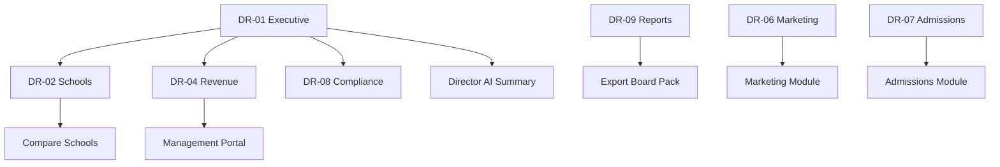

# Akshara ERP — Director Module Specification (Consolidated)

**Document ID:** `AKS-DR-SPEC-v1.0`  
**Module:** Director Portal (School Chain / Franchise)  
**Screens:** DR-01 → DR-09  
**Platform:** Web primary (`1440×1024` · `1920×1080` wide) · Tablet  
**Source:** SRS Part 4 §11, Part 6 §6, Part 14 · DesignSystem.md · Finance.md

---

## Table of Contents

1. [Module Overview](#1-module-overview)
2. [User Roles & Permissions](#2-user-roles--permissions)
3. [Navigation & Information Architecture](#3-navigation--information-architecture)
4. [Shared Design Foundation](#4-shared-design-foundation)
5. [Shared Shell Layout](#5-shared-shell-layout)
6. [Shared Components](#6-shared-components)
7. [DR-01 — Executive Dashboard](#7-dr-01--executive-dashboard)
8. [DR-02 — Multi-School Overview](#8-dr-02--multi-school-overview)
9. [DR-03 — Portfolio Analytics](#9-dr-03--portfolio-analytics)
10. [DR-04 — Revenue Overview](#10-dr-04--revenue-overview)
11. [DR-05 — Growth Analytics](#11-dr-05--growth-analytics)
12. [DR-06 — Marketing Performance](#12-dr-06--marketing-performance)
13. [DR-07 — Admissions Performance](#13-dr-07--admissions-performance)
14. [DR-08 — Compliance Monitoring](#14-dr-08--compliance-monitoring)
15. [DR-09 — Strategic Reports](#15-dr-09--strategic-reports)
16. [Dialogs & Wizards](#16-dialogs--wizards)
17. [Cross-Module Links](#17-cross-module-links)
18. [Prototype Flow Map](#18-prototype-flow-map)
19. [Responsive Rules](#19-responsive-rules)
20. [Figma File Organization](#20-figma-file-organization)
21. [Build Checklist](#21-build-checklist)

---

## 1. Module Overview

### Purpose

Strategic multi-school oversight for **School Director / Franchise Owner**: portfolio health, revenue, enrollment growth, marketing ROI, admissions funnel, compliance, and board-ready reports. Aggregated data only — no individual student PII (SRS Part 5 §3, Part 14 §5).

DR-09 launches **Reports.md** RPT-DR-* catalog. DR-08 surfaces **Audit.md** compliance aggregates.

### Screen Inventory

| ID | Screen | Primary Users | Priority |
|----|--------|---------------|----------|
| DR-01 | Executive Dashboard | School Director | P0 |
| DR-02 | Multi-School Overview | School Director | P0 |
| DR-03 | Portfolio Analytics | School Director | P0 |
| DR-04 | Revenue Overview | School Director | P0 |
| DR-05 | Growth Analytics | School Director | P0 |
| DR-06 | Marketing Performance | School Director | P1 |
| DR-07 | Admissions Performance | School Director | P1 |
| DR-08 | Compliance Monitoring | School Director | P1 |
| DR-09 | Strategic Reports | School Director | P0 |

**Total frames:** 9 primary + 5 dialogs = **14**

### Dashboard Tier (Reports.md §2)

| Tier | DR screens | Rule |
|------|------------|------|
| **Portfolio** | DR-01, DR-04, DR-07, DR-09 | Multi-school compare · export only |
| **Executive** | MG-05, MG-06 (single school) | Management reads school aggregates |
| **Operational** | FN-01, AD-01 | Transaction modules — drill from DR with `school_context_id` |

DR-04/DR-07 embed FN-11 and AD-09 APIs — no duplicate chart definitions.

### Privacy Banner (All Screens)

`1136×40` info banner: "Aggregated data only · No student or parent PII displayed"

---

## 2. User Roles & Permissions

### Persona Split (AR-018)

| Persona | Module | Use when |
|---------|--------|----------|
| **School Director / Franchise owner** | **Director.md DR-*** | Multi-school **within own organization** |
| **Akshara Director (platform)** | **AksharaControlCenter.md ACC-*** | SaaS platform metrics · all tenants |
| **School Management** | Management.md | Single school operations |

Akshara Director uses ACC-01/05/09 — **not** DR-02 school drill with PII.

| Action | School Director | School Management | Akshara Director | Principal |
|--------|-----------------|-------------------|------------------|-----------|
| View DR screens | ✅ | ❌ | ❌ use ACC | ❌ |
| View ACC screens | ❌ | ❌ | ✅ | ❌ |
| Compare own schools | ✅ | ❌ | 🏢 all tenants in ACC | ❌ |
| Export board pack | ✅ | ❌ | ✅ ACC reports | ❌ |
| Drill to school Management | ✅ `school_context_id` | ❌ | ❌ | ❌ |
| View individual student | ❌ | ❌ | ❌ | ✅ |
| Franchise onboarding | ✅ DR-D-03 | ❌ | ❌ | ❌ |
| Compliance actions | ✅ DR-08 | 👁 | 👁 ACC aggregate | ❌ |

---

## 3. Navigation & Information Architecture

### Side Navigation

| # | Label | Icon | Screen |
|---|-------|------|--------|
| 1 | Dashboard | `dashboard` | DR-01 |
| 2 | Schools | `domain` | DR-02 |
| 3 | Portfolio | `insights` | DR-03 |
| 4 | Revenue | `payments` | DR-04 |
| 5 | Growth | `trending_up` | DR-05 |
| 6 | Marketing | `campaign` | DR-06 |
| 7 | Admissions | `school` | DR-07 |
| 8 | Compliance | `verified_user` | DR-08 |
| 9 | Reports | `assessment` | DR-09 |

### Screen Hierarchy

```
DR-01 Executive Dashboard
├── DR-02 Multi-School Overview → School Detail
├── DR-03 Portfolio Analytics
├── DR-04 Revenue Overview → Finance aggregate
├── DR-05 Growth Analytics
├── DR-06 Marketing Performance → Marketing MK-08
├── DR-07 Admissions Performance → Admissions AD-09
├── DR-08 Compliance Monitoring
└── DR-09 Strategic Reports
```

---

## 4. Shared Design Foundation

**Wide desktop frame:** `1920×1080` optional for map + multi-column dashboards.  
**School health gauge:** 0–100 circular · ≥80 success · 60–79 warning · <60 error

---

## 5. Shared Shell Layout

**Component:** `Shell/DirectorLayout` — includes privacy banner below app bar on every screen.

```
DR-XX
└── Shell/DirectorLayout
    ├── Nav/Rail-Director [256]
    └── Main
        ├── AppBar [64]
        ├── PrivacyBanner [40]
        ├── FilterBar [56]
        └── Body
```

---

## 6. Shared Components

| Component | Spec |
|-----------|------|
| `Director/SchoolCard` | `280×160` logo · name · students · revenue · health |
| `Director/HealthGauge` | 80×80 circular score |
| `Director/ChurnRiskBadge` | error/warning/success |
| `Director/SchoolMap` | Pin markers per campus |
| `Director/CompareTray` | Up to 4 schools side-by-side |
| `Director/ExecutiveSummary` | AI-generated board narrative |

---

## 7. DR-01 — Executive Dashboard

| **Frame** | `DR-01-ExecutiveDashboard-D` |

### Layout Structure

| # | Section | Size |
|---|---------|------|
| 1 | Filter bar | All schools · Region · Quarter |
| 2 | KPI row | 5 × `220×120` (wider cards) |
| 3 | Split | School map `40%` · School cards grid `60%` |
| 4 | Charts row | Growth line `50%` · Marketing ROI `50%` |
| 5 | Split | Admissions funnel `60%` · Franchise health `40%` |
| 6 | AI executive summary | `1136×120` |

### KPI Definitions

| # | Label | Example | Accent |
|---|-------|---------|--------|
| 1 | Total Schools | 12 | primary |
| 2 | Total Students | 8,420 | none |
| 3 | Combined Revenue | ₹14.2Cr | success |
| 4 | New Admissions QTD | 342 | primary |
| 5 | Schools at Risk | 2 | error |

---

## 8. DR-02 — Multi-School Overview

| **Frame** | `DR-02-MultiSchoolOverview-D` |

### Layout Structure

| # | Section |
|---|---------|
| 1 | Filter bar | Region · Performance tier · **Compare schools** |
| 2 | Schools table |
| 3 | Map optional toggle |
| 4 | School detail drawer `480` |

### Table Columns

`School 200 · Location 140 · Students 80 · Revenue 120 · Admissions QTD 100 · Fee % 100 · Health 80 · Status 100 · Actions 60`

### School Detail Drawer

KPI mini-row · trend sparklines · `Open Management Portal` CTA (scoped)

### Status Chips

Top Performer · On Track · At Risk · Critical

---

## 9. DR-03 — Portfolio Analytics

| **Frame** | `DR-03-PortfolioAnalytics-D` |

### Layout Structure

| # | Section |
|---|---------|
| 1 | KPI row | Avg attendance · Avg pass % · Staff ratio · Parent NPS |
| 2 | Heatmap | Schools × metrics |
| 3 | Radar comparison | Up to 4 schools |
| 4 | Trend tables |

### Charts

Multi-school enrollment lines · Performance heatmap · Staff-to-student ratio bar

---

## 10. DR-04 — Revenue Overview

| **Frame** | `DR-04-RevenueOverview-D` |

### Layout Structure

| # | Section |
|---|---------|
| 1 | Summary hero | Chain revenue · expenses · net · margin |
| 2 | KPI row | Per-school avg · Best · Worst · Forecast |
| 3 | Charts | Revenue by school horizontal bar · Trend 24mo · Fee collection % |
| 4 | School revenue table |

### Table Columns

`School 180 · Revenue 120 · Expenses 120 · Net 120 · Margin 80 · Fee % 100 · YoY 80 · Actions 80`

### Drill Link

Per-school → Management MG-05 Financial Overview (read-only)

---

## 11. DR-05 — Growth Analytics

| **Frame** | `DR-05-GrowthAnalytics-D` |

### Layout Structure

| # | Section |
|---|---------|
| 1 | Enrollment trend multi-line | 24 months per school |
| 2 | Retention/churn chart |
| 3 | Capacity utilization |
| 4 | AI enrollment forecast | Dashed projection band |

### KPI Definitions

YoY growth % · New enrollments · Withdrawals · Net growth · Capacity %

---

## 12. DR-06 — Marketing Performance

| **Frame** | `DR-06-MarketingPerformance-D` |

### Layout Structure

| # | Section |
|---|---------|
| 1 | KPI row | Total spend · Leads · CPL · ROI |
| 2 | Charts | Campaign ROI by school · Channel comparison |
| 3 | Top/bottom schools table |

### Drill Link

→ Marketing MK-08 filtered by school chain

---

## 13. DR-07 — Admissions Performance

| **Frame** | `DR-07-AdmissionsPerformance-D` |

### Layout Structure

| # | Section |
|---|---------|
| 1 | Chain-wide funnel |
| 2 | Conversion by school bar |
| 3 | Counselor performance aggregate (anonymized tiers) |
| 4 | Source effectiveness table |

### Drill Link

→ Admissions AD-09 · per-school Management MG-06

---

## 14. DR-08 — Compliance Monitoring

| **Frame** | `DR-08-ComplianceMonitoring-D` |

### Purpose

Track regulatory, audit, safety, and data compliance across campuses (SRS Part 5).

### Layout Structure

| # | Section |
|---|---------|
| 1 | KPI row | Compliant · Action needed · Overdue · Critical |
| 2 | Compliance checklist table per school |
| 3 | Audit due calendar |
| 4 | Document expiry alerts |

### Table Columns

`School 160 · Category 140 · Requirement 240 · Status 100 · Due 100 · Owner 120 · Evidence 80 · Actions 80`

### Categories

Financial audit · Safety inspection · Data privacy · Staff verification · Transport fitness · Fire NOC

### Status Chips

Compliant `success` · Due soon `warning` · Overdue `error` · Not applicable neutral

---

## 15. DR-09 — Strategic Reports

| **Frame** | `DR-09-StrategicReports-D` |

### Layout Structure

| # | Section |
|---|---------|
| 1 | Report catalog grid | 3 × `360×160` |
| 2 | Board pack preview `1136×520` |
| 3 | AI narrative section |
| 4 | Export schedule toolbar |

### Report Cards

Executive Summary · Board Pack · Revenue Analysis · Growth Report · Marketing ROI · Compliance Status · Franchise Health · 5-Year Forecast

### Board Pack Contents

CEO letter (AI draft) · KPI summary · School comparison · Risk register · Recommendations

---

## 16. AI Director Copilot

**Component:** `AI/DirectorCopilot` — DR-01, DR-03, DR-08, DR-09 (AR-042, AR-023)

### Scope

Portfolio aggregates across **organization schools** — no student names · no parent contacts.

### Insight Cards

| Card | Use |
|------|-----|
| School health score | Revenue + admissions + compliance composite |
| Churn risk (franchise) | Low fee collection + declining enrollment |
| Marketing ROI compare | Cross-school campaign performance |
| Compliance gap | DR-08 missing uploads |

### Example Prompts

- "Compare revenue across my schools this quarter"
- "Which school has the lowest admission yield?"
- "Draft board pack executive summary"
- "Show compliance risks by school"

### Actions

Open DR-02 compare · Export DR-D-02 board pack · Drill to MG with `school_context_id` · Schedule review

### Compliance AI (DR-08)

Risk scoring on missing policies · document expiry · audit critical count from Audit.md aggregates

---

## 17. Dialogs & Wizards

| ID | Name | Size | Used on |
|----|------|------|---------|
| DR-D-01 | CompareSchools | 720 | DR-02 |
| DR-D-02 | ExportBoardPack | 560 | DR-09 |
| DR-D-03 | FranchiseOnboard | 720 wizard | DR-02 |
| DR-D-04 | ComplianceUpload | 560 | DR-08 |
| DR-D-05 | AIExecutiveBrief | 560 | DR-01 |

---

## 18. Cross-Module Links

| From | To | Trigger |
|------|-----|---------|
| DR-02 school card | Management MG-* | Scoped portal |
| DR-04 revenue | Finance FN-11 | Per-school reports |
| DR-06 | Marketing MK-08 | Campaign analytics |
| DR-07 | Admissions AD-09 | Funnel data |
| DR-08 audit | Finance FN-10 | Financial audit logs |
| DR-09 | Management MG-08 | Report merge |
| Akshara Director | AksharaControlCenter ACC-* | Platform ops — not DR |
| Any | Director AI Copilot | School chain executive queries |
| Franchise | White-label config | SRS Part 4 §16 |

---

## 18. Prototype Flow Map



---

## 19. Responsive Rules

| Element | Desktop | Tablet | Mobile |
|---------|---------|--------|--------|
| Nav | 256 | 72 | Drawer |
| School map | 40% width | Hidden list only | List |
| KPI | 5-up | 3×2 | 2×2 |
| Compare dialog | 720 | Fullscreen | Fullscreen |
| Board preview | Full width | Scroll | PDF link only |

---

## 20. Figma File Organization

```
📁 02 — Director Portal
├── Privacy banner component
├── School card · Health gauge · Map
├── DR-01 → DR-09 [D/T]
├── Wide frames 1920 for DR-01
└── Dialogs DR-D-01 → DR-D-05
```

**Frame naming:** `DR-{##}-{ScreenName}-{D|T}`

---

## 21. Build Checklist

| Step | Task |
|------|------|
| 1 | Director shell + privacy banner |
| 2 | School card + health gauge components |
| 3 | DR-01 executive dashboard |
| 4 | DR-02 multi-school + compare |
| 5 | DR-04 revenue + DR-05 growth |
| 6 | DR-06 marketing + DR-07 admissions |
| 7 | DR-08 compliance |
| 8 | DR-09 board pack + AI narrative |
| 9 | Cross-module prototype links |
| 10 | 1920 wide variant + accessibility |

---

**End of Director Module Specification v1.0**
