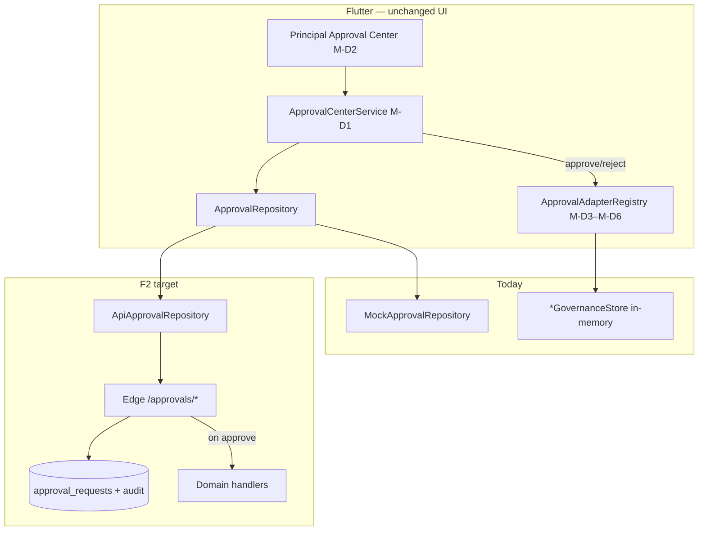

# F2 — Approval API Pre-Implementation Analysis

**Date:** 2026-06-18  
**Phase:** Production Backend Program **F2**  
**Class A item:** A2 Unified principal approval center  
**Status:** Analysis only — no implementation  
**Authority:** `docs/ORCHESTRATOR_AGENT.md`, `docs/PRODUCTION_BACKEND_ROADMAP.md`, `docs/GOVERNANCE_COMPLETION_REPORT.md`, Phase D M-D1–M-D3 certifications

---

## Executive summary

| Dimension | Current state | F2 target |
|-----------|---------------|-----------|
| **Client UI** | ✅ Principal Approval Center certified (M-D2) | Unchanged |
| **Adapters** | ✅ 8 types registered (7 pilot + `feeStructure` sibling) | Side effects move server-side in API mode |
| **Repository** | `MockApprovalRepository` (in-memory) | `ApiApprovalRepository` (full stub today) |
| **Supabase** | No unified `approval_requests` table | New schema + Edge handlers |
| **Governance stores** | In-memory singletons | Demo-only when `APPROVAL_API_ENABLED=true` |
| **Production API readiness** | ~53% (post-F1) | **~65%** after F2 |

**Naming note:** Flutter enum `inventoryPo` maps to business term **purchase order** (`purchaseOrder`). This document uses both.

**Out of scope for F2 type matrix (documented only):** `feeStructure` — same finance handler pattern as `feeConcession`; ship with finance slice or defer to F7.

---

## Architecture context (Phase D → F2)



**M-D1** established `ApprovalRepository` + `ApprovalCenterService` as the **only** write path.  
**M-D2** certified inbox UI, filters, RBAC, audit timeline.  
**M-D3–M-D6** certified per-type adapters and `dispatchApproved` / `dispatchRejected` hooks.

F2 replaces the mock repository and moves **approve side effects** to the server without changing screens.

---

## Unified platform requirements (all types)

### Required Supabase schema (new)

| Table | Purpose |
|-------|---------|
| `approval_requests` | Canonical approval record per school |
| `approval_audit_entries` | Append-only decision trail |

**Proposed `approval_requests` columns:**

| Column | Type | Notes |
|--------|------|-------|
| `id` | `uuid` PK | `appr_*` external id optional |
| `organization_id` | `uuid` NOT NULL | From JWT — never from body |
| `school_id` | `uuid` NOT NULL | From JWT |
| `type` | `text` NOT NULL | Matches `ApprovalRequestType.name` |
| `status` | `text` NOT NULL | `pending` \| `approved` \| `rejected` \| `cancelled` |
| `title` | `text` NOT NULL | |
| `summary` | `text` | |
| `requester_id` | `uuid` NOT NULL | |
| `requester_name` | `text` NOT NULL | |
| `entity_type` | `text` NOT NULL | Adapter constant per type |
| `entity_id` | `text` NOT NULL | Domain entity id |
| `payload` | `jsonb` NOT NULL DEFAULT `{}` | Frozen submit snapshot |
| `decided_at` | `timestamptz` | |
| `decided_by_id` | `uuid` | |
| `decided_by_name` | `text` | |
| `decision_comment` | `text` | Required on reject |
| `created_at` | `timestamptz` | |
| `updated_at` | `timestamptz` | |

**Constraints:**

- Partial unique index: one `pending` row per `(school_id, type, entity_type, entity_id)` — mirrors `findPendingByEntity` idempotency.
- RLS: `erp_tenant` + `withTenantContext()` — same pattern as F1 finance/SIS.
- `FORCE ROW LEVEL SECURITY` on both tables.

**Proposed `approval_audit_entries` columns:**

| Column | Type |
|--------|------|
| `id` | `uuid` PK |
| `approval_request_id` | `uuid` FK |
| `action` | `text` — `submitted` \| `approved` \| `rejected` \| `cancelled` |
| `actor_id` | `uuid` |
| `actor_name` | `text` |
| `comment` | `text` |
| `occurred_at` | `timestamptz` |
| `organization_id` / `school_id` | `uuid` |

### Required API endpoints (shared)

| Method | Path | Maps to |
|--------|------|---------|
| `GET` | `/approvals` | `listByFilter` |
| `GET` | `/approvals/pending` | `listPending` |
| `GET` | `/approvals/{id}` | `getById` |
| `GET` | `/approvals/entity` | `findPendingByEntity` |
| `POST` | `/approvals` | `submit` |
| `POST` | `/approvals/{id}/approve` | `approve` + **domain handler** |
| `POST` | `/approvals/{id}/reject` | `reject` + domain handler |
| `POST` | `/approvals/{id}/cancel` | `cancel` |
| `GET` | `/approvals/{id}/audit` | `listAuditEntries` |
| `POST` | `/approvals/audit` | `recordAuditEntry` (optional client mirror) |

**Permissions:** `approvalPermissionForType()` in `approval_permissions.dart` — middleware must enforce matching slug on approve/reject.

### Approval state machine (all types)

```
                    ┌──────────┐
         submit ──► │ pending  │
                    └────┬─────┘
           ┌───────────────┼───────────────┐
           ▼               ▼               ▼
     ┌──────────┐   ┌──────────┐   ┌───────────┐
     │ approved │   │ rejected │   │ cancelled │
     └──────────┘   └──────────┘   └───────────┘
           terminal      terminal       terminal
```

| Transition | Actor | Rules |
|------------|-------|-------|
| → `pending` | Requester / module | Idempotent if pending exists for same entity |
| `pending` → `approved` | Principal (RBAC) | PO: approver ≠ creator |
| `pending` → `rejected` | Principal | Comment required |
| `pending` → `cancelled` | Requester or admin | Optional comment |

### Audit requirements (cross-cutting)

| Event | Source | F2 behavior |
|-------|--------|-------------|
| `submitted` | `ApprovalCenterService` + server | Row in `approval_audit_entries` |
| `approved` / `rejected` / `cancelled` | Server on decision | Same + `mutation_audit_catalog` domain events |
| Client `AuditEventType` | Existing audit pipeline | Unchanged — complement server batch |

Server must emit domain events per type (e.g. `exams.results.approved`, `leave.student.approved`) with `approvalId` + `entityId` for F6 correlation.

### Client repository (F2 delta)

| File | Change |
|------|--------|
| `api_approval_repository.dart` | Replace stub with remote |
| New `approval_remote_datasource.dart` | Dio + envelope |
| New `approval_*_dto.dart`, `approval_mapper.dart` | Snake_case parity |
| `approval_repository_provider` | `APPROVAL_API_ENABLED` gate |
| `ApprovalAdapterRegistry` | When API on: `onApproved`/`onRejected` = cache invalidation only (or no-op) |
| `*GovernanceStore` | Skip writes when `isModuleApiEnabled(approvalApiEnabledProvider)` |

---

## Per-type analysis

### 1. `examResults`

| # | Item | Detail |
|---|------|--------|
| **1. Flutter workflow** | Exam Coordinator verifies → teacher/admin submits via `ExamResultsApprovalAdapter.submitForApproval` (`exam_marks_entry_provider`, `teacher_mutations_provider`) → Principal approves in Approval Center → `dispatchApproved` → `ExamAdministrationStore.publishExamResults` |
| **2. Mock path** | `MockApprovalRepository` + `ExamAdministrationStore` (SharedPreferences-backed) |
| **3. Schema** | `approval_requests` row; optional `exam_approval_links(exam_id, approval_id)`; exam tables from F4 (`academics/exams`) |
| **4. API endpoints** | Shared `/approvals/*`; approve handler calls `POST /academics/exams/{id}/publish` (F4) or inline SQL phase transition |
| **5. State transitions** | Exam: `processed` → (submit) → approval `pending` → (approve) → `published`; reject → coordinator verification cleared + rejection comment |
| **6. Audit** | `approveExamResults` permission; event `exams.results.submitted` / `exams.results.approved` / `exams.results.rejected` |
| **7. Migration** | Open approvals only; exam data import separate (F4) |
| **8. Rollback** | `APPROVAL_API_ENABLED=false`; local exam store remains device authority until F4 |
| **9. Tests** | Extend `exam_approval_adapter_integration_test.dart`; contract; fake Dio approve → publish |
| **10. Dependencies** | F1 auth; **F4** for full server publish (F2 can stub handler + record approval) |

**Entity:** `entity_type = exam_session`, `entity_id = examId`  
**Permission:** `approveExamResults`  
**Payload keys:** `classLabel`, `subject`, `examTitle`, `marksEntered`, `marksTotal`, `phase`, `coordinatorVerified`

---

### 2. `studentLeave`

| # | Item | Detail |
|---|------|--------|
| **1. Flutter workflow** | Parent submits leave (`parent_mutations_provider`) → adapter submit → Principal decides → `StudentLeaveGovernanceStore.applyDecision` |
| **2. Mock path** | `MockApprovalRepository` + `StudentLeaveGovernanceStore` (in-memory) |
| **3. Schema** | `approval_requests`; link to `parent_leave_requests` or equivalent (`leave_id`) |
| **4. API** | Shared `/approvals/*`; approve → `PATCH /parent/leave/{id}/status` |
| **5. Transitions** | Leave `pending` → `approved` \| `rejected`; timeline updated |
| **6. Audit** | `approveStudentLeave`; `leave.student.*` events |
| **7. Migration** | No backfill; new requests server-authoritative |
| **8. Rollback** | Governance store for demo |
| **9. Tests** | `workflow_parent_leave_approval.yaml` Patrol; integration with fake parent API |
| **10. Dependencies** | F1; parent leave write API (F7); F2 can persist approval + status stub |

**Entity:** `student_leave` / `leaveId`  
**Permission:** `approveStudentLeave`  
**Payload:** `childName`, `classLabel`, `fromDate`, `toDate`, `leaveType`, `reason`

---

### 3. `staffLeave`

| # | Item | Detail |
|---|------|--------|
| **1. Flutter workflow** | HR creates leave (`hr_mutations_provider`) → adapter submit → Principal decides → `StaffLeaveGovernanceStore.applyDecision` |
| **2. Mock path** | `MockApprovalRepository` + `StaffLeaveGovernanceStore` |
| **3. Schema** | `approval_requests`; link `hr_leave_requests` |
| **4. API** | Approve → `PATCH /hr/leave/{id}/approve` (existing partial HR API) |
| **5. Transitions** | `HrLeaveStatus.pending` → `approved` \| `rejected` |
| **6. Audit** | `approveStaffLeave`; `leave.staff.*` events |
| **7. Migration** | Open items only |
| **8. Rollback** | Mock governance |
| **9. Tests** | `workflow_hr_leave_approval.yaml`; HR integration tests |
| **10. Dependencies** | F1; HR leave write API (Class B, shares F2 handler pattern) |

**Entity:** `staff_leave`  
**Permission:** `approveStaffLeave`  
**Payload:** `employeeName`, `department`, `leaveType`, `fromDate`, `toDate`, `days`

---

### 4. `attendanceCorrection`

| # | Item | Detail |
|---|------|--------|
| **1. Flutter workflow** | Teacher/parent submits correction → adapter → Principal approves → `AttendanceCorrectionStore` + `MockAttendanceSyncStore.recordCorrectionApproved` |
| **2. Mock path** | `AttendanceCorrectionStore` + `MockAttendanceSyncStore` |
| **3. Schema** | `approval_requests`; `attendance_corrections` table (F5) |
| **4. API** | Approve → update correction status + attendance aggregate |
| **5. Transitions** | Correction `pending` → `approved` \| `rejected`; attendance KPI delta on approve |
| **6. Audit** | `approveAttendanceCorrection`; `attendance.correction.*` |
| **7. Migration** | None |
| **8. Rollback** | Mock sync store |
| **9. Tests** | `attendance_governance_integration_test.dart`; Patrol `workflow_teacher_attendance_correction` |
| **10. Dependencies** | F1; **F5** attendance API for durable correction record (F2 stores approval + handler stub) |

**Entity:** `attendance_day` / correction id  
**Permission:** `approveAttendanceCorrection`  
**Payload:** `classLabel`, `date`, `studentsAffected`, `fromMark`, `toMark`, `presentDelta`, `requesterRole`

---

### 5. `feeConcession`

| # | Item | Detail |
|---|------|--------|
| **1. Flutter workflow** | Finance creates concession (`finance_mutations_provider`) → `FeeConcessionApprovalAdapter` → Principal approves → `FinanceApprovalGovernanceStore.applyConcession` |
| **2. Mock path** | `MockApprovalRepository` + `FinanceApprovalGovernanceStore` |
| **3. Schema** | `approval_requests`; `finance_scholarships` / assignment tables |
| **4. API** | Approve → activate concession on student account (`POST /finance/concessions/assign` or internal) |
| **5. Transitions** | Concession draft → active on approve; rejection recorded |
| **6. Audit** | `approveFeeConcession`; `finance.concession.*` |
| **7. Migration** | None |
| **8. Rollback** | Governance store |
| **9. Tests** | `finance_approval_integration_test.dart`; `workflow_finance_concession_approval.yaml` |
| **10. Dependencies** | F1; finance scholarship API (F7) |

**Entity:** `fee_concession`  
**Permission:** `approveFeeConcession`  
**Payload:** `studentName`, `amount`, `reason`

---

### 6. `refund`

| # | Item | Detail |
|---|------|--------|
| **1. Flutter workflow** | Finance creates refund → redirect to Approval Center (M-D5) → `RefundApprovalAdapter` → `FinanceApprovalGovernanceStore.approveRefund` |
| **2. Mock path** | Governance store; finance API exists for refunds when `FINANCE_API_ENABLED` |
| **3. Schema** | `approval_requests`; `finance_refunds` (exists) |
| **4. API** | Approve → `PATCH /finance/refunds/{id}/approve` with `approvalId` validation |
| **5. Transitions** | Refund `pending` → `approved` \| `rejected` |
| **6. Audit** | `approveRefunds`; `finance.refund.*` |
| **7. Migration** | Link existing pending refunds to approval rows (one-time script) |
| **8. Rollback** | Hybrid finance mock fallback |
| **9. Tests** | `finance_approval_integration_test.dart`; finance API integration |
| **10. Dependencies** | F1; finance refunds API (partially complete) |

**Entity:** `refund_request`  
**Permission:** `approveRefunds`  
**Payload:** `studentName`, `amount`, `reason`

---

### 7. `purchaseOrder` (`inventoryPo`)

| # | Item | Detail |
|---|------|--------|
| **1. Flutter workflow** | Storekeeper creates PO (`inventory_mutations_provider`) → `InventoryPoApprovalAdapter` (registers order) → Principal approves (not creator) → `InventoryPoGovernanceStore.approveOrder` |
| **2. Mock path** | `InventoryPoGovernanceStore` + hybrid inventory API reads |
| **3. Schema** | `approval_requests`; `inventory_procurement_orders` |
| **4. API** | Approve → PO status `approved`; enforce `PO_SELF_APPROVE_DENIED` server-side |
| **5. Transitions** | PO `submitted` → `approved` \| `rejected` |
| **6. Audit** | `approvePurchaseOrder`; `inventory.po.*`; segregation-of-duties violation → 403 |
| **7. Migration** | Open POs only |
| **8. Rollback** | Mock governance |
| **9. Tests** | `inventory_po_approval_integration_test.dart`; `workflow_inventory_po_approval.yaml` |
| **10. Dependencies** | F1; inventory write API (Class B) |

**Entity:** `procurement_order`  
**Permission:** `approvePurchaseOrder`  
**Payload:** `poNumber`, `vendorName`, `totalAmount`, `requestedBy`  
**Special rule:** `InventoryPoApprovalAdapter.assertApproverNotCreator` must be replicated on server.

---

## Type comparison matrix

| Type | Category | Submit actor | Decide permission | Governance store (mock) | Server domain (F2 handler) |
|------|----------|--------------|-------------------|-------------------------|----------------------------|
| `examResults` | Academic | Teacher / exam admin | `approveExamResults` | `ExamAdministrationStore` | Exam publish |
| `studentLeave` | Academic | Parent | `approveStudentLeave` | `StudentLeaveGovernanceStore` | Parent leave status |
| `staffLeave` | Academic | HR staff | `approveStaffLeave` | `StaffLeaveGovernanceStore` | HR leave status |
| `attendanceCorrection` | Academic | Teacher / parent | `approveAttendanceCorrection` | `AttendanceCorrectionStore` | Attendance correction |
| `feeConcession` | Finance | Finance admin | `approveFeeConcession` | `FinanceApprovalGovernanceStore` | Concession activate |
| `refund` | Finance | Finance admin | `approveRefunds` | `FinanceApprovalGovernanceStore` | Refund approve |
| `inventoryPo` | Inventory | Storekeeper | `approvePurchaseOrder` | `InventoryPoGovernanceStore` | PO approve |

---

## Critical path (F2)

```
F1 ✅
  → F2.0 Core schema + RLS + CRUD endpoints
  → F2.1 ApiApprovalRepository + contract tests
  → F2.2 Approve orchestrator (handler registry)
  → F2.3 Type handlers (examResults + refund first — highest Class A leverage)
  → F2.4 Remaining five types
  → F2.5 Client adapter demotion + governance store guards
  → F2.6 Certification
```

**Blocks downstream:** F4 exam publish gate, F5 attendance correction resolve, F7 leave/finance orchestration.

---

## Parallel opportunities

| Track | Parallel with | Prerequisite |
|-------|---------------|--------------|
| F2.0 migration + Edge router | — | F1 |
| Flutter `ApiApprovalRepository` | F2.0 backend | OpenAPI/fixtures agreed |
| Handler: `refund` | Handler: `examResults` | F2.2 orchestrator |
| Handlers: leave ×2 | Handlers: attendance, PO | F2.2 |
| Handler: `feeConcession` | F7 finance (can stub) | F2.2 |
| Contract tests | Per-handler integration | F2.1 |

Max **3 parallel streams** after F2.2: (1) exam + refund, (2) leave + attendance, (3) finance concession + PO.

---

## Certification gates (preview)

| # | Gate |
|---|------|
| 1 | `flutter analyze` = 0 errors |
| 2 | `test/contracts/approval/` green (mock ↔ API parity) |
| 3 | `test/integration/approval/` green (all 7 types) |
| 4 | `test/features/management/approval/` regression (M-D2 gate ≥52 tests) |
| 5 | No `ApiNotConnectedException` when `APPROVAL_API_ENABLED=true` |
| 6 | Governance stores no-op in API mode (grep / feature test) |
| 7 | Idempotent submit integration test |
| 8 | PO self-approve denied server-side |
| 9 | Patrol: exam, parent leave, finance concession, inventory PO (4 journeys) |
| 10 | `docs/PHASE_F2_FINAL_CERTIFICATION.md` |

---

## Readiness impact

| Metric | Before F2 | After F2 (target) |
|--------|-----------|-------------------|
| Production API overall | ~53% | **~65%** |
| Cross-module governance | Mock-only | Server-authoritative approvals |
| Class A workflows unblocked | Auth only | Approval hub unlocks F4/F5/F7 handlers |
| Principal inbox production-safe | No | Yes (with staging deploy) |

---

## Risks

| Risk | Mitigation |
|------|------------|
| Dual side effects (client adapter + server) | Feature flag: skip `dispatchApproved` domain writes when API on |
| Handler drift from adapter logic | Port adapter tests to server unit tests; shared payload fixtures |
| Exam publish without F4 API | F2 records approval; F4 wires publish SQL |
| Partial unique index race on submit | DB constraint + return existing pending (match client) |

---

## References

| Asset | Path |
|-------|------|
| Repository contract | `lib/core/repositories/interfaces/approval_repository.dart` |
| API stub | `lib/core/repositories/api/approval/api_approval_repository.dart` |
| Mock | `lib/core/repositories/mock/mock_approval_repository.dart` |
| Service | `lib/core/approvals/approval_center_service.dart` |
| UI provider | `lib/features/management/approval/approval_center_provider.dart` |
| Adapters | `lib/core/approvals/adapters/` |
| M-D1 cert | `docs/PHASE_D_M1_FINAL_CERTIFICATION.md` |
| M-D2 cert | `docs/PHASE_D_M2_FINAL_CERTIFICATION.md` |
| M-D3 cert | `docs/PHASE_D_M3_FINAL_CERTIFICATION.md` |
| F2 roadmap | `docs/PRODUCTION_BACKEND_ROADMAP.md` § F2 |

---

**Document status:** Analysis complete · no implementation · no commits.
