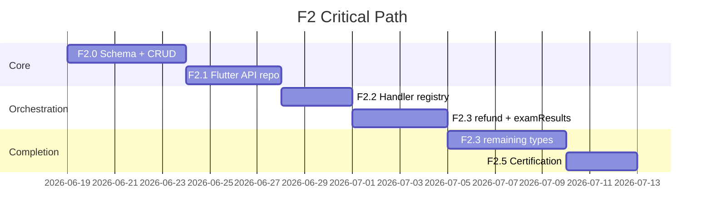

# F2 — Approval API Execution Plan

**Date:** 2026-06-18  
**Phase:** Production Backend Program **F2**  
**Prerequisite:** **F1 ✅ certified** (`docs/PHASE_F1_FINAL_CERTIFICATION.md`)  
**Analysis:** [`docs/F2_APPROVAL_API_ANALYSIS.md`](./F2_APPROVAL_API_ANALYSIS.md)  
**Status:** Execution plan only — **do not implement until authorized**  
**Estimated duration:** **3–4 weeks** (2 backend + 0.5 Flutter Agent A + Agent E)

---

## Mission statement

Replace `ApiApprovalRepository` stub with a production Supabase Edge API that:

1. Persists unified approval requests and audit entries server-side.  
2. Enforces RBAC + tenant isolation on every route.  
3. Orchestrates domain side effects on approve/reject (server-first).  
4. Preserves mock/UAT path via `APPROVAL_API_ENABLED=false`.  
5. Leaves Principal Approval Center UI **unchanged**.

---

## Scope

### In scope (7 approval types)

| Flutter `ApprovalRequestType` | Business name |
|---------------------------------|---------------|
| `examResults` | Exam results publish |
| `studentLeave` | Student leave |
| `staffLeave` | Staff leave |
| `attendanceCorrection` | Attendance correction |
| `feeConcession` | Fee concession |
| `refund` | Refund |
| `inventoryPo` | Purchase order |

### Out of scope (F2)

| Item | Phase |
|------|-------|
| `feeStructure` adapter | F7 finance (same handler pattern) |
| Admissions siloed approval | Existing `/admissions/approvals` |
| Push/email notifications | Class B (M-D7 client stub sufficient) |
| Approval Center UI redesign | Forbidden |
| F3–F7 domain API completion | Downstream — F2 registers handlers + stubs |

---

## Work breakdown

### F2.0 — Core platform (Week 1)

| ID | Task | Owner | Deliverable |
|----|------|-------|-------------|
| F2.0.1 | Migration `approval_requests` + `approval_audit_entries` | Backend | `supabase/migrations/20260628*_approval_foundation.sql` |
| F2.0.2 | RLS policies + `erp_tenant` grants | Backend | FORCE RLS; school scope |
| F2.0.3 | Partial unique pending index | Backend | Idempotent submit |
| F2.0.4 | Edge router `/approvals/*` | Backend | `approval_handlers.ts`, `approval_router.ts` |
| F2.0.5 | CRUD handlers (no domain orchestration yet) | Backend | list, get, submit, approve, reject, cancel, audit |
| F2.0.6 | Permission middleware per type | Agent D | Map to `approve*` slugs |
| F2.0.7 | Tenant isolation probes (+7) | Agent E | Extend probe suite |
| F2.0.8 | OpenAPI / fixture alignment | Agent A | Match `approval_fixture_builder.dart` |

**Exit criteria:** Staging `POST /approvals` + `GET /approvals/pending` return envelope; probes green.

---

### F2.1 — Flutter API repository (Week 1–2)

| ID | Task | Owner | Deliverable |
|----|------|-------|-------------|
| F2.1.1 | `approval_remote_datasource.dart` | Agent A | All 10 endpoints |
| F2.1.2 | DTOs + `approval_mapper.dart` | Agent A | Snake_case ↔ domain |
| F2.1.3 | Replace `ApiApprovalRepository` stub | Agent A | Full implementation |
| F2.1.4 | `approvalApiEnabledProvider` wiring | Agent A | Already in `repository_config.dart` |
| F2.1.5 | Contract tests API parity | Agent E | Extend `approval_repository_contract_test.dart` |
| F2.1.6 | Fake Dio integration — CRUD | Agent E | `f2_approval_api_integration_test.dart` |

**Exit criteria:** Contract tests pass with fake Dio; mock path unchanged.

---

### F2.2 — Approve orchestrator (Week 2)

| ID | Task | Owner | Deliverable |
|----|------|-------|-------------|
| F2.2.1 | `ApprovalHandlerRegistry` (server) | Backend | Type → async handler |
| F2.2.2 | Transactional approve: update row + audit + handler | Backend | Single DB transaction where possible |
| F2.2.3 | Reject orchestration + comment validation | Backend | 422 if empty |
| F2.2.4 | `mutation_audit_catalog` entries per type | Backend | Domain events |
| F2.2.5 | Client: skip governance store when API on | Agent A | Guard in adapters or registry dispatch |

**Exit criteria:** Approve/reject updates `approval_requests.status`; audit row written; handler invoked.

---

### F2.3 — Type handlers (Week 2–3)

Implement in **priority order** (Class A leverage):

| Priority | Type | Handler action | Can stub domain API? |
|----------|------|----------------|----------------------|
| P0 | `refund` | Call finance refund approve | No — API exists |
| P0 | `examResults` | Mark exam approved; defer publish SQL to F4 | Yes — status flag |
| P1 | `studentLeave` | Update leave status | Partial |
| P1 | `attendanceCorrection` | Update correction status | Yes until F5 |
| P2 | `staffLeave` | HR leave approve | Partial |
| P2 | `feeConcession` | Activate concession | Yes until F7 |
| P2 | `inventoryPo` | PO approve + self-approve deny | Partial |

**Per-type checklist (each):**

1. Server handler + unit test  
2. Integration test (fake Dio / staging)  
3. Client adapter guard (no double side effect)  
4. Patrol journey (if exists)  
5. Analysis § migration note applied  

---

### F2.4 — Client integration hardening (Week 3)

| ID | Task | Owner |
|----|------|-------|
| F2.4.1 | `ApprovalAdapterRegistry.dispatchApproved` — API mode branch | Agent A |
| F2.4.2 | Invalidate providers post-decision (existing `_invalidateAfterApprovalSideEffects`) | Agent B |
| F2.4.3 | Demo seed: skip when API on | Agent A |
| F2.4.4 | `approval_center_provider` — no mock-only assumptions | Agent B |

---

### F2.5 — Certification (Week 3–4)

| ID | Task | Owner |
|----|------|-------|
| F2.5.1 | Full approval test gate (see below) | Agent E |
| F2.5.2 | `flutter analyze` + full `flutter test` | Agent G |
| F2.5.3 | Patrol subset (4 journeys) | Agent E |
| F2.5.4 | `docs/PHASE_F2_FINAL_CERTIFICATION.md` | Agent F |
| F2.5.5 | Update `ORCHESTRATOR_AGENT.md` — F2 complete, F3 active | Agent F |

---

## Critical path



**Serial blockers:**

1. F2.0 before F2.1 (fixtures need real shapes).  
2. F2.1 before client API-mode E2E.  
3. F2.2 before any domain handler.  
4. `refund` + `examResults` before declaring F2 MVP — highest downstream value.

---

## Parallel execution plan

| Week | Stream A (Backend) | Stream B (Flutter A) | Stream C (QA E) |
|------|-------------------|----------------------|-----------------|
| 1 | F2.0 migrations + CRUD | DTO/mapper draft from fixtures | Contract test scaffolding |
| 2 | F2.2 orchestrator + refund handler | F2.1 ApiApprovalRepository | Integration CRUD |
| 3 | exam + leave handlers | Adapter API guards | Per-type integration |
| 4 | attendance + PO + concession | Provider invalidation | Patrol + cert doc |

**Max parallel agents:** 3 (per orchestrator rules).  
**Do not parallelize:** Same adapter file edits without merge gate.

---

## Agent ownership

| Agent | F2 responsibilities |
|-------|---------------------|
| **A** | `lib/core/repositories/api/approval/`, mapper, provider wiring |
| **B** | `approval_center_provider.dart` invalidation only |
| **D** | RBAC middleware, PO self-approve, permission slugs |
| **E** | Contract, integration, probe, Patrol gates |
| **F** | Certification + migration runbook |
| **G** | Release gate, staging deploy sign-off |

---

## Certification gates

### Pre-implementation (this document)

- [x] F2 analysis complete  
- [x] F2 execution plan complete  
- [ ] Program Director authorizes F2 start  

### Implementation complete

| # | Gate | Command / evidence |
|---|------|-------------------|
| 1 | Static analysis | `flutter analyze` → 0 errors |
| 2 | Approval contracts | `flutter test test/contracts/approval/` |
| 3 | Approval service | `flutter test test/core/approvals/` |
| 4 | Approval integration | `flutter test test/integration/approval/` |
| 5 | Management UI regression | `flutter test test/features/management/approval/` |
| 6 | M-D2 golden regression | `flutter test test/golden/approval_center_golden_test.dart` |
| 7 | F2 integration | `flutter test test/integration/approval/f2_approval_api_integration_test.dart` |
| 8 | Tenant probes | Staging `/health/tenant-access` + approval probes |
| 9 | API mode flag | `APPROVAL_API_ENABLED=true` smoke on staging |
| 10 | Patrol | exam publish, parent leave, finance concession, inventory PO |

### Combined gate command

```bash
flutter analyze
flutter test test/contracts/approval/ test/core/approvals/ \
  test/integration/approval/ test/features/management/approval/ \
  test/golden/approval_center_golden_test.dart
```

---

## Migration strategy (execution)

| Step | Action |
|------|--------|
| 1 | Deploy F2 migration to staging |
| 2 | Deploy Edge `api` with `/approvals` routes |
| 3 | Enable `APPROVAL_API_ENABLED=true` on internal QA build only |
| 4 | Verify submit → inbox → approve for each type on staging |
| 5 | One-time script: link open `finance_refunds` pending → `approval_requests` (refund only) |
| 6 | Per-school cutover: enable flag in production flavor |
| 7 | Disable governance store writes in API mode (code guard) |

**No client UI migration.** No approval data import from mock devices.

---

## Rollback strategy (execution)

| Trigger | Action |
|---------|--------|
| Handler bug on single type | Disable that type's server handler; revert to mock for type via flag (optional per-type kill switch) |
| Full F2 rollback | `APPROVAL_API_ENABLED=false` → `MockApprovalRepository` |
| Data | Server approvals retained; client shows mock inbox (stale until re-cutover) |
| Exam / attendance | Device-local stores unchanged on rollback |

Document in `docs/F2_APPROVAL_MIGRATION.md` at certification (Agent F).

---

## Test strategy (execution)

| Layer | Files | New in F2 |
|-------|-------|-----------|
| Contract | `test/contracts/approval/*` | API mapper parity |
| Unit | `test/core/approvals/adapters/*` | API-mode guard tests |
| Integration | `test/integration/approval/*` | `f2_approval_api_integration_test.dart` |
| Widget | `test/features/management/approval/*` | Regression only |
| Security | PO self-approve, RBAC deny | Server + client |
| Patrol | `qa/journeys/workflow_*_approval.yaml` | Staging API mode |
| Probes | `tenant_isolation_probes.ts` | +approval cross-school deny |

**Idempotency test (required):**

- Duplicate `POST /approvals` for same `(type, entity_type, entity_id)` returns existing pending row.

---

## Dependencies

| Dependency | Status | Blocks |
|------------|--------|--------|
| F1 Auth + RBAC | ✅ Certified | All `/approvals` routes |
| M-D1 Approval service | ✅ | Client contract |
| M-D2 Approval Center UI | ✅ | E2E validation |
| M-D3–M-D6 Adapters | ✅ | Handler parity reference |
| Finance refunds API | Partial | `refund` handler P0 |
| Exam administration API | F4 | Full `examResults` publish |
| Attendance correction API | F5 | Full `attendanceCorrection` |
| Parent/HR leave API | F7 | Full leave handlers |

F2 may ship with **handler stubs** that update approval + domain status columns without full domain API parity; certification requires all **7 types** submit/approve/reject through server inbox.

---

## Readiness impact

| Metric | Post-F1 | Post-F2 (target) | Delta |
|--------|---------|------------------|-------|
| Production API overall | ~53% | **~65%** | **+12%** |
| Approval API (A2) | 0% | **100%** | +100% |
| Cross-module governance | Mock | Server inbox | Qualitative |
| F4 exam publish gate | Blocked | Unblocked | — |
| F5 correction resolve | Blocked | Unblocked | — |
| F7 finance/leave orchestration | Partial | Unblocked | — |

---

## Stop conditions

Per `ORCHESTRATOR_AGENT.md`:

| ID | Condition |
|----|-----------|
| STOP-01 | F2 certification complete → await F3 authorization |
| STOP-04 | Test gate failure after fix attempt |
| STOP-05 | Staging Supabase unavailable |
| STOP-03 | Scope creep into F3/F4 implementation |

---

## Authorization required

F2 implementation **must not start** until:

1. Program Director explicitly authorizes F2 in session prompt.  
2. `docs/F2_APPROVAL_API_ANALYSIS.md` reviewed.  
3. Staging deploy path confirmed (`scripts/deploy_staging.sh`).

---

## Deliverables checklist

| Deliverable | Path |
|-------------|------|
| Analysis | `docs/F2_APPROVAL_API_ANALYSIS.md` ✅ |
| Execution plan | `docs/F2_APPROVAL_API_EXECUTION_PLAN.md` ✅ |
| Migration runbook | `docs/F2_APPROVAL_MIGRATION.md` (at cert) |
| Certification | `docs/PHASE_F2_FINAL_CERTIFICATION.md` (at cert) |
| Migration SQL | `supabase/migrations/*_approval_foundation.sql` |
| Edge handlers | `supabase/functions/_shared/approval/` |
| Flutter API | `lib/core/repositories/api/approval/` |
| Tests | `test/integration/approval/f2_*` |

---

**Document status:** Execution plan complete · no implementation · no commits.
