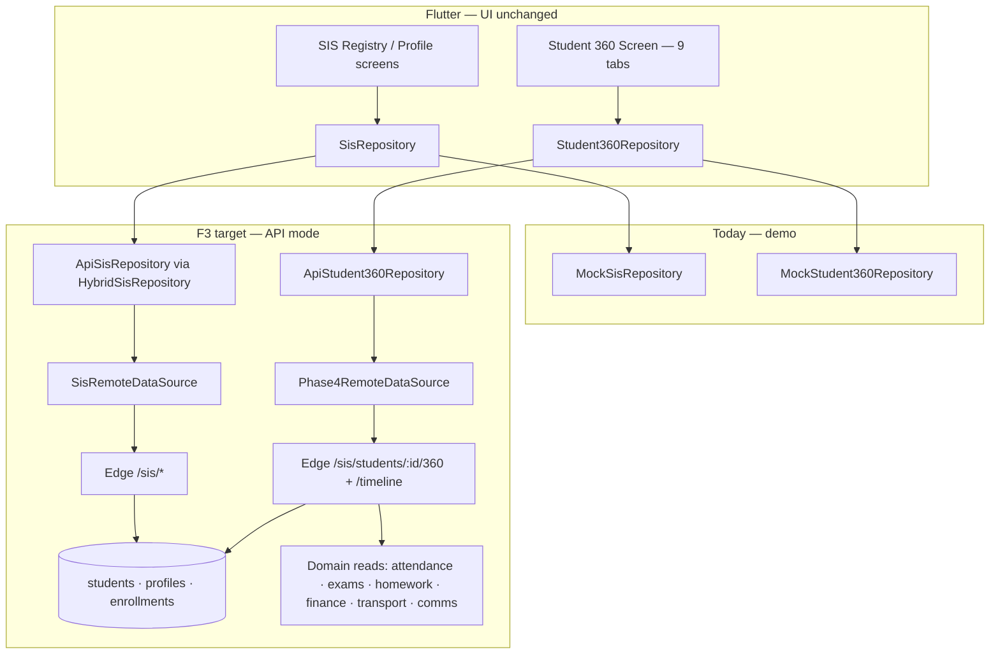
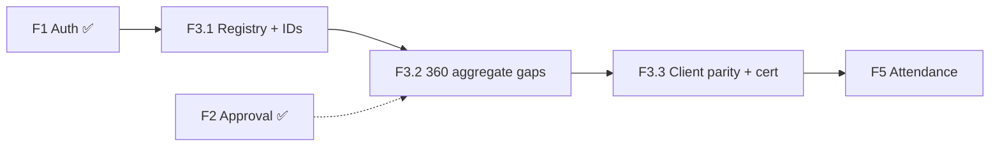

# F3 — SIS + Student 360 API Pre-Implementation Analysis

**Date:** 2026-06-17  
**Phase:** Production Backend Program **F3**  
**Class A item:** A8 Authoritative student record  
**Prerequisite:** **F1 ✅ · F2 ✅ certified**  
**Status:** Analysis only — **no implementation**  
**Authority:** `docs/ORCHESTRATOR_AGENT.md`, `docs/PRODUCTION_BACKEND_ROADMAP.md`, `docs/PHASE_F2_FINAL_CERTIFICATION.md`, `docs/PILOT_READINESS_AUDIT.md`

---

## Executive summary

| Dimension | Current state | F3 target |
|-----------|---------------|-----------|
| **SIS registry (reads)** | **~75%** — Edge `/sis/*` live; Flutter `ApiSisRepository` wired | Production-enforced reads; search/filter parity |
| **SIS profile** | **~50%** — `GET /sis/students/{id}` returns core + guardians; attendance/fees/docs empty in mapper | Profile or 360 cross-links authoritative summaries |
| **Student 360 dossier** | **~60%** — `GET /sis/students/{id}/360` aggregates 8 domains; **behaviour / transport / documents missing on server** | All 9 UI tabs populated from server in API mode |
| **Timeline** | **~70%** — `GET /sis/students/{id}/timeline` + `student_timeline_events` table | Contract parity + parent scope probes |
| **Documents API** | **~20%** — client `POST /documents` wired; **no Edge route** | List + upload metadata server-side |
| **Mock fallback** | `SIS_API_ENABLED=false` → `MockSisRepository` + `MockStudent360Repository` | Preserved for UAT; forbidden in production school |
| **Pilot readiness (S360 module)** | **58%** (`PILOT_READINESS_AUDIT.md`) | **~70%** client nav + **API truth** for dossier |
| **Production API readiness** | **~65%** (post-F2) | **~71%** after F3 |

**Key finding:** F3 is **not greenfield**. Supabase SIS Slice 0 + Student 360 foundation migrations and Edge handlers already exist. F3 is primarily **gap closure**, **mapper parity**, **ID crosswalk**, and **certification** — not new UI.

---

## Architecture context

### Flag wiring

| Flag | Provider | Repository when `true` |
|------|----------|--------------------------|
| `ENABLE_API_MODE` | `enableApiModeProvider` | Master switch |
| `SIS_API_ENABLED` | `sisApiEnabledProvider` | `HybridSisRepository` + `ApiStudent360Repository` |

Both SIS and Student 360 share **`SIS_API_ENABLED`** (`repository_providers.dart`). No separate `STUDENT_360_API_ENABLED` today.

---

## 1. SIS repository architecture

### Layer map

| Layer | Path | Role |
|-------|------|------|
| Contract | `lib/core/repositories/interfaces/sis_repository.dart` | 11 methods: dashboard, registry, profile, assignment, conversion, CRUD |
| Mock | `lib/core/repositories/mock/mock_sis_repository.dart` + `mock_sis_write_store.dart` | Seeded ADM-* / SIS-STU-* students; in-memory writes |
| API | `lib/core/repositories/api/sis/api_sis_repository.dart` | Full implementation (not stub) |
| Hybrid | `lib/core/repositories/api/sis/hybrid_sis_repository.dart` | Thin delegate to API (no mock read fallback) |
| Remote | `lib/core/repositories/api/sis/remote/sis_remote_datasource.dart` | Dio + `ApiEnvelopeDto` |
| Paths | `lib/core/repositories/api/sis/remote/sis_api_paths.dart` | `/sis/*` |
| DTOs | `lib/core/repositories/api/sis/dto/` | Dashboard, students list, profile envelope, write requests |
| Mapper | `lib/core/repositories/api/sis/mapper/sis_mapper.dart` | Dual-path: legacy mock envelope + server `studentDetailToApi` shape |
| Provider | `sisRepositoryProvider` in `repository_providers.dart` | `SIS_API_ENABLED` gate |
| Server | `supabase/functions/_shared/sis/` | Router, handlers, repositories, mapper |

### Server routes (implemented)

| Method | Path | Handler |
|--------|------|---------|
| `GET` | `/sis/dashboard` | `handleDashboard` |
| `GET` | `/sis/students` | `handleListStudents` (search + filters) |
| `POST` | `/sis/students` | `handleCreateStudent` |
| `GET` | `/sis/students/{id}` | `handleGetStudent` |
| `PUT` | `/sis/students/{id}` | `handleUpdateStudent` |
| `PATCH` | `/sis/students/{id}/status` | `handleUpdateStudentStatus` |
| `GET` | `/sis/enrollments` | `handleListEnrollments` |
| `POST` | `/sis/enrollments` | `handleCreateEnrollment` |
| `PUT` | `/sis/enrollments/{id}` | `handleUpdateEnrollment` |
| `POST` | `/sis/admissions-conversion` | `handleAdmissionsConversion` |
| `GET` | `/sis/students/{uuid}/360` | `handleGetStudent360Profile` |
| `GET` | `/sis/students/{uuid}/timeline` | `handleGetStudentTimeline` |

### Gaps (F3 must close)

| Gap | Impact |
|-----|--------|
| No `GET/POST /sis/students/{id}/documents` on server | Profile document list + upload broken in API mode |
| `GET /sis/students/{id}` lacks attendance/fee/document aggregates | SIS profile screen shows placeholders when API on |
| Legacy id vs UUID — `/360` requires UUID; registry may use `SIS-STU-*` | Teacher/parent drill-down 404 on 360 |
| `sis_registry_provider` filter index 2 sends `status=inactive`; mock uses `prospect` | Wrong filter results in API mode |
| Contract tests lack fake-Dio API parity (unlike F2 approval) | Regression risk on mapper drift |
| `academic-assignment` path deprecated; client uses `POST /sis/enrollments` | Document + align enrollment handler naming |

### Migration strategy (repository)

1. Import school roster → server `students` + `student_profiles` + `sis_student_enrollments`.  
2. Publish **ID crosswalk** table (mock `SIS-STU-*` → UUID) for transition QA.  
3. Enable `SIS_API_ENABLED=true` on staging; verify registry search returns server rows.  
4. Remove client-side mock filtering when API enabled (already partially done in `sis_registry_provider`).

### Rollback strategy

`SIS_API_ENABLED=false` → `MockSisRepository` + client-side search/filter. Server data retained; no deletion.

### Tests

| File | Coverage today | F3 gap |
|------|----------------|--------|
| `test/contracts/sis/sis_repository_contract_test.dart` | DTO mapping vs mock | Add fake-Dio `ApiSisRepository` parity |
| `test/contracts/sis/sis_write_contract_test.dart` | Write DTOs | Staging integration |
| `test/contracts/sis/sis_client_alignment_test.dart` | Path alignment | Documents route when added |
| `supabase/functions/_shared/sis/sis_*_test.ts` | Server unit tests | Extend 360 + documents |

### Dependencies

- **F1 ✅** — JWT + `viewSis` / `manageSis` permissions  
- **F2 ✅** — not blocking reads; improves timeline richness when approvals emit events  
- **Downstream F5** — requires canonical `student_id` UUID from F3.1

---

## 2. Student 360 repository architecture

### Layer map

| Layer | Path | Role |
|-------|------|------|
| Contract | `lib/core/repositories/interfaces/student_360_repository.dart` | `getProfile`, `getTimeline` |
| Mock | `lib/core/repositories/mock/mock_student_360_repository.dart` | Full 9-tab dossier including behaviour/transport/documents |
| API | `lib/core/repositories/api/phase4/api_phase4_repositories.dart` (`ApiStudent360Repository`) | Delegates to Phase4 remote |
| Remote | `lib/core/repositories/api/phase4/phase4_remote_datasource.dart` | `GET /sis/students/{id}/360`, `/timeline` |
| Mapper | `lib/core/repositories/api/phase4/phase4_mapper.dart` | `student360FromApi` — unwraps `{ profile }` envelope |
| Provider | `student360RepositoryProvider` | Gated by `sisApiEnabledProvider` |
| UI | `lib/features/student_360/student_360_screen.dart` | 9 tabs; export via `AksharaReportExportService` |
| Providers | `lib/features/phase4/phase4_providers.dart` | `student360ProfileProvider`, timeline |
| Server | `student_360_service.ts` + `sis_student_360_handlers.ts` | Server-side aggregation |

### Technical debt

Student 360 HTTP calls live in **`phase4_remote_datasource.dart`**, not `sis_remote_datasource.dart`. F3 should either:

- **Option A (recommended):** Add `sis/student_360_remote_datasource.dart` and deprecate Phase4 paths for 360 only; or  
- **Option B:** Keep Phase4 remote but document as SIS submodule alias.

### Domain coverage matrix

| `Student360Profile` field | Mock | Server `buildStudent360Profile` | F3 action |
|---------------------------|------|----------------------------------|-----------|
| `identity` | ✅ | ✅ | Verify field names (`displayName` vs `name`) |
| `admissions` | ✅ | ✅ partial | Align DOB/gender |
| `attendance` | ✅ | ✅ SQL aggregate | F5 improves freshness |
| `marks` | ✅ | ✅ `exam_mark_entries` | F4 improves when exams API live |
| `homework` | ✅ | ✅ `homework_submissions` | OK |
| `communication` | ✅ | ⚠️ stub (`pendingNotices: 0`) | Wire `communication_repository` |
| `fees` | ✅ | ✅ `finance_invoices` | Parent view redaction OK |
| `inventory` | ✅ | ✅ distributions | OK |
| `activities` / `achievements` | empty | empty | Defer post-F3 (Class B) |
| `risk` | ✅ | ✅ `intel_student_risk_snapshots` | OK |
| `parentInformation` | ✅ | ✅ guardians | Phone redaction for parent scope |
| **`behaviour`** | ✅ | ❌ missing | **F3 P0** — new table or discipline read |
| **`transport`** | ✅ | ❌ missing | **F3 P0** — join `transport_allocations` |
| **`documents`** | ✅ | ❌ missing | **F3 P0** — `student_documents` table + aggregate |

### Migration strategy

Server becomes **single aggregation point** — client must not merge mock governance stores in API mode (pattern from F2 `skipDomainEffects`).

### Rollback strategy

`SIS_API_ENABLED=false` → `MockStudent360Repository` with full tab data. UI unchanged.

### Tests

| File | Status |
|------|--------|
| `test/contracts/student_360/student_360_repository_contract_test.dart` | Mapper + mock domains; **no fake-Dio API test** |
| `test/features/student_360/` | Screen tests if present |
| Patrol `workflow_student_360_unification.yaml` | API fixtures needed |

### Dependencies

- **F3.1** canonical student UUID  
- **F4** — marks domain freshness (can ship partial aggregates first)  
- **F5** — attendance domain freshness  
- **Transport module** — allocation rows for transport tab

---

## 3. Student profile APIs

### Current mock path

- `sis_profile_provider.dart` → `sisRepositoryProvider.getStudentProfile(studentId)`  
- Mock: `MockSisRepository.getStudentProfile` → rich `SisStudentProfile` (parent, academic history, fee, attendance, documents, timeline)  
- UI: `sis_profile_screen.dart` — defers dossier domains to Student 360 via `openStudent360()`

### API contract

| Method | Path | Permission |
|--------|------|------------|
| `GET` | `/sis/students/{id}` | `viewSis` + school scope |
| `PUT` | `/sis/students/{id}` | `manageSis` |
| `PATCH` | `/sis/students/{id}/status` | `manageSis` |

**Response (server today):** `studentDetailToApi` — `{ student, profile, currentEnrollment, guardians }`.

**Response (client domain):** `SisStudentProfile` — 7 sections (see `sis_models.dart`).

### DTOs

| DTO | Path |
|-----|------|
| `SisStudentProfileDto` | `dto/sis_student_profile_dto.dart` (raw envelope) |
| `UpdateStudentRequestDto` | `dto/update_student_request_dto.dart` |
| `UpdateStudentStatusRequestDto` | `dto/update_student_status_request_dto.dart` |
| `CreateStudentRequestDto` | `dto/create_student_request_dto.dart` |

Mapper `toStudentProfile` branches: server shape → placeholders for attendance/documents; legacy envelope → full mock parity.

### Migration strategy

- **Phase 1:** Accept lean server profile; link to 360 for summaries (current product intent per P1-S360-003 fix).  
- **Phase 2 (optional):** Enrich `GET /sis/students/{id}` with lightweight summary blocks OR add `GET /sis/students/{id}/profile-summary`.

### Rollback strategy

Mock profile restores all sections inline.

### Tests

- Extend `sis_repository_contract_test.dart` — profile envelope from `sis_fixture_builder.dart`  
- Widget: `test/features/sis/sis_screens_test.dart`

### Dependencies

F3.1 registry IDs; documents API for `documents[]` on profile.

---

## 4. Student search APIs

### Current mock path

- `sis_registry_provider.dart` — `sisRegistrySearchProvider` + filter chips  
- **Mock mode:** client-side filter on `getStudents()` full list  
- **API mode:** `RepositoryQuery.additionalQueryParams` → `search`, `status`, `className`

### API contract

| Method | Path | Query params |
|--------|------|--------------|
| `GET` | `/sis/students` | `page`, `pageSize`, `search` (or `q`), `status`, `className`, `sectionName`, `academicYear` |

Server: `parseListFilters` in `sis_handlers.ts` → `searchStudents` in `sis_students_repository.ts`.

### DTOs

| DTO | Path |
|-----|------|
| `SisStudentsResponseDto` | `dto/sis_students_dto.dart` |
| `SisStudentDto` | nested in students DTO |
| Pagination | `PaginationDto` via envelope |

### Migration strategy

1. Bulk import students before enabling search in production.  
2. Fix filter mapping: `prospect` vs `inactive` status codec alignment (`sis_status_codec.ts` ↔ `SisStudentStatus`).  
3. Index verification: `idx_sis_student_enrollments_school_year_class` for class filters.

### Rollback strategy

Revert to mock list + client filter.

### Tests

- Contract: paginated list mapping (exists)  
- Server: `sis_students_repository_test.ts` search cases  
- Integration: registry provider with fake Dio returning filtered pages

### Dependencies

F1 RBAC `viewSis`; PostgreSQL full-text or `ILIKE` on `display_name`, `admission_number`, `student_code`.

---

## 5. Attendance summary APIs

### Current mock path

- **SIS profile:** `SisAttendanceSummary` on `SisStudentProfile` (mock percentages)  
- **Student 360:** `profile.attendance` map — `{ present, absent, total, percent }`  
- **Not** a standalone repository method — embedded in profile/360

### API contract

| Scope | Method | Path | Shape |
|-------|--------|------|-------|
| **360 aggregate** | `GET` | `/sis/students/{id}/360` | `profile.attendance.{ present, absent, total, percent }` |
| **Optional sub-resource** | `GET` | `/sis/students/{id}/summaries/attendance` | F3 optional — cache-friendly |
| **Timeline** | `GET` | `/sis/students/{id}/timeline` | `eventType: attendance` rows from `attendance_records` |

Server SQL: `student_360_service.ts` → `attendance_records` aggregate.

### DTOs

- No dedicated DTO — `Map<String, dynamic>` domains in `Phase4Mapper.student360FromApi`  
- SIS profile uses `SisAttendanceSummary` when legacy envelope present

### Migration strategy

- F3: certify 360 aggregate matches mock keys (`percent` vs `presentPercent` — normalize in mapper).  
- F5: daily marks + correction flows update `attendance_records`; F3 reads existing rows.

### Rollback strategy

Mock attendance summary on profile + 360.

### Tests

- Contract: 360 mapper attendance keys  
- Server: seed `attendance_records` probe fixtures → 360 percent calculation  
- Integration: teacher attendance → 360 refresh (F5 overlap)

### Dependencies

**F5** for write path; F3 read-only aggregate acceptable at launch.

---

## 6. Marks summary APIs

### Current mock path

- **Student 360:** `profile.marks.exams[]` — `{ exam, averagePercent }`  
- Parent/teacher exam screens use separate repositories (out of F3 scope)

### API contract

| Scope | Method | Path | Shape |
|-------|--------|------|-------|
| **360 aggregate** | `GET` | `/sis/students/{id}/360` | `profile.marks.exams[]` |
| **F4 future** | `GET` | `/academics/exams/students/{sisStudentId}/published` | Published results detail |

Server: `exam_mark_entries` grouped by `exam_title` in `student_360_service.ts`.

### DTOs

Domain maps only; no `MarksSummaryDto` yet — consider `student_360_marks_dto.dart` for contract stability.

### Migration strategy

- F3: ship aggregate from existing mark rows (may be empty until F4 exam admin populates).  
- UI shows empty state — acceptable per roadmap (“partial aggregates first”).

### Rollback strategy

Mock exam list in `MockStudent360Repository`.

### Tests

- Contract mapper with `exams` array  
- Server unit test with seeded `exam_mark_entries`

### Dependencies

**F4** exam lifecycle for fresh data; **F2** for publish-gated marks (published flag in SQL filter — verify in F3 implementation).

---

## 7. Homework summary APIs

### Current mock path

- **Student 360:** `profile.homework` — `{ submitted, total, completionRate }`

### API contract

| Scope | Method | Path | Shape |
|-------|--------|------|-------|
| **360 aggregate** | `GET` | `/sis/students/{id}/360` | `profile.homework.{ submitted, total, completionRate }` |

Server: `homework_submissions` aggregate in `student_360_service.ts`.

### DTOs

Map domain in `Phase4Mapper` — optional typed `HomeworkSummaryDto`.

### Migration strategy

Ensure homework submission writes populate `homework_submissions` (existing intelligence/homework modules).

### Rollback strategy

Mock completion rates.

### Tests

- 360 contract fixture with homework block  
- Server SQL unit test

### Dependencies

Homework module data population; no F4/F5 blocker for read aggregate.

---

## 8. Behaviour APIs

### Current mock path

- **Student 360 only:** `profile.behaviour` — `{ conductScore, incidents[], remarks }`  
- **No SIS profile section** (correct — dossier tab only)

### API contract (F3 — new)

| Scope | Method | Path | Shape |
|-------|--------|------|-------|
| **360 aggregate** | `GET` | `/sis/students/{id}/360` | `profile.behaviour.{ conductScore, incidents[], remarks }` |
| **Optional CRUD** | `GET/POST` | `/sis/students/{id}/conduct-incidents` | Defer writes to F7+ |

**Schema (proposed):** `student_conduct_incidents` — `id`, `student_id`, `incident_type`, `status`, `occurred_on`, `remarks`, RLS school scope.

### DTOs

- New: `student_360_behaviour_dto.dart` (Flutter)  
- Server: extend `Student360Profile` interface in `student_360_service.ts`

### Migration strategy

- Seed empty incidents for pilot; import historical incidents CSV optional.  
- Mapper defaults `{}` → UI empty state (acceptable).

### Rollback strategy

Mock behaviour block in `MockStudent360Repository`.

### Tests

- Contract: behaviour domain required non-empty in mock test (exists)  
- Server: incident list query  
- RBAC: `viewStudent360` for teachers; redaction rules TBD

### Dependencies

No hard blocker; discipline module may expand post-F3.

---

## 9. Communication timeline APIs

### Current mock path

- **Student 360:** `profile.communication` — `{ pendingNotices, unreadMessages }`  
- **Timeline:** `getTimeline()` — mixed `StudentTimelineEvent` list  
- **SIS profile:** `SisTimelineEvent` list (dateLabel, title, detail) on mock only

### API contract

| Method | Path | Purpose |
|--------|------|---------|
| `GET` | `/sis/students/{id}/360` | `profile.communication` summary |
| `GET` | `/sis/students/{id}/timeline` | `{ studentId, items[] }` |

**Timeline sources (server `buildStudentTimeline`):**

1. `student_timeline_events` (canonical store)  
2. `attendance_records` (synthetic events)  
3. `payment_requests` (finance events)  
4. Risk snapshots  
5. **Gap:** `communication_threads` not yet merged

### DTOs

| DTO | Path |
|-----|------|
| Timeline items | snake_case in DB → camelCase in API (`eventType`, `sourceModule`) |
| `StudentTimelineEvent` | `student_360_models.dart` |

### Migration strategy

- F3: wire communication summary from `communication_repository` (thread count, last contact).  
- Emit domain events into `student_timeline_events` on notice send (async, F6 audit overlap).

### Rollback strategy

Mock communication + timeline events.

### Tests

- Contract: `timelineFromApi` field mapping  
- Server: merged timeline ordering by `event_at`  
- Parent scope: RLS policy on `student_timeline_events` (exists)

### Dependencies

`communication` module; F6 for durable event ingestion.

---

## 10. Document APIs

### Current mock path

- **SIS profile:** `SisDocumentSummary[]` on `getStudentProfile`  
- **Student 360:** `profile.documents.items[]`  
- **Write:** `uploadStudentDocument` → mock store insert

### API contract

| Method | Path | Status |
|--------|------|--------|
| `GET` | `/sis/students/{id}/documents` | **Client wired — server missing** |
| `POST` | `/sis/students/{id}/documents` | **Client wired — server missing** |
| `GET` | `/sis/students/{id}/360` | Include `profile.documents.items[]` |

**Proposed schema:** `student_documents` — `id`, `student_id`, `document_type`, `status`, `file_uri`, `uploaded_at`, `verified_by`, RLS.

### DTOs

| DTO | Path |
|-----|------|
| `UploadStudentDocumentRequestDto` | `dto/upload_student_document_request_dto.dart` |
| Document summary | mapped via `sis_mapper.toDocumentSummary` |

### Migration strategy

1. Migration `student_documents` table.  
2. Edge handlers: list + create metadata (file upload via storage signed URL — align with admissions document pattern).  
3. Aggregate document list into 360 `documents` domain.

### Rollback strategy

Mock documents on profile + 360; uploads stay local mock store.

### Tests

- `sis_write_contract_test.dart` — upload request DTO  
- New: documents handler unit test  
- Contract: document list parity

### Dependencies

Supabase Storage policy (if file bytes required); admissions document upload pattern as reference.

---

## Critical path

| Step | Blocker | Outcome |
|------|---------|---------|
| 1 | F1 ✅ | Authenticated `/sis/*` |
| 2 | Student UUID + import | Registry ↔ 360 ↔ teacher roster same id |
| 3 | Documents Edge routes + table | Profile upload/list works |
| 4 | 360 domains: behaviour, transport, documents | 9 tabs non-empty in API mode |
| 5 | Fake-Dio contract parity | CI gate |
| 6 | Staging `SIS_API_ENABLED=true` | Production school read truth |

**F2 is not on the critical path for F3 reads** (orchestrator allows F3 parallel after F1). F2 improves timeline/approval events later.

---

## Parallel opportunities

| Track | Can run parallel with | Owner |
|-------|----------------------|-------|
| F3.1 Registry + search + profile | F3.2 360 aggregation | Backend A / Backend B |
| `student_documents` migration + handlers | Behaviour + transport 360 SQL | Backend |
| Flutter fake-Dio contract tests | Server handler work | Agent A + Agent E |
| ID crosswalk fixture tooling | Import scripts | Agent F / ops |
| Communication timeline merge | Document storage policy | Backend + Agent D |

**Max recommended parallelism:** 3 tracks (schema, Edge handlers, Flutter mapper/tests).

---

## Certification gates (preview)

| # | Gate | Evidence |
|---|------|----------|
| 1 | `flutter analyze` | 0 errors |
| 2 | SIS contracts | `flutter test test/contracts/sis/` |
| 3 | Student 360 contracts | `flutter test test/contracts/student_360/` |
| 4 | F3 integration | `f3_sis_360_api_integration_test.dart` (new) |
| 5 | SIS screens | `flutter test test/features/sis/` |
| 6 | Server SIS tests | `deno test supabase/functions/_shared/sis/` |
| 7 | Tenant probes | School A/B isolation on student list + 360 |
| 8 | Staging flag | `SIS_API_ENABLED=true` smoke |
| 9 | Patrol subset | `workflow_student_360_unification.yaml` |
| 10 | Certification doc | `docs/PHASE_F3_FINAL_CERTIFICATION.md` |

---

## Readiness impact

| Metric | Before F3 | After F3 (target) |
|--------|-----------|-------------------|
| **Production API (overall)** | ~65% | **~71%** |
| **A8 SIS + Student 360** | ~40% partial | **~95%** client+Edge |
| **Pilot S360 module** | 58% | **~70%** (UI already ~70%; API truth closes PB-03 tail) |
| **PB-03 API parity** | exam/attendance/360 stubbed | **360 + SIS reads connected** |

---

## Risk register

| ID | Risk | Mitigation |
|----|------|------------|
| R1 | UUID-only `/360` routes vs legacy mock ids | Crosswalk + relax UUID guard OR resolve ids server-side |
| R2 | Lean server profile vs rich mock | Document UX: profile → Open Student 360 |
| R3 | Empty aggregates until F4/F5 | Empty states + pilot limitation sheet |
| R4 | Phase4 remote naming confusion | Consolidate under `sis/` in F3 or F3.1 |
| R5 | Parent PII leakage | `viewModeFromClaims` redaction — extend tests |

---

## Out of scope (F3)

| Item | Phase |
|------|-------|
| SIS promotion / reshuffle / continuity screens | Client-only / later |
| Exam administration writes | F4 |
| Attendance mark writes | F5 |
| Full communication CRUD | F7 / Class B |
| Student 360 UI redesign | Forbidden |
| Activities / achievements tabs content | Post-F3 |

---

*Next: [`docs/F3_SIS_360_API_EXECUTION_PLAN.md`](./F3_SIS_360_API_EXECUTION_PLAN.md)*
