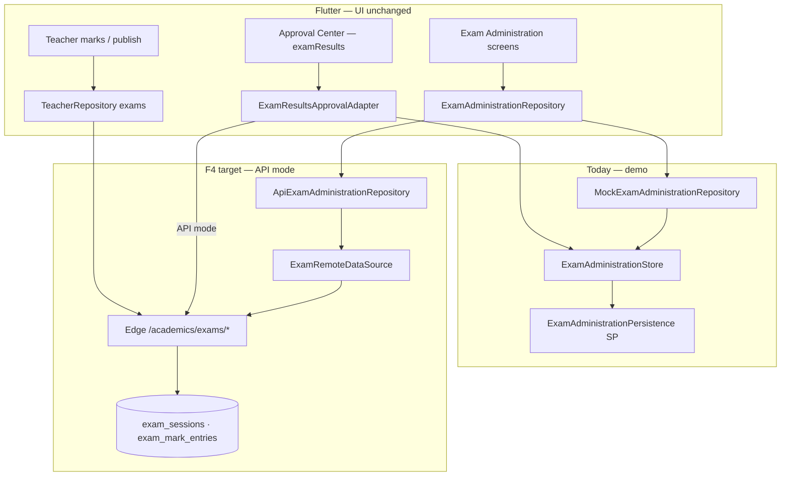

# F4 — Exam Administration API Pre-Implementation Analysis

**Date:** 2026-06-17  
**Phase:** Production Backend Program **F4**  
**Class A item:** A3 Exam administration lifecycle  
**Prerequisite:** **F1 ✅ · F2 ✅ · F3 ✅ certified**  
**Status:** Analysis only — **no implementation**  
**Authority:** `docs/ORCHESTRATOR_AGENT.md`, `docs/PRODUCTION_BACKEND_ROADMAP.md`, `docs/PHASE_F3_FINAL_CERTIFICATION.md`

---

## Executive summary

| Dimension | Current state | F4 target |
|-----------|---------------|-----------|
| **ERP exam lifecycle** | **~25%** — full mock store + SharedPreferences persistence; API stub throws | Server-authoritative create → publish chain |
| **Edge `/academics/exams`** | **0%** — no router module | Full CRUD + phase transitions |
| **DB schema** | **~30%** — `exam_mark_entries` only (mobile/pilot reads) | `exam_sessions` + marks + publish state |
| **Flutter API layer** | **~10%** — `ApiExamAdministrationRepository` stub | Remote + DTOs + mapper + `EXAM_API_ENABLED` gate |
| **F2 publish gate** | **~50%** — `ExamResultsApprovalAdapter` calls local `publishExamResults` | Approve → server publish; API mode skips local store |
| **Teacher mobile overlap** | **~40%** — paths exist (`/teacher/exams/*`); server delegates to mobile entities | Same domain tables as ERP academics |
| **Mock fallback** | `EXAM_API_ENABLED=false` → `MockExamAdministrationRepository` | Preserved for UAT |
| **Production API readiness** | **~71%** (post-F3) | **~81%** after F4 |

**Key finding:** F4 is **mostly greenfield on the server**. Client exam administration UX and lifecycle model already exist (`ExamAdministrationStore`, providers, screens, contract tests). F4 adds authoritative persistence, Edge handlers, and demotes SharedPreferences to offline cache.

---

## Architecture context

### Flag wiring

| Flag | Provider | Repository when `true` |
|------|----------|--------------------------|
| `ENABLE_API_MODE` | `enableApiModeProvider` | Master switch |
| `EXAM_API_ENABLED` | `examApiEnabledProvider` | `ApiExamAdministrationRepository` (replace mock) |

Defined in `lib/core/repositories/repository_config.dart`. Provider currently returns mock only (`examAdministrationRepositoryProvider`).

---

## 1. Client repository architecture

### Layer map

| Layer | Path | Role |
|-------|------|------|
| Contract | `lib/core/repositories/interfaces/exam_administration_repository.dart` | 11 methods: list, CRUD phases, marks, published results |
| Domain | `lib/core/exams/exam_administration_store.dart` | `ExamSession`, `ExamMarkRecord`, `PublishedExamResult`, lifecycle |
| Persistence | `lib/core/exams/exam_administration_persistence.dart` | SharedPreferences `akshara_exam_admin_v1` |
| Mock | `lib/core/repositories/mock/mock_exam_administration_repository.dart` | Delegates to store |
| API stub | `lib/core/repositories/api/exam_administration/api_exam_administration_repository.dart` | **All methods throw `ApiNotConnectedException`** |
| Provider | `examAdministrationRepositoryProvider` | Mock-only today |
| Features | `lib/features/academics/exam_admin/` | List, create, marks entry, mutations |
| Approval | `lib/core/approvals/adapters/exam_results_approval_adapter.dart` | `publishExamResults` on approve (local store) |

### Repository methods (contract)

| Method | Lifecycle step |
|--------|----------------|
| `listExams` | Registry |
| `getExam` | Detail |
| `createExam` | Draft |
| `scheduleExam` | Draft → scheduled + provision mark slots |
| `openMarksEntry` | Scheduled → marks entry |
| `listMarks` / `updateMark` | Marks entry |
| `processResults` | Marks → processed (grades) |
| `verifyCoordinatorResults` | Coordinator sign-off |
| `publishResults` | Processed → published (post-approval) |
| `listPublishedResultsForStudent` | Parent/student read |

### Contract test coverage

`test/contracts/exam_administration/exam_administration_repository_contract_test.dart` — full mock chain create → publish.

`test/integration/exam_administration/exam_persistence_restart_integration_test.dart` — SharedPreferences survival (becomes offline-cache test in F4).

---

## 2. Server state

### Existing tables

| Table | Purpose | F4 fit |
|-------|---------|--------|
| `exam_mark_entries` | Pilot/mobile mark rows (`exam_id` TEXT, no session FK) | **Extend** or migrate to session-backed marks |
| `mobile_entities` | Teacher/parent exam snapshots | Read overlays — demote after F4 |

**Gap:** No `exam_sessions` table. No `published` / `phase` columns on marks. No coordinator verification fields.

### Existing Edge modules (partial overlap)

| Module | Relevance |
|--------|-----------|
| `supabase/functions/_shared/pilot/pilot_operations_*` | Mobile mark PATCH probes |
| `supabase/functions/_shared/teacher/teacher_handlers.ts` | Lists `exam_mark` entities |
| `supabase/functions/_shared/intelligence/exam_intelligence_*` | Reads `exam_mark_entries` for analytics |
| `supabase/functions/_shared/sis/student_360_service.ts` | Aggregates marks for 360 tab |

**No** `academics/exam` router or handlers.

### Proposed API namespace

From `docs/PRODUCTION_BACKEND_ROADMAP.md` §F4.1:

| Method | Path |
|--------|------|
| `GET` | `/academics/exams` |
| `GET` | `/academics/exams/{examId}` |
| `POST` | `/academics/exams` |
| `POST` | `/academics/exams/{examId}/schedule` |
| `POST` | `/academics/exams/{examId}/open-marks` |
| `GET` | `/academics/exams/{examId}/marks` |
| `PATCH` | `/academics/exams/marks/{markEntryId}` |
| `POST` | `/academics/exams/{examId}/process` |
| `POST` | `/academics/exams/{examId}/verify-coordinator` |
| `POST` | `/academics/exams/{examId}/submit-approval` |
| `POST` | `/academics/exams/{examId}/publish` |
| `GET` | `/academics/exams/students/{sisStudentId}/published` |

Teacher paths (`/teacher/exams/marks`, `/process`, `/publish`) should delegate to same repository layer.

---

## 3. F2 approval integration

| Item | Current | F4 target |
|------|---------|-----------|
| Approval type | `examResults` in F2 schema | Unchanged |
| Adapter | `ExamResultsApprovalAdapter` → `_store.publishExamResults` | API mode: `POST /academics/exams/{id}/publish` with `approvalId` |
| Server | F2 `approval_type_handlers.ts` has exam effect stub | Validate approval resolved before publish |
| Client guard | Other adapters skip governance store in API mode | Same pattern for exam adapter |

Publish must be **idempotent** and reject publish without approved `approval_requests` row.

---

## 4. Student ID crosswalk (F3 dependency)

Mark slots reference students by `sisStudentId` (mock codes like `SIS-STU-10421`). Server must:

1. Resolve to `students.id` UUID on write (reuse `sis_student_resolver.ts`).
2. Return mock-compatible codes in API responses where UI expects them.
3. Align `listPublishedResultsForStudent` with parent mobile exam snapshots.

---

## 5. Gap analysis

| # | Gap | Risk | F4 workstream |
|---|-----|------|---------------|
| G1 | No `exam_sessions` migration | Cannot persist lifecycle | F4.0 schema |
| G2 | No Edge academics router | 404 on all API calls | F4.1 handlers |
| G3 | API repository stub | API mode unusable | F4.2 Flutter remote |
| G4 | SharedPreferences is source of truth | Data fork on cutover | F4.2 demote to cache |
| G5 | Approval adapter local publish | Bypasses server in hybrid | F4.3 API-mode guard |
| G6 | Teacher mobile paths disconnected | Duplicate logic | F4.4 teacher delegation |
| G7 | No fake-Dio contract tests for API | Parity unknown | F4.5 tests |
| G8 | `exam_mark_entries` lacks `published` filter | 360 shows draft marks | F4.0 column + 360 SQL guard |
| G9 | No bulk import endpoint | School cutover painful | F4.6 optional import |
| G10 | Patrol exam journeys mock-only | No API fixture path | F4.7 certification |

---

## 6. Workspace note (uncommitted pilot client work)

The branch contains **uncommitted** exam-administration client improvements (screens, persistence, Patrol `pilot_closure_workflows_e2e_test.dart`, providers). These are **pilot closure** artifacts, not F4 server work. Recommend:

1. Separate commit: "Pilot exam administration client hardening"  
2. F4 commit scope: server + API repository only (mirror F2/F3 pattern)

---

## 7. Effort estimate

| Workstream | Effort | Owner |
|------------|--------|-------|
| F4.0 Schema + RLS | M | Backend |
| F4.1 Edge lifecycle handlers | L | Backend |
| F4.2 Flutter API repository | M | Agent A |
| F4.3 Approval publish integration | S | Agent A + D |
| F4.4 Teacher path delegation | M | Backend |
| F4.5 Contract + integration tests | M | Agent E |
| F4.6 Import / migration tooling | S | Backend (optional) |
| F4.7 Certification + Patrol | S | Agent G |

**Total:** 3–4 weeks (XL per roadmap).

---

## 8. Readiness exit criteria

- [ ] `EXAM_API_ENABLED=true` runs full lifecycle on staging without SharedPreferences writes
- [ ] Approve `examResults` in Approval Center triggers server publish
- [ ] Parent/student published results read from API
- [ ] `flutter analyze` 0 errors; contract + integration tests green
- [ ] Patrol exam admin + publish journeys green
- [ ] `PHASE_F4_FINAL_CERTIFICATION.md` published
- [ ] Production API readiness **~81%**

---

## 9. Out of scope (F4)

| Item | Phase |
|------|-------|
| Question paper / seating UI | Post-F4 |
| OMR scanning | Post-F4 |
| Exam intelligence generation | Existing intelligence module |
| Full education module API | Separate `EDUCATION_API_ENABLED` track |

---

## References

- `docs/PRODUCTION_BACKEND_ROADMAP.md` §F4
- `docs/PRE_PRODUCTION_GAP_REPORT.md` — A3
- `lib/core/exams/exam_administration_store.dart`
- `test/contracts/exam_administration/exam_administration_repository_contract_test.dart`
- `supabase/migrations/20260614800000_pilot_operations.sql` — `exam_mark_entries`
