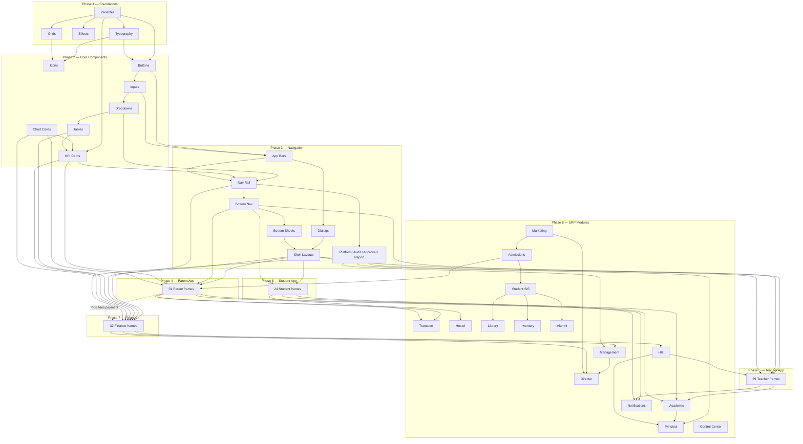

# Akshara ERP — Figma Implementation Roadmap

**Document ID:** `AKS-FIGMA-ROADMAP-v1.0`  
**Purpose:** Phased build plan for the Akshara Figma design system and all module screen libraries  
**Sources:** `DesignSystem.md` · `FigmaDesignSystemBuildGuide.md` · `MobileScreenInventory.md` · `docs/figma-screens/*` · all module specifications  
**Target deliverables:** Published library `Akshara — Master Design System` + 16 module Figma files

---

## Table of Contents

1. [Executive Summary](#1-executive-summary)
2. [Phase Overview](#2-phase-overview)
3. [Phase 1 — Foundations](#3-phase-1--foundations)
4. [Phase 2 — Core Components](#4-phase-2--core-components)
5. [Phase 3 — Navigation System](#5-phase-3--navigation-system)
6. [Phase 4 — Parent App Screens](#6-phase-4--parent-app-screens)
7. [Phase 5 — Teacher App Screens](#7-phase-5--teacher-app-screens)
8. [Phase 6 — Student App Screens](#8-phase-6--student-app-screens)
9. [Phase 7 — Finance Module](#9-phase-7--finance-module)
10. [Phase 8 — Remaining ERP Modules](#10-phase-8--remaining-erp-modules)
11. [Dependency Graph](#11-dependency-graph)
12. [Figma File & Page Map](#12-figma-file--page-map)
13. [Team & Parallelization](#13-team--parallelization)
14. [Quality Gates](#14-quality-gates)

---

## 1. Executive Summary

| Metric | Total |
|--------|-------|
| **Phases** | 8 |
| **Component sets (library)** | ~55 |
| **Component variants (library)** | ~210 |
| **Screen frames (all platforms)** | ~420 |
| **Figma files** | 17 (1 library + 16 modules) |
| **Estimated build hours** | **490–520 h** (~13 weeks @ 40 h/wk, 1 designer) |
| **Existing pixel specs** | 5 screens in `docs/figma-screens/` (PA-01, PA-02, PA-03, TA-01, ST-01) |

**Critical path:** Foundations → Core components → Navigation/shells → Mobile apps (Parent → Teacher → Student) → Finance → Admin modules that mobile apps deep-link into (Academic, Notifications, Transport).

**Publish gate:** Library v1.0 must be published before any module screen file work begins (Phases 4+).

---

## 2. Phase Overview

| Phase | Scope | Component sets | Screens | Figma pages | Build hours |
|-------|-------|----------------|---------|-------------|-------------|
| **1** | Foundations | 0 (+70 tokens) | 0 | 5 | **8 h** |
| **2** | Core components | 28 | 0 | 6 | **18 h** |
| **3** | Navigation & overlays | 27 | 0 | 8 | **20 h** |
| **4** | Parent App | 14 (app-local) | 31 | 8 | **44 h** |
| **5** | Teacher App | 12 (app-local) | 29 | 8 | **40 h** |
| **6** | Student App | 10 (app-local) | 24 | 7 | **34 h** |
| **7** | Finance | 10 (module-local) | 32 | 6 | **52 h** |
| **8** | Remaining ERP | 35 (shared) | 272 | 42 | **280 h** |
| | **Totals** | **~126 sets** | **~420** | **~82** | **~496 h** |

*Screen counts include primary frames, dialogs/wizards, and mobile companion frames per module specs and `MobileScreenInventory.md`.*

---

## 3. Phase 1 — Foundations

**Goal:** Token architecture, typography, elevation, and grid presets — no components yet.  
**File:** `Akshara — Master Design System`  
**Reference:** `FigmaDesignSystemBuildGuide.md` Steps 1–5 · `DesignSystem.md` §3–7

### Deliverables

| Area | Items | Count |
|------|-------|-------|
| **Variables — Primitive** | Color primitives (blue, neutral, red, green, amber, chart) | 19 |
| **Variables — Theme** | Semantic aliases (`color/primary`, `color/surface`, …) · Light + Dark placeholder modes | 17 × 2 modes |
| **Variables — Spacing** | `space/4` through `space/64` (8pt scale) | 8 |
| **Typography** | `type/headline` · `type/title` · `type/body` · `type/label` · `type/mono` | 12 text styles |
| **Typography — Regional** | Noto samples (Telugu, Devanagari, Tamil, Kannada, Malayalam, Urdu) | 7 QA frames |
| **Effects** | `elevation/0`–`elevation/4` + focus-ring documentation | 5 effect styles |
| **Grids** | `grid/mobile-4` · `grid/tablet-8` · `grid/desktop-12` · `grid/desktop-wide-12` | 4 presets |
| **Guides** | `Guides/SafeArea/Mobile` overlay (top 59 · bottom 34) | 1 reference frame |

### Phase 1 estimates

| Metric | Value |
|--------|-------|
| Component sets | 0 |
| Component variants | 0 |
| Token / style items | ~70 |
| Screens | 0 |
| **Figma pages** | 5 — `00 Variables` · `01 Typography` · `02 Effects` · `03 Grids` · `04 Spacing` |
| **Build hours** | **8 h** (4–6 h foundations per build guide + grid/safe-area QA) |

### Exit criteria

- [ ] No raw hex in any downstream component (semantic variables only)
- [ ] All 12 text styles published
- [ ] 4 grid presets applied to reference device frames (`390×844`, `834×1194`, `1440×1024`, `1920×1080`)

---

## 4. Phase 2 — Core Components

**Goal:** Actions, inputs, data display primitives used on every screen.  
**Reference:** `FigmaDesignSystemBuildGuide.md` Steps 6–12 · `DesignSystem.md` §8–13, §22

### Component inventory

| Category | Component set | Variants (approx.) |
|----------|---------------|-------------------|
| **Icons** | `Foundation/Icon` | 6 sizes × 2 styles = 12 |
| **Buttons** | `Actions/Button` | 4 types × 3 sizes × 6 states ≈ 24 |
| | `Actions/IconButton` | 3 sizes × 4 states ≈ 8 |
| | `Actions/FAB` | 2 sizes × 2 states = 4 |
| **Inputs** | `Inputs/TextField` | Type × State × Leading/Trailing ≈ 12 |
| | `Inputs/TextArea` | 2 states | 2 |
| | `Inputs/Checkbox` | Checked × Disabled = 4 |
| | `Inputs/Chip` | Filter · Input · Status ≈ 8 |
| **Dropdowns** | `Inputs/Dropdown` | Compact · Default · Error ≈ 6 |
| | `Inputs/Dropdown/Menu` | — | 3 |
| | `Inputs/DatePickerTrigger` | — | 2 |
| **Tables** | `Data/Table` | Density × Selectable ≈ 6 |
| | `Data/Table/Row` | State variants ≈ 4 |
| | `Data/Table/MobileCard` | — | 2 |
| | `Data/Pagination` | — | 2 |
| **KPI cards** | `Data/KPI/Standard` | 4 accents × trend ≈ 8 |
| | `Data/KPI/Compact` | 4 accents ≈ 4 |
| **Chart cards** | `Data/ChartCard` | 7 chart types × 2 states ≈ 14 |

### Phase 2 estimates

| Metric | Value |
|--------|-------|
| **Component sets** | **28** |
| **Component variants** | **~115** |
| Screens | 0 |
| **Figma pages** | 6 — `10 Icons` · `11 Actions` · `12 Inputs` · `13 Dropdowns` · `14 Tables` · `15 KPI & Charts` |
| **Build hours** | **18 h** (icons 2 + buttons 3 + inputs/dropdowns 4 + tables 4 + KPI/charts 4 + QA 1) |

### Exit criteria

- [ ] Button 6-state matrix complete (Default · Hover · Focus · Pressed · Disabled · Loading)
- [ ] Table swaps to `MobileCard` documented for `<390` width
- [ ] KPI 4 accent colors bound to semantic tokens
- [ ] ChartCard includes accessible data-table fallback link placeholder

---

## 5. Phase 3 — Navigation System

**Goal:** Shells, navigation chrome, overlays, feedback states, and cross-module platform components.  
**Reference:** `FigmaDesignSystemBuildGuide.md` Steps 13–20 · `DesignSystem.md` §9, §14–17, §24–26

### Component inventory

| Category | Component set | Variants (approx.) |
|----------|---------------|-------------------|
| **App bars** | `Nav/AppBar/Web` | Breadcrumb · Title · Actions ≈ 4 |
| | `Nav/AppBar/Mobile` | Back · Title · Actions ≈ 4 |
| **Navigation rail** | `Nav/Rail` | 12 module accents × expanded/collapsed ≈ 24 |
| | `Nav/Drawer` | Mobile web overlay | 2 |
| | `Nav/FilterBar` | Desktop filter row | 2 |
| **Bottom navigation** | `Nav/BottomBar/Parent` | 5 tabs + overflow | 6 |
| | `Nav/BottomBar/Student` | 5 tabs | 5 |
| | `Nav/BottomBar/Teacher` | 5 tabs | 5 |
| | `Nav/BottomBar/Alumni` | 4 tabs | 4 |
| | `Nav/BottomBar/OverflowMenu` | — | 2 |
| **Dialogs** | `Overlays/Dialog` | S/M/L + fullscreen mobile ≈ 8 |
| **Bottom sheets** | `Overlays/BottomSheet` | Half · Full · Drag handle ≈ 4 |
| **Feedback** | `Feedback/Empty` · `Banner` · `ErrorPage` · `InlineError` · `Skeleton` · `Spinner` · `LoadingOverlay` | ≈ 18 |
| **Shells — Mobile** | `Shell/ParentMobileLayout` · `StudentMobileLayout` · `TeacherMobileLayout` · `AlumniMobileLayout` | 4 |
| **Shells — Web** | `Shell/WebAdminLayout` (base) | 2 (expanded/collapsed rail) |
| **Platform — Audit** | `Audit/LogRow` · `DetailDrawer` · `SeverityChip` · `FilterBar` · `DiffViewer` | 5 |
| **Platform — Approval** | `Approval/QueueRow` · `AcademicQueueRow` · `DetailDialog` · `AIRecChip` · `RejectReason` | 5 |
| **Platform — Reports** | `Report/CatalogCard` · `ParameterDrawer` · `PreviewPane` · `ScheduleChip` | 4 |
| **AI** | `AI/AssistChip` · `AI/ChatPanel` · `AI/InsightCard` | 3 |

### Phase 3 estimates

| Metric | Value |
|--------|-------|
| **Component sets** | **27** |
| **Component variants** | **~95** |
| Screens | 0 |
| **Figma pages** | 8 — `20 Navigation` · `21 App Bars` · `22 Bottom Nav` · `23 Dialogs` · `24 Bottom Sheets` · `25 Feedback` · `26 Shells` · `27 Platform (Audit/Approval/Report/AI)` |
| **Build hours** | **20 h** (nav 4 + overlays 3 + mobile nav 2 + states 4 + shells 4 + platform 5 + publish prep 2) |

### Library publish (end of Phase 3)

Publish `Akshara — Master Design System` v1.0 before Phase 4.  
**Combined Phases 1–3:** ~46 h (aligns with build guide **36–40 h** + platform components §24–26).

---

## 6. Phase 4 — Parent App Screens

**Goal:** All Parent mobile frames `P-01`–`P-25` + dialogs `P-D-01`–`P-D-06`.  
**File:** `📁 01 — Parent App`  
**Spec references:** `Parent.md` · `docs/figma-screens/PA-01` · `PA-02` · `PA-03`

### Screen inventory

| Group | IDs | Count | Priority |
|-------|-----|-------|----------|
| Auth & onboarding | P-01–P-03, P-21 | 4 | P0 |
| Dashboard & selector | P-04, P-05 | 2 | P0 |
| Academics | P-06–P-08, P-12 | 4 | P0 |
| Fees | P-09–P-11 | 3 | P0 |
| Communication | P-13, P-14, P-18 | 3 | P0 |
| Profile & settings | P-23–P-25 | 3 | P0 |
| Extended | P-15–P-17, P-19–P-20, P-22 | 6 | P1 |
| **Dialogs** | P-D-01–P-D-06 | 6 | P0–P1 |
| **Total frames** | | **31** | |

### App-local components (new in library or Parent file)

| Component | Used on |
|-----------|---------|
| `Parent/ChildChip` | P-04, P-05, P-D-01 |
| `Parent/QuickActionCard` | P-04 |
| `Parent/FeeDueCard` | P-09 |
| `Parent/AttendanceCalendar` | P-06 |
| `Parent/CalendarDayCell` | P-06 |
| `Parent/HomeworkRow` | P-07 |
| `Parent/MessageThreadBubble` | P-14 |
| `Parent/BusMapCard` | P-15 |
| `Parent/PTMSlotRow` | P-20 |
| `Parent/OnboardingStep` | P-21 |
| `Parent/ReceiptCard` | P-11 |
| `Parent/PaymentMethodRow` | P-10 |
| `Parent/DisciplineRow` | P-19 |
| `Parent/EventCard` | P-17 |

### Phase 4 estimates

| Metric | Value |
|--------|-------|
| **Component sets** | **14** (app-local) |
| **Screens** | **31** (3 fully specced · 28 to build) |
| **Figma pages** | 8 — `Auth` · `Dashboard` · `Academics` · `Fees` · `Messages` · `Transport & Events` · `Profile & More` · `Dialogs & Prototypes` |
| **Build hours** | **44 h** |

| Screen tier | Count | Rate | Hours |
|-------------|-------|------|-------|
| P0 primary (dashboard-class) | 14 | 90 min | 21 h |
| P0 primary (list/form) | 5 | 60 min | 5 h |
| P1 screens | 6 | 60 min | 6 h |
| Dialogs / sheets | 6 | 45 min | 4.5 h |
| App-local components | 14 | 30 min | 7 h |
| Prototype wiring + QA | — | — | 5.5 h |

*Benchmark: `PA-01-ParentDashboard-M.md` = **90 min** per complex dashboard frame.*

### Cross-module prototype links (minimum)

P-09 → P-10 → P-11 (fees) · P-06 → Academic data · P-15 → Transport TR-08 · P-18 → Notifications · P-21 ← Admissions AD-D-09

---

## 7. Phase 5 — Teacher App Screens

**Goal:** All Teacher mobile frames `T-01`–`T-22` + dialogs `T-D-01`–`T-D-07`.  
**File:** `📁 03 — Teacher App`  
**Spec reference:** `docs/figma-screens/TA-01-TeacherDashboard-M.md` · `Teacher.md`

### Screen inventory

| Group | IDs | Count |
|-------|-----|-------|
| Auth | T-01–T-03 | 3 |
| Dashboard & attendance | T-04–T-07 | 4 |
| Teaching | T-08–T-11 | 4 |
| Schedule & comms | T-12–T-14 | 3 |
| HR (leave) | T-05, T-15–T-16 | 3 |
| Class teacher | T-19–T-22 | 4 |
| AI & notifications | T-17–T-18 | 2 |
| **Dialogs** | T-D-01–T-D-07 | 7 |
| **Total** | | **29** |

### App-local components

`Teacher/ClassCard` · `Teacher/AttendanceGrid` · `Teacher/StaffCheckInPanel` · `Teacher/HomeworkComposer` · `Teacher/MarksEntryRow` · `Teacher/LeaveBalanceCard` · `Teacher/BehaviourLogForm` · `Teacher/ClassAnalyticsChart` · `Teacher/StudentListRow` · `Teacher/PeriodBlock` · `Teacher/MessageParentChip` · `Teacher/GeoFenceMap`

### Phase 5 estimates

| Metric | Value |
|--------|-------|
| **Component sets** | **12** |
| **Screens** | **29** (1 specced · 28 to build) |
| **Figma pages** | 8 — `Auth` · `Dashboard` · `Attendance` · `Teaching` · `Messages` · `Leave & HR` · `Class Teacher` · `Dialogs & Prototypes` |
| **Build hours** | **40 h** |

---

## 8. Phase 6 — Student App Screens

**Goal:** All Student mobile frames `S-01`–`S-20` + dialogs `S-D-01`–`S-D-04`.  
**File:** `📁 02 — Student App`  
**Spec reference:** `docs/figma-screens/ST-01-StudentDashboard-M.md` · `Student.md`

### Screen inventory

| Group | IDs | Count |
|-------|-----|-------|
| Auth | S-01–S-03 | 3 |
| Dashboard & learn | S-04–S-08 | 5 |
| Schedule & results | S-09–S-13 | 5 |
| Comms & more | S-14–S-15, S-19–S-20 | 4 |
| Extended | S-10–S-11, S-16–S-18 | 5 |
| **Dialogs** | S-D-01–S-D-04 | 4 |
| **Total** | | **24** |

### App-local components

`Student/SubjectProgressRing` · `Student/HomeworkSubmitCard` · `Student/TimetableGrid` · `Student/ExamResultTile` · `Student/OnlineClassCard` · `Student/PracticePaperRow` · `Student/GalleryTile` · `Student/AIStudyPrompt` · `Student/StreakBadge` · `Student/OfflineQueueBanner`

### Phase 6 estimates

| Metric | Value |
|--------|-------|
| **Component sets** | **10** |
| **Screens** | **24** (1 specced · 23 to build) |
| **Figma pages** | 7 — `Auth` · `Dashboard` · `Learn` · `Schedule & Results` · `More` · `AI` · `Dialogs & Prototypes` |
| **Build hours** | **34 h** |

---

## 9. Phase 7 — Finance Module

**Goal:** Finance web primary + mobile companions + cross-links to Parent fees.  
**File:** `📁 08 — Finance`  
**Reference:** `finance.md` · `MobileScreenInventory.md` (FN-*-M × 11)

### Screen inventory

| Group | IDs | Count | Platform |
|-------|-----|-------|----------|
| Primary screens | FN-01–FN-11 | 11 | Desktop `1440×1024` |
| Dialogs / wizards | D-01–D-10 | 10 | Desktop overlays |
| Mobile companions | FN-02-M, FN-03-M, … (11 total) | 11 | Mobile `390×844` |
| **Total** | | **32** | |

*FN-05 Expenses · FN-06 Payroll per corrected nav in `finance.md` §3.*

### Module-local components

`Finance/LedgerRow` · `Finance/DefaulterRow` · `Finance/PaymentMethodChip` · `Finance/PayrollRunStep` · `Finance/BudgetBar` · `Finance/VendorInvoiceRow` · `Finance/AuditTimeline` · `Finance/ReportExportPanel` · `Finance/CashCollectionFAB` · `Finance/MobileDefaulterCard`

### Shell

`Shell/FinanceLayout` — extends `Shell/WebAdminLayout` with Finance nav rail active items

### Phase 7 estimates

| Metric | Value |
|--------|-------|
| **Component sets** | **10** |
| **Screens** | **32** |
| **Figma pages** | 6 — `FN Dashboard & KPIs` · `Collection & Defaulters` · `Payroll & Expenses` · `Ledgers & Reports` · `Dialogs` · `Mobile Companions` |
| **Build hours** | **52 h** |

| Tier | Count | Rate | Hours |
|------|-------|------|-------|
| P0 desktop (FN-01–03, 05–06, 11) | 7 | 2.5 h | 17.5 h |
| P1 desktop (FN-04, 07–10) | 4 | 2 h | 8 h |
| Dialogs D-01–D-10 | 10 | 1 h | 10 h |
| Mobile companions | 11 | 1 h | 11 h |
| Module components + shell | 11 | 0.75 h | 8 h |
| Prototypes (MG-05, Parent P-09, FN-10 audit) | — | — | 7.5 h |

---

## 10. Phase 8 — Remaining ERP Modules

**Goal:** All administrative web modules, mobile companions, and platform surfaces not covered in Phases 4–7.  
**Build in sub-waves** (parallelizable across designers / module files).

### Module screen totals

| Module | File folder | Primary | Dialogs | Mobile | **Total** | Priority wave |
|--------|-------------|---------|---------|--------|-----------|---------------|
| Management | `04 Management` | 8 | 6 | 8 | **22** | 8A |
| Principal | `05 Principal` | 16 | 8 | — | **24** | 8A |
| Admissions | `07 Admissions` | 10 | 10 | 6 | **26** | 8A |
| HR | `09 HR` | 9 | 7 | 3 | **19** | 8A |
| Academic | `10 Academic` | 8 | 6 | — | **14** | 8A |
| Student SIS | `11 Student SIS` | 8 | 7 | — | **15** | 8A |
| Notifications | `12 Notifications` | 6 | 5 | — | **11** | 8A |
| Marketing | `06 Marketing` | 10 | 9 | — | **19** | 8B |
| Transport | `06 Transport` | 9 | 5 | 4 | **18** | 8B |
| Hostel | `05 Hostel` | 9 | 9 | 4 | **22** | 8B |
| Director | `00 Director` | 9 | 5 | — | **14** | 8B |
| Library | `11 Library` | 8 | 5 | 4 | **17** | 8C |
| Inventory | `12 Inventory` | 8 | 6 | 3 | **17** | 8C |
| Alumni | `13 Alumni` | 10 | 5 | 8 | **23** | 8C |
| Akshara Control Center | `00 Platform` | 12 | 8 | — | **20** | 8C |
| **Phase 8 subtotal** | | **130** | **101** | **40** | **272** | |

### Sub-wave schedule

| Sub-wave | Modules | Screens | Hours | Rationale |
|----------|---------|---------|-------|-----------|
| **8A — Core admin** | MG, PR, AD, HR, AC, SIS, NT | 132 | **140 h** | Blocks mobile deep-links; approvals + SIS onboarding |
| **8B — Operations** | MK, TR, HO, DR | 73 | **75 h** | Parent/Teacher transport & hostel flows |
| **8C — Extended** | LB, INV, AL, ACC | 77 | **65 h** | P1/P2 · platform ops |

### Shared components (built once, reused)

| Set | Modules |
|-----|---------|
| `Shell/ManagementLayout` · `PrincipalLayout` · `AdmissionsLayout` · … (12 web shells) | All admin |
| `CRM/PipelineCard` · `KanbanColumn` | AD, MK |
| `Ops/LiveMap` · `RouteRow` · `VehicleCard` | TR |
| `Hostel/BedGrid` · `VisitorQR` · `GatePass` | HO |
| `SIS/StudentProfileHeader` · `DocumentVaultRow` | SIS |
| `Platform/SchoolRegistryRow` · `SubscriptionPlanCard` | ACC |

### Phase 8 estimates

| Metric | Value |
|--------|-------|
| **Component sets** | **35** (shells + shared patterns) |
| **Screens** | **272** |
| **Figma pages** | **42** (~3 pages per module avg.) |
| **Build hours** | **280 h** |

| Build type | Count | Rate | Hours |
|------------|-------|------|-------|
| Desktop dashboard (KPI + charts) | 18 | 2.5 h | 45 h |
| Desktop table / form screen | 85 | 1.5 h | 128 h |
| Dialog / wizard | 101 | 0.75 h | 76 h |
| Mobile companion | 40 | 0.75 h | 30 h |
| Module shells + shared components | 35 | 0.3 h | 11 h |

---

## 11. Dependency Graph

What must exist before downstream screens can be built.



### Dependency rules (summary)

| Rule | Detail |
|------|--------|
| **Hard** | Phases 1 → 2 → 3 are sequential; library publish before Phase 4 |
| **Hard** | Shell + BottomNav before any mobile app screen |
| **Hard** | KPI + Chart + Table before Finance and Management dashboards |
| **Hard** | Approval + Report platform components before MG-03, PR-06/07, MG-08 |
| **Soft** | Parent App (Phase 4) before Finance mobile companions that show payment status |
| **Soft** | Academic (8A) before Teacher/Student academic screens need admin cross-links |
| **Soft** | Admissions + SIS (8A) before Parent P-21 onboarding prototype |
| **Soft** | Transport + Hostel (8B) before Parent P-15 / Student S-14 bus tracking |
| **Parallel** | Phases 4, 5, 6 can run in parallel after Phase 3 (separate Figma files) |
| **Parallel** | Phase 8 sub-waves 8A / 8B / 8C can run in parallel after Phase 7 shell patterns exist |

---

## 12. Figma File & Page Map

### Files (17 total)

| # | Figma file | Phases | Est. pages |
|---|------------|--------|------------|
| 00 | `Akshara — Master Design System` | 1–3 | 27 |
| 01 | `Parent App` | 4 | 8 |
| 02 | `Student App` | 6 | 7 |
| 03 | `Teacher App` | 5 | 8 |
| 04 | `Management` | 8A | 4 |
| 05 | `Principal` | 8A | 5 |
| 05b | `Hostel` | 8B | 4 |
| 06 | `Transport` | 8B | 4 |
| 06b | `Marketing` | 8B | 4 |
| 07 | `Admissions` | 8A | 5 |
| 08 | `Finance` | 7 | 6 |
| 09 | `HR` | 8A | 4 |
| 10 | `Academic` | 8A | 3 |
| 11 | `Student SIS` | 8A | 4 |
| 11b | `Library` | 8C | 3 |
| 12 | `Notifications` | 8A | 3 |
| 12b | `Inventory` | 8C | 3 |
| 13 | `Alumni` | 8C | 4 |
| 00b | `Director` | 8B | 3 |
| 00c | `Akshara Control Center` | 8C | 5 |

### Frame naming (all files)

```
{MODULE}-{##}-{ScreenName}-{D|T|M}
```

Examples: `PA-01-ParentDashboard-M` · `FN-03-PendingFees-D` · `MG-03-ApprovalsCenter-D`

### Existing build specs (`docs/figma-screens/`)

| Spec file | Status | Phase |
|-----------|--------|-------|
| `PA-01-ParentDashboard-M.md` | Ready | 4 |
| `PA-02-ParentAttendance-M.md` | Ready | 4 |
| `PA-03-ParentFees-M.md` | Ready | 4 |
| `TA-01-TeacherDashboard-M.md` | Ready | 5 |
| `ST-01-StudentDashboard-M.md` | Ready | 6 |

**Backlog:** Remaining ~415 frames need matching spec files before dev handoff (optional for Figma build; recommended for Flutter parity).

---

## 13. Team & Parallelization

### Single designer (sequential)

| Weeks | Phases | Hours |
|-------|--------|-------|
| 1 | 1 + 2 + 3 (library v1.0) | 46 |
| 2–3 | 4 Parent + 5 Teacher | 84 |
| 4 | 6 Student | 34 |
| 5–6 | 7 Finance | 52 |
| 7–13 | 8A → 8B → 8C | 280 |

**Total:** ~13 weeks

### Two designers (recommended)

| Designer A | Designer B |
|------------|------------|
| Phases 1–3 (library) | — |
| Phase 4 Parent | Phase 5 Teacher (after wk 1) |
| Phase 7 Finance | Phase 6 Student |
| Phase 8A (MG, PR, AD) | Phase 8A (HR, AC, SIS, NT) |
| Phase 8B Transport + Hostel | Phase 8B Marketing + Director |
| Phase 8C ACC + Alumni | Phase 8C Library + Inventory |

**Total:** ~7–8 weeks

---

## 14. Quality Gates

### Per-phase sign-off

| Gate | Check |
|------|-------|
| **G1 — Foundations** | Variable audit: 0 detached hex in library |
| **G2 — Components** | Variant matrix matches `DesignSystem.md` §22 |
| **G3 — Navigation** | 4 mobile bottom bars + 12-module nav rail |
| **G4 — Mobile apps** | All P0 frames prototyped · 48px touch targets |
| **G5 — Finance** | FN-01 operational dashboard matches MG-05 drill pattern |
| **G6 — ERP** | MG-03 uses shared `Approval/*` · FN-10 uses `Audit/*` · MG-08 uses `Report/*` |
| **G7 — Handoff** | `ArchitectureReview.md` design sign-off items complete |

### Accessibility pass (every phase)

- Focus ring visible on all interactive variants
- Status chips: icon + text (never color-only)
- Chart frames include data-table fallback link
- Regional typography spot-check on Parent/Student language screens (P-02, S-02)

---

## Appendix A — Hours Summary Chart

```
Phase 1  ████                                    8 h
Phase 2  █████████                               18 h
Phase 3  ██████████                              20 h
Phase 4  ██████████████████████                  44 h
Phase 5  ████████████████████                    40 h
Phase 6  █████████████████                       34 h
Phase 7  ██████████████████████████              52 h
Phase 8  █████████████████████████████████████████████████████████████████████████████████████████  280 h
         |----+----+----+----+----+----+----+----+----+----+----+----+|
         0   50  100  150  200  250  300  350  400  450  500 h
```

---

## Appendix B — Source Document Index

| Document | Roadmap use |
|----------|-------------|
| `DesignSystem.md` | Tokens, components §24–26, Figma organization |
| `FigmaDesignSystemBuildGuide.md` | Step-by-step library build, hour benchmarks |
| `MobileScreenInventory.md` | Mobile frame IDs, folder map, build waves |
| `Parent.md` · `Teacher.md` · `Student.md` | Phases 4–6 screen lists |
| `finance.md` | Phase 7 screens + dialogs |
| All other `docs/*.md` module specs | Phase 8 inventories |
| `docs/figma-screens/*` | Pixel-perfect templates for dashboard-tier screens |

---

**End of Figma Implementation Roadmap v1.0**
