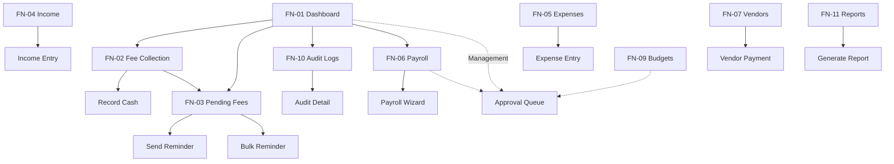

# Akshara ERP — Finance Module Specification (Consolidated)

**Document ID:** `AKS-FN-SPEC-v1.0`  
**Module:** Finance Dashboard  
**Screens:** FN-01 → FN-11  
**Platform:** Web primary (`1440×1024`) · Tablet (`834×1194`) · Mobile companion (`390×844`)  
**Source:** SRS Part 3 · Part 6 · Part 8/12 · Master Design System v1 · Finance IA

---

## Table of Contents

1. [Module Overview](#1-module-overview)
2. [User Roles & Permissions](#2-user-roles--permissions)
3. [Navigation & Information Architecture](#3-navigation--information-architecture)
4. [Shared Design Foundation](#4-shared-design-foundation)
5. [Shared Shell Layout](#5-shared-shell-layout)
6. [Shared Components](#6-shared-components)
7. [FN-01 — Finance Dashboard](#7-fn-01--finance-dashboard)
8. [FN-02 — Fee Collection](#8-fn-02--fee-collection)
9. [FN-03 — Pending Fees / Defaulters](#9-fn-03--pending-fees--defaulters)
10. [FN-04 — Income Management](#10-fn-04--income-management)
11. [FN-05 — Expense Management](#11-fn-05--expense-management)
12. [FN-06 — Payroll](#12-fn-06--payroll)
13. [FN-07 — Vendor Payments](#13-fn-07--vendor-payments)
14. [FN-08 — Ledgers](#14-fn-08--ledgers)
15. [FN-09 — Budgets](#15-fn-09--budgets)
16. [FN-10 — Audit Logs](#16-fn-10--audit-logs)
17. [FN-11 — Financial Reports](#17-fn-11--financial-reports)
18. [Dialogs & Wizards](#18-dialogs--wizards)
19. [Cross-Module Links](#19-cross-module-links)
20. [Prototype Flow Map](#20-prototype-flow-map)
21. [Responsive Rules](#21-responsive-rules)
22. [Figma File Organization](#22-figma-file-organization)
23. [Build Checklist](#23-build-checklist)

---

## 1. Module Overview

### Purpose

Complete school financial operations: fee collection, pending fees, income, expenses, payroll, vendor payments, ledgers, budgets, audit logs, and regulatory reports (SRS Part 3 §1–4, §18).

### Screen Inventory

| ID | Screen | Primary Users | Priority |
|----|--------|---------------|----------|
| FN-01 | Finance Dashboard | Finance Manager, Management | P0 |
| FN-02 | Fee Collection | Finance Manager | P0 |
| FN-03 | Pending Fees / Defaulters | Finance Manager | P0 |
| FN-04 | Income Management | Finance Manager | P1 |
| FN-05 | Expense Management | Finance Manager, Management | P0 |
| FN-06 | Payroll | Finance Manager, Management | P0 |
| FN-07 | Vendor Payments | Finance Manager | P1 |
| FN-08 | Ledgers | Finance Manager | P1 |
| FN-09 | Budgets | Finance Manager, Management | P1 |
| FN-10 | Audit Logs | Finance Manager, Management, Director 👁 | P1 |
| FN-11 | Financial Reports | Finance Manager, Management, Director 👁 | P0 |

**Total frames (desktop):** 11 primary + 8 dialogs/wizards = **19**

---

## 2. User Roles & Permissions

| Action | Finance Manager | Management | Director | Principal |
|--------|-----------------|------------|----------|-----------|
| View all finance screens | ✅ | 👁 | 🏢 aggregate | ❌ |
| Record cash payment | ✅ | ❌ | ❌ | ❌ |
| Send fee reminders | ✅ | ❌ | ❌ | ❌ |
| Process payroll | ✅ | 🔒 approve | ❌ | ❌ |
| Approve expenses | ✅ submit | 🔒 approve | ❌ | ❌ |
| Vendor payments | ✅ | 🔒 large amounts | ❌ | ❌ |
| Export reports | ✅ | ✅ | ✅ | ❌ |
| View audit logs | ✅ | 👁 | 🏢 | ❌ |
| Modify fee structures | ✅ | ❌ | ❌ | ❌ |

---

## 3. Navigation & Information Architecture

### Side Navigation (All FN Screens)

| # | Label | Icon | Screen |
|---|-------|------|--------|
| 1 | Dashboard | `dashboard` | FN-01 |
| 2 | Fee Collection | `payments` | FN-02 |
| 3 | Pending Fees | `pending_actions` | FN-03 |
| 4 | Income | `trending_up` | FN-04 |
| 5 | Expenses | `receipt_long` | FN-05 |
| 6 | Payroll | `badge` | FN-06 |
| 7 | Vendors | `store` | FN-07 |
| 8 | Ledgers | `menu_book` | FN-08 |
| 9 | Budgets | `account_balance` | FN-09 |
| 10 | Audit Logs | `gavel` | FN-10 |
| 11 | Reports | `assessment` | FN-11 |

### Screen Hierarchy

```
FN-01 Dashboard
├── FN-02 Fee Collection
├── FN-03 Pending Fees
│   └── Dialog: Send Reminder / Record Cash
├── FN-04 Income
├── FN-05 Expenses
│   └── Dialog: Expense Entry
├── FN-06 Payroll
│   └── Wizard: Payroll Run
├── FN-07 Vendor Payments
├── FN-08 Ledgers (Tabs: Cash · Day · General)
├── FN-09 Budgets
├── FN-10 Audit Logs
│   └── Dialog: Audit Detail
└── FN-11 Reports
    └── Dialog: Generate Report
```

---

## 4. Shared Design Foundation

> **Apply once across all FN screens.** Do not re-specify per screen unless overridden.

### Frame Presets

| Breakpoint | Size | Grid | Content width |
|------------|------|------|---------------|
| Desktop | `1440×1024` | 12 col · margin 24 · gutter 24 | `1136` (main column) |
| Tablet | `834×1194` | 8 col · margin 24 | `786` |
| Mobile | `390×844` | 4 col · margin 16 | `358` |

### Color Tokens

| Token | Hex | Usage |
|-------|-----|-------|
| `color/primary` | `#1565C0` | CTAs, active nav, links, progress |
| `color/primary-container` | `#E3F2FD` | AI panels, selected rows |
| `color/on-primary-container` | `#0D47A1` | Text on primary container |
| `color/surface` | `#FFFFFF` | Cards, nav, inputs |
| `color/surface-container-low` | `#F8FAFC` | Page background |
| `color/surface-container-highest` | `#E8EDF3` | Table headers |
| `color/on-surface` | `#1E293B` | Primary text |
| `color/on-surface-variant` | `#64748B` | Labels, metadata |
| `color/outline-variant` | `#E2E8F0` | Borders, dividers |
| `color/success` | `#2E7D32` | Collected, paid, approved |
| `color/success-container` | `#E8F5E9` | Success chips/banners |
| `color/error` | `#D32F2F` | Overdue, deficit, critical |
| `color/error-container` | `#FFEBEE` | Alert banners |
| `color/warning` | `#F57C00` | Pending, behind target |
| `color/warning-container` | `#FFF3E0` | Warning chips |

### Typography (Key Styles)

| Style | Size/LH | Use |
|-------|---------|-----|
| `type/headline/medium` | 28/36 | Page titles |
| `type/title/medium` | 16/24 | Section titles |
| `type/title/small` | 14/20 | KPI values (compact) |
| `type/body/large` | 16/24 | Table cells |
| `type/body/medium` | 14/20 | Labels, banner text |
| `type/body/small` | 12/16 | Breadcrumb, pagination |
| `type/label/large` | 14/20 | Buttons |
| `type/label/small` | 11/16 | Table headers |

### Spacing Scale

`4 · 8 · 12 · 16 · 20 · 24 · 32` — section padding **`24`**, card gap **`16`**, form gap **`24`**.

### Elevation & Radius

| Token | Value |
|-------|-------|
| `elevation/1` | Y1 Blur3 @ 8% |
| `elevation/3` | Y4 Blur12 @ 12% |
| `radius/md` | 12px (cards, tables) |
| `radius/sm` | 8px (chips, banners) |
| `radius/xl` | 20px (buttons) |

---

## 5. Shared Shell Layout

**Component:** `Shell/FinanceLayout` — duplicate on every FN screen; only change `ActiveItem` and main content.

```
FN-XX [1440×1024]
└── Shell/FinanceLayout [H, Fill×Fill]
    ├── Nav/Rail-Finance [256×Fill, Fixed W]
    └── Main/ContentColumn [Fill×Fill, scroll]
        ├── Nav/AppBar-Finance [Fill×64]
        ├── [Screen-specific filter bar 56px]
        ├── [Screen body sections]
        └── Spacer/Bottom [32px]
```

| Layer | Auto Layout | Size | Constraints |
|-------|-------------|------|-------------|
| Shell | H → Gap 0 | Fill×Fill | — |
| Nav Rail | V ↓ Gap 4 Pad 12/8 | W `256` H Fill | Left · Top · Bottom |
| Main | V ↓ Gap 0 | W Fill H Fill | Fill · Scroll |
| App Bar | H Space-between Pad 0 24 | H `64` | Top · Fill width |

### App Bar (Shared)

| Zone | Content |
|------|---------|
| Left | Breadcrumb `Finance / {Screen}` + Page title |
| Right | `AI/AssistChip` · `notifications` + badge · Avatar |

### Filter Bar (Shared Pattern)

| Property | Value |
|----------|-------|
| Height | `56` |
| Layout | H · Center · Gap `12` · Pad `8 24` |
| Left cluster | FY · Period dropdowns · context chips |
| Right cluster | `Spacer/Fill` · `Export` Outlined · Primary CTA |

---

## 6. Shared Components

### `Data/KPI` — Standard `176×120` (6-up row)

| Zone | Spec |
|------|------|
| Pad | `16` |
| Icon | `40×40` `primary-container` circle · icon `28` |
| Label | `body/small` muted |
| Value | `headline/small` |
| Delta chip | `label/small` · Pad `4 8` · Radius `8` |

**Variants:** `Accent: None|Primary|Success|Error|Warning` · `HasDelta: T/F`

### `Data/KPI/Compact` — `272×88` (4-up) or `176×88` (6-up)

Same anatomy · icon `32×32` · value `title/small`

### `Data/Table` — Standard

| Part | Height | Spec |
|------|--------|------|
| Header | `48` | `surface-container-highest` · `label/small` |
| Row | `52` compact / `64` comfortable | Hover `surface-container-low` |
| Pagination | `56` | "Showing X–Y of Z" + controls |
| Container | — | Radius `12` · Border 1px `outline-variant` |

### `Data/ChartCard` — `320` height standard

Header `48` · Plot fill · Legend `40` · Pad `20–24`

### `Cell/ProgressBar` — Used in collection tables

Track `80×6` · Fill by % · Tier colors: ≥80 success · 60–79 warning · <60 error

### `Feedback/Banner`

Pad `12 16` · Radius `8` · Variants: Error · Warning · Success · Info

---

## 7. FN-01 — Finance Dashboard

| Property | Value |
|----------|-------|
| **Frame** | `FN-01-FinanceDashboard-D` |
| **Nav active** | Dashboard |
| **Scroll height** | ~`1280` |

### Layout Structure

| # | Section | Size | Notes |
|---|---------|------|-------|
| 1 | Filter bar | Fill×56 | FY · Month · Date range · Export · — |
| 2 | KPI row | 6 × `176×120` | Gap 16 · Pad 24 |
| 3 | Charts row | `624×320` + `496×320` | Collection trend line · Expense donut |
| 4 | Defaulters table | Fill×~348 | Top 5 rows + pagination |
| 5 | Split row | 2 × `560×280` | Recent transactions · Pending approvals |
| 6 | Audit banner | Fill×48+ | Error container · "3 unaudited fee modifications" |

### KPI Cards

| # | Label | Value | Accent |
|---|-------|-------|--------|
| 1 | Fee Collected (MTD) | ₹42.0L | success |
| 2 | Pending Fees | ₹18.0L | error |
| 3 | Expenses (MTD) | ₹12.4L | warning |
| 4 | Payroll (MTD) | ₹28.0L | none |
| 5 | Cash Balance | ₹8.2L | primary |
| 6 | Audit Alerts | 3 | error |

### Defaulters Table Columns

`ID 100 · Name 356 · Class 80 · Amount 140 · Days 100 · Last Reminder 160 · Actions 200`

### Prototype Links

| From | To |
|------|-----|
| KPI Pending | FN-03 |
| KPI Collected | FN-02 |
| KPI Audit | FN-10 |
| View all defaulters | FN-03 |
| Nav items | Respective screens |

---

## 8. FN-02 — Fee Collection

| Property | Value |
|----------|-------|
| **Frame** | `FN-02-FeeCollection-D` |
| **Nav active** | Fee Collection |
| **Scroll height** | ~`1184` |

### Layout Structure

| # | Section | Size |
|---|---------|------|
| 1 | Filter bar | FY · Term · Fee type · Class chip · Export · **Record Collection** |
| 2 | Summary hero | `1136×128` | 3 metrics + `120×120` progress ring (68%) |
| 3 | Mini KPI row | 4 × `272×88` | Tuition · Transport · Hostel · Exam&Activity |
| 4 | Tabs + charts | Tab 48px + `744×320` stacked bar + `376×320` donut |
| 5 | Class table | 12 rows · progress bar % column |
| 6 | Fee type accordion | 5 items · 1 expanded |

### Hero Metrics

| Block | Value |
|-------|-------|
| Target | ₹1.24Cr |
| Collected | ₹84.2L (68%) |
| Pending | ₹39.8L · 312 students |

### Class Table Columns (sum 1136)

`Class 100 · Students 90 · Target 130 · Collected 130 · Pending 130 · % 160 · Defaulters 100 · Last Collection 140 · Actions 156`

### Tabs

`By Class` (active) · `By Fee Type` · `Monthly Trend`

### Prototype Links

| From | To |
|------|-----|
| Record Collection | Dialog `RecordCashPayment` |
| Row View / Remind | FN-03 filtered |
| Hero Pending | FN-03 |

---

## 9. FN-03 — Pending Fees / Defaulters

| Property | Value |
|----------|-------|
| **Frame** | `FN-03-PendingFees-D` |
| **Nav active** | Pending Fees |
| **Purpose** | Defaulter management, bulk reminders, cash recording |

### Layout Structure

| # | Section | Size |
|---|---------|------|
| 1 | Filter bar | Class · Min amount · Days overdue · Fee type · **Send Bulk Reminder** |
| 2 | Alert banner | Warning · "142 students overdue · ₹18.0L total" |
| 3 | KPI row | 4 × `272×88` | Total pending · Avg days overdue · Reminders sent (7d) · Collection forecast |
| 4 | Bulk action bar | `48` | Select all · `24` selected · Send · Export |
| 5 | Defaulters table | Full list · checkbox column · sortable |
| 6 | AI insight card | `1136×72` | Smart reminder timing suggestion |

### Table Columns (sum 1136)

`☐ 48 · ID 100 · Name 280 · Class 80 · Amount 120 · Days 100 · Fee Type 120 · Last Reminder 140 · Parent Contact 140 · Actions 108`

### Row Actions

`notifications` Remind · `payments` Record cash · `visibility` Student fee detail

### Row States

`Default · Hover · Selected · OverdueCritical (>30 days)`

### Unique Components

| Component | Spec |
|-----------|------|
| `Chip/DaysOverdue` | 0–7 neutral · 8–30 warning · 31+ error |
| `BulkActionBar` | Sticky below filter when rows selected |

### Prototype Links

| From | To |
|------|-----|
| Send Reminder | Dialog `SendFeeReminder` → Snackbar |
| Record cash | Dialog `RecordCashPayment` |
| Bulk Reminder | Dialog `BulkReminder` 720px |
| AI card | Finance AI chat dock |

---

## 10. FN-04 — Income Management

| Property | Value |
|----------|-------|
| **Frame** | `FN-04-Income-D` |
| **Nav active** | Income |
| **Purpose** | Track fees, donations, grants, other income (SRS Part 3 §3) |

### Layout Structure

| # | Section | Size |
|---|---------|------|
| 1 | Filter bar | FY · Month · Source type · **+ Record Income** |
| 2 | KPI row | 4 × `272×88` | Total income MTD · Student fees · Donations · Other |
| 3 | Charts | `744×320` income trend line · `376×320` source donut |
| 4 | Income table | All entries · filterable |
| 5 | Quick entry card | `360×` right dock optional — collapsed to FAB on tablet |

### Table Columns

`Date 120 · Source 160 · Category 140 · Description 280 · Amount 120 · Reference 120 · Recorded By 120 · Actions 76`

### Income Categories

Student Fees · Donations · Grants · Government Aid · Event Income · Miscellaneous

### Prototype Links

| From | To |
|------|-----|
| + Record Income | Dialog `IncomeEntry` 560px |
| Row edit | Dialog `IncomeEntry` pre-filled |

---

## 11. FN-05 — Expense Management

| Property | Value |
|----------|-------|
| **Frame** | `FN-05-Expenses-D` |
| **Nav active** | Expenses |
| **Purpose** | Expense tracking, categories, budget linkage (SRS Part 3 §3) |

### Layout Structure

| # | Section | Size |
|---|---------|------|
| 1 | Filter bar | FY · Month · Category · Department · **+ Add Expense** |
| 2 | KPI row | 4 × `272×88` | Total MTD · vs Budget · Top category · Pending approval |
| 3 | Charts | `560×320` treemap by category · `560×320` budget vs actual bullet |
| 4 | Expense table | Status column · receipt attachment icon |
| 5 | Pending approval queue | `1136×` card list if items exist |

### Table Columns

`Date 110 · Category 130 · Vendor 160 · Description 240 · Amount 110 · Payment 100 · Status 100 · Budget Line 120 · Actions 66`

### Status Chips

Draft · Submitted · Approved · Rejected · Paid

### Expense Categories

Salaries · Fuel · Electricity · Water · Internet · Maintenance · Marketing · Purchases · Miscellaneous

### Prototype Links

| From | To |
|------|-----|
| + Add Expense | Dialog `ExpenseEntry` 560px |
| Approve (Management) | Dialog confirm |
| Over budget row | Banner + AI insight |

---

## 12. FN-06 — Payroll

| Property | Value |
|----------|-------|
| **Frame** | `FN-06-Payroll-D` |
| **Nav active** | Payroll |
| **Purpose** | Salary processing, payslips, deductions (SRS Part 3 §4) |

### Layout Structure

| # | Section | Size |
|---|---------|------|
| 1 | Filter bar | Pay period · Department · Status · **Process Payroll** |
| 2 | Summary hero | `1136×112` | Gross · Deductions · Net · Employees processed |
| 3 | KPI row | 4 × `272×88` | Headcount · Net payout · Tax · Pending approval |
| 4 | Department chart | `1136×280` | Stacked bar by department |
| 5 | Payroll table | Employee salary lines |
| 6 | Process history | Collapsible panel · last 6 runs |

### Table Columns

`☐ 48 · Employee 200 · Dept 120 · Gross 110 · Deductions 100 · Net 110 · Status 100 · Payslip 80 · Actions 78`

### Payroll Wizard (Dialog Large `720×`)

| Step | Content |
|------|---------|
| 1 | Select month · confirm period |
| 2 | Review employee list · exceptions flagged |
| 3 | Deductions summary |
| 4 | Confirm · irreversible warning banner |
| 5 | Success · download summary |

### Status Values

Not Processed · Processed · Approved · Disbursed · On Hold

### Prototype Links

| From | To |
|------|-----|
| Process Payroll | Wizard `PayrollRun` |
| Payslip icon | Dialog `PayslipPreview` 560px |
| Management approve | FN-01 pending approvals |

---

## 13. FN-07 — Vendor Payments

| Property | Value |
|----------|-------|
| **Frame** | `FN-07-VendorPayments-D` |
| **Nav active** | Vendors |
| **Purpose** | Vendor invoices, PO linkage, payment scheduling (SRS Part 3 §16) |

### Layout Structure

| # | Section | Size |
|---|---------|------|
| 1 | Filter bar | Vendor · Status · Due date · **+ Schedule Payment** |
| 2 | KPI row | 4 × `272×88` | Due this week · Overdue · Paid MTD · Active vendors |
| 3 | Split view | `760` table + `360` vendor detail panel |
| 4 | Calendar strip | `1136×64` | Upcoming payment dates |

### Table Columns

`Vendor 180 · Invoice 120 · PO 100 · Amount 120 · Due 100 · Status 100 · Method 100 · Actions 116` + fill

### Status Chips

Scheduled · Paid · Overdue · Failed · Cancelled

### Vendor Detail Panel (right)

Vendor info · contact · YTD spend · open invoices · `Pay Now` CTA

### Prototype Links

| From | To |
|------|-----|
| Schedule Payment | Dialog `VendorPayment` 560px |
| Row Pay | Dialog confirm + method |
| Vendor name | Panel populate |

---

## 14. FN-08 — Ledgers

| Property | Value |
|----------|-------|
| **Frame** | `FN-08-Ledgers-D` |
| **Nav active** | Ledgers |
| **Purpose** | Cash book, day book, general ledger (SRS Part 3 §3) |

### Layout Structure

| # | Section | Size |
|---|---------|------|
| 1 | Filter bar | FY · Date range · Account · **Export Ledger** |
| 2 | Tabs | Cash Book · Day Book · General Ledger |
| 3 | Account selector | Dropdown + balance chip |
| 4 | Ledger table | Debit · Credit · Balance columns |
| 5 | Running balance footer | Sticky bottom summary |

### Tab: Cash Book Columns

`Date 110 · Voucher 100 · Particulars 300 · Debit 120 · Credit 120 · Balance 120 · Ref 106`

### Tab: General Ledger

Split master-detail: accounts list `280` left · entries `856` right

### Entry Row Variants

`Debit · Credit · Opening · Closing`

### Prototype Links

| From | To |
|------|-----|
| Row ref | FN-10 audit (if modified) |
| Export | Dialog format picker |

---

## 15. FN-09 — Budgets

| Property | Value |
|----------|-------|
| **Frame** | `FN-09-Budgets-D` |
| **Nav active** | Budgets |
| **Purpose** | Annual/department budgets, vs actual, approvals (SRS Part 3 §5) |

### Layout Structure

| # | Section | Size |
|---|---------|------|
| 1 | Filter bar | FY · Department · **+ Create Budget Line** |
| 2 | KPI row | 4 × `272×88` | Total budget · Spent · Remaining · Over-budget lines |
| 3 | Chart | `1136×320` | Bullet chart budget vs actual by department |
| 4 | Budget table | Variance column color-coded |
| 5 | Approval queue | Lines exceeding threshold |

### Table Columns

`Department 160 · Category 140 · Budget 120 · Actual 120 · Variance 120 · % Used 160 · Status 100 · Actions 96`

### Variance Colors

Under 80% success · 80–100% warning · >100% error

### Status

Draft · Submitted · Approved · Locked

### Prototype Links

| From | To |
|------|-----|
| Submit for approval | → Management approval (FN-01 queue) |
| Over budget | FN-05 expense filtered |

---

## 16. FN-10 — Audit Logs

| Property | Value |
|----------|-------|
| **Frame** | `FN-10-AuditLogs-D` |
| **Nav active** | Audit Logs |
| **Purpose** | Immutable change log — fees, salaries, config (SRS Part 3 §18, Part 5 §10) |

### Layout Structure

| # | Section | Size |
|---|---------|------|
| 1 | Filter bar | Module · User · Severity · Date · Search |
| 2 | Alert banner | Error if unresolved critical items |
| 3 | KPI row | 4 × `272×88` | Today · Critical · Fee changes · Unresolved |
| 4 | Audit table | Expandable diff preview |
| 5 | Severity legend | Inline chip row |

### Table Columns

`Timestamp 160 · User 140 · Module 100 · Action 120 · Record 100 · Summary flex · Severity 80 · Actions 60`

### Severity Chips

Info `primary` · Warning `warning` · Critical `error`

### Audit Detail Dialog `720×`

Before/after JSON diff · user · IP · timestamp · related record link

### Prototype Links

| From | To |
|------|-----|
| Row expand | Inline diff or dialog |
| Fee change record | FN-03 student context |
| From FN-01 banner | Pre-filtered critical |

---

## 17. FN-11 — Financial Reports

| Property | Value |
|----------|-------|
| **Frame** | `FN-11-FinancialReports-D` |
| **Nav active** | Reports |
| **Purpose** | P&L, balance sheet, cash flow, collection reports (SRS Part 3 §3) |

### Layout Structure

| # | Section | Size |
|---|---------|------|
| 1 | Filter bar | FY · Period · Report type |
| 2 | Report catalog grid | 3 × `360×160` cards · 2 rows |
| 3 | Preview pane | `1136×480` | PDF-style preview |
| 4 | Generate toolbar | Format · Schedule · Email |

### Report Cards (6)

| Report | Icon |
|--------|------|
| Profit & Loss | `analytics` |
| Balance Sheet | `account_balance` |
| Cash Flow | `waterfall_chart` |
| Fee Collection | `payments` |
| Expense Analysis | `receipt_long` |
| Payroll Summary | `badge` |

### Report Card Anatomy `360×160`

Icon `48` · Title `title/medium` · Description 2 lines · `Generate` tonal button

### Preview Pane

Paper-style `surface` · school logo watermark · tabular data · `type/body/medium` · export bar bottom `56`

### Prototype Links

| From | To |
|------|-----|
| Generate | Dialog params → Preview update |
| Download | Snackbar success |
| Schedule | Dialog email schedule |

---

## 18. Dialogs & Wizards

| ID | Name | Size | Used on |
|----|------|------|---------|
| D-01 | RecordCashPayment | 560 | FN-02, FN-03 |
| D-02 | SendFeeReminder | 560 | FN-03 |
| D-03 | BulkReminder | 720 | FN-03 |
| D-04 | IncomeEntry | 560 | FN-04 |
| D-05 | ExpenseEntry | 560 | FN-05 |
| D-06 | PayrollRun | 720 wizard | FN-06 |
| D-07 | PayslipPreview | 560 | FN-06 |
| D-08 | VendorPayment | 560 | FN-07 |
| D-09 | AuditDetail | 720 | FN-10 |
| D-10 | GenerateReport | 560 | FN-11 |

### Shared Dialog Anatomy

```
Dialog [width fixed]
├── Title area [pad 24,24,16,24]
├── Content [pad 24,16,24,16, Fill width]
└── Actions [H end gap 8, pad 16,16,16,24]
```

---

## 19. Cross-Module Links

| From | To | Trigger |
|------|-----|---------|
| FN-03 defaulter | Admissions | New student fee setup |
| FN-02 / FN-03 | Parent app | Payment status (read) |
| FN-06 payroll | Management | Approval queue on FN-01 |
| FN-09 budget | FN-05 | Over-budget expense drill |
| FN-10 audit | FN-02/03/06 | Record change source |
| FN-11 reports | Management / Director | Export board pack |
| Any FN screen | AI Copilot | Finance-scoped queries |
| FN-03 reminder | WhatsApp flow | Marketing template optional |

---

## 20. Prototype Flow Map



---

## 21. Responsive Rules

| Element | Desktop 1440 | Tablet 834 | Mobile 390 |
|---------|--------------|------------|------------|
| Nav | Expanded 256 | Collapsed 72 | Drawer + hamburger |
| KPI row | 6×176 or 4×272 | 3×2 grid | 2×2 cards full width |
| Charts | Side-by-side | Stacked | Stacked 280h |
| Tables | Full columns | Hide low-priority cols | Card list `MobileCard` |
| Split panels | 50/50 | Stacked | Stacked |
| Vendor panel FN-07 | Right 360 | Bottom sheet | Fullscreen |
| Ledger FN-08 | Split 280/856 | Tabs only | Single column |
| Dialogs | Fixed width | 90% width | Fullscreen |

---

## 22. Figma File Organization

```
📁 03 — Finance Dashboard
├── 📄 Cover + Changelog
├── 📄 Shell (FinanceLayout, AppBar, FilterBar, Rail)
├── 📄 Components (KPI, Table, Chart, ProgressCell, Accordion, Banner)
├── 📄 FN-01 Dashboard [D/T/M]
├── 📄 FN-02 Fee Collection [D/T/M]
├── 📄 FN-03 Pending Fees [D/T/M]
├── 📄 FN-04 Income [D/T/M]
├── 📄 FN-05 Expenses [D/T/M]
├── 📄 FN-06 Payroll [D/T/M]
├── 📄 FN-07 Vendors [D/T/M]
├── 📄 FN-08 Ledgers [D/T/M]
├── 📄 FN-09 Budgets [D/T/M]
├── 📄 FN-10 Audit Logs [D/T/M]
├── 📄 FN-11 Reports [D/T/M]
├── 📄 Dialogs (D-01 → D-10)
└── 📄 Prototype — Finance Flows
```

### Frame Naming

`FN-{##}-{ScreenName}-{D|T|M}`

---

## 23. Build Checklist

| Step | Task |
|------|------|
| 1 | Publish shared shell + tokens |
| 2 | Build KPI, Table, Chart, Banner components |
| 3 | FN-01 → FN-03 (P0 fees flow) |
| 4 | FN-06 Payroll + wizard |
| 5 | FN-05 Expenses + FN-09 Budgets |
| 6 | FN-04 Income · FN-07 Vendors · FN-08 Ledgers |
| 7 | FN-10 Audit · FN-11 Reports |
| 8 | All dialogs D-01 → D-10 |
| 9 | Tablet + mobile variants |
| 10 | Prototype link entire flow §20 |
| 11 | Accessibility pass — table fallbacks, contrast, touch 48px |

---

**End of Finance Module Specification v1.0**
