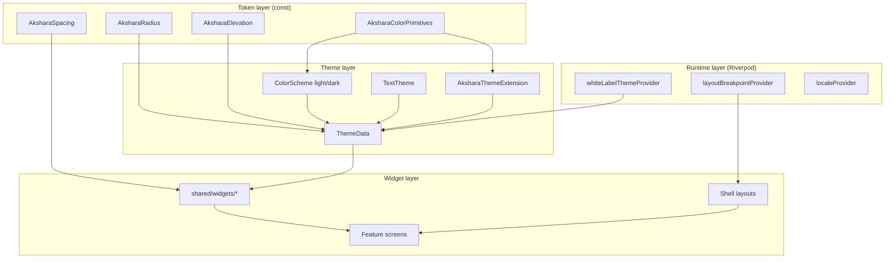

# Akshara ERP — Flutter Design System

**Document ID:** `AKS-FLUTTER-DS-v1.0`  
**Purpose:** Implementation specification for Material 3 theming and shared widgets in the Akshara Flutter monorepo  
**Sources:** `TechnicalArchitecture.md` · `archive/design/DesignSystem.md` · `archive/design/FigmaDesignSystemBuildGuide.md`  
**Target stack:** Flutter **3.35+** · **Riverpod** · **GoRouter** · **Material 3** · responsive desktop / tablet / mobile

---

## Table of Contents

1. [Overview](#1-overview)
2. [Theme Architecture](#2-theme-architecture)
3. [Color Scheme](#3-color-scheme)
4. [Typography Mapping](#4-typography-mapping)
5. [Spacing Constants](#5-spacing-constants)
6. [Border Radius Constants](#6-border-radius-constants)
7. [Elevation Constants](#7-elevation-constants)
8. [Responsive Breakpoints](#8-responsive-breakpoints)
9. [Button Widgets](#9-button-widgets)
10. [Input Widgets](#10-input-widgets)
11. [KPI Widgets](#11-kpi-widgets)
12. [Card Widgets](#12-card-widgets)
13. [Navigation Widgets](#13-navigation-widgets)
14. [Riverpod Theme Providers](#14-riverpod-theme-providers)
15. [Flutter Project Folder Structure](#15-flutter-project-folder-structure)
16. [Implementation Checklist](#16-implementation-checklist)

---

## 1. Overview

### Design token flow

```
Figma variables (DesignSystem.md)
        ↓
Dart token classes (theme/color_tokens.dart, spacing, radius, elevation)
        ↓
ThemeData + ThemeExtension (theme/app_theme.dart)
        ↓
Shared widgets (shared/widgets/)
        ↓
Feature screens (features/*/presentation/)
```

### Principles

| Principle | Flutter expression |
|-----------|-------------------|
| Semantic tokens only | Widgets read `Theme.of(context)` / `AksharaThemeExtension` — never raw hex in features |
| Material 3 baseline | `useMaterial3: true` · `ColorScheme` · M3 component themes |
| Single codebase | Same widgets; shells swap nav chrome per `LayoutBreakpoint` |
| White label | `whiteLabelThemeProvider` overrides `primary` + `primaryContainer` only |
| Accessibility | `Semantics` · 48dp min touch · `Focus` decoration · `MediaQuery.disableAnimations` for reduced motion |

### Package dependencies (design system)

| Package | Purpose |
|---------|---------|
| `flutter_riverpod` | Theme + breakpoint providers |
| `go_router` | Shell routes; no theme logic in router |
| `google_fonts` | Roboto + Roboto Mono (Latin) |
| `material_symbols_icons` or SVG assets | Material Symbols Rounded |
| `flutter_screenutil` | **Not used** — prefer `LayoutBuilder` + breakpoint provider |

---

## 2. Theme Architecture

### 2.1 Layer model



### 2.2 `ThemeData` composition

`theme/app_theme.dart` builds `ThemeData` from:

1. **`ColorScheme`** — maps Akshara semantic colors to M3 roles (`primary`, `surface`, `error`, …)
2. **`TextTheme`** — maps `type/*` scale to M3 text roles + custom `AksharaTextStyles`
3. **`ThemeExtension<AksharaThemeExtension>`** — success, warning, chart, scrim, table header, nav widths
4. **Component themes** — `filledButtonTheme`, `outlinedButtonTheme`, `inputDecorationTheme`, `navigationBarTheme`, `navigationRailTheme`, `dialogTheme`, `cardTheme`, `chipTheme`, `dividerTheme`, `iconTheme`, `appBarTheme`, `bottomSheetTheme`, `snackBarTheme`, `checkboxTheme`, `dataTableTheme`

### 2.3 `AksharaThemeExtension`

Holds tokens that do not exist on stock `ColorScheme`:

```dart
@immutable
class AksharaThemeExtension extends ThemeExtension<AksharaThemeExtension> {
  const AksharaThemeExtension({
    required this.success,
    required this.onSuccess,
    required this.successContainer,
    required this.warning,
    required this.onWarning,
    required this.warningContainer,
    required this.surfaceContainerHighest,
    required this.scrim,
    required this.chart1,
    required this.chart2,
    required this.chart3,
    required this.chart4,
    required this.chartGrid,
    required this.navRailExpandedWidth,
    required this.navRailCollapsedWidth,
    required this.filterBarHeight,
    required this.bottomNavHeight,
    required this.focusRingWidth,
    required this.focusRingGap,
  });

  final Color success;
  final Color onSuccess;
  final Color successContainer;
  final Color warning;
  final Color onWarning;
  final Color warningContainer;
  final Color surfaceContainerHighest;
  final Color scrim;
  final Color chart1;
  final Color chart2;
  final Color chart3;
  final Color chart4;
  final Color chartGrid;
  final double navRailExpandedWidth;   // 256
  final double navRailCollapsedWidth;  // 72
  final double filterBarHeight;        // 56
  final double bottomNavHeight;        // 80
  final double focusRingWidth;         // 2
  final double focusRingGap;           // 2

  static AksharaThemeExtension light(AksharaColorTokens colors) { /* … */ }
  static AksharaThemeExtension dark(AksharaColorTokens colors) { /* … */ }

  @override
  AksharaThemeExtension copyWith({/* … */}) => /* … */;

  @override
  AksharaThemeExtension lerp(
    covariant ThemeExtension<AksharaThemeExtension>? other,
    double t,
  ) => /* … */;
}
```

### 2.4 Access helpers

```dart
// theme/theme_extensions.dart
extension AksharaThemeContext on BuildContext {
  AksharaThemeExtension get akshara =>
      Theme.of(this).extension<AksharaThemeExtension>()!;

  ColorScheme get colors => Theme.of(this).colorScheme;

  TextTheme get text => Theme.of(this).textTheme;

  AksharaTextStyles get aksharaText =>
      Theme.of(this).extension<AksharaTextStyles>()!;
}
```

### 2.5 App wiring (`app/app.dart`)

```dart
class AksharaApp extends ConsumerWidget {
  const AksharaApp({super.key});

  @override
  Widget build(BuildContext context, WidgetRef ref) {
    final router = ref.watch(appRouterProvider);
    final theme = ref.watch(appThemeProvider);
    final darkTheme = ref.watch(appDarkThemeProvider);
    final locale = ref.watch(localeProvider);

    return MaterialApp.router(
      title: 'Akshara ERP',
      debugShowCheckedModeBanner: false,
      theme: theme,
      darkTheme: darkTheme,
      themeMode: ThemeMode.light, // Dark P2
      locale: locale,
      localizationsDelegates: AppLocalizations.localizationsDelegates,
      supportedLocales: AppLocalizations.supportedLocales,
      routerConfig: router,
      builder: (context, child) => AksharaResponsiveScope(
        child: child ?? const SizedBox.shrink(),
      ),
    );
  }
}
```

### 2.6 White-label merge

`theme/white_label_theme.dart`:

1. Start from `AksharaAppTheme.light()`
2. If `whiteLabelConfigProvider` has `primaryHex`, replace `ColorScheme.primary` and derive `primaryContainer` via `ColorScheme.fromSeed(seedColor: primary, brightness: Brightness.light)`
3. Rebuild `ThemeData` — fonts and spacing unchanged per `archive/design/DesignSystem.md` §20

---

## 3. Color Scheme

### 3.1 Primitive palette (`theme/color_tokens.dart`)

```dart
@immutable
class AksharaColorPrimitives {
  const AksharaColorPrimitives._();

  // Blue
  static const Color blue800 = Color(0xFF1565C0);
  static const Color blue50  = Color(0xFFE3F2FD);
  static const Color blue900 = Color(0xFF0D47A1);

  // Neutral
  static const Color neutral0   = Color(0xFFFFFFFF);
  static const Color neutral50  = Color(0xFFF8FAFC);
  static const Color neutral200 = Color(0xFFE2E8F0);
  static const Color neutral500 = Color(0xFF64748B);
  static const Color neutral900 = Color(0xFF1E293B);
  static const Color neutral800 = Color(0xFFE8EDF3); // surface-container-highest

  // Semantic primitives
  static const Color red500   = Color(0xFFD32F2F);
  static const Color red50    = Color(0xFFFFEBEE);
  static const Color green600 = Color(0xFF2E7D32);
  static const Color green50  = Color(0xFFE8F5E9);
  static const Color amber600 = Color(0xFFF57C00);
  static const Color amber50  = Color(0xFFFFF3E0);

  // Charts
  static const Color chart1 = Color(0xFF1565C0);
  static const Color chart2 = Color(0xFF42A5F5);
  static const Color chart3 = Color(0xFF7E57C2);
  static const Color chart4 = Color(0xFF26A69A);
  static const Color chartGrid = Color(0xFFE2E8F0);

  // Scrim
  static const Color scrim = Color(0x661E293B); // 40% opacity
}
```

### 3.2 Semantic tokens (`AksharaColorTokens`)

| Design token | Dart field | Hex / value |
|--------------|------------|-------------|
| `color/primary` | `primary` | `#1565C0` |
| `color/on-primary` | `onPrimary` | `#FFFFFF` |
| `color/primary-container` | `primaryContainer` | `#E3F2FD` |
| `color/on-primary-container` | `onPrimaryContainer` | `#0D47A1` |
| `color/surface` | `surface` | `#FFFFFF` |
| `color/surface-container-low` | `surfaceContainerLow` | `#F8FAFC` |
| `color/surface-container-highest` | `surfaceContainerHighest` | `#E8EDF3` |
| `color/on-surface` | `onSurface` | `#1E293B` |
| `color/on-surface-variant` | `onSurfaceVariant` | `#64748B` |
| `color/outline-variant` | `outlineVariant` | `#E2E8F0` |
| `color/error` | `error` | `#D32F2F` |
| `color/error-container` | `errorContainer` | `#FFEBEE` |
| `color/success` | `success` | `#2E7D32` |
| `color/success-container` | `successContainer` | `#E8F5E9` |
| `color/warning` | `warning` | `#F57C00` |
| `color/warning-container` | `warningContainer` | `#FFF3E0` |
| `color/scrim` | `scrim` | `#1E293B` @ 40% |

### 3.3 `ColorScheme` mapping (light)

| `ColorScheme` role | Source token | Notes |
|--------------------|--------------|-------|
| `primary` | `primary` | CTAs, active nav, links |
| `onPrimary` | `onPrimary` | |
| `primaryContainer` | `primaryContainer` | Chips, AI panels |
| `onPrimaryContainer` | `onPrimaryContainer` | |
| `secondary` | `primary` | Alias — no secondary brand color |
| `onSecondary` | `onPrimary` | |
| `surface` | `surface` | Cards, inputs |
| `onSurface` | `onSurface` | Body text |
| `onSurfaceVariant` | `onSurfaceVariant` | Labels, metadata |
| `surfaceContainerLowest` | `surface` | |
| `surfaceContainerLow` | `surfaceContainerLow` | **Page background** |
| `surfaceContainerHigh` | `neutral800` @ 50% blend | Skeleton shimmer base |
| `surfaceContainerHighest` | `surfaceContainerHighest` | Table headers |
| `outline` | `outlineVariant` | |
| `outlineVariant` | `outlineVariant` | Borders |
| `error` | `error` | |
| `onError` | `neutral0` | |
| `errorContainer` | `errorContainer` | |
| `onErrorContainer` | `error` | |
| `inverseSurface` | `onSurface` | Snackbar |
| `onInverseSurface` | `surface` | Snackbar text |
| `scrim` | `scrim` | Modals |

```dart
ColorScheme aksharaLightColorScheme(AksharaColorTokens c) => ColorScheme(
  brightness: Brightness.light,
  primary: c.primary,
  onPrimary: c.onPrimary,
  primaryContainer: c.primaryContainer,
  onPrimaryContainer: c.onPrimaryContainer,
  secondary: c.primary,
  onSecondary: c.onPrimary,
  surface: c.surface,
  onSurface: c.onSurface,
  onSurfaceVariant: c.onSurfaceVariant,
  surfaceContainerLow: c.surfaceContainerLow,
  surfaceContainerHighest: c.surfaceContainerHighest,
  outline: c.outlineVariant,
  outlineVariant: c.outlineVariant,
  error: c.error,
  onError: c.onPrimary,
  errorContainer: c.errorContainer,
  onErrorContainer: c.error,
  scrim: c.scrim,
);
```

### 3.4 `KpiAccent` enum

Maps KPI card accents to theme colors:

```dart
enum KpiAccent { primary, success, warning, error, neutral }

extension KpiAccentColors on KpiAccent {
  (Color container, Color foreground) resolve(BuildContext context) {
    final cs = context.colors;
    final ext = context.akshara;
    return switch (this) {
      KpiAccent.primary => (cs.primaryContainer, cs.primary),
      KpiAccent.success => (ext.successContainer, ext.success),
      KpiAccent.warning => (ext.warningContainer, ext.warning),
      KpiAccent.error   => (cs.errorContainer, cs.error),
      KpiAccent.neutral => (cs.surfaceContainerLow, cs.onSurfaceVariant),
    };
  }
}
```

### 3.5 Dark mode (P2 placeholder)

Dark `ColorScheme` aliases mirror Figma `Theme → Dark` placeholder. Ship light first; structure `appDarkThemeProvider` now with neutral900 surfaces.

---

## 4. Typography Mapping

### 4.1 Font families

| Role | Flutter `fontFamily` | Package |
|------|---------------------|---------|
| Latin UI | `Roboto` | `google_fonts` |
| Mono (IDs, receipts) | `RobotoMono` | `google_fonts` |
| Telugu | `NotoSansTelugu` | bundled font asset |
| Hindi | `NotoSansDevanagari` | bundled |
| Tamil | `NotoSansTamil` | bundled |
| Kannada | `NotoSansKannada` | bundled |
| Malayalam | `NotoSansMalayalam` | bundled |
| Urdu | `NotoNastaliqUrdu` | bundled (RTL) |

`localeProvider` selects `fontFamilyFallback` chain on `ThemeData.textTheme`.

### 4.2 `AksharaTextStyles` (`theme/typography.dart`)

| Design style | Dart getter | Size / LH / Weight | M3 `TextTheme` fallback |
|--------------|-------------|--------------------|-------------------------|
| `type/headline/medium` | `headlineMedium` | 28 / 36 / w400 | `headlineMedium` |
| `type/headline/small` | `headlineSmall` | 24 / 32 / w400 | `headlineSmall` |
| `type/title/large` | `titleLarge` | 22 / 28 / w500 | `titleLarge` |
| `type/title/medium` | `titleMedium` | 16 / 24 / w500 | `titleMedium` |
| `type/title/small` | `titleSmall` | 14 / 20 / w500 | `titleSmall` |
| `type/body/large` | `bodyLarge` | 16 / 24 / w400 | `bodyLarge` |
| `type/body/medium` | `bodyMedium` | 14 / 20 / w400 | `bodyMedium` |
| `type/body/small` | `bodySmall` | 12 / 16 / w400 · ls 0.1 | `bodySmall` |
| `type/label/large` | `labelLarge` | 14 / 20 / w500 · ls 0.1 | `labelLarge` |
| `type/label/medium` | `labelMedium` | 12 / 16 / w500 · ls 0.2 | `labelMedium` |
| `type/label/small` | `labelSmall` | 11 / 16 / w500 · ls 0.3 | `labelSmall` |
| `type/mono/body` | `monoBody` | 14 / 20 / w400 RobotoMono | — |

```dart
@immutable
class AksharaTextStyles extends ThemeExtension<AksharaTextStyles> {
  const AksharaTextStyles({
    required this.headlineMedium,
    required this.headlineSmall,
    required this.titleLarge,
    required this.titleMedium,
    required this.titleSmall,
    required this.bodyLarge,
    required this.bodyMedium,
    required this.bodySmall,
    required this.labelLarge,
    required this.labelMedium,
    required this.labelSmall,
    required this.monoBody,
  });

  final TextStyle headlineMedium;
  // …

  static AksharaTextStyles roboto({Color? defaultColor}) {
    TextStyle base(String family, double size, double height, FontWeight w,
        [double? ls]) => GoogleFonts.roboto(
      fontSize: size,
      height: height / size,
      fontWeight: w,
      letterSpacing: ls ?? 0,
      color: defaultColor,
    );
    return AksharaTextStyles(
      headlineMedium: base('Roboto', 28, 36, FontWeight.w400),
      headlineSmall:  base('Roboto', 24, 32, FontWeight.w400),
      titleLarge:     base('Roboto', 22, 28, FontWeight.w500),
      titleMedium:    base('Roboto', 16, 24, FontWeight.w500),
      titleSmall:     base('Roboto', 14, 20, FontWeight.w500),
      bodyLarge:      base('Roboto', 16, 24, FontWeight.w400),
      bodyMedium:     base('Roboto', 14, 20, FontWeight.w400),
      bodySmall:      base('Roboto', 12, 16, FontWeight.w400, 0.1),
      labelLarge:     base('Roboto', 14, 20, FontWeight.w500, 0.1),
      labelMedium:    base('Roboto', 12, 16, FontWeight.w500, 0.2),
      labelSmall:     base('Roboto', 11, 16, FontWeight.w500, 0.3),
      monoBody: GoogleFonts.robotoMono(fontSize: 14, height: 20 / 14),
    );
  }

  TextTheme toMaterialTextTheme() => TextTheme(
    headlineMedium: headlineMedium,
    headlineSmall: headlineSmall,
    titleLarge: titleLarge,
    titleMedium: titleMedium,
    titleSmall: titleSmall,
    bodyLarge: bodyLarge,
    bodyMedium: bodyMedium,
    bodySmall: bodySmall,
    labelLarge: labelLarge,
    labelMedium: labelMedium,
    labelSmall: labelSmall,
  );
}
```

### 4.3 Default text colors

| Usage | Color binding |
|-------|---------------|
| Primary body | `colorScheme.onSurface` |
| Secondary / labels | `colorScheme.onSurfaceVariant` |
| On primary buttons | `colorScheme.onPrimary` |
| Error helper text | `colorScheme.error` |
| Links | `colorScheme.primary` |

---

## 5. Spacing Constants

`theme/spacing.dart`:

```dart
abstract final class AksharaSpacing {
  static const double s1  = 4;   // space/1  — tight icon gap
  static const double s2  = 8;   // space/2  — chip internal, compact
  static const double s3  = 12;  // space/3  — card list gap, table cell H
  static const double s4  = 16;  // space/4  — standard padding, mobile margin
  static const double s5  = 20;  // space/5  — KPI desktop padding
  static const double s6  = 24;  // space/6  — section gaps, desktop padding
  static const double s8  = 32;  // space/8  — large breaks, shell footer
  static const double s12 = 48;  // space/12 — min touch target

  // Layout defaults (DesignSystem.md §6)
  static const double sectionPadding = s6;
  static const double cardGap = s4;
  static const double formFieldGap = s6;
  static const double tableCellPaddingH = s3;
  static const double tableCellPaddingV = s4;
  static const double iconTextGap = s2;
  static const double navItemGap = s1;

  // Shell
  static const double mobileMargin = s4;
  static const double tabletMargin = s6;
  static const double desktopMargin = s6;
  static const double mobileGutter = s4;
  static const double tabletGutter = s6;
  static const double desktopGutter = s6;
}
```

### Responsive page padding

| Breakpoint | Horizontal padding |
|------------|-------------------|
| Mobile (`< 768`) | `AksharaSpacing.mobileMargin` (16) |
| Tablet (`768–1199`) | `AksharaSpacing.tabletMargin` (24) |
| Desktop (`≥ 1200`) | `AksharaSpacing.desktopMargin` (24) |

Use `AksharaPagePadding` widget wrapping scroll bodies.

---

## 6. Border Radius Constants

`theme/radius.dart`:

```dart
abstract final class AksharaRadius {
  static const double sm   = 8;    // radius/sm   — chips, badges, icon containers
  static const double md   = 12;   // radius/md   — cards, tables, KPI
  static const double lg   = 16;   // radius/lg   — modals, FAB, bottom sheet top
  static const double xl   = 20;   // radius/xl   — buttons (pill)
  static const double full = 999;  // radius/full — avatars, delta chips

  static BorderRadius get chip       => BorderRadius.circular(sm);
  static BorderRadius get card       => BorderRadius.circular(md);
  static BorderRadius get dialog     => BorderRadius.circular(lg);
  static BorderRadius get button     => BorderRadius.circular(xl);
  static BorderRadius get bottomSheet => const BorderRadius.vertical(
    top: Radius.circular(lg),
  );
  static BorderRadius get avatar     => BorderRadius.circular(full);
}
```

### Shape usage matrix

| Widget | Radius token |
|--------|--------------|
| `AksharaFilledButton` | `AksharaRadius.button` (20) |
| `AksharaCard` | `AksharaRadius.card` (12) |
| `AksharaKpiCard` | `AksharaRadius.card` (12) |
| `AksharaFilterChip` | `AksharaRadius.chip` (8) |
| `AksharaDialog` | `AksharaRadius.dialog` (16) desktop; 0 mobile fullscreen |
| `AksharaBottomSheet` | `AksharaRadius.bottomSheet` |
| `AksharaTextField` | M3 default 4px top for outlined — use `OutlineInputBorder(borderRadius: BorderRadius.circular(4))` per Figma |
| `AksharaFab` | `AksharaRadius.lg` (16) |

---

## 7. Elevation Constants

`theme/elevation.dart`:

```dart
abstract final class AksharaElevation {
  static const double level0 = 0;
  static const double level1 = 1;  // KPI, chart cards
  static const double level2 = 2;  // menus, dropdowns
  static const double level3 = 3;  // dialogs, FAB
  static const double level4 = 4;  // bottom sheets

  static List<BoxShadow> shadow(BuildContext context, int level) {
    final shadowColor = context.colors.onSurface.withValues(alpha: switch (level) {
      1 => 0.08,
      2 => 0.10,
      3 => 0.12,
      4 => 0.14,
      _ => 0.0,
    });
    return switch (level) {
      1 => [BoxShadow(color: shadowColor, offset: const Offset(0, 1), blurRadius: 3)],
      2 => [BoxShadow(color: shadowColor, offset: const Offset(0, 2), blurRadius: 6)],
      3 => [BoxShadow(color: shadowColor, offset: const Offset(0, 4), blurRadius: 12)],
      4 => [BoxShadow(color: shadowColor, offset: const Offset(0, 8), blurRadius: 24)],
      _ => [],
    };
  }
}
```

### Material elevation mapping

| Design level | `Material` elevation | `CardTheme.elevation` |
|--------------|---------------------|----------------------|
| `elevation/0` | 0 | Flat cards with `BorderSide(outlineVariant)` |
| `elevation/1` | 1 | KPI, chart cards |
| `elevation/2` | 2 | `DropdownMenu`, `PopupMenu` |
| `elevation/3` | 3 | `Dialog`, `FloatingActionButton` |
| `elevation/4` | 4 | `BottomSheet` |

### Focus ring (not elevation)

Applied via `FocusDecoration` / custom `InkWell` border:

- Width: `2`
- Color: `colorScheme.primary`
- Gap: `2` (use `padding` + `decoration` on wrapper)

---

## 8. Responsive Breakpoints

### 8.1 `LayoutBreakpoint` enum

Aligned with `TechnicalArchitecture.md` §6.5:

```dart
enum LayoutBreakpoint { mobile, tablet, desktop }

abstract final class AksharaBreakpoints {
  static const double mobileMax = 767;
  static const double tabletMax = 1199;

  static LayoutBreakpoint fromWidth(double width) {
    if (width <= mobileMax) return LayoutBreakpoint.mobile;
    if (width <= tabletMax) return LayoutBreakpoint.tablet;
    return LayoutBreakpoint.desktop;
  }
}
```

### 8.2 Design frame reference (Figma)

| Name | Width | Columns | Margin | Gutter |
|------|-------|---------|--------|--------|
| Mobile | 390 | 4 | 16 | 16 |
| Mobile large | 428 | 4 | 16 | 16 |
| Tablet | 834 | 8 | 24 | 24 |
| Desktop | 1440 | 12 | 24 | 24 |
| Desktop wide | 1920 | 12 | 32 | 24 |

### 8.3 Responsive widget pattern

```dart
class AksharaResponsive extends ConsumerWidget {
  const AksharaResponsive({
    super.key,
    required this.mobile,
    this.tablet,
    required this.desktop,
  });

  final Widget mobile;
  final Widget? tablet;
  final Widget desktop;

  @override
  Widget build(BuildContext context, WidgetRef ref) {
    final bp = ref.watch(layoutBreakpointProvider);
    return switch (bp) {
      LayoutBreakpoint.mobile  => mobile,
      LayoutBreakpoint.tablet  => tablet ?? desktop,
      LayoutBreakpoint.desktop => desktop,
    };
  }
}
```

### 8.4 Grid column counts (KPI / cards)

| Element | Desktop | Tablet | Mobile |
|---------|---------|--------|--------|
| KPI grid | 4–6 columns | 3×2 | 2×2 |
| Chart layout | Side-by-side | Stacked | Stacked, min height 280 |
| Tables | Full | Hide low-priority cols | `AksharaTableMobileCard` list |
| Dialogs | Fixed width | 90% width | `fullscreenDialog: true` |
| Dropdowns | `DropdownMenu` | `DropdownMenu` | `AksharaSelectBottomSheet` |

---

## 9. Button Widgets

**Path:** `shared/widgets/buttons/`

### 9.1 Widget catalog

| Widget | Figma equivalent | Key specs |
|--------|------------------|-----------|
| `AksharaFilledButton` | `Actions/Button/Filled` | H 48 · radius 20 · `primary` fill |
| `AksharaTonalButton` | `Actions/Button/Tonal` | H 48 · `primaryContainer` fill |
| `AksharaOutlinedButton` | `Actions/Button/Outlined` | H 40 · 1px `outlineVariant` |
| `AksharaTextButton` | `Actions/Button/Text` | H 40 · transparent |
| `AksharaIconButton` | `Actions/IconButton` | 48×48 hit · 40 visual · 24 icon |
| `AksharaFab` | `Actions/FAB` | 56×56 · radius 16 · elevation 3 |
| `AksharaButton` | Unified API | Delegates by `AksharaButtonVariant` |

### 9.2 `AksharaButton` API

```dart
enum AksharaButtonVariant { filled, tonal, outlined, text }
enum AksharaButtonSize { large, medium }

class AksharaButton extends StatelessWidget {
  const AksharaButton({
    super.key,
    required this.label,
    required this.onPressed,
    this.variant = AksharaButtonVariant.filled,
    this.size = AksharaButtonSize.large,
    this.isLoading = false,
    this.isFullWidth = false,
    this.leadingIcon,
    this.trailingIcon,
    this.semanticLabel,
  });

  final String label;
  final VoidCallback? onPressed;
  final AksharaButtonVariant variant;
  final AksharaButtonSize size;
  final bool isLoading;
  final bool isFullWidth;
  final IconData? leadingIcon;
  final IconData? trailingIcon;
  final String? semanticLabel;
}
```

### 9.3 Implementation rules

| Rule | Detail |
|------|--------|
| Heights | Large = 48dp · Medium = 40dp |
| Padding | Large: 16×14 H/V · Medium: 12×10 |
| Gap | 8 between icon and label |
| Loading | Replace label with `SizedBox(20×20)` `CircularProgressIndicator(strokeWidth: 2)` |
| Disabled | `onPressed: null` — M3 handles 38% opacity |
| Full width | `isFullWidth: true` on mobile form CTAs; max 400dp on desktop dialogs |
| Focus | `FocusableActionDetector` + 2px primary ring |
| Typography | `context.aksharaText.labelLarge` |

### 9.4 `ButtonStyle` theme defaults

```dart
FilledButtonThemeData aksharaFilledButtonTheme(ColorScheme cs) => FilledButtonThemeData(
  style: FilledButton.styleFrom(
    minimumSize: const Size(64, 48),
    padding: const EdgeInsets.symmetric(horizontal: 16, vertical: 14),
    shape: RoundedRectangleBorder(borderRadius: AksharaRadius.button),
    textStyle: const TextStyle(fontSize: 14, fontWeight: FontWeight.w500),
  ),
);
```

---

## 10. Input Widgets

**Path:** `shared/widgets/inputs/`

### 10.1 Widget catalog

| Widget | Figma equivalent | Height |
|--------|------------------|--------|
| `AksharaTextField` | `Inputs/TextField` | 56 standard · 40 compact |
| `AksharaTextArea` | `Inputs/TextArea` | min 96 |
| `AksharaCheckbox` | `Inputs/Checkbox` | 18 box · 48 row hit |
| `AksharaDropdown` | `Inputs/Dropdown` | 56 |
| `AksharaDatePickerField` | `Inputs/DatePickerTrigger` | 56 |
| `AksharaFilterChip` | Chip / filter | 32 |
| `AksharaSelectBottomSheet` | Mobile dropdown replacement | — |

### 10.2 `AksharaTextField` API

```dart
enum AksharaTextFieldSize { standard, compact }

class AksharaTextField extends StatelessWidget {
  const AksharaTextField({
    super.key,
    this.controller,
    this.label,
    this.hint,
    this.helperText,
    this.errorText,
    this.leadingIcon,
    this.trailingIcon,
    this.obscureText = false,
    this.readOnly = false,
    this.enabled = true,
    this.size = AksharaTextFieldSize.standard,
    this.keyboardType,
    this.onChanged,
    this.validator,
  });
}
```

### 10.3 `InputDecorationTheme`

```dart
InputDecorationTheme aksharaInputDecorationTheme(ColorScheme cs) =>
    InputDecorationTheme(
      filled: true,
      fillColor: cs.surface,
      contentPadding: const EdgeInsets.symmetric(
        horizontal: AksharaSpacing.s4,
        vertical: AksharaSpacing.s4,
      ),
      border: OutlineInputBorder(
        borderRadius: BorderRadius.circular(4),
        borderSide: BorderSide(color: cs.outlineVariant),
      ),
      enabledBorder: OutlineInputBorder(
        borderRadius: BorderRadius.circular(4),
        borderSide: BorderSide(color: cs.outlineVariant),
      ),
      focusedBorder: OutlineInputBorder(
        borderRadius: BorderRadius.circular(4),
        borderSide: BorderSide(color: cs.primary, width: 2),
      ),
      errorBorder: OutlineInputBorder(
        borderRadius: BorderRadius.circular(4),
        borderSide: BorderSide(color: cs.error, width: 2),
      ),
      labelStyle: TextStyle(fontSize: 12, color: cs.onSurfaceVariant),
      hintStyle: TextStyle(fontSize: 16, color: cs.onSurfaceVariant),
      helperStyle: TextStyle(fontSize: 12, color: cs.onSurfaceVariant),
      errorStyle: TextStyle(fontSize: 12, color: cs.error),
    );
```

### 10.4 Dropdown responsive behavior

```dart
// Mobile: show AksharaSelectBottomSheet
// Tablet/Desktop: show DropdownMenu anchored to trigger
Future<T?> showAksharaSelect<T>({
  required BuildContext context,
  required List<AksharaSelectOption<T>> options,
  T? value,
  required String title,
});
```

### 10.5 Form layout

- Vertical field gap: `AksharaSpacing.formFieldGap` (24)
- Filter bar compact fields: `AksharaTextFieldSize.compact` (40dp)
- Always pair status chips with icon + text (never color-only)

---

## 11. KPI Widgets

**Path:** `shared/widgets/data/kpi/`

### 11.1 Widget catalog

| Widget | Figma equivalent | Size |
|--------|------------------|------|
| `AksharaKpiCard` | `Data/KPI/Standard` | 176×120 (flex width in grid) |
| `AksharaKpiCardCompact` | `Data/KPI/Compact` | Fill×88 |
| `AksharaKpiGrid` | KPI row layout | Responsive columns |
| `AksharaDeltaChip` | KPI delta chip | Pill · `labelSmall` |
| `AksharaChartCard` | `Data/ChartCard` | min 400×320 desktop |

### 11.2 `AksharaKpiCard` API

```dart
enum KpiTrend { none, up, down, flat }

class AksharaKpiCard extends StatelessWidget {
  const AksharaKpiCard({
    super.key,
    required this.label,
    required this.value,
    required this.icon,
    this.accent = KpiAccent.primary,
    this.trend = KpiTrend.none,
    this.deltaLabel,
    this.onTap,
  });

  final String label;
  final String value;
  final IconData icon;
  final KpiAccent accent;
  final KpiTrend trend;
  final String? deltaLabel;
  final VoidCallback? onTap;
}
```

### 11.3 Layout structure

```
AksharaKpiCard [padding 20, gap 12, radius 12, elevation 1]
├── Row (spaceBetween)
│   ├── IconContainer 40×40 radius 8
│   └── AksharaDeltaChip (optional)
├── Label  bodySmall onSurfaceVariant
└── Value   headlineSmall onSurface
```

### 11.4 `AksharaKpiGrid`

```dart
class AksharaKpiGrid extends ConsumerWidget {
  const AksharaKpiGrid({super.key, required this.children});

  final List<Widget> children;

  @override
  Widget build(BuildContext context, WidgetRef ref) {
    final bp = ref.watch(layoutBreakpointProvider);
    final crossAxisCount = switch (bp) {
      LayoutBreakpoint.mobile  => 2,
      LayoutBreakpoint.tablet  => 3,
      LayoutBreakpoint.desktop => children.length.clamp(4, 6),
    };
    return GridView.count(
      crossAxisCount: crossAxisCount,
      mainAxisSpacing: AksharaSpacing.cardGap,
      crossAxisSpacing: AksharaSpacing.cardGap,
      childAspectRatio: bp == LayoutBreakpoint.mobile ? 1.6 : 1.47,
      shrinkWrap: true,
      physics: const NeverScrollableScrollPhysics(),
      children: children,
    );
  }
}
```

### 11.5 Chart colors

Bind series to `context.akshara.chart1`–`chart4` and grid lines to `chartGrid`. Include `AksharaChartDataTableLink` below plot for accessibility.

---

## 12. Card Widgets

**Path:** `shared/widgets/cards/`

### 12.1 Widget catalog

| Widget | Use | Spec |
|--------|-----|------|
| `AksharaCard` | Base surface card | radius 12 · pad 16 mobile / 20 desktop · elevation 0 or 1 |
| `AksharaSurfaceCard` | Flat bordered | elevation 0 · 1px `outlineVariant` |
| `AksharaElevatedCard` | KPI-style | elevation 1 |
| `AksharaListCard` | Mobile table row | `Data/Table/MobileCard` |
| `AksharaInsightCard` | AI insight | 4px left accent bar · priority colors |
| `AksharaHeroCard` | Mobile dashboard greeting | Parent P-04 pattern |
| `AksharaQuickActionCard` | Dashboard shortcuts | 110×104 mobile |
| `AksharaNoticeCard` | Carousel item | horizontal scroll |
| `AksharaStatRow` | Inline metric row | Today summary pattern |

### 12.2 `AksharaCard` API

```dart
class AksharaCard extends StatelessWidget {
  const AksharaCard({
    super.key,
    required this.child,
    this.padding,
    this.margin,
    this.elevation = AksharaElevation.level0,
    this.onTap,
    this.border,
  });

  final Widget child;
  final EdgeInsetsGeometry? padding;
  final EdgeInsetsGeometry? margin;
  final double elevation;
  final VoidCallback? onTap;
  final bool border; // true → outline instead of shadow
}
```

### 12.3 `AksharaListCard` (mobile table fallback)

```dart
class AksharaListCard extends StatelessWidget {
  const AksharaListCard({
    super.key,
    required this.title,
    this.subtitle,
    this.statusChip,
    required this.metaRows, // List<(String label, String value)>
    this.actions,
    this.onTap,
  });
}
```

### 12.4 `CardTheme`

```dart
CardThemeData aksharaCardTheme(ColorScheme cs) => CardThemeData(
  elevation: AksharaElevation.level1,
  shape: RoundedRectangleBorder(borderRadius: AksharaRadius.card),
  color: cs.surface,
  margin: EdgeInsets.zero,
);
```

---

## 13. Navigation Widgets

**Path:** `shared/widgets/navigation/` + `shared/widgets/shells/`

### 13.1 Widget catalog

| Widget | Platform | Spec |
|--------|----------|------|
| `AksharaBottomNav` | Mobile apps | H 80 + safe area · 4–5 items |
| `AksharaMobileAppBar` | Mobile | H 56 · `titleLarge` |
| `AksharaWebAppBar` | Admin web | H 64 · breadcrumb + title + actions |
| `AksharaNavRail` | Desktop / tablet | W 256 expanded · W 72 collapsed |
| `AksharaNavDrawer` | Mobile web admin | W 280 over scrim |
| `AksharaNavItem` | Shared rail/drawer/bottom | 48dp item height |
| `AksharaFilterBar` | Admin web | H 56 · dropdowns + chips + CTAs |
| `AksharaBreadcrumb` | Admin web | `bodySmall` onSurfaceVariant |
| `AksharaTabBar` | Web sections | H 48 underline indicator |
| `AksharaDialog` | All | S 400 · M 560 · L 720 · fullscreen mobile |
| `AksharaBottomSheet` | Mobile | half / full · handle · elevation 4 |

### 13.2 Shell layouts

| Widget | Shell | Routes |
|--------|-------|--------|
| `ParentMobileShell` | `parent_shell` | GoRouter `ShellRoute` · bottom nav |
| `StudentMobileShell` | `student_shell` | Bottom nav |
| `TeacherMobileShell` | `teacher_shell` | Bottom nav |
| `AdminWebShell` | `admin_shell` | NavRail + AppBar + FilterBar |
| `ExecutiveWebShell` | `executive_shell` | Director nav module set |

```dart
class AdminWebShell extends ConsumerWidget {
  const AdminWebShell({
    super.key,
    required this.child,
    required this.module, // Finance, Management, …
  });

  final Widget child;
  final AdminModule module;

  @override
  Widget build(BuildContext context, WidgetRef ref) {
    final bp = ref.watch(layoutBreakpointProvider);
    return Scaffold(
      backgroundColor: context.colors.surfaceContainerLow,
      body: Row(
        children: [
          AksharaNavRail(
            module: module,
            expanded: bp == LayoutBreakpoint.desktop,
          ),
          Expanded(
            child: Column(
              children: [
                const AksharaWebAppBar(),
                if (module.hasFilterBar) const AksharaFilterBar(),
                Expanded(child: child),
              ],
            ),
          ),
        ],
      ),
    );
  }
}
```

### 13.3 `AksharaBottomNav`

```dart
class AksharaBottomNavDestination {
  const AksharaBottomNavDestination({
    required this.label,
    required this.icon,
    required this.selectedIcon,
    required this.route,
  });

  final String label;
  final IconData icon;         // Outlined
  final IconData selectedIcon; // Filled — active only
  final String route;
}

class AksharaBottomNav extends StatelessWidget {
  const AksharaBottomNav({
    super.key,
    required this.destinations,
    required this.selectedIndex,
    required this.onDestinationSelected,
  });
}
```

Height: `80` + `MediaQuery.padding.bottom` (safe area).  
Active item: `primaryContainer` indicator · filled icon · `labelMedium`.

### 13.4 `NavigationBarTheme` / `NavigationRailTheme`

```dart
NavigationBarThemeData aksharaNavigationBarTheme(ColorScheme cs) =>
    NavigationBarThemeData(
      height: 80,
      backgroundColor: cs.surface,
      indicatorColor: cs.primaryContainer,
      labelTextStyle: WidgetStateProperty.resolveWith((states) {
        final selected = states.contains(WidgetState.selected);
        return TextStyle(
          fontSize: 12,
          fontWeight: FontWeight.w500,
          color: selected ? cs.onPrimaryContainer : cs.onSurfaceVariant,
        );
      }),
    );

NavigationRailThemeData aksharaNavigationRailTheme(ColorScheme cs) =>
    NavigationRailThemeData(
      backgroundColor: cs.surface,
      selectedIconTheme: IconThemeData(color: cs.primary),
      unselectedIconTheme: IconThemeData(color: cs.onSurfaceVariant),
      indicatorColor: cs.primaryContainer,
    );
```

### 13.5 GoRouter integration

Shells registered in `routes/shell_routes/` — theme-neutral; only layout chrome:

```dart
ShellRoute(
  builder: (context, state, child) => ParentMobileShell(child: child),
  routes: [ /* P-04 … P-25 */ ],
);
```

`AksharaNavRail` reads `GoRouterState.uri` to highlight `ActiveItem`.  
Cross-module drills use named routes with query params per `TechnicalArchitecture.md` §6.6.

---

## 14. Riverpod Theme Providers

**Path:** `theme/providers/`

```dart
@riverpod
ThemeData appTheme(AppThemeRef ref) {
  final whiteLabel = ref.watch(whiteLabelConfigProvider);
  return AksharaAppTheme.light(whiteLabel: whiteLabel);
}

@riverpod
ThemeData appDarkTheme(AppDarkThemeRef ref) {
  return AksharaAppTheme.dark();
}

@riverpod
LayoutBreakpoint layoutBreakpoint(LayoutBreakpointRef ref) {
  // Updated by AksharaResponsiveScope via LayoutBuilder
  return ref.watch(_breakpointStateProvider);
}

@riverpod
class WhiteLabelConfig extends _$WhiteLabelConfig {
  @override
  WhiteLabelConfigModel? build() => null;

  void apply(WhiteLabelConfigModel config) => state = config;
}
```

`AksharaResponsiveScope` listens to `MediaQuery.sizeOf(context).width` and updates `_breakpointStateProvider`.

---

## 15. Flutter Project Folder Structure

Design-system-related paths within the monorepo (extends `TechnicalArchitecture.md` §3):

```
akshara_erp/
├── pubspec.yaml                       # google_fonts, riverpod, go_router, …
├── assets/
│   ├── fonts/                         # Noto regional families
│   └── icons/                         # Optional SVG overrides
│
├── lib/
│   ├── main.dart
│   ├── app/
│   │   ├── app.dart                   # MaterialApp.router
│   │   ├── bootstrap.dart
│   │   └── flavor.dart
│   │
│   ├── theme/                         # ★ Design tokens & ThemeData
│   │   ├── app_theme.dart             # AksharaAppTheme.light() / .dark()
│   │   ├── color_tokens.dart          # Primitives + AksharaColorTokens
│   │   ├── typography.dart            # AksharaTextStyles
│   │   ├── spacing.dart               # AksharaSpacing
│   │   ├── radius.dart                # AksharaRadius
│   │   ├── elevation.dart             # AksharaElevation
│   │   ├── breakpoints.dart           # AksharaBreakpoints, LayoutBreakpoint
│   │   ├── theme_extensions.dart      # AksharaThemeExtension + context ext
│   │   ├── component_themes.dart      # Button, Input, Nav, Card, Dialog themes
│   │   ├── white_label_theme.dart     # School primary override
│   │   └── providers/
│   │       ├── app_theme_provider.dart
│   │       ├── layout_breakpoint_provider.dart
│   │       └── white_label_config_provider.dart
│   │
│   ├── shared/
│   │   ├── widgets/
│   │   │   ├── responsive/
│   │   │   │   ├── akshara_responsive.dart
│   │   │   │   ├── akshara_responsive_scope.dart
│   │   │   │   └── akshara_page_padding.dart
│   │   │   │
│   │   │   ├── buttons/               # ★ Button widgets
│   │   │   │   ├── akshara_button.dart
│   │   │   │   ├── akshara_filled_button.dart
│   │   │   │   ├── akshara_tonal_button.dart
│   │   │   │   ├── akshara_outlined_button.dart
│   │   │   │   ├── akshara_text_button.dart
│   │   │   │   ├── akshara_icon_button.dart
│   │   │   │   └── akshara_fab.dart
│   │   │   │
│   │   │   ├── inputs/                # ★ Input widgets
│   │   │   │   ├── akshara_text_field.dart
│   │   │   │   ├── akshara_text_area.dart
│   │   │   │   ├── akshara_checkbox.dart
│   │   │   │   ├── akshara_dropdown.dart
│   │   │   │   ├── akshara_date_picker_field.dart
│   │   │   │   ├── akshara_filter_chip.dart
│   │   │   │   └── akshara_select_bottom_sheet.dart
│   │   │   │
│   │   │   ├── data/
│   │   │   │   ├── kpi/               # ★ KPI widgets
│   │   │   │   │   ├── akshara_kpi_card.dart
│   │   │   │   │   ├── akshara_kpi_card_compact.dart
│   │   │   │   │   ├── akshara_kpi_grid.dart
│   │   │   │   │   └── akshara_delta_chip.dart
│   │   │   │   ├── akshara_chart_card.dart
│   │   │   │   ├── akshara_data_table.dart
│   │   │   │   └── akshara_table_mobile_card.dart
│   │   │   │
│   │   │   ├── cards/                 # ★ Card widgets
│   │   │   │   ├── akshara_card.dart
│   │   │   │   ├── akshara_surface_card.dart
│   │   │   │   ├── akshara_list_card.dart
│   │   │   │   ├── akshara_insight_card.dart
│   │   │   │   ├── akshara_hero_card.dart
│   │   │   │   └── akshara_quick_action_card.dart
│   │   │   │
│   │   │   ├── navigation/            # ★ Navigation widgets
│   │   │   │   ├── akshara_bottom_nav.dart
│   │   │   │   ├── akshara_mobile_app_bar.dart
│   │   │   │   ├── akshara_web_app_bar.dart
│   │   │   │   ├── akshara_nav_rail.dart
│   │   │   │   ├── akshara_nav_drawer.dart
│   │   │   │   ├── akshara_nav_item.dart
│   │   │   │   ├── akshara_filter_bar.dart
│   │   │   │   ├── akshara_breadcrumb.dart
│   │   │   │   └── akshara_tab_bar.dart
│   │   │   │
│   │   │   ├── shells/
│   │   │   │   ├── parent_mobile_shell.dart
│   │   │   │   ├── student_mobile_shell.dart
│   │   │   │   ├── teacher_mobile_shell.dart
│   │   │   │   ├── admin_web_shell.dart
│   │   │   │   └── executive_web_shell.dart
│   │   │   │
│   │   │   ├── overlays/
│   │   │   │   ├── akshara_dialog.dart
│   │   │   │   └── akshara_bottom_sheet.dart
│   │   │   │
│   │   │   ├── feedback/
│   │   │   │   ├── akshara_banner.dart
│   │   │   │   ├── akshara_empty_state.dart
│   │   │   │   ├── akshara_error_page.dart
│   │   │   │   ├── akshara_skeleton.dart
│   │   │   │   └── akshara_loading_overlay.dart
│   │   │   │
│   │   │   ├── platform/              # DesignSystem §24–26
│   │   │   │   ├── audit/
│   │   │   │   ├── approval/
│   │   │   │   └── report/
│   │   │   │
│   │   │   └── ai/
│   │   │       ├── akshara_assist_chip.dart
│   │   │       └── akshara_chat_panel.dart
│   │   │
│   │   ├── models/
│   │   └── extensions/
│   │
│   ├── routes/
│   │   ├── app_router.dart
│   │   ├── route_guards.dart
│   │   └── shell_routes/
│   │       ├── parent_shell_route.dart
│   │       ├── student_shell_route.dart
│   │       ├── teacher_shell_route.dart
│   │       ├── admin_shell_route.dart
│   │       └── executive_shell_route.dart
│   │
│   ├── features/                      # Feature screens consume shared/widgets only
│   │   ├── auth/
│   │   ├── parent/
│   │   ├── student/
│   │   ├── teacher/
│   │   ├── finance/
│   │   └── …
│   │
│   └── l10n/
│
├── test/
│   ├── theme/
│   │   ├── color_tokens_test.dart
│   │   ├── app_theme_test.dart
│   │   └── goldens/                   # Widget golden tests
│   └── shared/
│       └── widgets/
│           ├── akshara_button_test.dart
│           ├── akshara_kpi_card_test.dart
│           └── akshara_nav_rail_test.dart
│
└── docs/
    ├── DesignSystem.md
    ├── FigmaDesignSystemBuildGuide.md
    ├── FlutterDesignSystem.md       # ← this document
    └── figma-screens/
```

### Import rules

| Layer | May import |
|-------|------------|
| `features/*/presentation` | `shared/widgets`, `theme/*`, `core/*` |
| `shared/widgets` | `theme/*` only — **not** `features/*` |
| `theme/*` | Flutter SDK, `google_fonts` — **not** `shared/widgets` |
| `domain/*` | No Flutter UI imports |

---

## 16. Implementation Checklist

### Phase A — Tokens & theme (week 1)

- [ ] `color_tokens.dart` — primitives + semantic + `ColorScheme` factory
- [ ] `typography.dart` — `AksharaTextStyles` + regional font assets in `pubspec.yaml`
- [ ] `spacing.dart` · `radius.dart` · `elevation.dart` · `breakpoints.dart`
- [ ] `AksharaThemeExtension` with success/warning/chart/nav constants
- [ ] `app_theme.dart` + `component_themes.dart`
- [ ] `app_theme_provider` + `layout_breakpoint_provider`
- [ ] `AksharaResponsiveScope` wired in `app.dart`
- [ ] Golden test: light `ThemeData` snapshot

### Phase B — Core widgets (week 2)

- [ ] Buttons (all 6 variants) + widget tests
- [ ] TextField · TextArea · Checkbox · Dropdown
- [ ] `AksharaKpiCard` · `AksharaKpiGrid` · `AksharaChartCard` shell
- [ ] `AksharaCard` · `AksharaListCard`
- [ ] `AksharaDialog` · `AksharaBottomSheet`

### Phase C — Navigation & shells (week 3)

- [ ] `AksharaBottomNav` + 3 mobile shells
- [ ] `AksharaNavRail` + `AdminWebShell` + `AksharaFilterBar`
- [ ] GoRouter `ShellRoute` wiring for Parent shell
- [ ] White-label primary override end-to-end test

### Phase D — Feature adoption

- [ ] Parent P-04 dashboard using only `shared/widgets`
- [ ] Finance FN-01 using `AdminWebShell` + `AksharaKpiGrid`
- [ ] Accessibility pass: contrast, semantics, 48dp targets, focus rings

---

## Appendix A — Figma ↔ Flutter naming map

| Figma component | Flutter widget |
|-----------------|----------------|
| `Actions/Button/Filled` | `AksharaFilledButton` |
| `Inputs/TextField` | `AksharaTextField` |
| `Inputs/Dropdown` | `AksharaDropdown` / `AksharaSelectBottomSheet` |
| `Data/KPI/Standard` | `AksharaKpiCard` |
| `Data/KPI/Compact` | `AksharaKpiCardCompact` |
| `Data/ChartCard` | `AksharaChartCard` |
| `Data/Table` | `AksharaDataTable` |
| `Data/Table/MobileCard` | `AksharaListCard` |
| `Nav/Rail` | `AksharaNavRail` |
| `Nav/AppBar` | `AksharaWebAppBar` |
| `Nav/AppBar/Mobile` | `AksharaMobileAppBar` |
| `Nav/BottomBar` | `AksharaBottomNav` |
| `Nav/FilterBar` | `AksharaFilterBar` |
| `Overlays/Dialog` | `AksharaDialog` |
| `Overlays/BottomSheet` | `AksharaBottomSheet` |
| `Feedback/Banner` | `AksharaBanner` |
| `Feedback/Empty` | `AksharaEmptyState` |
| `AI/AssistChip` | `AksharaAssistChip` |

---

## Appendix B — Related documents

| Document | Relationship |
|----------|--------------|
| `archive/design/DesignSystem.md` | Visual source of truth |
| `archive/design/FigmaDesignSystemBuildGuide.md` | Figma layer trees → Flutter widget anatomy |
| `archive/roadmap/FigmaImplementationRoadmap.md` | Design build order before Flutter Phase A |
| `TechnicalArchitecture.md` | Folder structure, Riverpod, GoRouter, breakpoints |
| `docs/figma-screens/*` | Per-screen layout reference for feature adoption |

---

**End of Flutter Design System Specification v1.0**
