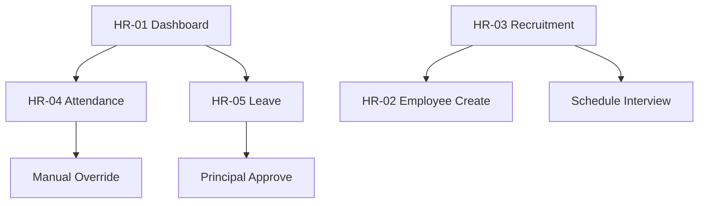

# Akshara ERP — HR Module Specification (Consolidated)

**Document ID:** `AKS-HR-SPEC-v1.0`  
**Module:** Human Resources  
**Screens:** HR-01 → HR-09  
**Platform:** Web primary · Tablet · Mobile (staff companion)  
**Source:** SRS Part 4 §9, Part 6 §12, Part 2 §10 · DesignSystem.md · Finance.md

---

## Table of Contents

1. [Module Overview](#1-module-overview)
2. [User Roles & Permissions](#2-user-roles--permissions)
3. [Navigation & Information Architecture](#3-navigation--information-architecture)
4. [Shared Design Foundation](#4-shared-design-foundation)
5. [Shared Shell Layout](#5-shared-shell-layout)
6. [Shared Components](#6-shared-components)
7. [HR-01 — HR Dashboard](#7-hr-01--hr-dashboard)
8. [HR-02 — Employees](#8-hr-02--employees)
9. [HR-03 — Recruitment](#9-hr-03--recruitment)
10. [HR-04 — Staff Attendance](#10-hr-04--staff-attendance)
11. [HR-05 — Leave Management](#11-hr-05--leave-management)
12. [HR-06 — Performance Reviews](#12-hr-06--performance-reviews)
13. [HR-07 — Employee Lifecycle](#13-hr-07--employee-lifecycle)
14. [HR-08 — HR Reports](#14-hr-08--hr-reports)
15. [HR-09 — HR Settings](#15-hr-09--hr-settings)
16. [Dialogs & Wizards](#16-dialogs--wizards)
17. [Cross-Module Links](#17-cross-module-links)
18. [Prototype Flow Map](#18-prototype-flow-map)
19. [Responsive Rules](#19-responsive-rules)
20. [Figma File Organization](#20-figma-file-organization)
21. [Build Checklist](#21-build-checklist)

---

## 1. Module Overview

### Purpose

Employee records, recruitment pipeline, staff attendance (geo + face per SRS), leave workflows, performance reviews, and HR analytics.

### Screen Inventory

| ID | Screen | Primary Users | Priority |
|----|--------|---------------|----------|
| HR-01 | HR Dashboard | HR Manager | P0 |
| HR-02 | Employees | HR Manager | P0 |
| HR-03 | Recruitment | HR Manager | P1 |
| HR-04 | Staff Attendance | HR Manager, Principal 👁 | P0 |
| HR-05 | Leave Management | HR Manager, Principal 🔒 | P0 |
| HR-06 | Performance Reviews | HR Manager | P1 |
| HR-07 | Employee Lifecycle | HR Manager | P2 |
| HR-08 | HR Reports | HR Manager, Management 👁 | P1 |
| HR-09 | HR Settings | HR Manager | P2 |

**Total frames:** 9 primary + 7 dialogs = **16**

### Recruitment Pipeline

Applied → Screening → Interview → Selected → Joined

---

## 2. User Roles & Permissions

| Action | HR Manager | Principal | Management | Teacher |
|--------|------------|-----------|------------|---------|
| Employee CRUD | ✅ | 👁 | 👁 | ❌ |
| Recruitment | ✅ | 👁 | 👁 | ❌ |
| Staff attendance view | ✅ | ✅ | 👁 | ⚡ self |
| Leave approve (staff) | 👁 | 🔒 teachers | 🔒 | ✅ apply |
| Performance reviews | ✅ | 👁 | 👁 | ⚡ self view |
| Salary data | ❌ | ❌ | 👁 | ❌ |
| Export HR reports | ✅ | ❌ | ✅ | ❌ |

---

## 3. Navigation & Information Architecture

### Side Navigation

| # | Label | Icon | Screen |
|---|-------|------|--------|
| 1 | Dashboard | `dashboard` | HR-01 |
| 2 | Employees | `groups` | HR-02 |
| 3 | Recruitment | `person_search` | HR-03 |
| 4 | Attendance | `fact_check` | HR-04 |
| 5 | Leave | `event_busy` | HR-05 |
| 6 | Performance | `star_rate` | HR-06 |
| 7 | Lifecycle | `timeline` | HR-07 |
| 8 | Reports | `assessment` | HR-08 |
| 9 | Settings | `settings` | HR-09 |

---

## 4. Shared Design Foundation

Reference **DesignSystem.md**. Staff attendance integrates geo-fence + face verification indicators (SRS Part 2 §4).

---

## 5. Shared Shell Layout

**Component:** `Shell/HRLayout`

---

## 6. Shared Components

| Component | Spec |
|-----------|------|
| `HR/EmployeeCard` | Avatar · name · dept · status |
| `HR/CandidateCard` | Recruitment kanban `256×120` |
| `HR/AttendanceBadge` | Geo+Face verified · Manual override flagged |
| `HR/LeaveTimeline` | Pending → Principal → Approved |
| `HR/ReviewCycleChip` | Q1 · Q2 · Annual |

---

## 7. HR-01 — HR Dashboard

| **Frame** | `HR-01-HRDashboard-D` |

### Layout Structure

| # | Section |
|---|---------|
| 1 | Filter bar | Department · Month |
| 2 | KPI row | 6 × `176×120` |
| 3 | Charts | Headcount trend · Attendance % · Open roles |
| 4 | Pending leave queue | Top 5 |
| 5 | Recruitment snapshot | Pipeline mini-kanban |
| 6 | AI insight | Staff attrition risk |

### KPI Definitions

| # | Label | Example |
|---|-------|---------|
| 1 | Total Employees | 148 |
| 2 | Present Today | 142 |
| 3 | On Leave | 6 |
| 4 | Open Positions | 4 |
| 5 | Avg Attendance (MTD) | 96% |
| 6 | Reviews Due | 12 |

---

## 8. HR-02 — Employees

| **Frame** | `HR-02-Employees-D` |

### Layout Structure

| # | Section |
|---|---------|
| 1 | Filter bar | Dept · Role · Status · **+ Add Employee** |
| 2 | Employees table |
| 3 | Detail drawer `400` | Profile · docs · history |

### Table Columns

`ID 90 · Name 180 · Role 120 · Department 120 · Phone 120 · Join Date 100 · Status 100 · Actions 100`

### Employee Status

Active · On Leave · Probation · Resigned · Terminated

### Detail Tabs

Overview · Attendance · Leave · Performance · Documents

---

## 9. HR-03 — Recruitment

| **Frame** | `HR-03-Recruitment-D` |

### Layout Structure

| # | Section |
|---|---------|
| 1 | Filter bar | Job · Status · **+ Post Job** |
| 2 | KPI row | Open jobs · Candidates · Interviews this week |
| 3 | Kanban pipeline | 5 columns |
| 4 | Jobs table |

### Kanban Stages

Applied · Screening · Interview · Selected · Joined

### Candidate Card

Name · role · source · interview date · score

### Jobs Table Columns

`Title 200 · Dept 120 · Openings 80 · Applicants 80 · Status 100 · Posted 100 · Actions 100`

---

## 10. HR-04 — Staff Attendance

| **Frame** | `HR-04-StaffAttendance-D` |

### Layout Structure

| # | Section |
|---|---------|
| 1 | Filter bar | Date · Department · Method |
| 2 | KPI row | Present · Absent · Late · Unverified |
| 3 | Attendance table |
| 4 | Map mini-widget | Geo check-ins |
| 5 | Manual override audit flags |

### Table Columns

`Employee 180 · Dept 120 · Check In 100 · Check Out 100 · Method 120 · Geo 80 · Face 80 · Status 100 · Actions 80`

### Method Badges

Geo+Face `success` · QR `primary` · Manual `error` (audited) · Web `warning`

---

## 11. HR-05 — Leave Management

| **Frame** | `HR-05-LeaveManagement-D` |

### Layout Structure

| # | Section |
|---|---------|
| 1 | Tabs | All · Pending · Approved · Rejected |
| 2 | Filter bar | Type · Department |
| 3 | Leave table |
| 4 | Calendar overlay | Team leave heatmap |

### Table Columns

`Employee 160 · Type 100 · From 100 · To 100 · Days 60 · Reason 180 · Approver 120 · Status 100 · Actions 80`

### Leave Types

Casual · Sick · Earned · Maternity · Unpaid

### Approval Flow

Employee → Principal (teacher) / Management (staff) per SRS Part 6

---

## 12. HR-06 — Performance Reviews

| **Frame** | `HR-06-PerformanceReviews-D` |

### Layout Structure

| # | Section |
|---|---------|
| 1 | Filter bar | Cycle · Department |
| 2 | KPI row | Completed · In progress · Overdue |
| 3 | Review table |
| 4 | Review form panel | Goals · ratings · comments |

### Table Columns

`Employee 160 · Dept 120 · Cycle 100 · Manager 140 · Rating 80 · Status 100 · Due 100 · Actions 80`

### Rating Scale

1–5 stars · Needs Improvement · Meets · Exceeds

---

## 13. HR-07 — Employee Lifecycle

| **Frame** | `HR-07-EmployeeLifecycle-D` |

### Events Tracked

Onboarding · Probation end · Promotion · Transfer · Exit · Document expiry alerts

### Timeline UI

Vertical timeline per employee · 64px rows · document expiry banners

---

## 14. HR-08 — HR Reports

### Report Cards

Headcount · Attendance Summary · Leave Balance · Recruitment Funnel · Performance Distribution · Turnover Analysis

---

## 15. HR-09 — HR Settings

Departments · Designations · Leave policies · Review cycles · Attendance rules · Document types

---

## 16. Dialogs & Wizards

| ID | Name | Size | Used on |
|----|------|------|---------|
| HR-D-01 | AddEmployee | 720 wizard | HR-02 |
| HR-D-02 | PostJob | 560 | HR-03 |
| HR-D-03 | ScheduleInterview | 560 | HR-03 |
| HR-D-04 | LeaveApprove | 400 | HR-05 |
| HR-D-05 | SubmitReview | 560 | HR-06 |
| HR-D-06 | ManualAttendanceOverride | 560 | HR-04 |
| HR-D-07 | ExportHRReport | 400 | HR-08 |

---

## 17. Cross-Module Links

| From | To | Trigger |
|------|-----|---------|
| HR-03 Selected | HR-02 | Create employee |
| HR-04 | Teacher app | Staff check-in |
| HR-05 | Principal PR-06 | Teacher leave approval |
| HR-02 | Finance FN-06 | Payroll (no salary edit in HR) |
| HR-01 | Management MG-07 | Staff overview |
| HR-04 override | FN-10 Audit | Manual attendance log |

---

## 18. Prototype Flow Map



---

## 19. Responsive Rules

| Element | Desktop | Tablet | Mobile |
|---------|---------|--------|--------|
| Kanban | 5 columns | 3 visible | 1 swipe |
| Employee drawer | 400 right | Bottom sheet | Fullscreen |
| Attendance map | 360 widget | Hidden | List only |

---

## 20. Figma File Organization

```
📁 08 — HR Module
├── HR-01 → HR-09 [D/T/M]
└── Dialogs HR-D-01 → HR-D-07
```

---

## 21. Build Checklist

| Step | Task |
|------|------|
| 1 | Employee + candidate components |
| 2 | HR-01 + HR-02 employees |
| 3 | HR-04 attendance + geo/face badges |
| 4 | HR-05 leave + approval flow |
| 5 | HR-03 recruitment kanban |
| 6 | HR-06 performance |
| 7 | HR-08 reports |
| 8 | Manual override + audit link |
| 9 | Mobile views |
| 10 | Full prototype |

---

**End of HR Module Specification v1.0**
