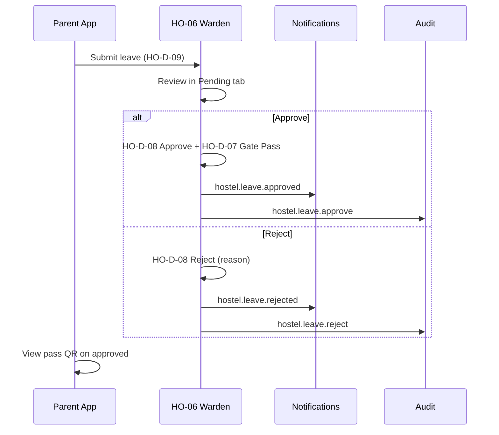
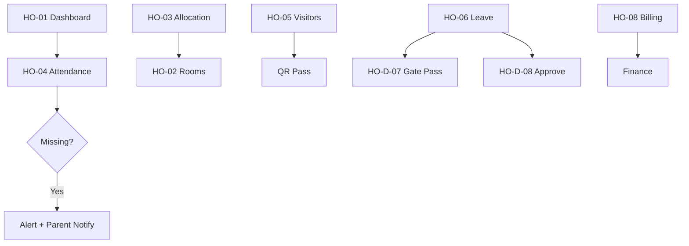

# Akshara ERP — Hostel Module Specification (Consolidated)

**Document ID:** `AKS-HO-SPEC-v1.0`  
**Module:** Hostel Management  
**Screens:** HO-01 → HO-09  
**Platform:** Web primary · Tablet · Mobile (warden companion)  
**Source:** SRS Part 3 §6–9 · DesignSystem.md · Finance.md

---

## Table of Contents

1. [Module Overview](#1-module-overview)
2. [User Roles & Permissions](#2-user-roles--permissions)
3. [Navigation & Information Architecture](#3-navigation--information-architecture)
4. [Shared Design Foundation](#4-shared-design-foundation)
5. [Shared Shell Layout](#5-shared-shell-layout)
6. [Shared Components](#6-shared-components)
7. [HO-01 — Hostel Dashboard](#7-ho-01--hostel-dashboard)
8. [HO-02 — Rooms](#8-ho-02--rooms)
9. [HO-03 — Bed Allocation](#9-ho-03--bed-allocation)
10. [HO-04 — Hostel Attendance](#10-ho-04--hostel-attendance)
11. [HO-05 — Visitors](#11-ho-05--visitors)
12. [HO-06 — Leave Requests](#12-ho-06--leave-requests)
13. [HO-07 — Mess Management](#13-ho-07--mess-management)
14. [HO-08 — Hostel Billing](#14-ho-08--hostel-billing)
15. [HO-09 — Hostel Reports](#15-ho-09--hostel-reports)
16. [Dialogs & Wizards](#16-dialogs--wizards)
17. [Cross-Module Links](#17-cross-module-links)
18. [Prototype Flow Map](#18-prototype-flow-map)
19. [Responsive Rules](#19-responsive-rules)
20. [Figma File Organization](#20-figma-file-organization)
21. [Build Checklist](#21-build-checklist)

---

## 1. Module Overview

### Purpose

Residential operations: room inventory, bed allocation, session attendance (morning/evening/night), visitors, student leave, mess, hostel fees, health alerts (SRS Part 3 §6–9).

### Screen Inventory

| ID | Screen | Primary Users | Priority |
|----|--------|---------------|----------|
| HO-01 | Hostel Dashboard | Hostel Warden | P0 |
| HO-02 | Rooms | Hostel Warden | P0 |
| HO-03 | Bed Allocation | Hostel Warden | P0 |
| HO-04 | Hostel Attendance | Hostel Warden | P0 |
| HO-05 | Visitors | Hostel Warden | P0 |
| HO-06 | Leave Requests | Hostel Warden, Parent 👁 | P0 |
| HO-07 | Mess Management | Hostel Warden | P1 |
| HO-08 | Hostel Billing | Warden 👁, Finance ✅ | P1 |
| HO-09 | Hostel Reports | Warden, Management 👁 | P2 |

**Total frames:** 9 primary + 6 dialogs = **15**

---

## 2. User Roles & Permissions

| Action | Warden | Management | Parent | Finance |
|--------|--------|------------|--------|---------|
| Room/bed allocation | ✅ | 👁 | ❌ | ❌ |
| Hostel attendance | ✅ | 👁 | 👁 child | ❌ |
| Register visitors | ✅ | 👁 | ❌ | ❌ |
| Approve hostel leave | ✅ | ❌ | ✅ apply | ❌ |
| Mess menu | ✅ | 👁 | 👁 | ❌ |
| Hostel fee view | 👁 | 👁 | 👁 pay | ✅ manage |
| Health incident log | ✅ | 👁 | 👁 notified | ❌ |

---

## 3. Navigation & Information Architecture

### Side Navigation

| # | Label | Icon | Screen |
|---|-------|------|--------|
| 1 | Dashboard | `dashboard` | HO-01 |
| 2 | Rooms | `bed` | HO-02 |
| 3 | Allocation | `hotel` | HO-03 |
| 4 | Attendance | `fact_check` | HO-04 |
| 5 | Visitors | `badge` | HO-05 |
| 6 | Leave | `event_busy` | HO-06 |
| 7 | Mess | `restaurant` | HO-07 |
| 8 | Billing | `payments` | HO-08 |
| 9 | Reports | `assessment` | HO-09 |

---

## 4. Shared Design Foundation

**Room cell colors:** Occupied `primary-container` · Vacant `success-container` · Maintenance `warning-container` · Alert `error-container`

---

## 5. Shared Shell Layout

**Component:** `Shell/HostelLayout`

---

## 6. Shared Components

| Component | Spec |
|-----------|------|
| `Hostel/RoomCell` | 64×64 grid cell |
| `Hostel/BedSlot` | 32×48 occupied/vacant/reserved |
| `Hostel/FloorPlan` | Block → floor → room grid |
| `Hostel/VisitorPass` | QR 120×120 + photo |
| `Hostel/SessionToggle` | Morning · Evening · Night |
| `Hostel/MessMenuCard` | 200×120 per meal |

---

## 7. HO-01 — Hostel Dashboard

| **Frame** | `HO-01-HostelDashboard-D` |

### Layout Structure

| # | Section | Size |
|---|---------|------|
| 1 | Filter bar | Block · Date |
| 2 | KPI row | 6 × `176×120` |
| 3 | Floor plan heatmap | `560×360` |
| 4 | Attendance by session chart | `560×360` |
| 5 | Active visitors + health alerts | Split row |
| 6 | Quick actions | Allocate · Record attendance |

### KPI Definitions

| # | Label | Example |
|---|-------|---------|
| 1 | Occupancy | 87% |
| 2 | Present Now | 412 |
| 3 | Missing | 3 |
| 4 | Visitors Today | 12 |
| 5 | Mess Cost MTD | ₹1.2L |
| 6 | Fee Pending | ₹4.8L |

---

## 8. HO-02 — Rooms

| **Frame** | `HO-02-Rooms-D` |

### Layout Structure

| # | Section |
|---|---------|
| 1 | Filter bar | Block · Floor · **+ Add Room** |
| 2 | View toggle | Grid floor plan · Table list |
| 3 | Rooms table / grid |

### Table Columns

`Block 80 · Room 80 · Floor 60 · Type 100 · Beds 60 · Occupied 80 · Status 100 · Facilities 140 · Actions 100`

### Room Types

Standard · AC · Dormitory · Staff

---

## 9. HO-03 — Bed Allocation

| **Frame** | `HO-03-BedAllocation-D` |

### Layout Structure

| # | Section |
|---|---------|
| 1 | Filter bar | Block · Vacant only |
| 2 | Split | Floor plan `640` · Allocation form `496` |
| 3 | Allocated students table |

### Allocation Table Columns

`Student 180 · Class 80 · Block 80 · Room 80 · Bed 60 · From 100 · Status 80 · Actions 80`

### Allocation Form

Student search · room · bed · start date · notes

---

## 10. HO-04 — Hostel Attendance

| **Frame** | `HO-04-HostelAttendance-D` |

### Layout Structure

| # | Section |
|---|---------|
| 1 | Session selector | Morning · Evening · Night |
| 2 | Date + block filter |
| 3 | Roster table | Toggle P/A/L per student |
| 4 | Missing alert banner | Persistent until resolved |
| 5 | Submit + notify parents |

### Table Columns

`Student 180 · Room 80 · Roll 80 · Morning 80 · Evening 80 · Night 80 · Status 100 · Remark 120 · Actions 80`

---

## 11. HO-05 — Visitors

| **Frame** | `HO-05-Visitors-D` |

### Layout Structure

| # | Section |
|---|---------|
| 1 | **+ Register Visitor** |
| 2 | Active visitors table |
| 3 | Visitor log history |
| 4 | QR pass preview panel |

### Table Columns

`Visitor 160 · Relation 100 · Student 140 · Check In 120 · Check Out 120 · Pass ID 100 · Status 80 · Actions 80`

### Visitor Registration Fields

Name · relation · ID proof · photo capture · student link · valid until

---

## 12. HO-06 — Leave Requests

| **Frame** | `HO-06-LeaveRequests-D` |
| **Priority** | P0 (upgraded — AR-015) |

### Layout Structure

| # | Section |
|---|---------|
| 1 | Tabs | Pending · Approved · Rejected · Active passes |
| 2 | Filter bar | Block · Date range |
| 3 | Leave table |
| 4 | Detail drawer | Parent contact · room · history |

### Table Columns

`Student 160 · Room 80 · From 100 · To 100 · Days 60 · Reason 160 · Parent 120 · Status 100 · Pass 80 · Actions 120`

### Leave Workflow (AR-015)



### Parent Apply (Mobile)

Parent **More menu** or Hostel section (future P-26): dates · reason · pickup person · emergency contact

### Warden Actions

Approve · Reject (reason) · Issue gate pass · Revoke pass · Print pass

### Gate Pass

QR encodes: `student_id` · valid_from · valid_to · warden_sign · pass_id  
Security scans at gate — checkout logged on return

---

## 13. HO-07 — Mess Management

| **Frame** | `HO-07-MessManagement-D` |

### Layout Structure

| # | Section |
|---|---------|
| 1 | Week calendar strip |
| 2 | Daily menu cards | Breakfast · Lunch · Snacks · Dinner |
| 3 | Dietary tags | Veg · Jain · Allergy chips |
| 4 | Consumption + cost chart |

---

## 14. HO-08 — Hostel Billing

| **Frame** | `HO-08-HostelBilling-D` |

### Layout Structure

| # | Section |
|---|---------|
| 1 | Filter bar | Term · Block |
| 2 | KPI row | Billed · Collected · Pending |
| 3 | Student fee table | Links to Finance |
| 4 | Generate invoice action |

### Table Columns

`Student 180 · Room 80 · Fee Plan 120 · Amount 100 · Paid 100 · Pending 100 · Due Date 100 · Actions 80`

---

## 15. HO-09 — Hostel Reports

### Reports

Occupancy · Attendance · Visitor log · Mess cost · Fee collection · Incident log

---

## 16. AI Hostel Copilot

**Component:** `AI/HostelCopilot` — HO-01, HO-04, HO-06

### Insight Cards

| Card | Use |
|------|-----|
| Missing pattern | Students frequently absent evening session |
| Occupancy forecast | Term break capacity |
| Mess cost trend | HO-07 vs budget |
| Leave cluster | Multiple leave requests same weekend |

### Example Prompts

- "Who is missing from Block A tonight?"
- "Predict mess cost next month"
- "Summarize pending leave requests"

### Actions

Trigger missing alert · Suggest room reallocation · Notify warden

---

## 17. Mobile Screen Inventory

See **MobileScreenInventory.md** §2.

| ID | Screen |
|----|--------|
| HO-M-01 | Warden Dashboard |
| HO-M-02 | Session Attendance |
| HO-M-03 | Visitor QR Scan |
| HO-M-04 | Gate Pass View (Parent) |

---

## 18. Dialogs & Wizards

| ID | Name | Size | Used on |
|----|------|------|---------|
| HO-D-01 | AddRoom | 560 | HO-02 |
| HO-D-02 | AllocateBed | 560 | HO-03 |
| HO-D-03 | RegisterVisitor | 560 | HO-05 |
| HO-D-04 | MissingStudentAlert | 400 | HO-04 |
| HO-D-05 | MessMenuEdit | 560 | HO-07 |
| HO-D-06 | CheckoutVisitor | 400 | HO-05 |
| HO-D-07 | GatePass | 480 | HO-06 approve flow |
| HO-D-08 | ApproveRejectLeave | 400 | HO-06 |
| HO-D-09 | ParentLeaveApply | 560 | Parent mobile → HO-06 |

---

## 19. Cross-Module Links

| From | To | Trigger |
|------|-----|---------|
| HO-04 missing | Parent app | Push alert |
| HO-08 fees | Finance FN-02/03 | Hostel fee type |
| HO-06 leave | Parent app HO-D-09 | Application |
| HO-D-08 approve | Audit.md | `hostel.leave.approve/reject` |
| HO-D-07 pass | Notifications.md | Parent push with QR link |
| HO-09 reports | Reports.md | RPT-HO-001 – RPT-HO-004 |
| HO-01 health | Health module | Incident |
| Student | SIS | Hostel flag |

---

## 20. Prototype Flow Map



---

## 21. Responsive Rules

| Element | Desktop | Tablet | Mobile |
|---------|---------|--------|--------|
| Floor plan | Grid 8×8 | Scroll horizontal | List fallback |
| Attendance roster | Full table | Compact | Card per student |
| Visitor QR | Side panel | Fullscreen | Fullscreen |

---

## 22. Figma File Organization

```
📁 05 — Hostel Management
├── Floor plan components
├── HO-01 → HO-09 [D/T/M]
└── Dialogs HO-D-01 → HO-D-06
```

---

## 23. Build Checklist

| Step | Task |
|------|------|
| 1 | Room cell + floor plan components |
| 2 | HO-01 dashboard |
| 3 | HO-02 + HO-03 allocation |
| 4 | HO-04 attendance + missing flow |
| 5 | HO-05 visitors + QR |
| 6 | HO-06 leave · HO-07 mess |
| 7 | HO-08 billing link Finance |
| 8 | HO-09 reports |
| 9 | Mobile warden views |
| 10 | Full prototype |

---

**End of Hostel Module Specification v1.0**
