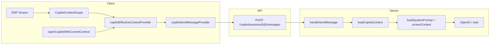

# INTEL-03 Role Architecture — Context-Aware Multi-Role Copilot

**Version:** 1.0  
**Date:** June 2026  
**Program:** INTEL-03 — Context-aware multi-role copilot  
**Status:** Implemented (client + server contract)

---

## Executive summary

INTEL-03 transforms Akshara Copilot from a generic admin chat into a **role-aware intelligence layer** that automatically receives WHO (persona), WHERE (school), WHAT screen (module/route), and WHAT data (KPIs, filters, records) without manual typing.

| Layer | Before INTEL-03 | After INTEL-03 |
|-------|-----------------|----------------|
| Client payload | `{ content }` only | `{ content, screenContext }` |
| Role awareness | JWT + assistant type | 8 persona roles + ERP role mapping |
| Screen context | None | Route, module, KPIs, filters, records |
| Server prompt | DB bundles only | DB bundles + client `screenContext` |
| UI feedback | Generic chat | Context banner on copilot screen |

---

## Eight copilot personas

| # | Vision role | ERP role mapping | Default assistant | Intelligence focus |
|---|-------------|------------------|-------------------|-------------------|
| 1 | Platform Owner | `superAdmin` | Principal | School comparison, revenue trends, growth |
| 2 | Organization / Trust Owner | `schoolAdmin` | Principal | Portfolio, trust governance, expansion |
| 3 | Director / Correspondent | `management`, `financeAdmin` | Finance | Admissions, fee collection, school health |
| 4 | Principal | `principal` | Principal | Attendance, academic performance, at-risk |
| 5 | Academic Coordinator | `admissionsCounselor` | Academic | Class performance, timetable, at-risk |
| 6 | Teacher | `teacher` | Teacher | Weak students, attendance, homework |
| 7 | Parent | `parent` | Parent Guidance | Child performance, attendance, homework |
| 8 | Student | `student` | Academic | Study recommendations, exam prep |

**Note:** Teacher, parent, and student personas build context in tests; ERP chat remains RBAC-gated to staff with `viewAiCopilot`. Mobile persona chat shells are INTEL-04+.

---

## Architecture diagram



---

## Client components

| File | Responsibility |
|------|----------------|
| `copilot_screen_context.dart` | `CopilotScreenContext`, `CopilotKpiSnapshot`, JSON serialization |
| `copilot_role_intelligence.dart` | Persona enum, ERP mapping, route→module/assistant |
| `copilot_context_provider.dart` | Effective context provider, `CopilotContextScope` widget |
| `copilot_navigation.dart` | `openCopilotWithCurrentContext()` — captures origin route |
| `copilot_stub_responses.dart` | Role-aware mock reply builder |
| `copilot_provider.dart` | Injects `screenContext` on send |
| `copilot_screen.dart` | Context banner UI |

### Context payload fields

| Field | Source |
|-------|--------|
| `personaRole` | `copilotPersonaForErpRole(claims.erpRole)` |
| `erpRole` | Auth claims |
| `schoolId`, `organizationId`, `tenantId` | Tenant + claims |
| `module`, `route`, `screen` | GoRouter path + label helpers |
| `filters` | Screen `CopilotContextScope` |
| `kpis` | Dashboard KPI rows (e.g. MG-01) |
| `records` | Entity IDs from scope |
| `activeChildId` | Parent active child provider |
| `suggestedAssistant` | Route + persona routing |
| `intelligenceFocus` | Persona-specific focus list (server prompt) |

---

## Server components

| File | Change |
|------|--------|
| `copilot_handlers.ts` | Accept `screenContext` in POST body |
| `copilot_prompt_orchestrator.ts` | Merge `screenContext` into system + stub prompts |
| `copilot_context_engine.ts` | Unchanged — RBAC-scoped DB bundles |
| `copilot_types.ts` | 8 assistant types (3 added on client in INTEL-03) |

---

## RBAC matrix

| Persona | ERP copilot route | `viewAiCopilot` | Chat today |
|---------|-------------------|-----------------|------------|
| Platform / Org / Director / Principal / Finance / Admissions staff | Yes | Yes | Full copilot |
| Teacher | No | No | Teacher insights screen (Evolution) |
| Parent | No | No | Experience hub stub |
| Student | No | No | Homework redirect stub |

Context builders run for all roles in unit tests; production chat enforces existing RBAC guards.

---

## Integration points

| Screen | Context published |
|--------|-------------------|
| MG-01 Owner Dashboard | KPIs, period filter, management module |
| Admin app bar AI button | Origin route + scope override |
| Copilot screen | Pending navigation context displayed |

**Future (INTEL-04):** Finance intelligence, inventory copilot, mobile persona shells.

---

## API contract

```http
POST /copilot/sessions/{sessionId}/messages
{
  "content": "Summarize revenue trends",
  "screenContext": {
    "personaRole": "platformOwner",
    "erpRole": "superAdmin",
    "schoolId": "school_akshara_001",
    "module": "management",
    "route": "/management/dashboard",
    "screen": "Owner Dashboard",
    "kpis": [{"id":"revenue_mtd","label":"Revenue (MTD)","value":"₹1.2Cr"}],
    "intelligenceFocus": ["school comparison", "revenue trends", ...]
  }
}
```

---

## Tests & Patrol

| Type | File |
|------|------|
| Persona + serialization | `test/features/copilot/copilot_context_test.dart` |
| Mock send with context | `test/features/copilot/copilot_send_context_test.dart` |
| Contract / integration | Existing copilot repository tests (pass) |
| RBAC | `test/security/rbac/copilot_rbac_test.dart` |
| Patrol E2E | `patrol_test/workflows/copilot_context_e2e_test.dart` |

---

## Related documents

| Document | Role |
|----------|------|
| `docs/AI_COPILOT_STATUS.md` | Pre-INTEL-03 copilot audit |
| `docs/INTEL_03_COMPLETION_REPORT.md` | Delivery report |
| `docs/AI_INTELLIGENCE_AUDIT.md` | Cross-domain intelligence |
| `docs/QA/vision_completion_progress.md` | Program tracker |
