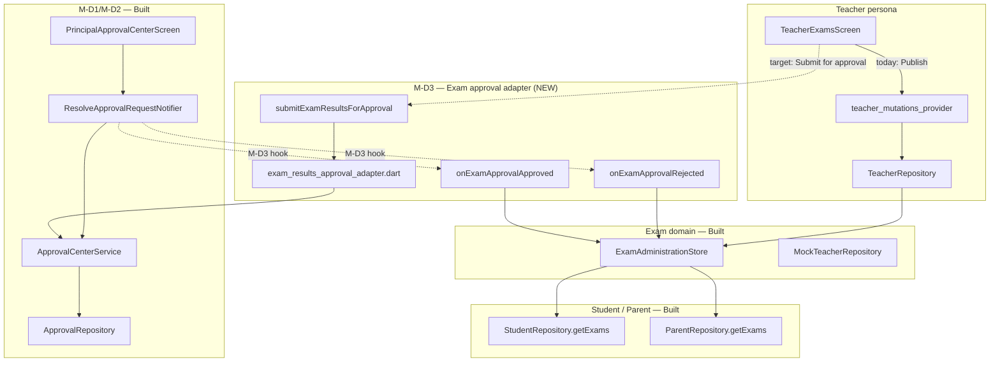
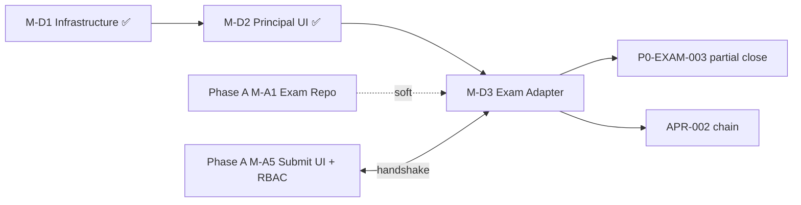

# M-D3 Analysis — Academic Approval Adapter

**Milestone:** M-D3 — Academic Approval Adapter  
**Branch:** `feature/m15-theme` @ `db021e0`  
**Date:** 2026-06-17  
**Status:** Analysis only — **no implementation authorized**  
**Gaps addressed:** APR-002, P0-EXAM-003 (partial), WF-002 (partial), P1-EXAM-006/008 (coordination with Phase A)

**Companion docs read:**

- `docs/OPERATIONAL_GAP_MASTER_TRACKER.md`
- `docs/OPERATIONAL_REMEDIATION_ROADMAP.md`
- `docs/MULTI_AGENT_EXECUTION_PLAN.md`
- `docs/PHASE_A_EXECUTION_PLAN.md` (M-A5)
- `docs/PHASE_D_EXECUTION_PLAN.md` (M-D3)
- `docs/PHASE_D_M1_FINAL_CERTIFICATION.md`
- `docs/PHASE_D_M2_FINAL_CERTIFICATION.md`

---

## 1. Target workflow

```
Teacher                    Approval Center              Exam store           Student/Parent
   │                              │                         │                      │
   │ Enter marks                  │                         │                      │
   │─────────────────────────────►│                         │                      │
   │ (optional: processResults)   │                         │                      │
   │                              │                         │                      │
   │ Submit for approval          │                         │                      │
   │─────────────────────────────►│ Pending (examResults)   │ phase: processed     │
   │                              │                         │ (not published)      │
   │                              │                         │                      │
   │                              │ Principal Approve       │                      │
   │                              │────────────────────────►│ publishExamResults   │
   │                              │                         │─────────────────────►│ results visible
   │                              │                         │                      │
   │◄─────────────────────────────│ Principal Reject        │ stay processed       │
   │  comment visible             │                         │                      │
```

**M-D3 owns:** submit → approval queue wiring; approve/reject **side effects** on exam domain; RBAC mapping for `examResults`; detail panel enrichment; integration tests.

**Phase A M-A5 owns (parallel dependency):** teacher UI (`Submit for approval`), `processResults` exposure, dedicated exam permissions enum, audit event types, feature flag `EXAM_APPROVAL_REQUIRED`.

---

## 2. Architecture diagram



---

## 3. Existing assets inventory

### 3.1 Exam systems

| Asset | Path | Reuse |
|-------|------|-------|
| Exam SSOT store | `lib/core/exams/exam_administration_store.dart` | ✅ `processResults`, `publishExamResults`, lifecycle phases |
| Default exam ID | `exam_math_8a` (seeded in store) | ✅ Aligns with approval demo seed |
| Teacher UI | `lib/features/teacher/exams/teacher_exams_screen.dart` | ⚠️ Modify button/flow (Phase A primary; M-D3 consumes) |
| Teacher providers | `lib/features/teacher/exams/teacher_exams_provider.dart` | ⚠️ Add submit helper |
| Teacher mutations | `lib/features/teacher/teacher_mutations_provider.dart` | ⚠️ Replace/wrap `PublishTeacherExamResultsNotifier` |
| Teacher repository | `lib/core/repositories/interfaces/teacher_repository.dart` | ✅ `publishExamResults` exists |
| Mock teacher repo | `lib/core/repositories/mock/mock_teacher_repository.dart` | ✅ Delegates to store |
| API teacher repo | `lib/core/repositories/api/teacher/api_teacher_repository.dart` | ✅ API path `/exams/{id}/publish` |
| Chain test | `test/core/exams/exam_administration_chain_test.dart` | ✅ Extend for approval gate |
| Exam admin repository | `lib/core/repositories/interfaces/exam_administration_repository.dart` | ❌ **Does not exist** (Phase A M-A1) |

### 3.2 Publish flows (current)

| Step | Implementation | Approval gate |
|------|----------------|---------------|
| Update mark | `UpdateTeacherExamMarkNotifier` → store | None |
| Process results | `ExamAdministrationStore.processResults` | **Not exposed in UI** |
| Publish | `PublishTeacherExamResultsNotifier` → `publishExamResults` | **None — direct publish** |
| Student/parent visibility | Store `published` flag + repo overlay | After publish only |

### 3.3 Approval infrastructure (M-D1/M-D2 — certified)

| Asset | Path | Reuse |
|-------|------|-------|
| Service | `lib/core/approvals/approval_center_service.dart` | ✅ `submitApprovalRequest`, `approveRequest`, `rejectRequest`, dedup |
| Type enum | `lib/core/approvals/approval_request_type.dart` | ✅ `examResults` defined |
| Permissions map | `lib/core/approvals/approval_permissions.dart` | ⚠️ Maps to `manageManagement` — needs `approveExamResults` |
| Category filter | `lib/core/approvals/approval_category.dart` | ✅ Academic includes `examResults` |
| Principal UI | `lib/features/management/approval/*` | ✅ Queue, filters, approve/reject |
| Resolve mutation | `approval_center_provider.dart` → `ResolveApprovalRequestNotifier` | ⚠️ **No domain side-effect hook** |
| Demo seed | `lib/core/repositories/mock/mock_approval_demo_seed.dart` | ✅ `exam_math_8a` / `exam_session` |
| Contract tests | `test/contracts/approval/` | ✅ Default fixture uses `examResults` |
| Integration | `test/integration/approval/approval_center_integration_test.dart` | ✅ Approve exam item in isolation |

### 3.4 Similar patterns (do not duplicate)

| Pattern | Path | Lesson for M-D3 |
|---------|------|-----------------|
| Admissions approval | `lib/features/admissions/approval/` | Module-local queue — **avoid**; use unified center |
| Management legacy | `management_mutations_provider.dart` | Pre-D2 financial approvals — superseded by center |
| M-D2 resolve flow | `ResolveApprovalRequestNotifier` | Extend with adapter dispatch on approve/reject |

### 3.5 Routes

| Route | Name | Guard |
|-------|------|-------|
| `/teacher/exams` | `RouteNames.teacherExams` | Persona auth |
| `/management/approvals` | `RouteNames.managementApprovals` | `viewManagement` |
| `/management/tasks` | Alias to approval center | Same |

No new routes required for M-D3.

### 3.6 Permissions & RBAC

| Item | Current | M-D3 target |
|------|---------|-------------|
| `Permission.approveExamResults` | ❌ Missing | Add per Phase D §D3.4 |
| `Permission.submitExamResults` | ❌ Missing | Phase A M-A5 |
| `examResults` → permission | `manageManagement` | `approveExamResults` |
| Teacher publish mutation RBAC | ❌ Audit only | Registry + assert (Phase A) |
| Principal approve in UI | ✅ Works via `manageManagement` | Tighten to dedicated permission |

### 3.7 Tests (existing)

| Suite | Path | M-D3 extension |
|-------|------|----------------|
| Exam chain | `test/core/exams/exam_administration_chain_test.dart` | Add approval gate path |
| Approval provider | `test/features/management/approval/approval_center_provider_test.dart` | Mock adapter side-effect |
| Approval integration | `test/integration/approval/approval_center_integration_test.dart` | Cross-module with store |
| Teacher provider | `test/features/teacher/exams/teacher_exams_provider_test.dart` | Submit pending state |
| Teacher write contract | `test/contracts/mobile/teacher_write_contract_test.dart` | Add submit contract |

**Missing (planned):**

- `test/integration/approval/exam_approval_adapter_integration_test.dart`
- `test/integration/exam_administration/exam_publish_approval_integration_test.dart`
- `qa/journeys/workflow_exam_publish_approval.yaml`

---

## 4. Reusable code (wire, don’t rebuild)

1. **`ApprovalCenterService.submitApprovalRequest`** — dedup key `(type, entityType, entityId)`.
2. **`ResolveApprovalRequestNotifier`** — add post-approve/post-reject adapter dispatch (single extension point).
3. **`ExamAdministrationStore.publishExamResults`** — unchanged publish semantics; call from adapter on approve.
4. **`ExamAdministrationStore.processResults`** — enforce before submit (Phase A UI + adapter validation).
5. **Demo entity convention** — `entityType: 'exam_session'`, `entityId: exam.id` (matches seed).
6. **`approvalPermissionForType`** — extend mapping once `approveExamResults` exists.
7. **Provider invalidation pattern** — copy from `PublishTeacherExamResultsNotifier` (`studentExamsFutureProvider`, `parentExamsFutureProvider`).
8. **Audit via service** — approval audit already records `submitted` / `approved` / `rejected`.

---

## 5. Wiring opportunities

| # | Opportunity | Effort |
|---|-------------|--------|
| W1 | Hook `ResolveApprovalRequestNotifier.approve` → `ExamResultsApprovalAdapter.onApproved` when `type == examResults` | S |
| W2 | Hook reject → revert exam phase to `processed` + store rejection comment in payload or teacher-visible field | S |
| W3 | Teacher submit calls adapter → `SubmitApprovalRequest` with payload from `ExamSession` | M |
| W4 | Detail panel reads `payload` + live store for marks completion % | S |
| W5 | Block duplicate submit via service dedup (already built) | S |
| W6 | Invalidate exam-related providers after approve (reuse teacher mutation invalidation list) | S |

---

## 6. Missing contracts & required adapters

### 6.1 New adapter module (recommended)

```
lib/core/approvals/adapters/
  exam_results_approval_adapter.dart   # NEW — M-D3 core
  approval_type_adapter.dart           # NEW — optional registry interface
```

**`ExamResultsApprovalAdapter` responsibilities:**

| Method | Behavior |
|--------|----------|
| `submitForApproval(query, examId, requester)` | Validate phase ≥ processed; build `SubmitApprovalRequest`; call service |
| `onApproved(query, request)` | `ExamAdministrationStore.publishExamResults(request.entityId)`; invalidate student/parent providers |
| `onRejected(query, request, comment)` | Ensure exam stays `processed`; persist rejection reason for teacher UI |
| `enrichDetail(request)` | Class, subject, marks entered/total, term label |

### 6.2 Missing interfaces

| Contract | Owner | Blocker for M-D3? |
|----------|-------|-------------------|
| `ExamAdministrationRepository` | Phase A M-A1 | **Soft** — can call store directly in mock mode |
| `submitExamResultsForApproval` on teacher repo | Phase A M-A5 | **Medium** — M-D3 can implement in adapter + teacher mutation |
| `ApprovalTypeAdapter` registry | M-D3 | Optional — switch on type in notifier is MVP |

### 6.3 Required RBAC updates

| File | Change |
|------|--------|
| `lib/core/security/permissions.dart` | Add `approveExamResults`, `submitExamResults` (coordinate Phase A) |
| `lib/core/security/rbac_service.dart` | Map principal role to `approveExamResults` |
| `lib/core/approvals/approval_permissions.dart` | `examResults` → `approveExamResults` |
| `lib/core/security/mutation_permission_registry.dart` | Register submit/approve publish mutations |

### 6.4 Required audit events

| Event | Layer | Owner |
|-------|-------|-------|
| `ApprovalAuditAction.submitted/approved/rejected` | Approval repo | ✅ Exists |
| `examResultsSubmitted` | Teacher audit | Phase A M-A5.6 |
| `examResultsPublished` | Teacher/exam audit | Phase A M-A5.6 |

M-D3 minimum: approval audit sufficient for principal chain; teacher audit enrichment can follow in M-A5.

---

## 7. Files affected (implementation estimate)

### New files

| File | Purpose |
|------|---------|
| `lib/core/approvals/adapters/exam_results_approval_adapter.dart` | Submit + approve/reject side effects |
| `lib/core/approvals/adapters/approval_adapter_registry.dart` | Optional type → adapter map |
| `test/core/approvals/adapters/exam_results_approval_adapter_test.dart` | Unit tests |
| `test/integration/approval/exam_approval_adapter_integration_test.dart` | Cross-module |
| `test/integration/exam_administration/exam_publish_approval_integration_test.dart` | Full chain |
| `qa/journeys/workflow_exam_publish_approval.yaml` | Patrol (stub → full) |

### Modify (M-D3 scope)

| File | Change |
|------|--------|
| `lib/features/management/approval/approval_center_provider.dart` | Dispatch adapter after approve/reject |
| `lib/core/approvals/approval_permissions.dart` | `approveExamResults` mapping |
| `lib/core/security/permissions.dart` | New permission enum values |
| `lib/core/security/rbac_service.dart` | Role grants |
| `lib/features/management/approval/widgets/approval_detail_panel.dart` | Exam-specific detail enrichment |
| `lib/core/testing/qa_test_keys.dart` | `examPrincipalApprove`, etc. |

### Modify (Phase A coordination — not M-D3-only)

| File | Change |
|------|--------|
| `lib/features/teacher/exams/teacher_exams_screen.dart` | Button label + submit flow |
| `lib/features/teacher/teacher_mutations_provider.dart` | `SubmitExamResultsForApprovalNotifier` |
| `lib/features/teacher/exams/teacher_exams_provider.dart` | Pending-approval state |
| `test/core/exams/exam_administration_chain_test.dart` | Approval gate regression |

### Do not modify (per safety rules)

- M15 / M15.5 visual tokens and theme files
- Unrelated ERP modules (finance, inventory, transport)
- Admissions approval silo (until future DISC-007 full merge)

---

## 8. Dependencies



| Dependency | Status | Impact if missing |
|------------|--------|-------------------|
| M-D1 `ApprovalCenterService` | ✅ Certified | Blocker — satisfied |
| M-D2 Principal inbox | ✅ Certified | Blocker — satisfied |
| `ExamAdministrationStore` | ✅ Built | Blocker — satisfied |
| Phase A M-A5 teacher submit UI | ❌ Not started | M-D3 can implement minimal submit in adapter + mutation; full UX in M-A5 |
| `ExamAdministrationRepository` | ❌ Not started | Use store directly for mock MVP |
| Backend API approval + exam publish | ❌ Stub | Mock-only path sufficient for certification |
| Feature flag `EXAM_APPROVAL_REQUIRED` | ❌ Not started | Recommended for rollback (Phase A) |

**Serial bottleneck (from MULTI_AGENT_EXECUTION_PLAN):** M-D3 ↔ M-A5 handshake on submit payload schema and approve hook contract — define adapter interface in Week 1 of implementation.

---

## 9. Risks

| ID | Risk | Severity | Mitigation |
|----|------|----------|------------|
| R1 | Approve without publish (current behavior) | **High** | Adapter hook in `ResolveApprovalRequestNotifier` — integration test mandatory |
| R2 | Teacher still publishes directly | **High** | Gate `publishExamResults` behind flag + RBAC; redirect UI to submit |
| R3 | Phase A / M-D3 scope overlap | Medium | Split: M-D3 = adapter + principal side; M-A5 = teacher UI + permissions |
| R4 | `examResults` uses coarse `manageManagement` | Medium | Add `approveExamResults` before production |
| R5 | Reject comment not visible to teacher | Medium | Store in exam session metadata or approval payload |
| R6 | `processResults` skipped | Medium | Adapter rejects submit if phase < processed |
| R7 | API mode bypasses adapter | Medium | Document mock-only MVP; API repo calls server-side approval |
| R8 | Duplicate pending approvals | Low | Service dedup already handles |
| R9 | Student/parent stale cache | Low | Reuse invalidation from publish mutation |

---

## 10. Test plan

### Unit

| Test | Assert |
|------|--------|
| `exam_results_approval_adapter_test.dart` | Submit builds correct `SubmitApprovalRequest` |
| | Submit blocked when marks incomplete |
| | `onApproved` calls publish + count |
| | `onRejected` leaves exam unpublished |
| | Dedup returns existing pending request |

### Provider

| Test | Assert |
|------|--------|
| Extend `approval_center_provider_test.dart` | Approve examResults triggers publish (mock store) |
| | Reject preserves processed phase |

### Integration

| Test | Assert |
|------|--------|
| `exam_approval_adapter_integration_test.dart` | Service submit → approve → adapter → store published |
| `exam_publish_approval_integration_test.dart` | Teacher submit → principal approve → parent `getExams` has results |
| | Reject → parent still empty; teacher sees comment |

### Regression

| Test | Assert |
|------|--------|
| `exam_administration_chain_test.dart` | Update: publish only via approval path when flag on |
| M-D2 gate (52 tests) | No regression in approval center |
| `router_smoke_test.dart` | No change expected |

### Patrol (post-implementation)

`qa/journeys/workflow_exam_publish_approval.yaml` — teacher submit → staff principal approve → parent results.

---

## 11. Rollback plan

| Level | Action | Effect |
|-------|--------|--------|
| L1 Feature flag | `EXAM_APPROVAL_REQUIRED=false` (Phase A) | Restore direct `publishExamResults` |
| L2 Adapter dispatch | No-op adapter registration | Principal approve only updates approval record (current M-D2 behavior) |
| L3 Git revert | Revert M-D3 commit(s) | Remove adapter files + notifier hooks |
| L4 Route | N/A — no new routes | — |

No database migration. Mock stores reset on app restart.

---

## 12. Estimated implementation effort

| Work package | Size | Owner agent | Notes |
|--------------|------|-------------|-------|
| Exam adapter module + registry | **M** (1–2 days) | Governance | Core M-D3 |
| Notifier approve/reject hooks | **S** (0.5 day) | Governance | |
| RBAC permission additions | **S** (0.5 day) | Governance | Overlap Phase A |
| Detail panel enrichment | **S** (0.5 day) | Governance | |
| Teacher submit wire (minimal) | **M** (1 day) | Academic | If M-A5 not parallel |
| Integration tests (2 files) | **M** (1–2 days) | QA | |
| Chain test + provider updates | **S** (0.5 day) | QA | |
| Patrol journey stub | **S** (0.5 day) | QA | |
| **Total M-D3 (adapter-focused)** | **~4–6 engineering days** | | |
| **With Phase A M-A5 UI/RBAC** | **~8–10 days combined** | | Per execution plans |

Phase D execution plan allocation: **Week 2–3** of Phase D program.

---

## 13. Acceptance criteria (from execution plans)

- [ ] Teacher submit creates `examResults` pending item in Principal Approval Center
- [ ] Principal approve publishes results — student/parent see scores
- [ ] Principal reject returns exam to processed; comment available to teacher
- [ ] Academic filter shows exam submission
- [ ] No direct publish when `EXAM_APPROVAL_REQUIRED=true`
- [ ] Integration test: full chain without human QA
- [ ] M-D2 approval tests remain green
- [ ] `flutter analyze` = 0 errors

---

## 14. Out of scope (M-D4+ / Phase A)

| Item | Milestone |
|------|-----------|
| Leave / attendance adapters | M-D4 |
| Finance / PO adapters | M-D5–D6 |
| ERP exam admin UI (create/schedule exams) | Phase A M-A2 |
| Exam repository API | Phase A M-A1 |
| Grading scheme | Phase A M-A6 |
| Report card release chain | P2-EXAM-004 / APR-013 |
| Parent notification on publish | P2-EXAM-006 |

---

## 15. Recommendation

**Proceed with M-D3 implementation** after approval, using this sequence:

1. Define `ExamResultsApprovalAdapter` + adapter registry contract (Governance).
2. Hook `ResolveApprovalRequestNotifier` approve/reject (Governance).
3. Add `approveExamResults` permission mapping (Governance + Security).
4. Minimal teacher `submitForApproval` mutation calling adapter (coordinate with Academic / Phase A).
5. Integration tests proving parent visibility gate (QA).
6. Detail panel enrichment (Governance UI).

**Do not start M-D4 or Phase A full scope** in the same commit batch unless explicitly orchestrated.

---

**Analysis status:** Complete  
**Implementation status:** ⛔ Not authorized  
**Awaiting:** Program Director approval to begin Step 2 (implementation)
