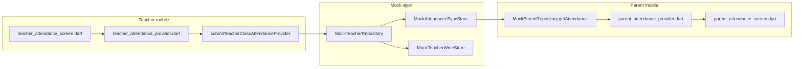
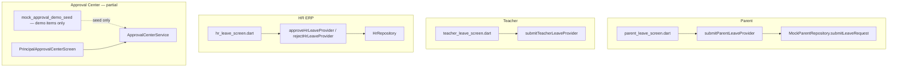
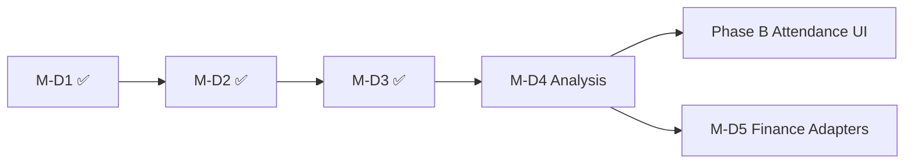

# M-D4 Analysis — Leave & Attendance Approval Adapters

**Milestone:** M-D4 — Leave & Attendance Approval Adapters  
**Branch:** `feature/m15-theme` @ `44ba25b`  
**Date:** 2026-06-17  
**Status:** Analysis only — **no implementation authorized**  
**Gaps addressed:** APR-003, APR-004, APR-005, P1-PRIN-002, P1-PRIN-003, P0-ATT-001 (partial), P0-ATT-002 (partial), WF-004, WF-005

**Companion docs read:**

- `docs/OPERATIONAL_GAP_MASTER_TRACKER.md`
- `docs/OPERATIONAL_REMEDIATION_ROADMAP.md`
- `docs/PHASE_D_EXECUTION_PLAN.md` (M-D4)
- `docs/M-D3_ANALYSIS.md` · `docs/PHASE_D_M3_FINAL_CERTIFICATION.md`
- `docs/M-D3_PUSH_REPORT.md`

**Explicitly out of scope for this analysis:** Phase A, Phase B full attendance UI, Marketing, Inventory, Student360, multi-agent execution.

---

## 1. Executive summary

M-D4 completes the **governance layer** for student/staff leave and attendance corrections by wiring persona mutations into the unified Principal Approval Center using the adapter pattern proven in M-D3.

**Current state:** Teacher attendance submit, parent calendar view, and leave apply flows exist in mock mode, but approvals are **siloed or absent**. HR approves staff leave on `HrLeaveScreen`; parent leave creates a local `LeaveRequest` without an approval queue item; attendance corrections have **no request entity** and parent disputes route to WhatsApp only.

**M-D4 delivers:** Three adapters (`student_leave`, `staff_leave`, `attendance_correction`) registered in `ApprovalAdapterRegistry`, dedicated RBAC permissions, principal approve/reject side effects, and integration tests. Attendance correction **domain persistence** (correction entity, post-submit lock, parent ticket UI) remains Phase B — M-D4 ships the adapter contract and stub/mock side effects so Phase B can plug in without re-architecting governance.

---

## 2. Current architecture

### 2.1 Attendance data flow (as built)



| Step | Implementation | Approval gate |
|------|----------------|---------------|
| Load roster | `getAttendanceClasses` / `getAttendanceStudentsByClass` | None |
| Draft save | `saveAttendanceDraft` → `MockTeacherWriteStore.attendanceDrafts` | None |
| Submit class | `submitClassAttendance` → sync store + `submittedClasses` | **None — immediate** |
| Parent calendar | `getAttendance(month)` — KPI from sync store when teacher submitted | Read-only |
| Correction request | ❌ Not implemented | — |
| Post-submit lock | ❌ Rows remain editable (`teacherAttendanceSubmittedProvider` is UI flag only) | — |

**Key files:**

| Asset | Path |
|-------|------|
| Teacher UI | `lib/features/teacher/attendance/teacher_attendance_screen.dart` |
| Teacher providers | `lib/features/teacher/attendance/teacher_attendance_provider.dart` |
| Teacher mutations | `lib/features/teacher/teacher_mutations_provider.dart` (`SubmitTeacherClassAttendanceNotifier`) |
| Parent UI | `lib/features/parent/attendance/parent_attendance_screen.dart` |
| Parent providers | `lib/features/parent/attendance/parent_attendance_provider.dart` |
| Sync store | `lib/core/repositories/mock/mock_attendance_sync_store.dart` |
| Teacher repository | `lib/core/repositories/interfaces/teacher_repository.dart` (attendance methods) |
| Student UI | `lib/features/student/attendance/student_attendance_screen.dart` (read-only calendar) |

### 2.2 Leave data flow (as built)



| Flow | Submit | Approve today | Approval Center |
|------|--------|---------------|-----------------|
| Parent student leave | ✅ `submitLeaveRequest` → local list, `LeaveStatus.pending` | ❌ No principal UI wired | Demo seed only (`studentLeave`) |
| Teacher leave | ✅ `submitLeaveRequest` | Principal (documented) — **not in app** | Demo seed only |
| HR staff leave | ✅ `createLeaveRequest` | ✅ **HR screen** approve/reject | Demo seed (`staffLeave`) — **duplicate path** |

### 2.3 Approval infrastructure (M-D1/D2/D3 — certified)

| Asset | Path | M-D4 reuse |
|-------|------|------------|
| Service | `approval_center_service.dart` | ✅ submit / approve / reject / dedup |
| Adapter registry | `approval_adapter_registry.dart` | ⚠️ Extend — today only `examResults` |
| Resolve mutation | `approval_center_provider.dart` | ✅ Post-decision dispatch pattern |
| Type enum | `approval_request_type.dart` | ✅ `attendanceCorrection`, `studentLeave`, `staffLeave` exist |
| Category filter | `approval_category.dart` | ✅ Attendance + Leave buckets |
| Permission map | `approval_permissions.dart` | ⚠️ All three → coarse `manageManagement` |
| Demo seed | `mock_approval_demo_seed.dart` | ✅ Entity conventions for all three types |
| Principal UI | `approval/*` | ✅ Filters, detail panel, approve/reject |

**Entity conventions (demo seed):**

| Type | entityType | entityId example |
|------|------------|------------------|
| `attendanceCorrection` | `attendance_day` | `att_6b_2026_06_12` |
| `studentLeave` | `student_leave` | `leave_stu_101` |
| `staffLeave` | `staff_leave` | `leave_staff_045` |

---

## 3. Audit findings (10 areas)

### 3.1 Current attendance flows

1. **Teacher mark → submit** — Full mock path: class selector, per-student Present/Absent/Late, draft save, submit with unmarked guard (`teacher_attendance_provider.dart`).
2. **Cross-persona sync** — `MockAttendanceSyncStore.recordTeacherSubmit` updates parent KPI percent (`teacher_parent_attendance_sync_integration_test.dart`).
3. **Staff check-in** — Separate from student attendance (dashboard `AttendanceSummaryCard`); HR attendance screen for staff roster — not in M-D4 student correction scope.
4. **ERP/hostel/transport attendance** — Module-specific read screens exist; no unified correction SSOT.

### 3.2 Attendance correction gaps

| Gap ID | Finding |
|--------|---------|
| P0-ATT-001 | No correction request entity, workflow, or persistence store |
| P1-ATT-005 | Post-submit lock missing — teacher can keep editing after submit |
| P1-ATT-004 | No past-date roster / history for verification |
| P1-ATT-008 | No ERP admin attendance governance screen |
| APR-003 | Approval type defined but **no adapter** and no submit path |
| WF-005 | Parent cannot raise audited dispute ticket |

**Missing domain layer:** There is no `AttendanceAdministrationStore` equivalent to `ExamAdministrationStore`. Corrections cannot apply side effects until Phase B introduces a store or repository.

### 3.3 Parent dispute workflows

**Today:** `parent_attendance_screen.dart` day-detail sheet offers **“Contact class teacher via WhatsApp”** (`WhatsAppLauncher.openChat`) — no in-app ticket, no approval linkage, no audit trail (P1-ATT-007, WF-005).

**Target (Phase B + M-D4):** Parent “Report incorrect mark” → `attendanceCorrection` approval → principal decision → calendar update. M-D4 owns adapter + permission mapping; Phase B owns ticket UI and store.

### 3.4 Teacher correction workflows

**Today:** No “request correction” action on `teacher_attendance_screen.dart` after submit. Teacher can re-mark rows locally (provider state) even after `submitAttendance()` sets `isSubmitted`.

**Target:** Teacher correction request (same adapter as parent) with payload: classId, date, studentId, fromMark, toMark, reason. Optional class-teacher pre-review (Phase D plan D4.2) — **MVP: principal-only** per execution plan.

### 3.5 Principal approval workflows

**Today:**

- Principal Approval Center **displays** seeded `attendanceCorrection`, `studentLeave`, `staffLeave` items.
- Approve/reject updates approval record + audit only — **no domain side effects** (same pre-M-D3 exam gap, now fixed for exams only).
- Attendance category filter works (`approval_center_provider_test.dart`).
- No same-day exception queue UI (P1-PRIN-003) — planned as `attendanceException` type (not in enum yet).

### 3.6 Attendance permissions required

**Today:** No attendance-specific permissions in `permissions.dart` (P0-ATT-002, RBAC-003/004). `submitClassAttendance` mutation has **no** `mutation_permission_registry` entry.

**M-D4 target permissions:**

| Permission | Purpose |
|------------|---------|
| `markAttendance` | Teacher submit class roster |
| `viewAttendance` | Parent/student/teacher read |
| `submitAttendanceCorrection` | Parent/teacher raise correction |
| `approveAttendanceCorrection` | Principal decide correction |
| `correctAttendance` | Apply approved correction (admin/class teacher) |
| `approveStudentLeave` | Principal decide student leave |
| `approveStaffLeave` | Principal decide staff leave (may unify with HR) |

**Interim mapping:** `approval_permissions.dart` should move from `manageManagement` to dedicated approve permissions (mirror M-D3 `approveExamResults`).

### 3.7 Approval Center integration points

| Hook | File | M-D4 change |
|------|------|-------------|
| Adapter registry | `approval_adapter_registry.dart` | Register 3 adapters |
| Resolve notifier | `approval_center_provider.dart` | Already dispatches — extend invalidation lists |
| Detail panel | `approval_detail_panel.dart` | `enrichDetail()` per adapter |
| Permission guard | `approval_permissions.dart` | Type → dedicated permission |
| Demo seed | `mock_approval_demo_seed.dart` | Align entity IDs with mock stores |
| Category chips | `approval_category.dart` | ✅ No change |

### 3.8 Repositories to reuse

| Repository | Reuse for M-D4 |
|------------|----------------|
| `ApprovalRepository` / `MockApprovalRepository` | ✅ Queue CRUD (certified) |
| `ParentRepository.submitLeaveRequest` | ⚠️ Wrap — also create approval item |
| `HrRepository.createLeaveRequest` | ⚠️ Wrap — also create `staffLeave` approval |
| `TeacherRepository` (attendance) | ⚠️ Phase B adds `submitAttendanceCorrection` |
| `MockAttendanceSyncStore` | ⚠️ Side-effect target for approved corrections (mock MVP) |
| `MockParentRepository` / leave list | ✅ Update leave status on approve |
| `HrRepository.approveLeaveRequest` | ⚠️ Deprecate direct approve in favor of inbox (or sync both) |

**Not present (Phase B):** `AttendanceCorrectionRepository`, correction DTOs, API paths.

### 3.9 Screens to reuse

| Screen | M-D4 touch |
|--------|------------|
| `PrincipalApprovalCenterScreen` | ✅ Primary approver UI — no new route |
| `parent_leave_screen.dart` | Wire status from approval + adapter |
| `parent_attendance_screen.dart` | Phase B adds dispute form — M-D4 no UI required |
| `teacher_attendance_screen.dart` | Phase B adds correction CTA — M-D4 optional stub button |
| `hr_leave_screen.dart` | Link to Approval Center OR remove inline approve (DISC-007 pattern) |
| `teacher_leave_screen.dart` | Status display after wiring |

### 3.10 Tests to extend

| Suite | Path | Extension |
|-------|------|-----------|
| Approval provider | `approval_center_provider_test.dart` | Side effects for leave + attendance types |
| Approval integration | `approval_center_integration_test.dart` | Approve attendanceCorrection with store |
| M-D3 adapter tests | Pattern in `exam_results_approval_adapter_test.dart` | Clone for 3 adapters |
| Parent leave | `parent_leave_provider_test.dart` | Submit creates pending approval |
| Teacher attendance | `teacher_attendance_provider_test.dart` | Post-submit lock (Phase B) |
| Attendance sync | `teacher_parent_attendance_sync_integration_test.dart` | After correction approve |
| Teacher attendance E2E | `teacher_attendance_e2e_integration_test.dart` | Regression |
| Permission coverage | `permission_coverage_test.dart` | New attendance permissions |
| HR leave | No dedicated test file | New integration test recommended |

---

## 4. Missing architecture

| Component | Status | Owner |
|-----------|--------|-------|
| `AttendanceCorrectionStore` / repository | ❌ Missing | Phase B |
| `StudentLeaveApprovalAdapter` | ❌ Missing | M-D4 |
| `StaffLeaveApprovalAdapter` | ❌ Missing | M-D4 |
| `AttendanceCorrectionApprovalAdapter` | ❌ Missing | M-D4 (stub OK) |
| `ApprovalRequestType.attendanceException` | ❌ Not in enum | M-D4 D4.5 |
| Attendance permissions enum | ❌ Missing | M-D4 + P0-ATT-002 |
| Parent dispute ticket UI | ❌ Missing | Phase B |
| Post-submit attendance lock | ❌ Missing | Phase B |
| ERP attendance admin | ❌ Missing | Phase B / P1-ATT-008 |
| API approval + attendance endpoints | ❌ Stub | Backend future |

---

## 5. Required adapter design

Follow M-D3 pattern (`ApprovalTypeAdapter` + registry).

### 5.1 `StudentLeaveApprovalAdapter`

| Method | Behavior |
|--------|----------|
| `submitForApproval` | Called from `SubmitParentLeaveNotifier` after repo creates leave; dedup on `(studentLeave, student_leave, leaveId)` |
| `onApproved` | Update `LeaveRequest.status` → approved; append timeline step; optional notify parent |
| `onRejected` | Status → rejected; store principal comment on leave record |
| `enrichDetail` | Child name, class, dates, reason, attachment flag |

### 5.2 `StaffLeaveApprovalAdapter`

| Method | Behavior |
|--------|----------|
| `submitForApproval` | Called from `CreateHrLeaveNotifier`; entity `staff_leave` / leave id |
| `onApproved` | Sync `HrLeaveRequest.status`; invalidate HR providers; **stop duplicating** HR-only approve path long-term |
| `onRejected` | Same with rejected + comment |
| `enrichDetail` | Employee, department, leave type, dates |

### 5.3 `AttendanceCorrectionApprovalAdapter`

| Method | Behavior |
|--------|----------|
| `submitForApproval` | Phase B UI calls; validate submitted attendance exists for date/class |
| `onApproved` | **Mock MVP:** update `MockAttendanceSyncStore` or per-student mark map; **Phase B:** persist via store |
| `onRejected` | Store rejection reason; notify requester |
| `enrichDetail` | Class, date, student count affected, requester role |

### 5.4 Registry extension

```dart
// approval_adapter_registry.dart — target
switch (type) {
  ApprovalRequestType.examResults => ExamResultsApprovalAdapter(),
  ApprovalRequestType.studentLeave => StudentLeaveApprovalAdapter(),
  ApprovalRequestType.staffLeave => StaffLeaveApprovalAdapter(),
  ApprovalRequestType.attendanceCorrection => AttendanceCorrectionApprovalAdapter(),
  _ => null,
}
```

### 5.5 Optional: `attendanceException` type (P1-PRIN-003)

Same-day class exception queue (bulk absent → present) — lighter payload than full correction. Requires enum addition + filter in `ApprovalCategory.attendance`. Can ship as stub in M-D4 with demo seed only.

---

## 6. Required permissions & RBAC

| File | Changes |
|------|---------|
| `permissions.dart` | Add attendance + leave approve/submit permissions |
| `role_permissions.dart` | Principal: approve*; Teacher: markAttendance, submitAttendanceCorrection; Parent: submitAttendanceCorrection, submitStudentLeave |
| `approval_permissions.dart` | Map types to dedicated permissions |
| `mutation_permission_registry.dart` | `submitClassAttendance`, `submitAttendanceCorrection`, `submitStudentLeave`, `submitStaffLeave`, resolve mutations |
| `server_rbac_route_inventory.dart` | Slug inventory |
| `rbac_service.dart` | No structural change if enum extended |

**Feature flags (recommended):**

| Flag | Purpose |
|------|---------|
| `LEAVE_AUTO_APPROVE=false` | Rollback — skip queue (documented in Phase D plan) |
| `ATTENDANCE_CORRECTION_REQUIRES_APPROVAL=true` | Gate corrections (Phase B handshake) |

---

## 7. Required UI touchpoints (minimal for M-D4)

M-D4 is **governance-first**; full UX is Phase B.

| Touchpoint | Change level | Description |
|------------|--------------|-------------|
| Parent leave history | **WIRE** | Show approval-linked status (Pending in Principal inbox / Approved / Rejected) |
| HR leave screen | **WIRE** | Banner: “Approve in Principal Approval Center” + deep link |
| Teacher leave status | **WIRE** | Read approval state |
| Parent attendance | **Phase B** | Replace WhatsApp with “Report issue” form |
| Teacher attendance | **Phase B** | Correction request + post-submit lock |
| Approval detail panel | **M-D4** | Enriched fields via adapters |
| Principal inbox | **M-D4** | Side effects on approve — no layout change |

---

## 8. Risks

| ID | Risk | Severity | Mitigation |
|----|------|----------|------------|
| R1 | Approve leave without updating leave record | **High** | Mandatory integration tests (mirror M-D3 R1) |
| R2 | HR + Principal dual approve paths diverge | **High** | Single write path via adapter; HR UI read-only approve |
| R3 | Attendance correction adapter with no store | **Medium** | Mock side effects only; document Phase B dependency |
| R4 | Phase B starts before adapter contract frozen | **Medium** | Define payload schema in M-D4 analysis §5.3 |
| R5 | Coarse `manageManagement` remains | **Medium** | Dedicated permissions in same milestone |
| R6 | `attendanceException` scope creep | **Medium** | Stub + seed only in M-D4; full queue in Phase B |
| R7 | Parent WhatsApp path remains default | **Low** | Phase B UX swap; M-D4 does not remove WhatsApp |
| R8 | API mode bypasses adapters | **Medium** | Mock MVP documented; server-side approval later |

---

## 9. Estimated effort

| Work package | Size | Notes |
|--------------|------|-------|
| Student leave adapter + parent wire | **M** (1–2 days) | Similar to M-D3 submit hook |
| Staff leave adapter + HR wire | **M** (1–2 days) | Resolve HR silo |
| Attendance correction adapter (stub) | **S–M** (1 day) | Side effects on mock store |
| RBAC permissions + registry | **S** (0.5 day) | Parallel Security |
| Detail enrichment (3 adapters) | **S** (0.5 day) | Copy M-D3 pattern |
| Integration tests (3 files) | **M** (1–2 days) | QA |
| Provider + permission test updates | **S** (0.5 day) | |
| Patrol stubs (2 journeys) | **S** (0.5 day) | parent leave + HR leave |
| **`attendanceException` enum + seed** | **S** (0.5 day) | Optional stub |
| **Total M-D4 (governance-focused)** | **~5–7 engineering days** | |
| **Phase B attendance correction UI** | **~8–12 days** | Separate program — not M-D4 |

---

## 10. Test strategy

### Unit

| Test file | Assert |
|-----------|--------|
| `student_leave_approval_adapter_test.dart` | Submit payload; onApproved updates leave status; onRejected stores comment |
| `staff_leave_approval_adapter_test.dart` | HR leave entity mapping; approve syncs HrLeaveRequest |
| `attendance_correction_approval_adapter_test.dart` | Submit blocked when no attendance session; onApproved updates mock store |

### Provider

| Test | Assert |
|------|--------|
| Extend `approval_center_provider_test.dart` | Approve `studentLeave` / `attendanceCorrection` triggers adapter |
| Permission matrix | Types map to `approveStudentLeave`, `approveAttendanceCorrection`, etc. |

### Integration

| Test file | Assert |
|-----------|--------|
| `leave_approval_integration_test.dart` | Parent submit → principal approve → history shows approved |
| `staff_leave_approval_integration_test.dart` | HR create → appears in inbox → approve updates HR provider |
| `attendance_correction_approval_integration_test.dart` | Submit → approve → parent KPI/calendar reflects change (mock) |

### Regression

| Suite | Assert |
|-------|--------|
| M-D2/M-D3 approval gate (64+ tests) | No breakage |
| `teacher_parent_attendance_sync_integration_test.dart` | Baseline submit still works |
| `router_smoke_test.dart` | No new routes required |

### Patrol (post-implementation)

- `qa/journeys/workflow_parent_leave_approval.yaml`
- `qa/journeys/workflow_hr_leave_approval.yaml`
- `workflow_attendance.yaml` — extend after Phase B

---

## 11. Dependencies



| Dependency | Status | Blocker? |
|------------|--------|----------|
| M-D1 ApprovalCenterService | ✅ | No |
| M-D2 Principal inbox | ✅ | No |
| M-D3 adapter pattern | ✅ | No |
| Phase B correction store | ❌ | **Soft** — mock MVP sufficient for M-D4 cert |
| Backend API | ❌ | Mock-only OK |

---

## 12. Recommendation

**Proceed with M-D4 implementation** after Program Director approval, using this sequence:

1. Add RBAC permissions (`approveStudentLeave`, `approveStaffLeave`, `approveAttendanceCorrection`, `markAttendance`).
2. Implement `StudentLeaveApprovalAdapter` + wire `SubmitParentLeaveNotifier`.
3. Implement `StaffLeaveApprovalAdapter` + wire `CreateHrLeaveNotifier`; deprecate inline HR approve for new requests.
4. Implement `AttendanceCorrectionApprovalAdapter` (mock side effects) + register all three in registry.
5. Integration tests proving leave status updates and attendance mock sync.
6. Patrol journey stubs.

**Do not start Phase B UI, Phase A, M-D5, or multi-agent execution** in the same batch.

---

**Analysis status:** Complete  
**Implementation status:** ⛔ Not authorized  
**Awaiting:** Program Director approval to begin M-D4 implementation
