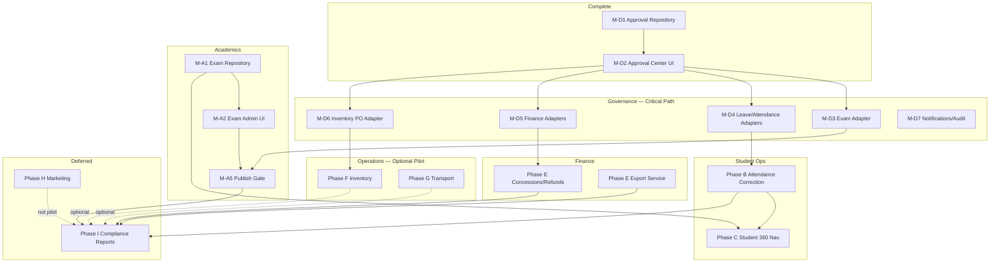

# Akshara ERP — Multi-Agent Execution Plan

**Version:** 1.2  
**Date:** 2026-06-17  
**Branch:** `feature/m15-theme`  
**Baseline operational readiness:** ~42% (94 deduplicated backlog items)  
**Pilot target (Phases A–E + D adapters):** ~68%  
**Status:** Planning only — **no implementation authorized by this document**

**Companion docs:** [`OPERATIONAL_GAP_MASTER_TRACKER.md`](./OPERATIONAL_GAP_MASTER_TRACKER.md) · [`OPERATIONAL_REMEDIATION_ROADMAP.md`](./OPERATIONAL_REMEDIATION_ROADMAP.md) · [`PHASE_A_EXECUTION_PLAN.md`](./PHASE_A_EXECUTION_PLAN.md) · [`PHASE_D_EXECUTION_PLAN.md`](./PHASE_D_EXECUTION_PLAN.md) · [`ORCHESTRATOR_AGENT.md`](./ORCHESTRATOR_AGENT.md)

---

## Future Architecture Constraint

**Authoritative definition:** [`ORCHESTRATOR_AGENT.md`](./ORCHESTRATOR_AGENT.md) — **CORE PRODUCT ARCHITECTURE PRINCIPLE**

Akshara ERP evolves toward **`USER → ROLE → WORKSPACE → TASK`**, not **`USER → MODULE → 100 MENUS`**. This constraint applies to **all agents and workstreams** but **does not alter** the critical path, sprint order, or milestone sequencing in this document.

### What agents must do now

| Rule | Application |
|------|-------------|
| **Ship current milestones first** | M-D4 → M-D5 → M-D6 → M-D7, then Phase A → B → C → E per §3–§13 — **unchanged** |
| **Design forward-compatible** | New screens, dashboards, approvals, Student 360, Marketing, Finance, Inventory, and Teacher flows group by **workspace intent** even when module folders are used today |
| **Avoid menu sprawl** | Do not add a new ERP root menu per feature; add tasks inside the persona’s workspace model |
| **Permissions** | Prefer workspace-scoped gates; Governance Agent batches additive RBAC with workspace labels in mind |
| **Approvals** | Domain agents submit via `ApprovalCenterService`; inbox filters should remain type/workspace-groupable (M-D2/M-D7) |
| **Mobile** | Student Ops + Academic agents: teacher/parent shells are workspace-first on phone |
| **Copilot** | Task and workspace context over full module enumeration |

### Dynamic Role Assignment Engine

**Authoritative definition:** [`ORCHESTRATOR_AGENT.md`](./ORCHESTRATOR_AGENT.md) — **CORE PRODUCT ARCHITECTURE PRINCIPLE → Dynamic Role Assignment Engine**

Roles are **assigned at runtime** by Principal, HR, or Management — not hardcoded per app persona. When roles change, permissions, workspaces, dashboards, navigation, and Copilot context must update **without code changes or app releases**.

**Target chain:**

```
User → Assigned Roles → Permissions → Workspaces → Tasks → Dashboards
```

**Agent rules:**

| Rule | Application |
|------|-------------|
| **No fixed dashboards** | Do not build `if (role == teacher)` dashboard forks; derive UI from assigned role set |
| **Workspace generation** | Nav and workspace shells are role-driven; Inventory Workspace appears only when Inventory Manager (or equivalent) is assigned |
| **RBAC additive** | Governance Agent: permissions map to **roles**, not to static user types; sync on login/refresh/resume |
| **Approvals** | Approval Center visibility follows role-derived permissions (M-D2/M-D7); support multi-hat principals and teachers |
| **HR as assigner** | HR module (when built) is role-assignment source of truth — coordinate with Agent D on permission sync |
| **Copilot** | Pass assigned roles + active workspace into context; never assume single persona per user |

**Systems that must align with dynamic roles (future-facing — no new phase):**

Student 360 · Teacher Workspace · Principal Workspace · Approval Center · Marketing Platform · Inventory · Finance · Transport · HR · AI Copilot

**Execution sequence unchanged:** M-D4 → M-D5 → M-D6 → M-D7 → Phase A → Phase B → Phase C → Phase E. Dynamic roles inform **design** of modules in those phases; they do not add a prerequisite milestone or delay governance.

### Workstream → workspace mapping (future-facing tags)

| Workstream | Primary workspaces | Milestones tagged |
|------------|-------------------|-------------------|
| **WS1 Governance** | Principal Workspace (Approval Center) | M-D4–M-D7 `WORKSPACE-AWARE` |
| **WS2 Academics** | Exam Coordinator · Teacher Workspace | Phase A `WORKSPACE-TARGET` |
| **WS3 Student Ops** | Class Teacher · Student 360 (in-workspace dossier) | Phase B, C `WORKSPACE-TARGET` |
| **WS4 Finance** | Finance Workspace (Principal + Accountant) | Phase E `WORKSPACE-TARGET` |
| **WS5 Operations** | Inventory · Procurement · Transport | Phase F, G `WORKSPACE-TARGET` |
| **WS6 Growth** | Marketing Workspace | Phase H `WORKSPACE-TARGET` |
| **WS7 Compliance** | Workspace-scoped report exports | Phase I `WORKSPACE-TARGET` |

### Explicit non-goals (this program)

- No new roadmap phase for “Workspace Platform” or “Dynamic Role Engine”
- No delay to M-D4 or governance track for shell refactor
- No re-architecture of completed M-D1–M-D3 deliverables unless a later workspace milestone explicitly schedules it

---

## Executive answer

**What is the fastest way to move Akshara ERP from ~42% readiness to pilot-ready status while minimizing merge conflicts and avoiding duplicated work?**

1. **Finish Governance Foundation first (M-D3–M-D7)** — approval adapters are the shared substrate; every P0 workflow (exam publish, attendance correction, concessions, PO maker-checker) routes through `ApprovalCenterService`. M-D1 (repository) and M-D2 (UI) are done; adapters are the unlock.
2. **Run four domain workstreams in parallel after Week 2** — Academics (Phase A), Attendance (Phase B), Student 360 wiring (Phase C partial), Finance (Phase E) — with strict file ownership and a **Governance Agent merge gate** on shared security/router files.
3. **Wire before net-new** — 10 high-ROI wiring tasks in Weeks 1–2 close ~20% of effort at ~45% of cost (exam store→repository, marks selectors, SIS→360 nav, concession/refund UI, subject form, parent academic report).
4. **Defer Marketing (Workstream 6)** and descope Inventory/Transport unless pilot contract requires them — frees ~10–14 engineering weeks from the critical path.
5. **Use 5 Cursor agents** — Governance + Academics + Attendance/Student 360 + Finance + Operations — with Compliance as a **late parallel track** (Phase I) after domain data exists.

**Estimated timeline to pilot-ready (day school, no store/buses/marketing):** 14–18 engineering weeks with 5 agents, vs 24+ weeks serial.

---

## Current state (as of 2026-06-17)

| Milestone | Status | Readiness impact |
|-----------|--------|------------------|
| M15 Theme Modernization | ✅ Complete | Visual only; ops unchanged |
| M-D1 Approval infrastructure | ✅ Certified | Governance foundation 0% → 100% (infra) |
| M-D2 Principal Approval Center UI | ✅ Complete | Principal ops 50% → ~58% |
| M-D3+ Module adapters | ⛔ Not started | Blocks quality of A/B/E/F |
| Phase A (Exams) | ⛔ Not started | 4 P0 blockers open |
| Phase B (Attendance) | ⛔ Not started | 2 P0 blockers open |
| Phase C (Student 360) | ⛔ Not started | 2 P0 blockers open |
| Phase E (Finance) | ⛔ Not started | 3 P0 blockers open |
| Phase F/G (Ops) | ⛔ Not started | 6 P0 if in scope |
| Phase H (Marketing) | ⛔ Deferred | Not on pilot path |

---

## 1. Agent Ownership Matrix

| Agent | Workstream | Primary phases | Owns (lib paths) | Owns (test paths) | Must NOT touch |
|-------|------------|----------------|------------------|-------------------|----------------|
| **Governance Agent** | WS1 — Governance Foundation | D (M-D3–M-D7) | `lib/core/approvals/`, `lib/features/management/approval/`, approval adapters, `lib/core/security/permissions.dart` (additive), `mutation_permission_registry.dart` (additive) | `test/contracts/approval/`, `test/integration/approval/`, `test/features/management/approval/` | Exam admin UI, attendance screens, finance screens, inventory/transport features |
| **Academic Agent** | WS2 — Academics & Exams | A | `lib/core/exams/`, `lib/core/repositories/**/exam*`, `lib/features/academics/exam_admin/`, `lib/features/teacher/exams/`, `lib/features/school_completion/subjects_*`, `lib/features/parent/academics/` (marks wire) | `test/contracts/exam_administration/`, `test/features/academics/`, `test/features/teacher/exams/`, `test/integration/exam_administration/` | Approval center UI ( submits only via service), attendance, finance mutations |
| **Student Operations Agent** | WS3 — Attendance & Student 360 | B, C (partial) | `lib/features/teacher/attendance/`, new attendance correction, `lib/features/student_360/`, SIS→360 navigation, `lib/features/parent/attendance/`, teacher mobile search | `test/features/teacher/attendance/`, `test/features/student_360/`, `test/features/parent/attendance/` | Exam repository, finance, inventory, approval adapter implementations (Governance owns adapters) |
| **Finance Agent** | WS4 — Finance Completion | E | `lib/features/finance/`, finance export service, `lib/core/repositories/**/finance*` | `test/features/finance/`, `test/integration/finance/`, finance contract tests | Exam admin, attendance, inventory PO screens |
| **Operations Agent** | WS5 — Operations | F, G | `lib/features/inventory/`, `lib/features/transport/`, hostel P1 if boarding pilot | `test/features/inventory/`, `test/features/transport/` | Approval adapters (Governance wires PO adapter), exam, attendance core |
| **Compliance Agent** *(late track)* | WS7 — Compliance & Reporting | I | Shared export/report services, report screens across modules | `test/integration/reports/`, golden report outputs | Domain mutation logic (read-only aggregation) |
| **Growth Agent** *(deferred)* | WS6 — Marketing | H | `lib/features/marketing/` (greenfield) | `test/features/marketing/` | All pilot-critical paths |

### Cross-agent coordination rules

| Shared artifact | Merge owner | Rule |
|-----------------|-------------|------|
| `permissions.dart`, `rbac_service.dart` | Governance Agent | Domain agents submit permission enum PRs; Governance merges |
| `route_guards.dart`, `app_router.dart` | Governance Agent (routes) + domain agent (feature routes) | Domain agent opens PR; Governance rebases and resolves guard conflicts |
| `repository_providers.dart` | First registrant + Governance review | One provider block per agent per PR |
| `ApprovalCenterService.submit()` | Governance Agent | Domain agents call service; never duplicate queue logic |
| `lib/core/security/mutation_permission_registry.dart` | Governance Agent | Batch registry entries weekly |

---

## 2. Dependency Graph

### Foundational systems (build once, consume many)

| Foundation ID | System | Status | Consumed by |
|---------------|--------|--------|-------------|
| **F-01** | ApprovalCenterService + Repository | M-D1 ✅ | All APR-* chains, P0-EXAM-003, P0-ATT-001, P0-FIN-001, P0-INV-003 |
| **F-02** | Principal Approval Center UI | M-D2 ✅ | All principal workflows |
| **F-03** | Approval module adapters | M-D3–D7 ⛔ | Exam publish, leave, attendance correction, finance, PO |
| **F-04** | ExamAdministrationRepository | Phase A M-A1 ⛔ | Marks entry, parent report, Student 360 marks tab |
| **F-05** | Academic master catalog (DISC-002) | Phase A M-A2/A7 ⛔ | Exam admin, marks RBAC, report cards |
| **F-06** | Attendance correction entity + workflow | Phase B ⛔ | Parent dispute, principal queue, 360 attendance |
| **F-07** | Student 360 unified navigation (DISC-003) | Phase C ⛔ | SIS, teacher at-risk, intelligence drill-down |
| **F-08** | AksharaReportExportService (RPT-018) | Phase E ⛔ | Finance/inventory/transport exports, Phase I |
| **F-09** | RBAC permission registry completeness | Cross-cutting ⛔ | All mutations |

### Mermaid — system dependencies



### Item-level dependency chains (symptom → root cause)

| Symptom gaps | Root foundation | Fix once |
|--------------|-----------------|----------|
| P0-EXAM-001/002/003/004, P1-EXAM-*, DISC-001/002, WF-001/002/003 | F-04 + F-05 + F-03 (exam adapter) | Phase A + M-D3 |
| P0-ATT-001/002, P1-ATT-*, WF-004/005 | F-03 (attendance adapter) + F-06 | M-D4 stub + Phase B |
| P0-S360-001/002, P1-S360-*, DISC-003, WF-013 | F-07 + data from F-04/F-06 | Phase C |
| P0-FIN-001/002/003, P1-FIN-*, APR-006/007 | F-03 (finance adapter) + F-08 | M-D5 + Phase E |
| P0-INV-003/004, P1-INV-* | F-03 (PO adapter) + F-09 | M-D6 + Phase F |
| P0-TRN-001/002, P1-TRN-* | Transport domain (no approval dependency for MVP attendance) | Phase G |
| P0-MKT-001, P1-ADM-002, DISC-009 | Greenfield marketing module | Phase H — **deferred** |
| P2-RPT-*, RPT-001–018 | F-08 + stable domain data | Phase I |

---

## 3. Critical Path

**Longest path to minimum pilot (Phases A–E + D adapters complete):**

```
Week 1–2:  M-D3 (exam adapter) ║ M-A1 (exam repository)
Week 2–4:  M-A2/A3 (exam admin UI + persistence) ║ M-D4 (leave/attendance adapter stubs)
Week 3–5:  M-A4/A5 (marks + publish gate) ← requires M-D3
Week 4–6:  Phase B (attendance correction) ← requires M-D4 implementation
Week 5–7:  Phase C (360 navigation + domains) ← requires A marks + B attendance
Week 4–7:  M-D5 + Phase E (finance) ← parallel after M-D5 Week 4
Week 7–8:  Integration hardening, Patrol, pilot checklist
```

**Critical path duration:** ~8 weeks calendar with 5 agents (14–18 engineering-weeks aggregate).

**Serial bottleneck:** M-D3 ↔ M-A5 handshake (exam publish approval). Neither agent proceeds past Week 4 without a signed adapter contract test.

---

## 4. Parallel Execution Map

| Week | Governance | Academics | Student Ops | Finance | Operations | Compliance |
|------|------------|-----------|-------------|---------|------------|------------|
| **1** | M-D3 exam adapter start | M-A1 exam repository | — | — | — | — |
| **2** | M-D3 complete, M-D4 stubs | M-A2 exam admin UI, M-A3 start | P0-S360-001 **wire-only** (nav links) | — | — | — |
| **3** | M-D4 leave adapters | M-A3 complete, M-A4 selectors | Phase B kickoff (entity design) | — | — | — |
| **4** | M-D5 finance adapters | M-A5 publish gate | Phase B correction UI | Phase E kickoff (refund wire) | — | — |
| **5** | M-D6 PO adapter | M-A6/A7 grading + subjects | Phase B lock + RBAC | P0-FIN-001/002 wire | — | — |
| **6** | M-D7 notifications | M-A8 parent report | Phase C 360 domains | P0-FIN-003 export service | Phase F/G *if in scope* | — |
| **7–8** | Adapter hardening | Integration tests | 360 + attendance integration | Finance integration | Ops integration | Report spec only |
| **9+** | Maintenance | P1 exam items | P1 attendance/360 | P1 finance | F/G completion | Phase I start |

**Maximum parallelism:** Weeks 4–6 — four domain agents + Governance on adapters.

**Forbidden parallelism:** Two agents editing `permissions.dart` or `approval_detail_panel.dart` in the same week without Governance merge gate.

---

## 5. Pilot-Critical Path

**Target school profile:** Day school, no store, no buses, no marketing team (recommended first pilot).

### P0 gaps on critical path (14 of 18 — Marketing + optional Ops excluded)

| Order | Gap ID | Workstream | Type | Week target |
|------:|--------|------------|------|-------------|
| 1 | P0-EXAM-004 | Academics | NET_NEW | W2–3 |
| 2 | P0-EXAM-001 | Academics | WIRE | W2 |
| 3 | P0-EXAM-002 | Academics | WIRE | W3–4 |
| 4 | P0-EXAM-003 | Academics + Governance | NET_NEW | W4–5 |
| 5 | P0-ATT-001 | Student Ops + Governance | NET_NEW | W4–6 |
| 6 | P0-ATT-002 | Student Ops | NET_NEW | W5 |
| 7 | P0-S360-001 | Student Ops | WIRE | W2 |
| 8 | P0-S360-002 | Student Ops | NET_NEW | W6–7 |
| 9 | P0-FIN-001 | Finance + Governance | WIRE | W5 |
| 10 | P0-FIN-002 | Finance | WIRE | W4 |
| 11 | P0-FIN-003 | Finance | NET_NEW | W6 |
| 12 | *(via D)* P0-INV-003 | Governance | NET_NEW | W5 *(only if store pilot)* |
| 13 | *(via D)* P0-INV-004 | Governance | NET_NEW | W5 *(only if store pilot)* |
| 14 | *(via D)* P0-TRN-* | Operations | NET_NEW | W8+ *(only if transport pilot)* |

### Descoped from pilot-critical (4 P0 items)

| Gap ID | Reason |
|--------|--------|
| P0-MKT-001 | Marketing deferred — admissions operates without campaign module |
| P0-INV-001/002 | Descope if no school store |
| P0-TRN-001/002 | Descope if transport not marketed; use honest static-route mode |

### Pilot exit checklist (from remediation roadmap)

- [ ] Exam admin + persistent repository + approval-gated publish
- [ ] Attendance correction + RBAC + principal approval
- [ ] Student 360 reachable + core domains
- [ ] Concession assign + refund create + real finance exports
- [ ] Approval Center adapters live for exam, attendance, leave, concession, refund
- [ ] Parent academic data from published marks

**Pilot readiness after checklist:** ~68% overall.

---

## 6. Deferred Workstreams

| Workstream | Phase | Rationale | Re-evaluate when |
|------------|-------|-----------|------------------|
| **WS6 — Marketing** | H | MK-01–10 greenfield; 6–8 weeks; does not unblock day-school academic/fee pilot | School signs marketing SLA or admissions demands MK-D-10 |
| **WS5 — Inventory** | F | 4 P0 gaps; 5–6 weeks; only needed if uniform/lab store promised | Pilot contract includes store operations |
| **WS5 — Transport GPS** | G (P0-TRN-001) | XL effort, vendor dependency; static route mode acceptable for MVP | Parent app transport SLA signed |
| **WS7 — Phase I full compliance** | I | Depends on A/B/E data; not blocking limited pilot | 30 days pre-accreditation inspection |
| **Hostel P1** (P1-HST-*) | — | Boarding-only | Boarding school pilot |
| **HR payroll disbursement** (P1-HR-004) | — | Finance integration; post-pilot ops | HR go-live requested |
| **P2 enhancements** (38 items) | — | Post-pilot quality | After 68% gate |

---

## 7. Wiring-Only Opportunities

**Highest ROI — execute in Weeks 1–2 before net-new builds.**

| Priority | Gap IDs | Asset → Target | Agent | Effort | Enables |
|----------|---------|----------------|-------|--------|---------|
| 1 | P0-EXAM-001, P0-EXAM-004 (partial) | `ExamAdministrationStore` → repository + admin UI shell | Academic | S+M | All exam P0 |
| 2 | P0-EXAM-002, P1-EXAM-007 | Teacher exams → class/section/subject/exam selectors | Academic | M | Marks RBAC |
| 3 | P0-S360-001 | SIS registry, teacher at-risk, intelligence → `Student360Screen` | Student Ops | S | Phase C nav |
| 4 | P0-FIN-001 | Scholarship catalog → assign UI + approval submit | Finance | M | Concession pilot |
| 5 | P0-FIN-002 | Refund create dialog → existing approve/reject | Finance | S | Refund pilot |
| 6 | P1-EXAM-001, P1-EXAM-003 | Subject FAB → real form + `manageSubjects` | Academic | S | DISC-002 |
| 7 | P1-S360-004 | `Student360Profile.communication` → UI tab | Student Ops | S | Comms visibility |
| 8 | P1-PAR-001, DISC-004 | Parent academic report → published exam results | Academic | M | Parent trust |
| 9 | P1-TCH-001, DISC-006 | Homework create → `TeacherRepository` | Student Ops | M | Homework sync |
| 10 | P1-AUD-001 | Fix teacher marks audit event types | Academic | S | Compliance queries |
| 11 | P1-TRN-005 | Route picker on transport assign (not raw ID) | Operations | S | Routing safety |
| 12 | P1-PAR-002 | Parent leave status from approval queue | Governance + Student Ops | S | Leave UX |
| 13 | P1-RBAC-002 | Mutation registry entries (batch with Governance) | Governance | S | Audit |
| 14 | P1-FIN-008 | Receipt PDF student name fix | Finance | S | Receipt accuracy |
| 15 | P1-INV-008 | Enforce procurement/asset lifecycle permissions | Operations | S | RBAC |

**Wiring summary:** 28 of 94 items are WIRE or DISCONNECT-unify (≈30% of backlog). Completing wiring-first closes visible pilot gaps ~2× faster than greenfield.

---

## 8. Net-New Development Inventory

| Category | Count | Representative gaps | Est. aggregate effort |
|----------|------:|----------------------|----------------------|
| **Governance adapters + RBAC** | 12 | M-D3–D7, P0-INV-003/004, P1-PRIN-002/003, RBAC-006/007/009 | 4–5 weeks |
| **Exam domain** | 8 | P0-EXAM-003/004, P1-EXAM-004/005/006, grading scheme | 5–6 weeks |
| **Attendance domain** | 10 | P0-ATT-001/002, P1-ATT-003–008 | 3–4 weeks |
| **Student 360 domain** | 4 | P0-S360-002, P1-S360-003 | 2–3 weeks |
| **Finance domain** | 8 | P0-FIN-003, P1-FIN-004–009, P2-FIN-005 | 3–4 weeks |
| **Inventory domain** | 9 | P0-INV-001/002, P1-INV-005–007, P2-INV-* | 5–6 weeks |
| **Transport domain** | 8 | P0-TRN-001/002, P1-TRN-003/004/007 | 4–5 weeks (+ GPS variable) |
| **Marketing greenfield** | 12+ | P0-MKT-001, P2-MKT-*, P1-ADM-001/002 | 6–8 weeks |
| **Compliance/reporting** | 15+ | RPT-001–018, P2-RPT-*, Phase I | 4–5 weeks |
| **Mobile/P2 enhancements** | 18 | P2-PAR-*, P2-TCH-*, P2-STU-*, P2-PRIN-* | Post-pilot |

**Net-new pilot minimum (A–E + D adapters):** ~35 items · ~14–18 engineering-weeks with 5 agents.

---

## 9. High-Risk Areas

| Risk ID | Area | Gaps | Risk | Mitigation |
|---------|------|------|------|------------|
| **R-01** | Dual exam systems (DISC-001) | P0-EXAM-001, WF-001 | **Critical** — duplicate data models | Single ERP Exam Admin entry; Education Suite question papers only |
| **R-02** | In-memory exam data | P0-EXAM-004 | **Critical** — data loss on restart | M-A3 persistence before pilot sign-off |
| **R-03** | Teacher self-publish | P0-EXAM-003, WF-002 | **High** — compliance failure | M-D3 + M-A5; feature flag rollback only for emergency |
| **R-04** | Shared `permissions.dart` merge conflicts | All RBAC-* | **High** — rebase churn | Governance merge gate; additive-only PRs |
| **R-05** | Approval adapter bypass | APR-* | **High** — shadow approvals | Lint + mutation registry; modules must call `ApprovalCenterService` |
| **R-06** | Subject catalog fragmentation (DISC-002) | P1-EXAM-001, P0-EXAM-002 | **High** — wrong marks scope | Unify on School Completion catalog before marks selectors |
| **R-07** | Three student profile surfaces (DISC-003) | P0-S360-001, P1-S360-003 | **Medium** — UX confusion | Phase C deprecates risk-only screen as primary |
| **R-08** | Backend API lag | P0-EXAM-004, P0-ATT-001 | **Medium** — schedule slip | Mock persistence + contract tests; wire-first |
| **R-09** | GPS vendor (P0-TRN-001) | Transport | **Medium** — external dependency | Descope to static route + manual attendance for pilot |
| **R-10** | Export infrastructure (P0-FIN-003) | Finance, inventory, transport | **Medium** — audit failure | Shared `AksharaReportExportService` in Phase E before Phase I |
| **R-11** | Scope creep into question bank | Phase A | **Medium** | Defer per `ACADEMIC_ASSESSMENT_PLATFORM_DESIGN.md` |
| **R-12** | Marketing consumes pilot resources | P0-MKT-001 | **Low** if deferred | Hard deferral in sprint planning |

---

## 10. Merge Conflict Matrix

**Legend:** 🔴 High · 🟡 Medium · 🟢 Low

| File / directory | Gov | Acad | StuOps | Finance | Ops | Compliance |
|------------------|:---:|:----:|:----:|:-------:|:---:|:----------:|
| `lib/core/security/permissions.dart` | 🔴 | 🟡 | 🟡 | 🟡 | 🟡 | 🟢 |
| `lib/core/security/mutation_permission_registry.dart` | 🔴 | 🟡 | 🟡 | 🟡 | 🟡 | 🟢 |
| `lib/router/route_guards.dart` | 🔴 | 🟡 | 🟡 | 🟡 | 🟡 | 🟢 |
| `lib/router/app_router.dart` | 🟡 | 🟡 | 🟡 | 🟡 | 🟡 | 🟢 |
| `lib/core/repositories/repository_providers.dart` | 🟡 | 🟡 | 🟡 | 🟡 | 🟡 | 🟢 |
| `lib/features/management/approval/**` | 🔴 | 🟡 | 🟡 | 🟡 | 🟡 | 🟢 |
| `lib/core/approvals/**` | 🔴 | 🟢 | 🟢 | 🟢 | 🟢 | 🟢 |
| `lib/features/teacher/teacher_mutations_provider.dart` | 🟡 | 🔴 | 🟡 | 🟢 | 🟢 | 🟢 |
| `lib/features/management/management_models.dart` | 🟡 | 🟡 | 🟢 | 🟡 | 🟡 | 🟢 |
| `lib/features/school_completion/**` | 🟢 | 🔴 | 🟢 | 🟢 | 🟢 | 🟢 |
| `lib/features/teacher/exams/**` | 🟢 | 🔴 | 🟢 | 🟢 | 🟢 | 🟢 |
| `lib/features/student_360/**` | 🟢 | 🟡 | 🔴 | 🟢 | 🟢 | 🟢 |
| `lib/features/finance/**` | 🟡 | 🟢 | 🟢 | 🔴 | 🟢 | 🟡 |
| `lib/features/inventory/**` | 🟡 | 🟢 | 🟢 | 🟡 | 🔴 | 🟢 |
| `lib/features/transport/**` | 🟢 | 🟢 | 🟡 | 🟡 | 🔴 | 🟢 |
| `test/router/route_protection_inventory_test.dart` | 🔴 | 🟡 | 🟡 | 🟡 | 🟡 | 🟢 |
| `qa/patrol/journey_manifest.json` | 🟡 | 🟡 | 🟡 | 🟡 | 🟡 | 🟢 |

### Conflict reduction tactics

1. **Branch naming:** `feat/gov-md3-exam-adapter`, `feat/acad-ma2-exam-admin`, etc.
2. **Daily rebase window:** Governance Agent rebases `feature/pilot-integration` at EOD.
3. **File locks:** Manifest in `qa/agents/work_manifest.json` — max 4 parallel tasks per multi-agent coordinator skill.
4. **Adapter boundary:** Domain agents implement `submitXForApproval()` in their mutations file; Governance owns `approval_adapters/` directory exclusively.

---

## 11. Recommended Agent Count

### Decision: **5 agents**

| Option | Verdict | Rationale |
|--------|---------|-----------|
| **3 agents** | ❌ Too few | Forces serialization of Academics + Attendance + 360; 24+ weeks to pilot |
| **4 agents** | ⚠️ Viable but tight | Must merge Student Ops + Governance adapter work — adapter bottleneck |
| **5 agents** | ✅ **Recommended** | Governance gate + 4 parallel domain streams; matches phase boundaries |
| **6 agents** | ⚠️ Overhead | Splitting Operations (Inv vs Transport) or Student Ops (Att vs 360) adds merge cost without shortening critical path |

### Five-agent roster

| # | Agent | Load (eng-weeks) | Critical? |
|---|-------|------------------|-----------|
| 1 | Governance | 4–5 | **Yes** — critical path |
| 2 | Academics | 6–8 | **Yes** — critical path |
| 3 | Student Ops (Attendance + 360) | 5–7 | **Yes** — pilot P0 |
| 4 | Finance | 3–4 | **Yes** — pilot P0 |
| 5 | Operations | 0–9 | **Conditional** — only if F/G in pilot scope |

**Compliance Agent** activates as a 6th **read-only/reporting** agent in Week 9+ for Phase I — not during pilot sprint.

---

## 12. Suggested Cursor Chat Structure

| Chat | Agent role | Scope | Start | Stop condition |
|------|------------|-------|-------|----------------|
| **Chat 1 — Governance** | Governance Agent | M-D3–M-D7, shared RBAC, approval adapters, merge gate | Immediately | All APR-002–008 adapters certified + integration tests green |
| **Chat 2 — Academics** | Academic Agent | Phase A M-A1–M-A8, exam repository, teacher marks, subjects | After M-D1 confirmed (done) | P0-EXAM-* closed, Patrol exam journeys pass |
| **Chat 3 — Attendance & Student 360** | Student Operations Agent | Phase B + Phase C, 360 navigation, attendance correction | Week 2 (360 wire) / Week 3 (Phase B) | P0-ATT-*, P0-S360-* closed |
| **Chat 4 — Finance** | Finance Agent | Phase E, concessions, refunds, export service | Week 4 (after M-D5 finance adapter) | P0-FIN-* closed |
| **Chat 5 — Operations** | Operations Agent | Phase F + G (inventory, transport) | Only if pilot contract requires | P0-INV-* / P0-TRN-* closed or descoped |
| **Chat 6 — Compliance** *(late)* | Compliance Agent | Phase I reports, audit packs | Week 9+ | RPT-018 + Phase I exports |

### Chat handoff protocol

1. Governance publishes adapter interface + sample integration test before domain agent wires submit path.
2. Domain agent opens PR with mutation submit only; Governance PR adds adapter approve handler.
3. Parent coordinator runs `flutter analyze` + affected tests before cross-chat merge.

**Do NOT open Chat 6 (Marketing/Growth)** until pilot readiness ≥ 68%.

---

## 13. Recommended Sprint Order

### Sprint 0 (complete)

- M15 Theme ✅
- M-D1 Approval infrastructure ✅
- M-D2 Approval Center UI ✅

### Sprint 1 (Weeks 1–2): Foundation wire

| Deliverable | Owner |
|-------------|-------|
| M-D3 exam approval adapter (skeleton + integration test) | Governance |
| M-A1 exam repository interface + contract tests | Academics |
| P0-S360-001 navigation wire | Student Ops |
| P0-FIN-002 refund create wire | Finance |

### Sprint 2 (Weeks 3–4): Core domain shells

| Deliverable | Owner |
|-------------|-------|
| M-A2 exam admin UI, M-A3 persistence start | Academics |
| M-D4 leave + attendance adapter stubs | Governance |
| Phase B attendance correction entity + repository | Student Ops |
| M-D5 finance adapters | Governance |

### Sprint 3 (Weeks 5–6): Governance gates live

| Deliverable | Owner |
|-------------|-------|
| M-A4/A5 marks selectors + publish approval gate | Academics |
| Phase B correction UI + P0-ATT-002 RBAC | Student Ops |
| P0-FIN-001 concession wire + P0-FIN-003 export start | Finance |
| M-D6 PO adapter *(if store pilot)* | Governance |

### Sprint 4 (Weeks 7–8): Unification + pilot hardening

| Deliverable | Owner |
|-------------|-------|
| M-A6/A7/A8 grading, subjects, parent report | Academics |
| Phase C 360 domains (P0-S360-002) | Student Ops |
| Phase E completion | Finance |
| M-D7 notifications/audit | Governance |
| Patrol FULL run, pilot checklist update | All |

### Sprint 5+ (optional / post-pilot)

| Deliverable | Owner |
|-------------|-------|
| Phase F Inventory | Operations |
| Phase G Transport | Operations |
| Phase I Compliance | Compliance |
| Phase H Marketing | Growth *(deferred)* |

---

## 14. Estimated Readiness Increase After Each Workstream

| Milestone / workstream | Overall readiness | Key module deltas | Pilot viable? |
|------------------------|:-----------------:|-------------------|:-------------:|
| **Baseline (today)** | **42%** | — | No |
| **+ M-D3–D7 (Governance complete)** | **48%** | Principal 58%→75%, Cross-gov 45%→70% | No (enabler) |
| **+ WS2 Academics (Phase A)** | **58%** | Academics 25%→65%, Teacher 55%→68%, Parent 60%→68% | No |
| **+ WS3 Attendance (Phase B)** | **62%** | Attendance 40%→70%, Teacher 68%→75% | No |
| **+ WS3 Student 360 (Phase C)** | **65%** | Student 360 35%→70%, SIS 60%→72% | No |
| **+ WS4 Finance (Phase E)** | **68%** | Finance 70%→85%, Parent 72%→78% | **Yes** (day school) |
| **+ WS5 Inventory (Phase F)** | **72%** | Inventory 20%→60% | Yes (with store) |
| **+ WS5 Transport (Phase G)** | **75%** | Transport 35%→65%, Parent 78%→82% | Yes (with buses) |
| **+ WS6 Marketing (Phase H)** | **78%** | Marketing 10%→70%, Admissions 75%→85% | Yes (full school) |
| **+ WS7 Compliance (Phase I)** | **88%** | Reporting 25%→80% | Production candidate |

### Cumulative readiness curve

```
42% ── M-D3-7 ──► 48% ── Phase A ──► 58% ── Phase B ──► 62% ── Phase C ──► 65% ── Phase E ──► 68% ★ PILOT
                                                                                    │
                                         optional F/G ──► 72–75% ── H (deferred) ──► 78% ── I ──► 88%
```

---

## Appendix A — Complete Backlog Analysis (94 items)

### Analysis column key

| Column | Values |
|--------|--------|
| **Foundation** | F-01…F-09 (see §2) or — |
| **Type** | WIRE · NET_NEW · DISCONNECT |
| **Risk** | Critical · High · Medium · Low |
| **Conflict** | 🔴 · 🟡 · 🟢 |
| **Effort** | S · M · L · XL |

### P0 — Pilot blocking (18 items)

| Gap ID | Foundation | Blocked by | Enables | Type | Risk | Effort | Conflict | Agent |
|--------|------------|------------|---------|------|------|--------|----------|-------|
| P0-EXAM-001 | F-04, F-05 | — | P0-EXAM-002/003/004, Phase A | WIRE | Critical | XL | 🟡 | Academic |
| P0-EXAM-002 | F-04, F-05 | P0-EXAM-001 | Marks pilot, P1-EXAM-005 | WIRE | Critical | L | 🟡 | Academic |
| P0-EXAM-003 | F-03 | M-D3, P0-EXAM-001 | Parent results, APR-002 | NET_NEW | Critical | L | 🔴 | Academic + Gov |
| P0-EXAM-004 | F-04 | — | Persistence, P1-PAR-001 | NET_NEW | Critical | XL | 🟡 | Academic |
| P0-ATT-001 | F-03, F-06 | M-D4 | P1-ATT-*, APR-003 | NET_NEW | High | L | 🟡 | StuOps + Gov |
| P0-ATT-002 | F-09 | P0-ATT-001 | RBAC-003/004 | NET_NEW | High | M | 🔴 | StuOps + Gov |
| P0-S360-001 | F-07 | — | Phase C, P1-S360-004 | WIRE | Medium | M | 🟢 | StuOps |
| P0-S360-002 | F-07 | P0-S360-001, A marks | Full dossier | NET_NEW | Medium | L | 🟡 | StuOps |
| P0-FIN-001 | F-03 | M-D5 | APR-006, P1-FIN-005 | WIRE | High | L | 🟡 | Finance + Gov |
| P0-FIN-002 | — | — | APR-007, refunds pilot | WIRE | Medium | M | 🟢 | Finance |
| P0-FIN-003 | F-08 | — | RPT-018, Phase I | NET_NEW | High | L | 🟡 | Finance |
| P0-INV-001 | — | — | P0-INV-002, Phase F | NET_NEW | High* | L | 🟢 | Ops |
| P0-INV-002 | — | P0-INV-001 | Stock truth, RPT-009 | NET_NEW | High* | XL | 🟢 | Ops |
| P0-INV-003 | F-03 | M-D6 | APR-008, RBAC-006 | NET_NEW | High* | M | 🔴 | Gov + Ops |
| P0-INV-004 | F-09 | P0-INV-003 | RBAC-007 | NET_NEW | Medium* | S | 🔴 | Gov |
| P0-TRN-001 | — | GPS vendor | Parent transport | NET_NEW | Medium* | XL | 🟢 | Ops |
| P0-TRN-002 | — | — | P1-TRN-007, safety | NET_NEW | Medium* | L | 🟢 | Ops |
| P0-MKT-001 | — | — | MK-*, P1-ADM-002 | NET_NEW | Low | XL | 🟢 | Growth (**deferred**) |

*High only if module in pilot scope.

### P1 — Important (38 items)

| Gap ID | Foundation | Blocked by | Enables | Type | Risk | Effort | Conflict | Agent |
|--------|------------|------------|---------|------|------|--------|----------|-------|
| P1-EXAM-001 | F-05 | — | P1-EXAM-002, DISC-002 | WIRE | Medium | M | 🟡 | Academic |
| P1-EXAM-002 | F-05 | P1-EXAM-001 | Catalog hygiene | WIRE | Low | S | 🟢 | Academic |
| P1-EXAM-003 | F-09 | — | RBAC-005 | WIRE | Medium | S | 🔴 | Academic + Gov |
| P1-EXAM-004 | F-04 | P0-EXAM-004 | P2-EXAM-002/003 | NET_NEW | Medium | L | 🟢 | Academic |
| P1-EXAM-005 | F-04 | P0-EXAM-002 | Valid marks | NET_NEW | Medium | M | 🟢 | Academic |
| P1-EXAM-006 | F-09 | P0-EXAM-003 | RBAC-001/002 | NET_NEW | Medium | M | 🔴 | Academic + Gov |
| P1-EXAM-007 | F-05 | DISC-002 | Marks RBAC | WIRE | Low | S | 🟢 | Academic |
| P1-EXAM-008 | F-04 | P0-EXAM-003 | Verification UI | WIRE | Low | S | 🟢 | Academic |
| P1-ATT-003 | — | — | Teacher mobile UX | NET_NEW | Low | M | 🟢 | StuOps |
| P1-ATT-004 | F-06 | P0-ATT-001 | History view | NET_NEW | Medium | M | 🟢 | StuOps |
| P1-ATT-005 | F-06 | P0-ATT-001 | Data integrity | NET_NEW | Medium | S | 🟢 | StuOps |
| P1-ATT-006 | — | — | Role clarity | DISCONNECT | Medium | M | 🟡 | StuOps |
| P1-ATT-007 | F-06 | P0-ATT-001 | Audit trail | NET_NEW | Medium | M | 🟢 | StuOps |
| P1-ATT-008 | F-06 | P0-ATT-001 | Admin governance | NET_NEW | Medium | L | 🟢 | StuOps |
| P1-S360-003 | F-07 | Phase C | Unified dossier | NET_NEW | Medium | L | 🟡 | StuOps |
| P1-S360-004 | F-07 | P0-S360-001 | Comms tab | WIRE | Low | S | 🟢 | StuOps |
| P1-S360-005 | F-07 | — | Identity fix | WIRE | Low | S | 🟢 | StuOps |
| P1-FIN-004 | F-03 | M-D5 | APR-012 | NET_NEW | Medium | M | 🟡 | Finance + Gov |
| P1-FIN-005 | F-03 | P0-FIN-001 | Discount rules | NET_NEW | Medium | M | 🟢 | Finance |
| P1-FIN-006 | — | — | Cashier accuracy | NET_NEW | Low | S | 🟢 | Finance |
| P1-FIN-007 | F-03 | M-D5 | Principal oversight | NET_NEW | Medium | M | 🔴 | Finance + Gov |
| P1-FIN-008 | — | — | Receipt accuracy | WIRE | Low | S | 🟢 | Finance |
| P1-FIN-009 | — | — | Segregation of duties | NET_NEW | Medium | M | 🟢 | Finance |
| P1-INV-005 | — | P0-INV-001 | Stock init | NET_NEW | Medium* | M | 🟢 | Ops |
| P1-INV-006 | — | P0-INV-002 | Consumption | NET_NEW | Medium* | L | 🟢 | Ops |
| P1-INV-007 | — | — | Partial receive | NET_NEW | Low | M | 🟢 | Ops |
| P1-INV-008 | F-09 | — | RBAC-013 | WIRE | Low | S | 🟡 | Ops + Gov |
| P1-TRN-003 | — | — | Fleet CRUD | NET_NEW | Medium* | L | 🟢 | Ops |
| P1-TRN-004 | — | — | Route builder | NET_NEW | Medium* | L | 🟢 | Ops |
| P1-TRN-005 | — | — | Safe routing | WIRE | Low | S | 🟢 | Ops |
| P1-TRN-006 | — | — | Settings | WIRE | Low | M | 🟢 | Ops |
| P1-TRN-007 | F-09 | P0-TRN-002 | RBAC-008 | NET_NEW | Medium* | L | 🔴 | Ops + Gov |
| P1-HST-001 | F-03 | M-D4 | Hostel leave | NET_NEW | Medium** | M | 🟡 | Ops + Gov |
| P1-HST-002 | — | — | Boarding attendance | NET_NEW | Medium** | M | 🟢 | Ops |
| P1-HST-003 | — | — | Visitor security | NET_NEW | Low** | M | 🟢 | Ops |
| P1-LIB-001 | — | — | Catalog growth | NET_NEW | Low | M | 🟢 | Ops |
| P1-LIB-002 | F-08 | P0-FIN-003 | P2-FIN-004 | NET_NEW | Low | M | 🟡 | Ops + Finance |
| P1-HR-001 | — | DISC-005 | Staff punch | NET_NEW | Medium | M | 🟢 | Ops |
| P1-HR-002 | F-05 | DISC-002 | Assignment source | DISCONNECT | Medium | M | 🟡 | Academic + Ops |
| P1-HR-003 | — | — | Hiring pipeline | NET_NEW | Low | M | 🟢 | Ops |
| P1-HR-004 | — | Finance | Payroll complete | NET_NEW | Low | L | 🟡 | Ops + Finance |
| P1-PRIN-001 | F-02 | M-D2 ✅ | Unified inbox | NET_NEW | — | — | — | **Closed (M-D2)** |
| P1-PRIN-002 | F-03 | M-D4 | APR-004 | NET_NEW | Medium | L | 🟡 | Gov + StuOps |
| P1-PRIN-003 | F-03 | P0-ATT-001 | Daily exceptions | NET_NEW | Medium | L | 🟡 | Gov + StuOps |
| P1-PRIN-004 | — | — | School notices | NET_NEW | Low | L | 🟢 | Gov |
| P1-TCH-001 | — | DISC-006 | Homework sync | DISCONNECT | Medium | M | 🟡 | StuOps |
| P1-TCH-002 | — | DISC-005 | HR vs class att | DISCONNECT | Low | S | 🟢 | StuOps |
| P1-TCH-003 | F-03 | P1-PRIN-002 | Class teacher leave | NET_NEW | Medium | M | 🟡 | StuOps + Gov |
| P1-TCH-004 | — | — | Profile UX | NET_NEW | Low | S | 🟢 | StuOps |
| P1-PAR-001 | F-04 | P0-EXAM-004 | DISC-004 | DISCONNECT | Medium | M | 🟡 | Academic |
| P1-PAR-002 | F-03 | P1-PRIN-002 | Leave visibility | WIRE | Low | S | 🟢 | StuOps + Gov |
| P1-PAR-003 | — | Payment gateway | Live payments | WIRE | Medium | M | 🟢 | Finance |
| P1-STU-001 | — | — | Homework evidence | NET_NEW | Low | M | 🟢 | StuOps |
| P1-ADM-001 | — | P0-MKT-001 | AD-03 enquiry | NET_NEW | Low | M | 🟢 | Growth (**deferred**) |
| P1-ADM-002 | — | P0-MKT-001 | MK-D-10 | DISCONNECT | Low | M | 🟢 | Growth (**deferred**) |
| P1-RBAC-001 | F-09 | — | Mobile security | NET_NEW | Medium | M | 🔴 | Gov |
| P1-RBAC-002 | F-09 | P1-EXAM-006, P0-ATT-002 | Registry complete | WIRE | Medium | S | 🔴 | Gov |
| P1-AUD-001 | — | — | Marks audit | WIRE | Medium | S | 🟢 | Academic |
| P1-AUD-002 | F-05 | P1-EXAM-001 | Subject audit | WIRE | Low | S | 🟢 | Academic |

** Boarding school only.

### P2 — Enhancement (38 items) — summary by module

| Module | Count | Foundation deps | Pilot path | Agent |
|--------|------:|-----------------|------------|-------|
| Exams P2-EXAM-* | 8 | F-04, Phase A complete | Post-pilot / Phase I | Academic |
| Attendance P2-ATT-* | 2 | F-06 | Post-pilot | StuOps |
| Student 360 P2-S360-* | 2 | F-07, F-08 | Phase I | Compliance |
| Finance P2-FIN-* | 5 | F-08, Phase E | Post-pilot / Phase I | Finance |
| Inventory P2-INV-* | 3 | Phase F | Optional ops | Ops |
| Transport P2-TRN-* | 2 | Phase G | Optional ops | Ops |
| Hostel/Library/HR P2-* | 4 | — | Post-pilot | Ops |
| Marketing P2-MKT-* | 4 | Phase H | **Deferred** | Growth |
| Parent/Teacher/Student P2-* | 9 | Various | Post-pilot | StuOps / Academic |
| Principal/Director P2-* | 6 | F-03 | Post-pilot | Gov |
| Reports P2-RPT-* | 4 | F-08, Phase I | Phase I | Compliance |

All P2 items: **Risk = Low**, **Conflict = 🟢**, effort **M–L** unless noted in tracker.

### Workflow (WF), Approval (APR), RBAC, Report cross-refs

| ID set | Count | Resolution path | Agent |
|--------|------:|-----------------|-------|
| WF-001–015 | 15 | Mapped to P0/P1 gaps above | Mixed |
| APR-001–014 | 14 | M-D3–D7 + domain phases | Governance + domain |
| RBAC-001–013 | 13 | Governance batch + domain triggers | Governance |
| RPT-001–018 | 18 | Phase E (RPT-018) then Phase I | Compliance |

---

## Appendix B — DISC (disconnected features) analysis

| ID | Systems | Foundation | Resolution phase | Type | Agent |
|----|---------|------------|------------------|------|-------|
| DISC-001 | Education Suite · ExamAdministrationStore | F-04 | Phase A M-A1 | DISCONNECT | Academic |
| DISC-002 | School Completion · AcademicRepository · exam text | F-05 | Phase A M-A2/A7 | DISCONNECT | Academic |
| DISC-003 | SIS profile · Student360 · TeacherRisk | F-07 | Phase C | DISCONNECT | StuOps |
| DISC-004 | Parent summary · published marks | F-04 | Phase A M-A8 | DISCONNECT | Academic |
| DISC-005 | Teacher check-in · HR punch | — | Phase B P1-TCH-002 | DISCONNECT | StuOps |
| DISC-006 | SchoolHomeworkStore · TeacherRepository | — | P1-TCH-001 | DISCONNECT | StuOps |
| DISC-007 | Fragmented approvals | F-01, F-02 | M-D2 ✅ | DISCONNECT | Gov |
| DISC-008 | Transport ERP · parent screen | Phase G | Phase G | DISCONNECT | Ops |
| DISC-009 | Marketing · Admissions leads | Phase H | **Deferred** | DISCONNECT | Growth |

---

## Appendix C — Multi-agent coordinator integration

This plan aligns with `.cursor/skills/multi-agent-coordinator/SKILL.md`:

| Rule | Application |
|------|-------------|
| Max 4 parallel tasks | Weeks 4–6: cap at Gov + Acad + StuOps + Finance (Ops idle unless scoped) |
| File locks in manifest | `permissions.dart`, `approval/**` locked to Governance |
| Handoff `complete --summary` | Required after M-D3, M-A5, Phase B entity, Phase E export |
| Full Patrol | Only on pilot gate (Week 8) or mission end |

---

## Document cross-references

| Document | Relationship |
|----------|--------------|
| [`ORCHESTRATOR_AGENT.md`](./ORCHESTRATOR_AGENT.md) | SSOT for execution order + **CORE PRODUCT ARCHITECTURE PRINCIPLE** |
| [`OPERATIONAL_GAP_MASTER_TRACKER.md`](./OPERATIONAL_GAP_MASTER_TRACKER.md) | Source backlog (94 items) |
| [`OPERATIONAL_REMEDIATION_ROADMAP.md`](./OPERATIONAL_REMEDIATION_ROADMAP.md) | Phase ordering and readiness deltas |
| [`PHASE_A_EXECUTION_PLAN.md`](./PHASE_A_EXECUTION_PLAN.md) | Academic Agent milestone detail |
| [`PHASE_D_EXECUTION_PLAN.md`](./PHASE_D_EXECUTION_PLAN.md) | Governance Agent milestone detail |
| [`PHASE_D_M1_FINAL_CERTIFICATION.md`](./PHASE_D_M1_FINAL_CERTIFICATION.md) | M-D1 complete evidence |
| [`PHASE_D_M2_COMPLETION_REPORT.md`](./PHASE_D_M2_COMPLETION_REPORT.md) | M-D2 complete evidence |
| [`AGENTS.md`](../AGENTS.md) | Agent A–G ownership boundaries |
| [`Roadmap.md`](./Roadmap.md) | Release history vs operational gap |

---

## Change log

| Version | Date | Notes |
|---------|------|-------|
| 1.2 | 2026-06-17 | Added Dynamic Role Assignment Engine under Future Architecture Constraint |
| 1.1 | 2026-06-17 | Added Future Architecture Constraint — references ORCHESTRATOR_AGENT.md workspace principle |
| 1.0 | 2026-06-17 | Initial multi-agent execution plan from operational audit synthesis |
