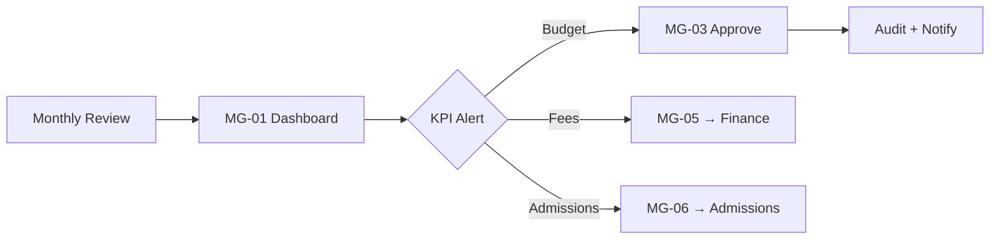
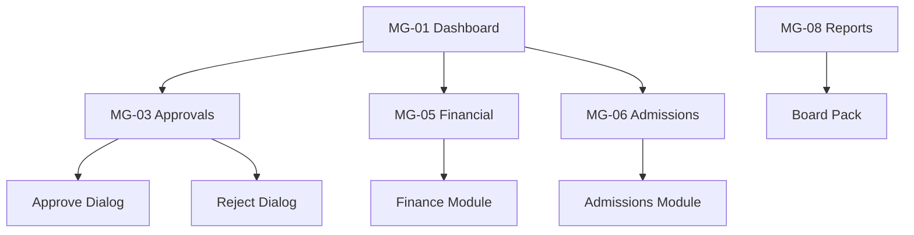

# Akshara ERP — Management Module Specification (Consolidated)

**Document ID:** `AKS-MG-SPEC-v1.0`  
**Module:** Management Portal  
**Screens:** MG-01 → MG-08  
**Platform:** Web primary (`1440×1024`) · Tablet (`834×1194`) · Mobile companion (`390×844`)  
**Source:** SRS Part 2–3, Part 6 §7, Part 8/12 · DesignSystem.md · Finance.md

---

## Table of Contents

1. [Module Overview](#1-module-overview)
2. [User Roles & Permissions](#2-user-roles--permissions)
3. [Navigation & Information Architecture](#3-navigation--information-architecture)
4. [Shared Design Foundation](#4-shared-design-foundation)
5. [Shared Shell Layout](#5-shared-shell-layout)
6. [Shared Components](#6-shared-components)
7. [MG-01 — Management Dashboard](#7-mg-01--management-dashboard)
8. [MG-02 — School Analytics](#8-mg-02--school-analytics)
9. [MG-03 — Approvals Center](#9-mg-03--approvals-center)
10. [MG-04 — School Performance](#10-mg-04--school-performance)
11. [MG-05 — Financial Overview](#11-mg-05--financial-overview)
12. [MG-06 — Admissions Overview](#12-mg-06--admissions-overview)
13. [MG-07 — Staff Overview](#13-mg-07--staff-overview)
14. [MG-08 — Reports Center](#14-mg-08--reports-center)
15. [Dialogs & Wizards](#15-dialogs--wizards)
16. [Cross-Module Links](#16-cross-module-links)
17. [Prototype Flow Map](#17-prototype-flow-map)
18. [Responsive Rules](#18-responsive-rules)
19. [Figma File Organization](#19-figma-file-organization)
20. [Build Checklist](#20-build-checklist)

---

## 1. Module Overview

### Purpose

Executive operational control for **School Management**: school-wide analytics, approval workflows (budget, expense, payroll), financial oversight, admissions progress, staff strength, and consolidated reporting (SRS Part 6 §7, Part 3).

### Screen Inventory

| ID | Screen | Primary Users | Priority |
|----|--------|---------------|----------|
| MG-01 | Management Dashboard | School Management | P0 |
| MG-02 | School Analytics | School Management, Director 👁 | P0 |
| MG-03 | Approvals Center | School Management | P0 |
| MG-04 | School Performance | School Management, Principal 👁 | P1 |
| MG-05 | Financial Overview | School Management | P0 |
| MG-06 | Admissions Overview | School Management | P1 |
| MG-07 | Staff Overview | School Management | P1 |
| MG-08 | Reports Center | School Management, Director 👁 | P1 |

**Total frames (desktop):** 8 primary + 6 dialogs = **14**

### Key User Flows



---

## 2. User Roles & Permissions

| Action | School Management | School Director | Principal | Finance Manager |
|--------|-------------------|-----------------|-----------|-----------------|
| View management portal | ✅ | ✅ | 👁 partial | ❌ |
| Approve budgets | 🔒 | 🔒 | ❌ | 👁 submit |
| Approve expenses | 🔒 | 🔒 | ❌ | ✅ submit |
| Approve payroll | 🔒 | 🔒 | ❌ | ✅ process |
| View P&L / revenue | ✅ | ✅ | ❌ | ✅ |
| Export reports | ✅ | ✅ | ❌ | 👁 |
| Modify school config | ✅ | ✅ | ❌ | ❌ |
| View student PII | 👁 | 👁 | ✅ | ❌ |

---

## 3. Navigation & Information Architecture

### Side Navigation

| # | Label | Icon | Screen |
|---|-------|------|--------|
| 1 | Dashboard | `dashboard` | MG-01 |
| 2 | School Analytics | `insights` | MG-02 |
| 3 | Approvals | `task_alt` | MG-03 |
| 4 | Performance | `school` | MG-04 |
| 5 | Financial Overview | `payments` | MG-05 |
| 6 | Admissions | `person_add` | MG-06 |
| 7 | Staff | `groups` | MG-07 |
| 8 | Reports | `assessment` | MG-08 |

### Screen Hierarchy

```
MG-01 Dashboard
├── MG-02 School Analytics
├── MG-03 Approvals Center
│   └── Dialog: Approve / Reject
├── MG-04 School Performance
├── MG-05 Financial Overview → Finance module deep links
├── MG-06 Admissions Overview → Admissions module
├── MG-07 Staff Overview → HR module
└── MG-08 Reports Center
```

---

## 4. Shared Design Foundation

> Reference **DesignSystem.md** for full tokens. Apply once per module.

| Breakpoint | Content width |
|------------|---------------|
| Desktop | `1136` |
| Tablet | `786` |
| Mobile | `358` |

**Module accent usage:** Revenue `success` · Overdue `error` · Pending approval `warning`

---

## 5. Shared Shell Layout

**Component:** `Shell/ManagementLayout`

```
MG-XX [1440×1024]
└── Shell/ManagementLayout
    ├── Nav/Rail-Management [256×Fill]
    └── Main/ContentColumn [Fill×Fill scroll]
        ├── Nav/AppBar [64]
        ├── Filter/AdminFilterBar [56]
        ├── [Screen body]
        └── Spacer/Bottom [32]
```

| App bar left | `Management / {Screen}` breadcrumb + page title |
| App bar right | AI Assist · Notifications · Avatar |

---

## 6. Shared Components

Uses global: `Data/KPI` · `Data/KPI/Compact` · `Data/Table` · `Data/ChartCard` · `Feedback/Banner` · `AI/InsightCard` · `AI/ApprovalRec`

**Management-specific:** `Approval/QueueRow` `88px` — icon · title · amount · AI badge · Approve/Reject

---

## 7. MG-01 — Management Dashboard

| Property | Value |
|----------|-------|
| **Frame** | `MG-01-ManagementDashboard-D` |
| **Nav active** | Dashboard |
| **Scroll height** | ~`1320` |

### Layout Structure

| # | Section | Size |
|---|---------|------|
| 1 | Filter bar | FY · Quarter · Export |
| 2 | KPI row | 6 × `176×120` |
| 3 | Charts | `624×320` revenue trend + `496×320` expense donut |
| 4 | Approvals queue | Top 5 items `1136×` |
| 5 | Split row | `560×280` admissions snapshot · `560×280` fee collection |
| 6 | AI executive summary | `1136×108` |

### KPI Definitions

| # | Label | Example | Accent |
|---|-------|---------|--------|
| 1 | Revenue (MTD) | ₹1.2Cr | success |
| 2 | Fee Collection % | 72% | warning |
| 3 | Expenses (MTD) | ₹46L | warning |
| 4 | Net Margin | 31.6% | success |
| 5 | New Admissions | 42 QTD | primary |
| 6 | Pending Approvals | 7 | error |

### Charts

| Chart | Type | Data |
|-------|------|------|
| Revenue trend | Line + area | 12 months fees + other income |
| Expense breakdown | Donut | Salaries, utilities, marketing, etc. |

### Prototype Links

| From | To |
|------|-----|
| KPI Approvals | MG-03 |
| KPI Fees | MG-05 |
| KPI Admissions | MG-06 |
| AI summary | Management AI dock |

---

## 8. MG-02 — School Analytics

| Property | Value |
|----------|-------|
| **Frame** | `MG-02-SchoolAnalytics-D` |
| **Purpose** | Enrollment, attendance, academic, operational KPIs |

### Layout Structure

| # | Section | Size |
|---|---------|------|
| 1 | Filter bar | FY · Campus · Compare period |
| 2 | KPI row | 4 × `272×88` | Students · Attendance % · Staff · Pass % |
| 3 | Charts row | `560×320` enrollment line · `560×320` attendance heatmap |
| 4 | Tabbed analytics | Academic · Operations · Growth |
| 5 | Data table | Class-wise summary |

### Table Columns

`Class 100 · Students 90 · Attendance 120 · Avg Marks 120 · Fee % 120 · Teachers 100 · Actions 80`

### Charts

Enrollment 24-month line · Attendance by class heatmap · Pass rate by subject bar

---

## 9. MG-03 — Approvals Center

| Property | Value |
|----------|-------|
| **Frame** | `MG-03-Approvals-D` |
| **Purpose** | Unified approval queue — finance, marketing, vendor (AR-014, AR-050) |

### Layout Structure

| # | Section | Size |
|---|---------|------|
| 1 | Filter bar | Type · Status · Date · Bulk approve |
| 2 | KPI row | 4 × `272×88` | Pending · Approved today · Rejected · Avg time |
| 3 | Tabs | See tab registry below |
| 4 | Approval table | Full list with AI recommendation column |
| 5 | Detail drawer | `480px` right — `Approval/DetailDialog` (DesignSystem §25) |

### Tab Registry

| Tab | Source module | Row types | Approver |
|-----|---------------|-----------|----------|
| **All** | All modules | Combined queue | Management |
| **Budget** | Finance FN-09 | Department budget requests | Management 🔒 |
| **Expense** | Finance FN-05 | Expense entries > threshold | Management 🔒 |
| **Payroll** | Finance FN-06 | Payroll run batches | Management 🔒 |
| **Vendor** | Finance FN-07 | Vendor payments > ₹50K | Management 🔒 |
| **Marketing** | Marketing MK-03 | Campaign budget requests (MK-D-08) | Management 🔒 |

> **Not in MG-03:** Teacher leave → Principal PR-06 · Admission → Principal PR-07 · Hostel leave → Hostel HO-06 (warden). MG has 👁 read-only link from MG-01 alerts only.

### Table Columns

`Type 100 · Title 240 · Requester 140 · Amount 120 · Date 110 · AI Rec 140 · Status 100 · Actions 186`

### Row Type Badges

`Budget` primary · `Expense` warning · `Payroll` error · `Vendor` on-surface-variant · `Marketing` primary-container

### Tab-Specific Columns (additions)

| Tab | Extra column |
|-----|--------------|
| Vendor | `Vendor 140` |
| Marketing | `Campaign 160` · `CPL 80` |
| Payroll | `Employees 80` · `Net amount 120` |

### AI Recommendation Chips

`Approve` success · `Review` warning · `Reject risk` error

### Post-Action Side Effects

| Action | System effect |
|--------|---------------|
| Approve | Audit event per `Audit.md` · NT `approval.result` to requester |
| Reject | Reason required · audit · notify requester |
| Bulk approve | MG-D-03 · max 20 per batch · critical audit |

### Prototype Links

| From | To |
|------|-----|
| Approve | Dialog `MG-D-01` ApproveConfirm |
| Reject | Dialog `MG-D-02` RejectReason |
| Vendor row | Finance FN-07 detail |
| Marketing row | Marketing MK-03 campaign drawer |
| Ask AI | AI panel with context |

---

## 10. MG-04 — School Performance

| Property | Value |
|----------|-------|
| **Frame** | `MG-04-Performance-D` |
| **Purpose** | Academic outcomes, discipline, teacher metrics |

### Layout Structure

| # | Section | Size |
|---|---------|------|
| 1 | Filter bar | Term · Class range |
| 2 | KPI row | Pass % · Distinction % · At-risk students · Teacher avg attendance |
| 3 | Radar chart | `480×360` | Academic · Attendance · Discipline · Parent engagement |
| 4 | Class performance table | Sortable |
| 5 | At-risk student cards | AI-generated list |

### Table Columns

`Class 100 · Students 80 · Pass % 100 · Avg 100 · Attendance 120 · Discipline 100 · Rank 80 · Actions 80`

---

## 11. MG-05 — Financial Overview

| Property | Value |
|----------|-------|
| **Frame** | `MG-05-FinancialOverview-D` |
| **Purpose** | **Executive tier** read-only finance — drills to Finance module (Reports.md §2) |

### Dashboard Tier Banner

`1136×40` info: **"Read-only aggregate · Drill to Finance module for transactions"**

> **Not FN-01:** MG-05 shows 6 drill cards + summary KPIs only. No record-cash, no edit. Source APIs: FN-11 embed per Reports.md AR-009.

### Layout Structure

| # | Section | Size |
|---|---------|------|
| 1 | Filter bar | FY · Quarter |
| 2 | Summary hero | `1136×128` | Revenue · Expenses · Net profit |
| 3 | KPI row | Collection · Pending · Payroll · Cash |
| 4 | Charts | P&L grouped bar `744×320` · Cash flow line `376×320` |
| 5 | Quick links grid | 6 cards → FN-02, FN-03, FN-05, FN-06, FN-09, FN-11 |

### Cross-module drill

Every card links to Finance portal with context filters preserved.

---

## 12. MG-06 — Admissions Overview

> **Embed rule (AR-010):** KPI strip + deep link to **AD-09** / Reports.md RPT-AD-001 — no duplicate funnel charts.


| Property | Value |
|----------|-------|
| **Frame** | `MG-06-AdmissionsOverview-D` |
| **Purpose** | Pipeline summary for management — drills to Admissions CRM |

### Layout Structure

| # | Section | Size |
|---|---------|------|
| 1 | Filter bar | Academic year · Counselor |
| 2 | KPI row | Leads · Conversion % · Confirmed · Joined |
| 3 | Funnel chart | `560×320` |
| 4 | Source performance | `560×320` donut |
| 5 | Recent conversions table |

### Table Columns

`Lead 180 · Class 80 · Source 100 · Counselor 120 · Stage 120 · Days 80 · Actions 80`

---

## 13. MG-07 — Staff Overview

| Property | Value |
|----------|-------|
| **Frame** | `MG-07-StaffOverview-D` |
| **Purpose** | Headcount, attendance, leave — drills to HR |

### Layout Structure

| # | Section | Size |
|---|---------|------|
| 1 | Filter bar | Department · Status |
| 2 | KPI row | Total staff · Present today · On leave · Open positions |
| 3 | Department chart | Stacked bar `1136×280` |
| 4 | Staff table | Department summary |

### Table Columns

`Department 160 · Headcount 100 · Teachers 100 · Admin 100 · Attendance 120 · Leave 100 · Open roles 100 · Actions 80`

---

## 14. MG-08 — Reports Center

| Property | Value |
|----------|-------|
| **Frame** | `MG-08-Reports-D` |
| **Purpose** | Executive report catalog and board pack export |

### Layout Structure

| # | Section | Size |
|---|---------|------|
| 1 | Filter bar | FY · Report category |
| 2 | Report grid | 3 × `360×160` cards |
| 3 | Preview pane | `1136×480` |
| 4 | Schedule toolbar | Email · PDF · CSV |

### Report Cards

Executive Summary · Financial Pack · Academic Summary · Admissions Report · Staff Report · Compliance Pack

---

## 15. Dialogs & Wizards

| ID | Name | Size | Used on |
|----|------|------|---------|
| MG-D-01 | ApproveConfirm | 400 | MG-03 |
| MG-D-02 | RejectReason | 400 | MG-03 |
| MG-D-03 | BulkApprove | 560 | MG-03 |
| MG-D-04 | ExportBoardPack | 560 | MG-08 |
| MG-D-05 | ScheduleReport | 560 | MG-08 |
| MG-D-06 | ComparePeriods | 720 | MG-02 |

---

## 16. Cross-Module Links

| From | To | Trigger |
|------|-----|---------|
| MG-05 | Finance FN-* | All financial drills |
| MG-06 | Admissions AD-* | Pipeline detail |
| MG-07 | HR HR-* | Employee detail |
| MG-03 payroll | Finance FN-06 | Approval item |
| MG-01 | Principal PR-01 | Academic alert 👁 |
| MG-08 | Reports.md RPT-MG-* | Catalog launcher |
| MG-08 | Director DR-09 | Board pack export |
| MG-03 approve | Audit.md | Platform audit events |
| Any | AI Copilot | Management-scoped |

---

## 17. Prototype Flow Map



---

## 18. Responsive Rules

| Element | Desktop | Tablet | Mobile |
|---------|---------|--------|--------|
| Nav | 256 | 72 | Drawer |
| KPI | 6-up | 3×2 | 2×2 |
| Approval drawer | 400 right | Bottom sheet | Fullscreen |
| Charts | Side-by-side | Stacked | Stacked |

---

## 19. Figma File Organization

```
📁 04 — Management Portal
├── Shell · Components
├── MG-01 → MG-08 [D/T/M]
├── Dialogs MG-D-01 → MG-D-06
└── Prototype Flows
```

**Frame naming:** `MG-{##}-{ScreenName}-{D|T|M}`

---

## 20. Build Checklist

| Step | Task |
|------|------|
| 1 | Shell + link Design System library |
| 2 | MG-01 dashboard (P0) |
| 3 | MG-03 approvals + dialogs |
| 4 | MG-05 financial overview + Finance links |
| 5 | MG-02, MG-04, MG-06, MG-07 |
| 6 | MG-08 reports |
| 7 | Tablet + mobile variants |
| 8 | Prototype full flow |
| 9 | AI approval recommendation variants |
| 10 | Accessibility pass |

---

**End of Management Module Specification v1.0**
