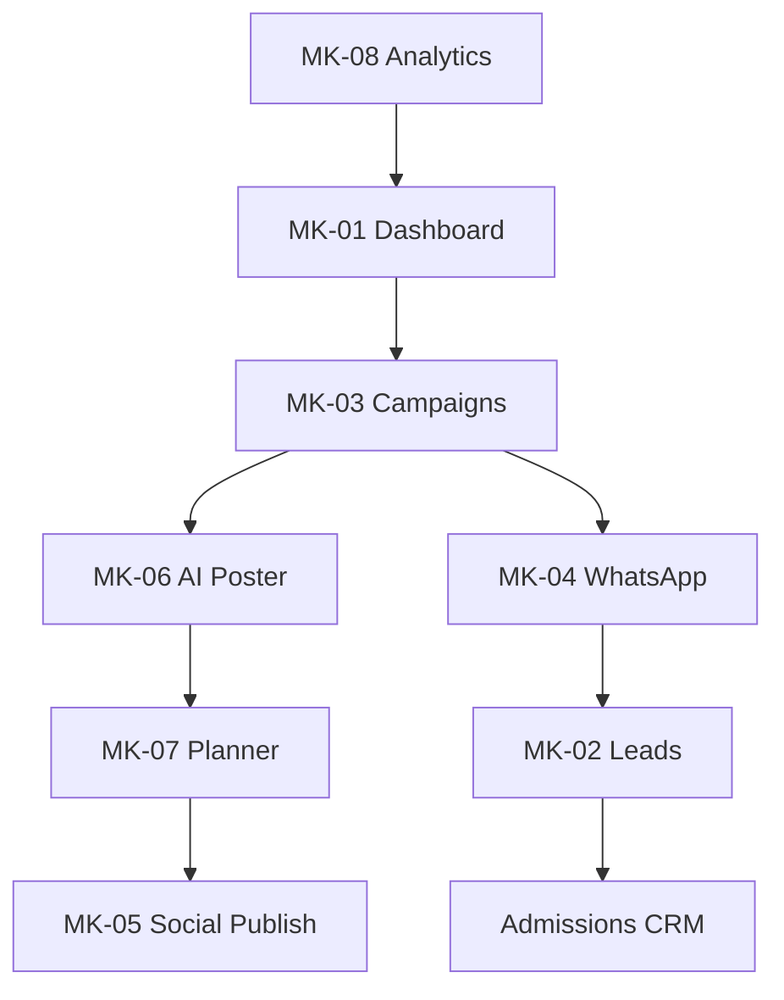

# Akshara ERP — Marketing Module Specification (Consolidated)

**Document ID:** `AKS-MK-SPEC-v1.0`  
**Module:** Marketing Dashboard  
**Screens:** MK-01 → MK-10  
**Platform:** Web primary · Tablet · Mobile companion  
**Source:** SRS Part 4 §2–6, Part 14 · DesignSystem.md · Finance.md

---

## Table of Contents

1. [Module Overview](#1-module-overview)
2. [User Roles & Permissions](#2-user-roles--permissions)
3. [Navigation & Information Architecture](#3-navigation--information-architecture)
4. [Shared Design Foundation](#4-shared-design-foundation)
5. [Shared Shell Layout](#5-shared-shell-layout)
6. [Shared Components](#6-shared-components)
7. [MK-01 — Marketing Dashboard](#7-mk-01--marketing-dashboard)
8. [MK-02 — Lead Management](#8-mk-02--lead-management)
9. [MK-03 — Campaigns](#9-mk-03--campaigns)
10. [MK-04 — WhatsApp Automation](#10-mk-04--whatsapp-automation)
11. [MK-05 — Social Media](#11-mk-05--social-media)
12. [MK-06 — AI Poster Studio](#12-mk-06--ai-poster-studio)
13. [MK-07 — Content Planner](#13-mk-07--content-planner)
14. [MK-08 — Conversion Analytics](#14-mk-08--conversion-analytics)
15. [MK-09 — Marketing Reports](#15-mk-09--marketing-reports)
16. [MK-10 — Referrals](#16-mk-10--referrals)
17. [Dialogs & Wizards](#17-dialogs--wizards)
18. [Cross-Module Links](#18-cross-module-links)
19. [Prototype Flow Map](#19-prototype-flow-map)
20. [Responsive Rules](#20-responsive-rules)
21. [Figma File Organization](#21-figma-file-organization)
22. [Build Checklist](#22-build-checklist)

---

## 1. Module Overview

### Purpose

School marketing operations: lead capture, multi-channel campaigns, WhatsApp automation, social media planning, AI poster/caption generation, conversion analytics, referrals (SRS Part 4 §2–6).

### Lead Ownership (AR-004)

| Role | Module | Scope |
|------|--------|-------|
| Marketing | **MK-02** | Acquisition: source, campaign, CPL, handoff to CRM |
| Admissions | **AD-02/04** | Conversion: pipeline, counselor, documents |

See cross-module contract in Admissions.md §1 and `Audit.md` event `lead.handoff`.

### Screen Inventory

| ID | Screen | Primary Users | Priority |
|----|--------|---------------|----------|
| MK-01 | Marketing Dashboard | Marketing Executive | P0 |
| MK-02 | Lead Management | Marketing Executive | P0 |
| MK-03 | Campaigns | Marketing Executive | P0 |
| MK-04 | WhatsApp Automation | Marketing Executive | P0 |
| MK-05 | Social Media | Marketing Executive | P1 |
| MK-06 | AI Poster Studio | Marketing Executive | P0 |
| MK-07 | Content Planner | Marketing Executive | P1 |
| MK-08 | Conversion Analytics | Marketing, Management 👁 | P0 |
| MK-09 | Marketing Reports | Marketing, Director 👁 | P1 |
| MK-10 | Referrals | Marketing Executive | P2 |

**Total frames:** 10 primary + 8 dialogs = **18**

### Channels

Facebook · Instagram · WhatsApp · YouTube · Google Ads · School Website

---

## 2. User Roles & Permissions

| Action | Marketing Exec | Management | Director | Admissions Counselor |
|--------|----------------|------------|----------|----------------------|
| Create campaigns | ✅ | 👁 | 🏢 ROI | ❌ |
| Manage leads | ✅ | 👁 | ❌ | ⚡ assigned |
| WhatsApp broadcasts | ✅ | 🔒 bulk | ❌ | ⚡ 1:1 |
| AI poster generate | ✅ | 👁 | ❌ | 👁 |
| Social publish | ✅ | 👁 | ❌ | ❌ |
| View ROI analytics | ✅ | ✅ | 🏢 | 👁 |
| Budget spend approve | 👁 | 🔒 | ❌ | ❌ |

---

## 3. Navigation & Information Architecture

### Side Navigation

| # | Label | Icon | Screen |
|---|-------|------|--------|
| 1 | Dashboard | `dashboard` | MK-01 |
| 2 | Leads | `contacts` | MK-02 |
| 3 | Campaigns | `campaign` | MK-03 |
| 4 | WhatsApp | `chat` | MK-04 |
| 5 | Social Media | `share` | MK-05 |
| 6 | AI Posters | `image` | MK-06 |
| 7 | Planner | `calendar_month` | MK-07 |
| 8 | Analytics | `analytics` | MK-08 |
| 9 | Reports | `assessment` | MK-09 |
| 10 | Referrals | `group_add` | MK-10 |

---

## 4. Shared Design Foundation

**Channel brand accents (icons only):** Facebook `#1877F2` · Instagram gradient · WhatsApp `#25D366` · Google Ads `#4285F4`

---

## 5. Shared Shell Layout

**Component:** `Shell/MarketingLayout`

---

## 6. Shared Components

| Component | Spec |
|-----------|------|
| `Marketing/CampaignCard` | `320×140` |
| `Marketing/ChannelIcon` | 24px branded |
| `Marketing/CPLChip` | Cost per lead display |
| `Marketing/WATemplatePreview` | Bubble mock |
| `Marketing/PosterCanvas` | Export sizes IG/FB/WA/Print |
| `Marketing/SocialPostCard` | Scheduled · Published · Draft |

---

## 7. MK-01 — Marketing Dashboard

| **Frame** | `MK-01-MarketingDashboard-D` |

### Layout Structure

| # | Section |
|---|---------|
| 1 | Filter bar | Period · Channel · **+ Create Campaign** |
| 2 | KPI row | 6 × `176×120` |
| 3 | Charts | Lead sources donut `496` · Campaign ROI bar `624` |
| 4 | Active campaigns row | Horizontal cards |
| 5 | Split | Social planner calendar `560` · WhatsApp queue `560` |
| 6 | AI insight card |

### KPI Definitions

| # | Label | Example |
|---|-------|---------|
| 1 | New Leads (7d) | 86 |
| 2 | Active Campaigns | 5 |
| 3 | Cost Per Lead | ₹142 |
| 4 | Conversion Rate | 12.4% |
| 5 | Referrals | 18 |
| 6 | Poster Requests | 7 pending |

---

## 8. MK-02 — Lead Management (Acquisition View)

| **Frame** | `MK-02-LeadManagement-D` |
| **Role** | Marketing acquisition lens — **not** CRM pipeline owner |

### Banner

`1136×40`: **"Acquisition view · Hand off to Admissions CRM for pipeline management"**

### Table Columns

`ID 90 · Name 180 · Phone 120 · Source 100 · Campaign 140 · CPL 80 · Score 70 · Handoff 100 · Created 100 · Actions 100`

> **Removed from MK-02:** `Stage`, `Counselor` — visible only in AD-02 after handoff.

### Lead Score

Hot `error` · Warm `warning` · Cold `primary`

### Row Actions

**Hand off to CRM** (primary) · Add to WhatsApp list · View in AD-02 (if handed off) · Edit acquisition fields only

### Handoff Dialog MK-D-10

Confirm handoff → assign default counselor · copy campaign attribution · audit `lead.handoff` · notify counselor (NT `admission.stage_changed`)

---

## 9. MK-03 — Campaigns

| **Frame** | `MK-03-Campaigns-D` |

### Layout Structure

| # | Section |
|---|---------|
| 1 | View toggle | List · Kanban (Draft/Active/Paused/Done) |
| 2 | Campaigns table |
| 3 | Detail drawer | Budget · spend · leads · creative assets |

### Table Columns

`Campaign 200 · Channel 100 · Budget 100 · Spent 100 · Leads 80 · CPL 80 · ROI 80 · Status 100 · Actions 100`

### Campaign Create Fields

Name · channel · budget · dates · audience · UTM · landing URL · creative link

---

## 10. MK-04 — WhatsApp Automation

| **Frame** | `MK-04-WhatsAppAutomation-D` |

### Layout Structure

| # | Section |
|---|---------|
| 1 | Tabs | Templates · Broadcasts · Scheduled · Logs |
| 2 | Template library table |
| 3 | Broadcast composer |
| 4 | Audience segment builder |
| 5 | Preview panel `AI/WAPreview` |

### Broadcast Composer Fields

Template · segment (leads/parents/alumni) · variables · media · schedule · bilingual preview

### Template Variables

`{parent_name}` · `{child_name}` · `{class}` · `{event_date}` · `{payment_link}`

---

## 11. MK-05 — Social Media

| **Frame** | `MK-05-SocialMedia-D` |

### Layout Structure

| # | Section |
|---|---------|
| 1 | Channel tabs | Facebook · Instagram · YouTube |
| 2 | Connected accounts status |
| 3 | Post feed table |
| 4 | Engagement metrics row |

### Post Table Columns

`Platform 80 · Content 280 · Scheduled 120 · Status 100 · Reach 80 · Clicks 80 · Actions 100`

---

## 12. MK-06 — AI Poster Studio

| **Frame** | `MK-06-AIPosterStudio-D` |

### Layout Structure

| # | Section |
|---|---------|
| 1 | Left panel | Type · language · style · event details |
| 2 | Center | Poster preview canvas |
| 3 | Right | Caption generator · export sizes |
| 4 | Toolbar | Regenerate · Edit text · Download |

### Poster Types

Admission · Achievement · Event · Festival · Exam · Results

### Export Formats

WhatsApp · Instagram · Facebook · Print A4

---

## 13. MK-07 — Content Planner

| **Frame** | `MK-07-ContentPlanner-D` |

### Layout Structure

| # | Section |
|---|---------|
| 1 | Month/week calendar grid |
| 2 | Drag-drop post slots |
| 3 | Reminder chips for overdue content |

---

## 14. MK-08 — Conversion Analytics

| **Frame** | `MK-08-ConversionAnalytics-D` |

> **Embed rule (AR-010):** Funnel data from **AD-09** API. MK-08 shows marketing-specific KPIs (CPL, ROI by campaign) + link to AD-09 — not a duplicate 7-stage funnel chart.

### Layout Structure

| # | Section |
|---|---------|
| 1 | Filter bar | Campaign · Source · Date |
| 2 | KPI row | Leads · CPL · Conversions · ROI |
| 3 | Charts | Funnel · CPL trend · Channel comparison · Admission yield |
| 4 | Cohort table |

### Charts

Lead→Admission funnel · CPL monthly line · Channel ROI grouped bar

---

## 15. MK-09 — Marketing Reports

> Launcher for **Reports.md** RPT-MK-001 – RPT-MK-004. See Reports.md §11.


### Report Cards

Campaign Performance · Lead Source Analysis · Social Engagement · WhatsApp Delivery · Referral Impact · Website Sync Stats

---

## 16. MK-10 — Referrals

| **Frame** | `MK-10-Referrals-D` |

### Table Columns

`Referrer 160 · Type 100 · Referred 160 · Status 120 · Admission result 120 · Reward 100 · Date 100 · Actions 80`

### Referrer Types

Parent · Student · Alumni · Staff

---

## 17. Dialogs & Wizards

| ID | Name | Size | Used on |
|----|------|------|---------|
| MK-D-01 | CreateCampaign | 560 | MK-03 |
| MK-D-02 | WhatsAppBroadcast | 720 | MK-04 |
| MK-D-03 | SocialSchedule | 560 | MK-05 |
| MK-D-04 | PosterExport | 400 | MK-06 |
| MK-D-05 | LeadImport | 560 | MK-02 |
| MK-D-06 | ReferralReward | 400 | MK-10 |
| MK-D-07 | CaptionGenerate | 560 | MK-06 |
| MK-D-08 | BudgetApproval | 400 | MK-03 → MG-03 Marketing tab |
| MK-D-10 | HandoffToCRM | 560 | MK-02 |

---

## 18. Cross-Module Links

| From | To | Trigger |
|------|-----|---------|
| MK-02 lead | Admissions AD-02 | MK-D-10 handoff (canonical) |
| MK-D-08 budget | Management MG-03 | Marketing tab approval |
| MK-D-02 broadcast | Audit.md | `marketing.whatsapp.send` |
| MK-08 analytics | Reports.md RPT-MK-* | Embed AD-09 for conversion |
| MK-08 conversion | Management MG-06 | Executive view |
| MK-08 ROI | Director DR-04 | Chain analytics |
| MK-06 poster | Website sync | Publish |
| MK-04 WhatsApp | Parent app | Deep links |
| Campaign spend | Finance FN-05 | Marketing expense |
| Any | AI Marketing Copilot | Content ideas |

---

## 19. Prototype Flow Map



---

## 20. Responsive Rules

| Element | Desktop | Tablet | Mobile |
|---------|---------|--------|--------|
| Campaign kanban | 4 columns | 2 | List |
| Poster studio | 3-panel | Stacked | Fullscreen steps |
| Calendar planner | Full month | Week view | Agenda list |
| WhatsApp composer | Split preview | Stacked | Fullscreen |

---

## 21. Figma File Organization

```
📁 04 — Marketing Dashboard
├── MK-01 → MK-10 [D/T/M]
├── MK-06 Poster Studio fullscreen
└── Dialogs MK-D-01 → MK-D-08
```

---

## 22. Build Checklist

| Step | Task |
|------|------|
| 1 | Campaign + channel components |
| 2 | MK-01 dashboard |
| 3 | MK-03 campaigns + MK-D-01 |
| 4 | MK-06 AI poster studio |
| 5 | MK-04 WhatsApp automation |
| 6 | MK-05 social + MK-07 planner |
| 7 | MK-02 leads + MK-08 analytics |
| 8 | MK-09 reports · MK-10 referrals |
| 9 | Admissions handoff prototype |
| 10 | AI caption/poster variants |

---

**End of Marketing Module Specification v1.0**
