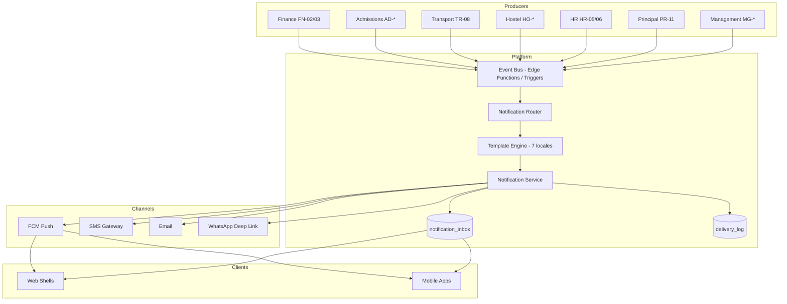
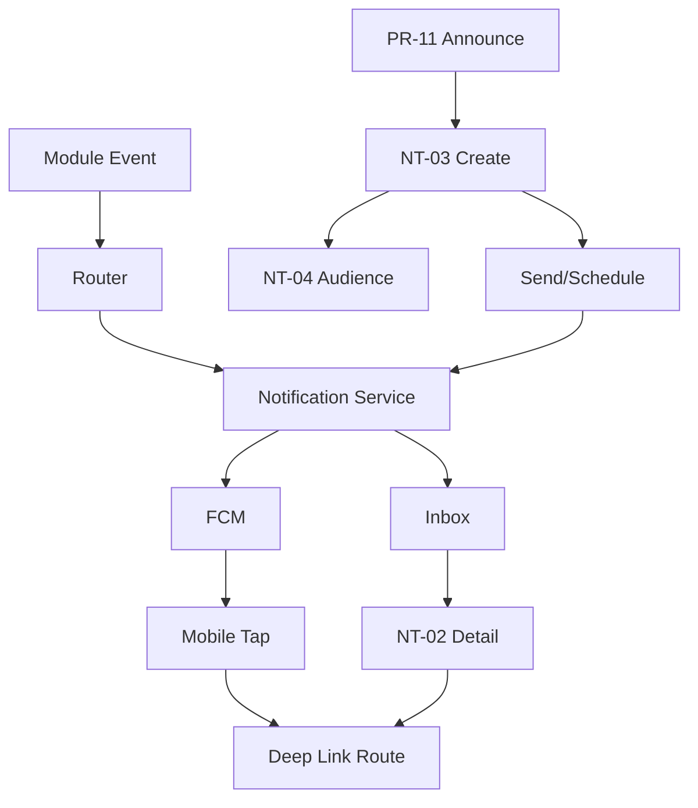

# Akshara ERP — Notifications Module Specification (Consolidated)

**Document ID:** `AKS-NT-SPEC-v1.0`  
**Module:** Unified Notifications Platform  
**Screens:** NT-01 → NT-06  
**Platform:** Cross-cutting — Web admin · Mobile apps · Tablet  
**Source:** SRS Part 2 §8 · Part 12 §18 · Part 15 §8 · Part 9 · TechnicalArchitecture.md §11 · ArchitectureReview AR-007

---

## Table of Contents

1. [Module Overview](#1-module-overview)
2. [User Roles & Permissions](#2-user-roles--permissions)
3. [Architecture Overview](#3-architecture-overview)
4. [Navigation & Information Architecture](#4-navigation--information-architecture)
5. [Shared Design Foundation](#5-shared-design-foundation)
6. [Notification Inbox (All Clients)](#6-notification-inbox-all-clients)
7. [NT-01 — Notification Inbox (Web)](#7-nt-01--notification-inbox-web)
8. [NT-02 — Notification Detail](#8-nt-02--notification-detail)
9. [NT-03 — Create Notification](#9-nt-03--create-notification)
10. [NT-04 — Audience Builder](#10-nt-04--audience-builder)
11. [NT-05 — Template Manager](#11-nt-05--template-manager)
12. [NT-06 — Delivery Analytics](#12-nt-06--delivery-analytics)
13. [Event Catalog](#13-event-catalog)
14. [Channel Specifications](#14-channel-specifications)
15. [Mobile Inbox Patterns](#15-mobile-inbox-patterns)
16. [Dialogs & Wizards](#16-dialogs--wizards)
17. [Cross-Module Links](#17-cross-module-links)
18. [Audit & Compliance](#18-audit--compliance)
19. [Prototype Flow Map](#19-prototype-flow-map)
20. [Responsive Rules](#20-responsive-rules)
21. [Figma File Organization](#21-figma-file-organization)
22. [Build Checklist](#22-build-checklist)

---

## 1. Module Overview

### Purpose

Unified notification platform for **event-driven alerts** (fee overdue, attendance absent, bus delay) and **user-composed announcements** (school-wide, class-specific). Delivers via Push (FCM), SMS, Email, and WhatsApp deep links across all Akshara ERP clients (SRS Part 12 §18, Part 15 §8).

### Scope

| In scope | Out of scope |
|----------|--------------|
| Inbox UI (all roles) | Payment processing |
| Create / schedule announcements | Marketing campaign creative (MK module) |
| Audience selection | Lead CRM messaging (AD/MK handoff) |
| Template management (7 languages) | Raw FCM infrastructure setup |
| Delivery analytics | Email marketing bulk (future) |
| Deep link routing | |

### Screen Inventory

| ID | Screen | Primary Users | Priority |
|----|--------|---------------|----------|
| NT-01 | Notification Inbox (Web) | All web roles | P0 |
| NT-02 | Notification Detail | All | P0 |
| NT-03 | Create Notification | Principal, Management, Finance, Counselor | P0 |
| NT-04 | Audience Builder | Principal, Management | P0 |
| NT-05 | Template Manager | Management, Akshara Admin | P1 |
| NT-06 | Delivery Analytics | Management, Director 👁 | P1 |

**Mobile inbox:** Not a separate screen ID — embedded in each app shell as **Notifications tab** (Parent P-*, Teacher T-*, etc.). Shares NT-02 detail pattern.

**Total frames (desktop admin):** 6 primary + 5 dialogs = **11**

### System vs User Notifications

| Type | Producer | Example |
|------|----------|---------|
| **System event** | Module Edge Function / DB trigger | Fee overdue, absent alert |
| **Workflow event** | Approval module | Leave approved, admission approved |
| **User composed** | NT-03 wizard | School holiday announcement |
| **Scheduled** | NT-03 + cron | Exam reminder 24h before |

---

## 2. User Roles & Permissions

| Action | Principal | Management | Finance | Counselor | Teacher | Parent | Student | Director |
|--------|-----------|------------|---------|-----------|---------|--------|---------|----------|
| View own inbox | ✅ | ✅ | ✅ | ✅ | ✅ | ✅ | ✅ | 🏢 platform only |
| Mark read / archive | ✅ | ✅ | ✅ | ✅ | ✅ | ✅ | ✅ | ✅ |
| Create announcement | ✅ | ✅ | ❌ | ❌ | ❌ | ❌ | ❌ | ❌ |
| Create class notice | ✅ | ✅ | ❌ | 👁 | ✅ class | ❌ | ❌ | ❌ |
| Send fee reminder | ❌ | ❌ | ✅ | ❌ | ❌ | ❌ | ❌ | ❌ |
| Send admission update | ❌ | 👁 | ❌ | ✅ | ❌ | ❌ | ❌ | ❌ |
| Manage templates | ❌ | ✅ | ❌ | ❌ | ❌ | ❌ | ❌ | ❌ |
| View delivery analytics | 👁 | ✅ | 👁 | ❌ | ❌ | ❌ | ❌ | 🏢 aggregate |
| Configure channels | ❌ | ✅ | ❌ | ❌ | ❌ | ❌ | ❌ | ❌ |

### Channel Restrictions

| Channel | Who can trigger |
|---------|-----------------|
| Push | All system events + authorized composers |
| SMS | Finance (fee), Admissions (status), Principal (urgent), Transport (delay) |
| Email | Management, Principal announcements |
| WhatsApp deep link | Marketing (campaign), Admissions (follow-up), Finance (reminder) — per module policy |

---

## 3. Architecture Overview

### Platform Flow



### Key Services (server-side — see TechnicalArchitecture.md)

| Service | Responsibility |
|---------|----------------|
| Event Bus | Normalize module events to `notification_events` |
| Notification Router | Map event type → channels + recipients + deep link |
| Template Engine | Resolve locale template + variable substitution |
| Notification Service | Dispatch channels + write inbox rows |
| FCM Service | Token management, batch push |

### Deep Link Contract

Every notification payload includes:

| Field | Required | Example |
|-------|----------|---------|
| `type` | ✅ | `fee.overdue` |
| `school_id` | ✅ | UUID |
| `route` | ✅ | `/parent/fees/pay` |
| `params` | optional | `{ "fee_id": "uuid" }` |
| `entity_id` | optional | Target record UUID |

Invalid or unauthorized deep links → fallback to NT-01/02 inbox.

---

## 4. Navigation & Information Architecture

### Web Admin Access

Notifications are **not a standalone portal** — accessed via:

| Entry point | Location |
|-------------|----------|
| AppBar bell icon | All admin shells (Finance, Management, Principal, etc.) |
| Badge count | Unread count from `notification_inbox` |
| Full inbox | NT-01 overlay or `/notifications` route |
| Create | PR-11, Management, or NT-03 direct |

### Mobile Access

| App | Nav position | Screen |
|-----|--------------|--------|
| Parent | Bottom nav tab 4 | Notifications list |
| Student | Bottom nav tab | Notifications list |
| Teacher | App bar / More | Notifications list |

### Screen Hierarchy

```
NT-01 Inbox (Web overlay or full page)
├── NT-02 Detail
│   └── Deep link action CTA
├── NT-03 Create Notification
│   ├── NT-04 Audience Builder (step)
│   └── Preview + Schedule
├── NT-05 Template Manager (Management settings)
└── NT-06 Delivery Analytics
```

---

## 5. Shared Design Foundation

> Reference **DesignSystem.md**. Notification UI uses global `Feedback/Banner` and inbox-specific components below.

| Token usage | |
|-------------|--|
| Unread row | `primary-container` left border 4px |
| Urgent | `error-container` badge |
| Info | `primary` icon |
| Success (payment received) | `success` icon |

### Inbox Row Component

`Notification/InboxRow` — `72px` height

| Element | Spec |
|---------|------|
| Icon | `40×40` circle by category |
| Title | `type/body/medium` semibold |
| Preview | `type/body/small` on-surface-variant, 1 line truncate |
| Timestamp | `type/label/small` right |
| Unread dot | `8×8` primary |

### Category Icons

| Category | Icon | Color |
|----------|------|-------|
| Fee | `payments` | warning |
| Attendance | `fact_check` | error |
| Academic | `school` | primary |
| Transport | `directions_bus` | primary |
| Hostel | `night_shelter` | primary |
| Approval | `task_alt` | success |
| Announcement | `campaign` | primary |
| System | `info` | on-surface-variant |

---

## 6. Notification Inbox (All Clients)

### Shared Behaviors

| Behavior | Rule |
|----------|------|
| Pagination | 20 per page, infinite scroll on mobile |
| Filter | All · Unread · By category |
| Mark read | On open detail OR swipe (mobile) |
| Archive | Swipe left (mobile) · row action (web) |
| Realtime | Supabase channel `school:{id}:notifications` |
| Empty state | Illustration + "You're all caught up" |

### Unread Badge

AppBar bell shows count `1–99` or `99+`. Cleared per-item on read, not on inbox open.

---

## 7. NT-01 — Notification Inbox (Web)

| Property | Value |
|----------|-------|
| **Frame** | `NT-01-Inbox-D` |
| **Presentation** | `480×640` slide-over panel OR full page `1136×Fill` |

### Layout Structure (Panel mode)

| # | Section | Size |
|---|---------|------|
| 1 | Header | Title · Mark all read · Settings link |
| 2 | Filter chips | All · Unread · Fees · Attendance · Academic · Other |
| 3 | Inbox list | Scrollable `Notification/InboxRow` |
| 4 | Footer | View all → full page NT-01 |

### Layout Structure (Full page)

| # | Section |
|---|---------|
| 1 | Filter bar | Category · Date range · Search |
| 2 | Split view | List `400px` · Detail `736px` (NT-02 embedded) |

---

## 8. NT-02 — Notification Detail

| Property | Value |
|----------|-------|
| **Frame** | `NT-02-Detail-D` / `NT-02-Detail-M` |

### Layout Structure

| # | Section |
|---|---------|
| 1 | Header | Category icon · title · timestamp |
| 2 | Body | Full message (localized) |
| 3 | Metadata | Sender · channels delivered · related entity link |
| 4 | Action CTA | Primary button → deep link route |
| 5 | Secondary | Archive · Mark unread |

### Example CTAs by Type

| Type | CTA label | Route |
|------|-----------|-------|
| `fee.overdue` | Pay Now | `/parent/fees/pay` |
| `attendance.absent` | View Attendance | `/parent/academics/attendance` |
| `leave.approved` | View Leave | `/teacher/leave` |
| `approval.pending` | Review | `/admin/management/approvals` |
| `announcement.school` | — (info only) | — |

---

## 9. NT-03 — Create Notification

| Property | Value |
|----------|-------|
| **Frame** | `NT-03-Create-D` |
| **Entry** | PR-11 · Management · AppBar "Compose" |

### Wizard Steps

| Step | Content |
|------|---------|
| 1 | Type: Announcement · Urgent · Class notice · Event |
| 2 | Audience → NT-04 |
| 3 | Compose: Title · Body · Attachments (optional) |
| 4 | Channels: Push · SMS · Email · WhatsApp |
| 5 | Translate: Auto-translate 7 languages · edit per locale |
| 6 | Preview: Per-channel preview cards |
| 7 | Schedule: Send now · Schedule datetime · Recurring (P2) |

### Validation Rules

| Rule | |
|------|--|
| Title max | 80 chars |
| Body max | 500 chars (SMS truncates with link) |
| Urgent SMS | Requires Management approval if > 500 recipients |
| Attachments | R2 signed URL · images/PDF only |

---

## 10. NT-04 — Audience Builder

| Property | Value |
|----------|-------|
| **Frame** | `NT-04-Audience-D` (wizard step or standalone) |

### Audience Presets

| Preset | Filter |
|--------|--------|
| Entire school | All active users in `school_id` |
| All parents | Role = parent |
| All teachers | Role = teacher |
| Class | class_id + section_id |
| Custom | Role + grade + department composite |

### Audience Summary Bar

`Estimated recipients: 1,247 · Push: 1,180 · SMS: 1,247 · Email: 890`

### Exclusions

Exclude specific classes · Exclude staff · Test send to self

---

## 11. NT-05 — Template Manager

| Property | Value |
|----------|-------|
| **Frame** | `NT-05-Templates-D` |
| **Users** | Management, Akshara Admin |

### Layout

| # | Section |
|---|---------|
| 1 | Template table | Event type · locales · last edited |
| 2 | Editor panel | Variable placeholders · per-locale tabs |
| 3 | Test send | Send sample to self |

### Standard Variables

`{{student_name}}` · `{{parent_name}}` · `{{class}}` · `{{amount}}` · `{{due_date}}` · `{{school_name}}` · `{{link}}`

### Locales

EN · TE · HI · TA · KN · ML · UR (SRS Part 18 §11)

---

## 12. NT-06 — Delivery Analytics

| Property | Value |
|----------|-------|
| **Frame** | `NT-06-Analytics-D` |

### KPI Row

Sent · Delivered · Opened · Clicked · Failed

### Charts

Delivery by channel donut · Open rate trend · Top notification types bar

### Table

`Notification 240 · Sent 80 · Delivered 80 · Opened 80 · Clicked 80 · Failed 60 · Date 110`

---

## 13. Event Catalog

### P0 System Events

| Event ID | Producer module | Channels | Recipients | Deep link |
|----------|-----------------|----------|------------|-----------|
| `fee.overdue` | Finance FN-03 | Push, SMS, WA | Parent | `/parent/fees/pay` |
| `fee.received` | Finance FN-02 | Push | Parent | `/parent/fees/receipt` |
| `attendance.absent` | Academic / Teacher | Push, SMS | Parent | `/parent/academics/attendance` |
| `homework.assigned` | Academic | Push | Student, Parent | `/student/homework/{id}` |
| `bus.delay` | Transport TR-08 | Push | Parent | `/parent/transport/live` |
| `hostel.missing` | Hostel HO-04 | Push, SMS | Parent, Warden | `/admin/hostel/attendance` |
| `hostel.leave.approved` | Hostel HO-D-08 | Push | Parent | Parent app gate pass |
| `hostel.leave.rejected` | Hostel HO-D-08 | Push | Parent | `/notifications/{id}` |
| `leave.approved` | HR / Principal PR-06 | Push | Teacher | `/teacher/leave` |
| `leave.rejected` | HR / Principal PR-06 | Push | Teacher | `/teacher/leave` |
| `admission.stage_changed` | Admissions AD-02 | Push | Counselor | `/admin/admissions/pipeline` |
| `admission.approved` | Principal PR-07 | Push, SMS | Parent | `/parent/onboarding` |
| `approval.pending` | Management MG-03 | Push | Management | `/admin/management/approvals` |
| `approval.result` | Management MG-03 | Push | Submitter | Context route |
| `payroll.processed` | Finance FN-06 | Push | Employee | `/teacher/profile/payslip` |
| `announcement.school` | Principal PR-11 | Push, Email | All school | `/notifications/{id}` |

### P1 Events

| Event ID | Producer | Channels | Recipients |
|----------|----------|----------|------------|
| `exam.schedule` | Academic | Push | Student, Parent |
| `ptm.reminder` | Principal PR-15 | Push, SMS | Parent |
| `document.required` | Admissions AD-07 | Push, WA | Parent |
| `transport.route_change` | Transport TR-03 | Push | Parent |
| `hostel.leave.approved` | Hostel | Push | Parent |
| `recruitment.interview` | HR HR-03 | Push, Email | Candidate |
| `marketing.campaign` | Marketing MK-05 | WA | Lead (external) |

---

## 14. Channel Specifications

### Push (FCM)

| Property | Value |
|----------|-------|
| Provider | Firebase Cloud Messaging |
| Token storage | `device_tokens` table per user/device |
| Foreground | In-app banner + inbox insert |
| Background | System tray → tap → deep link |
| Web | Service worker + VAPID key |
| Batch size | 500 per FCM multicast |

### SMS

| Property | Value |
|----------|-------|
| Provider | Configurable gateway (Edge Function) |
| Max length | 160 chars standard; link shortened |
| Opt-out | Respect `sms_opt_out` user flag |
| Cost tracking | Log per school in `delivery_log` |

### Email

| Property | Value |
|----------|-------|
| Provider | Transactional email service via Edge Function |
| Template | HTML + plain text fallback |
| Unsubscribe | Per notification category |

### WhatsApp Deep Link

| Property | Value |
|----------|-------|
| Pattern | `https://wa.me/{number}?text={encoded}` |
| Use | Admissions follow-up, fee reminder, marketing |
| Not | Official WhatsApp Business API (Phase 2) |

---

## 15. Mobile Inbox Patterns

### Parent App

| Element | Spec |
|---------|------|
| Screen | Full-page list below AppBar |
| Row height | `80px` with child context chip if multi-child |
| Swipe right | Mark read |
| Swipe left | Archive |
| Pull refresh | Sync inbox |

### Teacher App

Same pattern; categories filtered to teacher-relevant (leave, class, announcements).

### Student App

Homework · Exam · Announcement categories only.

---

## 16. Dialogs & Wizards

| ID | Name | Size | Used on |
|----|------|------|---------|
| NT-D-01 | TestSend | 400 | NT-03, NT-05 |
| NT-D-02 | ScheduleConfirm | 400 | NT-03 |
| NT-D-03 | ChannelOptOut | 400 | Settings |
| NT-D-04 | BulkMarkRead | 400 | NT-01 |
| NT-D-05 | UrgentApproval | 560 | NT-03 (>500 SMS) |

---

## 17. Cross-Module Links

| From | To | Trigger |
|------|-----|---------|
| FN-03 Send Reminder | NT event `fee.overdue` | Bulk defaulter reminder |
| FN-02 Payment success | NT event `fee.received` | Auto receipt notify |
| PR-11 Announcements | NT-03 | Create wizard |
| AD-04 WhatsApp | NT WA channel | Counselor follow-up |
| MK-05 Campaign | NT WA channel | Marketing blast |
| TR-08 Delay broadcast | NT event `bus.delay` | Coordinator action |
| MG-03 Approval | NT events `approval.*` | Workflow |
| PR-06/07 Approve | NT events `leave.*` / `admission.*` | Workflow |
| HO-04 Missing | NT event `hostel.missing` | Alert |
| All modules | FN-10 / platform audit | Delivery + compose logged |

### Producer Responsibility

Modules **emit events** — they do not implement channel dispatch. Each module spec documents which events it produces; this document owns delivery.

---

## 18. Audit & Compliance

| Action | Audit event |
|--------|-------------|
| Compose announcement | `notification.compose` |
| Send / schedule | `notification.send` |
| Bulk fee reminder | `notification.fee_reminder_bulk` |
| Template edit | `notification.template_update` |
| Failed delivery retry | `notification.retry` |

### Privacy Rules (SRS Part 5)

- Delivery logs store recipient **user_id**, not phone in audit export.
- Director sees aggregate delivery stats only (NT-06 🏢).
- Parent can disable non-critical SMS in preferences.

### User Preferences (`Settings`)

| Toggle | Default |
|--------|---------|
| Push notifications | On |
| SMS (fee/urgent) | On |
| Email announcements | On |
| Quiet hours | 22:00–07:00 (parent/teacher) |

---

## 19. Prototype Flow Map



---

## 20. Responsive Rules

| Element | Desktop | Tablet | Mobile |
|---------|---------|--------|--------|
| Inbox | Split list+detail | Panel overlay | Full page list |
| Create wizard | `720px` centered modal | Fullscreen | Fullscreen steps |
| Detail | Embedded in split | Bottom sheet | Push navigation |
| Analytics | Full dashboard | Stacked charts | KPI cards only |

---

## 21. Figma File Organization

```
📁 00 — Platform / Notifications
├── Components/InboxRow · CategoryIcon · ChannelBadge
├── NT-01 → NT-06 [D/T/M]
├── Mobile inbox variants (Parent · Teacher · Student)
├── Dialogs NT-D-01 → NT-D-05
└── Prototype: Event → Inbox → Deep link
```

**Frame naming:** `NT-{##}-{ScreenName}-{D|T|M}`

---

## 22. Build Checklist

| Step | Task |
|------|------|
| 1 | Inbox components in Design System |
| 2 | NT-01 web panel + full page |
| 3 | NT-02 detail + deep link CTAs |
| 4 | NT-03 create wizard (P0) |
| 5 | NT-04 audience builder |
| 6 | Mobile inbox for Parent shell (reference) |
| 7 | Category icons + filter chips |
| 8 | NT-05 templates (P1) |
| 9 | NT-06 analytics (P1) |
| 10 | Map all P0 events to producer modules |
| 11 | Prototype: fee reminder → parent pay flow |
| 12 | Accessibility: screen reader labels for inbox rows |

---

**End of Notifications Module Specification v1.0**
