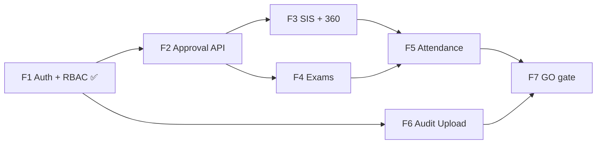
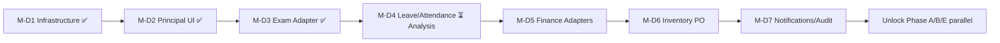

# Akshara ERP — Orchestrator Agent

**Version:** 1.9  
**Last updated:** 2026-06-18  
**Branch:** `feature/m15-theme` — F1 certified · F2 certified · F3 certified · F4 certified · **F5 certified**  
**Purpose:** Single source of truth for program execution order, agent ownership, gates, and stop rules.  
**Authority:** Supersedes ad-hoc session prompts. Every orchestrator session **must read this file first**, then the linked milestone docs.

**Companion docs (read order):**

1. `docs/ORCHESTRATOR_AGENT.md` ← **this file**
2. [`docs/BACKEND_ARCHITECTURE_DECISION.md`](./BACKEND_ARCHITECTURE_DECISION.md) — **LOCKED** backend stack
3. [`docs/PRODUCTION_BACKEND_ROADMAP.md`](./PRODUCTION_BACKEND_ROADMAP.md) — F1–F7 API program
4. [`docs/PRE_PRODUCTION_GAP_REPORT.md`](./PRE_PRODUCTION_GAP_REPORT.md) — Class A/B gaps
5. `docs/OPERATIONAL_GAP_MASTER_TRACKER.md` — 94-gap backlog
6. `docs/OPERATIONAL_REMEDIATION_ROADMAP.md` — client phase sequencing
7. [`GOVERNANCE_COMPLETION_REPORT.md`](./GOVERNANCE_COMPLETION_REPORT.md) — Phase D complete
8. Latest certification report (`PHASE_F3_FINAL_CERTIFICATION.md`, `PHASE_F2_FINAL_CERTIFICATION.md`, `PHASE_F1_FINAL_CERTIFICATION.md`, `FINAL_PILOT_CLOSURE_REPORT.md`)
9. `AGENTS.md` — Cursor agent A–G ownership
10. `docs/CURSOR_WORKFLOW.md` — session lifecycle
11. `docs/MULTI_AGENT_EXECUTION_PLAN.md` — parallel workstreams

---

## BACKEND ARCHITECTURE — LOCKED

**Status:** 🔒 **LOCKED** as of 2026-06-18  
**Decision record:** [`docs/BACKEND_ARCHITECTURE_DECISION.md`](./BACKEND_ARCHITECTURE_DECISION.md)  
**Rule:** No alternate primary backend (Firebase, greenfield Django/NestJS monolith) without Program Director re-baseline.

### Official platform

| Layer | Technology |
|-------|------------|
| **Platform** | **Supabase** (managed hosting) |
| **Database** | **PostgreSQL** 15+ with Row-Level Security (RLS) |
| **API surface** | **Edge Functions** (TypeScript/Deno) — REST matching Flutter `*_api_paths.dart` |
| **Auth** | Supabase Auth + custom OTP/JWT claims (`tenant_id`, `school_id`, `scope`, permissions) |
| **Tenant isolation** | `erp_tenant` role + `withTenantContext()` — RLS authoritative |
| **Future extraction** | NestJS microservices for AI, payments, heavy reporting — **not** day-one replacement |

### Rejected / deferred

| Option | Status |
|--------|--------|
| Firebase (primary) | ❌ Rejected |
| Django + PostgreSQL (greenfield) | ⏸ Deferred |
| NestJS + PostgreSQL (full monolith day one) | ⏸ Deferred — extract per-domain when Edge limits hit |

### Client contract (unchanged)

Flutter remains **REST/Dio + `ApiEnvelopeDto` + JWT + `X-Tenant-Id` / `X-School-Id`**. Backend work implements existing contracts; **no client paradigm shift**.

---

## Production Backend Program (F1–F7)

**Authority:** [`docs/PRODUCTION_BACKEND_ROADMAP.md`](./PRODUCTION_BACKEND_ROADMAP.md)  
**Goal:** Close Class A gaps for **first real school** with live backend (`ENABLE_API_MODE=true`).  
**Estimated calendar:** 10–14 weeks (2 backend engineers + Agent A client wiring).  
**Client UI / governance adapters:** unchanged — repository + API layer only.

### Phase map

| Phase | Name | Class A items | Duration | Readiness Δ | Cumulative (API path) |
|-------|------|---------------|----------|-------------|------------------------|
| **F1** | Auth + RBAC | A1, A10 | 1.5–2 wks | +8% | **~53%** ✅ |
| **F2** | Approval API | A2 | 3–4 wks | +12% | **~65%** ✅ |
| **F3** | SIS + Student 360 | A8 | 1.5–2 wks | +6% | **~71%** ✅ |
| **F4** | Exams | A3 | 3–4 wks | +10% | **~81%** ✅ |
| **F5** | Attendance | A4, A5 | 2.5–3.5 wks | +8% | **~89%** ✅ |
| **F6** | Audit / event upload | A9 | 1 wk | +3% | **~92%** |
| **F7** | Remaining production APIs | A6, A7 + API-mode gates | 2–3 wks | +8% | **~100%** Class A |

### Critical path (production backend)



**Serial dependencies:**

1. **F1** — blocks all authenticated API calls  
2. **F2** — unlocks exam publish, leave, attendance correction, finance concession approve paths  
3. **F4** — publish requires F2 approval resolution  
4. **F5** — attendance correction approve hooks F2  
5. **F7** — `ENABLE_API_MODE=true` + contract parity + Patrol on staging API

**Parallel opportunities (after F1):**

| Track | Parallel with |
|-------|---------------|
| F3 SIS/360 reads | F2 |
| F6 Audit upload | F4, F5 |
| F4 exam CRUD (pre-publish) | F2 |
| F7 finance/leave orchestration | F5 (both need F2) |

### Agent ownership (backend program)

| Phase | Primary | Supporting |
|-------|---------|------------|
| F1 | Backend (Supabase) + Agent **D** | Agent A (client auth repo), Agent E (integration tests) |
| F2 | Backend + Agent **A** | Agent D (RBAC), Agent E (approval integration) |
| F3–F7 | Backend + Agent **A** | Agent E (contracts), Agent G (release gate) |

### Real-school GO (backend)

All criteria in `PRODUCTION_BACKEND_ROADMAP.md` § Real-school GO — including F1–F7 complete, tenant isolation probes green, Patrol 9/9 on staging API, no `ApiNotConnectedException` on Class A paths.

---

## CORE PRODUCT ARCHITECTURE PRINCIPLE

**Permanent rule — does not change execution order or current milestone scope.**

Akshara ERP will evolve toward:

```
USER → ROLE → WORKSPACE → TASK
```

and **not**:

```
USER → MODULE → 100 MENUS
```

### Target model (examples)

| Persona | Workspaces (not module menus) |
|---------|-------------------------------|
| **Teacher** | Teacher Workspace · Class Teacher Workspace · Exam Coordinator Workspace · Inventory Workspace |
| **Principal** | Principal Workspace · Academic Workspace · Finance Workspace · Marketing Workspace |
| **Inventory Manager** | Inventory Workspace · Procurement Workspace |

### Purpose

| Goal | Outcome |
|------|---------|
| Reduce menu clutter | Fewer top-level nav items per persona |
| Improve mobile UX | Task-first shells on phone/tablet |
| Simplify testing | Scope tests per workspace, not per module tree |
| Simplify permissions | `ROLE + WORKSPACE` gates tasks; avoid module-wide `manage*` sprawl |
| Improve AI assistant context | Copilot receives workspace + task context, not full ERP module map |
| Role-focused dashboards | Dashboards answer “what must I do in this hat?” not “open Finance module” |

### Dynamic Role Assignment Engine

Akshara ERP must support **dynamic role assignment** — roles are not fixed at build time per user persona.

**Example — roles assignable to one Teacher:**

| Assigned role | Unlocks (when active) |
|---------------|----------------------|
| Teacher | Teacher Workspace, core teaching tasks |
| Class Teacher | Class Teacher Workspace, class-scoped tasks |
| Inventory Manager | Inventory Workspace, stock/procurement tasks |
| Exam Coordinator | Exam Coordinator Workspace, exam admin tasks |

**Who assigns roles:** Authorized users — Principal, HR, Management (tenant-scoped; audited).

**When a role is added or removed, the following must update automatically — without app release or code change:**

| # | Surface | Expected behavior |
|---|---------|-------------------|
| 1 | **Permissions** | RBAC sync from assigned roles; route guards and mutations reflect current role set |
| 2 | **Workspace visibility** | Workspaces appear/disappear based on active roles |
| 3 | **Dashboard content** | Widgets and KPIs scoped to assigned roles |
| 4 | **Navigation** | Shell nav generated from role → workspace map, not static module tree |
| 5 | **AI Copilot context** | Copilot receives current roles, workspaces, and tasks — not a hardcoded persona profile |

**Architecture model (target):**

```
User
  → Assigned Roles
    → Permissions
      → Workspaces
        → Tasks
          → Dashboards
```

**Anti-pattern (forbidden long-term):**

```
User → Fixed Dashboard → Hardcoded Menus
```

#### Implementation guidance

| Rule | Detail |
|------|--------|
| **No hardcoded role dashboards** | Future modules must not ship persona-specific dashboard layouts baked into code per role name |
| **Role-driven workspace generation** | Workspaces, nav entries, and dashboard slots are **derived** from the user’s current role assignment set |
| **Runtime assignment** | Role add/remove is a **data/configuration operation** (Principal/HR UI + backend sync), not a deploy |

**Example scenario:**

Principal assigns **Inventory Manager** role to a Science Teacher.

The teacher **immediately** gains (no app update):

- Inventory Workspace
- Inventory Tasks
- Inventory Notifications
- Inventory Approvals (where role permits)

Removing the role revokes the same surfaces automatically.

#### Future systems — must design around Dynamic Roles

The following systems **must** be built so role assignment drives visibility and capability — not static persona shells:

| System | Dynamic-role dependency |
|--------|-------------------------|
| Student 360 | Dossier entry and tab visibility per assigned roles |
| Teacher Workspace | Shell aggregates roles assigned to that user |
| Principal Workspace | Exec roles may combine Principal + Academic + Finance hats |
| Approval Center | Inbox filters and actions per role-derived permissions |
| Marketing Platform | Marketing Workspace only when Marketing role assigned |
| Inventory | Inventory / Procurement workspaces gated by role |
| Finance | Finance Workspace gated by finance-related roles |
| Transport | Transport Workspace gated by transport roles |
| HR | Staff role assignment is source of truth for ERP roles |
| AI Copilot | Context = assigned roles + active workspace + current task |

**Current program note:** Client governance (M-D1–M-D7) and pilot closure are complete on mock. **Active program is F1–F7 production backend.** New client work must remain **forward-compatible** with dynamic assignment and locked REST contracts.

### Design constraint for all new work

Whenever **new screens, dashboards, approvals, Student 360, Marketing, Finance, Inventory, or Teacher workflows** are built — including work **currently in progress** — implement against **today’s milestone deliverables**, but **design with future Role Workspace architecture in mind**:

- Group tasks by **workspace intent**, not by ERP module folder alone.
- Prefer **workspace-scoped routes and permissions** over adding another module root menu.
- Keep **approval types and inbox filters** workspace-aware (e.g. Academic vs Finance queue), not siloed per module screen.
- **Student 360** remains a **task surface inside workspaces** (SIS, teacher, principal), not a fourth navigation paradigm.
- **Do not block** current governance adapters (M-D4–M-D7) or phase delivery for a full workspace shell — **forward-compatible structure only**.

### Affected future milestones (architecture tag — execution order unchanged)

| Milestone / phase | Workspace lens | Tag |
|-------------------|----------------|-----|
| **M-D4** (active) | Leave/attendance approvals → Principal Workspace + Class Teacher Workspace tasks | `WORKSPACE-AWARE` |
| **M-D5** | Fee concession/refund approvals → Finance Workspace | `WORKSPACE-AWARE` |
| **M-D6** | PO maker-checker → Procurement Workspace | `WORKSPACE-AWARE` |
| **M-D7** | Notifications/audit → workspace-scoped requester context | `WORKSPACE-AWARE` |
| **Phase A** | Exam admin, marks, publish → Exam Coordinator + Teacher Workspaces | `WORKSPACE-TARGET` |
| **Phase B** | Attendance correction → Class Teacher Workspace | `WORKSPACE-TARGET` |
| **Phase C** | Student 360 → dossier task inside Principal / Class Teacher / SIS workspaces | `WORKSPACE-TARGET` |
| **Phase E** | Concessions, refunds, exports → Finance Workspace | `WORKSPACE-TARGET` |
| **Phase F** | Catalog, stock, PO → Inventory + Procurement Workspaces | `WORKSPACE-TARGET` |
| **Phase G** | Fleet, routes → Transport Workspace (ops persona) | `WORKSPACE-TARGET` |
| **Phase H** | MK-01–MK-10 → Marketing Workspace | `WORKSPACE-TARGET` |
| **Phase I** | Reports → workspace-scoped export entry points | `WORKSPACE-TARGET` |
| **Teacher mobile** | Homework, attendance, exams, leave → Teacher / Class Teacher Workspaces | `WORKSPACE-TARGET` |
| **Principal / Management** | Approval Center, notices, 360 drill-down → Principal Workspace | `WORKSPACE-TARGET` |

**Execution order remains:** M-D4 → M-D5 → M-D6 → M-D7 → Phase A → Phase B → Phase C → Phase E (Phases F/G/H/I per pilot scope). This principle informs **how** features are shaped, not **when** they ship.

---

## 1. Current project status

| Dimension | State |
|-----------|--------|
| **Program phase (client)** | Governance Foundation (Phase D) — **✅ COMPLETE** · Pilot closure **9/9** Patrol |
| **Program phase (backend)** | **Production Backend Program F1–F7** — **F1 ✅ · F2 ✅ certified** |
| **Backend architecture** | 🔒 **LOCKED** — Supabase + PostgreSQL + Edge Functions |
| **Visual / theme** | M15 + M15.5 UI complete (not operational scope) |
| **Operational audit** | Complete — 94 gaps tracked |
| **Mock / UAT pilot** | **GO** — `ENABLE_API_MODE=false`, 1949+ unit tests |
| **First real school (live API)** | **NO-GO** until F1–F7 Class A complete |
| **Parallel domain work (client)** | Phases A–E largely complete on mock; no new client modules without authorization |
| **Active mission** | **F5 ✅ certified** — await F6 authorization (Audit / event upload API) |

### What is working today (operational)

| Capability | Status | Notes |
|------------|--------|-------|
| Unified approval repository + service | ✅ M-D1 | `ApprovalCenterService`, mock + API stub |
| Principal Approval Center UI | ✅ M-D2 | Queue, filters, approve/reject, audit, RBAC |
| Exam results approval adapter | ✅ M-D3 | Submit → approve → publish; feature flag |
| Student / staff leave approval adapters | ✅ M-D4 | Parent + HR submit → inbox → status sync |
| Attendance correction adapter | ✅ M-D4 stub | Phase B plugs UI |
| Finance approval adapters | ✅ M-D5 | Fee structure, concession, refund |
| Inventory PO maker-checker | ✅ M-D6 | Storekeeper create; principal approve |
| Approval notifications + stale insight | ✅ M-D7 | In-app stub + workflow banner |
| Teacher attendance submit (mock) | ✅ Built | No correction / approval gate UI (Phase B) |
| Parent attendance calendar (mock) | ✅ Built | Disputes → WhatsApp only |
| Admissions approval | ✅ Built | Siloed — pattern reference only |

### Domain phase status (post Week 5)

| Track | Status |
|-------|--------|
| Phase A | **M-A5 complete** — exam publication governance certified |
| Phase B | Teacher + parent correction UI complete |
| Phase C | Student360 tabbed dossier · nav unified |
| Phase D (Governance) | **100%** certified |
| Phase E | Finance ops ~82% — CSV export + audit register |

| **Overall operational (mock)** | **~72%** (pilot target ~68% **met**) |
| **Production API path** | **~45%** — Class A workflows API-incomplete |

| **Milestone** | **Pilot closure — ✅ COMPLETE** |
| **Next** | **F1 Auth + RBAC** (production backend program) |

**Test gate:** `flutter test` **1949 passed**, 1 skipped · Patrol pilot closure **9/9**.

See [`WEEK5_EXECUTION_REPORT.md`](./WEEK5_EXECUTION_REPORT.md) for Pilot Readiness Assessment.

### Domain phase status (post Week 4) — superseded

| Track | Status |
|-------|--------|
| Phase A | M-A4 complete — **M-A5 next** |
| Phase B | Teacher + parent correction UI complete |
| Phase C | Nav wire complete — dossier domains pending |
| Phase D (Governance) | **100%** certified |
| Phase E | Finance ops ~80% — export service started |

| **Overall operational** | **~64%** (pilot target ~68%) |

| **Milestone** | **Week 4 — ✅ COMPLETE** |
| **Next** | Week 5: M-A5 · export Excel · Patrol FULL |

**Test gate:** `flutter test` **1925 passed**, 1 skipped.

---

## 2. Current readiness %

Readiness is tracked on **two baselines** — mock/UAT pilot vs production API path. Sources: `OPERATIONAL_REMEDIATION_ROADMAP.md`, `PRE_PRODUCTION_GAP_REPORT.md`, `PRODUCTION_BACKEND_ROADMAP.md`.

### Mock / UAT pilot (client-complete)

| Metric | Baseline (pre-Phase D) | **Current (2026-06-18)** | Pilot target |
|--------|------------------------|--------------------------|--------------|
| **Overall operational** | 42% | **~72%** | ~68% ✅ |
| **Management / Principal** | 50% | **~75%** | 75% |
| **Cross-module governance** | 30% | **~85%** | 70% |
| **Academics & Exams** | 25% | **~68%** | 65% |
| **Attendance** | 40% | **~62%** | 70% |
| **Student 360** | 35% | **~62%** | 70% |
| **Finance (ops)** | 70% | **~82%** | 85% |
| **Governance Foundation (Phase D)** | 0% | **100%** (7/7 milestones) | 100% |

### Production API path (real-school)

| Metric | **Current (2026-06-18)** | After F7 (target) |
|--------|--------------------------|-------------------|
| **Overall production API** | **~89%** | **≥92%** (Class A GO) |
| **Auth + RBAC (F1)** | **100%** client cert | 100% |
| **Approval API (F2)** | **100%** client + Edge | 100% |
| **SIS + Student 360 (F3)** | **100%** F3 scope | 100% |
| **Exams (F4)** | **100%** (server lifecycle + Flutter API gate) | 100% |
| **Attendance (F5)** | **100%** (corrections API + F2 apply hook + Flutter gate) | 100% |
| **Audit upload (F6)** | ~50% (queue only) | 100% |
| **Leave + finance orchestration (F7)** | ~35% partial | 100% |

**How mock overall (~72%) is derived:**

- Governance Foundation complete (M-D1–M-D7) + 8 approval adapters.
- Pilot closure Patrol **9/9** · exam persistence restart-safe on device.
- P0 pilot gaps closed per `FINAL_PILOT_CLOSURE_REPORT.md`.

**How production API (~45%) is derived:**

- `ENABLE_API_MODE=false` default · 0 of 8 pilot-critical workflows API-complete end-to-end.
- Governance side effects in in-memory stores · exam data device-local without server sync.

**Test gate:** `flutter analyze` 0 errors · `flutter test` **1949 passed**, 1 skipped.

---

## 3. Completed milestones

| Milestone | Name | Commit / cert | Verdict |
|-----------|------|---------------|---------|
| **M15** | Theme modernization | Prior releases | ✅ Complete |
| **M15.5** | UI polish / glass system | Prior releases | ✅ Complete |
| **M-D1** | Approval domain + repository + service | Certified | ✅ [`PHASE_D_M1_FINAL_CERTIFICATION.md`](./PHASE_D_M1_FINAL_CERTIFICATION.md) |
| **M-D2** | Principal Approval Center UI | Certified | ✅ [`PHASE_D_M2_FINAL_CERTIFICATION.md`](./PHASE_D_M2_FINAL_CERTIFICATION.md) |
| **M-D3** | Exam Results Approval Adapter | `44ba25b` | ✅ [`PHASE_D_M3_FINAL_CERTIFICATION.md`](./PHASE_D_M3_FINAL_CERTIFICATION.md) |
| **M-D4** | Leave & Attendance Approval Adapters | This release | ✅ [`PHASE_D_M4_FINAL_CERTIFICATION.md`](./PHASE_D_M4_FINAL_CERTIFICATION.md) |
| **M-D5** | Finance Approval Adapters | This release | ✅ [`PHASE_D_M5_FINAL_CERTIFICATION.md`](./PHASE_D_M5_FINAL_CERTIFICATION.md) |
| **M-D6** | Inventory PO Maker-Checker | This release | ✅ [`PHASE_D_M6_FINAL_CERTIFICATION.md`](./PHASE_D_M6_FINAL_CERTIFICATION.md) |
| **M-D7** | Notifications & Audit Hardening | This release | ✅ [`PHASE_D_M7_FINAL_CERTIFICATION.md`](./PHASE_D_M7_FINAL_CERTIFICATION.md) |

**Governance Foundation completion report:** [`GOVERNANCE_COMPLETION_REPORT.md`](./GOVERNANCE_COMPLETION_REPORT.md)

### M-D3 gaps partially closed

| Gap | Closure |
|-----|---------|
| APR-002 | Exam publish approval chain (mock) |
| P0-EXAM-003 | Governance half — direct publish blocked when `EXAM_APPROVAL_REQUIRED=true` |
| P1-EXAM-006 | Exam permissions (`manageExamMarks`, `submitExamResults`, `approveExamResults`, `publishExamResults`) |
| P1-PRIN-001 | Unified inbox (partial — exam type has side effects) |
| DISC-007 | Partial — exam path unified; leave/attendance/finance still siloed |

---

## 4. Active milestone

| Field | Value |
|-------|-------|
| **Milestone** | **F1 — Auth + RBAC** — **✅ CERTIFIED** |
| **Status** | See [`PHASE_F1_FINAL_CERTIFICATION.md`](./PHASE_F1_FINAL_CERTIFICATION.md) |
| **Readiness delta** | Production API **~65% → ~71%** (F3 SIS + Student 360 API) |
| **Next authorized step** | **F4 — Exams API** (await Program Director authorization) |
| **Do not auto-start** | F4–F7 without explicit authorization |

### Previously active: F1 implementation (now complete)

| Field | Value |
|-------|-------|
| **Milestone** | Pilot closure + Governance Foundation — **✅ COMPLETE** |
| **Pilot verdict** | **Mock/UAT GO (~72%)** |
| **Evidence** | [`FINAL_PILOT_CLOSURE_REPORT.md`](./FINAL_PILOT_CLOSURE_REPORT.md) · Patrol 9/9 |
| **Client changes** | Maintenance only until F1 staging auth ready for integration |

### Previously active: Week 5 / Week 4 (now complete)

| Field | Value |
|-------|-------|
| **Milestone** | **Week 4 parallel delivery — ✅ COMPLETE** |
| **Status** | See [`WEEK4_EXECUTION_REPORT.md`](./WEEK4_EXECUTION_REPORT.md) |
| **Next authorized step** | Week 5: M-A5 · Excel export · Patrol FULL |

### Previously active: M-D4 (now complete)

See [`M-D4_ANALYSIS.md`](./M-D4_ANALYSIS.md) · [`M-D4_EXECUTION_PLAN.md`](./M-D4_EXECUTION_PLAN.md) for historical scope.

---

## 5. Governance roadmap (Phase D)

Phase D must reach **M-D7 certified** before parallel domain phases unlock.



| Milestone | Week (plan) | Gaps / APR | Status |
|-----------|-------------|------------|--------|
| **M-D1** | 1 | P1-PRIN-001, DISC-007 | ✅ Certified |
| **M-D2** | 1–2 | P1-PRIN-001, WF-011, WF-014 | ✅ Certified |
| **M-D3** | 2–3 | APR-002, P0-EXAM-003 (partial) | ✅ Certified @ `44ba25b` |
| **M-D4** | 3 | APR-003, APR-004, APR-005, P1-PRIN-002/003 | 📋 Analysis only |
| **M-D5** | 3–4 | APR-006, APR-012, P0-FIN-001 (half), RBAC-009 | ⛔ Not started |
| **M-D6** | 4 | P0-INV-003, P0-INV-004, APR-008, RBAC-006/007 | ⛔ Not started |
| **M-D7** | 4–5 | Audit hardening, requester notifications, APR-014 stub | ⛔ Not started |

**After Phase D complete:** Management 75% · Cross-module governance 70% · enables quality closure of P0 workflows in A, B, E, F.

### Post-governance domain roadmap (locked until M-D7)

| Phase | Name | P0 blockers | Unlock after |
|-------|------|-------------|--------------|
| **A** | Exams & Academic Governance | 4 | M-D7 ✅ (+ M-D3 exam adapter) |
| **B** | Attendance Governance | 2 | M-D7 ✅ (+ M-D4 attendance adapter stub) |
| **C** | Student 360 Unification | 2 | Phase A marks data (partial nav wire earlier) |
| **E** | Finance Completion | 3 | M-D7 ✅ (+ M-D5 finance adapters) |
| **F** | Inventory | 4 | M-D6 ✅ · optional for pilot |
| **G** | Transport | 2 | Optional for pilot |
| **H** | Marketing | 1 | **Deferred** — not on pilot path |
| **I** | Reports & Compliance | 0 | Phase E exports stable |

Full sequencing: `OPERATIONAL_REMEDIATION_ROADMAP.md` §Execution order.

---

## 6. Agent ownership

Two layers apply: **Cursor agents (A–G)** from `AGENTS.md` and **workstream agents** from `MULTI_AGENT_EXECUTION_PLAN.md`. The orchestrator assigns by milestone type.

### 6.1 Cursor agents (A–G) — file ownership

| Agent | Role | Primary paths |
|-------|------|---------------|
| **A** | Backend / API | `lib/core/repositories/`, `test/contracts/`, `test/integration/` |
| **B** | ERP features | `lib/features/{admissions,finance,sis,management,...}/`, ERP routes |
| **C** | Mobile | `lib/features/{parent,teacher,student}/`, mobile routes, `test/golden/` |
| **D** | Security | `lib/core/auth/`, `lib/core/security/`, route guards, security tests |
| **E** | QA | `test/` (all), test scripts |
| **F** | Documentation | `docs/`, `AGENTS.md`, `README.md` |
| **G** | Release | `pubspec.yaml` version, gates, tags, governance docs |

### 6.2 Workstream agents — program phases

| Workstream | Agent | Phases | Owns |
|------------|-------|--------|------|
| **WS1 Governance** | Governance Agent | D (M-D3–M-D7) | `lib/core/approvals/`, adapters, `management/approval/`, additive RBAC |
| **WS2 Academics** | Academic Agent | A | Exam admin, teacher exams, subject catalog |
| **WS3 Student Ops** | Student Operations Agent | B, C | Attendance correction UI, Student 360 nav |
| **WS4 Finance** | Finance Agent | E | Finance features, exports |
| **WS5 Operations** | Operations Agent | F, G | Inventory, transport, hostel |
| **WS6 Growth** | Growth Agent | H | Marketing — **deferred** |
| **WS7 Compliance** | Compliance Agent | I | Report exports — late track |

### 6.3 Milestone → agent assignment (Governance track)

| Milestone | Primary | Supporting |
|-----------|---------|------------|
| M-D1 – M-D2 | Governance (B + D) | E, F, G |
| M-D3 – M-D7 adapters | Governance (A pattern for adapters) | D (permissions), E (tests), F (docs), G (gate) |
| M-D4 | Governance | C (parent/teacher wire), D (RBAC), E |
| Phase A (when unlocked) | Academic Agent | Governance (approve hooks only), E |
| Phase B (when unlocked) | Student Ops Agent | Governance (attendance adapter consume), E |

### 6.4 Shared artifacts — merge owner

| Artifact | Owner | Rule |
|----------|-------|------|
| `permissions.dart`, `role_permissions.dart` | Agent **D** / Governance | Additive only; domain agents propose, Governance merges |
| `mutation_permission_registry.dart` | Governance | Batch weekly |
| `approval_permissions.dart`, adapters | Governance | Sole writer during Phase D |
| `repository_providers.dart` | First registrant + Governance review | One provider block per PR |
| `route_guards.dart`, `app_router.dart` | Governance + domain | Domain PR; Governance resolves conflicts |
| `ApprovalCenterService.submit()` | Governance | Modules call service — never duplicate queue logic |

---

## 7. Dependency rules

### 7.1 Hard dependencies (must not violate)

```
M-D1 → M-D2 → M-D3 → M-D4 → M-D5 → M-D6 → M-D7
                              ↓
                    Governance Foundation COMPLETE
                              ↓
         ┌────────────────────┼────────────────────┐
         ↓                    ↓                    ↓
     Phase A              Phase B              Phase E
   (needs M-D3)         (needs M-D4 stub)    (needs M-D5)
```

| Rule ID | Rule |
|---------|------|
| **DEP-01** | No Phase A implementation until **M-D7 certified** (Governance Foundation complete). |
| **DEP-02** | No Phase B attendance correction UI until **M-D4 adapter contract** exists. |
| **DEP-03** | No finance concession/refund approval UX until **M-D5** adapters exist. |
| **DEP-04** | No PO maker-checker until **M-D6** complete. |
| **DEP-05** | Domain agents **submit** approvals via `ApprovalCenterService`; they do **not** implement parallel queue logic. |
| **DEP-06** | Approve/reject **side effects** live in adapters (`ApprovalAdapterRegistry`), not in module silos. |
| **DEP-07** | Phase C Student 360 needs Phase A marks data for full dossier; nav wire-only may precede with governance approval. |
| **DEP-08** | Marketing (Phase H), Inventory (F), Transport (G) are **optional** for day-school pilot — do not block governance. |

### 7.2 Soft dependencies (coordinate, do not block M-D4)

| Consumer | Provider | Handshake |
|----------|----------|-----------|
| Phase A M-A5 | M-D3 | Exam submit payload + approve hook — **done** |
| Phase B | M-D4 | Attendance correction payload schema — **defined in M-D4 analysis §5.3** |
| Phase E | M-D5 | Fee concession / refund approval types |

### 7.3 Foundation systems status

| ID | System | Status |
|----|--------|--------|
| F-01 | ApprovalCenterService | ✅ M-D1 |
| F-02 | Principal Approval Center UI | ✅ M-D2 |
| F-03 | Module approval adapters | 🟡 1/5+ (exam only) |
| F-04 | ExamAdministrationRepository | ⛔ Phase A |
| F-05 | Academic master catalog | ⛔ Phase A |
| F-06 | Attendance correction entity | ⛔ Phase B |
| F-07 | Student 360 navigation | ⛔ Phase C |
| F-08 | Report export service | ⛔ Phase E |
| F-09 | RBAC registry completeness | 🟡 Partial (exam + M-D3) |

---

## 8. Unlock conditions

Parallel development and downstream phases unlock only when conditions below are met.

| Unlock | Condition | Verification |
|--------|-----------|--------------|
| **F1 backend start** | Backend architecture LOCKED + Program Director authorization | `BACKEND_ARCHITECTURE_DECISION.md` |
| **F2 start** | F1 certified on staging | Auth integration tests + permission sync |
| **F3–F7 start** | Prior F-phase certified | Per `PRODUCTION_BACKEND_ROADMAP.md` dependencies |
| **Real-school go-live** | F1–F7 complete + Class A gates | `PRODUCTION_BACKEND_ROADMAP.md` § GO criteria |

**Currently unlocked:** None (F3 complete — await F4 authorization).  
**Currently locked:** F4–F7 · new client feature modules · Marketing · Transport GPS.

---

## 9. Certification requirements

Every governance milestone (M-D*) follows the same certification pattern established in M-D1–M-D3.

### 9.1 Pre-certification gates (mandatory)

| # | Gate | Command / evidence |
|---|------|-------------------|
| 1 | Static analysis | `flutter analyze` → **0 errors** |
| 2 | Full test suite | `flutter test` → **all pass** (note skip count) |
| 3 | Milestone test gate | Per execution plan (e.g. M-D3: 64 approval tests) |
| 4 | Regression | Prior milestone gate still green |
| 5 | Scope audit | No files outside milestone ownership |
| 6 | RBAC | Permission mapping tests updated |

### 9.2 Deliverables per milestone

| Deliverable | Path pattern |
|-------------|--------------|
| Analysis (before impl) | `docs/M-D{N}_ANALYSIS.md` |
| Execution plan | `docs/M-D{N}_EXECUTION_PLAN.md` or section in `PHASE_D_EXECUTION_PLAN.md` |
| Final certification | `docs/PHASE_D_M{N}_FINAL_CERTIFICATION.md` |
| Push report | `docs/M-D{N}_PUSH_REPORT.md` |
| Patrol stub | `qa/journeys/workflow_*_approval.yaml` |

### 9.3 Certification verdict criteria (M-D4 example)

- [ ] Parent submit creates `studentLeave` pending item
- [ ] HR create creates `staffLeave` pending item
- [ ] Principal approve/reject updates domain records (leave status / mock attendance)
- [ ] `attendanceCorrection` adapter registered with mock side effects
- [ ] Dedicated permissions replace coarse `manageManagement` for wired types
- [ ] M-D2/M-D3 approval gate ≥64 tests pass
- [ ] `flutter analyze` 0 errors · full suite green

### 9.4 Who certifies

| Role | Responsibility |
|------|----------------|
| **Agent E** | Test evidence, gate commands |
| **Agent G** | Final gate run, version coordination |
| **Agent F** | Certification + push report documents |
| **Orchestrator** | Verdict: PASS / FAIL / BLOCKED |

Human QA is **not required** when automated certification checklist is fully green (M-D2/M-D3 precedent).

---

## 10. Commit requirements

### 10.1 When to commit

- Commit **only when explicitly requested** by Program Director or at milestone certification handoff (M-D* push step).
- Never commit analysis-only docs unless the session goal includes doc delivery + explicit commit instruction.

### 10.2 Pre-commit checklist

1. `flutter analyze` — 0 errors  
2. `flutter test` — all pass  
3. Milestone gate — pass  
4. No secrets (`.env`, credentials)  
5. No `test/golden/failures/*` artifacts  
6. Stage only milestone-scoped files  

### 10.3 Commit message format

```
Phase D M{N} — {Short milestone name}

{Why: 1–2 sentences on governance/workflow outcome.}
```

Example: `Phase D M-D3 — Exam Results Approval Adapter`

### 10.4 Push protocol

1. Commit milestone on `feature/m15-theme` (or assigned release branch)  
2. `git push -u origin HEAD`  
3. Create `docs/M-D{N}_PUSH_REPORT.md` with commit hash, push result, test summary  
4. Report to Program Director — **STOP** unless next milestone authorized  

### 10.5 Prohibited git operations

- No force-push to `main` / `master`  
- No `--no-verify` unless explicitly requested  
- No amend of pushed commits unless user explicitly requests  
- Never update git config  

---

## 11. Stop conditions

Orchestrator and sub-agents **stop immediately** when any condition applies.

| ID | Condition | Action |
|----|-----------|--------|
| **STOP-01** | Milestone certification complete and push report delivered | STOP — await next authorization |
| **STOP-02** | Analysis-only session scope (e.g. M-D4 analysis) | STOP after docs — **no code, no commit** |
| **STOP-03** | Unauthorized scope detected (Phase A, Marketing, Inventory, Student360, multi-agent) | STOP — report scope violation |
| **STOP-04** | `flutter analyze` or `flutter test` fails after fix attempt | STOP — BLOCKED report to Agent G |
| **STOP-05** | P0 blocker — staging Supabase unavailable for F-phase cert | STOP — mark BLOCKED |
| **STOP-06** | Human decision required — security regression, tenant breach, data loss, ambiguous spec | STOP — escalate |
| **STOP-07** | Cross-agent file conflict on shared infrastructure | STOP — sequential merge required |
| **STOP-08** | Execution depth reached (default 3 milestones per `CURSOR_WORKFLOW.md`) | STOP — combined summary |

### Default session scope guardrails

**Authorized now:**

- Documentation updates for F1 certification  
- Maintenance fixes on F1–F2 paths only (no F3 scope)  

**Do NOT start unless explicitly authorized:**

- **F3–F7**  

---

## 12. Parallel execution rules

Parallel work is **disabled** until Governance Foundation (M-D7) is certified.

### 12.1 Current mode: **SERIAL BACKEND (F1–F7)**

```
Orchestrator → F1 Auth+RBAC → certify → F2 Approval → … → F7 GO gate
```

One F-phase in flight. Client feature coding frozen unless F-phase requires Agent A repository wiring.

### 12.2 Future mode: **CONTROLLED PARALLEL** (after M-D7)

From `MULTI_AGENT_EXECUTION_PLAN.md`:

| Rule | Detail |
|------|--------|
| **Max parallel agents** | 4–5 workstreams |
| **File lock** | No overlapping writes — use manifest paths |
| **Shared infra** | Governance Agent merge gate on `permissions.dart`, routers, adapters |
| **Validation order** | `flutter analyze` → unit tests → milestone gate → (Patrol if required) → commit |
| **Patrol** | Full regression only on Agent G gate or program end — not per sub-task |
| **Coordinator** | Parent orchestrator runs loop; subagents edit manifest-listed files only |
| **Handoff** | `complete --summary` for cross-agent waits |

### 12.3 Parallel allowed combinations (post M-D7)

| Track 1 | Track 2 | Track 3 | Notes |
|---------|---------|---------|-------|
| Phase A (Academic) | Phase B (Attendance) | — | After M-D4 stub |
| Phase A | Phase E (Finance) | — | After M-D5 |
| Phase C (360 wire) | Phase A | — | Nav-only subset |

**Never parallelize:** Two agents editing same adapter file · Governance + domain both changing `approval_permissions.dart` without merge gate.

### 12.4 Emulator / Patrol policy

Per `.cursor/rules/emulator-validation-workflow.mdc`:

1. Reuse existing emulator when available  
2. Unit/widget tests **before** Patrol  
3. Emulator boot non-blocking  
4. Broader Patrol only on infra changes or release gate  

---

## 13. Orchestrator session playbook

### Start of session

```
1. Read docs/ORCHESTRATOR_AGENT.md              (this file)
2. Read docs/BACKEND_ARCHITECTURE_DECISION.md   (LOCKED stack)
3. Confirm active F-phase + authorization       (F1 active)
4. Read docs/PRODUCTION_BACKEND_ROADMAP.md      (active F-section)
5. Assign agents per §6 + Production Backend Program table
6. Execute ONLY authorized scope
7. Run gates per §9 (+ backend integration tests for F-phases)
8. Certify → push report → STOP per §11
```

### Milestone execution depth

Default: **1 governance milestone per session** unless Program Director specifies multi-milestone governance sprint. Domain phases use 3-milestone depth only **after** M-D7 unlock.

### Reporting template

Each session ends with:

- Milestone status (complete / analysis only / blocked)  
- Readiness delta (if measurable)  
- Commit hash (if pushed)  
- Test counts  
- Next authorized step  
- Explicit STOP confirmation  

---

## 14. Quick reference — approval adapter registry

| Type | Adapter | Status |
|------|---------|--------|
| `examResults` | `ExamResultsApprovalAdapter` | ✅ M-D3 |
| `studentLeave` | `StudentLeaveApprovalAdapter` | ✅ M-D4 |
| `staffLeave` | `StaffLeaveApprovalAdapter` | ✅ M-D4 |
| `attendanceCorrection` | `AttendanceCorrectionApprovalAdapter` | ✅ M-D4 |
| `feeConcession` / `refund` / `feeStructure` | Finance adapters | ✅ M-D5 |
| `inventoryPo` | PO adapter | ✅ M-D6 |

---

## 15. Document maintenance

| Event | Update |
|-------|--------|
| F-phase certified | §4 Active, §2 production API readiness, Production Backend Program table |
| Backend architecture change | Requires Program Director re-baseline — update LOCKED section + `BACKEND_ARCHITECTURE_DECISION.md` |
| Client milestone certified | §3 Completed, §2 mock readiness |
| Real-school GO | §1 status, §8 unlock conditions |

**Maintainer:** Orchestrator Agent (Agent F + G on certification)  
**Next review trigger:** F1 certification or Program Director re-baseline

---

## 16. Change log

| Version | Date | Notes |
|---------|------|-------|
| 1.9 | 2026-06-18 | F5 Attendance API certified (`PHASE_F5_FINAL_CERTIFICATION.md`); production API ~89%; F6 locked |
| 1.8 | 2026-06-17 | F4 Exam Administration API certified (`PHASE_F4_FINAL_CERTIFICATION.md`); production API ~81%; F5 locked |
| 1.7 | 2026-06-17 | F3 SIS + Student 360 API certified (`PHASE_F3_FINAL_CERTIFICATION.md`); production API ~71%; F4 locked |
| 1.6 | 2026-06-17 | F2 Approval API certified (`PHASE_F2_FINAL_CERTIFICATION.md`); production API ~65%; F3 locked |
| 1.5 | 2026-06-18 | F1 Auth + RBAC certified (`PHASE_F1_FINAL_CERTIFICATION.md`); production API ~53%; F2 locked |
| 1.4 | 2026-06-18 | Backend architecture LOCKED; Production Backend Program F1–F7; F1 active |
| 1.3 | 2026-06-17 | Week 5 complete; pilot readiness ~70% |
| 1.2 | 2026-06-17 | Added Dynamic Role Assignment Engine under CORE PRODUCT ARCHITECTURE PRINCIPLE |
| 1.1 | 2026-06-17 | Added CORE PRODUCT ARCHITECTURE PRINCIPLE (USER→ROLE→WORKSPACE→TASK); milestone workspace tags |
| 1.0 | 2026-06-17 | Initial orchestrator SSOT — post M-D3 push @ `44ba25b`; M-D4 analysis complete |
