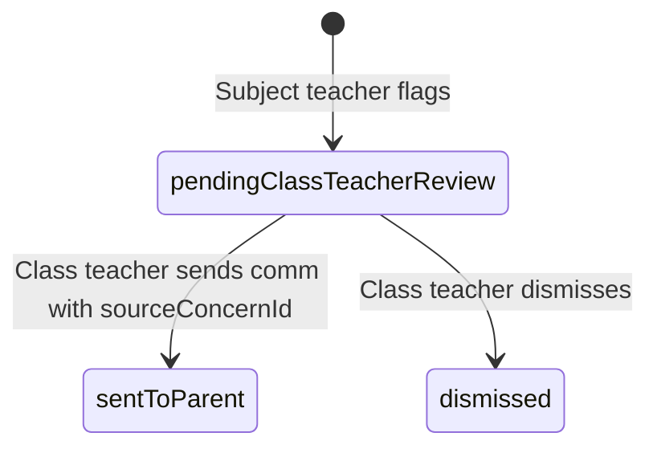

# Subject Teacher Escalation Workflow

**Version:** 1.0  
**Date:** June 2026  
**Audience:** Subject teachers, class teachers  
**Implementation:** `lib/core/communication/subject_teacher_concern_store.dart`

---

## Purpose

Subject teachers observe subject-specific issues (low marks, missing homework, behavior in class) but **cannot message parents directly**. They escalate concerns to the class teacher who owns parent communication for that homeroom.

---

## State machine

| Status | Meaning | Visible to |
|--------|---------|------------|
| `flagged` | Initial create | Subject teacher |
| `pendingClassTeacherReview` | In queue | Class teacher |
| `sentToParent` | Resolved via parent comm | Both |
| `dismissed` | Class teacher closed without parent message | Both |

---

## Subject teacher steps

1. Open **Communication** for student in subject class
2. Confirm role = subject teacher (governance blocks direct send)
3. Tap **Flag for class teacher**
4. Enter concern category + note
5. Concern stored in `SubjectTeacherConcernStore`

---

## Class teacher steps

1. Dashboard shows **pending escalation** banner with count
2. Open communication or student 360 to review flagged items
3. Choose action:
   - **Send parent message** — pre-fills template; passing `sourceConcernId` marks concern `sentToParent`
   - **Dismiss** — calls `MockTeacherRepository.dismissSubjectConcern()` → `dismissed`

---

## Integration with Student 360

`TeacherStudentRiskScreen` lists pending subject flags per student. High-priority unresolved flags elevate risk score and appear in **Students requiring attention today**.

---

## Notifications (gap)

| Channel | Status |
|---------|--------|
| Dashboard banner | ✅ |
| Push to class teacher | ❌ Planned |
| Email digest | ❌ Planned |

---

## Related documents

- `docs/Operations/workflows/Teacher-Parent-Communication-Workflow.md`
- `docs/Vision/FutureVision.md` § Communication Vision
