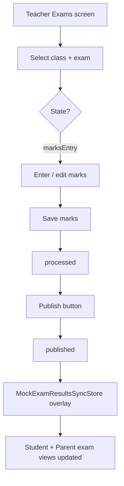

# Exam Publish Workflow

**Version:** 1.0  
**Date:** June 2026  
**Audience:** Class teachers, subject teachers, parents, students  
**Implementation:** `lib/core/exams/exam_administration_store.dart`

---

## Overview

Exam results follow a **publish gate**: marks entered by teachers are invisible to students and parents until explicitly published. This closes Red Team finding #9 (teacher marks ≠ parent/student view).

---

## Lifecycle states

```
draft → scheduled → marksEntry → processed → published
```

| State | Teacher | Student / Parent |
|-------|---------|------------------|
| draft | Configure exam | Not visible |
| scheduled | View schedule | Schedule visible (no marks) |
| marksEntry | Enter marks | Not visible |
| processed | Review totals | Not visible |
| published | Read-only | Results visible |

---

## Teacher flow



### Steps

1. Open **Exams** from teacher shell
2. Select class and examination
3. Enter marks per student (when state = `marksEntry`)
4. Review processed totals
5. Tap **Publish** — RBAC mutation via `TeacherMutationsProvider`
6. `ExamAdministrationStore` transitions to `published`
7. `MockExamResultsSyncStore` propagates marks to `MockStudentRepository` and `MockParentRepository`

---

## Student / parent visibility

After publish:

- Parent dashboard exam section shows updated marks
- Student progress / report card screens reflect published results
- Unpublished marks never appear in parent/student queries (contract test enforced)

---

## Key files

| File | Role |
|------|------|
| `exam_administration_store.dart` | State machine |
| `teacher_exams_provider.dart` | UI state + mutations |
| `teacher_exams_screen.dart` | Marks entry + publish UI |
| `mock_exam_results_sync_store.dart` | Cross-repo sync |
| `exam_administration_chain_test.dart` | Contract test |

---

## Gaps

- In-memory only — restart loses unpublished work
- No ERP admin exam creation/scheduling UI
- API persistence not default

---

## Related documents

- `docs/RED_TEAM_REMEDIATION_REPORT.md` § #9
- `docs/ArchitectureReview/v1.0-Post-RedTeam-Operational-Hardening.md` §1
