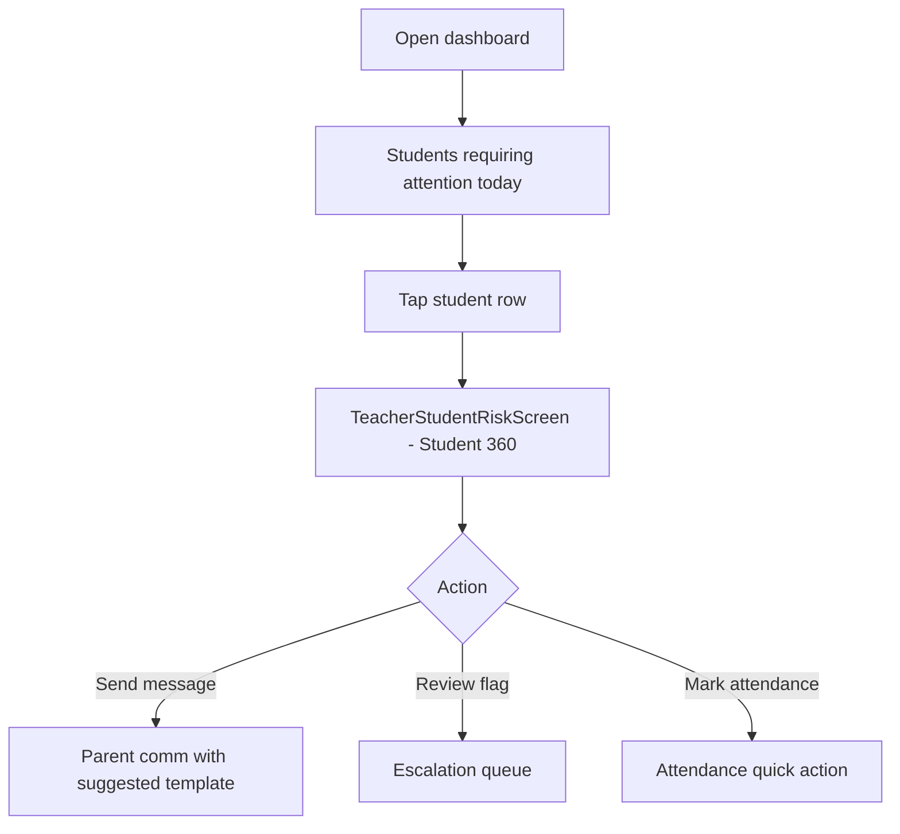

# Student Risk & Attention Workflow

**Version:** 1.0  
**Date:** June 2026  
**Audience:** Class teachers, subject teachers  
**Implementation:** `lib/core/communication/teacher_student_risk_service.dart`

---

## Overview

**Student 360 Risk View** aggregates attendance, homework, behavior, fees, and subject performance into a single teacher mobile screen. **Students requiring attention today** surfaces the highest-priority students on the class-teacher and main teacher dashboards.

---

## Risk computation (current)

`TeacherStudentRiskService` computes risk from mock canonical student registry heuristics:

| Signal | Weight | Source |
|--------|--------|--------|
| Attendance trend | High | Mock attendance |
| Homework gaps | Medium | Mock homework |
| Behavior incidents | High | Mock incidents |
| Fee arrears | Medium | Mock finance link |
| Subject performance | Medium | Mock marks |
| Pending subject flags | High | `SubjectTeacherConcernStore` |
| Recent comms | Low | `ParentCommunicationStore` |

### Risk levels

- **Low** — monitor
- **Medium** — consider outreach
- **High** — immediate attention; appears in "today" list

---

## Class teacher daily flow

### Dashboard surfaces

| Screen | Widget |
|--------|--------|
| `TeacherClassTeacherDashboardScreen` | Attention list + escalation banner |
| `TeacherDashboardScreen` | "Students requiring attention today" section |

Data path: `TeacherStudentRiskService.attentionForClass()` → sorted `StudentAttentionItem` list

---

## Student 360 screen sections

1. **Header** — name, class, photo, risk badge
2. **Risk factors** — enumerated reasons with severity
3. **Attendance** — recent trend
4. **Homework** — pending / overdue
5. **Behavior** — incidents
6. **Fees** — status summary
7. **Subject performance** — per-subject snapshot
8. **Communication history** — recent parent messages
9. **Pending subject flags** — unresolved escalations
10. **Suggested templates** — one-tap to parent comm composer

**Route:** `teacherStudentRisk` (`lib/router/route_names.dart`)

---

## Future: intelligence layer integration

Target wiring to:

- `supabase/functions/_shared/sis/student_360_service.ts`
- ERP `/intelligence` student success signals
- Scheduled risk recompute (nightly)

Current gap: API teacher dashboard returns `studentsNeedingAttention: const []`.

---

## Related documents

- `docs/Operations/workflows/Teacher-Parent-Communication-Workflow.md`
- `docs/Vision/FutureVision.md` § Student Intelligence
- `docs/ArchitectureReview/v1.0-Post-RedTeam-Operational-Hardening.md` §4
