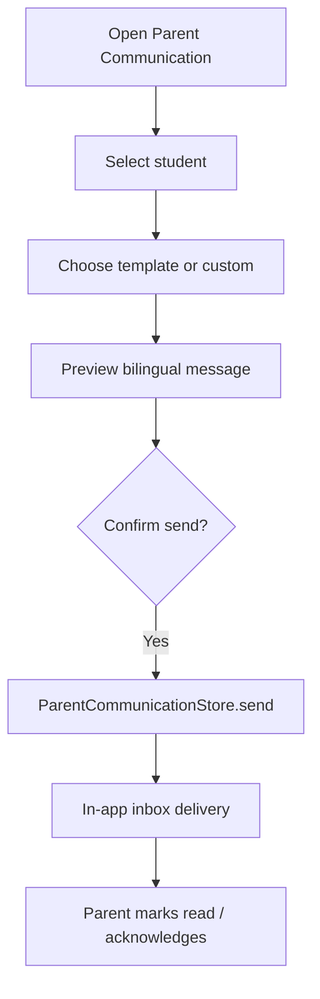
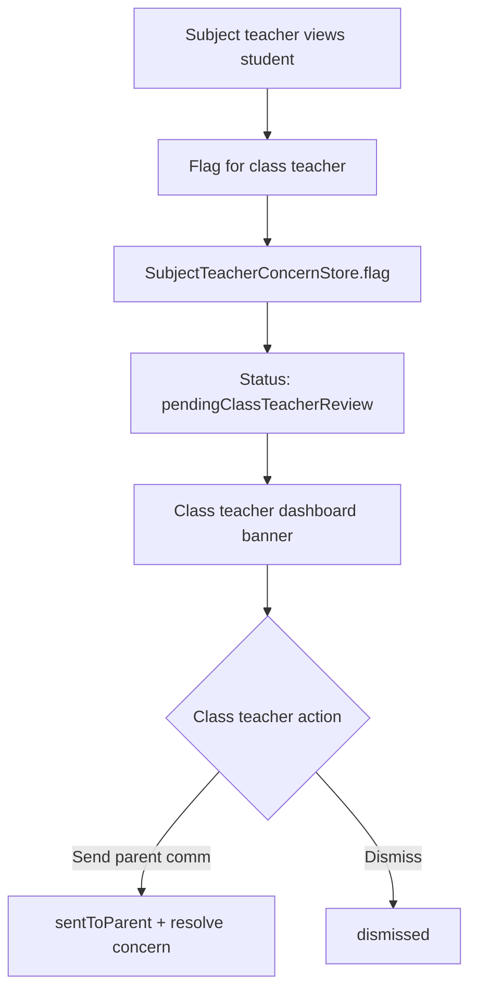
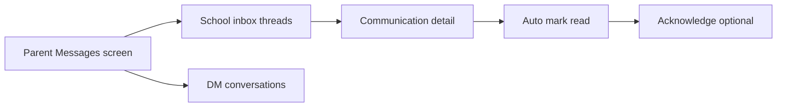

# Teacher–Parent Communication Workflow

**Version:** 1.0  
**Date:** June 2026  
**Audience:** Class teachers, subject teachers, school admins  
**Implementation:** `lib/core/communication/` · `lib/features/teacher/communication/`

---

## Overview

NIKSHA OS separates **who may speak to parents** from **who may raise academic concerns**. Class teachers own parent communication; subject teachers escalate through a review queue.

---

## Roles

| Role | Direct parent message | Flag concern | View student 360 |
|------|----------------------|--------------|------------------|
| Class teacher | ✅ | — | ✅ (own class) |
| Subject teacher | ❌ | ✅ | ✅ (assigned subjects) |
| Principal / VP | Future | — | ERP intelligence |

---

## Class teacher flow — send message

### Steps

1. Navigate: Teacher shell → **Communication** → select student
2. Pick a template (attendance, marks, behavior, homework, etc.) or compose custom text
3. System generates `TranslatedMessagePair` from student's preferred language
4. Preview English + translated body
5. Send — message appears in parent **Messages** inbox (merged with DM threads)
6. Parent opens detail → auto **read** → optional **acknowledge**

### Key files

- `teacher_parent_communication_screen.dart`
- `teacher_parent_communication_provider.dart`
- `parent_communication_governance.dart`

---

## Subject teacher flow — flag concern

### Steps

1. Subject teacher opens communication for a student in their subject class
2. Tap **Flag for class teacher** with reason note
3. Concern enters queue with status `pendingClassTeacherReview`
4. Class teacher sees banner on class-teacher dashboard
5. Class teacher either sends parent message (links `sourceConcernId`) or dismisses

---

## Parent flow — inbox

### Key files

- `parent_communication_inbox_provider.dart`
- `parent_communication_detail_screen.dart`
- `parent_messages_screen.dart`

---

## Audit trail (target vs current)

| Event | Current | Target |
|-------|---------|--------|
| Message sent | In-memory timeline | Server audit + `AuditLogger` |
| Delivered | Modeled | Push/SMS delivery receipt |
| Read | Parent detail auto-mark | Server sync |
| Acknowledged | Mock repo mutation | Server sync |

---

## Governance enforcement

`MockTeacherRepository.sendParentCommunication` calls `ParentCommunicationGovernance.assertCanSend()` before persisting. API mode must replicate the same server-side checks.

---

## Related documents

- `docs/Operations/workflows/Escalation-Workflow.md`
- `../../archive/audit/architecture-review/v1.0-Post-RedTeam-Operational-Hardening.md`
- `docs/Vision/FutureVision.md` § Communication Vision
