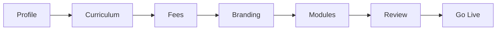

# Unified Onboarding Workflow

**Version:** 1.0  
**Date:** June 2026  
**Audience:** School admins, platform operators  
**Route:** `/admin/onboarding/unified`  
**Implementation:** `lib/features/onboarding/`

---

## Overview

The **Unified Onboarding Wizard** replaces fragmented school setup with a single guided flow: profile, curriculum, fees, branding, modules, review, and go-live. It supersedes manual SQL provision for pilot schools when API mode is enabled.

---

## Wizard steps

| Step | Captures |
|------|----------|
| Profile | School name, board, address, contact |
| Curriculum | Classes, sections, academic year |
| Fees | Fee structure templates |
| Branding | Logo, colors (preview) |
| Modules | Enabled ERP modules |
| Review | Summary checklist |
| Go Live | Confirmation + status flip |

---

## Persistence modes

| Flag | Store | Use case |
|------|-------|----------|
| `ONBOARDING_API_ENABLED=false` (default) | `TenantOnboardingStore` | Demo, Patrol, offline |
| `ONBOARDING_API_ENABLED=true` | Hybrid → Supabase `startup_onboarding` | Staging/production |

### API stack

- Migration: `supabase/migrations/20260627120000_startup_onboarding.sql`
- Handlers: `supabase/functions/_shared/onboarding/startup_onboarding_handlers.ts`
- Client: `hybrid_startup_onboarding_repository.dart`

Auto-persist on each field change when API mode is active.

---

## Go-live behavior (current)

| Action | Current | Target |
|--------|---------|--------|
| Mark tenant onboarded | ✅ Local/API status | ✅ |
| Provision academic year | ❌ | Declarative saga |
| Seed RBAC roles | ❌ | From wizard modules |
| Apply school config | ❌ | Merge into `SchoolConfiguration` |
| Enable modules | Partial | Capability registry sync |

---

## Operator checklist

1. Log in as school admin with `manageOnboarding` permission
2. Navigate to **Admin → Unified Onboarding**
3. Complete all steps; verify review summary
4. Tap **Go Live** — confirm dialog
5. Verify module visibility on admin shell
6. Run `School-Setup-Checklist.md` remaining items (HR import, parent invites)

---

## Gaps

- Supabase persistence requires explicit API flag + deployed backend
- No Patrol E2E journey
- School config sync deferred (`tenant_school_configuration_store.dart` local only)

---

## Related documents

- `docs/Operations/Pilot/School-Onboarding-Guide.md`
- `docs/Operations/Go-Live-Checklist.md`
- `docs/BACKUP_RESTORE_ARCHITECTURE.md`
- `docs/Vision/FutureVision.md` § Startup Onboarding
