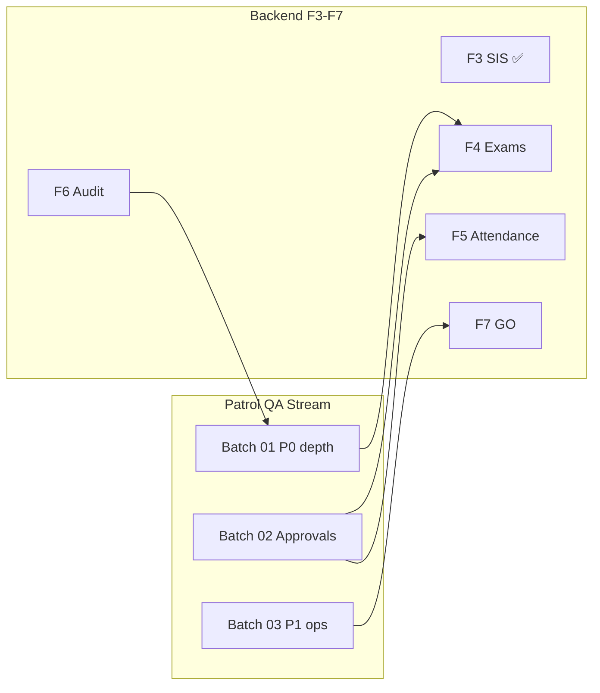

# Patrol Expansion Roadmap

**Date:** 2026-06-18  
**Branch:** `feature/m15-theme`  
**Program:** Continuous Patrol QA (parallel to F3–F7 backend)  
**Freeze:** 🔒 **PRE-CLAUDE** — Batch 03 locked; 02b cert pending  
**Orchestrator:** [`PATROL_QA_ORCHESTRATOR.md`](./PATROL_QA_ORCHESTRATOR.md)

---

## Coverage phases

| Phase | Journey target | Purpose | ETA (calendar) |
|-------|----------------|---------|----------------|
| **Phase 1** | **100** | Foundational ERP coverage — all P0 nav + primary write paths | Q2 2026 |
| **Phase 2** | **250** | Strong operational coverage — P1 modules + approval depth | Q3 2026 |
| **Phase 3** | **500+** | Production-grade — RBAC matrix, tablet/desktop, API-mode | Q4 2026 |

**Current position:** 102 certified journeys (manifest 81 + pilot 9 + batch 01 12) — **Phase 1 target met** on count; depth still PARTIAL on most P0 modules.

---

## Priority matrix

### P0 — Pilot blockers (complete first)

| # | Workflow | Existing asset | Batch | Status |
|---|----------|----------------|-------|--------|
| 1 | QA login all personas | `qa_login_personas_test.dart` | — | COVERED |
| 2 | Persona dashboards | `dashboards_test.dart` + golden | — | COVERED |
| 3 | ERP drawer navigation | `navigation_test.dart` | — | PARTIAL |
| 4 | Approval center (filters) | `pilot_closure` + batch 01 | 01 | PARTIAL |
| 5 | Teacher attendance mark/submit/lock | `teacher_attendance_e2e` + batch 01 | 01 | PARTIAL |
| 6 | Attendance correction (teacher/parent/admin) | `pilot_closure` + batch 01 | 01 | PARTIAL |
| 7 | Exam administration UI | `pilot_closure` + batch 01 | 01 | PARTIAL |
| 8 | Exam publish approval chain | `workflow_exam_publish_approval.yaml` | 02 | NOT TESTED (Patrol) |
| 9 | Finance collections / refunds | `finance_workflows` + pilot | — | PARTIAL |
| 10 | Finance audit register export | `workflow_finance_audit_register.yaml` | 01 | PARTIAL |
| 11 | Finance concession approval | `pilot_closure` | — | PARTIAL |
| 12 | Student 360 navigation + tabs | `pilot_closure` + batch 01 | 01 | PARTIAL |
| 13 | SIS registry export | `sis_workflows` + batch 01 | 01 | PARTIAL |
| 14 | Parent leave → principal approve | `pilot_closure` | — | PARTIAL |
| 15 | Fee structure approval | integration test only | 02 | NOT TESTED (Patrol) |

### P1 — Operational modules

| Module | Target journeys | Current | Gap |
|--------|-----------------|---------|-----|
| HR | 25 | ~12 | Leave approval Patrol, payroll run |
| Hostel | 20 | ~8 | Allocation write, visitors |
| Library | 20 | ~8 | Issue/return student path |
| Inventory | 30 | ~14 | PO dual-persona, catalog |
| Transport | 20 | ~9 | Allocation, activate |

### P2 — Deferred / advanced

| Area | Notes |
|------|-------|
| Marketing | Module absent — skip until feature exists |
| Director portal | 2 Patrol tests; expand in Phase 2 |
| Industry verticals | Salon, healthcare, etc. — out of school pilot scope |
| Advanced reports | Cross-module export parity |

---

## Batch execution plan

| Batch | Journeys | Focus | Doc |
|-------|----------|-------|-----|
| Pilot closure | 9 | P0 certification gate | `FINAL_PILOT_CLOSURE_REPORT.md` |
| **01** | **12** | P0 depth: audit register, approval filters, S360 tabs, locks | `PATROL_BATCH_01_CERTIFICATION.md` |
| 02 | 15 | Approval write paths: exam publish, fee structure, parent correction submit |
| 03 | 15 | P1 HR + inventory PO dual persona |
| 04 | 15 | P1 hostel + library write flows |
| 05 | 15 | P1 transport + admissions full chain |
| 06–20 | 10–20 each | Route matrix, RBAC deny, tablet breakpoints, API-mode |

---

## Milestone gates

### Phase 1 exit (100 journeys)

- [x] Journey count ≥ 100
- [ ] All P0 rows ≥ PARTIAL in coverage audit
- [ ] `flutter analyze` 0 errors
- [ ] `flutter test` all pass
- [ ] Pilot + Batch 01 Patrol green on emulator
- [ ] No open Critical/High UI defects

### Phase 2 exit (250 journeys)

- [ ] P1 modules ≥ 60% coverage each
- [ ] Approval center all 6 category filters exercised in Patrol
- [ ] Golden dashboards stable (no failure artifacts)

### Phase 3 exit (500+ journeys)

- [ ] `ENABLE_API_MODE=true` Patrol suite on staging
- [ ] Route coverage ≥ 98%
- [ ] Persona coverage 100% including director

---

## Reuse-first checklist (every batch)

Before creating a journey:

1. `rg` in `patrol_test/`, `qa/journeys/`, `test/features/`, `test/integration/`
2. If exists → update selectors/assertions only
3. If partial → extend same file
4. New file only when no overlap

---

## Alignment with backend phases

---

*Updated: 2026-06-18 — Batch 01 in progress.*
