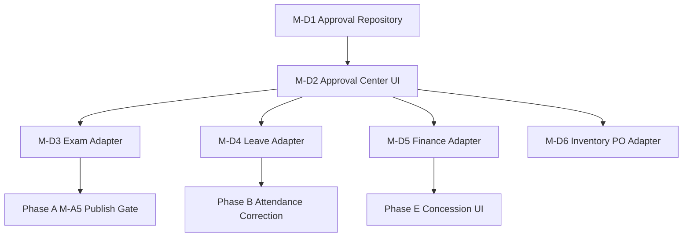

# Phase D — Principal Approval Center: Execution Plan

**Version:** 1.0  
**Date:** 2026-06-17  
**Branch:** `feature/m15-theme`  
**Duration:** 4–5 weeks (engineering); **start Week 1 parallel with Phase A**  
**Companion docs:** [`OPERATIONAL_GAP_MASTER_TRACKER.md`](./OPERATIONAL_GAP_MASTER_TRACKER.md) · [`OPERATIONAL_REMEDIATION_ROADMAP.md`](./OPERATIONAL_REMEDIATION_ROADMAP.md) · [`PHASE_A_EXECUTION_PLAN.md`](./PHASE_A_EXECUTION_PLAN.md)

**Status:** Planning only — no code, tests, routes, or commits.

---

## 1. Phase objective

Give Principal and Vice Principal **one operational inbox** for all school approvals — academic, attendance, leave, finance, inventory — with:

1. Unified queue (filter by type, status, date, requester).
2. Approve / reject with mandatory comment on reject.
3. Immutable audit trail per decision.
4. Requester notification on outcome.
5. Module mutations **only execute after approval** (no shadow approvals in module silos).

**Readiness target:** Management / Principal **50% → 75%** · Cross-module governance **30% → 70%**.

**Note:** Phase D has **no standalone P0 gaps** in the tracker but is **blocking quality** for P0-EXAM-003, P0-ATT-001, P0-FIN-001, P0-INV-003, and multiple P1 principal workflows.

---

## 2. Gap scope (Phase D)

| Gap ID | Severity | Type | Milestone |
|--------|----------|------|-----------|
| P1-PRIN-001 | P1 | NET_NEW | M-D1, M-D2 |
| P1-PRIN-002 | P1 | NET_NEW | M-D4 |
| P1-PRIN-003 | P1 | NET_NEW | M-D4 |
| P1-FIN-004 | P1 | NET_NEW | M-D5 |
| P1-FIN-007 | P1 | NET_NEW | M-D5 |
| P0-INV-003 | P0 | NET_NEW | M-D6 |
| P0-INV-004 | P0 | NET_NEW | M-D6 |
| RBAC-006 | P0 | NET_NEW | M-D6 |
| RBAC-007 | P0 | NET_NEW | M-D6 |
| RBAC-009 | P0 | NET_NEW | M-D5 |
| DISC-007 | — | DISCONNECT | M-D1 |
| WF-011 | — | — | M-D2 |
| WF-014 | — | — | M-D2 |
| APR-002 | — | — | M-D3 (Phase A exam publish) |
| APR-003 | — | — | M-D3 (Phase B attendance) |
| APR-004 | — | — | M-D4 |
| APR-005 | — | — | M-D4 |
| APR-006 | — | — | M-D5 |
| APR-008 | — | — | M-D6 |
| APR-012 | — | — | M-D5 |
| APR-014 | — | — | M-D7 (stub for Phase H) |

**Reference implementation (copy, do not reinvent):** Admissions approval — `approveAdmission` / `rejectAdmission` in `admissions_mutations_provider.dart`, `admissions_approval_review_panel.dart`, `Permission.approveAdmissions`.

**Existing partial surface:** `ManagementTasksScreen` (MG-07) — financial approvals only; `ManagementApprovalType` enum — budget, expense, payroll, vendor, marketing, admission.

---

## 3. Existing code to reuse

| Asset | Path | Reuse for |
|-------|------|-----------|
| `ManagementTasksScreen` | `lib/features/management/tasks/management_tasks_screen.dart` | UI shell, filters, KPI row, mobile/desktop layouts |
| `ManagementApprovalItem` | `lib/features/management/management_models.dart` | Extend with new types + payload |
| `ManagementApprovalType` enum | same | Extend enum values |
| `management_workflow_actions.dart` | `lib/features/management/` | `approveManagementItem` / `rejectManagementItem` pattern |
| `management_mutations_provider.dart` | same | `resolveManagementApprovalProvider` |
| `managementFilteredApprovalsProvider` | `management_providers.dart` | Filter logic |
| `QaTestKeys.managementApprovalSuccessSnackbar` | `qa_test_keys.dart` | Patrol hooks |
| Admissions `_runMutation` | `admissions_mutations_provider.dart` | Audit + invalidate + assertPermission |
| `admissions_approval_review_panel.dart` | `lib/features/admissions/approval/` | Review UI pattern (detail drawer) |
| `ApprovalQueueItem` | `admissions_models.dart` | Generic approval item shape |
| `assertApprovePermission` | `mutation_permission_validator.dart` | RBAC guard pattern |
| `mutation_permission_registry.dart` | `lib/core/security/` | Register approve mutations |
| `recordAdmissionsAudit` | `admissions_audit.dart` | Template for `recordApprovalAudit` |
| `workflow_repository` | `test/contracts/workflow/` | Workflow automation (future escalation) |
| `workflow_automation_screen.dart` | `lib/features/management/` | Escalation rules (read-only Phase D) |
| `PrincipalCommandScreen` / overview panel | `management_principal_overview_panel.dart` | Link "Pending approvals" KPI → inbox |
| `inventory_mutations_provider.dart` | `lib/features/inventory/` | PO approve — split create vs approve |
| `finance_mutations_provider.dart` | `lib/features/finance/` | Refund/concession approve hooks |
| `hr_mutations_provider.dart` | `lib/features/hr/` | Staff leave — feed unified queue |
| `parent_mutations_provider.dart` | `lib/features/parent/` | Student leave submit → approval item |
| `biz_erp_management_tasks.yaml` | `qa/journeys/` | Patrol baseline |

---

## 4. Implementation milestones

### M-D1 — Approval domain model & repository (Week 1)

**Gaps:** P1-PRIN-001 (foundation), DISC-007

| Task | Type | Description |
|------|------|-------------|
| D1.1 | NET_NEW | `ApprovalRequest` domain model: id, type, status, title, summary, requesterId, requesterName, entityType, entityId, payload (JSON), createdAt, decidedAt, decidedBy, comment |
| D1.2 | NET_NEW | `ApprovalRequestType` enum: examResults, attendanceCorrection, studentLeave, staffLeave, feeConcession, feeStructure, inventoryPo, refund, admission (existing), budget, expense, payroll, vendor, marketing |
| D1.3 | NET_NEW | `ApprovalRepository` interface: `listPending`, `listByFilter`, `getById`, `submit`, `approve`, `reject`, `cancel` |
| D1.4 | WIRE | `MockApprovalRepository` aggregates items from module stores + existing management mock |
| D1.5 | NET_NEW | `ApprovalCenterService` — single write path; modules call `submitApprovalRequest()` instead of finalizing |

**Files affected (new):**
```
lib/core/approvals/
  approval_models.dart
  approval_request_type.dart
  approval_status.dart
  approval_center_service.dart
lib/core/repositories/interfaces/approval_repository.dart
lib/core/repositories/mock/mock_approval_repository.dart
lib/core/repositories/api/approval/  (stub)
test/contracts/approval/approval_repository_contract_test.dart
test/contracts/approval/approval_fixture_builder.dart
test/core/approvals/approval_center_service_test.dart
```

**Files affected (modify):**
```
lib/core/repositories/repository_providers.dart
lib/core/repositories/repository_config.dart
```

**Acceptance criteria:**
- [ ] Contract test: submit → pending → approve transitions status
- [ ] Reject requires non-empty comment
- [ ] Duplicate submit for same entityId+type returns existing pending item

**Flutter tests:**
- Unit: `approval_center_service_test.dart`
- Contract: full lifecycle mock ↔ interface

**Patrol:** None yet.

**Rollback:** Modules bypass `ApprovalCenterService` via flag `APPROVAL_CENTER_ENABLED=false`.

---

### M-D2 — Principal Approval Center UI (Week 2)

**Gaps:** P1-PRIN-001, WF-011, WF-014, DISC-007

| Task | Type | Description |
|------|------|-------------|
| D2.1 | NET_NEW | `PrincipalApprovalCenterScreen` — replaces or embeds in MG-07 as primary approval UX |
| D2.2 | WIRE | Reuse `ManagementTasksScreen` filters + table/card layout |
| D2.3 | NET_NEW | Type filter chips: All · Academic · Attendance · Leave · Finance · Inventory |
| D2.4 | NET_NEW | Detail panel: request payload, history, approve/reject actions |
| D2.5 | WIRE | Principal overview KPI "N pending approvals" → deep link to inbox |
| D2.6 | NET_NEW | Route: `/management/approvals` or elevate MG-07; guard `Permission.approve*` per type |

**Files affected (new):**
```
lib/features/management/approval/
  principal_approval_center_screen.dart
  approval_center_provider.dart
  widgets/approval_detail_panel.dart
  widgets/approval_type_filter.dart
  widgets/approval_queue_table.dart
test/features/management/approval/approval_center_screen_test.dart
test/features/management/approval/approval_center_provider_test.dart
```

**Files affected (modify):**
```
lib/features/management/tasks/management_tasks_screen.dart  (redirect or merge)
lib/features/management/management_navigation.dart
lib/features/management/widgets/management_principal_overview_panel.dart
lib/router/route_names.dart
lib/router/route_guards.dart
lib/core/testing/qa_test_keys.dart
```

**Acceptance criteria:**
- [ ] Principal sees all pending types in one list
- [ ] Filter by "Academic" shows only exam results (when present)
- [ ] Approve/reject shows snackbar with `QaTestKeys.managementApprovalSuccessSnackbar`
- [ ] Mobile layout usable on tablet

**Flutter tests:**
- Widget: empty state, filter changes list, approve button enabled
- Provider: filter by type/status

**Patrol tests (extend):**
```
qa/journeys/biz_erp_management_tasks.yaml  (extend with type filters + approve action)
qa/journeys/biz_erp_approval_center.yaml  (new — full inbox walkthrough)
```

**Rollback:** Route hidden; modules use legacy per-module approval screens (Admissions unchanged).

---

### M-D3 — Academic approval adapter (Week 2–3)

**Gaps:** APR-002 (Phase A dependency)

| Task | Type | Description |
|------|------|-------------|
| D3.1 | WIRE | Phase A `submitExamResultsForApproval` → `ApprovalCenterService.submit(type: examResults)` |
| D3.2 | NET_NEW | On approve: call `ExamAdministrationRepository.publishResults` |
| D3.3 | NET_NEW | On reject: revert exam phase to `processed`; notify teacher |
| D3.4 | NET_NEW | `Permission.approveExamResults` on approve action |
| D3.5 | WIRE | Detail panel shows class, subject, exam type, marks completion % |

**Files affected (modify):**
```
lib/features/teacher/teacher_mutations_provider.dart
lib/core/repositories/interfaces/exam_administration_repository.dart  (Phase A)
lib/features/management/approval/widgets/approval_detail_panel.dart
lib/core/security/permissions.dart
lib/core/security/rbac_service.dart
test/integration/exam_administration/exam_publish_approval_integration_test.dart
test/integration/approval/exam_approval_adapter_integration_test.dart  (new)
```

**Acceptance criteria:**
- [ ] End-to-end: teacher submit → principal approve → parent sees results (with Phase A)
- [ ] Reject returns exam to processed with comment visible to teacher

**Flutter tests:** Integration exam + approval cross-module.

**Patrol:** `workflow_exam_publish_approval.yaml` (shared with Phase A).

**Rollback:** `EXAM_APPROVAL_REQUIRED=false` in Phase A bypasses this adapter.

---

### M-D4 — Leave & attendance approval adapters (Week 3)

**Gaps:** P1-PRIN-002, P1-PRIN-003, APR-003, APR-004, APR-005

| Task | Type | Description |
|------|------|-------------|
| D4.1 | WIRE | Parent `submitParentLeave` → creates `studentLeave` approval (status pending) |
| D4.2 | NET_NEW | Class teacher optional first review step (approve → forward to principal) OR principal direct (MVP: principal only) |
| D4.3 | WIRE | HR `createLeaveRequest` (staff) → `staffLeave` approval in same inbox |
| D4.4 | NET_NEW | Attendance correction adapter (Phase B): parent/teacher request → `attendanceCorrection` type |
| D4.5 | NET_NEW | Same-day attendance exception queue — `attendanceException` type with date/class |
| D4.6 | WIRE | Parent leave screen shows approval status (P1-PAR-002) |

**Files affected (modify):**
```
lib/features/parent/leave/parent_leave_screen.dart
lib/features/parent/parent_mutations_provider.dart
lib/features/hr/hr_mutations_provider.dart
lib/features/hr/leave/hr_leave_screen.dart  (optional: remove duplicate approve UI → inbox link)
lib/features/management/approval/approval_adapters/
  student_leave_approval_adapter.dart
  staff_leave_approval_adapter.dart
  attendance_correction_approval_adapter.dart  (stub until Phase B)
test/integration/approval/leave_approval_integration_test.dart
test/features/parent/leave/parent_leave_provider_test.dart  (extend)
```

**Acceptance criteria:**
- [ ] Parent sees leave status: Pending / Approved / Rejected
- [ ] Principal approves student leave from single inbox
- [ ] Staff leave from HR appears in same inbox (not only HR screen)
- [ ] Attendance adapter stub registered (implements when Phase B lands)

**Flutter tests:**
- Parent leave submit creates approval item
- Principal approve updates leave status
- HR staff leave appears in filtered inbox

**Patrol (new):**
```
qa/journeys/workflow_parent_leave_approval.yaml
qa/journeys/workflow_hr_leave_approval.yaml
```

**Rollback:** Leave auto-approves in mock (pilot emergency flag `LEAVE_AUTO_APPROVE=true`).

---

### M-D5 — Finance approval adapters (Week 3–4)

**Gaps:** P1-FIN-004, P1-FIN-007, APR-006, APR-012, RBAC-009, P0-FIN-001 (approval half)

| Task | Type | Description |
|------|------|-------------|
| D5.1 | NET_NEW | Fee structure submit for approval before active |
| D5.2 | WIRE | Scholarship/concession assign → `feeConcession` approval → principal approve → apply to student account |
| D5.3 | WIRE | Refund create (Phase E) → `refund` approval; principal threshold configurable |
| D5.4 | NET_NEW | Permissions: `approveFeeConcession`, `assignScholarship`, `approveFeeStructure`, `approveRefund` |
| D5.5 | WIRE | Finance detail panel: student name, amount, reason, supporting doc link |

**Files affected (modify):**
```
lib/features/finance/fee_structures/  (submit for approval action)
lib/features/finance/mutations/finance_mutations_provider.dart
lib/features/finance/discounts/  (concession assign UI — Phase E)
lib/features/finance/refunds/
lib/core/security/permissions.dart
lib/core/security/rbac_service.dart
lib/core/security/mutation_permission_registry.dart
test/integration/approval/finance_approval_integration_test.dart
test/features/finance/fee_structure_approval_test.dart  (new)
```

**Acceptance criteria:**
- [ ] New fee structure cannot go live without principal approval
- [ ] Concession assign creates pending approval; student fee updates only after approve
- [ ] Principal with only `viewFinance` cannot approve; `approveFeeConcession` can

**Flutter tests:** Finance approval integration; RBAC deny tests.

**Patrol:**
```
qa/journeys/workflow_finance_concession_approval.yaml
```

**Rollback:** Fee structures auto-activate; concessions apply immediately (`FINANCE_APPROVAL_REQUIRED=false`).

---

### M-D6 — Inventory PO maker-checker (Week 4)

**Gaps:** P0-INV-003, P0-INV-004, RBAC-006, RBAC-007, APR-008

| Task | Type | Description |
|------|------|-------------|
| D6.1 | NET_NEW | `ErpRole.storekeeper` with `createInventoryPo` only (no approve) |
| D6.2 | NET_NEW | `Permission.approvePurchaseOrder` for principal / inventory manager |
| D6.3 | WIRE | `createProcurementOrder` → pending approval item (not auto-approved) |
| D6.4 | WIRE | Principal approves in inbox → `approveProcurementOrder` executes |
| D6.5 | NET_NEW | Block same user from approve if they created PO (client + server rule) |

**Files affected (modify):**
```
lib/core/security/permissions.dart
lib/core/security/rbac_service.dart
lib/features/inventory/inventory_mutations_provider.dart
lib/features/inventory/procurement/
lib/features/management/approval/approval_adapters/inventory_po_approval_adapter.dart
test/security/rbac/storekeeper_role_test.dart  (new)
test/integration/approval/inventory_po_approval_integration_test.dart
test/features/inventory/procurement_po_approval_test.dart  (new)
```

**Acceptance criteria:**
- [ ] Storekeeper creates PO; status Pending Approval
- [ ] Storekeeper cannot approve own PO
- [ ] Principal approves from inbox; PO moves to approved
- [ ] Audit shows creator ≠ approver

**Flutter tests:** Segregation of duties; RBAC matrix for storekeeper vs principal.

**Patrol:**
```
qa/journeys/workflow_inventory_po_approval.yaml
```

**Rollback:** Restore single `manageInventory` approve (`INVENTORY_PO_AUTO_APPROVE=true`).

---

### M-D7 — Notifications & audit hardening (Week 4–5)

**Gaps:** Cross-cutting; APR-014 stub

| Task | Type | Description |
|------|------|-------------|
| D7.1 | NET_NEW | `ApprovalDecisionNotifier` — in-app banner + optional push stub for requester |
| D7.2 | WIRE | `recordApprovalAudit` unified audit type `approvalDecided` with metadata |
| D7.3 | NET_NEW | Marketing campaign spend approval type stub (no UI until Phase H) |
| D7.4 | WIRE | Escalation: pending > 48h surfaces in `workflow_automation_screen` insight (read-only) |

**Files affected (new/modify):**
```
lib/core/approvals/approval_audit.dart
lib/core/notifications/approval_notification_service.dart  (stub)
lib/features/management/workflow_automation_screen.dart  (insight link)
test/core/approvals/approval_audit_test.dart
```

**Acceptance criteria:**
- [ ] Every approve/reject writes audit event queryable by entityId
- [ ] Teacher sees snackbar/badge when exam approval decided
- [ ] Audit export includes approval decisions (prep for Phase I)

**Flutter tests:** Audit metadata completeness.

**Patrol:** Included in approval center journey screenshots.

**Rollback:** Notifications disabled via flag; audit still writes locally.

---

## 5. Wiring vs net-new summary

| Category | Count | % effort |
|----------|-------|----------|
| **WIRE** | 14 tasks | ~50% |
| **NET_NEW** | 12 tasks | ~50% |
| **DISCONNECT** | 1 (unify inbox) | included above |

**Highest ROI wiring:** Copy Admissions `_runMutation` pattern; extend `ManagementTasksScreen` rather than greenfield UI; adapter pattern per module.

---

## 6. Implementation order (strict)

```
Week 1:  M-D1 (domain + repository + contract tests)  ║  Phase A M-A1
Week 2:  M-D2 (Approval Center UI)  ║  M-D3 start (exam adapter)  ║  Phase A M-A5 coord
Week 3:  M-D3 complete  ║  M-D4 (leave + attendance stubs)  ║  Phase B starts
Week 4:  M-D5 (finance adapters)  ║  M-D6 (inventory PO)
Week 5:  M-D7 (notifications/audit)  ║  Patrol hardening  ║  docs
```

**Critical handoff to Phase A:** M-D3 exam adapter ready by **end of Week 3** for M-A5 completion.

**Critical handoff to Phase B:** M-D4 attendance adapter interface ready Week 3 (implementation Week 4+ with Phase B).

**Critical handoff to Phase E:** M-D5 finance adapters ready Week 4.

---

## 7. Required Flutter test matrix

| Layer | New/updated tests | Gate |
|-------|-------------------|------|
| **Unit** | `approval_center_service_test.dart`, `approval_audit_test.dart` | `flutter test test/core/approvals/` |
| **Contract** | `approval_repository_contract_test.dart` | `flutter test test/contracts/approval/` |
| **Provider** | `approval_center_provider_test.dart` | `flutter test test/features/management/approval/` |
| **Widget** | `approval_center_screen_test.dart` | Same |
| **Integration** | `exam_approval_adapter_integration_test.dart`, `leave_approval_integration_test.dart`, `finance_approval_integration_test.dart`, `inventory_po_approval_integration_test.dart` | `flutter test test/integration/approval/` |
| **Security** | `storekeeper_role_test.dart`, extend `rbac_validation_suite_test.dart`, `mutation_permission_registry_test.dart` | `flutter test test/security/` |
| **Regression** | `admissions_write_tests.dart` (unchanged), `management` provider tests | Full suite |
| **Route inventory** | New approval routes in `router_route_protection_inventory_test.dart` | Required |

**CI gate (Phase D complete):** `flutter analyze` (0 issues) + all above green.

---

## 8. Patrol / Maestro test matrix

| Journey | File | Priority | Milestone |
|---------|------|----------|-----------|
| Approval center inbox | `qa/journeys/biz_erp_approval_center.yaml` | P0 | M-D2 |
| Management tasks (legacy) | `qa/journeys/biz_erp_management_tasks.yaml` | P0 | M-D2 extend |
| Exam publish approval | `qa/journeys/workflow_exam_publish_approval.yaml` | P0 | M-D3 + Phase A |
| Parent leave approval | `qa/journeys/workflow_parent_leave_approval.yaml` | P1 | M-D4 |
| HR staff leave | `qa/journeys/workflow_hr_leave_approval.yaml` | P1 | M-D4 |
| Finance concession | `qa/journeys/workflow_finance_concession_approval.yaml` | P1 | M-D5 |
| Inventory PO | `qa/journeys/workflow_inventory_po_approval.yaml` | P1 | M-D6 |

**Register in:** `qa/patrol/journey_manifest.json`

**Run:** `bash qa/patrol/run_erp_coverage.sh` FULL after Phase D + A

**QA keys (planning):**
- `QaTestKeys.approvalCenterScreen`
- `QaTestKeys.approvalApproveButton`
- `QaTestKeys.approvalRejectButton`
- `QaTestKeys.approvalTypeFilterAcademic`

---

## 9. Rollback strategy

### 9.1 Feature flags

| Flag | Default | Effect when false |
|------|---------|-------------------|
| `APPROVAL_CENTER_ENABLED` | false | Modules use legacy direct mutations |
| `EXAM_APPROVAL_REQUIRED` | false | Phase A direct publish |
| `LEAVE_AUTO_APPROVE` | false | Auto-approve leave (emergency pilot) |
| `FINANCE_APPROVAL_REQUIRED` | false | Fee/concession immediate |
| `INVENTORY_PO_AUTO_APPROVE` | false | PO approve on create |

### 9.2 Rollback levels

| Level | Trigger | Action |
|-------|---------|--------|
| **L1 — UI** | Inbox UX broken | Hide `/management/approvals`; use per-module screens |
| **L2 — Type** | Single type broken | Disable adapter for that `ApprovalRequestType` only |
| **L3 — Module** | Finance approval blocks cashier | `FINANCE_APPROVAL_REQUIRED=false` |
| **L4 — Full** | Phase D abandoned | Revert; Admissions approval unchanged; management tasks financial-only |

### 9.3 Data integrity

- Approved items are **immutable** — rollback does not undo decisions; use compensating rejection workflow
- Pending items on rollback: remain pending or auto-expire per config `APPROVAL_PENDING_EXPIRY_DAYS`
- PO mid-rollback: if approved, do not auto-revoke (manual cancel in inventory)

### 9.4 Rollback verification

1. `flutter test test/contracts/approval/`
2. `flutter test test/integration/admissions/` (unchanged)
3. `qa/journeys/biz_erp_management_tasks.yaml` (financial approvals still work)

---

## 10. Phase D exit checklist

- [ ] P1-PRIN-001 closed — unified inbox live
- [ ] P1-PRIN-002, P1-PRIN-003 closed (student leave + attendance exception)
- [ ] P1-FIN-004, P1-FIN-007 closed
- [ ] P0-INV-003, P0-INV-004, RBAC-006, RBAC-007 closed
- [ ] APR-002 adapter wired (with Phase A)
- [ ] APR-003, APR-004, APR-005 adapters ready (B fills attendance)
- [ ] APR-006, APR-008, APR-012 wired
- [ ] `flutter analyze` = 0
- [ ] All integration tests in `test/integration/approval/` pass
- [ ] Patrol approval journeys registered
- [ ] Readiness: Principal / Management **≥ 75%**

---

## 11. Architecture decision record (planning)

| Decision | Choice | Rationale |
|----------|--------|-----------|
| New screen vs extend MG-07 | **Extend MG-07** into Approval Center | Reuse filters, table, QA keys, Patrol journey |
| Central service vs module polls | **ApprovalCenterService** submit | Prevents duplicate queues |
| Principal mobile app | **Tablet ERP shell** only | No native principal mobile in scope |
| Attendance adapter timing | **Interface Week 3**, impl with Phase B | Unblocks D without waiting for B |
| Admissions duplication | **Do not migrate** admissions queue in D | Already complete; optional aggregate view only |

---

## 12. Cross-phase dependency map



---

## 13. Risks & mitigations

| Risk | Mitigation |
|------|------------|
| MG-07 merge breaks existing financial approvals | Keep `ManagementApprovalType` values; additive enum only |
| Module teams bypass approval service | Lint rule / code review; mutation registry enforcement |
| Principal overwhelmed by volume | Default filter Pending; type chips; date sort |
| Storekeeper role breaks existing demos | Seed storekeeper user in QA login |
| Phase A blocked on D | Fallback approve on management tasks (documented in Phase A M-A5.4) |

---

## Change log

| Version | Date | Notes |
|---------|------|-------|
| 1.0 | 2026-06-17 | Initial Phase D execution plan |
