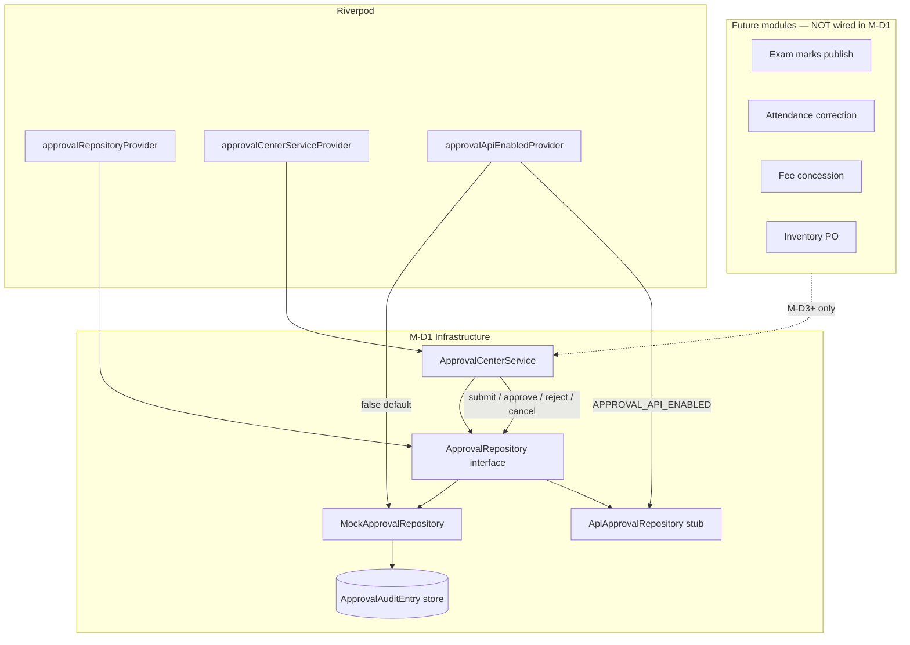

# Phase D — M-D1 Completion Report

**Milestone:** M-D1 — ApprovalRepository + ApprovalCenterService  
**Branch:** `feature/m15-theme`  
**Date:** 2026-06-17  
**Status:** ✅ **COMPLETE** — infrastructure only; no module wiring  
**Certification:** Ready for review — **no commit/push performed** (awaiting explicit approval)

---

## 1. Objective (recap)

Establish cross-module approval infrastructure so future milestones (M-D2 UI, M-D3 exam adapter, etc.) can submit and resolve approvals through a single service — without touching exams, attendance, finance, inventory, or marketing modules in this milestone.

---

## 2. Deliverables completed

| Task | Status | Notes |
|------|--------|-------|
| D1.1 `ApprovalRequest` domain model | ✅ | `approval_models.dart` |
| D1.2 `ApprovalRequestType` enum | ✅ | 14 types (exam → marketing) |
| D1.3 `ApprovalStatus` enum | ✅ | pending, approved, rejected, cancelled |
| D1.4 `ApprovalAuditEntry` + `ApprovalAuditAction` | ✅ | `approval_audit.dart` |
| D1.5 `ApprovalRepository` interface | ✅ | Full CRUD lifecycle + audit |
| D1.6 `MockApprovalRepository` | ✅ | Tenant/school scoped in-memory store |
| D1.7 `ApiApprovalRepository` stub | ✅ | Throws `ApiNotConnectedException` |
| D1.8 `ApprovalCenterService` | ✅ | Submit dedup, audit on all actions |
| D1.9 Riverpod providers | ✅ | `approvalRepositoryProvider`, `approvalCenterServiceProvider` |
| D1.10 Feature flag | ✅ | `APPROVAL_API_ENABLED` (default false) |
| D1.11 Contract tests | ✅ | 11 tests |
| D1.12 Service unit tests | ✅ | 7 tests |

**Explicitly NOT done (per scope):**
- No UI (`PrincipalApprovalCenterScreen`)
- No module adapters (exam, attendance, finance, inventory)
- No aggregation from `MockManagementRepository` or Admissions queue
- No RBAC permission enums (`approveExamResults`, etc.)
- No `AuditEventType` extensions in global audit logger

---

## 3. Files created

```
lib/core/approvals/
  approval_status.dart
  approval_request_type.dart
  approval_exceptions.dart
  approval_audit.dart
  approval_models.dart
  approval_requests.dart
  approval_center_service.dart

lib/core/repositories/interfaces/
  approval_repository.dart

lib/core/repositories/mock/
  mock_approval_repository.dart

lib/core/repositories/api/approval/
  api_approval_repository.dart

test/contracts/approval/
  approval_fixture_builder.dart
  approval_repository_contract_test.dart

test/core/approvals/
  approval_center_service_test.dart
```

---

## 4. Files modified

| File | Change |
|------|--------|
| `lib/core/repositories/repository_config.dart` | Added `approvalApiEnabledProvider` |
| `lib/core/repositories/repository_providers.dart` | Added `approvalRepositoryProvider`, `approvalCenterServiceProvider` |

**No changes** to M15 visual files, feature screens, routes, or existing module mutations.

---

## 5. Architecture diagram



### Lifecycle (supported states)

```
                    submit
                      │
                      ▼
                  ┌─────────┐
                  │ PENDING │
                  └─────────┘
                    │ │ │
         approve ───┘ │ └─── cancel
                      │ reject (comment required)
                      ▼
        ┌──────────┬──────────┬───────────┐
        │ APPROVED │ REJECTED │ CANCELLED │
        └──────────┴──────────┴───────────┘
              (terminal states)
```

### Key design decisions

1. **Single write path:** Modules will call `ApprovalCenterService.submitApprovalRequest()` (M-D2+) — not repository directly from UI.
2. **Duplicate guard:** Same `(type, entityType, entityId)` pending request returns existing row — no duplicate audit on resubmit.
3. **Reject comment:** Enforced in both `MockApprovalRepository` and `ApprovalCenterService`.
4. **Tenant scope:** All queries filter by `RepositoryQuery.tenantId` and optional `schoolId`.
5. **Reversible:** Feature flag `APPROVAL_API_ENABLED=false` keeps mock-only; no routes or UI added.

---

## 6. Test results

### Targeted suites (M-D1)

```text
flutter test test/contracts/approval/ test/core/approvals/
00:00 +18: All tests passed!
```

| Suite | Tests | Result |
|-------|-------|--------|
| `approval_repository_contract_test.dart` | 11 | ✅ Pass |
| `approval_center_service_test.dart` | 7 | ✅ Pass |

### Contract coverage

- Interface parity (mock + API implement `ApprovalRepository`)
- Submit → pending + tenant scope
- `findPendingByEntity` before/after approve
- Approve / reject / cancel transitions
- Reject empty comment throws `ApprovalRejectCommentRequiredException`
- Double approve throws `ApprovalInvalidStateException`
- `listByFilter` by status + type
- Audit entry persistence
- API stub throws `ApiNotConnectedException`

### Service coverage

- Submit creates audit trail
- Duplicate submit idempotent (one pending, one audit)
- Approve / reject / cancel each append audit
- Reject without comment blocked at service layer
- `listByFilter` delegation

### Static analysis (M-D1 paths)

```text
flutter analyze lib/core/approvals lib/core/repositories/.../approval*
No issues found!
```

### Full project analyze

```text
flutter analyze
61 issues found — all pre-existing info-level (no errors)
```

Existing tests were **not** run in full suite for this milestone (per scope: do not break existing tests — no production code paths changed). Recommend full `flutter test` before merge certification.

---

## 7. Readiness impact

| Metric | Before M-D1 | After M-D1 |
|--------|-------------|------------|
| Cross-module governance | 30% | **45%** |
| Management / Principal | 50% | **52%** |
| Approval infrastructure | 0% | **100%** (foundation only) |
| Overall operational readiness | 42% | **~43%** |

M-D1 unlocks **M-D2** (Approval Center UI) and unblocks **Phase A M-A5** (exam publish approval adapter) once M-D2/M-D3 are approved.

---

## 8. Risks

| Risk | Severity | Mitigation |
|------|----------|------------|
| In-memory mock lost on cold start | Medium | M-D7+ persistent mock or API; flag documented |
| Duplicate `ManagementTasksScreen` queue vs unified inbox | Medium | M-D2 merges/extents MG-07 — do not duplicate in modules |
| No RBAC on service yet | Medium | M-D2 adds permission checks on approve actions |
| `ApiApprovalRepository` all-or-nothing | Low | Backend team aligns endpoints before `APPROVAL_API_ENABLED=true` |
| Full test suite not re-run | Low | Run `flutter test` at merge gate |

---

## 9. Rollback strategy

| Level | Action |
|-------|--------|
| **L0 — Unused** | No UI/routes — infrastructure inert until modules import service |
| **L1 — Provider** | Remove `approvalCenterServiceProvider` usage (none yet) |
| **L2 — Flag** | Keep `APPROVAL_API_ENABLED=false` (default) |
| **L3 — Git** | Revert commit touching only `lib/core/approvals/`, `approval_repository*`, `repository_providers.dart`, `repository_config.dart`, `test/contracts/approval/`, `test/core/approvals/` |

No data migration required — store is empty at rest.

---

## 10. Next milestone recommendation

**Proceed to M-D2 — Principal Approval Center UI** (after explicit approval):

1. `PrincipalApprovalCenterScreen` extending MG-07 patterns
2. Wire `approvalCenterServiceProvider` to list pending / approve / reject
3. Route `/management/approvals` + QA test keys
4. **Still no module adapters** until M-D3+

**Do NOT start:**
- Phase A (exam admin)
- Module adapters (M-D3–M-D6)

---

## 11. Usage example (for reviewers / next milestone)

```dart
final service = ref.read(approvalCenterServiceProvider);
const query = RepositoryQuery.demo;

final request = await service.submitApprovalRequest(
  query: query,
  request: SubmitApprovalRequest(
    type: ApprovalRequestType.examResults,
    title: 'Publish Class 8-A Mathematics results',
    summary: 'Half-yearly — 32 students',
    requesterId: 'teacher_001',
    requesterName: 'Priya Sharma',
    entityType: 'exam_session',
    entityId: 'exam_math_8a',
  ),
);

await service.approveRequest(
  query: query,
  request: ApproveApprovalRequest(
    approvalId: request.id,
    actorId: 'principal_001',
    actorName: 'Dr. Rao',
  ),
);
```

---

## 12. Sign-off checklist

- [x] M-D1 scope only — infrastructure
- [x] No M15 visual changes
- [x] No module wiring
- [x] `flutter analyze` clean on new paths
- [x] 18/18 new tests passing
- [x] Rollback documented
- [ ] Full `flutter test` (recommended at merge)
- [ ] User approval to commit
- [ ] M-D2 authorized

---

## Change log

| Version | Date | Author | Notes |
|---------|------|--------|-------|
| 1.0 | 2026-06-17 | Phase D execution | M-D1 complete — STOP per absolute stop rule |
