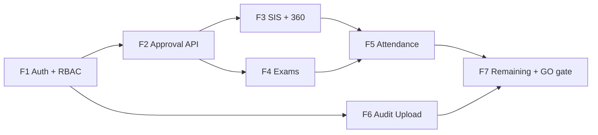

# Production Backend Roadmap

**Date:** 2026-06-18  
**Branch:** `feature/m15-theme`  
**Authority:** `docs/PRE_PRODUCTION_GAP_REPORT.md`, `docs/ORCHESTRATOR_AGENT.md`, `docs/API_PARITY_AUDIT.md`  
**Scope:** Class A workflows only — first real school with live backend  
**Constraint:** Planning document only · no app code changes

---

## Executive summary

| Metric | Value |
|--------|-------|
| **Current production API readiness** | **~45%** |
| **Target after Class A closure** | **≥92%** (real-school GO) |
| **Estimated calendar** | **10–14 weeks** (2 backend engineers + Agent A client wiring) |
| **Phases** | F1–F7 |
| **Critical path** | F1 → F2 → F3+F4 (parallel) → F5 → F6 → F7 gate |

This roadmap maps every **Class A** workflow from `docs/PRE_PRODUCTION_GAP_REPORT.md` to concrete API contracts, repository work, migration/rollback, and test gates. Client UI and governance adapters **do not change** in scope — only repository/API layers and server endpoints.

---

## Phase overview

| Phase | Name | Class A items | Duration | Readiness Δ | Cumulative |
|-------|------|---------------|----------|-------------|------------|
| **F1** | Auth + RBAC | A1, A10 | 1.5–2 wks | +8% | **~53%** |
| **F2** | Approval API | A2 (+ unlocks A6, A7) | 3–4 wks | +12% | **~65%** |
| **F3** | SIS + Student 360 | A8 | 1.5–2 wks | +6% | **~71%** |
| **F4** | Exams | A3 | 3–4 wks | +10% | **~81%** |
| **F5** | Attendance | A4, A5 | 2.5–3.5 wks | +8% | **~89%** |
| **F6** | Audit / event upload | A9 | 1 wk | +3% | **~92%** |
| **F7** | Remaining production APIs | A6, A7 completion + API-mode gates | 2–3 wks | +8% | **~100%** Class A |

---

## Critical path



**Serial dependencies (cannot skip):**

1. **F1** — all authenticated calls require production JWT + tenant headers  
2. **F2** — exam publish, leave, attendance correction, concession/refund principal paths depend on server-side approval records  
3. **F4** — requires F2 for `examResults` approval type resolution  
4. **F5** — attendance correction approve hooks into F2  
5. **F7** — integration gate: `ENABLE_API_MODE=true` + contract parity + Patrol with API fixtures

**Parallel opportunities:**

| Track | Can run parallel with | Notes |
|-------|----------------------|-------|
| F3 SIS/360 | F2 (after F1 complete) | Read-heavy; no approval dependency |
| F6 Audit upload | F4, F5 (after F1) | Independent ingestion pipeline |
| F4 exam CRUD (draft phases) | F2 approval API build | Publish/approve endpoints need F2 |
| F7 finance concession linkage | F5 attendance | Both need F2 complete |

---

## Cross-cutting conventions

### API envelope (align with existing client)

All new endpoints use the existing `ApiEnvelopeDto` pattern:

```json
{
  "success": true,
  "data": { },
  "error": null,
  "meta": { "requestId": "...", "cursor": "..." }
}
```

Headers (existing interceptors): `Authorization: Bearer <access>`, `X-Tenant-Id`, `X-School-Id`.

### Repository pattern (Agent A ownership)

For each workflow:

```
lib/core/repositories/interfaces/*.dart          ← contract (unchanged)
lib/core/repositories/mock/*.dart                ← reference implementation
lib/core/repositories/api/<module>/
  remote/*_remote_datasource.dart
  dto/*_dto.dart
  mapper/*_mapper.dart
  api_*_repository.dart
test/contracts/<module>/*_contract_test.dart
test/integration/<module>/*_integration_test.dart
```

### Feature flags (`repository_config.dart`)

| Flag | Phase |
|------|-------|
| `AUTH_API_ENABLED` | F1 |
| `APPROVAL_API_ENABLED` | F2 |
| `SIS_API_ENABLED` | F3 |
| `EXAM_API_ENABLED` | F4 |
| `ATTENDANCE_API_ENABLED` (new) | F5 |
| `AUDIT_API_ENABLED` | F6 |

Production school build: `ENABLE_API_MODE=true` + per-module flags on.

### Migration strategy (all phases)

1. **Dual-write window (optional):** Server authoritative; client writes API first, mock store as read-cache only when flag off  
2. **Cutover:** Enable module API flag per school tenant  
3. **Data import:** One-time scripts for exam SharedPreferences snapshot → server (F4 only)  
4. **No UI migration** — adapters and screens unchanged

### Rollback strategy (all phases)

1. Set module API flag `false` in tenant config → client reverts to mock/hybrid  
2. Server retains data; no client data loss except in-flight queue (audit)  
3. Approval decisions on server remain source of truth after cutover — rollback is **read-only mock**, not undo server state  
4. Document rollback in school runbook per phase

### Test strategy (all phases)

| Layer | Gate |
|-------|------|
| Contract | Mock ↔ API DTO mapper parity (`test/contracts/`) |
| Integration | Fake Dio against recorded OpenAPI examples (`test/integration/`) |
| Security | RBAC deny/allow per role (`test/security/`) |
| E2E | Patrol pilot closure 9/9 with `ENABLE_API_MODE=true` |
| Load | Idempotent submit endpoints (attendance, approval) — backend load test |

---

# Phase F1 — Auth + RBAC

**Class A:** A1 Authentication & tenant session · A10 RBAC & permission sync  
**Agent:** D (auth/security) + A (repository)  
**Effort:** **1.5–2 weeks**  
**Readiness:** 45% → **~53%**

---

## F1.1 — Authentication & tenant session (A1)

### Required API endpoints

| Method | Path | Purpose |
|--------|------|---------|
| `POST` | `/auth/login` | Start OTP session |
| `POST` | `/auth/verify-otp` | Issue tokens + user + permissions |
| `POST` | `/auth/refresh` | Rotate access token |
| `POST` | `/auth/logout` | Revoke current session |
| `POST` | `/auth/sessions/logout-all` | Revoke all sessions |
| `POST` | `/auth/sessions/revoke` | Admin revoke by session id |
| `GET` | `/auth/me` | Current user profile |
| `GET` | `/auth/permissions` | Permission sync (refresh without re-login) |

*Paths already defined in `lib/core/repositories/api/auth/remote/auth_api_paths.dart`.*

### Request models

| Model | Key fields |
|-------|------------|
| `LoginRequest` | `identifier`, `identifierType` (`email` \| `mobile`) |
| `VerifyOtpRequest` | `identifier`, `otp`, `sessionId` |
| `RefreshRequest` | `refreshToken` |
| `RevokeSessionRequest` | `sessionId`, `reason` |

*DTOs exist:* `auth_login_dto.dart`, `auth_verify_otp_dto.dart`, `auth_tokens_dto.dart`, `auth_user_dto.dart`.

### Response models

| Model | Key fields |
|-------|------------|
| `AuthSessionResponse` | `success`, `sessionId`, `message` |
| `AuthVerificationResponse` | `tokens` (access, refresh, expiresAt), `user`, `permissions[]` |
| `AuthUserResponse` | `id`, `displayName`, `erpRole`, `tenantId`, `schoolId`, `scope`, `childIds` |
| `ServerPermissionResponse` | `permission` (enum string), `source`, `expiresAt` |

### Repository changes

| File | Change |
|------|--------|
| `api_auth_repository.dart` | Harden error mapping; remove demo-only shortcuts |
| `auth_remote_datasource.dart` | Wire revoke/logout-all if stubbed |
| `auth_mapper.dart` | Map `ServerPermission` → `Permission` enum |
| `repository_providers.dart` | Production builds: **never** default to `MockAuthRepository` when `ENABLE_API_MODE=true` |
| Interceptors | JWT attach, 401 refresh, tenant headers |

### Existing mock implementation

`lib/core/repositories/mock/mock_auth_repository.dart` — demo OTP, role selection.

### Migration strategy

1. Provision school tenants + user accounts on server  
2. Disable `ENABLE_DEMO_AUTH` for production school flavor  
3. Permission payload replaces `UserPermissions.forRole()` after `verifyOtp`  
4. Existing secure token storage (`TokenStorage`) unchanged

### Rollback strategy

Re-enable `ENABLE_DEMO_AUTH=true` + `MockAuthRepository` for emergency UAT only — **not** for real student data.

### Test strategy

- `test/contracts/auth/` — DTO ↔ domain parity  
- `test/integration/auth/` — fake Dio login → refresh → permissions  
- `test/security/` — expired token, revoked session, tenant mismatch

### Dependencies

None (phase entry).

### Estimated effort

**M** — 1–1.5 weeks backend + 0.5 week client hardening.

---

## F1.2 — RBAC & permission sync (A10)

### Required API endpoints

| Method | Path | Purpose |
|--------|------|---------|
| `GET` | `/auth/permissions` | Full permission set for current user |
| `GET` | `/auth/me` | Role + scope changes (child ids for parent) |

*Optional server extension:*

| Method | Path | Purpose |
|--------|------|---------|
| `POST` | `/auth/permissions/refresh` | Force cache invalidation after role assignment |

### Request models

None (GET). Optional `If-None-Match` / `etag` for cache.

### Response models

```json
{
  "permissions": [
    { "permission": "manageExams", "source": "role:principal", "expiresAt": null }
  ],
  "etag": "perm-v2026-06-18",
  "syncedAt": "2026-06-18T12:00:00Z"
}
```

### Repository changes

| File | Change |
|------|--------|
| `RbacService` / permission cache | Refresh on login, resume, `permissions/refresh` |
| `route_guards.dart` | No change — consumes synced permissions |
| `mutation_permission_registry.dart` | No change — client registry; server enforces independently |

### Existing mock implementation

`UserPermissions.forRole(ErpRole)` — static role matrix in `lib/core/security/role_permissions.dart`.

### Migration strategy

1. Server emits permission strings matching `Permission` enum names (snake/camel alignment in mapper)  
2. On login: replace static matrix with server list  
3. Fallback: if permission sync fails, **deny mutations** (fail closed)

### Rollback strategy

Revert to `UserPermissions.forRole` only in demo mode flag.

### Test strategy

- `test/security/rbac/permission_coverage_test.dart` — extend with server payload fixtures  
- Route inventory test — all guarded routes with synced permissions  
- Deny tests for storekeeper, parent, teacher on ERP mutations

### Dependencies

F1.1 auth tokens.

### Estimated effort

**M** — 0.5–1 week (parallel with F1.1).

---

# Phase F2 — Approval API

**Class A:** A2 Unified principal approval center  
**Unlocks:** A3 publish gate, A5 correction resolve, A6 student leave, A7 finance concessions  
**Agent:** A + D  
**Effort:** **3–4 weeks**  
**Readiness:** ~53% → **~65%**

---

## F2.1 — Unified approval center (A2)

### Required API endpoints

| Method | Path | Purpose |
|--------|------|---------|
| `GET` | `/approvals` | List with filters (`status`, `type`, `category`, `pendingOnly`) |
| `GET` | `/approvals/pending` | Principal inbox default |
| `GET` | `/approvals/{id}` | Detail |
| `GET` | `/approvals/entity` | `findPendingByEntity(type, entityType, entityId)` |
| `POST` | `/approvals` | Submit (`SubmitApprovalRequest`) |
| `POST` | `/approvals/{id}/approve` | Approve |
| `POST` | `/approvals/{id}/reject` | Reject (comment required) |
| `POST` | `/approvals/{id}/cancel` | Cancel pending |
| `GET` | `/approvals/{id}/audit` | Audit trail |
| `POST` | `/approvals/audit` | Record client audit entry (optional) |

### Request models

Align with `lib/core/approvals/approval_requests.dart`:

| Domain | API body |
|--------|----------|
| `SubmitApprovalRequest` | `type`, `title`, `summary`, `requesterId`, `requesterName`, `entityType`, `entityId`, `payload` |
| `ApproveApprovalRequest` | `actorId`, `actorName`, `comment?` |
| `RejectApprovalRequest` | `actorId`, `actorName`, `comment` (required) |
| `CancelApprovalRequest` | `actorId`, `actorName`, `comment?` |

`ApprovalRequestType` enum — 14 values in `approval_request_type.dart` (pilot needs: `examResults`, `attendanceCorrection`, `studentLeave`, `staffLeave`, `feeConcession`, `feeStructure`, `inventoryPo`, `refund`).

### Response models

Align with `ApprovalRequest`, `ApprovalAuditEntry`, `ApprovalStatus`:

```json
{
  "id": "appr_123",
  "type": "examResults",
  "status": "pending",
  "title": "Unit Test Mathematics — 8A",
  "summary": "42 students processed",
  "requesterId": "teacher_001",
  "requesterName": "Priya Sharma",
  "entityType": "exam",
  "entityId": "exam_math_8a",
  "payload": { "examId": "exam_math_8a", "studentCount": 42 },
  "submittedAt": "2026-06-18T09:00:00Z",
  "resolvedAt": null,
  "tenantId": "tenant_demo",
  "schoolId": "school_demo"
}
```

### Repository changes

| File | Change |
|------|--------|
| `api_approval_repository.dart` | **Replace stub** with remote implementation |
| New: `approval_remote_datasource.dart` | Dio calls |
| New: `approval_*_dto.dart`, `approval_mapper.dart` | Snake_case ↔ domain |
| `approval_repository_provider` | API when `APPROVAL_API_ENABLED` |
| **Adapters (no UI change)** | `onApproved` / `onRejected` callbacks invoke server entity updates via respective module APIs |

### Existing mock implementation

`lib/core/repositories/mock/mock_approval_repository.dart` — in-memory list + audit.

`ApprovalCenterService` + 8 adapters in `lib/core/approvals/adapters/`.

### Migration strategy

1. Server becomes approval source of truth  
2. Client adapters: on approve, call **module webhook** (exam publish, leave status, finance apply) server-side — prefer **server orchestration** (single approve endpoint triggers domain handler)  
3. Remove dependency on `*GovernanceStore` for durable state when API on  
4. Seed demo approvals via API for UAT

### Rollback strategy

`APPROVAL_API_ENABLED=false` → `MockApprovalRepository`; server approvals frozen.

### Test strategy

- `test/contracts/approval/approval_repository_contract_test.dart` — extend API parity  
- `test/integration/approval/` — exam, leave, attendance, finance adapter chains  
- Idempotency: duplicate submit returns existing pending request

### Dependencies

**F1** complete.

### Estimated effort

**XL** — 3–4 weeks (highest leverage phase).

---

# Phase F3 — SIS + Student 360

**Class A:** A8 Authoritative student record  
**Agent:** A  
**Effort:** **1.5–2 weeks**  
**Readiness:** ~65% → **~71%**

---

## F3.1 — SIS registry & profile (A8 partial)

### Required API endpoints

*Existing paths in `sis_api_paths.dart` — verify/implement on server:*

| Method | Path | Purpose |
|--------|------|---------|
| `GET` | `/sis/dashboard` | SIS KPIs |
| `GET` | `/sis/students` | Paginated registry |
| `GET` | `/sis/students/{id}` | Profile |
| `PATCH` | `/sis/students/{id}` | Update profile |
| `PATCH` | `/sis/students/{id}/status` | Activate/deactivate |
| `GET` | `/sis/students/{id}/documents` | Document list |
| `POST` | `/sis/students/{id}/documents` | Upload metadata |
| `POST` | `/sis/students` | Create student |
| `GET` | `/sis/academic-assignment` | Class/section options |
| `POST` | `/sis/academic-assignment` | Bulk assign |

### Request models

`CreateStudentRequest`, `UpdateStudentRequest`, `UpdateStudentStatusRequest`, `UploadStudentDocumentRequest`, `AcademicAssignmentRequest` — from `lib/features/sis/sis_requests.dart`.

### Response models

`SisStudent`, `SisStudentProfile`, `SisDashboardData`, `PaginatedResult<SisStudent>` — from `sis_models.dart`.

### Repository changes

| File | Change |
|------|--------|
| `api_sis_repository.dart` / `hybrid_sis_repository.dart` | Remove silent mock fallback on reads in production |
| `sis_mapper.dart` | Canonical student id alignment (`sisStudentId`) |
| `repository_providers.dart` | Enforce `SIS_API_ENABLED` for production school |

### Existing mock implementation

`lib/core/repositories/mock/mock_sis_repository.dart` — seeded students ADM-* / SIS-STU-*.

### Migration strategy

1. Import student master from school CSV → `/sis/students` bulk  
2. Map legacy mock ids to server ids; update `MockCanonicalStudentRegistry` parity table for transition  
3. Disable mock registry in API mode

### Rollback strategy

`SIS_API_ENABLED=false` → mock seeds (data stale vs server).

### Test strategy

- SIS contract tests (extend if missing)  
- Identity crosswalk: teacher roster ↔ SIS ↔ parent child selector

### Dependencies

**F1** (tenant). Parallel with **F2**.

### Estimated effort

**M** — 1 week.

---

## F3.2 — Student 360 dossier (A8)

### Required API endpoints

*Existing client paths in `phase4_remote_datasource.dart`:*

| Method | Path | Purpose |
|--------|------|---------|
| `GET` | `/sis/students/{id}/360` | Full dossier (9 domains) |
| `GET` | `/sis/students/{id}/timeline` | Activity timeline |

### Request models

Query: `studentId`, tenant/school headers.

### Response models

`Student360Profile` domains: `identity`, `admissions`, `attendance`, `marks`, `homework`, `communication`, `fees`, `behaviour`, `transport`, `documents`, `parentInformation`, `risk`.

`StudentTimelineEvent[]` — `id`, `eventType`, `eventAt`, `title`, `summary`, `sourceModule`, `payload`.

### Repository changes

| File | Change |
|------|--------|
| `api_phase4_repositories.dart` (`ApiStudent360Repository`) | Harden mapper for all 9 tabs |
| `phase4_mapper.dart` | Parity with mock all domains |
| `student360RepositoryProvider` | No mock in production |

### Existing mock implementation

`lib/core/repositories/mock/mock_student_360_repository.dart`.

`test/contracts/student_360/student_360_repository_contract_test.dart`.

### Migration strategy

Server aggregates from attendance, exams, finance, comms micro-reads — no client-side merge.

### Rollback strategy

Mock profile for demo only.

### Test strategy

- Contract test: mock vs API mapper fixture per domain  
- Patrol: `pilot: student 360 dossier navigation` with API fixtures

### Dependencies

**F3.1** student ids. **F4/F5** improve marks/attendance domain freshness (can ship 360 with partial aggregates first).

### Estimated effort

**M** — 0.5–1 week (mostly server aggregation + mapper parity).

---

# Phase F4 — Exams

**Class A:** A3 Exam administration lifecycle  
**Agent:** A + B (read-only UI verification)  
**Effort:** **3–4 weeks**  
**Readiness:** ~71% → **~81%**

---

## F4.1 — Exam administration lifecycle (A3)

### Required API endpoints

*Proposed ERP academics namespace (new — align OpenAPI):*

| Method | Path | Purpose |
|--------|------|---------|
| `GET` | `/academics/exams` | List exams |
| `GET` | `/academics/exams/{examId}` | Get session |
| `POST` | `/academics/exams` | Create (draft) |
| `POST` | `/academics/exams/{examId}/schedule` | Schedule + provision mark slots |
| `POST` | `/academics/exams/{examId}/open-marks` | Open marks entry |
| `GET` | `/academics/exams/{examId}/marks` | List mark rows |
| `PATCH` | `/academics/exams/marks/{markEntryId}` | Update mark |
| `POST` | `/academics/exams/{examId}/process` | Process results |
| `POST` | `/academics/exams/{examId}/verify-coordinator` | Coordinator verify |
| `POST` | `/academics/exams/{examId}/submit-approval` | Submit to approval center (or via F2 POST `/approvals`) |
| `POST` | `/academics/exams/{examId}/publish` | Publish after approval (server validates approval id) |
| `GET` | `/academics/exams/students/{sisStudentId}/published` | Parent/student results |

*Teacher mobile overlap:* `TeacherApiPaths` (`/teacher/exams/marks`, `/process`, `/publish`) should delegate to same server resources.

### Request models

From `exam_administration_requests.dart`:

- `CreateExamAdministrationRequest`  
- `UpdateExamMarkRequest`  
- Coordinator verify: `{ "verifiedBy": "userId" }`  
- Publish: `{ "approvalId": "appr_..." }` (server validates)

### Response models

From `exam_administration_store.dart`:

- `ExamSession` — `id`, `title`, `subject`, `grade`, `section`, `phase`, `maxMarks`, `examType`, labels  
- `ExamMarkRecord` — `id`, `examId`, `sisStudentId`, `marksObtained`, `published`  
- `PublishedExamResult` — scores, grades, `markEntryId`

### Repository changes

| File | Change |
|------|--------|
| `api_exam_administration_repository.dart` | **Replace full stub** |
| New: `exam_administration_remote_datasource.dart`, DTOs, mapper | |
| `examAdministrationRepositoryProvider` | API mode: **remove SharedPreferences authority**; local persistence = offline cache only |
| `ExamAdministrationPersistence` | Demote to offline queue / read-through cache, not source of truth |
| `ExamResultsApprovalAdapter` | Approve triggers server publish endpoint |

### Existing mock implementation

`MockExamAdministrationRepository` → `ExamAdministrationStore` + `ExamAdministrationPersistence` (SharedPreferences).

`test/contracts/exam_administration/exam_administration_repository_contract_test.dart`.

`test/integration/exam_administration/exam_persistence_restart_integration_test.dart` — becomes offline-cache test.

### Migration strategy

1. **Export** device `akshara_exam_admin_v1` snapshot per school admin  
2. **Import** via `POST /academics/exams/import` (one-time bulk)  
3. Legacy key `akshara_exam_results_sync_v1` migration handled server-side  
4. Enable `EXAM_API_ENABLED` per tenant  
5. Cross-persona: published results via API invalidate parent/student caches (replace `MockExamResultsSyncStore` overlay)

### Rollback strategy

`EXAM_API_ENABLED=false` → local SharedPreferences store ( **data fork** — avoid after cutover).

### Test strategy

- Contract: full create → publish chain  
- Integration: approval-gated publish (requires F2)  
- Restart test: offline cache sync on resume, not primary persistence  
- Patrol: exam admin + marks + approval journeys

### Dependencies

**F1**, **F2** (publish approval), **F3** (student ids for mark slots).

### Estimated effort

**XL** — 3–4 weeks.

---

# Phase F5 — Attendance

**Class A:** A4 Class attendance submit · A5 Attendance correction  
**Agent:** A + B  
**Effort:** **2.5–3.5 weeks**  
**Readiness:** ~81% → **~89%**

---

## F5.1 — Teacher class attendance (A4)

### Required API endpoints

*Existing teacher paths (`teacher_api_paths.dart`) — implement server-side:*

| Method | Path | Purpose |
|--------|------|---------|
| `GET` | `/teacher/attendance/classes` | Today's classes |
| `GET` | `/teacher/attendance/students` | Roster for class/date |
| `PUT` | `/teacher/attendance/draft` | Save draft marks |
| `POST` | `/teacher/attendance/submit` | **Idempotent** submit + lock |
| `GET` | `/teacher/attendance/submissions/{id}` | Submission status |

*ERP admin read:*

| Method | Path | Purpose |
|--------|------|---------|
| `GET` | `/attendance/sessions` | Management corrections context |
| `GET` | `/attendance/sessions/{id}` | Detail |

### Request models

```json
{
  "classId": "8-A",
  "date": "2026-06-18",
  "marks": [
    { "sisStudentId": "SIS-STU-10418", "status": "present" }
  ],
  "idempotencyKey": "uuid"
}
```

### Response models

```json
{
  "submissionId": "att_sub_123",
  "status": "locked",
  "submittedAt": "...",
  "submittedBy": "teacher_001"
}
```

### Repository changes

| File | Change |
|------|--------|
| `api_teacher_repository.dart` | Wire `attendanceSubmit`, `attendanceDraft` |
| `mock_teacher_repository.dart` / `MockAttendanceSyncStore` | Reference only in demo |
| `mock_attendance_sync_store.dart` | Replace with API-backed cache + `attendance_sync_bridge` invalidation |
| New: `attendance_repository.dart` interface (optional) | Or extend teacher repo |

### Existing mock implementation

`MockAttendanceSyncStore` — in-memory teacher submit → parent KPI percent.

Patrol: `teacher_attendance_e2e_test.dart`, pilot closure attendance correction.

### Migration strategy

No historical import required for go-live; start fresh academic session on server.

### Rollback strategy

Mock sync store — parent KPI returns demo values.

### Test strategy

- Idempotent submit: duplicate POST returns same `submissionId`  
- Post-submit lock enforced server-side  
- Parent `getAttendance` reads server after sync

### Dependencies

**F1**, **F3** (student ids).

### Estimated effort

**L** — 1.5–2 weeks.

---

## F5.2 — Attendance correction (A5)

### Required API endpoints

| Method | Path | Purpose |
|--------|------|---------|
| `GET` | `/attendance/corrections` | List (filter by status) |
| `GET` | `/attendance/corrections/{id}` | Detail |
| `POST` | `/attendance/corrections` | Create (teacher/parent) |
| `PATCH` | `/attendance/corrections/{id}/status` | Internal status update |
| `POST` | `/attendance/corrections/{id}/submit-approval` | Link to F2 approval |

*On F2 approve:* server updates attendance record + correction status `approved`.

### Request models

From `attendance_correction_models.dart`:

- `CreateAttendanceCorrectionRequest` — `sisStudentId`, `date`, `requestedStatus`, `reason`, `submittedBy`  
- Status enum: `pending`, `approved`, `rejected`, `cancelled`

### Response models

`AttendanceCorrectionRequest` — full entity with timeline.

### Repository changes

| File | Change |
|------|--------|
| **New:** `api_attendance_correction_repository.dart` | Full implementation |
| **New:** remote + DTO + mapper | |
| `attendanceCorrectionRepositoryProvider` | Switch mock → API when `ATTENDANCE_API_ENABLED` |
| `AttendanceCorrectionApprovalAdapter` | `onApproved` → server webhook (prefer server-side) |
| `AttendanceCorrectionsAdminScreen` | Reads API list (no UI change) |

### Existing mock implementation

`MockAttendanceCorrectionRepository` → `AttendanceCorrectionStore` (in-memory).

`test/contracts/attendance/attendance_correction_repository_contract_test.dart`.

### Migration strategy

Open corrections only — no backfill.

### Rollback strategy

Mock store.

### Test strategy

- Contract tests  
- Integration: teacher submit → principal approve → parent KPI update  
- Patrol: attendance correction + admin screen

### Dependencies

**F2**, **F5.1**.

### Estimated effort

**L** — 1–1.5 weeks.

---

# Phase F6 — Audit / Event Upload

**Class A:** A9 Audit log upload  
**Agent:** D + A  
**Effort:** **1 week**  
**Readiness:** ~89% → **~92%**

---

## F6.1 — Audit batch upload (A9)

### Required API endpoints

| Method | Path | Purpose |
|--------|------|---------|
| `POST` | `/audit/events/batch` | Ingest batch (max 20 events) |
| `GET` | `/audit/events` | Query (finance audit register — optional) |

*Client DTO exists:* `audit_batch_upload_dto.dart`.

### Request models

`AuditBatchUploadRequestDto` — `events[]` with `id`, `type`, `timestamp`, `userId`, `tenantId`, `schoolId`, `correlationId`, `category`, `metadata`.

### Response models

`AuditBatchUploadResponseDto` — `acceptedCount`, `rejectedIds[]`.

### Repository changes

| File | Change |
|------|--------|
| `audit_remote_datasource.dart` | Enable in production (remove empty-response stub) |
| `audit_upload_providers.dart` | `AUDIT_API_ENABLED=true` → real uploader |
| `AuditUploadService` | No change — queue + retry logic complete |
| `AuditUploadQueue` | Keep SharedPreferences queue for offline |

### Existing mock implementation

No-op uploader when API disabled; local queue in `audit_upload_queue.dart`.

### Migration strategy

1. Enable flush on app resume + post-mutation  
2. Server dedupes by event `id`  
3. Finance audit register can pull from server GET (future) — local register remains export fallback

### Rollback strategy

Disable `AUDIT_API_ENABLED` — events queue locally only (compliance risk — document).

### Test strategy

- `test/integration/audit/` — batch upload fake Dio  
- Retry/backoff unit tests (existing)  
- Rejected id handling

### Dependencies

**F1** (auth). Parallel with F4/F5.

### Estimated effort

**M** — 1 week.

---

# Phase F7 — Remaining Production APIs

**Class A completion:** A6 Student leave · A7 Finance refunds/concessions server orchestration · API-mode production gates  
**Agent:** A + D + G  
**Effort:** **2–3 weeks**  
**Readiness:** ~92% → **~100%** Class A

---

## F7.1 — Student leave server orchestration (A6)

### Required API endpoints

*Parent (exist):*

| Method | Path | Purpose |
|--------|------|---------|
| `GET` | `/parent/leave` | History |
| `POST` | `/parent/leave` | Submit application |

*New server-side linkage:*

| Method | Path | Purpose |
|--------|------|---------|
| `PATCH` | `/parent/leave/{leaveId}/status` | Updated by approval handler |
| `GET` | `/parent/leave/{leaveId}/timeline` | Status + principal comment |

*Approval:* via F2 `type: studentLeave`.

### Request models

`ParentLeaveSubmitRequest` — existing DTO in `parent_leave_submit_request_dto.dart`.

### Response models

`LeaveRequest` — `id`, `status`, `timeline[]`, `type`, dates.

### Repository changes

| File | Change |
|------|--------|
| `api_parent_repository.dart` | Already has submit — add status refresh |
| `StudentLeaveApprovalAdapter` | Remove `StudentLeaveGovernanceStore` side effects when API on |
| `StudentLeaveGovernanceStore` | Demo-only when mock |

### Existing mock implementation

`MockParentWriteStore` + `StudentLeaveGovernanceStore`.

`test/contracts/mobile/parent_write_contract_test.dart`.

### Migration strategy

Open leave requests on server; principal decisions via F2 only.

### Rollback strategy

Governance store applies local timeline (demo).

### Test strategy

- Parent submit → F2 approve → parent history shows approved  
- Patrol pilot: parent leave + principal approvals

### Dependencies

**F2**, **F3** (child id).

### Estimated effort

**M** — 1 week (mostly server + adapter toggle).

---

## F7.2 — Finance refunds & concessions (A7)

### Required API endpoints

*Refunds (client exists — verify server orchestration with F2):*

| Method | Path | Purpose |
|--------|------|---------|
| `GET` | `/finance/refunds` | List |
| `POST` | `/finance/refunds` | Create |
| `POST` | `/finance/refunds/{id}/approve` | Approve (should require F2 `approvalId` or internal check) |
| `POST` | `/finance/refunds/{id}/reject` | Reject |

*Concessions / fee structures:*

| Method | Path | Purpose |
|--------|------|---------|
| `GET` | `/finance/scholarships` | Catalog |
| `POST` | `/finance/scholarships` | Create concession |
| `POST` | `/finance/fee-structures` | Create |
| `POST` | `/finance/fee-structures/{id}/activate` | Post-approval activate |
| `POST` | `/finance/concessions/assign` | Assign to student account |

*Approval types:* `feeConcession`, `feeStructure`, `refund` via F2.

### Request models

`CreateRefundRequest`, `ApproveRefundRequest`, `CreateScholarshipRequest` — finance DTOs exist.

### Response models

Finance domain models in `finance_models.dart`.

### Repository changes

| File | Change |
|------|--------|
| `api_finance_repository.dart` | Already wired — add approval-id validation |
| `FinanceApprovalGovernanceStore` | Demo-only when API on |
| `FeeConcessionApprovalAdapter`, refund adapters | Server is source of truth |

### Existing mock implementation

`MockFinanceRepository` + `FinanceApprovalGovernanceStore`.

`test/integration/approval/finance_approval_integration_test.dart`.

### Migration strategy

Align finance approve endpoints with F2 — single approve in approval center triggers finance state machine server-side (preferred).

### Rollback strategy

Governance store + mock finance.

### Test strategy

- Finance API integration tests with fake Dio  
- Refund redirect Patrol test with API mode  
- Concession assign → approve → ledger reflects discount

### Dependencies

**F2**.

### Estimated effort

**L** — 1.5–2 weeks.

---

## F7.3 — Production API-mode gates (cross-cutting)

### Required work

| Item | Description |
|------|-------------|
| `ENABLE_API_MODE=true` CI job | All Class A contract + integration tests |
| Per-module flags enforced | No silent `withMockWriteFallback` in production flavor |
| OpenAPI spec publish | `docs/openapi/` or external repo — Agent F |
| Patrol + API fixtures | 9/9 pilot closure with staging backend |
| Runbook | School onboarding, rollback, support escalation |

### Estimated effort

**M** — 0.5–1 week.

---

# Consolidated Class A matrix

| ID | Workflow | Phase | Effort | Classification |
|----|----------|-------|--------|----------------|
| A1 | Auth & session | F1 | M | Required |
| A10 | RBAC sync | F1 | M | Required |
| A2 | Unified approval | F2 | XL | Required |
| A8 | SIS + Student 360 | F3 | M | Required |
| A3 | Exam lifecycle | F4 | XL | Required |
| A4 | Class attendance | F5 | L | Required |
| A5 | Attendance correction | F5 | L | Required |
| A9 | Audit upload | F6 | M | Required |
| A6 | Student leave | F7 | M | Required |
| A7 | Finance refund/concession | F7 | L | Required |

---

# Real-school GO criteria

A school may go live on the **production backend** when **all** criteria pass:

### Technical gates

| # | Criterion | Verification |
|---|-----------|--------------|
| 1 | F1–F7 complete per school tenant | Checklist sign-off |
| 2 | `ENABLE_API_MODE=true` + all Class A module flags enabled | Build config |
| 3 | `flutter analyze` = 0 errors | CI |
| 4 | `flutter test` all pass including API contract/integration | CI |
| 5 | Patrol pilot closure **9/9** against staging API | QA report |
| 6 | No `ApiNotConnectedException` in Class A paths | Integration scan |
| 7 | No durable state in `*GovernanceStore` when API on | Code review |
| 8 | Exam data server-authoritative (not SharedPreferences primary) | F4 sign-off |
| 9 | Audit events reaching server (`acceptedCount > 0` in UAT) | F6 sign-off |
| 10 | RBAC deny tests pass for parent/teacher/storekeeper on ERP mutations | Security gate |

### Operational gates

| # | Criterion |
|---|-----------|
| 11 | School tenant provisioned (users, classes, students imported) |
| 12 | Runbook delivered (onboarding, rollback, support) |
| 13 | Data processing agreement + audit retention policy |
| 14 | Limited pilot cohort (≤500 students recommended) with hypercare week |

### Go / No-Go decision

| Scenario | Verdict |
|----------|---------|
| Mock/UAT / training school | **GO** today (documented limitations) |
| Real school, F1–F6 incomplete | **NO-GO** |
| Real school, F1–F7 complete, gates 1–14 pass | **GO** |
| Real school, API mode with any Class A stub remaining | **NO-GO** |

---

# Production-readiness recommendation

**Current state (2026-06-18):** The client is **production-UI-ready** on mock infrastructure (~72% operational, Patrol 9/9). The **production API path is ~45% ready** — no Class A workflow is end-to-end API-complete.

**Recommended execution:**

1. **Start F1 immediately** — blocks everything else; lowest risk, highest security return.  
2. **Staff F2 in parallel with F1 week 2** — approval API is the force multiplier; do not start F4 publish or F5 correction approve until F2 UAT passes.  
3. **Parallel F3 + F4 draft endpoints** after F1 — SIS/360 reads and exam CRUD through `process` without publish.  
4. **F5 after F2 + F3** — attendance needs student ids and approval resolution.  
5. **F6 anytime after F1** — low effort, compliance win.  
6. **F7 integration gate** — finance + leave orchestration + production CI job.  
7. **Target real-school GO:** week **12–14** from F1 kickoff with 2 backend engineers.

**Do not onboard a real school until F7 gates pass.** Continue mock/UAT pilots freely under `ENABLE_API_MODE=false`.

---

## References

| Document | Path |
|----------|------|
| Pre-production gaps | `docs/PRE_PRODUCTION_GAP_REPORT.md` |
| API parity (pilot) | `docs/API_PARITY_AUDIT.md` |
| Pilot closure cert | `docs/FINAL_PILOT_CLOSURE_REPORT.md` |
| Orchestrator | `docs/ORCHESTRATOR_AGENT.md` |
| Repository providers | `lib/core/repositories/repository_providers.dart` |
| Auth paths | `lib/core/repositories/api/auth/remote/auth_api_paths.dart` |
| Approval contract | `lib/core/repositories/interfaces/approval_repository.dart` |
| Exam contract | `lib/core/repositories/interfaces/exam_administration_repository.dart` |

---

**Document status:** Planning complete · no implementation · no commits.
