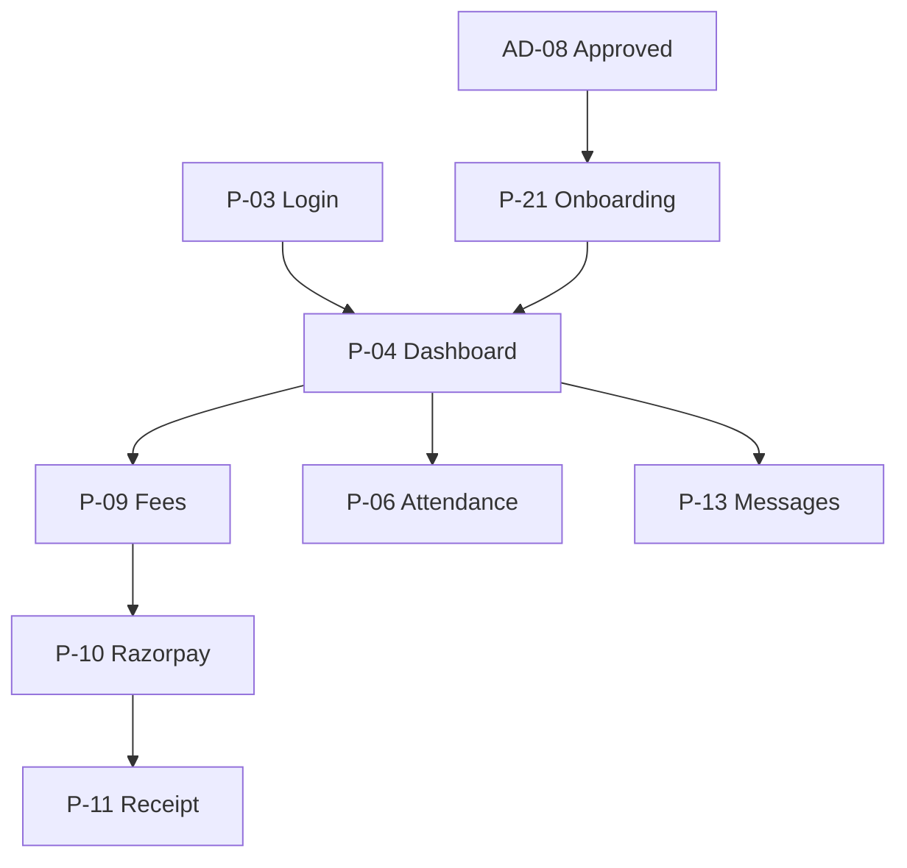

# Akshara ERP — Parent App Module Specification (Consolidated)

**Document ID:** `AKS-P-SPEC-v1.0`  
**Module:** Parent Mobile App  
**Screens:** P-01 → P-25  
**Platform:** Mobile primary (`390×844`) · Tablet (`834×1194`)  
**Source:** SRS Part 2 §2 · Part 6 §20 · Part 8/12 §4 · DesignSystem.md · Finance.md · Notifications.md · Principal.md

---

## Table of Contents

1. [Module Overview](#1-module-overview)
2. [User Roles & Permissions](#2-user-roles--permissions)
3. [Navigation & Information Architecture](#3-navigation--information-architecture)
4. [Shared Design Foundation](#4-shared-design-foundation)
5. [Shared Shell Layout](#5-shared-shell-layout)
6. [Shared Components](#6-shared-components)
7. [Auth & Onboarding](#7-auth--onboarding)
8. [P-04 — Parent Dashboard](#8-p-04--parent-dashboard)
9. [Academic Screens](#9-academic-screens)
10. [Fee Screens](#10-fee-screens)
11. [Communication Screens](#11-communication-screens)
12. [Transport & Events](#12-transport--events)
13. [Profile & Settings](#13-profile--settings)
14. [Dialogs & Wizards](#14-dialogs--wizards)
15. [Cross-Module Links](#15-cross-module-links)
16. [Prototype Flow Map](#16-prototype-flow-map)
17. [Responsive Rules](#17-responsive-rules)
18. [Figma File Organization](#18-figma-file-organization)
19. [Build Checklist](#19-build-checklist)

---

## 1. Module Overview

### Purpose

Mobile-first app for **parents/guardians** to monitor children, pay fees, communicate with teachers, track transport, download report cards and certificates, and receive school notifications (SRS Part 2 §2, Part 12 §4).

### Screen Inventory

| ID | Screen | Priority |
|----|--------|----------|
| P-01 | Splash | P0 |
| P-02 | Language Selection | P0 |
| P-03 | Login | P0 |
| P-04 | Parent Dashboard | P0 |
| P-05 | Child Selector | P0 |
| P-06 | Attendance | P0 |
| P-07 | Homework List | P0 |
| P-08 | Homework Detail | P0 |
| P-09 | Fee Overview | P0 |
| P-10 | Fee Payment (Razorpay) | P0 |
| P-11 | Fee Receipt | P0 |
| P-12 | Report Cards | P0 |
| P-13 | Teacher Messages | P0 |
| P-14 | Message Thread | P0 |
| P-15 | Bus Tracking | P1 |
| P-16 | Certificates | P1 |
| P-17 | School Events | P1 |
| P-18 | Notifications Inbox | P0 |
| P-19 | Discipline (read-only) | P1 |
| P-20 | PTM Booking | P1 |
| P-21 | Post-Admission Onboarding | P0 |
| P-22 | AI Copilot | P1 |
| P-23 | Profile | P0 |
| P-24 | Settings | P0 |
| P-25 | More Menu | P0 |

**Total frames (mobile):** 25 primary + 6 dialogs = **31**

### Quick Actions (Dashboard)

Pay Fee · Contact Teacher · Download Report Card (SRS Part 12 §4)

---

## 2. User Roles & Permissions

| Action | Parent | Guardian (delegated) |
|--------|--------|----------------------|
| View own children only | ✅ | ✅ mapped children |
| Pay fees | ✅ | ✅ if authorized |
| View attendance/homework | ✅ | ✅ |
| Message teachers | ✅ | ✅ |
| Bus tracking | ✅ if enrolled | ✅ |
| Download certificates | ✅ | ✅ |
| View discipline | 👁 parent_visible only | 👁 |
| View other students | ❌ | ❌ |
| School admin functions | ❌ | ❌ |

**Multi-child:** `parent_student_map` drives P-05 selector; all child-scoped screens show active child chip in AppBar.

---

## 3. Navigation & Information Architecture

### Bottom Navigation (Primary)

| Tab | Icon | Root screen |
|-----|------|-------------|
| Home | `home` | P-04 Dashboard |
| Academics | `school` | P-06 Attendance (hub) |
| Fees | `payments` | P-09 Fee Overview |
| Messages | `chat` | P-13 Teacher Messages |
| More | `menu` | P-25 More Menu |

### Screen Hierarchy

```
P-01 Splash → P-02 Language → P-03 Login
├── P-21 Onboarding (first login post-admission)
└── P-04 Dashboard
    ├── P-05 Child Selector (multi-child)
    ├── Academics branch
    │   ├── P-06 Attendance
    │   ├── P-07 Homework List → P-08 Detail
    │   └── P-12 Report Cards
    ├── Fees branch
    │   ├── P-09 Fee Overview → P-10 Payment → P-11 Receipt
    ├── P-13 Messages → P-14 Thread
    ├── P-15 Bus Tracking
    ├── P-16 Certificates
    ├── P-17 Events
    ├── P-18 Notifications → NT-02 pattern
    ├── P-19 Discipline
    ├── P-20 PTM Booking
    ├── P-22 AI Copilot
    └── P-23 Profile · P-24 Settings
```

---

## 4. Shared Design Foundation

> Reference **DesignSystem.md** — mobile tokens.

| Token | Mobile usage |
|-------|--------------|
| Content width | `358` (margin 16) |
| Touch target min | `48×48` |
| Bottom nav height | `80` (includes safe area) |
| AppBar height | `56` |

---

## 5. Shared Shell Layout

**Component:** `Shell/ParentMobileLayout`

```
P-XX [390×844]
└── Shell/ParentMobileLayout
    ├── Nav/AppBar-Parent [56]
    │   ├── Child chip (if multi-child) → P-05
    │   ├── Title
    │   └── Bell → P-18 · AI → P-22
    ├── Main/ScrollContent [Fill]
    └── Nav/BottomBar-Parent [80]
```

---

## 6. Shared Components

| Component | Use |
|-----------|-----|
| `Parent/ChildChip` | Active child name + class |
| `Parent/QuickActionRow` | 3 dashboard FABs |
| `Parent/FeeDueCard` | Amount + due date + Pay CTA |
| `Parent/AttendanceDayRow` | Calendar day status |
| `Academic/HomeworkCard` | Subject · due · status |
| `Comm/MessagePreviewRow` | Teacher thread preview |

---

## 7. Auth & Onboarding

### P-01 Splash

Logo · white-label school name · 2s → P-02 or P-04 if session valid

### P-02 Language Selection

7 languages (SRS) · persisted to Hive · continues to P-03

### P-03 Login

Phone + OTP **or** email + password · Forgot password link · Supabase Auth

### P-21 Post-Admission Onboarding

Triggered after `admission.approved` invite (AR-012):

| Step | Content |
|------|---------|
| 1 | Welcome + child name |
| 2 | Set password / PIN |
| 3 | Notification preferences |
| 4 | Link additional guardian (optional) |
| 5 | Dashboard tour |

---

## 8. P-04 — Parent Dashboard

| **Frame** | `P-04-Dashboard-M` |

### Layout Structure

| # | Section | Height |
|---|---------|--------|
| 1 | Child greeting hero | `120` |
| 2 | Quick actions | 3 × `104` cards |
| 3 | Today's summary | Attendance · Homework due · Fee status |
| 4 | Notices carousel | `140` horizontal scroll |
| 5 | Upcoming events | List 3 items |
| 6 | AI tip card | `88` optional |

### KPI Chips

Present/Absent today · `₹` due amount · Unread messages count

---

## 9. Academic Screens

### P-06 Attendance

| **Frame** | `P-06-Attendance-M` |

Monthly calendar · color-coded days · summary % · tap day → detail sheet (Present/Absent/Late/Holiday) · chronic absent warning banner

### P-07 / P-08 Homework

List: subject · title · due date · status chip (Pending/Submitted/Overdue)  
Detail: description · attachments · teacher note · submission status (read-only for parent)

### P-12 Report Cards

Term selector · PDF preview · Download · Share

### P-19 Discipline (read-only)

Incidents where `parent_visible = true` (PR-14) · severity chip · date · description · no edit

---

## 10. Fee Screens

### P-09 Fee Overview

| **Frame** | `P-09-Fees-M` |

Fee structure summary · paid vs pending · installment timeline · Pay Now CTA

### P-10 Fee Payment (Razorpay) — AR-013

| **Frame** | `P-10-FeePayment-M` |

| Step | UI |
|------|-----|
| 1 | Select installment / fee head |
| 2 | Amount breakdown (base + late fee if any) |
| 3 | Razorpay Checkout SDK |
| 4 | Processing spinner |
| 5 | Success → P-11 |

**Server flow:** Edge Function `create-payment-order` → Razorpay → webhook → `fee.received` notification

### P-11 Fee Receipt

Receipt number · amount · date · payment method · Download PDF · Share

---

## 11. Communication Screens

### P-13 / P-14 Messages

Thread list by teacher · unread badge · P-14 chat bubbles · attach image · no voice (P2)

### P-18 Notifications

Per **Notifications.md** mobile inbox pattern · categories · swipe read/archive · deep links

### P-22 AI Copilot

Chat dock · suggested prompts: "When is next fee due?" · "Show attendance this month" · role-scoped to active child

---

## 12. Transport & Events

### P-15 Bus Tracking

Map view · bus marker · ETA · route name · driver contact (masked) · delay alert banner (NT `bus.delay`)

### P-17 School Events

Calendar list · event detail · RSVP optional

### P-20 PTM Booking

PR-15 creates slots · parent selects available slot · confirmation · reminder notification

### P-16 Certificates

List from PR-13 issued certs · Download PDF · types: Bonafide, Achievement, etc.

---

## 13. Profile & Settings

### P-23 Profile

Parent name · phone · email · children list · school name

### P-24 Settings

Language · notifications (NT-D-03 pattern) · app PIN · biometric lock · logout

### P-25 More Menu

Grid: Events · Bus · Certificates · Discipline · PTM · AI · Settings · Help

---

## 14. Dialogs & Wizards

| ID | Name | Used on |
|----|------|---------|
| P-D-01 | ChildSwitch | AppBar chip |
| P-D-02 | PaymentConfirm | P-10 |
| P-D-03 | PaymentFailed | P-10 |
| P-D-04 | ContactTeacher | P-04 quick action |
| P-D-05 | DownloadReport | P-12 |
| P-D-06 | PTMConfirm | P-20 |

---

## 15. Cross-Module Links

| From | To | Trigger |
|------|-----|---------|
| P-10 payment | Finance FN-02 | Webhook updates ledger |
| P-18 | Notifications.md | Inbox + deep links |
| P-16 | Principal PR-13 | Certificate source |
| P-19 | Principal PR-14 | Discipline records |
| P-20 | Principal PR-15 | PTM slots |
| P-21 | Admissions AD-08 | Post-approve invite |
| AD-D-09 | P-21 | Parent account provision |
| P-06/07/12 | Academic.md | Data source |
| P-15 | Transport TR-08 | Live GPS |

---

## 16. Prototype Flow Map



---

## 17. Responsive Rules

| Element | Mobile | Tablet |
|---------|--------|--------|
| Bottom nav | 5 tabs | 5 tabs + rail optional |
| Dashboard grid | 1 col | 2 col cards |
| Fee payment | Fullscreen | Centered `480` modal |
| Map | Full bleed | Split map + details |

---

## 18. Figma File Organization

```
📁 01 — Parent App
├── Shell · Components
├── P-01 → P-25 [M/T]
├── Dialogs P-D-01 → P-D-06
└── Prototype: Pay fee · View attendance
```

**Frame naming:** `P-{##}-{ScreenName}-M|T`

---

## 19. Build Checklist

| Step | Task |
|------|------|
| 1 | Shell + bottom nav + Design System |
| 2 | P-03 login + P-04 dashboard (P0) |
| 3 | P-09–P-11 fee + Razorpay flow |
| 4 | P-06 attendance + P-07/08 homework |
| 5 | P-13/14 messages |
| 6 | P-18 notifications |
| 7 | P-21 onboarding wizard |
| 8 | P-12, P-15, P-16, P-19, P-20 (P1) |
| 9 | P-22 AI copilot |
| 10 | Tablet variants + accessibility |

---

**End of Parent App Module Specification v1.0**
