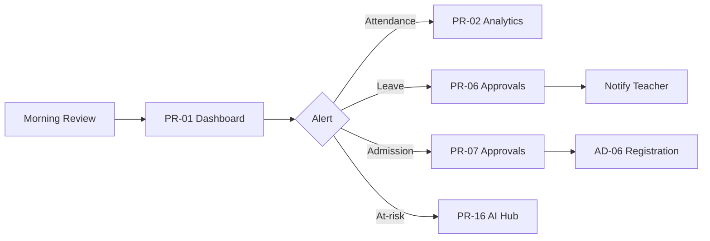
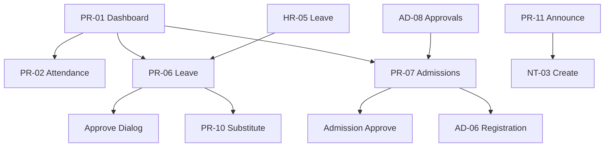

# Akshara ERP — Principal Portal Module Specification (Consolidated)

**Document ID:** `AKS-PR-SPEC-v1.0`  
**Module:** Principal Portal  
**Screens:** PR-01 → PR-16  
**Platform:** Web primary (`1440×1024`) · Tablet (`834×1194`) · Mobile companion (`390×844`)  
**Source:** SRS Part 2 · Part 6 §8 · Part 8/12 §7 · Part 14 · DesignSystem.md · Management.md · HR.md · Admissions.md

---

## Table of Contents

1. [Module Overview](#1-module-overview)
2. [User Roles & Permissions](#2-user-roles--permissions)
3. [Navigation & Information Architecture](#3-navigation--information-architecture)
4. [Shared Design Foundation](#4-shared-design-foundation)
5. [Shared Shell Layout](#5-shared-shell-layout)
6. [Shared Components](#6-shared-components)
7. [PR-01 — Principal Dashboard](#7-pr-01--principal-dashboard)
8. [PR-02 — Attendance Analytics](#8-pr-02--attendance-analytics)
9. [PR-03 — Timetable Management](#9-pr-03--timetable-management)
10. [PR-04 — Staff Attendance Monitor](#10-pr-04--staff-attendance-monitor)
11. [PR-05 — Teacher Management](#11-pr-05--teacher-management)
12. [PR-06 — Leave Approvals](#12-pr-06--leave-approvals)
13. [PR-07 — Admission Approvals](#13-pr-07--admission-approvals)
14. [PR-08 — Exam Analytics](#14-pr-08--exam-analytics)
15. [PR-09 — Academic Planning](#15-pr-09--academic-planning)
16. [PR-10 — Substitute Manager](#16-pr-10--substitute-manager)
17. [PR-11 — Announcements](#17-pr-11--announcements)
18. [PR-12 — Global Search](#18-pr-12--global-search)
19. [PR-13 — Certificates](#19-pr-13--certificates)
20. [PR-14 — Behaviour & Discipline](#20-pr-14--behaviour--discipline)
21. [PR-15 — PTM Scheduling](#21-pr-15--ptm-scheduling)
22. [PR-16 — AI Insights Hub](#22-pr-16--ai-insights-hub)
23. [Dialogs & Wizards](#23-dialogs--wizards)
24. [Cross-Module Links](#24-cross-module-links)
25. [Prototype Flow Map](#25-prototype-flow-map)
26. [Responsive Rules](#26-responsive-rules)
27. [Figma File Organization](#27-figma-file-organization)
28. [Build Checklist](#28-build-checklist)

---

## 1. Module Overview

### Purpose

Operational academic leadership portal for **Principal** and **Vice Principal**: school-wide attendance oversight, timetable governance, teacher and leave management, admission approvals, exam analytics, announcements, discipline, PTM coordination, and AI-assisted insights (SRS Part 6 §8–9, Part 12 §7).

**Ownership split (per ArchitectureReview AR-048):**

| Portal | Scope |
|--------|-------|
| **Principal (this module)** | Class-level operational analytics, approvals, daily academic control |
| **Management MG-04** | Executive summary performance — Principal has 👁 read on MG-04 only |

Principal **does not** access finance amounts, payroll, or fee collection (SRS Part 6 §8).

### Screen Inventory

| ID | Screen | Primary Users | Priority |
|----|--------|---------------|----------|
| PR-01 | Principal Dashboard | Principal, Vice Principal | P0 |
| PR-02 | Attendance Analytics | Principal, Vice Principal | P0 |
| PR-03 | Timetable Management | Principal | P0 |
| PR-04 | Staff Attendance Monitor | Principal, Vice Principal 👁 | P0 |
| PR-05 | Teacher Management | Principal | P0 |
| PR-06 | Leave Approvals | Principal 🔒 | P0 |
| PR-07 | Admission Approvals | Principal 🔒 | P0 |
| PR-08 | Exam Analytics | Principal | P1 |
| PR-09 | Academic Planning | Principal | P1 |
| PR-10 | Substitute Manager | Principal | P1 |
| PR-11 | Announcements | Principal | P0 |
| PR-12 | Global Search | Principal, Vice Principal | P1 |
| PR-13 | Certificates | Principal | P1 |
| PR-14 | Behaviour & Discipline | Principal, Class Teacher 👁 | P1 |
| PR-15 | PTM Scheduling | Principal | P1 |
| PR-16 | AI Insights Hub | Principal | P1 |

**Total frames (desktop):** 16 primary + 8 dialogs = **24**

### Key User Flows



---

## 2. User Roles & Permissions

| Action | Principal | Vice Principal | Management | Teacher |
|--------|-----------|----------------|------------|---------|
| View principal portal | ✅ | ✅ delegated | 👁 partial | ❌ |
| Approve teacher leave | 🔒 | 🔒 delegated | ❌ | ❌ submit |
| Approve admissions | 🔒 | 🔒 delegated | 👁 | ❌ |
| Edit timetable | ✅ | 👁 | ❌ | ❌ |
| Publish announcements | ✅ | ✅ | ❌ | ❌ |
| View staff attendance | ✅ | ✅ | 👁 | ❌ |
| Override student attendance | ❌ | ❌ | ❌ | ✅ class only |
| Manual staff attendance override | ❌ | ❌ | ❌ | ❌ (HR only) |
| View salary / fees | ❌ | ❌ | ✅ | ❌ |
| Issue certificates | ✅ | ✅ | ❌ | ❌ |
| Log discipline incidents | ✅ | ✅ | ❌ | 👁 class teacher |
| Assign substitute teacher | ✅ | ✅ | ❌ | ❌ |
| Global search PII | ✅ school scope | ✅ | 👁 | ❌ assigned only |

### Staff Attendance Boundary (AR-028)

| System | Role | Capability |
|--------|------|------------|
| Teacher mobile app | Teacher | **Capture** geo+face check-in |
| HR-04 Staff Attendance | HR Manager | Admin view + manual override (audited) |
| **PR-04 Staff Monitor** | Principal | **Read-only oversight** — no override |

---

## 3. Navigation & Information Architecture

### Side Navigation

| # | Label | Icon | Screen |
|---|-------|------|--------|
| 1 | Dashboard | `dashboard` | PR-01 |
| 2 | Attendance | `fact_check` | PR-02 |
| 3 | Timetable | `calendar_month` | PR-03 |
| 4 | Staff Monitor | `badge` | PR-04 |
| 5 | Teachers | `school` | PR-05 |
| 6 | Leave | `event_busy` | PR-06 |
| 7 | Admissions | `how_to_reg` | PR-07 |
| 8 | Exams | `grading` | PR-08 |
| 9 | Planning | `auto_stories` | PR-09 |
| 10 | Substitutes | `swap_horiz` | PR-10 |
| 11 | Announce | `campaign` | PR-11 |
| 12 | Search | `search` | PR-12 |
| 13 | Certificates | `workspace_premium` | PR-13 |
| 14 | Discipline | `gavel` | PR-14 |
| 15 | PTM | `groups` | PR-15 |
| 16 | AI Insights | `psychology` | PR-16 |

### Screen Hierarchy

```
PR-01 Dashboard
├── PR-02 Attendance Analytics
│   └── Drill: class · section · student
├── PR-03 Timetable Management
│   └── Dialog: Period Edit · Conflict Resolve
├── PR-04 Staff Attendance Monitor (read-only)
├── PR-05 Teacher Management
│   └── Dialog: Assign Class · Deactivate
├── PR-06 Leave Approvals
│   └── Dialog: Approve / Reject
├── PR-07 Admission Approvals
│   └── Dialog: Approve / Reject / Request Docs
├── PR-08 Exam Analytics
├── PR-09 Academic Planning
├── PR-10 Substitute Manager
│   └── Wizard: Assign Substitute
├── PR-11 Announcements
│   └── Wizard: Create Announcement → Notifications.md
├── PR-12 Global Search
├── PR-13 Certificates
│   └── Wizard: Generate Certificate
├── PR-14 Behaviour & Discipline
│   └── Dialog: Log Incident
├── PR-15 PTM Scheduling
└── PR-16 AI Insights Hub
```

### Global Search (SRS Part 12 §16)

Available on PR-12 and via AppBar shortcut (`⌘K` / search icon):

Students · Teachers · Classes · Attendance records · Reports (no fee amounts)

---

## 4. Shared Design Foundation

> Reference **DesignSystem.md** for full tokens. Apply once per module.

| Breakpoint | Content width |
|------------|---------------|
| Desktop | `1136` |
| Tablet | `786` |
| Mobile | `358` |

**Module accent usage:** Attendance risk `error` · On track `success` · Pending approval `warning` · Academic insight `primary-container`

---

## 5. Shared Shell Layout

**Component:** `Shell/PrincipalLayout`

```
PR-XX [1440×1024]
└── Shell/PrincipalLayout
    ├── Nav/Rail-Principal [256×Fill]
    └── Main/ContentColumn [Fill×Fill scroll]
        ├── Nav/AppBar [64]
        ├── Filter/AcademicFilterBar [56]
        ├── [Screen body]
        └── Spacer/Bottom [32]
```

| App bar left | `Principal / {Screen}` breadcrumb + page title |
| App bar center | Global search trigger → PR-12 |
| App bar right | AI Assist · Notifications · Avatar |

**Filter bar defaults:** Academic Year · Campus/Branch · Class range (where applicable)

---

## 6. Shared Components

Uses global: `Data/KPI` · `Data/Table` · `Data/ChartCard` · `Feedback/Banner` · `AI/InsightCard` · `AI/RiskCard`

**Principal-specific:**

| Component | Size | Use |
|-----------|------|-----|
| `Approval/AcademicQueueRow` | `88px` | Leave · admission queue |
| `Attendance/RiskBadge` | chip | AI at-risk flag on student rows |
| `Academic/ClassSummaryCard` | `272×160` | Dashboard class tiles |
| `Staff/MonitorRow` | `72px` | PR-04 read-only status |

---

## 7. PR-01 — Principal Dashboard

| Property | Value |
|----------|-------|
| **Frame** | `PR-01-PrincipalDashboard-D` |
| **Nav active** | Dashboard |
| **Scroll height** | ~`1280` |

### Layout Structure

| # | Section | Size |
|---|---------|------|
| 1 | Filter bar | AY · Campus |
| 2 | KPI row | 6 × `176×120` |
| 3 | Charts | `624×320` attendance trend + `496×320` class comparison |
| 4 | Approval queues | Split `560×280` leave · `560×280` admissions |
| 5 | At-risk students | AI list `1136×240` |
| 6 | Today's timetable snapshot | `1136×200` |
| 7 | AI morning briefing | `1136×108` |

### KPI Definitions

| # | Label | Example | Accent |
|---|-------|---------|--------|
| 1 | Student Attendance Today | 94.2% | success / warning |
| 2 | Staff Present | 98% | success |
| 3 | Pending Leave | 5 | warning |
| 4 | Pending Admissions | 3 | warning |
| 5 | At-Risk Students | 12 | error |
| 6 | Upcoming Exams | 2 this week | primary |

### Prototype Links

| From | To |
|------|-----|
| KPI Attendance | PR-02 |
| KPI Leave | PR-06 |
| KPI Admissions | PR-07 |
| At-risk list | PR-16 |
| Timetable snapshot | PR-03 |

---

## 8. PR-02 — Attendance Analytics

| Property | Value |
|----------|-------|
| **Frame** | `PR-02-AttendanceAnalytics-D` |
| **Purpose** | School-wide student attendance analysis |

### Layout Structure

| # | Section | Size |
|---|---------|------|
| 1 | Filter bar | Date range · Class · Section |
| 2 | KPI row | 4 × `272×88` | Today · Week · Month · Chronic absentees |
| 3 | Charts | `560×320` trend line · `560×320` class heatmap |
| 4 | Chronic absentee table | Sortable with AI risk column |
| 5 | Class drill panel | `400px` drawer on row select |

### Table Columns

`Student 180 · Class 80 · Section 80 · Present 80 · Absent 80 · % 80 · Streak 80 · AI Risk 100 · Actions 96`

### Charts

Daily attendance 30-day line · Class×Day heatmap · Absenteeism by reason donut (if captured)

---

## 9. PR-03 — Timetable Management

| Property | Value |
|----------|-------|
| **Frame** | `PR-03-TimetableManagement-D` |
| **Purpose** | View and edit master timetable; resolve conflicts |

### Layout Structure

| # | Section |
|---|---------|
| 1 | Filter bar | Class · Week |
| 2 | View toggle | Grid · List |
| 3 | Timetable grid | Periods × Days with teacher + room |
| 4 | Conflict sidebar | `320px` — clashes highlighted |
| 5 | AI suggest panel | Reschedule recommendations |

### Grid Cell

Period · Subject · Teacher avatar · Room · Substitute badge if applicable

### Actions

Edit period · Swap teacher · AI reschedule · Publish to students/teachers

---

## 10. PR-04 — Staff Attendance Monitor

| Property | Value |
|----------|-------|
| **Frame** | `PR-04-StaffMonitor-D` |
| **Purpose** | Read-only oversight of staff check-in status |
| **Note** | No override — HR-04 owns admin actions (AR-028) |

### Layout Structure

| # | Section |
|---|---------|
| 1 | Filter bar | Date · Department |
| 2 | KPI row | Present · Late · Absent · On leave |
| 3 | Staff status table | Real-time from Teacher app check-ins |
| 4 | Department summary chart | `480×280` bar |

### Table Columns

`Employee 160 · Role 120 · Dept 120 · Check-in 120 · Method 100 · Status 100 · Location 140 · Actions 80`

### Actions Column

**View only** — link to HR-04 for HR admin; no edit buttons for Principal

### Method Badges

Geo+Face `success` · QR `primary` · Manual `warning` (HR override — link to audit)

---

## 11. PR-05 — Teacher Management

| Property | Value |
|----------|-------|
| **Frame** | `PR-05-TeacherManagement-D` |

### Layout Structure

| # | Section |
|---|---------|
| 1 | Filter bar | Department · Subject · Status |
| 2 | KPI row | Total · Active · On leave · Substitute needed |
| 3 | Teacher table |
| 4 | Detail drawer | Classes · subjects · contact · performance summary |

### Table Columns

`Teacher 180 · Employee ID 100 · Subjects 160 · Classes 120 · Attendance 100 · Leave 80 · Status 100 · Actions 96`

### Actions

Assign class · View profile → HR-02 👁 · Deactivate (with HR workflow)

---

## 12. PR-06 — Leave Approvals

| Property | Value |
|----------|-------|
| **Frame** | `PR-06-LeaveApprovals-D` |
| **Canonical owner** | Teacher leave approval (HR-05 routes here for teachers) |

### Layout Structure

| # | Section |
|---|---------|
| 1 | Tabs | Pending · Approved · Rejected |
| 2 | Filter bar | Type · Department · Date |
| 3 | Approval queue table |
| 4 | Detail panel | Leave timeline · substitute impact · class coverage |

### Table Columns

`Teacher 160 · Type 100 · From 100 · To 100 · Days 60 · Classes Affected 140 · Substitute 100 · Submitted 110 · Actions 120`

### Principal Actions

Approve · Reject (reason required) · Request clarification

### Post-approve

→ Notification to teacher (NT event `leave.approved`) · PR-10 substitute prompt if classes uncovered · Audit `leave.approval`

### HR-05 Relationship

HR-05 shows all leave for HR admin. Teacher-submitted leave pending Principal approval displays **"Awaiting Principal"** with deep link to PR-06.

---

## 13. PR-07 — Admission Approvals

| Property | Value |
|----------|-------|
| **Frame** | `PR-07-AdmissionApprovals-D` |
| **Canonical with** | AD-08 (same queue; AD-08 is counselor-facing list, PR-07 is approver view) |

### Layout Structure

| # | Section |
|---|---------|
| 1 | Filter bar | Class · Status · Counselor |
| 2 | Approval queue table |
| 3 | Detail split | Application · documents · fee plan summary (no edit) · AI admission score |

### Table Columns

`Student 180 · Class 80 · Counselor 120 · Docs 80 · Fee plan 100 · Submitted 110 · AI Score 80 · Actions 120`

### Principal Actions

Approve · Reject (reason) · Request more documents

### Post-approve Flow

→ AD-06 registration · Student SIS · Parent invite · Audit `admission.approval` (AR-037)

---

## 14. PR-08 — Exam Analytics

| Property | Value |
|----------|-------|
| **Frame** | `PR-08-ExamAnalytics-D` |
| **Purpose** | Exam outcomes, class comparisons, weak subjects |

### Layout Structure

| # | Section |
|---|---------|
| 1 | Filter bar | Exam · Term · Class |
| 2 | KPI row | Pass % · Distinction % · Avg score · Failed count |
| 3 | Charts | Subject performance bar · Class comparison · Distribution histogram |
| 4 | Weak subject table | AI-flagged subjects |
| 5 | Student at-risk from exams | Link to PR-02 / PR-16 |

### Ownership Note

Detailed report card generation lives in future **Academic.md** (AC-05). PR-08 is analytics and oversight.

---

## 15. PR-09 — Academic Planning

| Property | Value |
|----------|-------|
| **Frame** | `PR-09-AcademicPlanning-D` |

### Sections

Academic calendar · Syllabus coverage tracker · Exam schedule planner · Holiday calendar · Co-curricular events

### Layout

Tabbed: Calendar · Syllabus · Exams · Events

---

## 16. PR-10 — Substitute Manager

| Property | Value |
|----------|-------|
| **Frame** | `PR-10-SubstituteManager-D` |
| **Source** | SRS Part 2 substitute workflow (AR-043) |

### Layout Structure

| # | Section |
|---|---------|
| 1 | Filter bar | Date · Class |
| 2 | Open slots table | Uncovered periods from leave/absence |
| 3 | Available teachers panel | Subject match · workload score |
| 4 | AI recommendation | Best substitute ranked |

### Wizard: Assign Substitute

Select slot → Select teacher → Confirm → Update timetable → Notify teacher + class

---

## 17. PR-11 — Announcements

| Property | Value |
|----------|-------|
| **Frame** | `PR-11-Announcements-D` |
| **Integrates** | Notifications.md (NT-03 Create) |

### Layout Structure

| # | Section |
|---|---------|
| 1 | Tabs | Draft · Scheduled · Sent |
| 2 | CTA | Create Announcement |
| 3 | Announcement table | Title · audience · channels · sent date |
| 4 | Preview panel | Multi-language preview |

### Create Flow

PR-11 → Wizard PR-D-05 → NT-03 audience selection → translate → publish

### Channels

Push · SMS · Email · WhatsApp deep link (per Notifications.md)

---

## 18. PR-12 — Global Search

| Property | Value |
|----------|-------|
| **Frame** | `PR-12-GlobalSearch-D` |
| **Also** | AppBar overlay modal `560×480` |

### Search Categories

Students · Teachers · Classes · Attendance · Reports

### Result Row

Avatar · Name · Role/Class · Quick actions (view profile · attendance · message)

### Restrictions

No fee amounts · No salary · Scoped to `school_id`

---

## 19. PR-13 — Certificates

| Property | Value |
|----------|-------|
| **Frame** | `PR-13-Certificates-D` |

### Certificate Types

Bonafide · Transfer · Character · Achievement · Course completion

### Layout

Template gallery · Student selector · Preview · Generate PDF → Parent download (future P-16)

---

## 20. PR-14 — Behaviour & Discipline

| Property | Value |
|----------|-------|
| **Frame** | `PR-14-BehaviourDiscipline-D` |

### Layout Structure

| # | Section |
|---|---------|
| 1 | Filter bar | Class · Severity · Date |
| 2 | KPI row | Incidents MTD · Warnings · Suspensions |
| 3 | Incident log table |
| 4 | Student behaviour timeline | On row select |

### Table Columns

`Student 160 · Class 80 · Type 100 · Severity 80 · Date 100 · Reported By 120 · Status 100 · Actions 96`

### Parent Visibility

Incidents marked `parent_visible` appear in future Parent.md (read-only)

---

## 21. PR-15 — PTM Scheduling

| Property | Value |
|----------|-------|
| **Frame** | `PR-15-PTMScheduling-D` |

### Layout

PTM event creator · Slot grid per class · Parent booking status · Teacher availability

### Flow

Principal creates PTM event → Parents book slots (Parent P-23 future) → Reminders via Notifications

---

## 22. PR-16 — AI Insights Hub

| Property | Value |
|----------|-------|
| **Frame** | `PR-16-AIInsights-D` |
| **Source** | SRS Part 14 Principal AI |

### Insight Categories

Attendance risk · Weak subjects · Teacher workload · Admission yield · Discipline trends · Substitute suggestions

### Layout

Filter chips · Insight cards grid · Copilot chat dock · Suggested actions with one-click navigation

### Example Prompts

"Show classes below 85% attendance this week" · "Which teachers need substitute cover tomorrow?" · "List admission applications pending over 7 days"

---

## 23. Dialogs & Wizards

| ID | Name | Size | Used on |
|----|------|------|---------|
| PR-D-01 | LeaveApprove | 400 | PR-06 |
| PR-D-02 | LeaveReject | 400 | PR-06 |
| PR-D-03 | AdmissionApprove | 560 | PR-07 |
| PR-D-04 | AdmissionReject | 400 | PR-07 |
| PR-D-05 | CreateAnnouncement | 720 wizard | PR-11 |
| PR-D-06 | AssignSubstitute | 560 | PR-10 |
| PR-D-07 | LogIncident | 560 | PR-14 |
| PR-D-08 | GenerateCertificate | 720 wizard | PR-13 |

---

## 24. Cross-Module Links

| From | To | Trigger |
|------|-----|---------|
| PR-06 | HR-05 | Leave source data |
| PR-07 | AD-08 / AD-06 | Admission queue · post-approve registration |
| PR-04 | HR-04 | Staff attendance source (read-only) |
| PR-05 | HR-02 | Employee profile 👁 |
| PR-11 | Notifications NT-03 | Publish announcement |
| PR-06 approve | PR-10 | Uncovered class → substitute |
| PR-01 | MG-04 | Executive performance 👁 link |
| PR-13 | Parent P-16 | Certificate download |
| PR-14 | Parent P-19 | Visible discipline incidents |
| PR-08/09 | Academic AC-02/07 | Exam + calendar data |
| PR-03 | Academic AC-03 | Timetable administration |
| Any | AI Copilot | Principal-scoped context |
| Approvals | FN-10 Audit | All approve/reject → audit event |

---

## 25. Prototype Flow Map



---

## 26. Responsive Rules

| Element | Desktop | Tablet | Mobile |
|---------|---------|--------|--------|
| Nav | 256 expanded | 72 collapsed | Drawer |
| KPI | 6-up | 3×2 | 2×2 |
| Timetable grid | Full grid | Horizontal scroll | Day view stacked |
| Approval detail | 400 drawer | Bottom sheet | Fullscreen |
| Global search | Modal overlay | Fullscreen | Fullscreen |

---

## 27. Figma File Organization

```
📁 05 — Principal Portal
├── Shell · Components
├── PR-01 → PR-16 [D/T/M]
├── Dialogs PR-D-01 → PR-D-08
└── Prototype Flows
```

**Frame naming:** `PR-{##}-{ScreenName}-{D|T|M}`

---

## 28. Build Checklist

| Step | Task |
|------|------|
| 1 | Shell + link Design System library |
| 2 | PR-01 dashboard (P0) |
| 3 | PR-06 leave approvals + dialogs |
| 4 | PR-07 admission approvals + AD-08 alignment |
| 5 | PR-02 attendance analytics |
| 6 | PR-04 staff monitor (read-only) |
| 7 | PR-03 timetable + PR-10 substitute |
| 8 | PR-11 announcements → Notifications integration |
| 9 | PR-05, PR-08, PR-09, PR-12–PR-16 |
| 10 | Tablet + mobile variants |
| 11 | Prototype: morning principal workflow |
| 12 | AI insight card variants |
| 13 | Accessibility pass |

---

**End of Principal Portal Module Specification v1.0**
