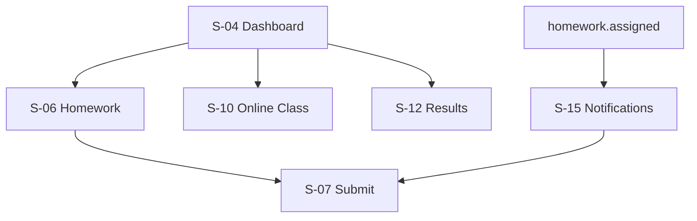

# Akshara ERP — Student App Module Specification (Consolidated)

**Document ID:** `AKS-S-SPEC-v1.0`  
**Module:** Student Mobile App  
**Screens:** S-01 → S-20  
**Platform:** Mobile primary (`390×844`) · Tablet (`834×1194`)  
**Source:** SRS Part 2 · Part 6 §21 · Part 8/12 §3 · DesignSystem.md · Academic.md

---

## Table of Contents

1. [Module Overview](#1-module-overview)
2. [User Roles & Permissions](#2-user-roles--permissions)
3. [Navigation & Information Architecture](#3-navigation--information-architecture)
4. [Shared Shell Layout](#4-shared-shell-layout)
5. [Screen Specifications](#5-screen-specifications)
6. [Dialogs](#6-dialogs)
7. [Cross-Module Links](#7-cross-module-links)
8. [Prototype Flow Map](#8-prototype-flow-map)
9. [Figma Organization](#9-figma-organization)
10. [Build Checklist](#10-build-checklist)

---

## 1. Module Overview

### Purpose

Mobile app for **students** to view attendance, complete homework, access timetable and online classes, check exam results, track bus, and receive notifications (SRS Part 12 §3).

### Screen Inventory

| ID | Screen | Priority |
|----|--------|----------|
| S-01 | Splash | P0 |
| S-02 | Language Selection | P0 |
| S-03 | Login | P0 |
| S-04 | Student Dashboard | P0 |
| S-05 | Attendance | P0 |
| S-06 | Homework List | P0 |
| S-07 | Homework Detail & Submit | P0 |
| S-08 | Assignments | P1 |
| S-09 | Timetable | P0 |
| S-10 | Online Classes | P1 |
| S-11 | Practice Papers | P1 |
| S-12 | Exam Results | P0 |
| S-13 | Report Cards | P0 |
| S-14 | Bus Tracking | P1 |
| S-15 | Notifications | P0 |
| S-16 | School Gallery | P2 |
| S-17 | Events | P1 |
| S-18 | AI Study Assistant | P1 |
| S-19 | Profile | P0 |
| S-20 | Settings | P0 |

**Total frames:** 20 primary + 4 dialogs = **24**

---

## 2. User Roles & Permissions

| Action | Student |
|--------|---------|
| View own data only | ✅ |
| Submit homework | ✅ |
| Join online class | ✅ |
| View marks/results | ✅ |
| Message teachers | ❌ (parent-mediated P1) |
| Pay fees | ❌ |
| View other students | ❌ |

---

## 3. Navigation & Information Architecture

### Bottom Navigation

| Tab | Icon | Screen |
|-----|------|--------|
| Home | `home` | S-04 Dashboard |
| Learn | `menu_book` | S-06 Homework |
| Schedule | `calendar_month` | S-09 Timetable |
| Results | `grading` | S-12 Exam Results |
| More | `menu` | Overflow menu |

### Hierarchy

```
S-01 → S-02 → S-03 Login
└── S-04 Dashboard
    ├── S-05 Attendance
    ├── S-06 Homework → S-07 Submit
    ├── S-08 Assignments
    ├── S-09 Timetable
    ├── S-10 Online Classes (Google Meet)
    ├── S-11 Practice Papers
    ├── S-12 Results → S-13 Report Cards
    ├── S-14 Bus Tracking
    ├── S-15 Notifications
    ├── S-16 Gallery · S-17 Events
    ├── S-18 AI Assistant
    └── S-19 Profile · S-20 Settings
```

---

## 4. Shared Shell Layout

**Component:** `Shell/StudentMobileLayout`

```
S-XX [390×844]
└── Shell/StudentMobileLayout
    ├── Nav/AppBar-Student [56] — class chip · bell · AI
    ├── Main/ScrollContent
    └── Nav/BottomBar-Student [80]
```

---

## 5. Screen Specifications

### S-04 Dashboard

| **Frame** | `S-04-Dashboard-M` |

Hero: greeting + class · Today's timetable snippet `160` · Homework due count · Attendance today · Announcement card · Quick: Join class · Submit homework

### S-05 Attendance

Monthly calendar · subject-wise breakdown tab · % summary

### S-06 / S-07 Homework

List with due dates · Detail: instructions · attachments · **Submit**: text + photo upload (offline queue per TechnicalArchitecture.md) · status chips

### S-08 Assignments

Similar to homework; longer-form projects; milestone dates

### S-09 Timetable

Day view default · week swipe · period cards: subject · teacher · room

### S-10 Online Classes

Upcoming Meet links · Join button · past recordings list · attendance marked badge

### S-11 Practice Papers

AI-generated or teacher-assigned · attempt · auto-score (P2)

### S-12 / S-13 Results & Report Cards

Exam selector · subject marks table · grade · rank (if enabled) · report card PDF

### S-14 Bus Tracking

Same pattern as Parent P-15 · student route only

### S-15 Notifications

Notifications.md mobile pattern · homework/exam/announcement categories

### S-16 School Gallery

Photo grid · event albums

### S-17 Events

School calendar · holidays · exams · sports

### S-18 AI Study Assistant

Prompts: "Explain photosynthesis" · "Practice math problems" · weak-subject hints from Academic AC-02

### S-19 / S-20 Profile & Settings

Student info · roll number · parent contact (read-only) · language · notifications

---

## 6. Dialogs

| ID | Name | Used on |
|----|------|---------|
| S-D-01 | SubmitHomework | S-07 |
| S-D-02 | JoinClassConfirm | S-10 |
| S-D-03 | OfflineQueueNotice | S-07 |
| S-D-04 | ExamResultDetail | S-12 |

---

## 7. Cross-Module Links

| From | To |
|------|-----|
| S-06/07 | Academic AC-01 |
| S-09 | Academic AC-03 / PR-03 |
| S-10 | Academic AC-04 |
| S-12/13 | Academic AC-02, AC-05 |
| S-14 | Transport TR-08 |
| S-15 | Notifications.md |
| S-04 | StudentSIS SIS-02 profile |

---

## 8. Prototype Flow Map



---

## 9. Figma Organization

```
📁 02 — Student App
├── S-01 → S-20 [M/T]
└── Dialogs S-D-01 → S-D-04
```

---

## 10. Build Checklist

| Step | Task |
|------|------|
| 1 | Shell + bottom nav |
| 2 | S-04 dashboard + S-09 timetable |
| 3 | S-06/07 homework + offline submit states |
| 4 | S-05 attendance + S-12 results |
| 5 | S-15 notifications |
| 6 | S-10 online classes |
| 7 | S-18 AI assistant |
| 8 | Remaining P1/P2 screens |

---

**End of Student App Module Specification v1.0**
