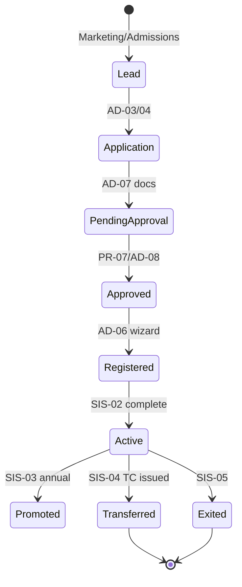
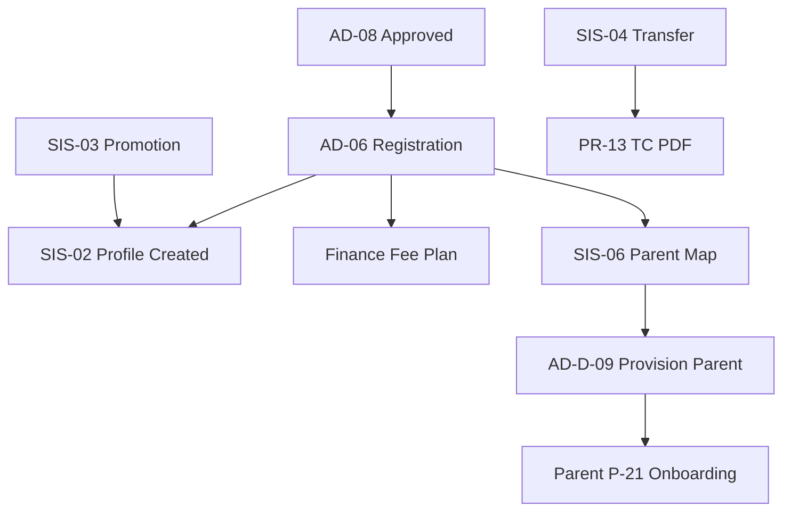

# Akshara ERP — Student SIS Module Specification (Consolidated)

**Document ID:** `AKS-SIS-SPEC-v1.0`  
**Module:** Student Information System  
**Screens:** SIS-01 → SIS-08  
**Platform:** Web (`1440×1024`) · Tablet  
**Source:** SRS Part 2 §1 · Part 11B · Admissions AD-06/AD-08 · Finance · Parent.md · Academic.md

---

## Table of Contents

1. [Module Overview](#1-module-overview)
2. [Student Lifecycle](#2-student-lifecycle)
3. [User Roles & Permissions](#3-user-roles--permissions)
4. [Navigation & Information Architecture](#4-navigation--information-architecture)
5. [SIS-01 — Student Registry](#5-sis-01--student-registry)
6. [SIS-02 — Student Profile](#6-sis-02--student-profile)
7. [SIS-03 — Promotion](#7-sis-03--promotion)
8. [SIS-04 — Transfer & TC](#8-sis-04--transfer--tc)
9. [SIS-05 — Exit Management](#9-sis-05--exit-management)
10. [SIS-06 — Parent Mapping](#10-sis-06--parent-mapping)
11. [SIS-07 — Document Vault](#11-sis-07--document-vault)
12. [SIS-08 — SIS Reports](#12-sis-08--sis-reports)
13. [Dialogs & Wizards](#13-dialogs--wizards)
14. [Cross-Module Links](#14-cross-module-links)
15. [Prototype Flow Map](#15-prototype-flow-map)
16. [Figma Organization](#16-figma-organization)
17. [Build Checklist](#17-build-checklist)

---

## 1. Module Overview

### Purpose

**Canonical system of record** for enrolled students: registration, profile, parent mapping, promotion, transfer, exit, and documents (SRS Part 2 §1, AR-005).

Resolves AD-08 post-approve gap: Admission Approvals → Registration → **SIS record** → Fee plan → Parent invite.

### Screen Inventory

| ID | Screen | Primary Users | Priority |
|----|--------|---------------|----------|
| SIS-01 | Student Registry | Admin, Counselor | P0 |
| SIS-02 | Student Profile | Admin, Principal 👁 | P0 |
| SIS-03 | Promotion | Admin, Principal | P0 |
| SIS-04 | Transfer & TC | Admin, Principal | P0 |
| SIS-05 | Exit Management | Admin, Management 👁 | P1 |
| SIS-06 | Parent Mapping | Admin, Counselor | P0 |
| SIS-07 | Document Vault | Admin, Counselor | P0 |
| SIS-08 | SIS Reports | Principal, Management | P1 |

**Total frames:** 8 primary + 7 dialogs = **15**

---

## 2. Student Lifecycle



### Identity Rules

| Field | Rule |
|-------|------|
| `student_id` | UUID — created at AD-06 step 6 or SIS-01 manual |
| `admission_number` | School-scoped unique — generated AD-06 |
| `school_id` | Required on all records (Part 11A) |
| `academic_year_id` | Required for enrollment |
| `status` | `prospect` · `active` · `transferred` · `exited` · `alumni` |

---

## 3. User Roles & Permissions

| Action | Counselor | Admin | Principal | Finance | Parent |
|--------|-----------|-------|-----------|---------|--------|
| View registry | ✅ | ✅ | 👁 | ❌ | ❌ |
| Create student | ✅ AD-06 | ✅ | ❌ | ❌ | ❌ |
| Edit profile | ✅ | ✅ | 👁 | ❌ | ❌ |
| Promote | ❌ | ✅ | 🔒 approve bulk | ❌ | ❌ |
| Transfer/TC | ❌ | ✅ | 🔒 approve | ❌ | ❌ |
| Exit student | ❌ | ✅ | 🔒 | ❌ | ❌ |
| Map parent | ✅ | ✅ | ❌ | ❌ | ❌ |
| View documents | ✅ | ✅ | 👁 | ❌ | 👁 own child docs |
| View medical | ✅ | ✅ | 👁 | ❌ | 👁 own child |

---

## 4. Navigation & Information Architecture

### Access

- **Admissions shell** — AD-06 registration is entry point
- **Standalone SIS shell** — for ongoing student management
- Linked from Principal PR-12 Global Search

### Side Navigation

| # | Label | Screen |
|---|-------|--------|
| 1 | Registry | SIS-01 |
| 2 | Profile | SIS-02 (requires selection) |
| 3 | Promotion | SIS-03 |
| 4 | Transfer | SIS-04 |
| 5 | Exit | SIS-05 |
| 6 | Parent Mapping | SIS-06 |
| 7 | Documents | SIS-07 |
| 8 | Reports | SIS-08 |

---

## 5. SIS-01 — Student Registry

| **Frame** | `SIS-01-Registry-D` |

### Layout

| # | Section |
|---|---------|
| 1 | Filter bar | Class · Section · Status · AY · Search |
| 2 | KPI row | Total active · New this month · Transferred · Exited |
| 3 | Student table |
| 4 | Bulk actions | Export · Promote selected |

### Table Columns

`Admission # 100 · Name 180 · Class 80 · Section 80 · Parent 140 · Status 100 · Transport 80 · Hostel 80 · Actions 96`

### Row Actions

View profile · Edit · Map parent · Documents · Transfer · Exit

---

## 6. SIS-02 — Student Profile

| **Frame** | `SIS-02-Profile-D` |

### Tabs

| Tab | Content |
|-----|---------|
| Personal | Name · DOB · gender · Aadhaar · address · photo |
| Academic | Class · section · roll · house · previous school |
| Medical | Blood group · allergies · conditions (restricted) |
| Transport | Route · stop · bus (link Transport TR-*) |
| Hostel | Room · bed (link Hostel HO-*) |
| Emergency | Contacts · pickup authorization |
| History | Promotion · transfer · discipline 👁 |

### Header

Photo `80×80` · name · admission # · status chip · class · quick links: Fees · Attendance · Academic

---

## 7. SIS-03 — Promotion

| **Frame** | `SIS-03-Promotion-D` |

### Wizard

| Step | Content |
|------|---------|
| 1 | Source AY · target AY |
| 2 | Class mapping rules (e.g. 5-A → 6-A) |
| 3 | Preview affected students |
| 4 | Principal approval if bulk > threshold |
| 5 | Execute · audit `student.promotion` |

---

## 8. SIS-04 — Transfer & TC

| **Frame** | `SIS-04-Transfer-D` |

### Transfer Wizard (AR-032)

| Step | Content |
|------|---------|
| 1 | Select student · reason |
| 2 | Destination school (internal branch or external) |
| 3 | TC data: conduct · attendance summary · fees clearance check |
| 4 | Finance clearance flag (FN-03 no dues) |
| 5 | Generate TC PDF (PR-13 template) · status → `transferred` |

### Internal Transfer

Branch-to-branch within organization — preserves `student_id`, updates `branch_id`

---

## 9. SIS-05 — Exit Management

| **Frame** | `SIS-05-Exit-D` |

Exit reasons: Completed · Dropped · Relocated · Disciplinary  
Archive academic records · revoke app access · alumni handoff (future Alumni.md)

---

## 10. SIS-06 — Parent Mapping

| **Frame** | `SIS-06-ParentMapping-D` |

### Features

Link parent/guardian to student · multiple children per parent · relationship type · primary contact · pickup rights

### Provision Flow (AR-012)

| Step | System action |
|------|---------------|
| 1 | Create `parents` record if new phone |
| 2 | Insert `parent_student_map` |
| 3 | Supabase Auth invite → Parent P-21 onboarding |
| 4 | Notification `admission.approved` |

**Dialog:** AD-D-09 `ProvisionParentAccount` — also accessible from AD-06 step 2

---

## 11. SIS-07 — Document Vault

| **Frame** | `SIS-07-Documents-D` |

Per-student document storage (R2): Birth cert · Aadhaar · TC · medical · photos  
Status: Missing · Uploaded · Verified (syncs AD-07)

---

## 12. SIS-08 — SIS Reports

Enrollment by class · gender ratio · new admissions trend · transfer/exit log · document compliance %

---

## 13. Dialogs & Wizards

| ID | Name | Used on |
|----|------|---------|
| SIS-D-01 | AddStudent | SIS-01 |
| SIS-D-02 | PromotionWizard | SIS-03 |
| SIS-D-03 | TransferWizard | SIS-04 |
| SIS-D-04 | ExitConfirm | SIS-05 |
| SIS-D-05 | ProvisionParent | SIS-06 / AD-06 |
| SIS-D-06 | TCPreview | SIS-04 |
| SIS-D-07 | DocumentUpload | SIS-07 |

---

## 14. Cross-Module Links

| From | To | Trigger |
|------|-----|---------|
| AD-08 approve | AD-06 → SIS-02 | Create active student |
| AD-06 step 5 | Finance FN-02 | Fee plan assignment |
| AD-06 step 2 | SIS-06 | Parent mapping |
| SIS-D-05 | Parent P-21 | Account invite |
| SIS-04 TC | Principal PR-13 | Certificate generation |
| SIS-04 clearance | Finance FN-03 | No dues check |
| SIS-02 transport | Transport TR-* | Route assignment |
| SIS-02 hostel | Hostel HO-* | Room assignment |
| SIS-02 | Academic AC-* | Class enrollment |
| All mutations | FN-10 Audit | SIS audit events |

---

## 15. Prototype Flow Map



---

## 16. Figma Organization

```
📁 07 — Student SIS
├── SIS-01 → SIS-08 [D/T]
└── Dialogs SIS-D-01 → SIS-D-07
```

---

## 17. Build Checklist

| Step | Task |
|------|------|
| 1 | SIS-01 registry + SIS-02 profile tabs |
| 2 | AD-06 → SIS handoff alignment |
| 3 | SIS-D-05 parent provision + P-21 |
| 4 | SIS-06 parent mapping |
| 5 | SIS-07 document vault |
| 6 | SIS-03 promotion wizard |
| 7 | SIS-04 transfer + TC (SIS-D-03/06) |
| 8 | SIS-05 exit + SIS-08 reports |
| 9 | Finance clearance integration |
| 10 | Audit events on all lifecycle changes |

---

**End of Student SIS Module Specification v1.0**
