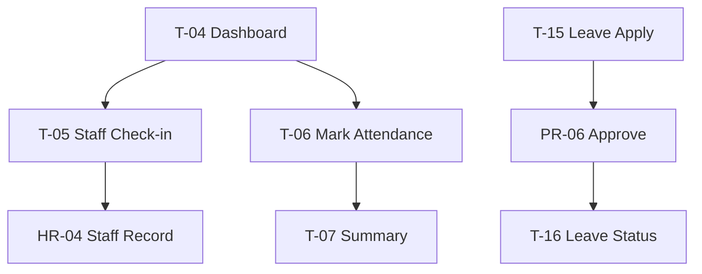

# Akshara ERP — Teacher App Module Specification (Consolidated)

**Document ID:** `AKS-T-SPEC-v1.0`  
**Module:** Teacher Mobile App  
**Screens:** T-01 → T-22  
**Platform:** Mobile primary (`390×844`) · Tablet (`834×1194`)  
**Source:** SRS Part 2 §3–4 · Part 6 §13–14 · Part 12 §5–6 · HR.md · Principal.md · Academic.md

---

## Table of Contents

1. [Module Overview](#1-module-overview)
2. [User Roles & Permissions](#2-user-roles--permissions)
3. [Navigation & Information Architecture](#3-navigation--information-architecture)
4. [Staff vs Student Attendance Boundary](#4-staff-vs-student-attendance-boundary)
5. [Shared Shell Layout](#5-shared-shell-layout)
6. [Core Teacher Screens](#6-core-teacher-screens)
7. [Class Teacher Screens](#7-class-teacher-screens)
8. [Dialogs & Wizards](#8-dialogs--wizards)
9. [Cross-Module Links](#9-cross-module-links)
10. [Prototype Flow Map](#10-prototype-flow-map)
11. [Figma Organization](#11-figma-organization)
12. [Build Checklist](#12-build-checklist)

---

## 1. Module Overview

### Purpose

Mobile app for **teachers** and **class teachers**: mark student attendance, create homework, enter marks, staff check-in, parent messaging, leave requests, and class-level analytics (SRS Part 12 §5–6).

### Screen Inventory

| ID | Screen | Users | Priority |
|----|--------|-------|----------|
| T-01 | Splash | All | P0 |
| T-02 | Language Selection | All | P0 |
| T-03 | Login | All | P0 |
| T-04 | Teacher Dashboard | All | P0 |
| T-05 | Staff Check-in | All | P0 |
| T-06 | Mark Student Attendance | All | P0 |
| T-07 | Attendance Summary | All | P0 |
| T-08 | Create Homework | All | P0 |
| T-09 | Homework List | All | P0 |
| T-10 | Assignments | All | P1 |
| T-11 | Enter Marks | All | P0 |
| T-12 | Timetable | All | P0 |
| T-13 | Parent Messages | All | P0 |
| T-14 | Message Thread | All | P0 |
| T-15 | Leave Apply | All | P0 |
| T-16 | Leave Status | All | P0 |
| T-17 | AI Assistant | All | P1 |
| T-18 | Notifications | All | P0 |
| T-19 | Class Teacher Dashboard | Class teacher | P1 |
| T-20 | Student List | Class teacher | P1 |
| T-21 | Class Analytics | Class teacher | P1 |
| T-22 | Behaviour Log | Class teacher | P1 |

**Total frames:** 22 primary + 7 dialogs = **29**

---

## 2. User Roles & Permissions

| Action | Teacher | Class Teacher |
|--------|---------|---------------|
| Mark class attendance | ✅ assigned | ✅ |
| Staff check-in (geo+face) | ✅ | ✅ |
| Create homework | ✅ assigned subjects | ✅ |
| Enter marks | ✅ assigned | ✅ |
| Message parents | ✅ assigned | ✅ all class parents |
| Apply leave | ✅ | ✅ |
| View class analytics | ❌ | ✅ |
| Log behaviour | ❌ | ✅ |
| Manual staff override | ❌ | ❌ |
| View payroll | ❌ | ❌ |

Leave approval: Teacher submits → **Principal PR-06** (not in Teacher app)

---

## 3. Navigation & Information Architecture

### Bottom Navigation (Standard Teacher)

| Tab | Icon | Screen |
|-----|------|--------|
| Home | `home` | T-04 Dashboard |
| Classes | `class` | T-06 Mark Attendance |
| Teach | `edit_note` | T-08 Create Homework |
| Messages | `chat` | T-13 Parent Messages |
| More | `menu` | Overflow |

### Class Teacher Additional Entry

T-04 shows **Class Teacher** card → T-19 when `class_teacher` role present

### Hierarchy

```
T-03 Login → T-04 Dashboard
├── T-05 Staff Check-in (daily)
├── T-06 Mark Attendance → T-07 Summary
├── T-08 Create HW → T-09 List
├── T-10 Assignments · T-11 Marks · T-12 Timetable
├── T-13 Messages → T-14 Thread
├── T-15 Leave Apply → T-16 Status (→ PR-06)
├── T-17 AI · T-18 Notifications
└── Class Teacher branch
    ├── T-19 Class Dashboard
    ├── T-20 Student List
    ├── T-21 Class Analytics
    └── T-22 Behaviour Log
```

---

## 4. Staff vs Student Attendance Boundary

Per ArchitectureReview AR-028:

| Capability | Screen | Owner |
|------------|--------|-------|
| **Staff check-in capture** | T-05 | Teacher app (geo+face) |
| Student attendance mark | T-06 | Teacher app |
| Staff admin + override | HR-04 | HR portal |
| Staff read-only monitor | PR-04 | Principal portal |

### T-05 Staff Check-in

| Step | UI |
|------|-----|
| 1 | Geo-fence validation map |
| 2 | Face capture / match |
| 3 | Success badge · timestamp |
| 4 | Failure: out of range / face mismatch messages |

Methods: Geo+Face (primary) · QR optional · Web fallback `warning` badge

---

## 5. Shared Shell Layout

**Component:** `Shell/TeacherMobileLayout`

AppBar: period indicator · class selector (T-06) · bell · AI  
Bottom nav per §3

---

## 6. Core Teacher Screens

### T-04 Dashboard

Today's classes list · Pending attendance alert · Homework to review count · Unread messages · Staff check-in status chip · Leave status

### T-06 Mark Student Attendance

Class/section picker · student list `72px` rows · Present/Absent/Late toggle · bulk actions · Submit (online required)

### T-07 Attendance Summary

Submitted confirmation · edit window timer · absentee list · notify parents trigger (system event)

### T-08 / T-09 Homework

Create: class · subject · title · description · attachments · due date · publish  
List: filter by class · submission count · review submissions

### T-11 Enter Marks

Exam · class · subject · marks grid · save draft · submit for approval (if policy)

### T-12 Timetable

Personal teacher timetable · today highlight

### T-13 / T-14 Parent Messages

Same chat pattern as Parent P-13/14 · teacher-initiated allowed

### T-15 / T-16 Leave

Apply form: type · dates · reason · substitute impact preview  
Status: Pending Principal · Approved · Rejected · link to PR-06 queue id

### T-17 AI Assistant

Worksheet generation · weak student list · attendance risk for class

### T-18 Notifications

Leave results · announcement · class notices · approval not applicable

---

## 7. Class Teacher Screens

### T-19 Class Teacher Dashboard

Class KPIs · at-risk students · behaviour count · parent engagement score

### T-20 Student List

Full class roster · quick actions: message parent · view profile · mark behaviour

### T-21 Class Analytics

Attendance trend · marks distribution · homework completion rate

### T-22 Behaviour Log

Log incident → PR-14 sync · types: Warning · Note · Commendation

---

## 8. Dialogs & Wizards

| ID | Name | Used on |
|----|------|---------|
| T-D-01 | AttendanceConfirm | T-06 |
| T-D-02 | FaceCapture | T-05 |
| T-D-03 | GeoFenceFail | T-05 |
| T-D-04 | HomeworkPublish | T-08 |
| T-D-05 | LeaveSubmit | T-15 |
| T-D-06 | MarksSubmit | T-11 |
| T-D-07 | LogBehaviour | T-22 |

---

## 9. Cross-Module Links

| From | To |
|------|-----|
| T-05 check-in | HR-04 data · PR-04 monitor |
| T-06 | Academic · PR-02 analytics |
| T-08/09 | Academic AC-01 |
| T-11 | Academic AC-02 |
| T-15/16 | HR-05 · Principal PR-06 |
| T-22 | Principal PR-14 |
| T-13 | Parent P-13 |
| T-18 | Notifications.md |

---

## 10. Prototype Flow Map



---

## 11. Figma Organization

```
📁 03 — Teacher App
├── T-01 → T-22 [M/T]
└── Dialogs T-D-01 → T-D-07
```

---

## 12. Build Checklist

| Step | Task |
|------|------|
| 1 | Shell + bottom nav |
| 2 | T-04 dashboard + T-05 staff check-in |
| 3 | T-06/07 student attendance |
| 4 | T-08/09 homework |
| 5 | T-13/14 messaging |
| 6 | T-15/16 leave flow |
| 7 | T-11 marks entry |
| 8 | Class teacher T-19–T-22 |
| 9 | T-17 AI + T-18 notifications |

---

**End of Teacher App Module Specification v1.0**
