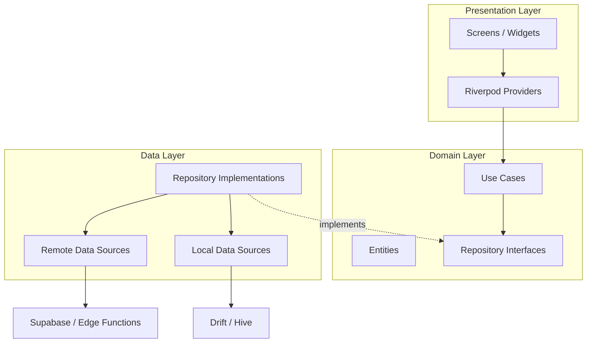
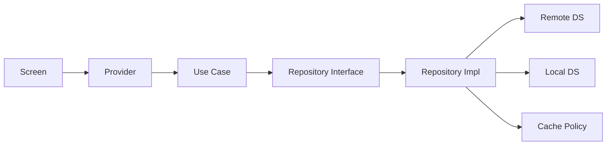
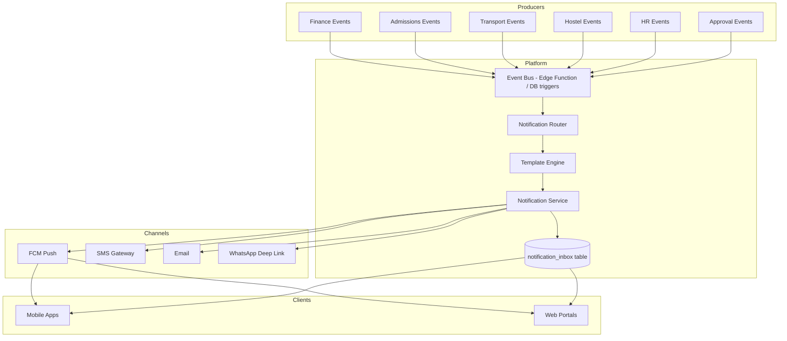
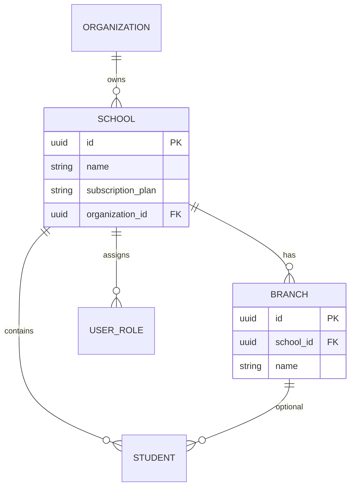
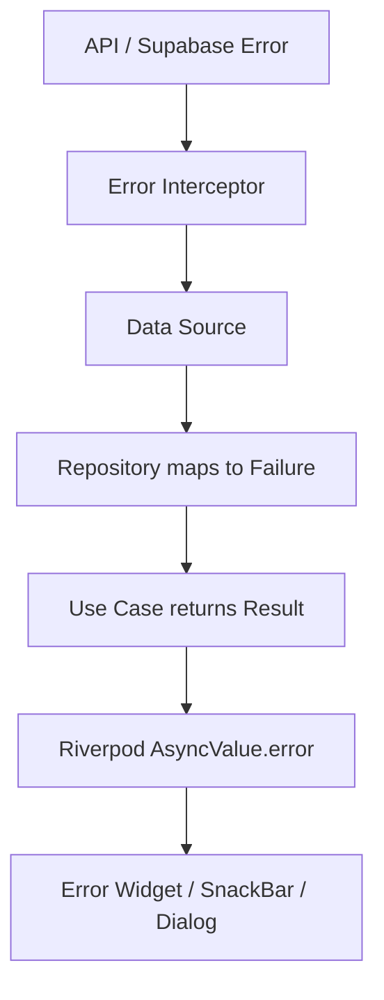
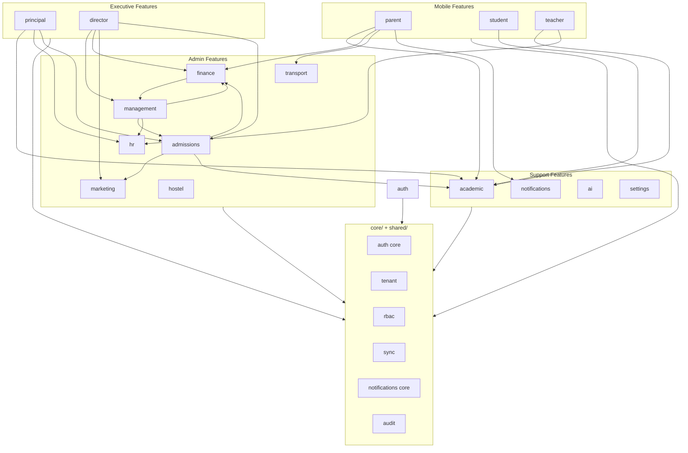
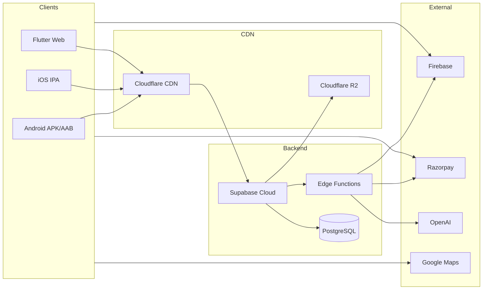

# Akshara ERP — Technical Architecture

**Document ID:** `AKS-TECH-ARCH-v1.0`  
**Status:** Architecture specification (no implementation code)  
**Source:** SRS Parts 5, 6, 9, 11A, 13, 15, 18 · Module specs · `ArchitectureReview.md` · `PROJECT_CONTEXT.md`  
**Stack:** Flutter · Riverpod · GoRouter · Supabase · PostgreSQL · FCM · Cloudflare R2 · Razorpay · OpenAI

---

## Table of Contents

1. [Architecture Overview](#1-architecture-overview)
2. [Technology Stack](#2-technology-stack)
3. [Flutter Folder Structure](#3-flutter-folder-structure)
4. [Clean Architecture Layers](#4-clean-architecture-layers)
5. [Riverpod Architecture](#5-riverpod-architecture)
6. [GoRouter Navigation](#6-gorouter-navigation)
7. [API Layer Structure](#7-api-layer-structure)
8. [Repository Pattern](#8-repository-pattern)
9. [Local Storage Strategy](#9-local-storage-strategy)
10. [Role-Based Access Control](#10-role-based-access-control)
11. [Notification Architecture](#11-notification-architecture)
12. [Audit Logging Architecture](#12-audit-logging-architecture)
13. [Multi-School Architecture](#13-multi-school-architecture)
14. [Offline Sync Strategy](#14-offline-sync-strategy)
15. [Error Handling](#15-error-handling)
16. [Environment Configuration](#16-environment-configuration)
17. [Feature Module Boundaries](#17-feature-module-boundaries)
18. [Cross-Cutting Concerns](#18-cross-cutting-concerns)
19. [Security Architecture](#19-security-architecture)
20. [Testing Strategy](#20-testing-strategy)
21. [Deployment Topology](#21-deployment-topology)
22. [Architecture Decision Records](#22-architecture-decision-records)

---

## 1. Architecture Overview

### 1.1 System Context

Akshara ERP is a **multi-tenant school SaaS platform** delivering mobile apps (Parent, Student, Teacher), web admin portals (Finance, Management, Admissions, HR, etc.), and optional chain-level director views — all from a **single Flutter codebase**.

```
┌─────────────────────────────────────────────────────────────────┐
│                        CLIENT LAYER                              │
│  Flutter (Android · iOS · Web · Tablet)                         │
│  Material 3 · Riverpod · GoRouter                               │
└────────────────────────────┬────────────────────────────────────┘
                             │ HTTPS / WSS
┌────────────────────────────▼────────────────────────────────────┐
│                     APPLICATION LAYER                            │
│  Supabase Auth · PostgREST · Edge Functions · Realtime            │
│  Row Level Security · Storage API                                  │
└────────────────────────────┬────────────────────────────────────┘
                             │
        ┌────────────────────┼────────────────────┐
        ▼                    ▼                    ▼
┌───────────────┐   ┌───────────────┐   ┌───────────────┐
│  PostgreSQL   │   │ Cloudflare R2 │   │  External     │
│  (Supabase)   │   │  File Storage │   │  Services     │
└───────────────┘   └───────────────┘   │ FCM · Razorpay│
                                        │ OpenAI · Maps │
                                        └───────────────┘
```

### 1.2 Architectural Principles

| Principle | Rule |
|-----------|------|
| Clean Architecture | UI → Domain → Data; dependencies point inward |
| Single codebase | One Flutter repo; role-based shells and routes |
| API-first | All data via repositories; no direct DB from UI |
| Tenant isolation | Every request scoped by `school_id` (+ `branch_id` where applicable) |
| Offline-capable | Read-heavy mobile flows cache locally; writes queue when offline |
| Audit everything | All mutations emit audit events |
| Least privilege | RBAC enforced client + server (RLS) |
| No placeholder quality | Enterprise patterns from day one (SRS + PROJECT_CONTEXT) |

### 1.3 Client Targets

| Client Shell | Platform | Primary users |
|--------------|----------|---------------|
| `parent_shell` | Mobile | Parent |
| `student_shell` | Mobile | Student |
| `teacher_shell` | Mobile | Teacher |
| `admin_shell` | Web / Tablet | Finance, Management, Admissions, HR, Marketing, Transport, Hostel |
| `executive_shell` | Web | Principal, Director |

Shell selection occurs post-authentication based on `active_role` and `allowed_roles[]`.

---

## 2. Technology Stack

| Layer | Technology | Purpose |
|-------|------------|---------|
| UI | Flutter 3.x | Cross-platform UI |
| Design | Material 3 | Theming per `DesignSystem.md` |
| State | Riverpod 2.x | DI, async state, caching |
| Routing | GoRouter | Declarative navigation, deep links |
| Backend | Supabase | Auth, DB, realtime, edge functions |
| Database | PostgreSQL | Relational data, RLS |
| Local DB | Drift (SQLite) / Hive | Offline cache, sync queue |
| Secure storage | flutter_secure_storage | Tokens, sensitive prefs |
| Files | Cloudflare R2 via signed URLs | Documents, images, homework |
| Push | Firebase Cloud Messaging | Mobile + web push |
| Payments | Razorpay | Fee collection |
| Maps | Google Maps | Transport geo-fence, bus tracking |
| AI | OpenAI API via Edge Functions | Copilot, translations, posters |
| CI/CD | GitHub Actions | Build, test, deploy |
| Analytics | Sentry (recommended) | Crash + error reporting |

---

## 3. Flutter Folder Structure

### 3.1 Root Layout

```
lib/
├── main.dart                          # Entry: env bootstrap, ProviderScope, runApp
├── main_dev.dart                      # Dev flavor entry (optional)
├── main_staging.dart                  # Staging flavor entry (optional)
├── main_prod.dart                     # Production flavor entry (optional)
│
├── app/                               # App composition root
│   ├── app.dart                       # MaterialApp.router, theme, locale
│   ├── bootstrap.dart                 # Init: Supabase, FCM, Hive, Sentry
│   └── flavor.dart                    # Flavor enum + config resolver
│
├── config/                            # Static configuration
│   ├── env/
│   │   ├── env_config.dart            # Abstract env contract
│   │   ├── dev_env.dart
│   │   ├── staging_env.dart
│   │   └── prod_env.dart
│   ├── constants/
│   │   ├── api_constants.dart
│   │   ├── storage_keys.dart
│   │   └── route_paths.dart
│   └── feature_flags.dart
│
├── core/                              # Cross-cutting infrastructure
│   ├── error/
│   │   ├── app_exception.dart
│   │   ├── failure.dart
│   │   └── error_mapper.dart
│   ├── network/
│   │   ├── api_client.dart
│   │   ├── interceptors/
│   │   └── connectivity_service.dart
│   ├── storage/
│   │   ├── secure_storage_service.dart
│   │   ├── local_database.dart        # Drift
│   │   └── cache_manager.dart
│   ├── auth/
│   │   ├── session_manager.dart
│   │   └── token_refresh_service.dart
│   ├── rbac/
│   │   ├── permission.dart
│   │   ├── role_permissions.dart
│   │   └── access_guard.dart
│   ├── audit/
│   │   └── audit_emitter.dart
│   ├── notifications/
│   │   ├── fcm_service.dart
│   │   ├── notification_router.dart
│   │   └── notification_inbox_service.dart
│   ├── sync/
│   │   ├── sync_queue.dart
│   │   ├── sync_worker.dart
│   │   └── conflict_resolver.dart
│   ├── tenant/
│   │   ├── tenant_context.dart
│   │   └── school_switcher.dart
│   ├── logging/
│   │   └── app_logger.dart
│   └── utils/
│       ├── date_utils.dart
│       └── currency_utils.dart
│
├── shared/                            # Shared UI + domain primitives
│   ├── widgets/                     # Design system components
│   ├── models/                        # Cross-feature DTOs (User, School, etc.)
│   ├── extensions/
│   └── mixins/
│
├── features/                          # Feature modules (see §17)
│   ├── auth/
│   ├── parent/
│   ├── student/
│   ├── teacher/
│   ├── principal/
│   ├── finance/
│   ├── management/
│   ├── admissions/
│   ├── marketing/
│   ├── transport/
│   ├── hostel/
│   ├── hr/
│   ├── director/
│   ├── academic/                      # homework, exams, timetable
│   ├── notifications/
│   ├── ai/
│   └── settings/
│
├── l10n/                              # Localization (ARB files)
│   ├── app_en.arb
│   ├── app_te.arb
│   └── ...
│
├── routes/                            # GoRouter configuration
│   ├── app_router.dart
│   ├── route_guards.dart
│   ├── shell_routes/
│   │   ├── parent_shell_route.dart
│   │   ├── teacher_shell_route.dart
│   │   ├── admin_shell_route.dart
│   │   └── executive_shell_route.dart
│   └── deep_link_parser.dart
│
└── theme/                             # Material 3 theme
    ├── app_theme.dart
    ├── color_tokens.dart
    ├── typography.dart
    └── white_label_theme.dart
```

### 3.2 Feature Module Internal Structure

Every feature under `features/` follows the same layout:

```
features/finance/
├── data/
│   ├── datasources/
│   │   ├── finance_remote_datasource.dart    # Supabase / Edge Functions
│   │   └── finance_local_datasource.dart     # Drift cache tables
│   ├── models/                               # DTOs (JSON serializable)
│   │   ├── fee_summary_dto.dart
│   │   └── defaulter_dto.dart
│   └── repositories/
│       └── finance_repository_impl.dart
│
├── domain/
│   ├── entities/                             # Pure business objects
│   │   ├── fee_summary.dart
│   │   └── defaulter.dart
│   ├── repositories/                         # Abstract contracts
│   │   └── finance_repository.dart
│   └── usecases/
│       ├── get_fee_collection.dart
│       ├── send_fee_reminder.dart
│       └── record_cash_payment.dart
│
└── presentation/
    ├── providers/                            # Riverpod providers
    │   ├── finance_dashboard_provider.dart
    │   └── fee_collection_provider.dart
    ├── screens/                              # FN-01, FN-02, etc.
    │   ├── finance_dashboard_screen.dart
    │   └── fee_collection_screen.dart
    ├── widgets/                              # Feature-specific widgets
    └── controllers/                          # Form controllers, wizards
```

### 3.3 Test Mirror Structure

```
test/
├── core/
├── features/
│   └── finance/
│       ├── data/
│       ├── domain/
│       └── presentation/
└── integration/
```

---

## 4. Clean Architecture Layers

### 4.1 Layer Responsibilities



| Layer | May depend on | Must NOT depend on |
|-------|---------------|-------------------|
| Presentation | Domain | Data (directly), Supabase SDK |
| Domain | Nothing external | Flutter, Supabase, Drift |
| Data | Domain (interfaces), Core | Presentation |

### 4.2 Data Flow Rules

1. **Screens** watch/read Riverpod providers only.
2. **Providers** call use cases (or repositories for simple reads).
3. **Use cases** orchestrate business rules and call repository interfaces.
4. **Repositories** decide remote vs local vs cache strategy.
5. **DTOs** map to **Entities** inside repositories (never leak DTOs to UI).

### 4.3 Use Case Conventions

| Pattern | Naming | Returns |
|---------|--------|---------|
| Query | `GetFeeCollection` | `Result<FeeCollectionSummary, Failure>` |
| Command | `RecordCashPayment` | `Result<PaymentReceipt, Failure>` |
| Stream | `WatchAttendanceUpdates` | `Stream<AttendanceState>` |

Use cases are **single-responsibility** — one public method `call()` or `execute()`.

---

## 5. Riverpod Architecture

### 5.1 Provider Taxonomy

| Provider Type | Purpose | Example |
|---------------|---------|---------|
| `Provider` | Stateless services, repositories | `financeRepositoryProvider` |
| `FutureProvider` | One-shot async load | `feeSummaryProvider` |
| `StreamProvider` | Realtime subscriptions | `notificationInboxProvider` |
| `NotifierProvider` | Mutable feature state | `feeCollectionFilterNotifier` |
| `AsyncNotifierProvider` | Async CRUD with refresh | `defaultersListNotifier` |
| `StateProvider` | Ephemeral UI state | `selectedTabIndexProvider` |

### 5.2 Provider Scope Hierarchy

```
ProviderScope (app root)
├── sessionProvider                    # Auth session, roles, tenant
├── tenantContextProvider              # school_id, branch_id, academic_year
├── connectivityProvider               # online/offline
├── syncQueueProvider                  # pending mutations
│
├── [Feature] financeRepositoryProvider
│   ├── financeDashboardProvider
│   ├── feeCollectionProvider
│   └── defaultersProvider
│
└── [Feature] admissionsRepositoryProvider
    └── pipelineBoardProvider
```

### 5.3 Dependency Injection Pattern

All dependencies registered via Riverpod — **no service locator**, no global singletons.

```
Repository Provider
  → depends on RemoteDataSource Provider
  → depends on LocalDataSource Provider
  → depends on ApiClient Provider
  → depends on TenantContext Provider
```

**Override in tests:**

Test bindings override `financeRepositoryProvider` with `MockFinanceRepository`.

### 5.4 State Management Rules

| Rule | Description |
|------|-------------|
| AsyncValue everywhere | UI handles `loading / data / error` uniformly |
| Invalidate on mutation | After `RecordCashPayment`, invalidate `defaultersProvider` |
| Optimistic UI optional | Only for low-risk toggles; fees/payroll never optimistic |
| No business logic in widgets | Logic in Notifiers or use cases |
| Provider naming | `{feature}{entity}Provider` — e.g. `financeDefaultersProvider` |
| Family providers | Use `.family` for parameterized queries (`studentId`, `classId`) |

### 5.5 Session & Tenant Providers

| Provider | Holds |
|----------|-------|
| `authSessionProvider` | `userId`, `accessToken`, `refreshToken`, `expiresAt` |
| `userProfileProvider` | name, avatar, phone, locale |
| `userRolesProvider` | `List<AppRole>` with permissions bitmask |
| `activeRoleProvider` | currently selected role (multi-role users) |
| `tenantContextProvider` | `schoolId`, `branchId`, `academicYearId`, `schoolName` |
| `whiteLabelConfigProvider` | logo URL, primary color override |

`tenantContextProvider` is **read by all repository providers** and injected into every API call header or query filter.

### 5.6 Realtime Integration

Supabase Realtime channels scoped per tenant:

| Channel | Subscribers | Events |
|---------|-------------|--------|
| `school:{schoolId}:notifications` | All roles | new notification |
| `school:{schoolId}:attendance` | Teacher, Principal | attendance marked |
| `school:{schoolId}:transport` | Transport coord, Parent | bus location update |
| `school:{schoolId}:approvals` | Management, Principal | approval queue change |

Realtime listeners live in **dedicated StreamProviders**; they invalidate related FutureProviders on event.

---

## 6. GoRouter Navigation

### 6.1 Router Architecture

Single `GoRouter` instance with **shell routes** per client type. Role guard redirects unauthorized access.

```
GoRouter
├── /splash
├── /language
├── /login
├── /otp-verify
├── /forgot-password
│
├── ShellRoute: ParentShell (/parent)
│   ├── /parent/home
│   ├── /parent/academics
│   ├── /parent/fees
│   ├── /parent/messages
│   └── /parent/more/*
│
├── ShellRoute: StudentShell (/student)
│   └── ...
│
├── ShellRoute: TeacherShell (/teacher)
│   └── ...
│
├── ShellRoute: AdminShell (/admin)
│   ├── /admin/finance/*
│   ├── /admin/management/*
│   ├── /admin/admissions/*
│   ├── /admin/marketing/*
│   ├── /admin/transport/*
│   ├── /admin/hostel/*
│   └── /admin/hr/*
│
└── ShellRoute: ExecutiveShell (/executive)
    ├── /executive/principal/*
    └── /executive/director/*
```

### 6.2 Route Naming Convention

| Segment | Pattern | Example |
|---------|---------|---------|
| Path | kebab-case | `/admin/finance/fee-collection` |
| Route name | camelCase | `adminFinanceFeeCollection` |
| Screen mapping | Module spec ID | `FN-02` → `FeeCollectionScreen` |

Centralize paths in `config/constants/route_paths.dart` — **no hardcoded strings in widgets**.

### 6.3 Route Guards

| Guard | Checks | Redirect |
|-------|--------|----------|
| `authGuard` | Valid session | → `/login` |
| `roleGuard` | `activeRole` in allowed roles for route | → role default home |
| `permissionGuard` | Specific permission bit | → `/unauthorized` |
| `tenantGuard` | `schoolId` present | → `/select-school` |
| `shellGuard` | Mobile vs web shell compatibility | → correct shell |

Guards implemented in `routes/route_guards.dart` as `GoRouter redirect` callbacks reading Riverpod via `ProviderContainer` or `ref` in a `RouterNotifier`.

### 6.4 Deep Links & Notification Routing

FCM payload contains:

```json
{
  "type": "fee_overdue",
  "school_id": "uuid",
  "student_id": "uuid",
  "route": "/parent/fees/pay",
  "params": { "fee_id": "uuid" }
}
```

`deep_link_parser.dart` maps `type` → `GoRouter.go()` target. Invalid or unauthorized deep links fall back to notification inbox.

### 6.5 Responsive Navigation

| Breakpoint | Navigation widget |
|------------|-------------------|
| `< 768px` | `NavigationBar` (mobile) |
| `768–1199px` | `NavigationRail` collapsed (72px) |
| `≥ 1200px` | `NavigationRail` expanded (256px) |

Shell widgets read `LayoutBreakpointProvider` and render appropriate chrome — same routes, different shell layout.

### 6.6 Cross-Module Navigation

Admin modules drill across boundaries via **named routes with query params**, not duplicate screens:

| From | To | Route |
|------|-----|-------|
| MG-05 Financial Overview | FN-02 | `/admin/finance/fee-collection?school={id}` |
| MK-02 Lead | AD-02 | `/admin/admissions/leads?lead_id={id}` |
| DR-02 School card | MG-01 | `/admin/management/dashboard?school={id}` |

`tenantContextProvider` updated on cross-school drill for Director users.

---

## 7. API Layer Structure

### 7.1 API Topology

```
Flutter App
    │
    ├── Supabase Client SDK (primary)
    │     ├── Auth API
    │     ├── PostgREST (CRUD on tables/views)
    │     ├── Realtime (WebSocket)
    │     └── Storage API
    │
    ├── Supabase Edge Functions (complex logic)
    │     ├── /functions/v1/ai-copilot
    │     ├── /functions/v1/razorpay-webhook
    │     ├── /functions/v1/send-notification
    │     ├── /functions/v1/face-attendance-verify
    │     └── /functions/v1/generate-report
    │
    └── External SDKs (client-side where required)
          ├── Razorpay Checkout (Parent fee payment)
          ├── Google Maps
          └── FCM
```

### 7.2 API Client Layers

```
core/network/
├── api_client.dart                 # Base HTTP client (Edge Functions REST)
├── supabase_client_provider.dart   # Configured Supabase instance
├── interceptors/
│   ├── auth_interceptor.dart       # Attach JWT Bearer
│   ├── tenant_interceptor.dart     # Inject school_id header
│   ├── retry_interceptor.dart      # Exponential backoff (idempotent GETs)
│   ├── logging_interceptor.dart    # Dev/staging only
│   └── error_interceptor.dart      # Map HTTP → AppException
└── connectivity_service.dart
```

### 7.3 API Categories

| Category | Access method | Auth |
|----------|---------------|------|
| CRUD (students, fees, leads) | PostgREST + RLS | JWT |
| Reports / exports | Edge Function | JWT + role check |
| Payments | Edge Function + Razorpay | JWT + webhook HMAC |
| AI copilot | Edge Function → OpenAI | JWT + role-scoped context |
| File upload | Signed URL → R2 | JWT + policy |
| Notifications | Edge Function dispatch | Service role (server only) |
| Audit | Insert via DB trigger + Edge Function read | JWT + read role |

### 7.4 Request / Response Contract

Per SRS Part 13:

**Standard response envelope (Edge Functions):**

```json
{
  "success": true,
  "message": "Operation successful",
  "data": {},
  "meta": { "page": 1, "total": 100 }
}
```

**Standard error envelope:**

```json
{
  "success": false,
  "error": {
    "code": "FEE_OVERDUE_LIMIT",
    "message": "User-friendly message",
    "details": {}
  }
}
```

**PostgREST** returns raw rows; repositories wrap in domain `Result` types.

### 7.5 API Versioning

| Rule | Value |
|------|-------|
| Edge Functions path | `/functions/v1/{name}` |
| Breaking changes | New function name or `v2` prefix |
| PostgREST | Schema versioning via Supabase migrations |
| Client header | `X-Api-Version: 1` on Edge Function calls |

### 7.6 Remote Data Source Pattern

Each feature `*_remote_datasource.dart`:

| Method | Backend | Notes |
|--------|---------|-------|
| `fetchDefaulters(filters)` | PostgREST view `v_fee_defaulters` | Filtered by RLS |
| `sendReminder(ids)` | Edge Function `send-fee-reminder` | Triggers notification |
| `recordCashPayment(dto)` | PostgREST insert + audit trigger | Transactional |
| `generateReport(params)` | Edge Function `generate-report` | Async job optional |

**UI and repositories never import `supabase_flutter` directly** — only data sources do.

---

## 8. Repository Pattern

### 8.1 Contract



### 8.2 Repository Responsibilities

| Responsibility | Owner |
|----------------|-------|
| Cache strategy (network-first, cache-first) | Repository |
| DTO → Entity mapping | Repository |
| Offline queue enqueue | Repository (on write failure) |
| Retry logic | Repository (delegates to ApiClient) |
| Tenant scoping | Repository (reads TenantContext) |
| Error mapping to Failure | Repository |

### 8.3 Cache Policies by Domain

| Domain | Read policy | Write policy |
|--------|-------------|--------------|
| Fee defaulters | Network-first, cache fallback | Online only |
| Homework list | Cache-first, background refresh | Submit online; queue if offline |
| Timetable | Cache-first (24h TTL) | Read-only client |
| Attendance roster | Network-first | Online only (teacher) |
| Lead pipeline | Network-first | Online; optimistic stage move with rollback |
| Notifications inbox | Network-first + realtime | Read-only |
| Audit logs | Network-only | N/A |
| Payroll / payments | Network-only | **Never offline** |

### 8.4 Repository Registration

One abstract interface per aggregate root in `domain/repositories/`.

One implementation in `data/repositories/` registered via:

```
final financeRepositoryProvider = Provider<FinanceRepository>((ref) {
  return FinanceRepositoryImpl(
    remote: ref.watch(financeRemoteDataSourceProvider),
    local: ref.watch(financeLocalDataSourceProvider),
    tenant: ref.watch(tenantContextProvider),
    syncQueue: ref.watch(syncQueueProvider),
  );
});
```

---

## 9. Local Storage Strategy

### 9.1 Storage Tiers

| Tier | Technology | Data |
|------|------------|------|
| **Secure** | `flutter_secure_storage` | JWT refresh token, biometric key |
| **Structured** | Drift (SQLite) | Offline cache tables, sync queue |
| **Key-value** | Hive | User prefs, feature flags, last sync timestamps |
| **Files** | `path_provider` + encrypted dir | Cached homework attachments (optional) |

### 9.2 Drift Cache Tables (per feature)

Example `finance` local schema:

| Table | Purpose | TTL |
|-------|---------|-----|
| `cached_defaulters` | Fee defaulter list | 1 hour |
| `cached_fee_summary` | Dashboard KPIs | 30 min |
| `sync_queue` | Pending mutations | Until synced |
| `sync_metadata` | Last sync per entity | — |

### 9.3 Hive Boxes

| Box | Keys |
|-----|------|
| `user_prefs` | locale, theme, notification toggles |
| `tenant_prefs` | last_school_id, last_branch_id, last_academic_year |
| `session_meta` | active_role, onboarding_complete |
| `offline_banner` | dismissed_at |

### 9.4 Secure Storage Keys

| Key | Content |
|-----|---------|
| `akshara_refresh_token` | Supabase refresh token |
| `akshara_device_id` | FCM device registration |
| `akshara_pin_hash` | Optional app PIN (parent app) |

### 9.5 Cache Invalidation Triggers

| Event | Action |
|-------|--------|
| User logout | Wipe Drift + Hive (except locale) |
| School switch | Wipe tenant-scoped Drift tables |
| Pull-to-refresh | Force network fetch + overwrite cache |
| Realtime event | Invalidate related Riverpod providers |
| Academic year change | Wipe academic-scoped caches |
| Successful mutation | Invalidate entity-specific providers |

### 9.6 Sensitive Data Rules

- **Never** store salary, full Aadhaar, or payment card data locally.
- Parent fee receipts: cache last 10 receipt metadata only (no full PAN).
- Staff face templates: **never on device** — verification server-side only.

---

## 10. Role-Based Access Control

### 10.1 RBAC Model

Three-layer enforcement:

```
Layer 1: Supabase RLS (PostgreSQL)     ← authoritative
Layer 2: Edge Function role checks     ← complex operations
Layer 3: Flutter AccessGuard + UI      ← UX hide/disable
```

**Never rely on Layer 3 alone.**

### 10.2 Role Enumeration

| Category | Roles |
|----------|-------|
| Platform | `super_admin`, `akshara_director`, `akshara_sales`, `akshara_support` |
| School executive | `school_director`, `management`, `principal`, `vice_principal` |
| School ops | `finance_manager`, `marketing_executive`, `hr_manager`, `transport_coordinator`, `hostel_warden` |
| Academic | `teacher`, `class_teacher` |
| End user | `parent`, `student` |
| External | `alumni` |

Users may hold **multiple roles** — `activeRoleProvider` drives shell and route guards.

### 10.3 Permission Model

Permissions stored as granular strings in `role_permissions` table:

```
finance.fee.read
finance.fee.write
finance.fee.remind
finance.payroll.process
finance.payroll.approve
admissions.lead.read
admissions.lead.write
admissions.approve
management.budget.approve
...
```

Flutter `AccessGuard` API (conceptual):

| Method | Purpose |
|--------|---------|
| `can(permission)` | Boolean check |
| `canAny([permissions])` | OR check |
| `canAll([permissions])` | AND check |
| `guardRoute(permission)` | GoRouter redirect if denied |

### 10.4 Data Scope Rules

| Role | Data scope |
|------|------------|
| Parent | `parent_student_map` children only |
| Student | Self only |
| Teacher | Assigned classes/subjects |
| Class teacher | Class + behaviour + parent comms |
| Counselor | Assigned leads only |
| Finance | Full school finance |
| Principal | School academics + staff metadata (no salary amounts) |
| Management | School-wide read + approvals |
| Director (chain) | Aggregated metrics; **no PII** |
| Akshara Director | Platform aggregates only |

### 10.5 UI Permission Patterns

| Pattern | When |
|---------|------|
| Hide widget | User lacks permission entirely |
| Disabled + tooltip | User sees action exists but cannot perform |
| Read-only view | `👁` permission from module specs |
| Route guard | Entire screen blocked |

### 10.6 Approval Permissions

| Action | Required permission | Approver role |
|--------|---------------------|---------------|
| Approve budget | `management.budget.approve` | Management |
| Approve expense | `management.expense.approve` | Management |
| Approve payroll | `management.payroll.approve` | Management |
| Approve teacher leave | `principal.leave.approve` | Principal |
| Approve admission | `principal.admission.approve` | Principal |
| Approve hostel leave | `hostel.leave.approve` | Warden |

---

## 11. Notification Architecture

### 11.1 Overview

Unified notification platform spanning mobile push, SMS, email, and WhatsApp deep links (SRS Part 2 §8, Part 15 §8).



### 11.2 Notification Event Catalog (minimum)

| Event type | Channels | Recipients | Deep link |
|------------|----------|------------|-----------|
| `fee.overdue` | Push, SMS, WhatsApp | Parent | `/parent/fees/pay` |
| `fee.received` | Push | Parent | `/parent/fees/receipt` |
| `attendance.absent` | Push, SMS | Parent | `/parent/academics/attendance` |
| `homework.assigned` | Push | Student, Parent | `/student/homework/{id}` |
| `bus.delay` | Push | Parent | `/parent/transport/live` |
| `hostel.missing` | Push, SMS | Parent, Warden | `/admin/hostel/attendance` |
| `leave.approved` | Push | Teacher | `/teacher/leave` |
| `leave.rejected` | Push | Teacher | `/teacher/leave` |
| `admission.stage_changed` | Push | Counselor | `/admin/admissions/pipeline` |
| `admission.approved` | Push, SMS | Parent | `/parent/onboarding` |
| `approval.pending` | Push | Management | `/admin/management/approvals` |
| `approval.result` | Push | Submitter | context route |
| `announcement.school` | Push | All school users | `/notifications/{id}` |

### 11.3 Flutter Notification Components

| Component | Location | Responsibility |
|-----------|----------|----------------|
| `FcmService` | `core/notifications/` | Token registration, foreground handler |
| `NotificationRouter` | `core/notifications/` | Payload → GoRouter navigation |
| `NotificationInboxService` | `features/notifications/` | Fetch, mark read, badge count |
| `notificationInboxProvider` | Riverpod | Inbox state + unread count |
| `NotificationPreferences` | `features/settings/` | Per-channel user toggles |

### 11.4 FCM Token Lifecycle

1. On login → register token with `school_id`, `user_id`, `role`, `device_type`.
2. On school switch → update token association.
3. On logout → deregister token.
4. Store `device_id` in secure storage for deduplication.

### 11.5 Bilingual Templates

Templates stored in `notification_templates` table with `locale` column. Edge Function selects template by user `preferred_locale` (7 languages per SRS).

### 11.6 Web Push

Web admin portals register FCM web tokens; same `NotificationRouter` handles browser notifications via service worker (Flutter web FCM integration).

---

## 12. Audit Logging Architecture

### 12.1 Principles

Per SRS Part 5 §10 and Part 11A:

- Audit logs are **immutable** (insert-only).
- Every sensitive mutation produces an audit event.
- Finance FN-10 is the **primary viewer**; Management and Director have filtered views.

### 12.2 Audit Event Schema

| Field | Type | Description |
|-------|------|-------------|
| `id` | UUID | Event ID |
| `school_id` | UUID | Tenant |
| `branch_id` | UUID | Optional |
| `user_id` | UUID | Actor |
| `user_role` | string | Role at time of action |
| `module` | string | `finance`, `admissions`, `hr`, etc. |
| `action` | string | `create`, `update`, `delete`, `approve`, `reject`, `export` |
| `entity_type` | string | `fee_payment`, `leave_request`, `lead`, etc. |
| `entity_id` | UUID | Target record |
| `before_state` | JSONB | Snapshot before (nullable) |
| `after_state` | JSONB | Snapshot after (nullable) |
| `severity` | enum | `info`, `warning`, `critical` |
| `ip_address` | string | Request IP |
| `user_agent` | string | Client info |
| `created_at` | timestamp | UTC |

### 12.3 Audit Emission Points

| Layer | Mechanism |
|-------|-----------|
| Database | PostgreSQL triggers on sensitive tables |
| Edge Functions | Explicit audit insert for complex workflows |
| Flutter client | `AuditEmitter` for UI actions (export, bulk approve) — **supplementary only** |

**Authoritative source is server-side** — client audit is best-effort for actions that don't hit DB directly.

### 12.4 Modules Requiring Audit

| Module | Audited actions |
|--------|-----------------|
| Finance | Fee modify, payment, payroll, vendor pay, export |
| Management | Budget/expense/payroll approve/reject |
| Admissions | Stage change, approval, document verify, convert to student |
| HR | Employee CRUD, manual attendance override |
| Hostel | Missing alert resolution, visitor checkout |
| Transport | Delay broadcast |
| Marketing | Bulk WhatsApp, campaign publish |
| Auth | Login, logout, role switch, failed access |

### 12.5 Flutter Audit Integration

```
core/audit/
├── audit_emitter.dart          # fire-and-forget client events
└── audit_providers.dart        # read-only audit log providers (Finance FN-10)
```

`AuditEmitter` calls Edge Function `log-client-audit` — never writes directly to table.

### 12.6 Retention & Export

| Policy | Value |
|--------|-------|
| Retention | 7 years (financial), 2 years (operational) — configurable per school |
| Export | Management + Finance roles only |
| PII in audit | Mask phone/email in `before_state`/`after_state` for non-admin viewers |

---

## 13. Multi-School Architecture

### 13.1 Tenant Model



### 13.2 Isolation Layers

| Layer | Mechanism |
|-------|-----------|
| Database | `school_id` on every business table (Part 11A §3) |
| Database | `branch_id` on operational tables (Part 11A §4) |
| Database | RLS policies: `school_id = auth.jwt() -> school_id` |
| API | JWT claims include `school_id`, `branch_id`, `roles` |
| Flutter | `TenantContext` injected into all repositories |
| Storage | R2 path prefix: `{school_id}/documents/...` |
| Realtime | Channel names include `school_id` |
| Cache | Drift tables include `school_id` column; wiped on switch |

### 13.3 School Chain / Franchise (Director)

| Concept | Implementation |
|---------|----------------|
| Organization | `organization_id` groups multiple `schools` |
| Director scope | JWT `organization_id` + aggregate views (no PII) |
| School drill-down | Switch `tenantContextProvider.schoolId` → load Management shell |
| Cross-school compare | Director APIs return pre-aggregated data only |

### 13.4 Dedicated Database Tier (Premium)

Per SRS Part 5 §5: premium schools may have dedicated Supabase project.

| Tier | Isolation |
|------|-----------|
| Standard | Shared DB + RLS |
| Premium | Dedicated DB instance, same schema |
| Enterprise | Private cloud deployment |

Flutter `EnvConfig` resolves Supabase URL per school tier at login.

### 13.5 Academic Year Context

Per Part 11A §5: academic tables include `academic_year_id`.

`TenantContext` holds:
- `schoolId`
- `branchId` (optional)
- `academicYearId` (switchable in admin header)

Repositories append `academic_year_id` filter to academic queries.

### 13.6 White Label per School

| Config | Storage | Applied |
|--------|---------|---------|
| Logo URL | `schools.white_label_config` | Splash, app bar |
| Primary color | JSON config | `whiteLabelThemeProvider` |
| Custom domain (web) | DNS + Supabase | Web redirect |
| Login background | R2 URL | Auth screens |

---

## 14. Offline Sync Strategy

### 14.1 Connectivity Model

```
┌─────────────┐     online      ┌─────────────┐
│   Flutter   │◄──────────────►│  Supabase   │
│   Client    │                 │   Backend   │
└──────┬──────┘                 └─────────────┘
       │
       │ offline
       ▼
┌─────────────┐
│ Drift Cache │ + SyncQueue
└─────────────┘
```

`connectivityProvider` (Riverpod) drives global offline banner per `DesignSystem.md`.

### 14.2 Offline-Capable Features

| Feature | Offline read | Offline write | Sync priority |
|---------|--------------|---------------|---------------|
| Homework list | ✅ | ✅ submit queued | High |
| Timetable | ✅ | ❌ | Medium |
| Attendance view (parent) | ✅ | ❌ | Medium |
| Attendance mark (teacher) | ❌ | ❌ online required | — |
| Fee payment | ❌ | ❌ | — |
| Payroll | ❌ | ❌ | — |
| Lead pipeline move | ✅ view | ⚠️ queue with conflict check | Low |
| Notifications inbox | ✅ cached | ❌ | Low |
| AI copilot | ❌ | ❌ | — |

### 14.3 Sync Queue Design

| Field | Purpose |
|-------|---------|
| `id` | Local UUID |
| `entity_type` | `homework_submission`, etc. |
| `operation` | `create`, `update`, `delete` |
| `payload` | JSON snapshot |
| `created_at` | Queue timestamp |
| `retry_count` | Max 5 |
| `status` | `pending`, `syncing`, `failed`, `completed` |
| `school_id` | Tenant scope |

### 14.4 Sync Worker

`SyncWorker` runs when:
1. `connectivityProvider` transitions offline → online
2. App resumes from background
3. Manual "Sync now" in settings

Processing order: **FIFO per entity_type**; finance entities never queued.

### 14.5 Conflict Resolution

| Strategy | Use case |
|----------|----------|
| Server wins | Fee, payroll, admission approvals |
| Last-write-wins | Homework draft metadata |
| Client retry prompt | Pipeline stage conflict — show user merge UI |
| Append-only | Homework submission (new file upload) |

`ConflictResolver` in `core/sync/` implements per-entity policy.

### 14.6 Attachment Offline

Homework photo uploads:
1. Save file to local encrypted temp path.
2. Queue metadata in `sync_queue`.
3. On sync: upload to R2 via signed URL, then confirm submission record.

---

## 15. Error Handling

### 15.1 Error Type Hierarchy

```
AppException (abstract)
├── NetworkException          # timeout, no connection
├── AuthException             # token expired, unauthorized
├── PermissionException       # 403 RBAC
├── ValidationException       # 400 field errors
├── ServerException           # 5xx
├── NotFoundException         # 404
├── ConflictException         # 409 sync conflict
├── PaymentException          # Razorpay failures
└── UnknownException          # fallback
```

Mapped to user-facing `Failure` types in domain layer:

```
Failure
├── message (localized)
├── code (for logging)
├── isRetryable
└── fieldErrors (optional map)
```

### 15.2 Error Flow



### 15.3 Global Error Handler

| Component | Responsibility |
|-----------|----------------|
| `ErrorMapper` | HTTP/Supabase codes → `AppException` |
| `GlobalErrorListener` | Riverpod `ProviderObserver` for uncaught async errors |
| `SentryReporter` | Crash + non-fatal reporting (prod/staging) |
| `ErrorSnackBar` | Transient retryable errors |
| `ErrorDialog` | Blocking errors (payment, permission) |
| `ErrorPage` | Full-screen for route-level failures |

### 15.4 User-Facing Message Rules

| Error type | User message | Action |
|------------|--------------|--------|
| Network | "You're offline. Showing saved data." | Banner |
| Auth expired | "Session expired. Please login again." | Redirect login |
| Permission | "You don't have access to this." | Back + toast |
| Validation | Field-level messages | Inline form errors |
| Payment | "Payment failed. Please try again." | Retry button |
| Server 5xx | "Something went wrong. Try again." | Retry + report ID |
| Rate limit | "Too many requests. Wait a moment." | Auto-retry |

### 15.5 Retry Policy

| Request type | Retry |
|--------------|-------|
| GET (idempotent) | 3 retries, exponential backoff |
| POST (mutation) | No auto-retry; user-initiated or sync queue |
| File upload | 3 retries with resume |
| Token refresh | Single retry on 401 → refresh → replay |

### 15.6 Form Validation Errors

Edge Function returns:

```json
{
  "success": false,
  "error": {
    "code": "VALIDATION_ERROR",
    "field_errors": {
      "amount": "Must be greater than 0",
      "student_id": "Required"
    }
  }
}
```

Mapped to `ValidationFailure` → form field `errorText` in Flutter.

---

## 16. Environment Configuration

### 16.1 Flavors

| Flavor | Purpose | Supabase | FCM | Razorpay |
|--------|---------|----------|-----|----------|
| `dev` | Local development | Dev project | Dev sandbox | Test mode |
| `staging` | QA / UAT | Staging project | Staging | Test mode |
| `prod` | Production | Prod project | Production | Live mode |

Entry points: `main_dev.dart`, `main_staging.dart`, `main_prod.dart` → shared `bootstrap.dart`.

### 16.2 EnvConfig Contract

| Property | Description |
|----------|-------------|
| `supabaseUrl` | Supabase project URL |
| `supabaseAnonKey` | Public anon key |
| `edgeFunctionsBaseUrl` | Edge functions endpoint |
| `razorpayKeyId` | Payment key (public) |
| `googleMapsApiKey` | Maps key |
| `fcmVapidKey` | Web push (web only) |
| `sentryDsn` | Error reporting |
| `enableLogging` | HTTP log interceptor |
| `enableAiCopilot` | Feature flag |
| `appName` | "Akshara ERP (Dev)" etc. |

### 16.3 Secrets Management

| Secret | Storage |
|--------|---------|
| Anon key | Compile-time `--dart-define` or `.env` per flavor (not in git) |
| Service role key | **Server only** — Edge Functions |
| OpenAI API key | **Server only** — Edge Functions |
| Razorpay secret | **Server only** — webhook Edge Function |
| R2 credentials | **Server only** |

**Never embed service role or OpenAI keys in Flutter client.**

### 16.4 Build Configuration

```
flutter run --flavor dev -t lib/main_dev.dart \
  --dart-define=SUPABASE_URL=... \
  --dart-define=SUPABASE_ANON_KEY=...
```

CI/CD (GitHub Actions) injects secrets from repository environment secrets.

### 16.5 Feature Flags

`config/feature_flags.dart` + remote config (optional Supabase `feature_flags` table):

| Flag | Default dev | Controls |
|------|-------------|----------|
| `aiCopilotEnabled` | true | AI panels |
| `faceAttendanceEnabled` | true | Teacher check-in |
| `offlineSyncEnabled` | true | Sync worker |
| `whatsappDeepLinkEnabled` | true | WA notification channel |
| `directorChainViewEnabled` | true | Director shell |

---

## 17. Feature Module Boundaries

### 17.1 Module Map

| Feature package | UI spec doc | Owns (domain) | Does NOT own |
|-----------------|-------------|---------------|--------------|
| `auth` | — | Login, OTP, session, role selection | School data |
| `parent` | Parent.md | Child dashboard, fee pay, bus, messages | Fee configuration |
| `student` | Student.md | Homework submit, timetable, results | Grading |
| `teacher` | Teacher.md | Attendance mark, HW create, marks entry | Payroll |
| `principal` | Principal.md | Academic approval, leave, announcements | Fee collection |
| `finance` | Finance.md | Fees, payroll, ledger, audit view | Student profile |
| `management` | Management.md | Approvals, executive dashboards | Fee processing |
| `admissions` | Admissions.md | Leads, pipeline, registration | Marketing campaigns |
| `marketing` | Marketing.md | Campaigns, posters, attribution leads | Pipeline conversion |
| `transport` | Transport.md | Routes, GPS, drivers, delays | Student academics |
| `hostel` | Hostel.md | Rooms, hostel attendance, visitors | Academic attendance |
| `hr` | HR.md | Employees, recruitment, staff attendance | Payroll execution |
| `director` | Director.md | Multi-school aggregates | Individual records |
| `academic` | Academic.md | Homework, exams, timetable, report cards | Fee |
| `student_sis` | StudentSIS.md | Registry, promotion, transfer, parent map | Admissions pipeline |
| `notifications` | Notifications.md | Inbox, preferences, routing | Event production |
| `ai` | AI UX spec | Copilot UI, prompt context | AI inference (server) |
| `settings` | DesignSystem | Profile, locale, devices | — |
| `library` | Library.md | Catalog, issue/return, fines | Finance fees |
| `inventory` | Inventory.md | Assets, maintenance, procurement | Finance vendors |
| `alumni` | Alumni.md | Alumni portal, events, donations | Student SIS exit |
| `akshara_platform` | AksharaControlCenter.md | Schools, subscriptions, CS | School PII |

### 17.2 Cross-Module Communication Rules

| Allowed | Mechanism |
|---------|-----------|
| Feature A reads Feature B data | Through **shared repository** or **shared use case** in `shared/` — not direct provider import |
| Feature A navigates to Feature B | **GoRouter named route** only |
| Feature A reacts to Feature B event | **Notification bus** or **Realtime invalidation** — not direct notifier call |
| Shared entities | `shared/models/` or domain entities used by multiple features |

| Forbidden | Reason |
|-----------|--------|
| `finance` imports `admissions/presentation` | Layer violation |
| Direct Supabase calls from presentation | Bypass repository |
| Shared mutable global state | Use Riverpod providers |

### 17.3 Lead Ownership Boundary (Marketing vs Admissions)

Per `ArchitectureReview.md` AR-004:

| System of record | Module | Responsibility |
|------------------|--------|----------------|
| Marketing attribution | `marketing` | Source, campaign, CPL, channel |
| CRM conversion | `admissions` | Pipeline, counselor, documents, approval |
| Handoff event | Edge Function | `marketing.lead_handoff` → audit + notification |

`marketing` feature **must not** write pipeline stage directly.

### 17.4 Shared Kernel (`shared/` + `core/`)

Stays small — only truly cross-cutting types:

| Entity | Used by |
|--------|---------|
| `User` | All |
| `School`, `Branch`, `AcademicYear` | All admin |
| `Student` (summary) | Parent, Teacher, Transport, Hostel, Finance |
| `Notification` | All |
| `ApprovalRequest` | Management, Finance, Admissions, HR |
| `Money`, `DateRange` | Finance, Management, Director |

### 17.5 Module Dependency Diagram



**Dependency rule:** Arrows represent data flow via repositories/API — **not Dart import cycles**. If `management` needs fee summary, it calls `FinanceRepository` interface injected via provider — ideally defined in `finance/domain` and bound in `app/` composition root.

---

## 18. Cross-Cutting Concerns

### 18.1 Localization

| Item | Approach |
|------|----------|
| Framework | Flutter `gen-l10n` from ARB files |
| Languages | EN, TE, HI, TA, KN, ML, UR |
| RTL | Urdu enables `Directionality.rtl` |
| AI translation | Server-side for notifications; client displays as-is |
| Locale provider | `localeProvider` persisted in Hive |

### 18.2 Theming & White Label

`theme/white_label_theme.dart` merges `DesignSystem` tokens with per-school overrides from `whiteLabelConfigProvider`.

### 18.3 File Upload/Download

| Step | Owner |
|------|-------|
| Request signed URL | Edge Function |
| Upload to R2 | Client direct PUT |
| Confirm + save metadata | PostgREST insert |
| Download | Signed read URL with expiry |

### 18.4 Payments (Razorpay)

| Step | Owner |
|------|-------|
| Create order | Edge Function `create-payment-order` |
| Checkout UI | Razorpay Flutter plugin (Parent app) |
| Webhook confirm | Edge Function `razorpay-webhook` |
| Receipt | Finance repository → Parent provider |

### 18.5 AI Copilot

| Layer | Responsibility |
|-------|----------------|
| Flutter `ai` feature | Chat UI, context chips, suggested prompts |
| Edge Function | Prompt assembly, role scoping, OpenAI call |
| Context injection | `school_id`, `role`, `entity_id` from route |
| Privacy | Server strips unauthorized fields per role (Part 14 §22) |

### 18.6 Logging

| Level | Destination |
|-------|-------------|
| Debug | Console (dev/staging only) |
| Info | Structured log (Edge Functions) |
| Error | Sentry + `app_logs` table (sampled) |
| Audit | `audit_events` only — not debug logs |

---

## 19. Security Architecture

| Control | Implementation |
|---------|----------------|
| Transport | TLS 1.2+ everywhere |
| Auth tokens | Short-lived JWT + refresh rotation |
| Storage | `flutter_secure_storage` for tokens |
| RLS | PostgreSQL policies per table |
| Input validation | Server-side primary; client secondary |
| File access | Signed URLs, time-limited |
| Rate limiting | Supabase + Edge Function guards |
| Biometric | Optional app lock (Parent/Teacher mobile) |
| Jailbreak/root | Optional detection flag (prod) |
| Certificate pinning | Optional for high-security schools |

---

## 20. Testing Strategy

| Layer | Test type | Tools |
|-------|-----------|-------|
| Domain use cases | Unit | `flutter_test`, mock repositories |
| Repositories | Unit | mock data sources |
| Providers | Unit | `ProviderContainer` overrides |
| Widgets | Widget | `flutter_test`, golden tests optional |
| Routes | Integration | `GoRouter` + auth mocks |
| E2E | Integration | Patrol or integration_test |
| RLS policies | Server | Supabase SQL tests (Part 20) |

Minimum coverage targets: Domain 90%, Repositories 80%, Presentation 60%.

---

## 21. Deployment Topology



| Environment | Web hosting | Mobile distribution |
|-------------|-------------|---------------------|
| dev | Local / Firebase Hosting | Internal APK |
| staging | Firebase Hosting / Vercel | TestFlight / Internal track |
| prod | school custom domain or `app.aksharaerp.com` | Play Store / App Store |

---

## 22. Architecture Decision Records

| ADR | Decision | Rationale |
|-----|----------|-----------|
| ADR-001 | Flutter single codebase | SRS Part 15 — faster delivery, consistent UX |
| ADR-002 | Supabase over custom backend | Auth + PostgREST + RLS + Realtime in one platform |
| ADR-003 | Riverpod over Bloc | SRS Part 18; simpler DI, AsyncValue |
| ADR-004 | GoRouter over Navigator 2.0 manual | Deep links, shell routes, web URL strategy |
| ADR-005 | Drift for offline cache | Structured queries; sync queue support |
| ADR-006 | RLS as security authority | Client RBAC is UX only; server enforces |
| ADR-007 | Edge Functions for AI/payments | Secrets never on client |
| ADR-008 | Feature-first folder structure | Aligns with module specs (Finance, Admissions, etc.) |
| ADR-009 | Separate marketing/admissions features | Different bounded contexts per ArchitectureReview |
| ADR-010 | FCM for all push | SRS Part 15; web + mobile unified |

---

## Appendix A — Alignment with Development Phases

Per `PROJECT_CONTEXT.md`:

| Phase | Architecture deliverable |
|-------|-------------------------|
| Phase 1 | Figma (no code) — design tokens in `theme/` |
| Phase 2 | Flutter UI — `presentation/` layers per feature |
| Phase 3 | Supabase schema — RLS, triggers, audit |
| Phase 4 | `auth` feature + `core/auth` |
| Phase 5 | `admissions` + `academic` student SIS |
| Phase 6 | `teacher` + `hr` attendance |
| Phase 7 | `academic` homework |
| Phase 8 | `notifications` feature + FCM |

---

## Appendix B — Open Architecture Items

From `ArchitectureReview.md` — track resolution:

| Item | Target doc/action |
|------|-------------------|
| Principal.md | ✅ `Principal.md` (PR-01–16) |
| Parent/Student/Teacher specs | ✅ Parent.md, Student.md, Teacher.md |
| Academic.md / StudentSIS.md | ✅ AC-01–08, SIS-01–08 |
| Notifications.md | ✅ `Notifications.md` (NT-01–06) |
| Central audit beyond FN-10 | ✅ `Audit.md` platform standard |
| Reports catalog | ✅ `Reports.md` |
| Lead ownership MK/AD | ✅ AR-004 documented |
| Finance nav typo FN-05/FN-06 | ✅ Fixed in `Finance.md` |
| Student SIS boundary | `academic` + `admissions` handoff contract |

---

**End of Technical Architecture v1.0**
