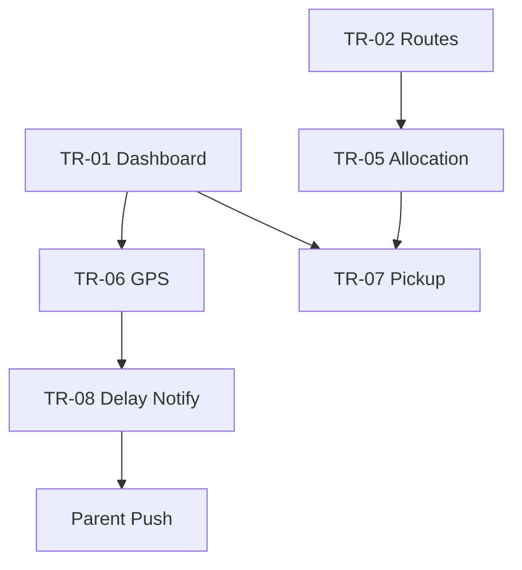

# Akshara ERP — Transport Module Specification (Consolidated)

**Document ID:** `AKS-TR-SPEC-v1.0`  
**Module:** Transport Management  
**Screens:** TR-01 → TR-09  
**Platform:** Web primary · Tablet · Mobile (coordinator companion)  
**Source:** SRS Part 3 §10–12 · DesignSystem.md · Finance.md

---

## Table of Contents

1. [Module Overview](#1-module-overview)
2. [User Roles & Permissions](#2-user-roles--permissions)
3. [Navigation & Information Architecture](#3-navigation--information-architecture)
4. [Shared Design Foundation](#4-shared-design-foundation)
5. [Shared Shell Layout](#5-shared-shell-layout)
6. [Shared Components](#6-shared-components)
7. [TR-01 — Transport Dashboard](#7-tr-01--transport-dashboard)
8. [TR-02 — Routes](#8-tr-02--routes)
9. [TR-03 — Vehicles](#9-tr-03--vehicles)
10. [TR-04 — Drivers](#10-tr-04--drivers)
11. [TR-05 — Student Allocation](#11-tr-05--student-allocation)
12. [TR-06 — GPS Monitoring](#12-tr-06--gps-monitoring)
13. [TR-07 — Pickup Status](#13-tr-07--pickup-status)
14. [TR-08 — Delay Notifications](#14-tr-08--delay-notifications)
15. [TR-09 — Transport Reports](#15-tr-09--transport-reports)
16. [Dialogs & Wizards](#16-dialogs--wizards)
17. [Cross-Module Links](#17-cross-module-links)
18. [Prototype Flow Map](#18-prototype-flow-map)
19. [Responsive Rules](#19-responsive-rules)
20. [Figma File Organization](#20-figma-file-organization)
21. [Build Checklist](#21-build-checklist)

---

## 1. Module Overview

### Purpose

Fleet management: routes, vehicles, drivers, student pickup allocation, live GPS monitoring, delay alerts, and transport reports (SRS Part 3 §10–12).

### Screen Inventory

| ID | Screen | Primary Users | Priority |
|----|--------|---------------|----------|
| TR-01 | Transport Dashboard | Transport Coordinator | P0 |
| TR-02 | Routes | Transport Coordinator | P0 |
| TR-03 | Vehicles | Transport Coordinator | P0 |
| TR-04 | Drivers | Transport Coordinator | P1 |
| TR-05 | Student Allocation | Transport Coordinator | P0 |
| TR-06 | GPS Monitoring | Transport Coordinator | P0 |
| TR-07 | Pickup Status | Transport Coordinator | P0 |
| TR-08 | Delay Notifications | Transport Coordinator | P0 |
| TR-09 | Transport Reports | Transport Coordinator, Management 👁 | P1 |

**Total frames:** 9 primary + 5 dialogs = **14**

---

## 2. User Roles & Permissions

| Action | Transport Coord | Management | Parent | Driver Staff App |
|--------|-----------------|------------|--------|------------------|
| Manage routes | ✅ | 👁 | ❌ | 👁 assigned |
| Live GPS | ✅ | 👁 | 👁 own child | ⚡ own bus |
| Allocate students | ✅ | ❌ | ❌ | ❌ |
| Send delay alerts | ✅ | ❌ | 👁 receive | ❌ |
| Driver records | ✅ | 👁 | ❌ | ⚡ self |
| Export reports | ✅ | ✅ | ❌ | ❌ |

---

## 3. Navigation & Information Architecture

### Side Navigation

| # | Label | Icon | Screen |
|---|-------|------|--------|
| 1 | Dashboard | `dashboard` | TR-01 |
| 2 | Live GPS | `my_location` | TR-06 |
| 3 | Routes | `route` | TR-02 |
| 4 | Vehicles | `directions_bus` | TR-03 |
| 5 | Drivers | `badge` | TR-04 |
| 6 | Allocation | `groups` | TR-05 |
| 7 | Pickup Status | `hail` | TR-07 |
| 8 | Delays | `warning` | TR-08 |
| 9 | Reports | `assessment` | TR-09 |

---

## 4. Shared Design Foundation

Reference **DesignSystem.md**. Map components use Google Maps custom style — muted POI, `primary` route lines.

**Bus marker states:** Moving `success` · Idle `warning` · Delayed `error` · Offline `on-surface-variant`

---

## 5. Shared Shell Layout

**Component:** `Shell/TransportLayout` — standard web admin shell.

---

## 6. Shared Components

| Component | Spec |
|-----------|------|
| `Transport/BusMarker` | 40×40 icon states |
| `Transport/RoutePolyline` | 3px primary active |
| `Transport/StopPin` | 24px · completed success · next primary pulse |
| `Transport/ETAChip` | ≤5min green · 5–15 amber · >15 red |
| `Transport/VehicleDetailPanel` | 360px right dock |
| `Transport/DelayAlertTicker` | 48px banner |

---

## 7. TR-01 — Transport Dashboard

| **Frame** | `TR-01-TransportDashboard-D` |

### Layout Structure

| # | Section | Size |
|---|---------|------|
| 1 | Filter bar | Shift AM/PM · Route |
| 2 | KPI row | 6 × `176×120` |
| 3 | Live map | `1136×480` 60% viewport |
| 4 | Vehicle status table | Below map |
| 5 | Active delays ticker | Error banner |
| 6 | AI insight | Route optimization suggestion |

### KPI Definitions

| # | Label | Example |
|---|-------|---------|
| 1 | Active Buses | 18 |
| 2 | On-Time Rate | 94% |
| 3 | Delayed | 2 |
| 4 | Students Picked | 842 |
| 5 | Driver Absent | 1 |
| 6 | Fuel Cost MTD | ₹84K |

### Vehicle Table Columns

`Bus 80 · Route 140 · Driver 140 · GPS 100 · Students 80 · ETA 80 · Status 100 · Actions 120`

---

## 8. TR-02 — Routes

| **Frame** | `TR-02-Routes-D` |

### Layout Structure

| # | Section |
|---|---------|
| 1 | Filter bar | **+ Create Route** |
| 2 | Routes table |
| 3 | Route editor | Map + stop list split `60/40` |

### Table Columns

`Route ID 100 · Name 180 · Stops 80 · Distance 100 · AM Time 100 · PM Time 100 · Bus 120 · Students 80 · Status 80 · Actions 100`

### Route Editor

Drag-ordered stops · map pin drop · AM/PM schedule · assign vehicle · publish

---

## 9. TR-03 — Vehicles

| **Frame** | `TR-03-Vehicles-D` |

### Table Columns

`Bus # 80 · Registration 120 · Capacity 80 · Route 140 · GPS Device 120 · Insurance Exp 110 · Fitness Exp 110 · Status 100 · Actions 100`

### Status

Active · Maintenance · Retired

---

## 10. TR-04 — Drivers

| **Frame** | `TR-04-Drivers-D` |

### Table Columns

`Name 160 · License 120 · Expiry 100 · Phone 120 · Assigned Bus 100 · Attendance 80 · Rating 80 · Status 80 · Actions 100`

---

## 11. TR-05 — Student Allocation

| **Frame** | `TR-05-StudentAllocation-D` |

### Layout Structure

| # | Section |
|---|---------|
| 1 | Filter bar | Route · Class · Unassigned |
| 2 | KPI row | Allocated · Unassigned · Capacity used |
| 3 | Split | Student search `400` · Route capacity map `736` |
| 4 | Bulk assign toolbar |

### Allocation Table Columns

`Student 180 · Class 80 · Pickup Stop 160 · Drop Stop 160 · Route 100 · Bus 80 · Shift 80 · Actions 80`

---

## 12. TR-06 — GPS Monitoring

| **Frame** | `TR-06-GPSMonitoring-D` |

### Layout Structure

| # | Section | Size |
|---|---------|------|
| 1 | Full map | `1136×640` |
| 2 | Vehicle list sidebar | `320` left or bottom sheet |
| 3 | Detail panel | `360` right |
| 4 | Layer toggles | Routes · Stops · Traffic |

### Detail Panel

Bus photo · driver · speed · last ping · next stop · student count · `Notify Parents` if delayed

---

## 13. TR-07 — Pickup Status

| **Frame** | `TR-07-PickupStatus-D` |

### Layout Structure

| # | Section |
|---|---------|
| 1 | Filter bar | Route · Shift · Status |
| 2 | Real-time table | Auto-refresh |
| 3 | Summary chips | Picked · Waiting · Absent |

### Table Columns

`Student 160 · Stop 140 · Route 100 · Scheduled 80 · Actual 80 · Status 100 · Parent Notified 100 · Actions 80`

### Status Chips

Picked `success` · Waiting `warning` · Absent `error` · Not scheduled neutral

---

## 14. TR-08 — Delay Notifications

| **Frame** | `TR-08-DelayNotifications-D` |

### Layout Structure

| # | Section |
|---|---------|
| 1 | Active delays list |
| 2 | Notification composer |
| 3 | History log |
| 4 | Template selector |

### Delay Workflow

GPS detects delay → alert on TR-01 → coordinator confirms → push to affected parents → log

### Composer Fields

Route · Delay minutes · Reason · Message preview (bilingual) · Send channels Push/SMS

---

## 15. TR-09 — Transport Reports

| **Frame** | `TR-09-TransportReports-D` |

### Report Cards

On-Time Performance · Route Utilization · Fuel Analysis · Driver Attendance · Student Transport List · Incident Log

### Charts

On-time trend line · Delays by route bar · Fuel consumption line

---

## 16. AI Transport Copilot

**Component:** `AI/TransportCopilot` — TR-01, TR-06, TR-08

### Insight Cards

| Card | Use |
|------|-----|
| Delay prediction | ETA vs historical traffic |
| Route optimization | Suggest stop reorder |
| Absent pickup risk | Students not at stop |
| Fuel anomaly | TR-03 vs route distance |

### Example Prompts

- "Which routes are running late today?"
- "Predict delays for Route 12 given rain"
- "List students who missed pickup this week"

### Actions

Broadcast delay (TR-D-03) · Notify parents · Suggest alternate route

---

## 17. Mobile Screen Inventory

See **MobileScreenInventory.md** §2.

| ID | Screen |
|----|--------|
| TR-M-01 | Coordinator Dashboard |
| TR-M-02 | Live Map |
| TR-M-03 | Driver Check-in |
| TR-M-04 | Broadcast Delay |

---

## 18. Dialogs & Wizards

| ID | Name | Size | Used on |
|----|------|------|---------|
| TR-D-01 | CreateRoute | 720 | TR-02 |
| TR-D-02 | AssignStudent | 560 | TR-05 |
| TR-D-03 | NotifyDelay | 560 | TR-08 |
| TR-D-04 | VehicleMaintenance | 560 | TR-03 |
| TR-D-05 | ExportReport | 400 | TR-09 |

---

## 19. Cross-Module Links

| From | To | Trigger |
|------|-----|---------|
| TR-07 absent | Parent app | Push notification |
| TR-06 live | Parent/Student app | Bus tracking |
| TR-05 | Student SIS | Transport flag |
| TR-09 | Management MG-02 | Ops analytics |
| TR-03 | Finance | Fuel expense |
| Delay | AI Transport | Delay prediction |

---

## 20. Prototype Flow Map



---

## 21. Responsive Rules

| Element | Desktop | Tablet | Mobile |
|---------|---------|--------|--------|
| Map | 60–70% height | Full + bottom sheet | Fullscreen |
| Detail panel | 360 right | Bottom sheet | Fullscreen |
| Route editor | Split map/list | Stacked | Stops list only |
| Tables | Full | Scroll | Card list |

---

## 22. Figma File Organization

```
📁 06 — Transport Management
├── Shell · Map markers · Components
├── TR-01 → TR-09 [D/T/M]
├── Dialogs TR-D-01 → TR-D-05
└── Prototype Flows
```

---

## 23. Build Checklist

| Step | Task |
|------|------|
| 1 | Map + marker components |
| 2 | TR-01 + TR-06 GPS (P0) |
| 3 | TR-02 routes + editor |
| 4 | TR-05 allocation |
| 5 | TR-07 pickup + TR-08 delays |
| 6 | TR-03 vehicles · TR-04 drivers |
| 7 | TR-09 reports |
| 8 | Parent notification preview |
| 9 | Mobile coordinator views |
| 10 | Prototype end-to-end |

---

**End of Transport Module Specification v1.0**
