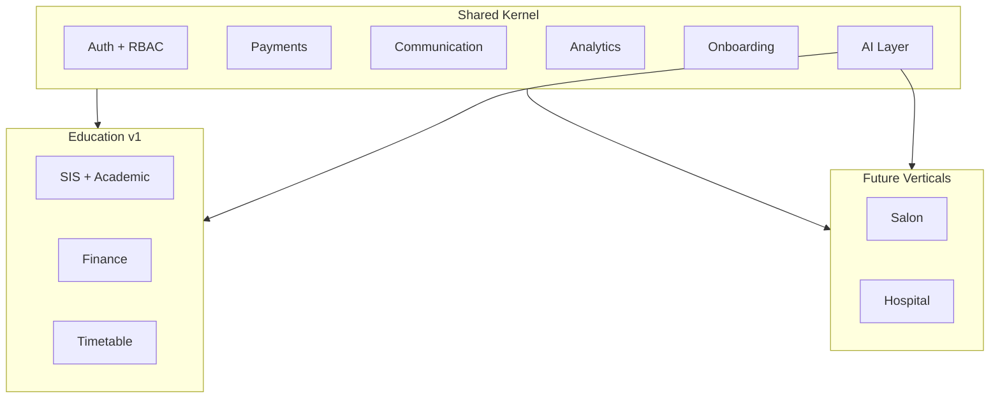

# Akshara — Consolidated Future Vision

**Version:** 2.0  
**Status:** Vision + implementation roadmap (see [`ImplementationRoadmap.md`](./ImplementationRoadmap.md))  
**Baseline:** v1.0-rc1 · v1.0-customer-ready · production stable  
**Last updated:** June 2026

---

## Vision statement

**Single platform. Multiple industries. Shared AI, onboarding, communication, payments, and analytics — with organization-specific experiences.**

v1.0 delivers **education ERP for first-school pilot**. All items below are tracked for evolution; implementation follows dependency order in [`ImplementationRoadmap.md`](./ImplementationRoadmap.md).

---

## P1 — Core school revenue drivers

| # | Capability | Summary |
|---|------------|---------|
| 21 | **Academic Year Transition Engine** | Year rollover, promotion rules, enrollment migration, archive prior year |
| 13 | **Unified Payment Request Engine** | Single payment intent model across fees, events, misc charges |
| 14 | **Online Payment Enhancements** | Parent UX, retries, partial pay, receipt automation |
| 15 | **QR Payment Support** | Scan-to-pay at fee counter and events |
| 16 | **Offline Payment Tracking** | Cash/cheque/UPI-offline with reconciliation |
| 1 | **AI Communication Assistant** | Draft broadcasts, reminders, tone-aware parent messages |
| 2 | **Communication Hub Expansion** | Templates, WA Business, delivery analytics, two-way threads |

---

## P2 — School differentiators

| # | Capability | Summary |
|---|------------|---------|
| 3 | **Student Risk Intelligence** | Attendance + fees + academics → risk scores and alerts |
| 4 | **Parent Guidance Assistant** | Staff copilot for parent conversations and FAQs |
| 5 | **Principal Copilot** | Executive summaries, health score, anomaly briefings |
| 6 | **Teacher Copilot** | Attendance, timetable, class insights for teachers |
| 22 | **AI Education Suite** | Umbrella for generative academic content modules |
| 23 | **AI Question Paper Generator** | Syllabus-aligned papers by exam type |
| 24 | **AI Question Bank** | Tagged reusable questions |
| 25 | **AI Homework Generator** | Chapter-based assignments |
| 26 | **AI Worksheet Generator** | Practice sheets |
| 27 | **AI Report Card Remarks** | Narrative remark drafts |
| 28 | **AI Parent Meeting Summary** | PTM talking points from aggregates |
| 8 | **Smart Timetable Expansion** | Constraints, publish workflow, parent/teacher views |
| 9 | **Workload Engine Expansion** | Teacher load balancing, recommendations |
| 17 | **School Memories** | Photo/event timeline per school year |
| 18 | **Akshara Growth Platform** | Referrals, campaigns, school growth analytics |
| 19 | **Achievement Promotion Engine** | Badges, milestones, shareable achievements |
| 20 | **School Branding** | Logo, colors, custom domain, white label |

---

## P3 — Platform expansion

| # | Capability | Summary |
|---|------------|---------|
| 7 | **Multi-Role Employee System** | Staff with multiple hats (teacher + admin + finance) |
| 10 | **Inventory & Asset Management Expansion** | Full asset lifecycle, depreciation, audits |
| 11 | **Book Distribution System** | Textbook issue/return linked to classes |
| 12 | **Inventory Replacement Workflow** | RMA, warranty, stock replacement |
| 29 | **Universal AI Assistant** | Natural-language ERP across modules |
| 30 | **Universal Organization Builder** | AI interview → modules, roles, dashboards |
| 31 | **Dynamic Widget Platform** | Generated dashboards and navigation |
| 33 | **Salon ERP Foundation** | Appointments, services, staff — Velora |
| 34 | **Hospital ERP Foundation** | Patients, appointments, billing |
| 35 | **Restaurant ERP Foundation** | Orders, kitchen, inventory |
| 36 | **Hostel ERP Foundation** | Beds, mess, fees (extends education hostel) |

---

## P4 — Multi-industry foundation

| # | Capability | Summary |
|---|------------|---------|
| 32 | **Multi-Industry Platform Foundation** | Shared kernel, vertical packs, tenant config |
| — | Security & Pen Testing | Independent validation program |
| — | Observability & Monitoring | SLOs, tracing, alerting |
| — | Multi-School SaaS Operations | Self-service school provision, ops at scale |
| — | WhatsApp Business Integration | Template messaging at scale |
| — | Franchise Management | Org-level multi-school governance |
| — | Multi-Branch Management | Branch-scoped operations within a school |

Design detail per track: [`design/FutureTracks-Index.md`](./design/FutureTracks-Index.md)

---

## A. Universal Organization Builder

AI onboarding interview collects org name, branches, staff/customer scale, workflows, services, channels, payments → outputs enabled modules, permissions, dashboards, widgets, navigation, reports, workflows.

**v1.0:** Manual school SQL provision + CSV import. **Future:** declarative vertical packs + provisioning saga.

---

## B. Dynamic Widget Platform

First-time setup generates dashboard, widgets, navigation, reports, permissions from interview answers. Template-driven; RBAC-bound; education pack ships first.

---

## C. AI Education Suite

Modules 23–28 under one suite: question papers, bank, homework, worksheets, report remarks, parent meeting summaries, lesson planner (future), attendance insights (links to #3).

**Question Paper Generator:** Teacher selects syllabus, class, subject, chapter, difficulty, marks, types → AI generates unit/monthly/quarterly/half-yearly/annual papers with human review gate.

---

## D. Universal AI Assistant

Natural-language ERP: attendance queries, fee reminders, timetable generation, question papers, collections, risk lists. Builds on v7.4 Copilot → v8.x role assistants → universal router.

---

## E. Multi-Industry Platform

| Product | Domain |
|---------|--------|
| Akshara Education ERP | Schools (v1.0) |
| Velora Salon ERP | Appointments, retail |
| Hospital ERP | Patients, clinical billing |
| Restaurant ERP | Orders, kitchen |
| Hostel ERP | Residential ops |

**Shared foundation (v1.0 partial):** auth, payments (v7.0), communication (v7.1), analytics (v7.6), onboarding (v7.15), Copilot (v7.4).

---

## F. Long-Term Ecosystem

---

## Implementation sequence (approved)

| Release | Capability |
|---------|------------|
| **v8.0** | Academic Year Transition Engine |
| **v8.1** | AI Communication Assistant |
| **v8.2** | Parent Guidance Assistant |
| **v8.3** | Teacher Copilot |
| **v8.4** | Principal Copilot Expansion |
| v8.5 | Question Paper Generator |
| v8.6 | Question Bank |
| v8.7 | Homework & Worksheet Generator |
| v8.8 | Report Card Remarks Generator |
| v8.9 | Student Risk Prediction |
| v9.0 | Akshara Growth Platform |
| v9.1 | Achievement Promotion Engine |
| v9.2 | School Branding |
| v9.3 | Universal AI Assistant |
| v9.4 | Universal Organization Builder |
| v9.5 | Dynamic Widget Platform |
| v10.0 | Multi-Industry Foundation |

Full dependency matrix: [`ImplementationRoadmap.md`](./ImplementationRoadmap.md)

---

## v1.0 stability contract

Evolution work must **not break**: onboarding, attendance, finance, payments, communication, analytics, copilot, timetable, tenant isolation, RBAC, audit, 213+ probes.

---

## Related documents

| Document | Purpose |
|----------|---------|
| [`ImplementationRoadmap.md`](./ImplementationRoadmap.md) | Priority, dependencies, rollout |
| [`design/FutureTracks-Index.md`](./design/FutureTracks-Index.md) | Per-track design specs |
| [`../Roadmap.md`](../Roadmap.md) | Shipped milestones |
| [`../Operations/Customer-Readiness-Report.md`](../Operations/Customer-Readiness-Report.md) | First school execution |
