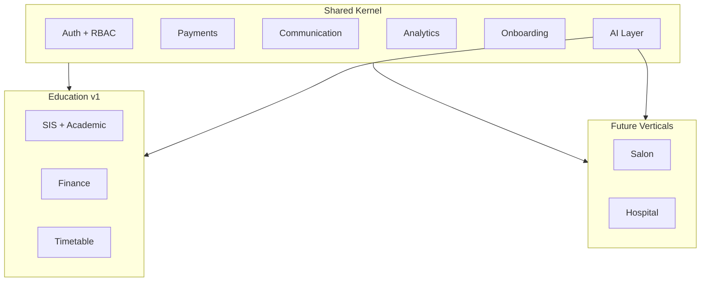

# Akshara — Consolidated Future Vision

**Version:** 2.1  
**Status:** Vision + implementation roadmap (see [`ImplementationRoadmap.md`](./ImplementationRoadmap.md))  
**Baseline:** v1.0-preprod · `release/v1.0-preprod` · Red Team remediation complete  
**Last updated:** June 2026 (Post-RT operational hardening + documentation sync)

---

## Vision statement

**Single platform. Multiple industries. Shared AI, onboarding, communication, payments, and analytics — with organization-specific experiences.**

v1.0 delivers **education ERP for first-school pilot**. All items below are tracked for evolution; implementation follows dependency order in [`ImplementationRoadmap.md`](./ImplementationRoadmap.md).

---

## P1 — Core school revenue drivers

| # | Capability | Summary |
|---|------------|---------|
| 21 | **Academic Year Transition Engine** | Year rollover, promotion rules, enrollment migration, archive prior year |
| 13 | **Unified Payment Request Engine** | Single payment intent model across fees, events, misc charges |
| 14 | **Online Payment Enhancements** | Parent UX, retries, partial pay, receipt automation |
| 15 | **QR Payment Support** | Scan-to-pay at fee counter and events |
| 16 | **Offline Payment Tracking** | Cash/cheque/UPI-offline with reconciliation |
| 1 | **AI Communication Assistant** | Draft broadcasts, reminders, tone-aware parent messages |
| 2 | **Communication Hub Expansion** | Templates, WA Business, delivery analytics, two-way threads |

---

## P2 — School differentiators

| # | Capability | Summary |
|---|------------|---------|
| 3 | **Student Risk Intelligence** | Attendance + fees + academics → risk scores and alerts |
| 4 | **Parent Guidance Assistant** | Staff copilot for parent conversations and FAQs |
| 5 | **Principal Copilot** | Executive summaries, health score, anomaly briefings |
| 6 | **Teacher Copilot** | Attendance, timetable, class insights for teachers |
| 22 | **AI Education Suite** | Umbrella for generative academic content modules |
| 23 | **AI Question Paper Generator** | Syllabus-aligned papers by exam type |
| 24 | **AI Question Bank** | Tagged reusable questions |
| 25 | **AI Homework Generator** | Chapter-based assignments |
| 26 | **AI Worksheet Generator** | Practice sheets |
| 27 | **AI Report Card Remarks** | Narrative remark drafts |
| 28 | **AI Parent Meeting Summary** | PTM talking points from aggregates |
| 8 | **Smart Timetable Expansion** | Constraints, publish workflow, parent/teacher views |
| 9 | **Workload Engine Expansion** | Teacher load balancing, recommendations |
| 17 | **School Memories** | Photo/event timeline per school year |
| 18 | **Akshara Growth Platform** | Referrals, campaigns, school growth analytics |
| 19 | **Achievement Promotion Engine** | Badges, milestones, shareable achievements |
| 20 | **School Branding** | Logo, colors, custom domain, white label |

---

## P3 — Platform expansion

| # | Capability | Summary |
|---|------------|---------|
| 7 | **Multi-Role Employee System** | Staff with multiple hats (teacher + admin + finance) |
| 10 | **Inventory & Asset Management Expansion** | Full asset lifecycle, depreciation, audits |
| 11 | **Book Distribution System** | Textbook issue/return linked to classes |
| 12 | **Inventory Replacement Workflow** | RMA, warranty, stock replacement |
| 29 | **Universal AI Assistant** | Natural-language ERP across modules |
| 30 | **Universal Organization Builder** | AI interview → modules, roles, dashboards |
| 31 | **Dynamic Widget Platform** | Generated dashboards and navigation |
| 33 | **Salon ERP Foundation** | Appointments, services, staff — Velora |
| 34 | **Hospital ERP Foundation** | Patients, appointments, billing |
| 35 | **Restaurant ERP Foundation** | Orders, kitchen, inventory |
| 36 | **Hostel ERP Foundation** | Beds, mess, fees (extends education hostel) |

---

## P4 — Multi-industry foundation

| # | Capability | Summary |
|---|------------|---------|
| 32 | **Multi-Industry Platform Foundation** | Shared kernel, vertical packs, tenant config |
| — | Security & Pen Testing | Independent validation program |
| — | Observability & Monitoring | SLOs, tracing, alerting |
| — | Multi-School SaaS Operations | Self-service school provision, ops at scale |
| — | WhatsApp Business Integration | Template messaging at scale |
| — | Franchise Management | Org-level multi-school governance |
| — | Multi-Branch Management | Branch-scoped operations within a school |

Design detail per track: [`design/FutureTracks-Index.md`](./design/FutureTracks-Index.md)

---

## A. AI School Setup Wizard

When a new school joins, a guided interview captures **student count**, **teacher count**, **board**, **enabled modules**, and **branch count**. The wizard then auto-configures:

- Classes and sections (from scale + board templates)
- Default roles and permission matrices
- Module dashboards and navigation shells
- Onboarding plan (CSV import order, go-live checklist)

**v1.0:** Manual school SQL provision + CSV import (`v7.15` onboarding). **v8.x:** Education Suite modules ship first; wizard consumes the same academic catalog and RBAC registry. **Future:** full declarative provisioning saga with rollback.

---

## B. Universal Organization Builder

AI onboarding interview collects org name, branches, staff/customer scale, workflows, services, channels, payments → outputs enabled modules, permissions, dashboards, widgets, navigation, reports, workflows.

Extends the School Setup Wizard to **Salon**, **Hospital**, **Restaurant**, and **Hostel** vertical packs (#33–36) with shared kernel (auth, payments, communication, analytics).

---

## C. Dynamic Widget Platform

First-time organization setup generates **navigation**, **widgets**, **dashboards**, and **workflows** from the onboarding interview. Template-driven; RBAC-bound; education pack ships first. Widget definitions are tenant-scoped and versioned so schools can evolve layouts without code deploys.

---

## D. AI Education Suite (v8.5–v8.8 delivered)

Modules 23–27 under one suite — **shipped in Evolution Program Phase 2:**

| Module | Status | Notes |
|--------|--------|-------|
| 23 Question Paper Generator | ✅ v8.5 | Bank-first generation; PDF/print export |
| 24 Question Bank | ✅ v8.6 | Search, filter, import/export, reuse |
| 25 Homework Generator | ✅ v8.7 | Practice/revision/holiday types |
| 26 Worksheet Generator | ✅ v8.7 | Same engine, worksheet assignment types |
| 27 Report Card Remarks | ✅ v8.8 | English/Telugu/Hindi; editable before publish |

**Remaining:** #28 Parent Meeting Summary, lesson planner, attendance insights (links to #3).

---

## E. Universal AI Assistant

Natural-language ERP: attendance queries, fee reminders, timetable generation, question papers, collections, risk lists. Builds on v7.4 Copilot → v8.x role assistants → universal router.

---

## F. Multi-Industry Platform

| Product | Domain |
|---------|--------|
| Akshara Education ERP | Schools (v1.0) |
| Velora Salon ERP | Appointments, retail |
| Hospital ERP | Patients, clinical billing |
| Restaurant ERP | Orders, kitchen |
| Hostel ERP | Residential ops |

**Shared foundation (v1.0 partial):** auth, payments (v7.0), communication (v7.1), analytics (v7.6), onboarding (v7.15), Copilot (v7.4).

---

## G. Long-Term Ecosystem

---

## Implementation sequence (approved)

| Release | Capability |
|---------|------------|
| **v8.0** | Academic Year Transition Engine |
| **v8.1** | AI Communication Assistant |
| **v8.2** | Parent Guidance Assistant |
| **v8.3** | Teacher Copilot |
| **v8.4** | Principal Copilot Expansion |
| v8.5 | Question Paper Generator |
| v8.6 | Question Bank |
| v8.7 | Homework & Worksheet Generator |
| v8.8 | Report Card Remarks Generator |
| **v8.9** | Student Risk Prediction Engine ✅ |
| **v9.0** | AI Communication Assistant (Full) ✅ |
| **v9.1** | Parent Guidance Assistant (Full) ✅ |
| **v9.2** | Teacher Success Center ✅ |
| **v9.3** | Principal Intelligence Center ✅ |
| **v9.4** | Homework Intelligence Bridge ✅ |
| **v9.5** | Student 360 Profile ✅ |
| **v9.6** | Employee Platform ✅ |
| **v9.7** | Inventory Distribution Engine ✅ |
| **v9.8** | Parent Experience Bridge ✅ |
| **v9.9** | Employee Intelligence Platform ✅ |
| **v10.0** | School Operations Hub ✅ |
| **v10.1** | Book Distribution Platform ✅ |
| **v10.2** | School Memories Platform ✅ |
| **v10.3** | Achievement Promotion Engine ✅ |
| **v10.4** | Production Hardening + platform design docs ✅ |
| v10.5 | Multi-Industry Foundation (implementation) |
| v10.6 | AI School Setup Wizard (design only) |
| v10.7 | First non-education vertical pilot |
| — | Akshara Growth Platform · School Branding · Universal AI Assistant (future tracks) |

Full dependency matrix: [`ImplementationRoadmap.md`](./ImplementationRoadmap.md)

---

## Phase 5 platform foundation (v9.8–v10.3) — shipped

Phase 5 closes the **Akshara Growth Platform** operational loop for schools:

| Module | Shipped capability | Future track enabled |
|--------|-------------------|----------------------|
| Parent Experience Bridge | Unified parent hub + inventory acknowledgement | Parent Growth campaigns |
| Employee Intelligence | Workload/burnout signals for principals | Multi-role staffing optimization |
| Operations Hub | Daily school health command center | Dynamic widget host |
| Book Distribution | Textbook lifecycle + reporting | Inventory vertical packs |
| School Memories | Event timeline + albums | Alumni engagement + public gallery |
| Achievement Promotion | Shareable achievement workflow | Akshara Growth marketing |

**Foundation readiness for next tracks (documented in v10.4 design specs):**

### Universal Organization Builder (v10.4 design — [`design/Universal-Organization-Builder-v2.md`](./design/Universal-Organization-Builder-v2.md))

Phase 5 provides the **composition patterns** required for AI-driven org setup:

- **Module graph inputs:** Operations Hub already aggregates cross-module KPIs — same aggregation layer can seed dashboard defaults per enabled module.
- **RBAC matrix:** Eight new Phase 5 permissions extend the registry; Organization Builder can emit permission bundles from interview answers using existing `permissions` + `role_permissions` tables.
- **Tenant provisioning:** v7.15 onboarding + Phase 5 probe seeds demonstrate declarative fixture injection.
- **Vertical packs:** Book Distribution and Achievement Promotion are template workflows reusable in Salon/Hospital/Restaurant packs (service delivery, milestone marketing).

### Dynamic Widget Platform ([`design/Dynamic-Widget-Platform.md`](./design/Dynamic-Widget-Platform.md))

Operations Hub `widgets` object is the **first schema-driven widget payload** — attendance, collections, communications, risk alerts, inventory alerts, fee alerts. Future platform will:

- Persist widget definitions per tenant (versioned JSON schema)
- Bind widgets to repository providers (no code deploy for layout changes)
- Generate navigation shells from Organization Builder interview output

Education pack ships first; widget registry generalizes for vertical packs.

### Universal Employee System ([`design/Universal-Employee-System.md`](./design/Universal-Employee-System.md))

Multi-role staff model across School, Salon, Hospital, Restaurant — extends v9.6 Employee Platform and v9.9 Employee Intelligence. Bi-directional membership sync documented for v10.5 implementation.

### Universal Workflow Engine ([`design/Universal-Workflow-Engine.md`](./design/Universal-Workflow-Engine.md))

Declarative lifecycle templates extracted from Achievement Promotion, Memories, and Inventory workflows — reusable across vertical packs at provision time.

### Salon / Hospital / Restaurant ERP (v10.7+ implementation)

Multi-industry foundation builds on Phase 5 + v1.0 kernel:

| Vertical | Phase 5 foundation reused | New pack scope |
|----------|--------------------------|----------------|
| **Salon (Velora)** | Employee intelligence (staff workload), operations hub pattern, achievement promotion (loyalty campaigns) | Appointments, services, retail inventory |
| **Hospital** | Operations hub (daily health), book distribution pattern → supply/issue tracking, parent experience pattern → patient portal | Patients, clinical billing, appointments |
| **Restaurant** | Inventory distribution lifecycle, operations hub (daily ops), memories pattern → menu/event gallery | Orders, kitchen, table management |

Shared kernel unchanged: auth, RBAC, payments (v7.0), communication (v7.1), analytics (v7.6), audit, tenant isolation.

No vertical schema or UI implemented until Multi-Industry Foundation milestone.

---

## Phase 3 intelligence foundation (v8.9–v9.3) — shipped

The **Akshara Intelligence Layer** unifies risk prediction, multilingual communication drafts, parent guidance, teacher success metrics, and principal executive summaries under `/intelligence`. Next evolution strengthens signal ingestion (live communication delivery linkage, scheduled risk recompute) before platform expansion tracks.

**Strengthening (documented, not implemented):**

- **Universal Organization Builder** — [`design/Universal-Organization-Builder-v2.md`](./design/Universal-Organization-Builder-v2.md)
- **Dynamic Widget Platform** — [`design/Dynamic-Widget-Platform.md`](./design/Dynamic-Widget-Platform.md)
- **Universal Employee System** — [`design/Universal-Employee-System.md`](./design/Universal-Employee-System.md)
- **Universal Workflow Engine** — [`design/Universal-Workflow-Engine.md`](./design/Universal-Workflow-Engine.md)
- **AI School Setup Wizard** — guided onboarding using intelligence + analytics signals

---

## H. Communication Vision (Post-RT — implemented mock-first)

**Principle:** Class teachers own parent relationships; subject teachers escalate; every message is auditable.

| Capability | Vision | Implementation status |
|------------|--------|----------------------|
| Class teacher owns parent communication | Only homeroom teacher sends direct messages | ✅ `ParentCommunicationGovernance` |
| Subject teacher escalation | Flag concerns → class teacher review queue | ✅ `SubjectTeacherConcernStore` |
| Audit trail | Sent, delivered, read, acknowledged timeline | 🔄 In-memory; server audit pending |
| Read receipts | Parent detail auto-marks read | ✅ Mock parent repo |
| Parent acknowledgement | Explicit acknowledge action | ✅ Mock parent repo |

**Operational docs:** `docs/Operations/workflows/Teacher-Parent-Communication-Workflow.md` · `Escalation-Workflow.md`

---

## I. Communication Intelligence

**Principle:** Template-first, AI only for custom messages, token optimization, multi-channel delivery.

| Capability | Vision | Status |
|------------|--------|--------|
| Template-first communication | Curated `TeacherParentTemplate` catalog | ✅ Shipped |
| AI only for custom messages | Copilot assists drafts; templates bypass LLM | 🔄 Copilot stub + capability filter |
| Token optimization strategy | Dictionary translation + templates avoid LLM calls | ✅ `TranslationService` |
| Multi-channel communication | In-app, SMS, WhatsApp, email | 🔄 In-app only; channels modeled |

---

## J. Translation Vision

**Principle:** Parents receive messages in their preferred language automatically.

| Capability | Vision | Status |
|------------|--------|--------|
| Parent preferred language | Per-student language map | 🔄 `ParentCommunicationStore` seed |
| Automatic translation | `TranslatedMessagePair` on send | ✅ Parent comm path |
| Multi-language notifications | Notices, exams, insights bilingual | 🔄 Mock parent/student only |
| Supported languages | en, te, hi, ta, kn, ml, ur | ✅ Catalog ~53 phrases |

**Rollout in progress:** ERP screens, teacher UI, homework, announcements remain English.

---

## K. Student Intelligence (Mobile Teacher)

| Capability | Vision | Status |
|------------|--------|--------|
| Student 360 | Single-screen risk + factors + history | ✅ `TeacherStudentRiskScreen` |
| Students requiring attention today | Prioritized dashboard list | ✅ `attentionForClass()` |
| Risk prioritization | Low / medium / high with factor enumeration | ✅ Heuristic engine |
| Suggested outreach | Template deep-links from risk screen | ✅ |

**Operational doc:** `docs/Operations/workflows/Student-Risk-Workflow.md`

---

## L. Startup Onboarding

| Capability | Vision | Status |
|------------|--------|--------|
| Unified onboarding | Profile → curriculum → fees → branding → modules → go-live | ✅ UI + hybrid repo |
| Go Live workflow | Status flip + checklist | 🔄 Local/API status only |
| Tenant setup automation | Declarative module + RBAC provision | ⏳ Planned |

**Operational doc:** `docs/Operations/workflows/Unified-Onboarding-Workflow.md`

---

## M. Backup Vision

| Capability | Vision | Status |
|------------|--------|--------|
| Akshara-managed backups | Nightly incremental + weekly full per tenant | 📐 Architecture doc |
| School-owned exports | ZIP manifest with domain folders | 📐 Architecture doc |
| Google Drive export | OAuth destination picker | 🔄 UI stub |
| OneDrive export | OAuth destination picker | 🔄 UI stub |

**Docs:** `../archive/planning/BACKUP_RESTORE_ARCHITECTURE.md` · `../archive/planning/BACKUP_RECOVERY_ARCHITECTURE.md` (infra PITR)

---

## N. M15 Theme Modernization Vision

| Element | Vision | Status |
|---------|--------|--------|
| Premium theme | Refined color system, semantic tokens | ⏳ Not started |
| Glass surfaces | Frosted cards on shell backgrounds | ⏳ Readiness only |
| KPI cards | Elevated metrics with drill-through preserved | ⏳ Readiness only |
| Role-based illustrations | Persona art per dashboard | ⏳ Planned |

| Role | Illustration concept |
|------|---------------------|
| Student | Astronaut exploring learning |
| Parent | Family supporting student journey |
| Teacher | Classroom collaboration |
| Principal | School building / community |
| Director | Network of connected schools |

**Readiness:** `../archive/design/M15_THEME_MODERNIZATION_READINESS.md` — READY TO BEGIN on dedicated branch.

---

## O. Academic Assessment Platform → Assessment Intelligence Platform

| Capability | Status | Doc |
|------------|--------|-----|
| Bank-first assessment workflow | ✅ Shipped & live-certified (Batches 8b/8c) | `../archive/completed/QUESTION_INTELLIGENCE_LIVE_CERTIFICATION.md` |
| Question paper generation (formal exams) | ✅ Shipped (governed lifecycle, principal-only approval) | Distinct from Evolution FV-23 |
| Assessment AI (constrained gap-fill, candidates only) | ✅ Shipped, safe-by-default | — |
| **Assessment Intelligence Platform (long-term vision)** | 🔒 Locked owner vision (2026-07-02), phased | [`design/Assessment-Intelligence-Platform.md`](./design/Assessment-Intelligence-Platform.md) |

---

## v1.0 stability contract

Evolution work must **not break**: onboarding, attendance, finance, payments, communication, education suite, analytics, copilot, timetable, tenant isolation, RBAC, audit, 216+ probes.

---

## Related documents

| Document | Purpose |
|----------|---------|
| [`ImplementationRoadmap.md`](./ImplementationRoadmap.md) | Priority, dependencies, rollout |
| [`design/FutureTracks-Index.md`](./design/FutureTracks-Index.md) | Per-track design specs |
| [`../archive/roadmap/Roadmap.md`](../archive/roadmap/Roadmap.md) | Shipped milestones |
| [`../archive/temporary/DOCUMENTATION_SYNC_REPORT.md`](../archive/temporary/DOCUMENTATION_SYNC_REPORT.md) | June 2026 documentation sync + gap analysis |
| [`../archive/audit/architecture-review/v1.0-Post-RedTeam-Operational-Hardening.md`](../archive/audit/architecture-review/v1.0-Post-RedTeam-Operational-Hardening.md) | Post-RT architecture |
| [`../Operations/workflows/`](../Operations/workflows/) | Operational process flows |
