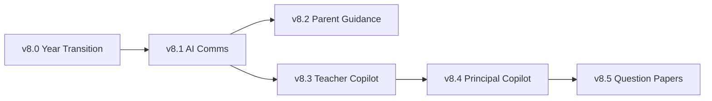

# Akshara Evolution — Implementation Roadmap

**Version:** 1.0  
**Parent:** [`FutureVision.md`](./FutureVision.md)  
**Rule:** Implement in dependency order; v1.0 production paths remain stable.

---

## Priority legend

| Tier | Meaning |
|------|---------|
| **P1** | Core school revenue drivers |
| **P2** | School differentiators |
| **P3** | Platform expansion |
| **P4** | Multi-industry foundation |

---

## Master capability matrix

| # | Capability | Priority | Business value | Dependencies | Architecture impact | Data model | AI | Rollout | Target |
|---|------------|:--------:|----------------|--------------|---------------------|------------|-----|---------|--------|
| 21 | Academic Year Transition | P1 | Critical — annual ops | Academic catalog, SIS enrollments | New transition service | `academic_year_transitions` | No | Medium | **v8.0** |
| 1 | AI Communication Assistant | P1 | Fee reminders, comms efficiency | Communication hub, Copilot | Copilot context expansion | None | LLM | Low | **v8.1** |
| 4 | Parent Guidance Assistant | P2 | Parent satisfaction | v8.1, SIS read | New copilot persona | None | LLM | Low | **v8.2** |
| 6 | Teacher Copilot | P2 | Teacher adoption | Timetable, attendance | New copilot persona | None | LLM | Low | **v8.3** |
| 5 | Principal Copilot Expansion | P2 | Leadership decisions | Analytics v7.6 | Copilot persona split | None | LLM | Low | **v8.4** |
| 23 | Question Paper Generator | P2 | Academic differentiation | Question bank, syllabus | New education module | `edu_question_papers` | LLM+RAG | High | v8.5 |
| 24 | Question Bank | P2 | Reuse, quality | Academic catalog | CRUD module | `edu_question_bank` | Optional | Medium | v8.6 |
| 25 | Homework Generator | P2 | Teacher time save | v8.6, syllabus | Content service | `edu_content_jobs` | LLM | Medium | v8.7 |
| 26 | Worksheet Generator | P2 | Teacher time save | v8.7 | Shared content service | Same | LLM | Medium | v8.7 |
| 27 | Report Card Remarks | P2 | Report season | SIS, academics | Content service | Same | LLM | Medium | v8.8 |
| 28 | Parent Meeting Summary | P2 | PTM prep | Analytics, SIS | Content service | Same | LLM | Low | v8.8 |
| 3 | Student Risk Intelligence | P2 | Retention | Attendance, finance, analytics | Risk scoring service | `student_risk_scores` | Rules+ML | Medium | v8.9 |
| 18 | Akshara Growth Platform | P2 | School acquisition | Analytics, CRM patterns | Growth module | `growth_campaigns` | Optional | High | v9.0 |
| 19 | Achievement Promotion Engine | P2 | Engagement | SIS, comms | Gamification layer | `achievements` | No | Medium | v9.1 |
| 20 | School Branding | P2 | White label | Tenant config | Theme service | `school_branding` | No | Low | v9.2 |
| 29 | Universal AI Assistant | P3 | Platform moat | v8.1–v8.4 copilots | NL router + tools | None | LLM | High | v9.3 |
| 30 | Universal Organization Builder | P3 | Multi-vertical GTM | v9.3, provisioning saga | Config generator | `org_profiles` | LLM interview | High | v9.4 |
| 31 | Dynamic Widget Platform | P3 | Setup UX | v9.4 | Widget graph engine | `widget_layouts` | LLM | High | v9.5 |
| 32 | Multi-Industry Foundation | P4 | New markets | v9.4, v9.5 | Vertical packs | Pack registry | No | Very high | v10.0 |
| 2 | Communication Hub Expansion | P1 | Parent reach | v8.1, WA integration | Channel adapters | Template tables | Optional | Medium | v8.1+ |
| 13 | Unified Payment Request Engine | P1 | Revenue | v7.0 payments | Payment orchestrator | Extend intents | No | Medium | Post-v8 |
| 14 | Online Payment Enhancements | P1 | Conversion | #13 | Parent payment UX | None | No | Low | Post-v8 |
| 15 | QR Payment Support | P1 | Counter speed | #13, Razorpay | QR intent type | `payment_qr_sessions` | No | Medium | Post-v8 |
| 16 | Offline Payment Tracking | P1 | India reality | Finance collections | Offline receipt flow | Extend collections | No | Low | Post-v8 |
| 7 | Multi-Role Employee System | P3 | Real schools | RBAC v6.1 | Multi-membership | `user_role_assignments` | No | Medium | v9.x |
| 8 | Smart Timetable Expansion | P2 | Daily ops | v7.5 timetable | Engine rules | Extend timetable | Advisor | Medium | v8.x |
| 9 | Workload Engine Expansion | P2 | Fair scheduling | v7.5 | Workload service | None | Rules | Low | v8.x |
| 10 | Inventory & Asset Expansion | P3 | Ops schools | v7.2 inventory | Asset module | `assets` | No | High | v9.x |
| 11 | Book Distribution System | P3 | Textbook ops | Inventory, SIS | Distribution workflow | `book_issues` | No | Medium | v9.x |
| 12 | Inventory Replacement Workflow | P3 | Asset lifecycle | #10 | RMA workflow | `inventory_rma` | No | Medium | v9.x |
| 17 | School Memories | P2 | Engagement | Storage, comms | Media gallery | `school_memories` | Optional | Medium | v9.x |
| 33 | Salon ERP Foundation | P4 | New vertical | v10.0 kernel | Velora pack | Vertical schema | Optional | Very high | v10+ |
| 34 | Hospital ERP Foundation | P4 | New vertical | v10.0 | Hospital pack | Vertical schema | Optional | Very high | v10+ |
| 35 | Restaurant ERP Foundation | P4 | New vertical | v10.0 | Restaurant pack | Vertical schema | No | Very high | v10+ |
| 36 | Hostel ERP Foundation | P4 | Education extension | Hostel read v6.2 | Full write path | Extend hostel | No | High | v10+ |

---

## Cross-cutting tracks (P3/P4)

| Track | Priority | Dependencies | Doc |
|-------|----------|--------------|-----|
| Security & Pen Testing | P3 | v1.0 GA | [`design/Security-Pen-Testing.md`](./design/Security-Pen-Testing.md) |
| Observability & Monitoring | P3 | Production traffic | [`design/Observability-Monitoring.md`](./design/Observability-Monitoring.md) |
| Multi-School SaaS Operations | P3 | First school success | [`design/Multi-School-SaaS-Operations.md`](./design/Multi-School-SaaS-Operations.md) |
| WhatsApp Business Integration | P1/P2 | Communication hub | [`design/WhatsApp-Business-Integration.md`](./design/WhatsApp-Business-Integration.md) |
| Franchise Management | P3 | Multi-school | [`design/Franchise-Management.md`](./design/Franchise-Management.md) |
| Multi-Branch Management | P3 | Branch RLS | [`design/Multi-Branch-Management.md`](./design/Multi-Branch-Management.md) |

---

## v8.0–v8.4 implementation gate (each milestone)

Before code:

1. Architecture review (`docs/ArchitectureReview/v8.x-*.md`)
2. Release plan (`docs/Releases/v8.x-*.md`)
3. Migration plan (SQL file when schema changes)
4. Security review (RBAC + tenant scope)
5. RBAC plan (route inventory update)

After code:

- `deno test` + `flutter test`
- Roadmap + BackendRoadmap update
- Git tag `v8.x-*`

---

## Dependency graph (v8 wave)

---

## Risk register (evolution)

| Risk | Mitigation |
|------|------------|
| Breaking v1.0 pilot | Contract tests + probe CI on every v8 tag |
| AI cost at scale | Stub mode + per-school token budgets |
| Scope creep | One capability per minor release |
| Year transition data loss | Preview + rollback audit; dry-run required |
