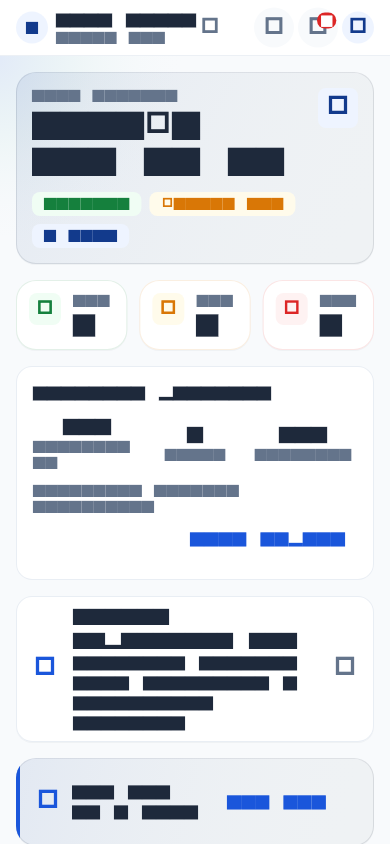
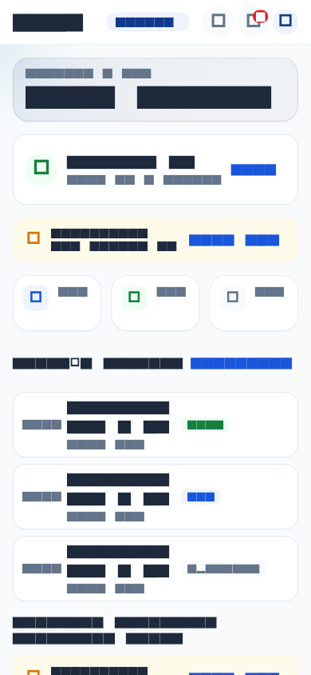
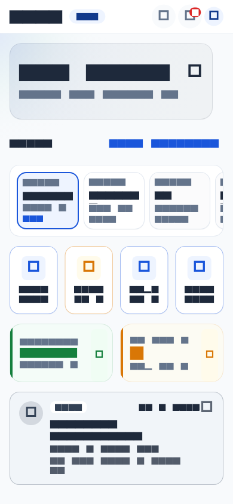
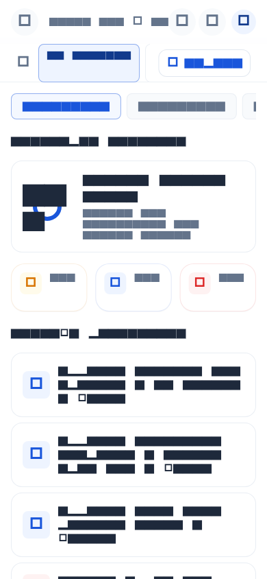
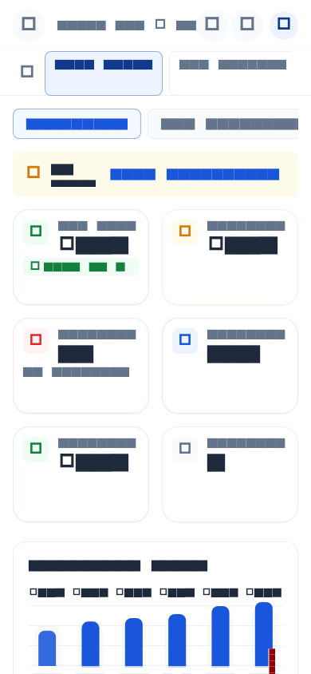
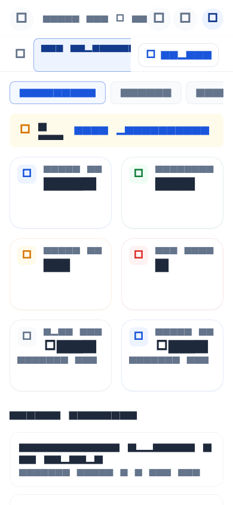
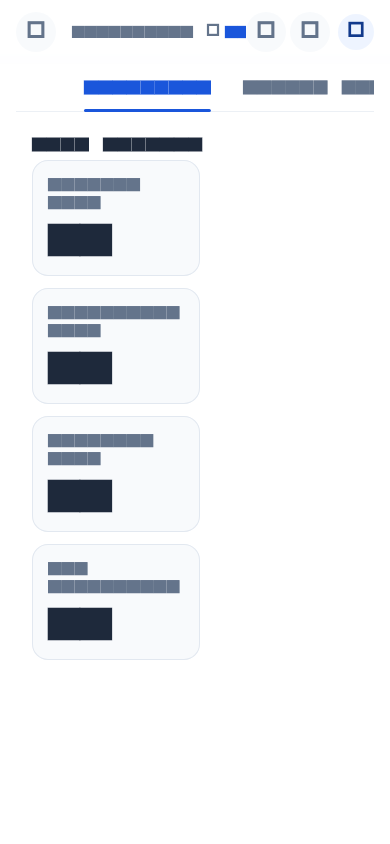
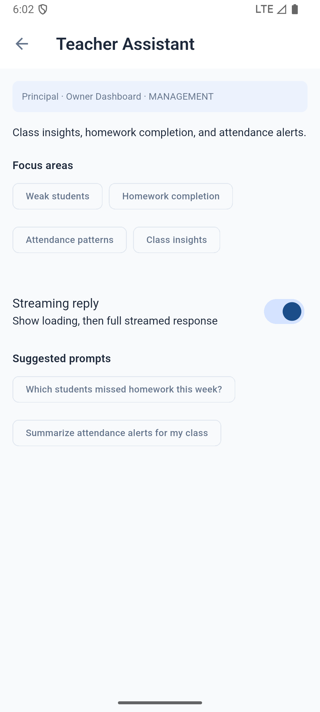

# M15 Visual Gap Report — Live & Rendered Audit

**Date:** 2026-06-17  
**Branch audited:** `feature/m15-theme` (`e119d6f`)  
**Method:** Code inspection + golden renders (`test/golden/goldens/`) + one live emulator capture  
**Certification docs ignored** — this report reflects what the UI actually shows.

---

## Executive summary

M15 delivered real improvements (tokens, `AksharaKpiCard`, mobile glass heroes, chart shells, admin nav chrome), but **no major dashboard qualifies as fully M15-complete** against the stated premium/AI-native goals. The product still reads as a polished Material ERP with selective premium accents, not a cohesive premium education platform.

| Classification | Count (major dashboards) |
|----------------|--------------------------|
| **M15 Complete** | 0 |
| **Partial** | 16 |
| **Not Migrated** | 3 (Intelligence Hub, Copilot workspace, Copilot persona shells) |

### Cross-cutting gaps (all personas)

| M15 goal | Status | Evidence |
|----------|--------|----------|
| Glass surfaces (hero / KPI / dialog zones) | **Mobile heroes only** | `AksharaGlass*` used in 3 mobile hero widgets + `AksharaInsightCard` (blur off) + `AksharaGlassBar` on admin app bar. **Zero ERP dashboard glass.** |
| Dashboard watermarks (Phase 9) | **Not implemented** | Deferred; no line-art backgrounds anywhere |
| KPI card migration | **~85% on dashboards** | Module `*KpiRow` widgets use `AksharaKpiCard`; Intelligence Hub still uses private `_KpiCard` (Material) |
| Chart migration | **~55%** | Trend charts use M15 shells; segment/breakdown panels still `Card` + `LinearProgressIndicator` |
| Empty / error / loading | **Strong on ERP** | `ErpAsyncBody` / `AksharaEmptyIllustration` on module dashboards; Intelligence tabs use plain `AksharaEmptyState` without illustrations |
| Premium AI feel | **Weak outside insight strips** | Copilot screens are plain forms; list content is `Card` + `ListTile` throughout ERP |
| Layout overflows (live) | **Confirmed on mobile** | Parent dashboard ~172px `RenderFlex` overflow (prior session logs); Finance golden shows chart-axis overflow strip; Intelligence Hub ~249px overflow reported live |

### Screenshot sources

| File | What it shows |
|------|----------------|
| `screenshots/emulator_current.png` | Live emulator — **Teacher Assistant** (Copilot persona shell) |
| `screenshots/parent_dashboard_390x844_golden.png` | Parent dashboard (golden render) |
| `screenshots/teacher_dashboard_390x844_golden.png` | Teacher dashboard (golden render) |
| `screenshots/student_dashboard_390x844_golden.png` | Student dashboard (golden render) |
| `screenshots/management_dashboard_390x844_golden.png` | Management / Principal dashboard |
| `screenshots/finance_dashboard_390x844_golden.png` | Finance dashboard |
| `screenshots/inventory_dashboard_390x844_golden.png` | Inventory dashboard |
| `screenshots/intelligence_dashboard_390x844_golden.png` | Intelligence Hub (Analytics tab) |

> Golden images are deterministic widget renders at 390×844 (same build as CI). They represent post-M15 code accurately; live emulator was unavailable for a full persona sweep after disconnect.

---

## Classification rubric

| Label | Meaning |
|-------|---------|
| **M15 Complete** | KPI row migrated; charts/panels on M15 shells; glass in designated hero/KPI zones; empty states with illustrations; no legacy `Card`+`ListTile` clusters; premium/AI visual language throughout |
| **Partial** | KPI row migrated and/or hero glass present, but significant legacy Material surfaces, missing glass, legacy segment panels, or overflow issues remain |
| **Not Migrated** | Custom pre-M15 KPI/widgets dominate; standard ERP layout; no glass; reads as pre-M15 feature screen |

---

## Mobile personas

### 1. Parent Dashboard — **Partial**

| Check | Result |
|-------|--------|
| Glass hero | ✅ `HeroCard` → `AksharaGlassHeroBackdrop` + `AksharaGlassCard` |
| KPI cards | ✅ Row of 3× `AksharaKpiCard` (filled) |
| AI insight | ✅ `AksharaInsightCard` (tinted glass, blur disabled) |
| Legacy surfaces | ❌ `_AcademicHeroCard`, `NoticeCarousel`, `EventCard` — bespoke Material cards, not `AksharaSurfaceCard` |
| Watermarks | ❌ |
| Empty illustrations | ⚠️ `MobileAsyncBody` — loading/error only |
| Overflow | ❌ Live session: `RenderFlex overflowed by 172 pixels` on narrow mobile |

**Feels like:** Top third is premium mobile; notices/events/quick actions revert to standard app cards.

**Key files:** `lib/features/parent/dashboard/parent_dashboard_screen.dart`, `widgets/hero_card.dart`, `widgets/notice_carousel.dart`, `widgets/event_card.dart`

---

### 2. Teacher Dashboard — **Partial**

| Check | Result |
|-------|--------|
| Glass hero | ✅ `GreetingHeader` glass stack |
| KPI cards | ✅ 3× `AksharaKpiCard` inside `AttendanceSummaryCard` |
| Legacy surfaces | ❌ Check-in banner, schedule tiles, task list — Material `Card` / colored containers |
| AI insight | ⚠️ Present on some builds via insight card pattern |
| Watermarks | ❌ |

**Feels like:** Strong greeting strip; body is functional teacher ERP tiles.

**Key files:** `lib/features/teacher/dashboard/teacher_dashboard_screen.dart`, `widgets/greeting_header.dart`, `widgets/attendance_summary_card.dart`

---

### 3. Student Dashboard — **Partial**

| Check | Result |
|-------|--------|
| Glass hero | ✅ `HeroGreetingCard` glass stack |
| KPI cards | ✅ `AttendanceKpiCard` → `AksharaKpiCard` (status + count styles) |
| Legacy surfaces | ❌ Exam/homework/schedule cards — bespoke Material |
| Horizontal subject chips | ❌ Standard outlined cards, not glass |
| Watermarks | ❌ |

**Feels like:** Best mobile hero execution; mid/body still prototype Material cards.

**Key files:** `lib/features/student/dashboard/student_dashboard_screen.dart`, `widgets/hero_greeting_card.dart`, `widgets/attendance_kpi_card.dart`

---

## ERP module dashboards (Principal / Admin)

### 4. Management (Owner) Dashboard — **Partial**

| Check | Result |
|-------|--------|
| Glass | ❌ No glass on dashboard body; admin shell may use `AksharaGlassBar` |
| KPI row | ✅ `ManagementKpiRow` → `AksharaKpiCard` |
| Charts | ✅ `ManagementTrendChart` (M15 chart shell) |
| Segment panel | ❌ `ManagementSegmentPanel` — legacy `Card` + progress bars |
| Snapshot cards | ❌ `_AdmissionsSnapshotCard`, `_FeeSnapshotCard` — `Card` |
| Approval queue | ❌ `Card` + `ListTile` |
| AI | ✅ `AksharaInsightCard` at bottom |
| Principal overview | ⚠️ `ManagementPrincipalOverviewPanel` uses `AksharaSurfaceCard` (partial) |

**Feels like:** KPI + trend chart upgraded; everything below the fold is classic ERP admin.

---

### 5. Finance Dashboard — **Partial**

| Check | Result |
|-------|--------|
| Glass | ❌ |
| KPI row | ✅ `FinanceKpiRow` |
| Charts | ✅ `FinanceCollectionTrendChart` → `AksharaChartCard` |
| Tables / queues | ❌ `FinanceRecentPaymentsTable`, `FinanceHandoffQueue` — `Card` wrappers |
| Warning banner | ✅ `AksharaWarningBanner` (M15) |
| AI insight | ✅ `AksharaInsightCard` |
| Overflow | ❌ Golden capture shows axis/legend overflow (red hatched debug region) |

**Feels like:** Strongest ERP dashboard for KPI + chart; payment list still flat ERP.

---

### 6. Inventory Dashboard — **Partial**

| Check | Result |
|-------|--------|
| Glass | ❌ |
| KPI row | ✅ `InventoryKpiRow` |
| Charts | ❌ `InventorySegmentPanel` — legacy `Card` |
| Activity / stock cards | ❌ Multiple `Card` widgets in screen file |
| AI insight | ⚠️ If present, uses insight card; activity lists are Material |

---

### 7. Intelligence Hub — **Not Migrated**

| Check | Result |
|-------|--------|
| Glass | ❌ |
| KPI cards | ❌ **8+ `_KpiCard` widgets** — custom `Material` + `surfaceContainerLow`, not `AksharaKpiCard` |
| Charts / trends | ❌ Risk/trend tabs use `Card` + `ListTile` patterns |
| Tab shell | ❌ Standard `TabBar` in fixed height; no M15 sub-nav chrome |
| Empty states | ⚠️ Text-only `AksharaEmptyState`, no illustrations |
| Overflow | ❌ Live: ~249px `RenderFlex` overflow on mobile tab content |

**Feels like:** The largest visual regression vs M15 goals — flagship “Analytics & Intelligence” still looks like internal admin tooling.

**Key file:** `lib/features/management/intelligence/intelligence_hub_screen.dart` (`_KpiCard` at line 526)

---

### 8. HR Dashboard — **Partial**

| Check | Result |
|-------|--------|
| KPI row | ✅ `HrKpiRow` |
| Charts | ✅ `HrTrendChart` (M15) |
| Leave / recruitment lists | ❌ `_PendingLeaveList`, `_RecruitmentSnapshot` — `Card` + `ListTile` |
| AI insight | ✅ `AksharaInsightCard` |

*No golden baseline; classification from code.*

---

### 9. SIS Dashboard — **Partial**

| Check | Result |
|-------|--------|
| KPI row | ✅ `SisKpiRow` |
| Distribution | ❌ `SisDistributionPanel` — legacy `Card` |
| Tables / queues | ❌ `SisRecentEnrollmentsTable`, `SisEnrollmentQueue` — Material |
| AI insight | ✅ `AksharaInsightCard` |

---

### 10. Admissions Dashboard — **Partial**

| Check | Result |
|-------|--------|
| KPI row | ✅ `AdmissionsDashboardKpiRow` |
| Charts | ✅ `AdmissionsChartPanel` (M15 chart shell) |
| Pipeline / tables | ⚠️ Custom widgets; mixed M15 section headers |
| Glass | ❌ |

---

### 11. Library Dashboard — **Partial**

| Check | Result |
|-------|--------|
| KPI row | ✅ `LibraryKpiRow` |
| Segment panel | ❌ `LibrarySegmentPanel` — legacy `Card` |
| Activity card | ❌ `Card` in dashboard screen |

---

### 12. Control Center Dashboard — **Partial**

| Check | Result |
|-------|--------|
| KPI row | ✅ `ControlCenterKpiRow` |
| Segment panel | ❌ `ControlCenterSegmentPanel` — legacy `Card` |
| Glass | ❌ |

---

### 13. Transport Dashboard — **Partial**

| Check | Result |
|-------|--------|
| KPI row | ✅ `TransportKpiRow` |
| Segment / route cards | ❌ `TransportSegmentPanel` + 3× `Card` in screen |

---

### 14. Hostel Dashboard — **Partial**

| Check | Result |
|-------|--------|
| KPI row | ✅ `HostelKpiRow` |
| Segment panel | ❌ `HostelSegmentPanel` |
| Occupancy cards | ❌ `Card` widgets |

---

### 15. Alumni Dashboard — **Partial**

| Check | Result |
|-------|--------|
| KPI row | ✅ `AlumniKpiRow` |
| Segment / engagement | ❌ `AlumniSegmentPanel` + `Card` list sections |

---

## Director suite (multi-school)

### 16. Director Executive Dashboard — **Partial**

| Check | Result |
|-------|--------|
| KPI row | ✅ `DirectorKpiRow` → `AksharaKpiCard` |
| School portfolio | ❌ `Card` + `ListTile` + `CircleAvatar` per school |
| Executive summary | ❌ `DirectorExecutiveSummaryCard` — legacy `Card` |
| Empty state | ❌ Plain `AksharaLoadingState` / error; no illustrated empty |

**Sub-screens** (Admissions, Growth, Revenue, Portfolio, Marketing, Reports): KPI rows migrated; **`DirectorMetricTile` still wraps content in `Card`** on each screen.

---

## AI / Copilot surfaces

### 17. Copilot Workspace (`CopilotScreen`) — **Not Migrated**

| Check | Result |
|-------|--------|
| Layout | Standard `AdminContentScaffold` + sidebar list |
| Glass / premium chrome | ❌ |
| Chat bubbles / streaming UI | Plain `ListTile` / text blocks |
| Illustrations | ❌ |

---

### 18. Copilot Persona Shell (e.g. Teacher Assistant) — **Not Migrated**

| Check | Result |
|-------|--------|
| Glass | ❌ Flat white scaffold |
| KPI / charts | N/A |
| Controls | Outlined tonal chips + `SwitchListTile` — pre-M15 Material |
| Breadcrumb pill | Light blue container; not glass bar |
| Premium AI feel | ❌ Reads as settings form, not AI copilot product |

**Key files:** `lib/features/copilot/persona/copilot_persona_shell_screen.dart`, `lib/features/copilot/copilot_screen.dart`

---

## Admin shell & navigation — **Partial**

| Surface | Status |
|---------|--------|
| `AksharaGlassBar` on admin app bar | ✅ M15 |
| Navigation rail / sub-nav tabs | ✅ M15 tokens (`akshara_navigation.dart`) |
| Module scaffolds (filters, export buttons) | ✅ Updated chips/buttons |
| Content bodies | ❌ Inherit module legacy cards |

---

## Legacy widget inventory (migration backlog)

These patterns appear repeatedly and block “premium platform” classification:

| Pattern | Occurrences (features) | M15 replacement |
|---------|---------------------|-----------------|
| `ManagementSegmentPanel` and siblings (`*SegmentPanel`) | 8 modules | `AksharaChartCard` or donut shell |
| `Card` + `ListTile` queues/tables | 30+ screens | `AksharaSurfaceCard` + dense list row |
| `_KpiCard` (Intelligence) | 1 screen, 8+ instances | `AksharaKpiCard` |
| `DirectorMetricTile` / `DirectorExecutiveSummaryCard` | 6+ director screens | `AksharaKpiCard` / `AksharaSurfaceCard` |
| Mobile `EventCard`, `NoticeCarousel`, exam/homework tiles | 3 personas | `AksharaSurfaceCard` + motion |
| Dashboard watermarks | 0 | Phase 9 artwork |

---

## Overflow & stability issues (visual defects)

| Screen | Symptom | Severity |
|--------|---------|----------|
| Parent dashboard | `RenderFlex overflow` ~172px on 390px-wide mobile | **High** — visible yellow/black stripes in debug |
| Intelligence Hub | `RenderFlex overflow` ~249px in tab content | **High** |
| Finance dashboard | Chart axis/legend clip overflow in golden | **Medium** |
| Teacher Assistant (live) | No overflow in capture | — |

---

## Priority remediation order (visual-only)

1. **Intelligence Hub** — replace `_KpiCard`, fix tab overflow, add illustrated empty states  
2. **Segment panels** (management, HR, library, transport, hostel, alumni, control center, inventory) — migrate to `AksharaChartCard`  
3. **ERP snapshot / queue cards** — unify on `AksharaSurfaceCard`  
4. **Mobile body cards** (parent notices/events, teacher tasks, student exam tiles)  
5. **Copilot persona + workspace** — glass header, premium prompt chips, streaming message chrome  
6. **Director portfolio tiles** — surface card + status chips  
7. **Overflow fixes** — parent dashboard, intelligence hub, finance chart mobile layout  
8. **Phase 9 watermarks** — after design approval  

---

## Summary table

| # | Screen | Classification | Glass | KPI migrated | Charts M15 | Premium feel |
|---|--------|----------------|-------|--------------|------------|--------------|
| 1 | Parent Dashboard | Partial | Hero only | ✅ | N/A | Mixed |
| 2 | Teacher Dashboard | Partial | Hero only | ✅ | N/A | Mixed |
| 3 | Student Dashboard | Partial | Hero only | ✅ | N/A | Mixed |
| 4 | Management Dashboard | Partial | ❌ | ✅ | Partial | ERP |
| 5 | Finance Dashboard | Partial | ❌ | ✅ | ✅ | ERP+ |
| 6 | Inventory Dashboard | Partial | ❌ | ✅ | ❌ | ERP |
| 7 | Intelligence Hub | **Not Migrated** | ❌ | ❌ | ❌ | ERP |
| 8 | HR Dashboard | Partial | ❌ | ✅ | ✅ | ERP |
| 9 | SIS Dashboard | Partial | ❌ | ✅ | ❌ | ERP |
| 10 | Admissions Dashboard | Partial | ❌ | ✅ | ✅ | ERP |
| 11 | Library Dashboard | Partial | ❌ | ✅ | ❌ | ERP |
| 12 | Control Center Dashboard | Partial | ❌ | ✅ | ❌ | ERP |
| 13 | Transport Dashboard | Partial | ❌ | ✅ | ❌ | ERP |
| 14 | Hostel Dashboard | Partial | ❌ | ✅ | ❌ | ERP |
| 15 | Alumni Dashboard | Partial | ❌ | ✅ | ❌ | ERP |
| 16 | Director Dashboard | Partial | ❌ | ✅ | N/A | ERP |
| 17 | Copilot Workspace | **Not Migrated** | ❌ | N/A | N/A | ERP |
| 18 | Copilot Persona Shells | **Not Migrated** | ❌ | N/A | N/A | ERP |

---

*Generated from code + golden + live capture audit. No application code was modified.*
