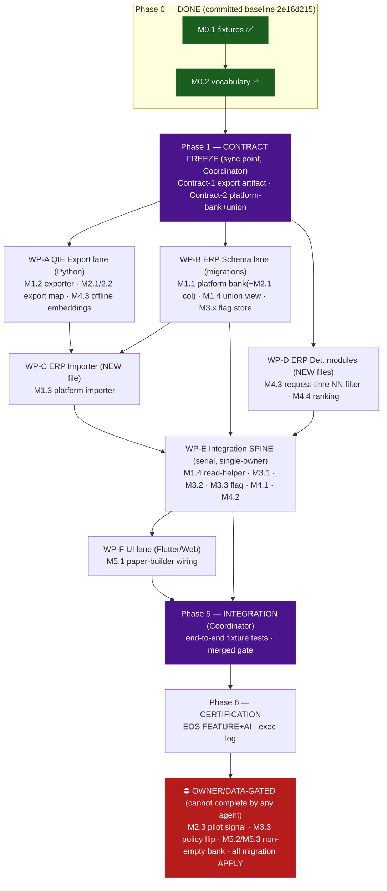

# PROGRAM D — Master Parallel-Execution Coordination Plan
## Lead Coordinator hand-off for multi-agent implementation

**Status:** 📐 **Coordination planning — documentation only.** No code, schema, migration, live call,
roadmap change, or frozen-program change is produced by this document. · **Author lane:** Lead Coordinator,
under the owner's *Autonomous Execution Directive*. · **Governing plan:**
`docs/roadmap/PROGRAM_D_IMPLEMENTATION_BLUEPRINT.md` (18 milestones). · **Readiness:**
`docs/roadmap/PROGRAM_D_ENGINEERING_READINESS_REPORT.md`. · **Baseline this plan builds on:** branch
`feature/program-d-knowledge-bank-integration` @ `2e16d215` — **order-1 foundation M0.1 + M0.2 already
committed, verified** (KIE suite 1281 green; ERP fixtures + migration-validation deno green).

> **Prime directive:** maximize safe development speed **without** (a) two agents ever editing the same
> file, (b) weakening any certification gate, (c) introducing a request-path AI dependency, or (d) touching
> the authoritative solver. Where speed and integrity conflict, integrity wins.

---

## 0. What is already done (do not re-do)

| Milestone | State | Commit | Owns (locked — do not re-touch) |
|---|---|---|---|
| **M0.1** fixture harness | ✅ DONE + verified | `627145b0` | `qie/export/fixtures.py`, `qie/export/__init__.py`, `kie/tests/test_export_fixtures.py`, `supabase/functions/_shared/education/__tests__/fixtures/*` |
| **M0.2** KC_↔UUID vocabulary | ✅ DONE + verified | `2e16d215` | `qie/export/vocabulary.py`, `migrations/20260877000000_edu_concept_vocabulary.sql`, `kie/tests/test_concept_vocabulary.py`, `.../edu_concept_vocabulary_migration_validation_test.ts` |

These two files (`fixtures.py`, `vocabulary.py`) and the committed **golden corpus** are **read-only inputs**
for every downstream lane. The golden certified corpus (`__tests__/fixtures/certified_corpus.json`) and
`make_certified_fixture()` are the single upstream test dataset.

---

## 1. Parallel Execution Architecture

### 1.1 The load-bearing insight — where parallelism is real, and where it is not

Program D is **not** uniformly parallelizable. From reading the actual code, exactly **two** ERP files are
touched by **many** milestones and are therefore hard **serialization points**:

- `supabase/functions/_shared/education/education_question_paper_service.ts` — extended by **M3.1, M3.2,
  M3.3, M4.1** (bank-source query, telemetry, gap-fill flag, exposure write).
- `supabase/functions/_shared/education/education_repository.ts` — extended by **M1.4, M4.1** (union read
  helper, exposure write).

Everything else is either a **NEW file** (freely parallelizable) or a **single-owner** artifact (migrations,
exporter). Therefore the architecture is:

> **Build isolated components in parallel; integrate them serially through ONE owner of the two shared
> files.** New-file modules (exporter, importer, near-dup, ranking) are produced concurrently against
> **frozen contracts**; a single Integration agent then wires them into the two shared files in dependency
> order.

### 1.2 The three parallel lanes (by language/boundary — genuinely disjoint)

1. **QIE Offline lane (Python/SQLite)** — `curriculum/scripts/intelligence/kie/qie/export/`. Produces the
   **export artifact** (the boundary contract). Shares **no file** with the ERP.
2. **ERP Schema lane (SQL migrations)** — `supabase/migrations/`. Single owner (band monotonicity).
3. **ERP Runtime lane (Deno/TS)** — split into **new-file modules** (parallel) and the **integration spine**
   (serial, single-owner of the two shared files).
4. **ERP UI lane (Flutter/Web)** — `lib/features/education/`, `web/`. Disjoint from backend files.

The lanes meet only at **two frozen contracts** (§1.3). This is the entire coupling surface.

### 1.3 The two contracts (the only cross-lane coupling — frozen at a sync point BEFORE fan-out)

- **Contract-1 — Export Artifact** (QIE → ERP): the versioned JSON `{manifest, rows[]}` the exporter emits
  and the importer ingests. Fields: content-hash id (= QIE `item_hash`), enum-mapped `question_type`
  (`MCQ`→`mcq`) + `difficulty` (`moderate`→`medium`), `concept_uuid` (via M0.2 vocabulary; unmapped ⇒ row
  omitted), `cognitive_level` (Bloom), `marks`, `difficulty_calibration` (`predicted_uncalibrated`), the
  near-dup **embedding vector** (offline-computed) + threshold version, and manifest freeze fingerprints
  (`content_fp`/`substrate_fp`/`frozen_version`).
- **Contract-2 — Platform-Bank + Union read model** (ERP schema → ERP runtime): the `edu_platform_question_bank`
  column shape, the `edu_school_adopted_items` adoption shape, and the `edu_bank_items_union` view's column
  set — which **must match `QuestionBankItemRow`** so the pure solver's input pool is shape-identical.

**Freeze rule:** contracts are versioned in a short `PROGRAM_D_CONTRACTS.md` at the sync point; any change
after freeze requires Coordinator sign-off + notification to all dependent lanes.

### 1.4 Execution graph



**Synchronization points:** (1) Contract Freeze before fan-out; (2) Integration merge into WP-E; (3) merged
gate before certification. **Integration milestones:** WP-C (needs A+B), WP-E (needs B+C+D), WP-F (needs E).
**Final certification stage:** Coordinator runs the merged EOS gate; operational acceptance stays owner/data-gated.

---

## 2. Work Package Breakdown

Each WP is **additive, flag-gated, reversible, EOS-gated**, built in an **isolated git worktree** off the
baseline, self-certified, then merged by the Coordinator (§6). Effort: S/M/L eng · L/M/H verify (per readiness §7).

### WP-A — QIE Export Lane (offline, Python)
- **Objective:** deterministic, read-only exporter: `corpus.certified_bank()` (or a fixture bank) →
  **Contract-1 artifact**, carrying enum map, KC→UUID (M0.2), content-hash id, calibration label, Bloom/marks
  (M2.2), and **offline-computed near-dup embeddings** (M4.3 offline half).
- **Milestones:** M1.2, M2.1 (export stamp), M2.2 (export mapping), M4.3-offline.
- **Dependencies:** M0.1 fixtures, M0.2 vocabulary (both done); Contract-1 frozen.
- **Input interfaces:** `certified_bank(conn)` rows (read-only); `vocabulary.Vocabulary`; `fixtures.build_fixture_bank`.
- **Output interfaces:** **Contract-1** export artifact (JSON) + a committed **golden artifact** for downstream lanes.
- **Owns:** `qie/export/erp_promote.py`, `qie/export/manifest.py`, `qie/export/embeddings.py` (new);
  `kie/tests/test_erp_promote.py`, `test_export_manifest.py`, `test_export_embeddings.py` (new).
- **MUST NOT modify:** `qie/export/fixtures.py`, `qie/export/vocabulary.py` (done); `factory/corpus.py`,
  `factory/gates.py`, any frozen store (read-only); **any `supabase/` file**.
- **Acceptance:** only `certified/certified` exported; unmapped-KC excluded (honest-null); byte-identical
  artifact for identical bank; frozen substrate byte-identical after export; embeddings deterministic + offline-only.
- **Tests:** determinism/idempotency, provisional/quarantined/expired → 0 exported, unmapped-KC excluded,
  read-only proof, embedding reproducibility. **Effort: L eng / H verify.**

### WP-B — ERP Schema Lane (migrations, single owner)
- **Objective:** the dormant platform bank + adoption + union view + per-tenant flag store, all in the
  established platform-read catalogue governance shape.
- **Milestones:** M1.1 (+ M2.1 `difficulty_calibration` column + `question_type` widened with `numerical`),
  M1.4 (union view), M3.x flag-store table.
- **Dependencies:** M0.2 (band `20260877` used); Contract-2 frozen.
- **Output interfaces:** **Contract-2** (table + view column shape matching `QuestionBankItemRow`).
- **Owns:** `migrations/20260878000000_edu_platform_question_bank.sql`,
  `migrations/20260879000000_edu_bank_union_view.sql`, `migrations/20260880000000_edu_program_d_settings.sql`
  (flag store); their `*_migration_validation_test.ts` (new, in `_shared/education/`).
- **MUST NOT modify:** any existing migration; any non-migration code; `migrations/20260877*` (done).
- **Acceptance:** FORCE RLS + `_school_scope` + `_platform_read` + no-DELETE grant + COALESCE identity; CHECK
  accepts `numerical`; view column set = `QuestionBankItemRow`; zero data seed; no destructive statements.
- **Tests:** text-assertion migration-validation (the sanctioned LOCAL validation); **APPLY is owner-gated**
  (real RLS validation = VPS `akshara_tenant_test`). **Effort: M eng / M verify.**

### WP-C — ERP Platform Importer (new file, edge fn)
- **Objective:** ingest the Contract-1 artifact into `edu_platform_question_bank`; **idempotent by
  content-hash**; recall ⇒ **tombstone** (append-only status), never hard-delete; manifest-fingerprint
  mismatch **refuses** fail-closed.
- **Milestone:** M1.3.
- **Dependencies:** WP-A (artifact contract + golden), WP-B (table).
- **Input interfaces:** Contract-1 artifact; `TenantQueryClient` (service-role path).
- **Output interfaces:** `importPlatformBatch(manifest, rows) → {inserted, updated, tombstoned, skipped}`.
- **Owns:** `education_platform_import.ts`, `education_platform_import_test.ts` (new).
- **MUST NOT modify:** paper service, repository, solver, migrations, exporter.
- **Acceptance:** re-import = no-op; recall→tombstone; fingerprint mismatch refuses; malformed row rejected
  (no partial write); service-role-only invoke; tenant isolation preserved.
- **Tests:** FakeDb-routed idempotency/tombstone/refusal/isolation. **Effort: M eng / H verify.**

### WP-D — ERP Deterministic Retrieval Modules (new files)
- **Objective:** the request-time **deterministic** near-dup filter (consuming WP-A's offline vectors —
  **no request-time model call**) and the **explainable ranking** engine.
- **Milestones:** M4.3-request-filter, M4.4.
- **Dependencies:** Contract-1 (vector format + threshold version); read-model shape (Contract-2).
- **Input interfaces:** certified rows + precomputed vectors; exposure/difficulty/rotation signals.
- **Output interfaces:** `filterNearDups(pool, opts) → {kept, dropped[], explanation}`;
  `rankCertified(pool, signals) → ordered[] + per-item score trace`.
- **Owns:** `education_near_dup.ts`, `education_certified_ranking.ts` + their `_test.ts` (new).
- **MUST NOT modify:** paper service, solver, repository, rotation helper, migrations.
- **Acceptance:** deterministic (same inputs → same verdict/order); explainable (similar pair + score, per-item
  score trace); no request-time model call (asserted); threshold versioned; tie-break seeded/stable.
- **Tests:** paraphrase caught / distinct kept; reproducible ranking; offline-only assertion. **Effort: M–L eng / H verify.**

### WP-E — ERP Integration SPINE (serial, single owner of the two shared files)
- **Objective:** feed the certified/adopted∪own union pool into the **UNCHANGED** solver; measure the
  `ai_candidate` rate; add the gap-fill policy flag; wire exposure write + prefer-unseen read; call D's modules.
- **Milestones:** M1.4 read-helper, M3.1, M3.2, M3.3, M4.1, M4.2.
- **Dependencies:** WP-B (union view + flag store), WP-C (importer — data present), WP-D (modules). Works
  against **contracts + fixtures** from the start; does not wait for real C/D output.
- **Input interfaces:** union view; flag store; D's `filterNearDups`/`rankCertified`; existing dormant
  `education_item_rotation.ts`.
- **Output interfaces:** extended `generateQuestionPaper` (certified pool + ai_candidate telemetry + flag);
  repo union read helper + exposure writer.
- **Owns:** `education_question_paper_service.ts`, `education_repository.ts`; WIRE `education_item_rotation.ts`.
- **MUST NOT modify:** `education_blueprint_solver.ts` (**authoritative, byte-identical**),
  `education_fingerprint.ts`, migrations, exporter, importer, D's modules (consume, don't edit).
- **Acceptance:** solver **golden tests unchanged & green**; deterministic (same request→same paper);
  `hard_off` flag ⇒ honest shortfall (never live-AI expansion); flag defaults to current behavior; exposure
  logged per placed item; prefer-unseen deterministic.
- **Tests:** golden solver regression (canary), deterministic paper, ai_candidate-rate correctness, flag
  behaviors, exposure write/idempotency, isolation. **Effort: L eng / H verify.**

### WP-F — ERP UI Lane (Flutter/Web)
- **Objective:** surface certified provenance + ai_candidate rate in the paper-builder; keep manual authoring optional.
- **Milestone:** M5.1.
- **Dependencies:** WP-E (service exposes provenance + rate).
- **Owns:** `lib/features/education/education_question_paper_detail_screen.dart`,
  `education_paper_item_edit_sheet.dart`, `education_provider.dart`, `education_models.dart`; `web/` equivalents.
- **MUST NOT modify:** any backend file; the manual-authoring path (`education_bank_item_form.dart`,
  `promotePaperItemToBank`).
- **Acceptance:** certified provenance shown; manual authoring intact; widget/golden tests green.
- **Tests:** Flutter widget/golden; web equivalents. **Effort: M eng / M verify.**

### WP-G — Coordinator / Integration / Certification
- **Objective:** freeze contracts, merge lanes, run the merged gate, own end-to-end fixture tests + docs.
- **Owns:** `PROGRAM_D_CONTRACTS.md`, `PROGRAM_D_EXECUTION_LOG.md`, this plan, per-milestone cert docs,
  end-to-end integration test file(s) (`education_program_d_e2e_test.ts`).
- **MUST NOT modify:** any WP-owned implementation file (integrates via merge, not edit).
- **Deliverables:** frozen contracts; merge order execution; merged EOS gate; certification (operational
  acceptance held owner/data-gated).

---

## 3. Agent Responsibility Matrix

| Agent | Responsibility | Owned dirs/files | Allowed modifications | Forbidden modifications | Depends on | Deliverables |
|---|---|---|---|---|---|---|
| **A · qie-export** | QIE offline exporter + embeddings | `qie/export/erp_promote.py`, `manifest.py`, `embeddings.py`; `kie/tests/test_erp_promote.py`, `test_export_manifest.py`, `test_export_embeddings.py` | create/edit only its owned files | `fixtures.py`, `vocabulary.py`, `corpus.py`, frozen stores, **all `supabase/`** | Contract-1 | M1.2, M2.1/2.2 export map, M4.3-offline; golden artifact |
| **B · erp-schema** | migrations + flag store | `migrations/20260878*`, `20260879*`, `20260880*`; their `*_migration_validation_test.ts` | create new migration files only | existing migrations, `20260877*`, all non-migration code | Contract-2 | M1.1(+M2.1 col), M1.4 view, M3.x flag store |
| **C · erp-importer** | platform importer edge fn | `education_platform_import.ts`, `education_platform_import_test.ts` | create/edit only these | paper service, repository, solver, migrations, exporter | A, B | M1.3 |
| **D · erp-retrieval** | near-dup + ranking modules | `education_near_dup.ts`, `education_certified_ranking.ts`, their `_test.ts` | create/edit only these | paper service, solver, repository, rotation, migrations | Contract-1/2 | M4.3-request, M4.4 |
| **E · erp-integration** | the serial spine | `education_question_paper_service.ts`, `education_repository.ts`, `education_item_rotation.ts` (wire) | edit these three | **`education_blueprint_solver.ts`**, fingerprint, migrations, exporter, importer, D-modules | B, C, D | M1.4-read, M3.1/3.2/3.3, M4.1/4.2 |
| **F · erp-ui** | paper-builder UI | `lib/features/education/*` (4 screens), `web/` equivalents | edit these | any backend file, manual-authoring path | E | M5.1 |
| **G · coordinator** | contracts, merges, cert | contracts/log/cert docs, e2e tests | its docs + merges | any WP implementation file | — | contracts, merged gate, cert |

**Invariant:** every implementation file has **exactly one** owner. No file appears in two "Owned" cells.

---

## 4. Dependency Graph (milestone-level)

```
M0.1 ✅ ─► M0.2 ✅ ─► [CONTRACT FREEZE]
                          ├─► A: M1.2 ─► A: M2.2 (export map) ─► A: M4.3-offline (embeddings)
                          │        │
                          ├─► B: M1.1(+M2.1 col) ─► B: M1.4 (view) ─► B: M3.x (flag store)
                          │        │                     │                  │
                          │        ▼                     ▼                  ▼
                          │   C: M1.3 (needs A-artifact + B-table)          │
                          ├─► D: M4.3-request ─► D: M4.4                     │
                          │        │                                        │
                          └────────┴──────────► E: M1.4-read ─► E: M3.1 ─► E: M3.2 ─► E: M3.3(flag) ─► E: M4.1 ─► E: M4.2
                                                                     │
                                                                     ▼
                                                                F: M5.1 ─► G: integration ─► G: certification
                                                                     │
                              ⛔ owner/data-gated (no agent completes): M2.3 · M3.3-policy-flip · M5.2 · M5.3 · migration APPLY
```

**Parallel-eligible (same phase):** {A, B, D} concurrently after freeze; then {C, D-tail, E-early}
concurrently. **Strictly sequential:** everything on the E spine (shared files); B's migrations (band order);
F after E. **Never-completable by agents (honest stop):** M2.3 (pilot signal), M3.3 policy flip (owner),
M5.2/M5.3 (non-empty bank), all migration APPLY (owner).

---

## 5. File Ownership Matrix (collision audit)

| File / dir | Owner | Milestones | Collision? |
|---|---|---|---|
| `qie/export/erp_promote.py` (+manifest, embeddings) | **A** | M1.2, M4.3-off | none |
| `qie/export/fixtures.py`, `vocabulary.py` | — (locked/done) | — | read-only |
| `migrations/20260878/79/80*.sql` | **B** | M1.1, M1.4, M3.x | none (single migration owner) |
| `education_platform_import.ts` | **C** | M1.3 | none (new file) |
| `education_near_dup.ts` | **D** | M4.3-req | none (new file) |
| `education_certified_ranking.ts` | **D** | M4.4 | none (new file) |
| `education_question_paper_service.ts` | **E** | M3.1, M3.2, M3.3, M4.1 | **resolved** → single owner E, serial |
| `education_repository.ts` | **E** | M1.4, M4.1 | **resolved** → single owner E, serial |
| `education_item_rotation.ts` (WIRE) | **E** | M4.2 | none (dormant → E) |
| `education_blueprint_solver.ts` | **NOBODY** | — | **FORBIDDEN to all** (authoritative) |
| `education_fingerprint.ts` | **NOBODY** | — | UNCHANGED |
| `lib/features/education/*`, `web/*` | **F** | M5.1 | none |
| `PROGRAM_D_EXECUTION_LOG.md`, contracts, cert docs | **G** | all | none (coordinator-only) |

**The two natural collisions** (`education_question_paper_service.ts` ×4 milestones, `education_repository.ts`
×2) are resolved by assigning **both files to a single serial owner (E)**. No other file is contended.

---

## 6. Merge Strategy

**Model:** the owner-ratified *parallel-certified-workstream* model — each agent works in an **isolated git
worktree** off baseline `2e16d215`, self-certifies (analyze + owned tests + golden), then the Coordinator
verifies **base + scope** and merges **`--no-ff`** with a **merged gate**.

**Merge order (dependency-respecting, low-conflict-first):**
1. **B** (migrations) — pure new files, foundational schema, no code deps.
2. **A** (exporter) — pure Python, disjoint from ERP; publishes the golden artifact.
3. **C** (importer) — new file; needs A-artifact + B-table already merged.
4. **D** (retrieval modules) — new files; need contracts only.
5. **E** (integration spine) — edits the two shared files; merged **after** B/C/D so it wires real modules.
6. **F** (UI) — after E.
7. **G** (integration tests + cert) — continuous; final merged gate last.

Because 1–4 are **new files** and 5 is the **only** editor of the shared files, merge conflicts are
structurally near-impossible. The one doc that could conflict — `PROGRAM_D_EXECUTION_LOG.md` — is
**coordinator-owned**; agents emit a per-WP note the Coordinator folds in.

---

## 7. Integration Strategy

- **Merge order:** §6 (B → A → C → D → E → F → G).
- **Verification order (per merge):** (a) baseline-clean check; (b) the WP's **own** suite; (c) **merged full
  gate** — `KIE suite` (Python) + `deno test supabase/functions/_shared/education/` + `deno check`; (d)
  end-to-end fixture integration test once E lands.
- **Regression order:** after **every** merge run the full relevant suite; the **solver golden tests are the
  canary** — if they ever change, the merge introduced a forbidden solver/behavior change → reject. Baseline
  reference: KIE suite **1281 green**; education deno suite green.
- **End-to-end integration (Coordinator, fixtures):** exporter → importer → platform bank → adoption → union
  → `generateQuestionPaper` → deterministic certified paper; recall → tombstone → drops from union; two-tenant
  isolation; manual authoring still writes own-bank.
- **Rollback strategy:** every WP is flag-gated + additive ⇒ (a) flip flag off (instant, lossless, reverts to
  exact current production behavior), and/or (b) `git revert` the WP's `--no-ff` merge commit, and/or (c) run
  the additive down-migration (dormant ⇒ safe). No lane holds shared mutable state beyond the two contracts.
- **Final certification process:** Coordinator runs the merged **EOS FEATURE+AI** gate. **Construction**
  certification (fixtures) can PASS; **operational acceptance** (M5.2/M5.3) stays **owner/data-gated** on a
  non-empty certified bank and is reported as an honest HOLD, never forced.

---

## 8. Risk Assessment (risks introduced by parallelism) + mitigations

| # | Risk | Mitigation |
|---|---|---|
| R1 | **Shared-file contention** on paper service / repository | Single serial owner **E**; all other lanes ship **new files + contracts** and never touch E's files. (Primary structural mitigation.) |
| R2 | **Migration band collision** (two agents mint `20260878`) | Single migration owner **B**; band registry fixed here (`878` platform bank, `879` union, `880` flags); no other lane writes migrations. |
| R3 | **Contract drift** (A's artifact ≠ C's importer; B's view ≠ E's read model) | **Contract Freeze** sync point before fan-out; contracts versioned in `PROGRAM_D_CONTRACTS.md`; post-freeze change needs Coordinator sign-off + dependent notification. |
| R4 | **Solver accidentally modified** | `education_blueprint_solver.ts` forbidden to **all** agents; golden regression is the merge canary; Coordinator diffs it byte-identical pre-merge. |
| R5 | **Near-dup logic diverges** (offline embed vs request-time NN) | A owns offline embeddings + threshold version; D owns the deterministic request-time filter; contract fixes vector format + threshold; **no request-time model call** (asserted test). |
| R6 | **Fixture/golden drift across lanes** | One committed golden corpus (M0.1); the M1.2 export artifact golden is **A-owned** and the only ERP-shape fixture; C/D/E consume it read-only; Python drift-guard already enforces corpus↔generator. |
| R7 | **False completion** (agent "done" but owner/data-gated) | Plan marks M2.3/M3.3-flip/M5.2/M5.3 **non-completable**; agents build up to the gate and **STOP with an honest shortfall**; no agent flips an owner gate or weakens one to fake coverage. |
| R8 | **Big-bang integration** (E depends on everything) | E works against **contracts + fixtures** from day one (FakeDb), so integration is incremental, not deferred. |
| R9 | **Doc/log merge conflicts** | `PROGRAM_D_EXECUTION_LOG.md` + contracts are **coordinator-only**; agents emit per-WP note files. |
| R10 | **Token/scale cost of many agents** | Cap at the recommended count (§9); worktree isolation; owner opt-in required to launch the fleet (this plan does not auto-spawn). |

---

## 9. Recommended Number of Parallel Agents

**Recommendation: 4 parallel implementation agents + 1 Coordinator (5 roles); peak 3–4 running
simultaneously.** Justification, from the real dependency structure:

- **Peak parallelism is early and bounded.** After Contract Freeze, **{A, B, D}** run concurrently (3). As B
  lands, **{C, D-tail, E-early}** run concurrently (3–4). The graph then **necks down to E** (the single
  shared-file owner) and finally **F**. There is no phase where >4 agents do useful, non-conflicting work.
- **More agents ≠ faster here.** The spine (E), the single migration owner (B), and the two frozen contracts
  are hard serializers. A 6th or 8th agent would either idle or be forced onto E's files → the exact
  merge-conflict risk we are minimizing. Extra agents also cannot shorten the **owner/data-gated** tail
  (M2.3/M3.3/M5.x), which no amount of parallelism completes.
- **4 is the sweet spot:** it saturates the wide early phase (A, B, C/D) and matches the number of genuinely
  disjoint ownership clusters (QIE-Python · migrations · new-file ERP modules · integration spine). UI (F)
  reuses an agent slot after E. Coordinator (G) is a distinct, always-on role (contracts + merges + gate).

**Mapping to slots:** slot-1 = A (Python) → idle/assist; slot-2 = B (migrations) → C (importer); slot-3 = D
(modules) → F (UI); slot-4 = E (spine, the long pole); always-on = G (Coordinator). Each in its own worktree.

---

## 10. Master Coordination Plan (hand-off — give this section to every agent)

**Baseline:** branch `feature/program-d-knowledge-bank-integration` @ `2e16d215`. Create your worktree off
this commit. Do NOT rebase other lanes into yours; integrate only via the Coordinator's merges.

**Universal rules (every agent, every commit):**
1. Edit **only** your Owned files (§3). Touching another agent's file is a hard stop — raise it to the Coordinator.
2. **Never** modify `education_blueprint_solver.ts`, `education_fingerprint.ts`, `factory/corpus.py`,
   `factory/gates.py`, any frozen store, or any existing migration.
3. **No request-path AI.** **No weakening any certification gate.** Under-fill/absence ⇒ **honest shortfall**,
   never a live-AI fallback or a guessed value.
4. Additive + dormant-first + flag-gated + reversible. New tables ship dormant; wiring is a separate flagged step.
5. Migrations are **written + locally validated only**; **APPLY is owner-gated** (never apply to any live DB).
6. Build against the **frozen contracts + fixtures**; do not wait for another lane's live output.
7. Self-certify before hand-off: your own tests green **and** the baseline suites still green (KIE 1281 /
   education deno). The solver golden tests must stay byte-identical.
8. If you reach an **owner/data gate** (M2.3 pilot signal, M3.3 policy flip, M5.2/M5.3 non-empty bank),
   **STOP and report** — do not fabricate data or flip the gate.

**Phase choreography:**
- **Phase 1 (Coordinator):** author + freeze `PROGRAM_D_CONTRACTS.md` (Contract-1 export artifact,
  Contract-2 platform-bank+union). No fan-out before freeze.
- **Phase 2 (A ∥ B ∥ D):** exporter+embeddings; migrations+flag store; near-dup+ranking modules — all against
  contracts/fixtures.
- **Phase 3 (C ∥ D-tail ∥ E-early):** importer (after A+B); E begins union read-helper + M3.1 against the
  frozen view contract + FakeDb.
- **Phase 4 (E spine, serial):** M3.1→M3.2→M3.3→M4.1→M4.2 wiring, integrating D's modules + C's data.
- **Phase 5 (F):** UI wiring after E.
- **Phase 6 (Coordinator):** merge order B→A→C→D→E→F→G; merged EOS gate; certification (operational
  acceptance held owner/data-gated).

**Definition of done (per WP):** owned tests green · baseline suites green · solver golden unchanged ·
additive/flag-gated/reversible · docs note emitted to Coordinator · EOS one-line verdict PASS/CONDITIONAL ·
no request-path AI · no gate weakened.

**Launch gate:** this plan is a **recommendation**; spawning the agent fleet is **owner-authorized** (it
consumes significant tokens and runs many worktrees). The Coordinator does not auto-spawn — await owner
go-ahead, then execute Phase 1 (Contract Freeze) first.

---

*No code, schema, migration, live API call, roadmap change, or frozen-program modification was produced by
this coordination plan. It reorganizes the already-approved blueprint's 18 milestones for safe parallel
execution; it changes none of them.*
